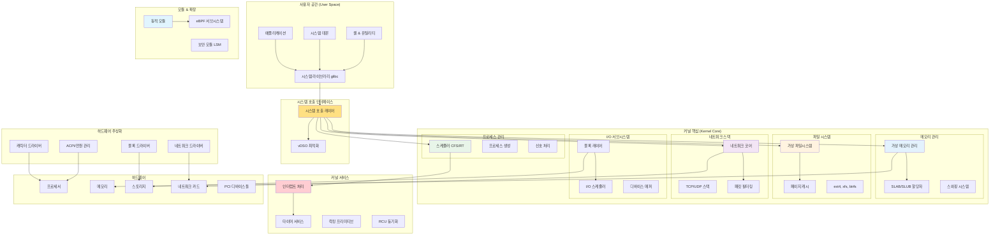

---
tags:
  - intermediate
  - kernel-architecture
  - kernel-modules
  - linux-kernel
  - medium-read
  - monolithic-design
  - subsystems
  - theoretical
  - 시스템프로그래밍
difficulty: INTERMEDIATE
learning_time: "2-3시간"
main_topic: "시스템 프로그래밍"
priority_score: 4
---

# 4.1.2: 커널 아키텍처 개요

## 🎯 리눅스 커널의 심장을 들여다보기

리눅스 커널은 현대 컴퓨터 시스템의 심장입니다. 1991년 21살의 리누스 토르발즈가 시작한 작은 프로젝트가, 30년 후 세계에서 가장 널리 사용되는 운영체제 커널이 되었습니다. 이 복잡하면서도 정교한 시스템을 체계적으로 이해할 수 있도록 5개의 전문화된 섹션으로 나누어 학습합니다.

커널이 정확히 무엇을 하는 걸까요? 간단히 말하면, 커널은 **자원 관리자**입니다. CPU 시간, 메모리, 파일, 네트워크 - 이 모든 자원을 여러 프로그램이 안전하고 효율적으로 공유할 수 있도록 중재하는 것이 커널의 역할입니다.

## 📚 학습 로드맵

이 섹션은 5개의 전문화된 문서로 구성되어 있습니다:

### 1️⃣ [커널 설계 철학과 전체 구조](./04-01-03-kernel-design-philosophy.md)

- 모놀리식 vs 마이크로커널 설계 철학
- 유명한 Torvalds vs Tanenbaum 논쟁
- 리눅스 모듈 시스템의 절충안
- 커널 공간의 메모리 레이아웃
- 커널 심볼 테이블 관리

### 2️⃣ [핵심 서브시스템 탐구](./04-01-05-core-subsystems.md)

- CFS(Completely Fair Scheduler) 동작 원리
- 메모리 관리: VMA와 페이지 테이블
- VFS(Virtual File System) 추상화 계층
- 네트워크 스택의 계층화된 프로토콜 처리
- sk_buff를 통한 패킷 표현

### 3️⃣ [인터럽트 처리와 모듈 시스템](./04-01-06-interrupt-module-system.md)

- 하드/소프트 인터럽트 처리 메커니즘
- IDT(Interrupt Descriptor Table) 구조
- 동적 커널 모듈 로딩 시스템
- 모듈 의존성과 심볼 해결
- 타이머, 네트워크, 블록 I/O 인터럽트 처리

### 4️⃣ [동기화, 메모리 관리, 디버깅](./04-05-01-sync-memory-debug.md)

- 다양한 락 메커니즘 (스핀락, 뮤텍스, RCU)
- 커널 메모리 할당 (kmalloc, vmalloc, slab)
- printk 로깅 시스템과 우선순위
- 커널 OOPS와 패닉 처리
- 안전한 리소스 관리 패턴

### 5️⃣ [실전 커널 모듈 개발](./04-06-01-practical-kernel-module.md)

- "Hello World" 커널 모듈 완전 구현
- proc 파일시스템을 통한 사용자 인터페이스
- 고급 문자 디바이스 드라이버 개발
- ioctl을 통한 제어 인터페이스
- 커널 개발 모범 사례와 체크리스트

## 🎯 핵심 개념 비교표

| 개념 | 모놀리식 접근법 | 마이크로커널 접근법 | 리눅스의 해결책 |
|------|----------------|-------------------|----------------|
| **성능** | 빠른 함수 호출 | IPC 오버헤드 | 모놀리식 + 모듈화 |
| **안정성** | 한 부분 오류시 전체 다운 | 격리된 서비스 | 모듈 격리 + 커널 보호 |
| **확장성** | 컴파일 타임 결정 | 런타임 서비스 추가 | 동적 모듈 로딩 |
| **복잡성** | 단순한 구조 | 복잡한 IPC | 계층화된 추상화 |

## 🚀 실전 활용 시나리오

### 시스템 프로그래머를 위한 활용

- 디바이스 드라이버 개발을 위한 커널 API 이해
- 시스템 호출 최적화를 위한 내부 동작 파악
- 성능 병목 지점 분석과 튜닝

### 운영 엔지니어를 위한 활용

- 시스템 모니터링 지표의 정확한 해석
- 커널 파라미터 튜닝의 원리적 이해
- 장애 상황에서의 커널 로그 분석

### 보안 전문가를 위한 활용

- 커널 익스플로잇의 동작 원리 이해
- 시스템 호출 기반 보안 모델 설계
- 컨테이너 격리 기술의 커널 수준 구현

## 🏗️ 리눅스 커널 전체 아키텍처 개요

커널의 각 서브시스템이 어떻게 상호작용하는지 전체적인 그림을 먼저 이해해봅시다:

## 📊 커널 서브시스템 성능 특성

각 서브시스템의 주요 성능 특성과 최적화 포인트:

| 서브시스템 | 주요 지표 | 최적화 포인트 | 모니터링 도구 |
|-----------|----------|--------------|-------------|
| **프로세스 스케줄러** | 지연시간, 처리량 | CFS 튜닝, CPU 친화성 | `/proc/schedstat`, perf |
| **메모리 관리** | 페이지 폴트, 메모리 사용률 | 페이지 크기, NUMA 설정 | `/proc/meminfo`, vmstat |
| **파일 시스템** | IOPS, 처리량 | 페이지 캐시, I/O 스케줄러 | iostat, iotop |
| **네트워크 스택** | 패킷/초, 지연시간 | 인터럽트 밸런싱, 큐 크기 | ss, netstat, ethtool |
| **인터럽트 처리** | 인터럽트 빈도, CPU 사용률 | IRQ 밸런싱, NAPI | `/proc/interrupts` |

## 🔗 연관 학습

### 선행 학습

- [Chapter 1: 프로세스와 스레드](../chapter-01-process-thread/index.md) - 프로세스 관리 기초
- [Chapter 2: CPU와 인터럽트](../chapter-02-cpu-interrupt/index.md) - 하드웨어 이해
- [Chapter 6: 파일 시스템과 I/O](../chapter-06-file-io/index.md) - 파일시스템 기본

### 후속 학습

- [Chapter 4.1.7: 시스템 호출 내부 구현](./04-01-07-system-call-implementation.md) - 커널-사용자 공간 인터페이스
- [Chapter 17: 보안 엔지니어링](../chapter-17-security-engineering/index.md) - 보안 메커니즘
- [Chapter 11: 성능 최적화](../chapter-11-performance-optimization/index.md) - 고성능 시스템 구현

## 💡 학습 효과 극대화 팁

1. **실습 중심 학습**: 각 섹션의 코드 예제를 직접 실행해보세요
2. **시스템 관찰**: `dmesg`, `/proc`, `/sys` 파일시스템을 적극 활용하세요
3. **점진적 접근**: 간단한 모듈부터 시작해서 복잡한 드라이버로 진행하세요
4. **커뮤니티 참여**: 리눅스 커널 메일링 리스트와 문서를 읽어보세요

---

**시작**: [Chapter 4.1.3: 커널 설계 철학과 전체 구조](./04-01-03-kernel-design-philosophy.md)에서 리눅스 커널의 설계 철학부터 시작합니다.

## 📚 관련 문서

### 📖 현재 문서 정보

- **난이도**: INTERMEDIATE
- **주제**: 시스템 프로그래밍
- **예상 시간**: 2-3시간

### 🎯 학습 경로

- [📚 INTERMEDIATE 레벨 전체 보기](../learning-paths/intermediate/)
- [🏠 메인 학습 경로](../learning-paths/)
- [📋 전체 가이드 목록](../README.md)

### 📂 같은 챕터 (chapter-04-syscall-kernel)

- [Chapter 4.1.1: 시스템 호출 기초와 인터페이스](./04-01-01-system-call-basics.md)
- [Chapter 4.1.3: 커널 설계 철학과 아키텍처 기초](./04-01-03-kernel-design-philosophy.md)
- [Chapter 4.1.4: 커널 설계 구조](./04-01-04-kernel-design-structure.md)
- [Chapter 4.1.5: 핵심 서브시스템 탐구](./04-01-05-core-subsystems.md)
- [Chapter 4.1.6: 인터럽트 처리와 모듈 시스템](./04-01-06-interrupt-module-system.md)

### 🏷️ 관련 키워드

`kernel-architecture`, `linux-kernel`, `monolithic-design`, `kernel-modules`, `subsystems`

### ⏭️ 다음 단계 가이드

- 실무 적용을 염두에 두고 프로젝트에 적용해보세요
- 관련 도구들을 직접 사용해보는 것이 중요합니다
