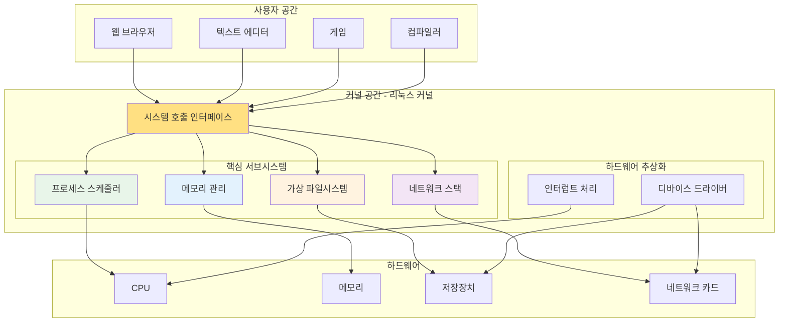
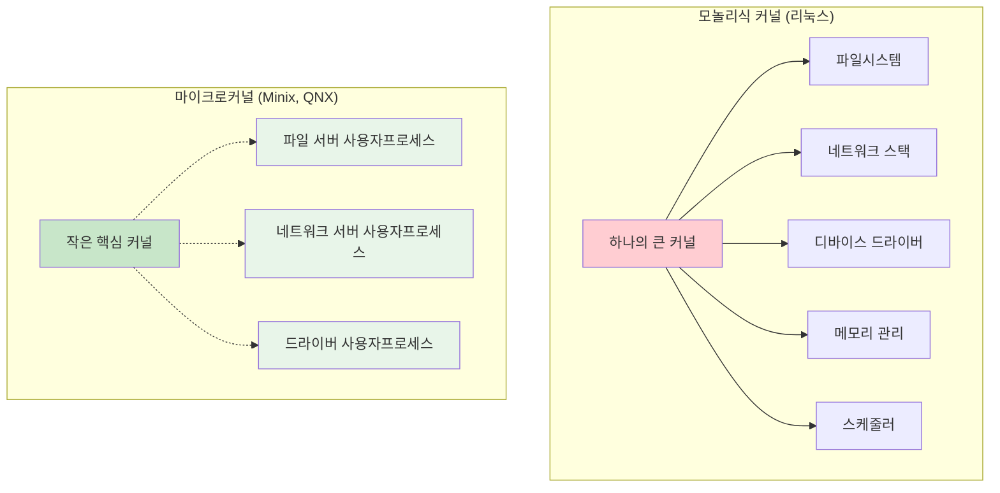
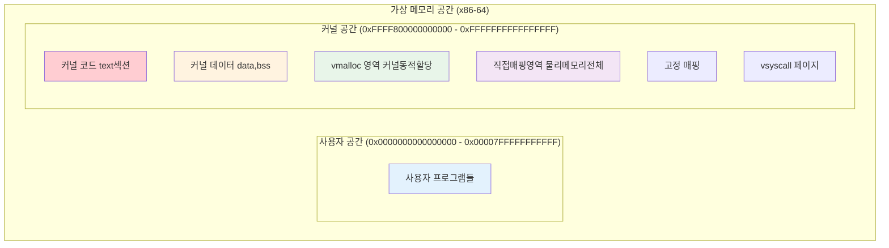

---
tags:
  - architecture
  - intermediate
  - kernel
  - medium-read
  - memory-layout
  - microkernel
  - monolithic
  - theoretical
  - 시스템프로그래밍
difficulty: INTERMEDIATE
learning_time: "3-5시간"
main_topic: "시스템 프로그래밍"
priority_score: 4
---

# 4.1.3: 커널 설계 철학과 아키텍처 기초

## 들어가며: 운영체제의 심장

리눅스 커널은 현대 컴퓨터 시스템의 심장입니다. 1991년 21살의 리누스 토르발즈가 시작한 작은 프로젝트가, 30년 후 세계에서 가장 널리 사용되는 운영체제 커널이 되었습니다.

하지만 커널이 정확히 무엇을 하는 걸까요? 간단히 말하면, 커널은 **자원 관리자**입니다. CPU 시간, 메모리, 파일, 네트워크 - 이 모든 자원을 여러 프로그램이 안전하고 효율적으로 공유할 수 있도록 중재하는 것이 커널의 역할입니다.



이 장에서는 리눅스 커널의 내부 아키텍처를 깊이 있게 탐구하고, 각 서브시스템이 어떻게 협력하여 안정적인 시스템을 만드는지 알아보겠습니다.

## 1. 커널 설계 철학: 모놀리식 vs 마이크로커널

### 1.1 설계 철학의 대결

운영체제 역사상 가장 큰 논쟁 중 하나는 커널 설계 방식입니다. 두 진영의 철학을 비교해봅시다:



### 1.2 유명한 Torvalds vs Tanenbaum 논쟁

1992년, 젊은 리누스 토르발즈와 저명한 컴퓨터 과학자 앤드류 타넨바움 사이의 유명한 논쟁이 있었습니다:

**타넨바움의 주장 (마이크로커널 지지):**

```text
"Linux is obsolete. 모놀리식 커널은 1970년대 기술이다.
마이크로커널이 미래다. 더 안전하고, 더 안정적이며, 더 모듈화되어 있다."
```

**토르발즈의 반박 (모놀리식 커널 지지):**

```text
"성능이 중요하다. IPC(프로세스 간 통신) 오버헤드는 실용적이지 않다.
단순함이 복잡함보다 낫다."
```

30년이 지난 지금, 리눅스는 전 세계를 정복했고, 마이크로커널은 여전히 틈새 시장에 머물러 있습니다. 실용성이 이론적 순수성을 이긴 사례입니다.

### 1.3 모놀리식 커널의 장단점

**장점:**

```c
// 모놀리식 커널에서의 시스템 호출
long sys_write(unsigned int fd, const char __user *buf, size_t count) {
    // 1. 함수 호출로 VFS 접근 (빠름)
    struct file *file = fget(fd);

    // 2. 함수 호출로 파일시스템 접근 (빠름)
    return file->f_op->write(file, buf, count);
}
```

**단점:**

```c
// 커널 패닉을 일으킬 수 있는 코드
void buggy_driver_function() {
    char *ptr = NULL;
    *ptr = 42;  // NULL 포인터 역참조!
    // 전체 시스템이 다운됨
}
```

### 1.4 리눅스의 절충안: 모듈화

리눅스는 모놀리식 커널이지만, **모듈 시스템**을 통해 마이크로커널의 장점을 일부 취했습니다:

```bash
# 현재 로드된 커널 모듈 확인
$ lsmod
Module                  Size  Used by
nvidia_drm             69632  8
nvidia_modeset       1142784  10 nvidia_drm
nvidia              39051264  865 nvidia_modeset
bluetooth             737280  41 btusb,bnep
...

# 새로운 모듈 로드
$ sudo modprobe usbcore

# 모듈 제거
$ sudo rmmod unused_module

# 모듈 정보 확인
$ modinfo ext4
filename:       /lib/modules/5.4.0/kernel/fs/ext4/ext4.ko
license:        GPL
description:    Fourth Extended Filesystem
```

## 2. 리눅스 커널의 전체 구조

### 2.1 커널 공간의 레이아웃

리눅스 커널은 메모리의 특별한 영역에 상주합니다:



### 2.2 커널 이미지 구조

커널이 메모리에 로드되는 과정을 살펴봅시다:

```c
// 커널 링커 스크립트 (vmlinux.lds)의 개념적 구조
SECTIONS
{
    . = LOAD_OFFSET + LOAD_PHYSICAL_ADDR;

    /* 커널 코드 섹션 */
    .text : {
        _text = .;
        *(.text.startup)
        *(.text)
        *(.text.*)
        _etext = .;
    }

    /* 읽기 전용 데이터 */
    .rodata : {
        *(.rodata)
        *(.rodata.*)
    }

    /* 초기화된 데이터 */
    .data : {
        _data = .;
        *(.data)
        _edata = .;
    }

    /* 초기화되지 않은 데이터 */
    .bss : {
        __bss_start = .;
        *(.bss)
        __bss_stop = .;
    }
}
```

### 2.3 커널 심볼 테이블

커널은 내부적으로 방대한 심볼 테이블을 관리합니다:

```bash
# 커널 심볼 테이블 확인
$ cat /proc/kallsyms | head -20
0000000000000000 A fixed_percpu_data
0000000000000000 A __per_cpu_start
0000000000001000 A cpu_debug_store
0000000000002000 A irq_stack_backing_store
0000000000006000 A cpu_tss_rw
...
ffffffff81000000 T _text
ffffffff81000000 T startup_64
ffffffff81000030 T secondary_startup_64
ffffffff81000040 T verify_cpu

# 특정 심볼 찾기
$ grep "sys_write" /proc/kallsyms
ffffffff812a4590 T ksys_write
ffffffff812a45e0 T __x64_sys_write
ffffffff812a45e0 T sys_write
```

## 핵심 요점

### 1. 모놀리식 vs 마이크로커널

리눅스의 모놀리식 설계는 성능상의 장점을 제공하며, 모듈 시스템으로 유연성을 확보했습니다.

### 2. 커널 공간 구조

커널은 가상 메모리의 상위 절반에 위치하며, 코드, 데이터, 동적 할당 영역이 체계적으로 구성됩니다.

### 3. 심볼 테이블 관리

커널은 내부 함수와 변수들을 심볼 테이블로 관리하여 동적 모듈 로딩과 디버깅을 지원합니다.

---

**이전**: [Chapter 4.1.2 개요](./04-01-02-kernel-architecture.md)  
**다음**: [4.1.5: 핵심 서브시스템](./04-01-05-core-subsystems.md)에서 프로세스 스케줄러, 메모리 관리, VFS, 네트워크 스택 등 핵심 서브시스템을 학습합니다.

## 📚 관련 문서

### 📖 현재 문서 정보

- **난이도**: INTERMEDIATE
- **주제**: 시스템 프로그래밍
- **예상 시간**: 3-5시간

### 🎯 학습 경로

- [📚 INTERMEDIATE 레벨 전체 보기](../learning-paths/intermediate/)
- [🏠 메인 학습 경로](../learning-paths/)
- [📋 전체 가이드 목록](../README.md)

### 📂 같은 챕터 (chapter-04-syscall-kernel)

- [Chapter 4.1.1: 시스템 호출 기초와 인터페이스](./04-01-01-system-call-basics.md)
- [Chapter 4.1.2: 리눅스 커널 아키텍처 개요](./04-01-02-kernel-architecture.md)
- [Chapter 4.1.4: 커널 설계 구조](./04-01-04-kernel-design-structure.md)
- [Chapter 4.1.5: 핵심 서브시스템 탐구](./04-01-05-core-subsystems.md)
- [Chapter 4.1.6: 인터럽트 처리와 모듈 시스템](./04-01-06-interrupt-module-system.md)

### 🏷️ 관련 키워드

`kernel`, `monolithic`, `microkernel`, `architecture`, `memory-layout`

### ⏭️ 다음 단계 가이드

- 실무 적용을 염두에 두고 프로젝트에 적용해보세요
- 관련 도구들을 직접 사용해보는 것이 중요합니다
