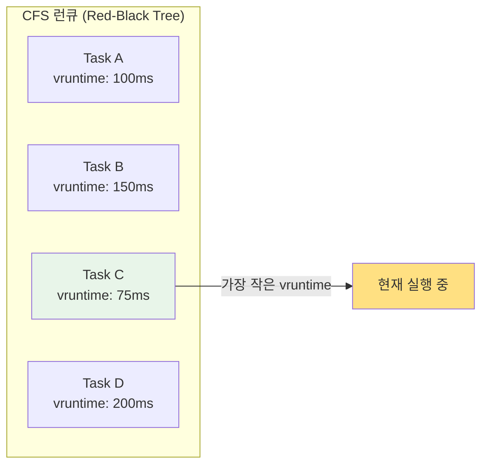
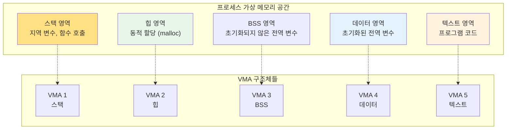
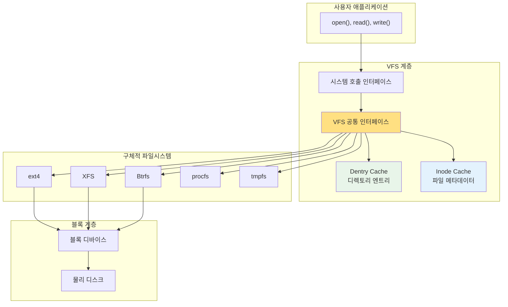
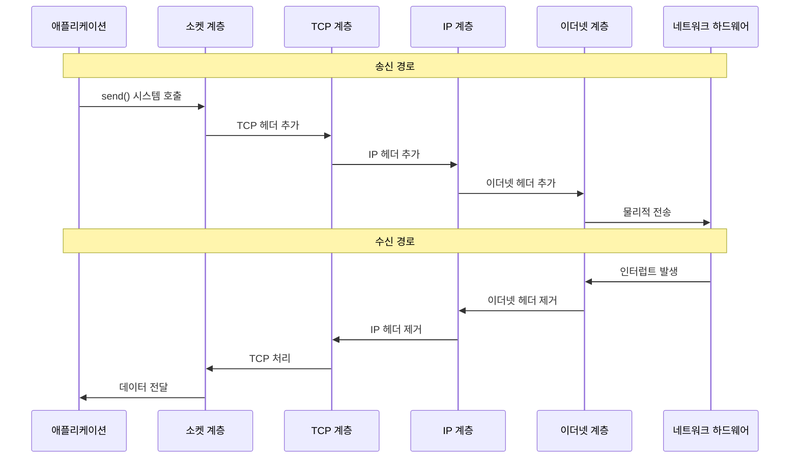

---
tags:
  - intermediate
  - kernel-subsystems
  - medium-read
  - memory-management
  - network-stack
  - scheduler
  - theoretical
  - vfs
  - 시스템프로그래밍
difficulty: INTERMEDIATE
learning_time: "4-6시간"
main_topic: "시스템 프로그래밍"
priority_score: 4
---

# 4.1.5: 커널 핵심 서브시스템

## 이 섹션에서 학습할 내용

- CFS (Completely Fair Scheduler)의 동작 원리
- 커널 메모리 관리 서브시스템의 구조
- VFS (Virtual File System)의 추상화 메커니즘
- 네트워크 스택의 계층화된 프로토콜 처리

## 들어가며: 커널 서브시스템의 협력

리눅스 커널은 여러 전문화된 서브시스템들이 서로 협력하여 동작하는 복잡한 소프트웨어입니다. 각 서브시스템은 특정 자원(CPU, 메모리, 파일, 네트워크)을 관리하는 전문가 역할을 수행하면서도, 다른 서브시스템과 긴밀하게 연결되어 있습니다.

## 1. 프로세스 스케줄러: CFS (Completely Fair Scheduler)

리눅스의 스케줄러는 어떻게 수십만 개의 태스크를 공정하게 관리할까요?

### 1.1 스케줄러 핵심 구조체

```c
// 스케줄러 핵심 구조체 (단순화)
struct task_struct {
    int prio, static_prio, normal_prio;
    struct sched_entity se;
    struct sched_rt_entity rt;
    struct sched_dl_entity dl;

    // 가상 런타임 (CFS의 핵심)
    u64 vruntime;

    // 프로세스 상태
    int state;  // RUNNING, INTERRUPTIBLE, UNINTERRUPTIBLE, etc.

    // 메모리 관리
    struct mm_struct *mm;

    // 파일 디스크립터
    struct files_struct *files;

    // 신호 처리
    struct signal_struct *signal;
};

// CFS 스케줄러의 핵심 알고리즘
static struct task_struct *pick_next_task_fair(struct rq *rq) {
    struct sched_entity *se;
    struct cfs_rq *cfs_rq = &rq->cfs;

    // 적색-흑색 트리에서 가장 왼쪽 노드 선택
    // (가장 작은 vruntime을 가진 태스크)
    se = __pick_first_entity(cfs_rq);
    if (!se)
        return NULL;

    return task_of(se);
}
```

### 1.2 CFS 스케줄링 원리



**CFS의 핵심 아이디어:**

- 각 태스크는 `vruntime` (가상 런타임)을 가짐
- 가장 적은 `vruntime`을 가진 태스크가 다음에 실행됨
- 실행 시간이 늘어날수록 `vruntime`도 증가
- 우선순위가 높을수록 `vruntime` 증가율이 낮음

## 2. 메모리 관리 서브시스템

### 2.1 메모리 관리 핵심 구조체들

```c
// 메모리 관리의 핵심 구조체들
struct mm_struct {
    struct vm_area_struct *mmap;        // VMA 리스트
    struct rb_root mm_rb;               // VMA 적색-흑색 트리

    pgd_t *pgd;                         // 페이지 테이블 디렉토리

    unsigned long start_code, end_code;  // 코드 영역
    unsigned long start_data, end_data;  // 데이터 영역
    unsigned long start_brk, brk;        // 힙 영역
    unsigned long start_stack;           // 스택 영역

    atomic_t mm_users;                   // 참조 카운터
};

// VMA (Virtual Memory Area) - 가상 메모리 영역
struct vm_area_struct {
    unsigned long vm_start;              // 시작 주소
    unsigned long vm_end;                // 끝 주소
    struct vm_area_struct *vm_next;      // 다음 VMA

    pgprot_t vm_page_prot;               // 페이지 보호 속성
    unsigned long vm_flags;              // 플래그 (읽기/쓰기/실행)

    struct file *vm_file;                // 매핑된 파일 (있다면)
    const struct vm_operations_struct *vm_ops;  // 연산들
};
```

### 2.2 가상 메모리 영역 구조



## 3. VFS (Virtual File System): 통합 인터페이스

### 3.1 VFS의 핵심 추상화

```c
// VFS의 핵심 추상화
struct super_block {
    struct list_head s_list;        // 슈퍼블록 리스트
    dev_t s_dev;                    // 디바이스 식별자
    unsigned char s_blocksize_bits;  // 블록 크기
    unsigned long s_blocksize;
    loff_t s_maxbytes;              // 최대 파일 크기
    struct file_system_type *s_type; // 파일시스템 타입

    const struct super_operations *s_op; // 연산 함수들
    struct dentry *s_root;          // 루트 디렉토리
};

struct inode {
    umode_t i_mode;                 // 파일 타입과 권한
    unsigned int i_nlink;           // 하드링크 수
    uid_t i_uid;                    // 소유자 ID
    gid_t i_gid;                    // 그룹 ID
    loff_t i_size;                  // 파일 크기

    const struct inode_operations *i_op;
    const struct file_operations *i_fop;
    struct super_block *i_sb;

    union {
        struct pipe_inode_info *i_pipe;
        struct block_device *i_bdev;
        struct cdev *i_cdev;
    };
};

// 파일 연산 예제 (ext4 파일시스템)
const struct file_operations ext4_file_operations = {
    .llseek         = ext4_llseek,
    .read_iter      = ext4_file_read_iter,
    .write_iter     = ext4_file_write_iter,
    .unlocked_ioctl = ext4_ioctl,
    .mmap           = ext4_file_mmap,
    .open           = ext4_file_open,
    .release        = ext4_release_file,
    .fsync          = ext4_sync_file,
};
```

### 3.2 VFS 계층 구조



## 4. 네트워크 스택: 계층화된 프로토콜

### 4.1 네트워크 스택 구조

```c
// 네트워크 스택의 계층 구조
struct net_protocol {
    int (*handler)(struct sk_buff *skb);
    void (*err_handler)(struct sk_buff *skb, u32 info);
    unsigned int no_policy:1,
                 netns_ok:1,
                 icmp_strict_tag_validation:1;
};

// 소켓 구조체
struct socket {
    socket_state state;             // 소켓 상태
    short type;                     // 소켓 타입 (STREAM, DGRAM, etc.)
    unsigned long flags;
    struct file *file;              // 연관된 파일 객체
    struct sock *sk;                // 프로토콜 특화 데이터
    const struct proto_ops *ops;    // 프로토콜 연산
};

// TCP 소켓 (struct sock의 확장)
struct tcp_sock {
    struct inet_connection_sock inet_conn;

    u32 rcv_nxt;                    // 다음 예상 시퀀스 번호
    u32 snd_nxt;                    // 다음 전송 시퀀스 번호
    u32 snd_una;                    // 확인되지 않은 첫 번째 바이트
    u32 window_clamp;               // 윈도우 크기 제한

    struct sk_buff_head out_of_order_queue; // 순서 없는 패킷 큐
};
```

### 4.2 네트워크 패킷 처리 흐름



### 4.3 sk_buff: 패킷 표현 구조체

```c
// 네트워크 패킷을 표현하는 핵심 구조체
struct sk_buff {
    struct sk_buff *next;           // 리스트 연결
    struct sk_buff *prev;
    
    struct sock *sk;                // 연관된 소켓
    
    unsigned int len;               // 데이터 길이
    unsigned int data_len;          // 페이로드 길이
    
    unsigned char *head;            // 버퍼 시작
    unsigned char *data;            // 현재 데이터 위치
    unsigned char *tail;            // 데이터 끝
    unsigned char *end;             // 버퍼 끝
    
    // 네트워크 헤더 포인터들
    unsigned char *network_header;   // IP 헤더
    unsigned char *transport_header; // TCP/UDP 헤더
    unsigned char *mac_header;       // 이더넷 헤더
};
```

## 핵심 요점

### 1. 스케줄러의 공정성 보장

CFS는 가상 런타임을 통해 모든 프로세스가 공정한 CPU 시간을 받도록 보장합니다.

### 2. 메모리 가상화의 유연성

VMA를 통한 가상 메모리 관리는 프로세스 간 메모리 보호와 효율적인 메모리 사용을 가능하게 합니다.

### 3. VFS의 통합 인터페이스

VFS는 다양한 파일시스템을 동일한 인터페이스로 접근할 수 있게 해주는 강력한 추상화 계층입니다.

### 4. 네트워크 스택의 계층화

계층화된 네트워크 스택은 각 프로토콜의 독립적인 구현과 확장을 가능하게 합니다.

---

**이전**: [04-01-03-kernel-design-philosophy.md](04-01-03-kernel-design-philosophy.md)  
**다음**: [04-01-06-interrupt-module-system.md](04-01-06-interrupt-module-system.md)에서 인터럽트 처리와 커널 모듈 시스템을 학습합니다.

## 📚 관련 문서

### 📖 현재 문서 정보

-**난이도**: INTERMEDIATE
-**주제**: 시스템 프로그래밍
-**예상 시간**: 4-6시간

### 🎯 학습 경로

- [📚 INTERMEDIATE 레벨 전체 보기](../learning-paths/intermediate/)
- [🏠 메인 학습 경로](../learning-paths/)
- [📋 전체 가이드 목록](../README.md)

### 📂 같은 챕터 (chapter-04-syscall-kernel)

- [Chapter 4-1-1: 시스템 호출 기초와 인터페이스](./04-01-01-system-call-basics.md)
- [Chapter 4-1-2: 리눅스 커널 아키텍처 개요](./04-01-02-kernel-architecture.md)
- [Chapter 4-1-3: 커널 설계 철학과 아키텍처 기초](./04-01-03-kernel-design-philosophy.md)
- [Chapter 4-1-3: 커널 설계 철학과 전체 구조](./04-01-04-kernel-design-structure.md)
- [Chapter 4-1-6: 인터럽트 처리와 모듈 시스템](./04-01-06-interrupt-module-system.md)

### 🏷️ 관련 키워드

`kernel-subsystems`, `scheduler`, `memory-management`, `vfs`, `network-stack`

### ⏭️ 다음 단계 가이드

- 실무 적용을 염두에 두고 프로젝트에 적용해보세요
- 관련 도구들을 직접 사용해보는 것이 중요합니다
