---
tags:
  - balanced
  - intermediate
  - kernel-implementation
  - medium-read
  - performance-optimization
  - system-call
  - user-kernel-interface
  - vdso
  - 시스템프로그래밍
difficulty: INTERMEDIATE
learning_time: "4-6시간"
main_topic: "시스템 프로그래밍"
priority_score: 4
---

# 4.1.7: 시스템 호출 구현

## 이 문서를 읽으면 답할 수 있는 질문들

- 시스템 호출이 커널 내부에서 어떤 과정을 거쳐 처리되는가?
- 매개변수는 어떻게 검증되고 전달되는가?
- 사용자 공간과 커널 공간 간 데이터 복사는 어떻게 이루어지는가?
- errno는 언제, 어떻게 설정되는가?
- VDSO는 어떻게 시스템 호출을 최적화하는가?

## 들어가며: 시스템 호출의 여행

사용자가 `write(fd, buffer, size)`를 호출하는 순간부터 실제 하드웨어에 데이터가 쓰이기까지, 그 사이에는 복잡하면서도 정교한 메커니즘이 동작합니다. 이는 마치 편지를 보내는 과정과 같습니다 - 우편함에 넣는 순간부터 수신자에게 도달하기까지 많은 중간 과정이 필요합니다.

이 장에서는 시스템 호출의 이 복잡한 여정을 단계별로 따라가며, 각 단계에서 일어나는 일들을 상세히 탐구해보겠습니다.

```mermaid
graph TD
    subgraph USER_SPACE["사용자 공간"]
        A[write함수호출]
        B[glibc 래퍼 함수]
        C[시스템 호출 준비]
    end
    
    subgraph SYSCALL_IF["시스템 호출 인터페이스"]
        D[syscall 명령어]
        E[커널 모드 진입]
        F[시스템 호출 디스패처]
    end
    
    subgraph KERNEL_PROCESS["커널 내부 처리"]
        G[매개변수 검증]
        H[보안 검사]
        I[실제 처리 함수 호출]
        J[결과 처리]
    end
    
    subgraph HARDWARE["하드웨어 접근"]
        K[VFS 레이어]
        L[파일시스템 드라이버]
        M[블록 디바이스 드라이버]
        N[하드웨어 I/O]
    end
    
    A --> B --> C --> D
    D --> E --> F --> G
    G --> H --> I --> J
    I --> K --> L --> M --> N
    J --> E
    
    style A fill:#E3F2FD
    style D fill:#FFE082
    style G fill:#E8F5E9
    style N fill:#FFCDD2
```



## 1. 시스템 호출 테이블과 디스패처

### 1.1 시스템 호출 테이블의 구조

커널의 심장부에는 시스템 호출 번호를 실제 구현 함수로 매핑하는 거대한 테이블이 있습니다:

```c
// arch/x86/entry/syscalls/syscall_64.tbl (일부)
// NR    abi  name           entry point
#define __NR_read            0
#define __NR_write           1  
#define __NR_open            2
#define __NR_close           3
...
#define __NR_openat        257
#define __NR_copy_file_range 326

// 실제 시스템 호출 테이블 (단순화)
const sys_call_ptr_t sys_call_table[__NR_syscall_max+1] = {
    [0]   = sys_read,
    [1]   = sys_write,
    [2]   = sys_open,
    [3]   = sys_close,
    // ... 400개 이상의 시스템 호출
    [257] = sys_openat,
    [326] = sys_copy_file_range,
};

// 시스템 호출 함수 포인터 타입
typedef asmlinkage long (*sys_call_ptr_t)(const struct pt_regs *);
```

### 1.2 시스템 호출 디스패처

시스템 호출이 들어오면 커널의 디스패처가 이를 적절한 함수로 라우팅합니다:

```c
// arch/x86/entry/common.c의 핵심 로직 (단순화)
asmlinkage void do_syscall_64(unsigned long nr, struct pt_regs *regs) {
    struct thread_info *ti = current_thread_info();
    
    // 1. 시스템 호출 번호 검증
    if (unlikely(nr >= NR_syscalls)) {
        regs->ax = -ENOSYS;
        return;
    }
    
    // 2. 보안 검사 (seccomp, ptrace 등)
    nr = syscall_trace_enter(regs);
    if (nr >= NR_syscalls || nr < 0) {
        regs->ax = -ENOSYS;
        return;
    }
    
    // 3. 실제 시스템 호출 실행
    regs->ax = sys_call_table[nr](regs);
    
    // 4. 후처리 (추적, 신호 처리 등)
    syscall_trace_exit(regs);
}

// 시스템 호출 진입점 (어셈블리에서 호출)
ENTRY(entry_SYSCALL_64)
    /* 레지스터 저장 */
    movq %rax, %rdi     /* 시스템 호출 번호 */
    movq %rsp, %rsi     /* pt_regs 포인터 */
    call do_syscall_64
    /* 레지스터 복원 후 사용자 모드로 복귀 */
ENDPROC(entry_SYSCALL_64)
```

### 1.3 매개변수 전달 메커니즘

x86-64에서 시스템 호출 매개변수는 특정 레지스터를 통해 전달됩니다:

```c
// 레지스터별 매개변수 매핑
struct pt_regs {
    unsigned long r15, r14, r13, r12, bp, bx;
    unsigned long r11, r10, r9, r8;
    unsigned long ax, cx, dx, si, di;   // 시스템 호출에 사용되는 레지스터들
    unsigned long orig_ax;              // 원본 시스템 호출 번호
    unsigned long ip, cs, flags, sp, ss;
};

// 매개변수 추출 헬퍼 함수들
static inline long syscall_get_nr(struct task_struct *task, struct pt_regs *regs) {
    return regs->orig_ax;
}

static inline void syscall_get_arguments(struct task_struct *task,
                                       struct pt_regs *regs,
                                       unsigned int i, unsigned int n,
                                       unsigned long *args) {
    // x86-64 시스템 호출 ABI:
    // rdi: 1번째 인자
    // rsi: 2번째 인자  
    // rdx: 3번째 인자
    // r10: 4번째 인자 (rcx는 syscall에서 덮어씀)
    // r8:  5번째 인자
    // r9:  6번째 인자
    
    static const unsigned int reg_offset[] = {
        offsetof(struct pt_regs, di),
        offsetof(struct pt_regs, si),
        offsetof(struct pt_regs, dx),
        offsetof(struct pt_regs, r10),
        offsetof(struct pt_regs, r8),
        offsetof(struct pt_regs, r9),
    };
    
    for (unsigned int j = 0; j < n; j++) {
        args[j] = *(unsigned long *)((char *)regs + reg_offset[i + j]);
    }
}
```

## 2. 실제 시스템 호출 구현 예제

### 2.1 sys_write() 시스템 호출 분석

`write()` 시스템 호출의 전체 구현을 따라가 봅시다:

```c
// fs/read_write.c
SYSCALL_DEFINE3(write, unsigned int, fd, const char __user *, buf, size_t, count)
{
    return ksys_write(fd, buf, count);
}

// SYSCALL_DEFINE3 매크로가 실제로 생성하는 코드:
asmlinkage long sys_write(const struct pt_regs *regs)
{
    return __se_sys_write(regs->di, regs->si, regs->dx);
}

static inline long __se_sys_write(unsigned long fd, unsigned long buf, unsigned long count)
{
    return __do_sys_write((unsigned int)fd, (const char __user *)buf, (size_t)count);
}

static inline long __do_sys_write(unsigned int fd, const char __user *buf, size_t count)
{
    return ksys_write(fd, buf, count);
}

// 실제 구현
ssize_t ksys_write(unsigned int fd, const char __user *buf, size_t count)
{
    struct fd f = fdget_pos(fd);           // 파일 디스크립터 얻기
    ssize_t ret = -EBADF;
    
    if (f.file) {
        loff_t pos = file_pos_read(f.file);     // 현재 파일 위치
        ret = vfs_write(f.file, buf, count, &pos);  // VFS 레이어 호출
        if (ret >= 0)
            file_pos_write(f.file, pos);         // 파일 위치 업데이트
        fdput_pos(f);                           // 파일 디스크립터 해제
    }
    
    return ret;
}
```

### 2.2 VFS 레이어에서의 처리

```c
// fs/read_write.c
ssize_t vfs_write(struct file *file, const char __user *buf, size_t count, loff_t *pos)
{
    ssize_t ret;
    
    // 1. 기본적인 검증
    if (!(file->f_mode & FMODE_WRITE))
        return -EBADF;
    if (!(file->f_mode & FMODE_CAN_WRITE))
        return -EINVAL;
    if (unlikely(!access_ok(buf, count)))  // 사용자 메모리 접근 가능성 검사
        return -EFAULT;
    
    ret = rw_verify_area(WRITE, file, pos, count);  // 권한 검사
    if (ret)
        return ret;
    
    if (count > MAX_RW_COUNT)
        count = MAX_RW_COUNT;
    
    // 2. 실제 쓰기 연산
    if (file->f_op->write_iter) {
        // 현대적인 방식: iterator 사용
        struct iov_iter iter;
        iov_iter_init(&iter, WRITE, &iov, 1, count);
        ret = file->f_op->write_iter(&iocb, &iter);
    } else if (file->f_op->write) {
        // 전통적인 방식
        ret = file->f_op->write(file, buf, count, pos);
    } else {
        ret = -EINVAL;
    }
    
    if (ret > 0) {
        fsnotify_modify(file);          // 파일 시스템 이벤트 알림
        add_wchar(current, ret);        // 통계 업데이트
    }
    inc_syscw(current);                 // 시스템 호출 쓰기 카운터 증가
    
    return ret;
}
```

### 2.3 에러 처리와 errno 설정

```c
// 에러 처리 메커니즘
#define EBADF       9   /* Bad file number */
#define EFAULT     14   /* Bad address */
#define EINVAL     22   /* Invalid argument */
#define ENOSYS     38   /* Function not implemented */

// glibc에서 시스템 호출 래퍼가 하는 일
long syscall_wrapper(long number, ...) {
    long result = raw_syscall(number, ...);
    
    if (result < 0 && result >= -4095) {  // 에러 범위 (-4095 ~ -1)
        errno = -result;                   // errno에 양수 에러 코드 설정
        return -1;                         // 사용자에게는 -1 반환
    }
    
    return result;                         // 성공시 실제 반환값
}

// 커널 내부에서 에러 반환
ssize_t my_syscall_implementation(void) {
    if (invalid_parameter)
        return -EINVAL;    // 커널에서는 음수 에러 코드 반환
        
    if (permission_denied)
        return -EACCES;
        
    // 성공시 양수 또는 0 반환
    return bytes_processed;
}
```

## 3. 사용자-커널 공간 데이터 교환

### 3.1 메모리 접근 검증

사용자 공간의 포인터를 커널에서 사용하기 전에는 반드시 검증이 필요합니다:

```c
// include/linux/uaccess.h
static inline int access_ok(const void __user *addr, unsigned long size)
{
    return likely(__access_ok(addr, size));
}

// arch/x86/include/asm/uaccess.h
static inline int __access_ok(const void __user *addr, unsigned long size)
{
    unsigned long limit = current_thread_info()->addr_limit.seg;
    
    return (size <= limit) && (addr <= (void __user *)(limit - size));
}

// 사용 예제
SYSCALL_DEFINE3(write, unsigned int, fd, const char __user *, buf, size_t, count)
{
    // 1. 먼저 사용자 버퍼가 유효한지 검사
    if (!access_ok(buf, count))
        return -EFAULT;
    
    // 2. 이후 안전하게 사용자 데이터에 접근
    return ksys_write(fd, buf, count);
}
```

### 3.2 안전한 데이터 복사

```c
// 사용자 공간에서 커널 공간으로 복사
unsigned long copy_from_user(void *to, const void __user *from, unsigned long n)
{
    if (likely(check_copy_size(to, n, false)))
        n = raw_copy_from_user(to, from, n);
    return n;
}

// 커널 공간에서 사용자 공간으로 복사
unsigned long copy_to_user(void __user *to, const void *from, unsigned long n)
{
    if (likely(check_copy_size(from, n, true)))
        n = raw_copy_to_user(to, from, n);
    return n;
}

// 단일 값 복사 (더 효율적)
#define get_user(x, ptr) __get_user(x, ptr)
#define put_user(x, ptr) __put_user(x, ptr)

// 실제 사용 예제
long sys_example(int __user *user_int, char __user *user_buf, size_t len)
{
    int kernel_int;
    char *kernel_buf;
    
    // 1. 사용자로부터 정수값 복사
    if (get_user(kernel_int, user_int))
        return -EFAULT;
    
    // 2. 커널 버퍼 할당
    kernel_buf = kmalloc(len, GFP_KERNEL);
    if (!kernel_buf)
        return -ENOMEM;
    
    // 3. 사용자 버퍼를 커널 버퍼로 복사
    if (copy_from_user(kernel_buf, user_buf, len)) {
        kfree(kernel_buf);
        return -EFAULT;
    }
    
    // 4. 처리 수행...
    process_data(kernel_buf, len);
    
    // 5. 결과를 사용자 공간으로 복사
    if (copy_to_user(user_buf, kernel_buf, len)) {
        kfree(kernel_buf);
        return -EFAULT;
    }
    
    kfree(kernel_buf);
    return 0;
}
```

### 3.3 페이지 폴트와 예외 처리

사용자 공간 접근 중 페이지 폴트가 발생할 수 있습니다:

```c
// 예외 처리가 있는 메모리 접근
static inline unsigned long __copy_from_user_inatomic(void *to,
                                                     const void __user *from,
                                                     unsigned long n)
{
    pagefault_disable();  // 페이지 폴트 비활성화
    unsigned long ret = raw_copy_from_user(to, from, n);
    pagefault_enable();   // 페이지 폴트 재활성화
    return ret;
}

// 페이지 폴트 핸들러에서 사용자 공간 접근 예외 처리
int fixup_exception(struct pt_regs *regs)
{
    const struct exception_table_entry *fixup;
    
    fixup = search_exception_tables(regs->ip);
    if (fixup) {
        regs->ip = fixup->fixup;    // 예외 처리 코드로 점프
        return 1;
    }
    
    return 0;
}
```

## 4. 성능 최적화와 VDSO

### 4.1 VDSO (Virtual Dynamic Shared Object)

자주 사용되는 시스템 호출들을 최적화하기 위해 VDSO를 사용합니다:

```c
// arch/x86/entry/vdso/vclock_gettime.c
notrace int __vdso_gettimeofday(struct timeval *tv, struct timezone *tz)
{
    if (likely(tv != NULL)) {
        struct timespec ts;
        if (do_realtime(&ts) == VCLOCK_NONE)
            return vdso_fallback_gtod(tv, tz);  // 시스템 호출로 폴백
        
        tv->tv_sec = ts.tv_sec;
        tv->tv_usec = ts.tv_nsec / 1000;
    }
    
    if (unlikely(tz != NULL)) {
        tz->tz_minuteswest = gtod->sys_tz.tz_minuteswest;
        tz->tz_dsttime = gtod->sys_tz.tz_dsttime;
    }
    
    return 0;
}

// 시계 읽기 (시스템 호출 없이!)
notrace static int do_realtime(struct timespec *ts)
{
    unsigned long seq;
    u64 ns;
    int mode;
    
    do {
        seq = gtod_read_begin(gtod);
        mode = gtod->vclock_mode;
        
        if (mode == VCLOCK_NONE)
            return VCLOCK_NONE;
            
        ts->tv_sec = gtod->wall_time_sec;
        ns = gtod->wall_time_snsec;
        ns += vgetsns(&mode);
        ns >>= gtod->shift;
    } while (unlikely(gtod_read_retry(gtod, seq)));
    
    ts->tv_sec += __iter_div_u64_rem(ns, NSEC_PER_SEC, &ns);
    ts->tv_nsec = ns;
    
    return mode;
}
```

### 4.2 Fast Path 최적화

```c
// 빠른 경로 최적화 예제 (read 시스템 호출)
ssize_t vfs_read(struct file *file, char __user *buf, size_t count, loff_t *pos)
{
    ssize_t ret;
    
    // Fast path: 작은 읽기 요청은 빠르게 처리
    if (count <= PAGE_SIZE && (file->f_flags & O_NONBLOCK) == 0) {
        ret = file->f_op->read_iter(...);  // 직접 호출
        if (ret > 0)
            return ret;
    }
    
    // Slow path: 복잡한 처리 (버퍼링, 동기화 등)
    return generic_file_read_iter(...);
}

// 캐시 최적화
static ssize_t generic_perform_write(struct file *file,
                                    struct iov_iter *i, loff_t pos)
{
    struct address_space *mapping = file->f_mapping;
    const struct address_space_operations *a_ops = mapping->a_ops;
    
    do {
        struct page *page;
        unsigned long offset;   // 페이지 내 오프셋
        unsigned long bytes;    // 이번에 쓸 바이트 수
        size_t copied;          // 실제로 복사된 바이트 수
        void *fsdata;
        
        offset = (pos & (PAGE_SIZE - 1));
        bytes = min_t(unsigned long, PAGE_SIZE - offset, iov_iter_count(i));
        
        // 페이지 캐시에서 페이지 찾기 또는 할당
        page = grab_cache_page_write_begin(mapping, pos >> PAGE_SHIFT, flags);
        if (!page) {
            status = -ENOMEM;
            break;
        }
        
        // 사용자 데이터를 페이지로 복사
        copied = iov_iter_copy_from_user_atomic(page, i, offset, bytes);
        flush_dcache_page(page);
        
        // 페이지를 dirty로 표시하고 해제
        status = a_ops->write_end(file, mapping, pos, bytes, copied, page, fsdata);
        
        pos += copied;
        written += copied;
        
        balance_dirty_pages_ratelimited(mapping);  // 더티 페이지 관리
        
    } while (iov_iter_count(i));
    
    return written ? written : status;
}
```

## 5. 시스템 호출별 특수 처리

### 5.1 fork() 시스템 호출의 복잡성

```c
// kernel/fork.c - 프로세스 복제
SYSCALL_DEFINE0(fork)
{
#ifdef CONFIG_MMU
    return _do_fork(SIGCHLD, 0, 0, NULL, NULL, 0);
#else
    return -ENOSYS;  // MMU가 없는 시스템에서는 지원 안함
#endif
}

long _do_fork(unsigned long clone_flags,
              unsigned long stack_start,
              unsigned long stack_size,
              int __user *parent_tidptr,
              int __user *child_tidptr,
              unsigned long tls)
{
    struct task_struct *p;
    int trace = 0;
    pid_t nr;
    
    // 1. 새 태스크 구조체 복제
    p = copy_process(clone_flags, stack_start, stack_size,
                     child_tidptr, NULL, trace, tls, NUMA_NO_NODE);
    
    if (IS_ERR(p))
        return PTR_ERR(p);
    
    // 2. PID 할당
    nr = task_pid_vnr(p);
    
    if (clone_flags & CLONE_PARENT_SETTID)
        put_user(nr, parent_tidptr);
    
    // 3. 자식 프로세스 활성화
    wake_up_new_task(p);
    
    // 4. ptrace 처리
    if (unlikely(trace))
        ptrace_event_pid(trace, pid);
    
    return nr;  // 부모에게는 자식 PID 반환
}
```

### 5.2 execve() 시스템 호출

```c
// fs/exec.c
SYSCALL_DEFINE3(execve,
                const char __user *, filename,
                const char __user *const __user *, argv,
                const char __user *const __user *, envp)
{
    return do_execve(getname(filename), argv, envp);
}

static int do_execve(struct filename *filename,
                     const char __user *const __user *__argv,
                     const char __user *const __user *__envp)
{
    struct user_arg_ptr argv = { .ptr.native = __argv };
    struct user_arg_ptr envp = { .ptr.native = __envp };
    
    return do_execveat_common(AT_FDCWD, filename, argv, envp, 0);
}

// 실제 exec 처리
static int do_execveat_common(int fd, struct filename *filename,
                              struct user_arg_ptr argv,
                              struct user_arg_ptr envp,
                              int flags)
{
    struct linux_binprm *bprm;
    struct file *file;
    int retval;
    
    // 1. 실행 파일 열기
    file = do_open_execat(fd, filename, flags);
    retval = PTR_ERR(file);
    if (IS_ERR(file))
        goto out_ret;
    
    // 2. 바이너리 실행 컨텍스트 준비
    bprm = kzalloc(sizeof(*bprm), GFP_KERNEL);
    if (!bprm)
        goto out_files;
    
    retval = prepare_bprm_creds(bprm);
    if (retval)
        goto out_free;
    
    // 3. 인자와 환경변수 복사
    retval = copy_strings_kernel(1, &bprm->filename, bprm);
    if (retval < 0)
        goto out;
    
    retval = copy_strings(bprm, envp, envp);
    if (retval < 0)
        goto out;
    
    retval = copy_strings(bprm, argv, argv);
    if (retval < 0)
        goto out;
    
    // 4. 바이너리 실행
    retval = exec_binprm(bprm);
    if (retval < 0)
        goto out;
    
    return retval;
}
```

### 5.3 mmap() 시스템 호출

```c
// mm/mmap.c  
SYSCALL_DEFINE6(mmap, unsigned long, addr, unsigned long, len,
                unsigned long, prot, unsigned long, flags,
                unsigned long, fd, unsigned long, off)
{
    long retval;
    
    if (offset_in_page(off))
        return -EINVAL;
        
    retval = vm_mmap_pgoff(file, addr, len, prot, flags, off >> PAGE_SHIFT);
    return retval;
}

unsigned long vm_mmap_pgoff(struct file *file, unsigned long addr,
                           unsigned long len, unsigned long prot,
                           unsigned long flag, unsigned long pgoff)
{
    unsigned long ret;
    struct mm_struct *mm = current->mm;
    
    if (down_write_killable(&mm->mmap_sem))
        return -EINTR;
        
    ret = do_mmap_pgoff(file, addr, len, prot, flag, pgoff, &populate);
    up_write(&mm->mmap_sem);
    
    if (populate)
        mm_populate(ret, populate);
        
    return ret;
}

// 실제 메모리 매핑 수행
unsigned long do_mmap_pgoff(struct file *file, unsigned long addr,
                           unsigned long len, unsigned long prot,
                           unsigned long flags, unsigned long pgoff,
                           unsigned long *populate)
{
    struct mm_struct *mm = current->mm;
    vm_flags_t vm_flags;
    
    *populate = 0;
    
    // 1. 매개변수 검증
    if (!len)
        return -EINVAL;
    
    if (!(flags & MAP_FIXED))
        addr = round_hint_to_min(addr);
    
    len = PAGE_ALIGN(len);
    if (!len)
        return -ENOMEM;
    
    // 2. 가상 메모리 영역 찾기
    addr = get_unmapped_area(file, addr, len, pgoff, flags);
    if (offset_in_page(addr))
        return addr;
    
    // 3. VMA 생성 및 삽입
    vm_flags = calc_vm_prot_bits(prot) | calc_vm_flag_bits(flags) |
               mm->def_flags | VM_MAYREAD | VM_MAYWRITE | VM_MAYEXEC;
    
    return mmap_region(file, addr, len, vm_flags, pgoff);
}
```

## 6. 시스템 호출 성능 분석

### 6.1 성능 측정 도구

```c
// performance_benchmark.c - 시스템 호출 성능 측정
#include <stdio.h>
#include <time.h>
#include <unistd.h>
#include <sys/syscall.h>

#define ITERATIONS 1000000

void benchmark_syscall(const char* name, long (*func)(void)) {
    struct timespec start, end;
    long total_time, avg_time;
    
    // 워밍업
    for (int i = 0; i < 1000; i++) {
        func();
    }
    
    // 실제 측정
    clock_gettime(CLOCK_MONOTONIC, &start);
    for (int i = 0; i < ITERATIONS; i++) {
        func();
    }
    clock_gettime(CLOCK_MONOTONIC, &end);
    
    total_time = (end.tv_sec - start.tv_sec) * 1000000000L + 
                 (end.tv_nsec - start.tv_nsec);
    avg_time = total_time / ITERATIONS;
    
    printf("%s: %ld ns per call, ", name, avg_time);
}

// 테스트할 시스템 호출들
long test_getpid(void) { return getpid(); }
long test_gettid(void) { return syscall(SYS_gettid); }
long test_getuid(void) { return getuid(); }
long test_time(void) { return time(NULL); }

int main() {
    printf("시스템 호출 성능 벤치마크 (%d iterations), ", ITERATIONS);
    printf("==========================================, ");
    
    benchmark_syscall("getpid()", test_getpid);
    benchmark_syscall("gettid()", test_gettid);
    benchmark_syscall("getuid()", test_getuid);
    benchmark_syscall("time()", test_time);
    
    return 0;
}
```

### 6.2 시스템 호출 추적 및 프로파일링

```c
// syscall_tracer.c - 시스템 호출 추적기
#include <stdio.h>
#include <sys/ptrace.h>
#include <sys/wait.h>
#include <sys/user.h>
#include <unistd.h>

const char* syscall_names[] = {
    [0] = "read", [1] = "write", [2] = "open", [3] = "close",
    [4] = "stat", [5] = "fstat", [6] = "lstat", [7] = "poll",
    // ... 더 많은 시스템 호출들
};

void trace_syscalls(pid_t child_pid) {
    int status;
    struct user_regs_struct regs;
    int in_syscall = 0;
    
    while (1) {
        wait(&status);
        
        if (WIFEXITED(status))
            break;
            
        ptrace(PTRACE_GETREGS, child_pid, 0, &regs);
        
        if (!in_syscall) {
            // 시스템 호출 진입
            printf("syscall %s(", syscall_names[regs.orig_rax % 512]);
            printf("0x%llx, 0x%llx, 0x%llx", regs.rdi, regs.rsi, regs.rdx);
            printf(") = ");
            in_syscall = 1;
        } else {
            // 시스템 호출 종료
            printf("%lld, ", regs.rax);
            in_syscall = 0;
        }
        
        ptrace(PTRACE_SYSCALL, child_pid, 0, 0);
    }
}

int main(int argc, char**argv) {
    if (argc < 2) {
        printf("Usage: %s <command>, ", argv[0]);
        return 1;
    }
    
    pid_t child_pid = fork();
    
    if (child_pid == 0) {
        ptrace(PTRACE_TRACEME, 0, 0, 0);
        execvp(argv[1], &argv[1]);
    } else {
        trace_syscalls(child_pid);
    }
    
    return 0;
}
```

## 7. 고급 최적화 기법

### 7.1 배치 시스템 호출

```c
// 여러 작업을 하나의 시스템 호출로 처리
#include <sys/uio.h>

ssize_t efficient_write_multiple(int fd, const char* buffers[], size_t sizes[], int count) {
    struct iovec *iov = malloc(sizeof(struct iovec) * count);
    if (!iov) return -1;
    
    for (int i = 0; i < count; i++) {
        iov[i].iov_base = (void*)buffers[i];
        iov[i].iov_len = sizes[i];
    }
    
    ssize_t result = writev(fd, iov, count);  // 하나의 시스템 호출로 여러 버퍼 쓰기
    free(iov);
    return result;
}

// io_uring을 사용한 비동기 배치 처리
#ifdef HAVE_IO_URING
#include <liburing.h>

int async_batch_operations(void) {
    struct io_uring ring;
    struct io_uring_sqe *sqe;
    struct io_uring_cqe *cqe;
    
    io_uring_queue_init(256, &ring, 0);
    
    // 여러 비동기 작업을 큐에 추가
    for (int i = 0; i < 10; i++) {
        sqe = io_uring_get_sqe(&ring);
        io_uring_prep_read(sqe, fd, buffer[i], size, offset[i]);
    }
    
    // 모든 작업을 한 번에 제출
    io_uring_submit(&ring);
    
    // 결과 수집
    for (int i = 0; i < 10; i++) {
        io_uring_wait_cqe(&ring, &cqe);
        // 결과 처리
        io_uring_cqe_seen(&ring, cqe);
    }
    
    io_uring_queue_exit(&ring);
    return 0;
}
#endif
```

### 7.2 사용자 공간 캐싱

```c
// 시스템 호출 결과 캐싱
struct cached_stat {
    char path[PATH_MAX];
    struct stat st;
    time_t cache_time;
    int valid;
};

static struct cached_stat stat_cache[1024];
static int cache_size = 0;

int cached_stat(const char* path, struct stat* st) {
    time_t now = time(NULL);
    
    // 캐시에서 찾기
    for (int i = 0; i < cache_size; i++) {
        if (stat_cache[i].valid && 
            strcmp(stat_cache[i].path, path) == 0 &&
            (now - stat_cache[i].cache_time) < 5) {  // 5초 캐시
            
            *st = stat_cache[i].st;
            return 0;  // 캐시 히트 - 시스템 호출 없음!
        }
    }
    
    // 캐시 미스 - 실제 시스템 호출
    int result = stat(path, st);
    if (result == 0 && cache_size < 1024) {
        // 결과를 캐시에 저장
        strncpy(stat_cache[cache_size].path, path, PATH_MAX);
        stat_cache[cache_size].st = *st;
        stat_cache[cache_size].cache_time = now;
        stat_cache[cache_size].valid = 1;
        cache_size++;
    }
    
    return result;
}
```

## 8. 정리: 시스템 호출 구현의 핵심

### 8.1 설계 원칙들

```mermaid
mindmap
  root((시스템 호출 구현))
    보안
      매개변수 검증
      권한 검사
      메모리 접근 검증
      Capability 시스템
    성능
      Fast Path 최적화
      VDSO 활용
      캐싱 전략
      배치 처리
    안정성
      에러 처리
      리소스 관리
      원자성 보장
      복구 메커니즘
    확장성
      모듈화 설계
      플러그인 아키텍처
      버전 호환성
      하위 호환성
```



### 8.2 성능 최적화 체크리스트

1.**시스템 호출 최소화**

- 여러 작업을 하나로 배치
- 캐싱으로 중복 호출 방지
- 비동기 I/O 활용

2.**메모리 복사 최소화**

- Zero-copy 기법 사용
- 적절한 버퍼 크기 선택
- mmap 활용

3.**커널 구현 최적화**

- Fast path 제공
- 락 경합 최소화
- CPU 캐시 친화적 데이터 구조

4.**에러 처리 효율성**

- 빠른 실패 (fail-fast)
- 적절한 에러 코드 사용
- 복구 가능한 오류와 치명적 오류 구분

## 다음 단계

다음 섹션([Chapter 4.2.3: 커널-사용자공간 통신 메커니즘](./04-02-03-kernel-communication.md))에서는 시스템 호출 외의 다양한 커널-사용자 공간 통신 방법들을 탐구합니다:

- procfs와 sysfs를 통한 정보 교환
- netlink 소켓을 이용한 실시간 통신
- 공유 메모리와 mmap 활용
- 신호(signal)와 eventfd 메커니즘
- BPF/eBPF 프로그래밍 기초

시스템 호출의 내부 구현을 이해했으니, 이제 더 다양하고 효율적인 커널 통신 메커니즘들을 살펴보겠습니다.

## 📚 관련 문서

### 📖 현재 문서 정보

-**난이도**: INTERMEDIATE
-**주제**: 시스템 프로그래밍
-**예상 시간**: 4-6시간

### 🎯 학습 경로

- [📚 INTERMEDIATE 레벨 전체 보기](../learning-paths/intermediate/)
- [🏠 메인 학습 경로](../learning-paths/)
- [📋 전체 가이드 목록](../README.md)

### 📂 같은 챕터 (chapter-04-syscall-kernel)

- [Chapter 4-1-1: 시스템 호출 기초와 인터페이스](./04-01-01-system-call-basics.md)
- [Chapter 4-1-2: 리눅스 커널 아키텍처 개요](./04-01-02-kernel-architecture.md)
- [Chapter 4-1-3: 커널 설계 철학과 아키텍처 기초](./04-01-03-kernel-design-philosophy.md)
- [Chapter 4-1-3: 커널 설계 철학과 전체 구조](./04-01-04-kernel-design-structure.md)
- [Chapter 4-1-5: 핵심 서브시스템 탐구](./04-01-05-core-subsystems.md)

### 🏷️ 관련 키워드

`system-call`, `kernel-implementation`, `user-kernel-interface`, `performance-optimization`, `vdso`

### ⏭️ 다음 단계 가이드

- 실무 적용을 염두에 두고 프로젝트에 적용해보세요
- 관련 도구들을 직접 사용해보는 것이 중요합니다
