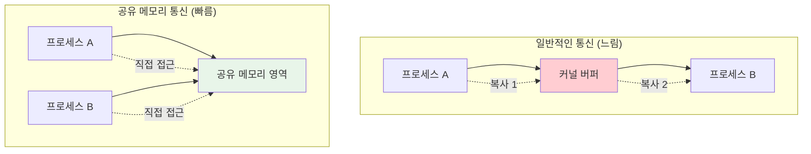

---
tags:
  - fundamentals
  - hands-on
  - medium-read
  - producer-consumer
  - semaphore
  - shared-memory
  - system-v-ipc
  - zero-copy
  - 시스템프로그래밍
difficulty: FUNDAMENTALS
learning_time: "3-5시간"
main_topic: "시스템 프로그래밍"
priority_score: 4
---

# 4.2.1: 공유 메모리 기초

## 🎯 무엇을 배우게 될까요?

이 문서를 마스터하면:

1.**"공유 메모리가 왜 빠른가요?"**- 메모리 기반 통신의 성능 이점을 이해합니다
2.**"프로세스 간 어떻게 데이터를 공유하나요?"**- System V 공유 메모리 프로그래밍 기법을 익힙니다
3.**"동기화는 어떻게 처리하나요?"**- 세마포어와 뮤텍스를 활용한 안전한 공유를 배웁니다

## 1. 공유 메모리와 mmap 개념

### 1.1 고성능 커널-사용자 통신의 필요성

일반적인 시스템 호출이나 파이프 통신은 데이터를 여러 번 복사해야 하지만, 공유 메모리는 같은 물리 메모리 영역을 여러 프로세스가 직접 접근할 수 있게 해줍니다.



### 1.2 System V 공유 메모리 구현

System V 공유 메모리는 `shmget()`, `shmat()`, `shmdt()` 시스템 콜을 사용하여 프로세스 간 메모리 영역을 공유합니다.

```c
// shared_memory_example.c - 공유 메모리를 통한 고성능 통신
#include <stdio.h>
#include <stdlib.h>
#include <string.h>
#include <unistd.h>
#include <sys/mman.h>
#include <sys/stat.h>
#include <fcntl.h>
#include <semaphore.h>
#include <sys/shm.h>

// 공유 메모리 구조체
struct shared_data {
    sem_t sem_producer;
    sem_t sem_consumer;
    int buffer[1024];
    int head;
    int tail;
    int count;
};

// 생산자: 데이터를 공유 메모리에 쓰기
void producer_process() {
    key_t key = ftok("/tmp", 65);
    int shm_id = shmget(key, sizeof(struct shared_data), IPC_CREAT | 0666);
    
    if (shm_id < 0) {
        perror("shmget");
        return;
    }
    
    struct shared_data *data = shmat(shm_id, NULL, 0);
    if (data == (void*)-1) {
        perror("shmat");
        return;
    }
    
    // 세마포어 초기화 (첫 번째 프로세스만)
    sem_init(&data->sem_producer, 1, 1024);  // 빈 슬롯 수
    sem_init(&data->sem_consumer, 1, 0);     // 데이터 개수
    data->head = data->tail = data->count = 0;
    
    printf("생산자: 데이터 생성 중...\n");
    
    for (int i = 0; i < 100; i++) {
        // 빈 슬롯 대기
        sem_wait(&data->sem_producer);
        
        // 데이터 추가
        data->buffer[data->head] = i * i;
        data->head = (data->head + 1) % 1024;
        data->count++;
        
        printf("생산: %d (총 %d개)\n", i * i, data->count);
        
        // 소비자에게 알림
        sem_post(&data->sem_consumer);
        
        usleep(10000);  // 10ms 지연
    }
    
    shmdt(data);
    printf("생산자 완료\n");
}

// 소비자: 공유 메모리에서 데이터 읽기
void consumer_process() {
    sleep(1);  // 생산자가 먼저 시작하도록 대기
    
    key_t key = ftok("/tmp", 65);
    int shm_id = shmget(key, sizeof(struct shared_data), 0666);
    
    if (shm_id < 0) {
        perror("shmget");
        return;
    }
    
    struct shared_data *data = shmat(shm_id, NULL, 0);
    if (data == (void*)-1) {
        perror("shmat");
        return;
    }
    
    printf("소비자: 데이터 처리 중...\n");
    
    int consumed = 0;
    while (consumed < 100) {
        // 데이터 대기
        sem_wait(&data->sem_consumer);
        
        // 데이터 소비
        int value = data->buffer[data->tail];
        data->tail = (data->tail + 1) % 1024;
        data->count--;
        consumed++;
        
        printf("소비: %d (남은 %d개)\n", value, data->count);
        
        // 생산자에게 빈 슬롯 알림
        sem_post(&data->sem_producer);
        
        usleep(15000);  // 15ms 지연 (생산자보다 느림)
    }
    
    shmdt(data);
    printf("소비자 완료\n");
}

int main(int argc, char *argv[]) {
    if (argc != 2) {
        printf("사용법: %s [producer|consumer]\n", argv[0]);
        return 1;
    }
    
    if (strcmp(argv[1], "producer") == 0) {
        producer_process();
    } else if (strcmp(argv[1], "consumer") == 0) {
        consumer_process();
    } else {
        printf("잘못된 인자: %s\n", argv[1]);
        return 1;
    }
    
    return 0;
}
```

## 핵심 요점

### 1. System V 공유 메모리 장점

-**제로 카피**: 데이터 복사 없이 직접 메모리 접근
-**고성능**: 나노초 단위의 낮은 지연시간
-**대용량 처리**: 메가바이트 단위의 데이터 교환 가능

### 2. 동기화의 중요성

-**세마포어**: 생산자-소비자 패턴에서 버퍼 상태 관리
-**뮤텍스**: 임계 영역 보호로 데이터 일관성 보장
-**원자적 연산**: 단순한 카운터나 플래그 업데이트

### 3. 메모리 관리

-**할당**: `shmget()`으로 공유 메모리 세그먼트 생성
-**연결**: `shmat()`으로 프로세스 주소 공간에 매핑
-**해제**: `shmdt()`로 연결 해제, `shmctl()`로 삭제

---

**다음**: [Chapter 4.2.2: 기본 신호 통신](04-02-02-basic-signal-communication.md)에서 신호 기반 통신을 학습합니다.

## 📚 관련 문서

### 📖 현재 문서 정보

-**난이도**: FUNDAMENTALS
-**주제**: 시스템 프로그래밍
-**예상 시간**: 3-5시간

### 🎯 학습 경로

- [📚 FUNDAMENTALS 레벨 전체 보기](../learning-paths/fundamentals/)
- [🏠 메인 학습 경로](../learning-paths/)
- [📋 전체 가이드 목록](../README.md)

### 📂 같은 챕터 (chapter-04-syscall-kernel)

- [Chapter 4-1-1: 시스템 호출 기초와 인터페이스](./04-01-01-system-call-basics.md)
- [Chapter 4-1-2: 리눅스 커널 아키텍처 개요](./04-01-02-kernel-architecture.md)
- [Chapter 4-1-3: 커널 설계 철학과 아키텍처 기초](./04-01-03-kernel-design-philosophy.md)
- [Chapter 4-1-3: 커널 설계 철학과 전체 구조](./04-01-04-kernel-design-structure.md)
- [Chapter 4-1-5: 핵심 서브시스템 탐구](./04-01-05-core-subsystems.md)

### 🏷️ 관련 키워드

`shared-memory`, `system-v-ipc`, `semaphore`, `producer-consumer`, `zero-copy`

### ⏭️ 다음 단계 가이드

- 기초 개념을 충분히 이해한 후 INTERMEDIATE 레벨로 진행하세요
- 실습 위주의 학습을 권장합니다
