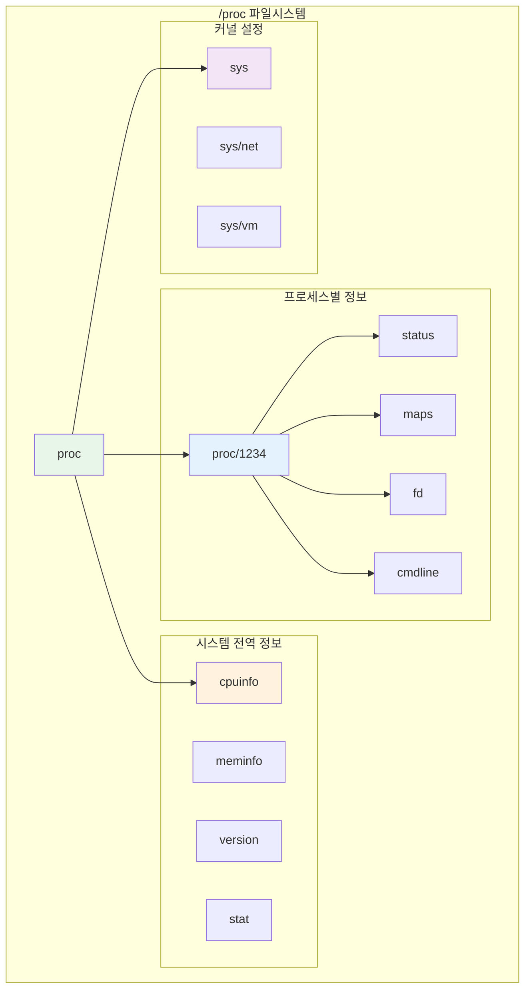

---
tags:
  - balanced
  - intermediate
  - kernel-module
  - kernel-userspace-communication
  - medium-read
  - procfs
  - sysfs
  - system-monitoring
  - 시스템프로그래밍
difficulty: INTERMEDIATE
learning_time: "4-6시간"
main_topic: "시스템 프로그래밍"
priority_score: 0
---

# 4.2.4: procfs와 sysfs

## 🎯 이 문서를 읽고 나면 얻을 수 있는 것들

이 문서를 마스터하면, 여러분은:

1. **"procfs와 sysfs가 왜 필요한가요?"** - 파일시스템을 통한 커널 정보 접근의 철학을 이해합니다
2. **"프로세스 정보는 어떻게 읽나요?"** - /proc 디렉토리 구조와 활용법을 배웁니다
3. **"시스템 설정은 어떻게 제어하나요?"** - /sys를 통한 커널 객체 제어를 익힙니다
4. **"커널 모듈에서 어떻게 사용하나요?"** - procfs/sysfs 엔트리 생성 방법을 배웁니다

## 1. procfs: 실행 중인 시스템의 투명한 창

### 1.1 procfs의 철학과 구조

procfs는 "Everything is a file" 철학의 완벽한 구현체입니다. 프로세스 정보, 커널 상태, 시스템 통계 등 모든 것을 파일처럼 읽을 수 있습니다.



### 1.2 프로세스 정보 읽기

각 프로세스의 상세 정보를 파일로 읽을 수 있습니다:

```c
// proc_reader.c - procfs 정보 읽기 예제
#include <stdio.h>
#include <stdlib.h>
#include <unistd.h>
#include <string.h>

// 프로세스 상태 정보 읽기
void read_process_status(pid_t pid) {
    char path[256];
    char line[512];
    FILE *f;
    
    snprintf(path, sizeof(path), "/proc/%d/status", pid);
    
    f = fopen(path, "r");
    if (!f) {
        perror("fopen status");
        return;
    }
    
    printf("=== 프로세스 %d 상태 정보 ===\n", pid);
    while (fgets(line, sizeof(line), f)) {
        // 주요 정보만 출력
        if (strncmp(line, "Name:", 5) == 0 ||
            strncmp(line, "Pid:", 4) == 0 ||
            strncmp(line, "PPid:", 5) == 0 ||
            strncmp(line, "State:", 6) == 0 ||
            strncmp(line, "VmSize:", 7) == 0 ||
            strncmp(line, "VmRSS:", 6) == 0) {
            printf("%s", line);
        }
    }
    fclose(f);
}

// 프로세스 메모리 맵 읽기
void read_process_maps(pid_t pid) {
    char path[256];
    char line[512];
    FILE *f;
    
    snprintf(path, sizeof(path), "/proc/%d/maps", pid);
    
    f = fopen(path, "r");
    if (!f) {
        perror("fopen maps");
        return;
    }
    
    printf("\n=== 프로세스 %d 메모리 맵 ===\n", pid);
    int count = 0;
    while (fgets(line, sizeof(line), f) && count < 10) {  // 상위 10개만
        printf("%s", line);
        count++;
    }
    if (count == 10) printf("... (더 많은 항목 있음)\n");
    
    fclose(f);
}

// 열린 파일 디스크립터 확인
void read_process_fds(pid_t pid) {
    char path[256];
    char link_target[512];
    DIR *dir;
    struct dirent *entry;
    
    snprintf(path, sizeof(path), "/proc/%d/fd", pid);
    
    dir = opendir(path);
    if (!dir) {
        perror("opendir fd");
        return;
    }
    
    printf("\n=== 프로세스 %d 열린 파일들 ===\n", pid);
    while ((entry = readdir(dir)) != NULL) {
        if (entry->d_name[0] == '.') continue;  // ., .. 스킵
        
        char fd_path[512];
        snprintf(fd_path, sizeof(fd_path), "%s/%s", path, entry->d_name);
        
        ssize_t len = readlink(fd_path, link_target, sizeof(link_target) - 1);
        if (len > 0) {
            link_target[len] = '\0';
            printf("  fd %s -> %s\n", entry->d_name, link_target);
        }
    }
    closedir(dir);
}

int main(int argc, char *argv[]) {
    pid_t pid = getpid();  // 기본값: 자신의 PID
    
    if (argc > 1) {
        pid = atoi(argv[1]);
    }
    
    printf("프로세스 정보 분석 (PID: %d)\n", pid);
    printf("=====================================\n");
    
    read_process_status(pid);
    read_process_maps(pid);
    read_process_fds(pid);
    
    return 0;
}
```

### 1.3 시스템 전역 정보 활용

```c
// system_info.c - 시스템 정보 읽기
#include <stdio.h>
#include <stdlib.h>
#include <string.h>

// CPU 정보 파싱
void read_cpu_info() {
    FILE *f = fopen("/proc/cpuinfo", "r");
    char line[512];
    int cpu_count = 0;
    
    printf("=== CPU 정보 ===\n");
    while (fgets(line, sizeof(line), f)) {
        if (strncmp(line, "processor", 9) == 0) {
            cpu_count++;
        } else if (strncmp(line, "model name", 10) == 0 && cpu_count == 1) {
            printf("CPU 모델: %s", strchr(line, ':') + 2);
        } else if (strncmp(line, "cpu MHz", 7) == 0 && cpu_count == 1) {
            printf("CPU 속도: %s", strchr(line, ':') + 2);
        }
    }
    printf("CPU 코어 수: %d\n", cpu_count);
    fclose(f);
}

// 메모리 정보 파싱
void read_memory_info() {
    FILE *f = fopen("/proc/meminfo", "r");
    char line[512];
    
    printf("\n=== 메모리 정보 ===\n");
    while (fgets(line, sizeof(line), f)) {
        if (strncmp(line, "MemTotal:", 9) == 0 ||
            strncmp(line, "MemFree:", 8) == 0 ||
            strncmp(line, "MemAvailable:", 13) == 0 ||
            strncmp(line, "Cached:", 7) == 0 ||
            strncmp(line, "SwapTotal:", 10) == 0 ||
            strncmp(line, "SwapFree:", 9) == 0) {
            printf("%s", line);
        }
    }
    fclose(f);
}

// 시스템 통계 읽기
void read_system_stat() {
    FILE *f = fopen("/proc/stat", "r");
    char line[512];
    
    printf("\n=== 시스템 통계 ===\n");
    
    // 첫 번째 줄: 전체 CPU 시간
    if (fgets(line, sizeof(line), f)) {
        unsigned long user, nice, system, idle, iowait, irq, softirq;
        sscanf(line, "cpu %lu %lu %lu %lu %lu %lu %lu",
               &user, &nice, &system, &idle, &iowait, &irq, &softirq);
        
        unsigned long total = user + nice + system + idle + iowait + irq + softirq;
        printf("CPU 사용률:\n");
        printf("  User: %.1f%%\n", (double)user * 100 / total);
        printf("  System: %.1f%%\n", (double)system * 100 / total);
        printf("  Idle: %.1f%%\n", (double)idle * 100 / total);
        printf("  I/O Wait: %.1f%%\n", (double)iowait * 100 / total);
    }
    
    fclose(f);
}

int main() {
    read_cpu_info();
    read_memory_info();
    read_system_stat();
    return 0;
}
```

### 1.4 procfs 엔트리 생성하기

커널 모듈에서 자체 procfs 엔트리를 만들 수 있습니다:

```c
// proc_module.c - 커널 모듈에서 procfs 사용
#include <linux/init.h>
#include <linux/module.h>
#include <linux/proc_fs.h>
#include <linux/uaccess.h>
#include <linux/seq_file.h>

#define PROC_NAME "hello_proc"

static struct proc_dir_entry *proc_entry;
static int access_count = 0;

// proc 파일 읽기 (seq_file 인터페이스 사용)
static int hello_proc_show(struct seq_file *m, void *v) {
    seq_printf(m, "Hello from kernel module!\n");
    seq_printf(m, "Access count: %d\n", ++access_count);
    seq_printf(m, "Current PID: %d\n", current->pid);
    seq_printf(m, "Current command: %s\n", current->comm);
    return 0;
}

static int hello_proc_open(struct inode *inode, struct file *file) {
    return single_open(file, hello_proc_show, NULL);
}

// proc 파일 쓰기
static ssize_t hello_proc_write(struct file *file, const char __user *buffer,
                               size_t count, loff_t *pos) {
    char msg[256];
    
    if (count >= sizeof(msg))
        count = sizeof(msg) - 1;
    
    if (copy_from_user(msg, buffer, count))
        return -EFAULT;
    
    msg[count] = '\0';
    printk(KERN_INFO "proc_module: received message: %s", msg);
    
    return count;
}

// proc 파일 연산
static const struct proc_ops hello_proc_ops = {
    .proc_open = hello_proc_open,
    .proc_read = seq_read,
    .proc_write = hello_proc_write,
    .proc_lseek = seq_lseek,
    .proc_release = single_release,
};

static int __init proc_module_init(void) {
    // /proc/hello_proc 생성
    proc_entry = proc_create(PROC_NAME, 0666, NULL, &hello_proc_ops);
    if (!proc_entry) {
        printk(KERN_ERR "proc_module: failed to create proc entry\n");
        return -ENOMEM;
    }
    
    printk(KERN_INFO "proc_module: module loaded, /proc/%s created\n", PROC_NAME);
    return 0;
}

static void __exit proc_module_exit(void) {
    proc_remove(proc_entry);
    printk(KERN_INFO "proc_module: module unloaded\n");
}

module_init(proc_module_init);
module_exit(proc_module_exit);

MODULE_LICENSE("GPL");
MODULE_DESCRIPTION("procfs example module");
```

## 2. sysfs: 커널 객체의 구조화된 인터페이스

### 2.1 sysfs의 설계 철학

sysfs는 커널 객체들의 계층 구조를 파일시스템으로 표현합니다. 각 디렉토리는 커널 객체(kobject)를 나타내고, 각 파일은 그 객체의 속성을 나타냅니다.

```bash
# sysfs 구조 살펴보기
$ ls /sys/
block/  class/  dev/  devices/  firmware/  fs/  kernel/  module/  power/

# 디바이스 계층 구조
$ ls /sys/devices/
LNXSYSTM:00/  pci0000:00/  platform/  pnp0/  system/  virtual/

# 블록 디바이스 정보
$ ls /sys/block/sda/
alignment_offset  bdi/  capability  dev  device/  discard_alignment  
ext_range  holders/  inflight  queue/  range  removable  ro  size  
slaves/  stat  trace/  uevent

# 네트워크 디바이스 설정
$ ls /sys/class/net/eth0/
addr_assign_type  address  broadcast  carrier  device/  dormant  
duplex  flags  ifindex  iflink  link_mode  mtu  operstate  speed  
statistics/  tx_queue_len  type  uevent
```

### 2.2 sysfs 속성 읽기와 쓰기

```c
// sysfs_control.c - sysfs를 통한 시스템 제어
#include <stdio.h>
#include <stdlib.h>
#include <string.h>
#include <unistd.h>
#include <fcntl.h>

// CPU 주파수 제어
int set_cpu_frequency(int cpu, const char* frequency) {
    char path[256];
    int fd;
    
    snprintf(path, sizeof(path), 
             "/sys/devices/system/cpu/cpu%d/cpufreq/scaling_setspeed", cpu);
    
    fd = open(path, O_WRONLY);
    if (fd < 0) {
        perror("open scaling_setspeed");
        return -1;
    }
    
    if (write(fd, frequency, strlen(frequency)) < 0) {
        perror("write frequency");
        close(fd);
        return -1;
    }
    
    close(fd);
    printf("CPU %d 주파수를 %s로 설정했습니다.\n", cpu, frequency);
    return 0;
}

// CPU 거버너 설정
int set_cpu_governor(int cpu, const char* governor) {
    char path[256];
    int fd;
    
    snprintf(path, sizeof(path),
             "/sys/devices/system/cpu/cpu%d/cpufreq/scaling_governor", cpu);
    
    fd = open(path, O_WRONLY);
    if (fd < 0) {
        perror("open scaling_governor");
        return -1;
    }
    
    if (write(fd, governor, strlen(governor)) < 0) {
        perror("write governor");
        close(fd);
        return -1;
    }
    
    close(fd);
    printf("CPU %d 거버너를 %s로 설정했습니다.\n", cpu, governor);
    return 0;
}

// 네트워크 통계 읽기
void read_network_stats(const char* interface) {
    char path[256];
    char buffer[64];
    int fd;
    
    printf("\n=== %s 네트워크 통계 ===\n", interface);
    
    const char* stats[] = {
        "rx_bytes", "rx_packets", "rx_errors", "rx_dropped",
        "tx_bytes", "tx_packets", "tx_errors", "tx_dropped", NULL
    };
    
    for (int i = 0; stats[i]; i++) {
        snprintf(path, sizeof(path), "/sys/class/net/%s/statistics/%s", 
                 interface, stats[i]);
        
        fd = open(path, O_RDONLY);
        if (fd >= 0) {
            ssize_t len = read(fd, buffer, sizeof(buffer) - 1);
            if (len > 0) {
                buffer[len - 1] = '\0';  // 개행 제거
                printf("  %s: %s\n", stats[i], buffer);
            }
            close(fd);
        }
    }
}

// 블록 디바이스 정보 읽기
void read_block_device_info(const char* device) {
    char path[256];
    char buffer[64];
    int fd;
    
    printf("\n=== %s 블록 디바이스 정보 ===\n", device);
    
    // 디바이스 크기
    snprintf(path, sizeof(path), "/sys/block/%s/size", device);
    fd = open(path, O_RDONLY);
    if (fd >= 0) {
        ssize_t len = read(fd, buffer, sizeof(buffer) - 1);
        if (len > 0) {
            buffer[len - 1] = '\0';
            long long sectors = atoll(buffer);
            printf("  크기: %lld 섹터 (%.2f GB)\n", 
                   sectors, sectors * 512.0 / (1024*1024*1024));
        }
        close(fd);
    }
    
    // I/O 통계
    snprintf(path, sizeof(path), "/sys/block/%s/stat", device);
    fd = open(path, O_RDONLY);
    if (fd >= 0) {
        if (read(fd, buffer, sizeof(buffer) - 1) > 0) {
            unsigned long read_ios, read_sectors, write_ios, write_sectors;
            sscanf(buffer, "%lu %*u %lu %*u %lu %*u %lu", 
                   &read_ios, &read_sectors, &write_ios, &write_sectors);
            printf("  읽기: %lu 요청, %lu 섹터\n", read_ios, read_sectors);
            printf("  쓰기: %lu 요청, %lu 섹터\n", write_ios, write_sectors);
        }
        close(fd);
    }
}

int main(int argc, char *argv[]) {
    printf("sysfs 시스템 제어 및 모니터링\n");
    printf("===============================\n");
    
    // 네트워크 인터페이스가 있다면 통계 읽기
    if (access("/sys/class/net/eth0", F_OK) == 0) {
        read_network_stats("eth0");
    } else if (access("/sys/class/net/wlan0", F_OK) == 0) {
        read_network_stats("wlan0");
    }
    
    // 주 블록 디바이스 정보 읽기
    if (access("/sys/block/sda", F_OK) == 0) {
        read_block_device_info("sda");
    } else if (access("/sys/block/nvme0n1", F_OK) == 0) {
        read_block_device_info("nvme0n1");
    }
    
    return 0;
}
```

### 2.3 커널 모듈에서 sysfs 속성 생성

```c
// sysfs_module.c - sysfs 속성을 가진 커널 모듈
#include <linux/init.h>
#include <linux/module.h>
#include <linux/kernel.h>
#include <linux/kobject.h>
#include <linux/sysfs.h>
#include <linux/string.h>

static int my_value = 42;
static char my_string[64] = "Hello from kernel";

// sysfs 속성: my_value (읽기/쓰기 가능)
static ssize_t my_value_show(struct kobject *kobj, struct kobj_attribute *attr, 
                            char *buf) {
    return sprintf(buf, "%d\n", my_value);
}

static ssize_t my_value_store(struct kobject *kobj, struct kobj_attribute *attr,
                             const char *buf, size_t count) {
    int ret = kstrtoint(buf, 10, &my_value);
    if (ret < 0)
        return ret;
    return count;
}
static struct kobj_attribute my_value_attr = __ATTR_RW(my_value);

// sysfs 속성: my_string (읽기/쓰기 가능)
static ssize_t my_string_show(struct kobject *kobj, struct kobj_attribute *attr,
                             char *buf) {
    return sprintf(buf, "%s\n", my_string);
}

static ssize_t my_string_store(struct kobject *kobj, struct kobj_attribute *attr,
                              const char *buf, size_t count) {
    if (count >= sizeof(my_string))
        return -EINVAL;
    
    strncpy(my_string, buf, count);
    if (my_string[count - 1] == '\n')
        my_string[count - 1] = '\0';
    else
        my_string[count] = '\0';
    
    return count;
}
static struct kobj_attribute my_string_attr = __ATTR_RW(my_string);

// 읽기 전용 속성: 모듈 정보
static ssize_t module_info_show(struct kobject *kobj, struct kobj_attribute *attr,
                               char *buf) {
    return sprintf(buf, "Module: %s, Version: 1.0, Loaded: %s", 
                   THIS_MODULE->name,
                   current_kernel_time().tv_sec);
}
static struct kobj_attribute module_info_attr = __ATTR_RO(module_info);

// 속성 그룹
static struct attribute *my_attrs[] = {
    &my_value_attr.attr,
    &my_string_attr.attr,
    &module_info_attr.attr,
    NULL,
};
static struct attribute_group my_attr_group = {
    .attrs = my_attrs,
};

static struct kobject *my_kobj;

static int __init sysfs_module_init(void) {
    int ret;
    
    // /sys/kernel/my_sysfs_module/ 디렉토리 생성
    my_kobj = kobject_create_and_add("my_sysfs_module", kernel_kobj);
    if (!my_kobj)
        return -ENOMEM;
    
    // 속성 파일들 생성
    ret = sysfs_create_group(my_kobj, &my_attr_group);
    if (ret) {
        kobject_put(my_kobj);
        return ret;
    }
    
    printk(KERN_INFO "sysfs_module: loaded, check /sys/kernel/my_sysfs_module/\n");
    return 0;
}

static void __exit sysfs_module_exit(void) {
    sysfs_remove_group(my_kobj, &my_attr_group);
    kobject_put(my_kobj);
    printk(KERN_INFO "sysfs_module: unloaded\n");
}

module_init(sysfs_module_init);
module_exit(sysfs_module_exit);

MODULE_LICENSE("GPL");
MODULE_DESCRIPTION("sysfs example module");
```

## 3. 정리: procfs vs sysfs 선택 가이드

### 📊 특성 비교

| 특징 | procfs | sysfs |
|------|--------|-------|
| **주 목적** | 프로세스/시스템 정보 | 커널 객체 제어 |
| **구조** | 평면적, 정보 중심 | 계층적, 객체 중심 |
| **읽기** | 텍스트 파싱 필요 | 단순한 값 읽기 |
| **쓰기** | 제한적 | 광범위한 설정 변경 |
| **사용 사례** | 모니터링, 디버깅 | 디바이스 제어, 튜닝 |

### 🎯 사용 시나리오

**procfs를 사용해야 할 때:**

- 프로세스 정보 조회
- 시스템 통계 모니터링
- 디버깅 정보 수집
- 커널 상태 확인

**sysfs를 사용해야 할 때:**

- 하드웨어 설정 변경
- 커널 모듈 파라미터 조정
- 디바이스 드라이버 제어
- 전력 관리 설정

## 다음 단계

이제 기본적인 파일시스템 기반 통신을 이해했으니, 다음 문서에서는 더 고급 통신 메커니즘들을 살펴보겠습니다:

- [10-4b: netlink 소켓](04-02-05-netlink-socket.md) - 실시간 커널 이벤트 통신
- [10-4c: 공유 메모리](04-02-06-shared-memory.md) - 고성능 데이터 교환
- [10-4d: 신호와 eventfd](04-02-08-signal-eventfd.md) - 간단한 이벤트 통신
- [10-4e: eBPF 프로그래밍](04-03-02-ebpf-programming.md) - 커널 내 프로그래밍

procfs와 sysfs는 리눅스 시스템의 투명성을 보장하는 핵심 메커니즘입니다. 이를 통해 복잡한 커널 내부 상태를 간단한 파일 읽기/쓰기로 접근할 수 있습니다!

## 참고 자료

- [Linux Kernel Documentation - procfs](https://www.kernel.org/doc/Documentation/filesystems/proc.txt)
- [Linux Kernel Documentation - sysfs](https://www.kernel.org/doc/Documentation/filesystems/sysfs.txt)
- [The /proc Filesystem](https://tldp.org/LDP/Linux-Filesystem-Hierarchy/html/proc.html)
- [Understanding sysfs](https://lwn.net/Articles/31185/)

## 📚 관련 문서

### 📖 현재 문서 정보

- **난이도**: INTERMEDIATE
- **주제**: 시스템 프로그래밍
- **예상 시간**: 4-6시간

### 🎯 학습 경로

- [📚 INTERMEDIATE 레벨 전체 보기](../learning-paths/intermediate/)
- [🏠 메인 학습 경로](../learning-paths/)
- [📋 전체 가이드 목록](../README.md)

### 📂 같은 챕터 (chapter-04-syscall-kernel)

- [Chapter 4-1-1: 시스템 호출 기초와 인터페이스](./04-01-01-system-call-basics.md)
- [Chapter 4-1-2: 리눅스 커널 아키텍처 개요](./04-01-02-kernel-architecture.md)
- [Chapter 4-1-3: 커널 설계 철학과 아키텍처 기초](./04-01-03-kernel-design-philosophy.md)
- [Chapter 4-1-3: 커널 설계 철학과 전체 구조](./04-01-04-kernel-design-structure.md)
- [Chapter 4-1-5: 핵심 서브시스템 탐구](./04-01-05-core-subsystems.md)

### 🏷️ 관련 키워드

`procfs`, `sysfs`, `kernel-userspace-communication`, `system-monitoring`, `kernel-module`

### ⏭️ 다음 단계 가이드

- 실무 적용을 염두에 두고 프로젝트에 적용해보세요
- 관련 도구들을 직접 사용해보는 것이 중요합니다
