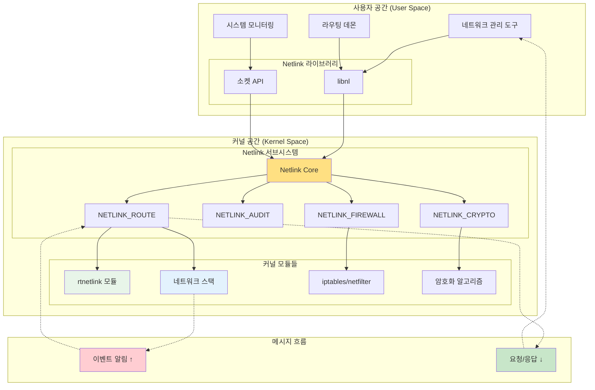
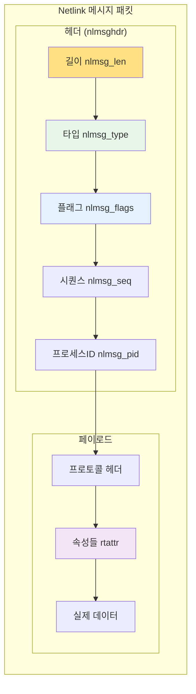

---
tags:
  - deep-study
  - hands-on
  - intermediate
  - kernel-userspace
  - netlink
  - network-monitoring
  - rtnetlink
  - socket
  - 시스템프로그래밍
difficulty: INTERMEDIATE
learning_time: "6-8시간"
main_topic: "시스템 프로그래밍"
priority_score: 4
---

# 4.2.5: Netlink 소켓

## 🎯 이 문서를 읽고 나면 얻을 수 있는 것들

이 문서를 마스터하면, 여러분은:

1.**"netlink 소켓이 왜 필요한가요?"**- 실시간 양방향 커널 통신의 필요성을 이해합니다
2.**"네트워크 변경을 어떻게 모니터링하나요?"**- 네트워크 이벤트 추적 방법을 배웁니다
3.**"커널과 어떻게 메시지를 주고받나요?"**- netlink 소켓 프로그래밍을 익힙니다
4.**"라우팅 테이블을 어떻게 조회하나요?"**- netlink를 활용한 네트워크 정보 수집을 배웁니다

## 1. netlink 소켓의 특징

netlink 소켓은 커널과 사용자 공간 사이의 양방향 통신을 위한 특별한 소켓입니다:

## 🔄 Netlink 소켓 통신 아키텍처



## 📨 Netlink 메시지 구조



### 1.1 기본 사용법

```c
// netlink_example.c - netlink 소켓 기본 사용
#include <stdio.h>
#include <stdlib.h>
#include <string.h>
#include <unistd.h>
#include <sys/socket.h>
#include <linux/netlink.h>
#include <linux/rtnetlink.h>

// 네트워크 인터페이스 변경 모니터링
void monitor_network_changes() {
    int sock;
    struct sockaddr_nl addr;
    char buffer[4096];
    struct nlmsghdr *nlh;
    struct ifinfomsg *ifi;
    
    // netlink 소켓 생성
    sock = socket(AF_NETLINK, SOCK_RAW, NETLINK_ROUTE);
    if (sock < 0) {
        perror("socket");
        return;
    }
    
    // 주소 설정
    memset(&addr, 0, sizeof(addr));
    addr.nl_family = AF_NETLINK;
    addr.nl_groups = RTMGRP_LINK | RTMGRP_IPV4_IFADDR | RTMGRP_IPV6_IFADDR;
    
    if (bind(sock, (struct sockaddr*)&addr, sizeof(addr)) < 0) {
        perror("bind");
        close(sock);
        return;
    }
    
    printf("네트워크 인터페이스 변경 모니터링 시작...\n");
    
    while (1) {
        ssize_t len = recv(sock, buffer, sizeof(buffer), 0);
        if (len < 0) {
            perror("recv");
            break;
        }
        
        // netlink 메시지 파싱
        for (nlh = (struct nlmsghdr*)buffer; 
             NLMSG_OK(nlh, len); 
             nlh = NLMSG_NEXT(nlh, len)) {
            
            switch (nlh->nlmsg_type) {
                case RTM_NEWLINK:
                    printf("인터페이스 추가/변경 이벤트\n");
                    break;
                case RTM_DELLINK:
                    printf("인터페이스 제거 이벤트\n");
                    break;
                case RTM_NEWADDR:
                    printf("IP 주소 추가 이벤트\n");
                    break;
                case RTM_DELADDR:
                    printf("IP 주소 제거 이벤트\n");
                    break;
                case NLMSG_DONE:
                    return;
                case NLMSG_ERROR:
                    printf("netlink 오류\n");
                    break;
                default:
                    printf("알 수 없는 netlink 메시지: %d\n", nlh->nlmsg_type);
            }
        }
    }
    
    close(sock);
}

// 라우팅 테이블 조회
void query_routing_table() {
    int sock;
    struct sockaddr_nl addr;
    struct {
        struct nlmsghdr nlh;
        struct rtmsg rt;
    } req;
    char buffer[4096];
    
    sock = socket(AF_NETLINK, SOCK_RAW, NETLINK_ROUTE);
    if (sock < 0) {
        perror("socket");
        return;
    }
    
    memset(&addr, 0, sizeof(addr));
    addr.nl_family = AF_NETLINK;
    
    if (bind(sock, (struct sockaddr*)&addr, sizeof(addr)) < 0) {
        perror("bind");
        close(sock);
        return;
    }
    
    // 라우팅 테이블 요청 메시지 구성
    memset(&req, 0, sizeof(req));
    req.nlh.nlmsg_len = NLMSG_LENGTH(sizeof(struct rtmsg));
    req.nlh.nlmsg_type = RTM_GETROUTE;
    req.nlh.nlmsg_flags = NLM_F_REQUEST | NLM_F_DUMP;
    req.nlh.nlmsg_seq = 1;
    req.nlh.nlmsg_pid = getpid();
    req.rt.rtm_family = AF_INET;
    req.rt.rtm_table = RT_TABLE_MAIN;
    
    if (send(sock, &req, req.nlh.nlmsg_len, 0) < 0) {
        perror("send");
        close(sock);
        return;
    }
    
    printf("라우팅 테이블:\n");
    
    while (1) {
        ssize_t len = recv(sock, buffer, sizeof(buffer), 0);
        if (len < 0) {
            perror("recv");
            break;
        }
        
        struct nlmsghdr *nlh = (struct nlmsghdr*)buffer;
        if (nlh->nlmsg_type == NLMSG_DONE)
            break;
        
        if (nlh->nlmsg_type == NLMSG_ERROR) {
            printf("netlink 오류\n");
            break;
        }
        
        // 라우팅 정보 파싱 (간단한 형태)
        if (nlh->nlmsg_type == RTM_NEWROUTE) {
            printf("  라우팅 항목 발견\n");
        }
    }
    
    close(sock);
}

int main() {
    printf("netlink 소켓 예제\n");
    printf("=================\n");
    
    query_routing_table();
    
    printf("\n네트워크 변경 모니터링 시작 (Ctrl+C로 중단):\n");
    monitor_network_changes();
    
    return 0;
}
```

## 2. 커널 모듈에서 netlink 사용

### 2.1 커널에서 netlink 소켓 생성

```c
// netlink_kernel.c - 커널에서 netlink 소켓 사용
#include <linux/init.h>
#include <linux/module.h>
#include <linux/kernel.h>
#include <linux/netlink.h>
#include <linux/skbuff.h>
#include <net/sock.h>

#define NETLINK_USER_PROTOCOL 31
#define MSG_SIZE 1024

static struct sock *nl_sock = NULL;

// 사용자 공간으로 메시지 전송
static void send_to_user(int pid, const char *message) {
    struct sk_buff *skb;
    struct nlmsghdr *nlh;
    int msg_len = strlen(message);
    
    skb = nlmsg_new(msg_len, GFP_KERNEL);
    if (!skb) {
        printk(KERN_ERR "netlink_kernel: failed to allocate skb\n");
        return;
    }
    
    nlh = nlmsg_put(skb, 0, 0, NLMSG_DONE, msg_len, 0);
    if (!nlh) {
        kfree_skb(skb);
        return;
    }
    
    strcpy(nlmsg_data(nlh), message);
    
    // 특정 프로세스에게 전송
    nlmsg_unicast(nl_sock, skb, pid);
}

// 사용자 공간으로부터 메시지 수신
static void receive_from_user(struct sk_buff *skb) {
    struct nlmsghdr *nlh;
    char *user_msg;
    int pid;
    
    nlh = nlmsg_hdr(skb);
    user_msg = (char*)nlmsg_data(nlh);
    pid = nlh->nlmsg_pid;
    
    printk(KERN_INFO "netlink_kernel: received from PID %d: %s\n", pid, user_msg);
    
    // 에코 응답 전송
    char response[256];
    snprintf(response, sizeof(response), "Echo: %s", user_msg);
    send_to_user(pid, response);
}

static struct netlink_kernel_cfg cfg = {
    .input = receive_from_user,
};

static int __init netlink_kernel_init(void) {
    // netlink 소켓 생성
    nl_sock = netlink_kernel_create(&init_net, NETLINK_USER_PROTOCOL, &cfg);
    if (!nl_sock) {
        printk(KERN_ERR "netlink_kernel: failed to create netlink socket\n");
        return -ENOMEM;
    }
    
    printk(KERN_INFO "netlink_kernel: module loaded\n");
    return 0;
}

static void __exit netlink_kernel_exit(void) {
    if (nl_sock) {
        netlink_kernel_release(nl_sock);
    }
    printk(KERN_INFO "netlink_kernel: module unloaded\n");
}

module_init(netlink_kernel_init);
module_exit(netlink_kernel_exit);

MODULE_LICENSE("GPL");
MODULE_DESCRIPTION("netlink kernel module example");
```

### 2.2 사용자 공간 클라이언트

```c
// netlink_client.c - 커널 모듈과 통신하는 사용자 프로그램
#include <stdio.h>
#include <stdlib.h>
#include <string.h>
#include <unistd.h>
#include <sys/socket.h>
#include <linux/netlink.h>

#define NETLINK_USER_PROTOCOL 31
#define MSG_SIZE 1024

int main() {
    int sock;
    struct sockaddr_nl addr;
    struct nlmsghdr *nlh;
    char buffer[MSG_SIZE];
    
    // netlink 소켓 생성
    sock = socket(AF_NETLINK, SOCK_RAW, NETLINK_USER_PROTOCOL);
    if (sock < 0) {
        perror("socket");
        return -1;
    }
    
    // 주소 설정
    memset(&addr, 0, sizeof(addr));
    addr.nl_family = AF_NETLINK;
    addr.nl_pid = getpid();
    
    if (bind(sock, (struct sockaddr*)&addr, sizeof(addr)) < 0) {
        perror("bind");
        close(sock);
        return -1;
    }
    
    // 메시지 버퍼 할당
    nlh = (struct nlmsghdr*)malloc(NLMSG_SPACE(MSG_SIZE));
    if (!nlh) {
        perror("malloc");
        close(sock);
        return -1;
    }
    
    // 사용자 입력 및 커널로 전송
    printf("커널 모듈과 통신 예제\n");
    printf("메시지 입력 (quit로 종료): ");
    
    char input[256];
    while (fgets(input, sizeof(input), stdin)) {
        // 개행 맨끝 제거
        input[strcspn(input, "\n")] = '\0';
        
        if (strcmp(input, "quit") == 0)
            break;
        
        // netlink 메시지 구성
        memset(nlh, 0, NLMSG_SPACE(MSG_SIZE));
        nlh->nlmsg_len = NLMSG_SPACE(strlen(input));
        nlh->nlmsg_pid = getpid();
        nlh->nlmsg_flags = 0;
        strcpy(NLMSG_DATA(nlh), input);
        
        // 커널 모듈에게 전송
        memset(&addr, 0, sizeof(addr));
        addr.nl_family = AF_NETLINK;
        addr.nl_pid = 0;  // 커널 PID
        
        if (sendto(sock, nlh, nlh->nlmsg_len, 0,
                   (struct sockaddr*)&addr, sizeof(addr)) < 0) {
            perror("sendto");
            break;
        }
        
        // 커널로부터 에코 응답 수신
        memset(buffer, 0, sizeof(buffer));
        if (recv(sock, buffer, sizeof(buffer), 0) > 0) {
            nlh = (struct nlmsghdr*)buffer;
            printf("커널 응답: %s\n", (char*)NLMSG_DATA(nlh));
        }
        
        printf("메시지 입력 (quit로 종료): ");
    }
    
    free(nlh);
    close(sock);
    printf("프로그램 종료\n");
    
    return 0;
}
```

## 3. 고급 netlink 활용

### 3.1 다중 그룹 모니터링

```c
// advanced_netlink_monitor.c - 다양한 netlink 이벤트 모니터링
#include <stdio.h>
#include <stdlib.h>
#include <string.h>
#include <unistd.h>
#include <sys/socket.h>
#include <linux/netlink.h>
#include <linux/rtnetlink.h>
#include <linux/if.h>
#include <arpa/inet.h>

// 네트워크 인터페이스 상세 모니터링
void monitor_interface_changes() {
    int sock;
    struct sockaddr_nl addr;
    char buffer[8192];
    
    sock = socket(AF_NETLINK, SOCK_RAW, NETLINK_ROUTE);
    if (sock < 0) {
        perror("socket");
        return;
    }
    
    memset(&addr, 0, sizeof(addr));
    addr.nl_family = AF_NETLINK;
    // 다양한 그룹 모니터링
    addr.nl_groups = RTMGRP_LINK | RTMGRP_IPV4_IFADDR | RTMGRP_IPV6_IFADDR |
                     RTMGRP_IPV4_ROUTE | RTMGRP_IPV6_ROUTE;
    
    if (bind(sock, (struct sockaddr*)&addr, sizeof(addr)) < 0) {
        perror("bind");
        close(sock);
        return;
    }
    
    printf("네트워크 이벤트 상세 모니터링 시작...\n");
    printf("========================================\n");
    
    while (1) {
        ssize_t len = recv(sock, buffer, sizeof(buffer), 0);
        if (len < 0) {
            perror("recv");
            break;
        }
        
        struct nlmsghdr *nlh;
        for (nlh = (struct nlmsghdr*)buffer;
             NLMSG_OK(nlh, len);
             nlh = NLMSG_NEXT(nlh, len)) {
            
            switch (nlh->nlmsg_type) {
                case RTM_NEWLINK: {
                    struct ifinfomsg *ifi = NLMSG_DATA(nlh);
                    printf("[LINK] 인터페이스 변경: index=%d, flags=0x%x\n",
                           ifi->ifi_index, ifi->ifi_flags);
                    
                    // 인터페이스 상태 해석
                    if (ifi->ifi_flags & IFF_UP)
                        printf("  -> 인터페이스 UP\n");
                    if (ifi->ifi_flags & IFF_RUNNING)
                        printf("  -> 인터페이스 RUNNING\n");
                    break;
                }
                
                case RTM_NEWADDR: {
                    struct ifaddrmsg *ifa = NLMSG_DATA(nlh);
                    printf("[ADDR] IP 주소 추가: family=%d, index=%d\n",
                           ifa->ifa_family, ifa->ifa_index);
                    
                    // 주소 정보 상세 파싱
                    struct rtattr *rta;
                    int rta_len = NLMSG_PAYLOAD(nlh, sizeof(*ifa));
                    
                    for (rta = IFA_RTA(ifa); RTA_OK(rta, rta_len); rta = RTA_NEXT(rta, rta_len)) {
                        if (rta->rta_type == IFA_ADDRESS) {
                            if (ifa->ifa_family == AF_INET) {
                                struct in_addr *addr = (struct in_addr*)RTA_DATA(rta);
                                printf("  -> IPv4 주소: %s\n", inet_ntoa(*addr));
                            }
                        }
                    }
                    break;
                }
                
                case RTM_DELADDR:
                    printf("[ADDR] IP 주소 제거\n");
                    break;
                
                case RTM_NEWROUTE:
                    printf("[ROUTE] 라우팅 규칙 추가\n");
                    break;
                
                case RTM_DELROUTE:
                    printf("[ROUTE] 라우팅 규칙 삭제\n");
                    break;
                
                case NLMSG_ERROR: {
                    struct nlmsgerr *err = NLMSG_DATA(nlh);
                    printf("[ERROR] netlink 오류: %d\n", err->error);
                    break;
                }
            }
        }
    }
    
    close(sock);
}

// 네트워크 인터페이스 상세 정보 조회
void query_interface_details() {
    int sock;
    struct sockaddr_nl addr;
    struct {
        struct nlmsghdr nlh;
        struct ifinfomsg ifi;
    } req;
    char buffer[8192];
    
    sock = socket(AF_NETLINK, SOCK_RAW, NETLINK_ROUTE);
    if (sock < 0) {
        perror("socket");
        return;
    }
    
    memset(&addr, 0, sizeof(addr));
    addr.nl_family = AF_NETLINK;
    
    if (bind(sock, (struct sockaddr*)&addr, sizeof(addr)) < 0) {
        perror("bind");
        close(sock);
        return;
    }
    
    // 인터페이스 목록 요청
    memset(&req, 0, sizeof(req));
    req.nlh.nlmsg_len = NLMSG_LENGTH(sizeof(struct ifinfomsg));
    req.nlh.nlmsg_type = RTM_GETLINK;
    req.nlh.nlmsg_flags = NLM_F_REQUEST | NLM_F_DUMP;
    req.nlh.nlmsg_seq = 1;
    req.nlh.nlmsg_pid = getpid();
    req.ifi.ifi_family = AF_UNSPEC;
    
    if (send(sock, &req, req.nlh.nlmsg_len, 0) < 0) {
        perror("send");
        close(sock);
        return;
    }
    
    printf("네트워크 인터페이스 목록:\n");
    printf("========================\n");
    
    while (1) {
        ssize_t len = recv(sock, buffer, sizeof(buffer), 0);
        if (len < 0) {
            perror("recv");
            break;
        }
        
        struct nlmsghdr *nlh = (struct nlmsghdr*)buffer;
        if (nlh->nlmsg_type == NLMSG_DONE)
            break;
        
        if (nlh->nlmsg_type == NLMSG_ERROR) {
            printf("netlink 오류\n");
            break;
        }
        
        if (nlh->nlmsg_type == RTM_NEWLINK) {
            struct ifinfomsg *ifi = NLMSG_DATA(nlh);
            struct rtattr *rta;
            int rta_len = NLMSG_PAYLOAD(nlh, sizeof(*ifi));
            
            printf("인터페이스 %d:\n", ifi->ifi_index);
            printf("  타입: %d, 플래그: 0x%x\n", ifi->ifi_type, ifi->ifi_flags);
            
            // 속성 정보 파싱
            for (rta = IFLA_RTA(ifi); RTA_OK(rta, rta_len); rta = RTA_NEXT(rta, rta_len)) {
                switch (rta->rta_type) {
                    case IFLA_IFNAME:
                        printf("  이름: %s\n", (char*)RTA_DATA(rta));
                        break;
                    case IFLA_MTU:
                        printf("  MTU: %d\n", *(int*)RTA_DATA(rta));
                        break;
                    case IFLA_ADDRESS: {
                        unsigned char *mac = (unsigned char*)RTA_DATA(rta);
                        printf("  MAC: %02x:%02x:%02x:%02x:%02x:%02x\n",
                               mac[0], mac[1], mac[2], mac[3], mac[4], mac[5]);
                        break;
                    }
                }
            }
            printf("\n");
        }
    }
    
    close(sock);
}

int main() {
    printf("고급 netlink 모니터링 예제\n");
    printf("=============================\n\n");
    
    // 먼저 현재 인터페이스 상태 조회
    query_interface_details();
    
    printf("실시간 인터페이스 변경 모니터링 시작 (Ctrl+C로 중단)...\n");
    monitor_interface_changes();
    
    return 0;
}
```

## 4. 성능 최적화와 베스트 프랙티스

### 4.1 비동기 netlink 처리

```c
// async_netlink.c - 비동기 netlink 이벤트 처리
#include <stdio.h>
#include <stdlib.h>
#include <string.h>
#include <unistd.h>
#include <sys/socket.h>
#include <sys/epoll.h>
#include <linux/netlink.h>
#include <linux/rtnetlink.h>
#include <errno.h>

#define MAX_EVENTS 10

void process_netlink_event(int sock) {
    char buffer[8192];
    ssize_t len = recv(sock, buffer, sizeof(buffer), MSG_DONTWAIT);
    
    if (len < 0) {
        if (errno == EAGAIN || errno == EWOULDBLOCK) {
            return;  // 데이터가 없음
        }
        perror("recv");
        return;
    }
    
    struct nlmsghdr *nlh;
    for (nlh = (struct nlmsghdr*)buffer;
         NLMSG_OK(nlh, len);
         nlh = NLMSG_NEXT(nlh, len)) {
        
        switch (nlh->nlmsg_type) {
            case RTM_NEWLINK:
                printf("비동기: 인터페이스 변경 감지\n");
                break;
            case RTM_NEWADDR:
                printf("비동기: IP 주소 추가 감지\n");
                break;
            default:
                printf("비동기: 기타 이벤트 (%d)\n", nlh->nlmsg_type);
        }
    }
}

void async_netlink_monitor() {
    int sock, epoll_fd;
    struct sockaddr_nl addr;
    struct epoll_event event, events[MAX_EVENTS];
    
    // netlink 소켓 생성 및 논블록킹 설정
    sock = socket(AF_NETLINK, SOCK_RAW | SOCK_NONBLOCK, NETLINK_ROUTE);
    if (sock < 0) {
        perror("socket");
        return;
    }
    
    memset(&addr, 0, sizeof(addr));
    addr.nl_family = AF_NETLINK;
    addr.nl_groups = RTMGRP_LINK | RTMGRP_IPV4_IFADDR;
    
    if (bind(sock, (struct sockaddr*)&addr, sizeof(addr)) < 0) {
        perror("bind");
        close(sock);
        return;
    }
    
    // epoll 인스턴스 생성
    epoll_fd = epoll_create1(0);
    if (epoll_fd < 0) {
        perror("epoll_create1");
        close(sock);
        return;
    }
    
    // netlink 소켓을 epoll에 등록
    event.events = EPOLLIN | EPOLLET;  // Edge-triggered 모드
    event.data.fd = sock;
    
    if (epoll_ctl(epoll_fd, EPOLL_CTL_ADD, sock, &event) < 0) {
        perror("epoll_ctl");
        close(epoll_fd);
        close(sock);
        return;
    }
    
    printf("비동기 netlink 모니터링 시작...\n");
    
    while (1) {
        int nfds = epoll_wait(epoll_fd, events, MAX_EVENTS, -1);
        if (nfds < 0) {
            perror("epoll_wait");
            break;
        }
        
        for (int i = 0; i < nfds; i++) {
            if (events[i].data.fd == sock) {
                // Edge-triggered는 모든 데이터를 읽어야 함
                while (1) {
                    process_netlink_event(sock);
                    // EAGAIN이 반환될 때까지 계속 읽기
                    if (errno == EAGAIN || errno == EWOULDBLOCK)
                        break;
                }
            }
        }
        
        // 다른 비즉시 작업을 수행할 수 있음
        printf("다른 작업 수행 중...\n");
        usleep(100000);  // 100ms 지연
    }
    
    close(epoll_fd);
    close(sock);
}

int main() {
    async_netlink_monitor();
    return 0;
}
```

## 5. netlink의 장단점과 사용 가이드

### 📊 장단점 분석

**장점:**

- 양방향 통신 가능
- 실시간 이벤트 수신
- 다중 프로세스 브로드캐스트
- 커널 오버헤드 낮음
- 유연한 메시지 형식

**단점:**

- 복잡한 메시지 파싱
- 디버깅 어려움
- 커널 버전 의존성
- 제한된 문서화

### 🎯 사용 권장 시나리오

1.**네트워크 모니터링**

- 인터페이스 상태 변경 감지
- IP 주소 변경 추적
- 라우팅 테이블 모니터링

2.**시스템 이벤트 처리**

- 하드웨어 상태 변경
- 프로세스 생성/종료 추적
- 권한 변경 알림

3.**커널-사용자 통신**

- 커스텀 커널 모듈과 통신
- 설정 데이터 교환
- 디버깅 정보 수집

## 다음 단계

netlink 소켓을 통한 실시간 커널 통신을 이해했으니, 다음 문서에서는 고성능 데이터 교환 방법을 살펴보겠습니다:

- [10-4c: 공유 메모리](04-02-06-shared-memory.md) - mmap과 공유 메모리를 통한 최적화된 통신
- [10-4d: 신호와 eventfd](04-02-08-signal-eventfd.md) - 간단한 이벤트 통신 메커니즘
- [10-4e: eBPF 프로그래밍](04-03-02-ebpf-programming.md) - 커널 내에서 실행되는 사용자 정의 코드

netlink 소켓은 리눅스 네트워킹과 시스템 관리의 핵심 기술로, 많은 시스템 도구들이 이를 기반으로 구성되어 있습니다!

## 참고 자료

- [Linux Kernel Documentation - Netlink](https://www.kernel.org/doc/Documentation/networking/netlink.txt)
- [Netlink Library (libnl)](https://www.infradead.org/~tgr/libnl/)
- [Understanding Linux Netlink Sockets](https://people.redhat.com/nhorman/papers/netlink.pdf)
- [Linux Network Programming](http://www.linuxjournal.com/article/7356)

## 📚 관련 문서

### 📖 현재 문서 정보

-**난이도**: INTERMEDIATE
-**주제**: 시스템 프로그래밍
-**예상 시간**: 6-8시간

### 🎯 학습 경로

- [📚 INTERMEDIATE 레벨 전체 보기](../learning-paths/intermediate/)
- [🏠 메인 학습 경로](../learning-paths/)
- [📋 전체 가이드 목록](../README.md)

### 📂 같은 챕터 (chapter-04-syscall-kernel)

- [Chapter 4-1-1: 시스템 호출 기초와 인터페이스](./04-01-01-system-call-basics.md)
- [Chapter 4-1-2: 리눅스 커널 아키텍처 개요](./04-01-02-kernel-architecture.md)
- [Chapter 4-1-3: 커널 설계 철학과 아키텍처 기초](./04-01-03-kernel-design-philosophy.md)
- [Chapter 4-1-3: 커널 설계 철학과 전체 구조](./04-01-04-kernel-design-structure.md)
- [Chapter 4-1-5: 핵심 서브시스템 탐구](./04-01-05-core-subsystems.md)

### 🏷️ 관련 키워드

`netlink`, `socket`, `kernel-userspace`, `network-monitoring`, `rtnetlink`

### ⏭️ 다음 단계 가이드

- 실무 적용을 염두에 두고 프로젝트에 적용해보세요
- 관련 도구들을 직접 사용해보는 것이 중요합니다
