---
tags:
  - balanced
  - debugging
  - intermediate
  - kernel
  - medium-read
  - memory_management
  - spinlock
  - synchronization
  - 시스템프로그래밍
difficulty: INTERMEDIATE
learning_time: "4-6시간"
main_topic: "시스템 프로그래밍"
priority_score: 4
---

# 4.5.1: 동기화 메모리 디버깅

## 이 섹션에서 학습할 내용

- 커널 동기화 메커니즘 (스핀락, 뮤텍스, RCU)
- 커널 메모리 할당 방식 (kmalloc, vmalloc, slab)
- 커널 디버깅과 진단 기법
- 커널 OOPS와 패닉 처리

## 들어가며: 안전한 커널 환경

커널은 다중 프로세서 환경에서 수많은 동시 접근을 처리해야 하는 복잡한 소프트웨어입니다. 이런 환경에서 데이터 무결성을 보장하고, 효율적으로 메모리를 관리하며, 리버깅과 디버깅을 지원하는 것이 중요합니다.

## 1. 동기화와 락킹

### 1.1 커널 동기화의 중요성

커널은 멀티프로세서 환경에서 수많은 동시 접근을 처리해야 합니다:

```c
// 위험한 코드: 경쟁 조건(Race Condition)
static int global_counter = 0;

void unsafe_increment(void) {
    // 이 연산은 원자적이지 않음!
    // 1. 메모리에서 값 읽기
    // 2. 값 증가
    // 3. 메모리에 값 쓰기
    global_counter++;  // 여러 CPU가 동시에 실행하면 문제!
}

// 안전한 코드: 스핀락 사용
static DEFINE_SPINLOCK(counter_lock);
static int global_counter = 0;

void safe_increment(void) {
    unsigned long flags;

    spin_lock_irqsave(&counter_lock, flags);
    global_counter++;
    spin_unlock_irqrestore(&counter_lock, flags);
}
```

### 1.2 다양한 락 메커니즘

```c
// 1. 스핀락 - 짧은 임계 섹션용
spinlock_t my_spinlock;
spin_lock_init(&my_spinlock);

spin_lock(&my_spinlock);
/* 임계 섹션 - 매우 빠르게 실행되어야 함 */
spin_unlock(&my_spinlock);

// 2. 뮤텍스 - 긴 임계 섹션용 (수면 가능)
struct mutex my_mutex;
mutex_init(&my_mutex);

mutex_lock(&my_mutex);
/* 임계 섹션 - 수면이 필요한 작업 가능 */
mutex_unlock(&my_mutex);

// 3. 읽기-쓰기 락 - 읽기는 동시에, 쓰기는 배타적으로
rwlock_t my_rwlock;
rwlock_init(&my_rwlock);

// 읽기 락 (여러 개 동시 가능)
read_lock(&my_rwlock);
/* 읽기 전용 액세스 */
read_unlock(&my_rwlock);

// 쓰기 락 (배타적)
write_lock(&my_rwlock);
/* 쓰기 액세스 */
write_unlock(&my_rwlock);

// 4. RCU (Read-Copy-Update) - 고성능 읽기
struct my_data {
    int value;
    struct rcu_head rcu;
};

struct my_data *data_ptr;

// 읽기 (락 없음!)
rcu_read_lock();
struct my_data *p = rcu_dereference(data_ptr);
if (p) {
    use_data(p->value);
}
rcu_read_unlock();

// 업데이트
struct my_data *new_data = kmalloc(sizeof(*new_data), GFP_KERNEL);
new_data->value = new_value;
rcu_assign_pointer(data_ptr, new_data);
synchronize_rcu();  // 모든 읽기가 끝날 때까지 대기
kfree(old_data);
```

### 1.3 락 성능 비교

```mermaid
graph LR
    subgraph "락 타입별 성능"
        SPIN["스핀락<br/>짧은 임계영역<br/>고성능"]
        MUTEX["뮤텍스<br/>긴 임계영역<br/>수면가능"]
        RWLOCK["읽기-쓰기 락<br/>읽기 병렬성<br/>중간 오버헤드"]
        RCU["RCU<br/>읽기 무룩<br/>최고 성능"]
    end
    
    SPIN --> FAST["빠름"]
    MUTEX --> FLEXIBLE["유연성"]
    RWLOCK --> CONCURRENT["동시성"]
    RCU --> LOCKFREE["무룩 읽기"]
    
    style SPIN fill:#FFCDD2
    style MUTEX fill:#E8F5E9
    style RWLOCK fill:#E3F2FD
    style RCU fill:#FFF3E0
```



## 2. 커널 메모리 관리

### 2.1 커널 메모리 할당

커널은 사용자 공간과 다른 메모리 할당 메커니즘을 사용합니다:

```c
// 1. kmalloc - 연속된 물리 메모리
void *ptr = kmalloc(1024, GFP_KERNEL);
if (ptr) {
    // 사용
    kfree(ptr);
}

// 2. vmalloc - 연속된 가상 메모리 (물리적으론 불연속 가능)
void *vptr = vmalloc(1024 * 1024);  // 1MB
if (vptr) {
    // 큰 메모리 블록에 유용
    vfree(vptr);
}

// 3. get_free_pages - 페이지 단위 할당
unsigned long page = __get_free_pages(GFP_KERNEL, 2);  // 4 페이지 (16KB)
if (page) {
    // 페이지 정렬된 메모리
    free_pages(page, 2);
}

// 4. slab/slub 할당자 - 자주 사용되는 객체용
struct kmem_cache *my_cache;

// 캐시 생성
my_cache = kmem_cache_create("my_objects",
                            sizeof(struct my_object),
                            0, SLAB_HWCACHE_ALIGN, NULL);

// 객체 할당
struct my_object *obj = kmem_cache_alloc(my_cache, GFP_KERNEL);

// 객체 해제
kmem_cache_free(my_cache, obj);

// 캐시 제거
kmem_cache_destroy(my_cache);
```

### 2.2 메모리 할당 플래그

```c
// GFP (Get Free Pages) 플래그들
#define GFP_KERNEL    (__GFP_RECLAIM | __GFP_IO | __GFP_FS)    // 표준 커널 할당
#define GFP_ATOMIC    (__GFP_HIGH | __GFP_ATOMIC)              // 원자적 할당 (인터럽트 컨텍스트)
#define GFP_USER      (__GFP_RECLAIM | __GFP_IO | __GFP_FS | __GFP_HARDWALL) // 사용자 페이지
#define GFP_DMA       (__GFP_DMA)                              // DMA 가능한 메모리
#define GFP_DMA32     (__GFP_DMA32)                            // 32비트 주소 지정 가능

// 사용 예제
void interrupt_handler(void) {
    // 인터럽트 컨텍스트에서는 GFP_ATOMIC 사용
    void *buffer = kmalloc(512, GFP_ATOMIC);

    if (!buffer) {
        // 할당 실패 처리
        printk(KERN_WARNING "Memory allocation failed in interrupt");
        return;
    }

    // 처리 후 해제
    kfree(buffer);
}
```

### 2.3 메모리 할당자 비교


## 3. 커널 디버깅과 진단

### 3.1 커널 로깅 시스템

```c
// printk 우선순위 레벨
#define KERN_EMERG      "<0>"  // 시스템이 사용 불가능
#define KERN_ALERT      "<1>"  // 즉시 조치 필요
#define KERN_CRIT       "<2>"  // 심각한 조건
#define KERN_ERR        "<3>"  // 오류 조건
#define KERN_WARNING    "<4>"  // 경고 조건
#define KERN_NOTICE     "<5>"  // 정상이지만 주목할 만한 조건
#define KERN_INFO       "<6>"  // 정보성 메시지
#define KERN_DEBUG      "<7>"  // 디버그 레벨 메시지

// 사용 예제
void my_function(void) {
    printk(KERN_INFO "Function called successfully");

    if (error_condition) {
        printk(KERN_ERR "Error: something went wrong (%d)", error_code);
        return -EINVAL;
    }

    printk(KERN_DEBUG "Debug: variable value = %d", debug_var);
}
```

### 3.2 커널 OOPS와 패닉

```c
// OOPS가 발생할 수 있는 상황들
void dangerous_function(void) {
    char *ptr = NULL;

    // 1. NULL 포인터 역참조
    *ptr = 42;  // OOPS!

    // 2. 잘못된 메모리 접근
    ptr = (char *)0xdeadbeef;
    *ptr = 0;  // OOPS!

    // 3. 스택 오버플로우
    dangerous_function();  // 무한 재귀, OOPS!
}

// BUG_ON 매크로 - 조건이 참이면 패닉
void checked_function(void *important_ptr) {
    BUG_ON(important_ptr == NULL);  // NULL이면 커널 패닉

    // 또는 더 완화된 형태
    if (WARN_ON(important_ptr == NULL)) {
        return -EINVAL;  // 경고만 출력하고 계속
    }
}
```

### 3.3 디버깅 도구와 기법

```bash
# 커널 로그 확인
$ dmesg | tail -20
[12345.678] my_module: Function called successfully
[12345.679] my_module: Debug: variable value = 42
[12345.680] my_module: Warning: potential issue detected

# /proc 파일시스템을 통한 디버깅
$ cat /proc/slabinfo | head -10
slabinfo - version: 2.1
# name            <active_objs> <num_objs> <objsize> <objperslab> <pagesperslab>
kmalloc-8192         156      156     8192        4           32
kmalloc-4096         284      284     4096        8           32

# 커널 심볼 확인
$ cat /proc/kallsyms | grep my_function
ffffffffa0123456 t my_function [my_module]

# 시스템 상태 모니터링
$ cat /proc/meminfo | grep -E "MemFree|Buffers|Cached"
MemFree:         2048576 kB
Buffers:          123456 kB
Cached:          1234567 kB

# /sys 파일시스템을 통한 모니터링
$ cat /sys/kernel/debug/sched_features
GENTLE_FAIR_SLEEPERS START_DEBIT NO_NEXT_BUDDY LAST_BUDDY
```

### 3.4 커널 충돌 및 복구

```c
// 안전한 리소스 해제 패턴
static int device_open(struct inode *inode, struct file *file) {
    struct my_device *dev;
    void *buffer = NULL;
    int ret = 0;

    dev = kmalloc(sizeof(*dev), GFP_KERNEL);
    if (!dev) {
        ret = -ENOMEM;
        goto err_nomem;
    }

    buffer = kmalloc(BUFFER_SIZE, GFP_KERNEL);
    if (!buffer) {
        ret = -ENOMEM;
        goto err_nobuf;
    }

    if (init_device_hardware(dev) < 0) {
        ret = -EIO;
        goto err_hardware;
    }

    file->private_data = dev;
    return 0;

err_hardware:
    kfree(buffer);
err_nobuf:
    kfree(dev);
err_nomem:
    return ret;
}

// 리소스 해제
static int device_release(struct inode *inode, struct file *file) {
    struct my_device *dev = file->private_data;

    if (dev) {
        cleanup_device_hardware(dev);
        kfree(dev->buffer);
        kfree(dev);
    }
    
    return 0;
}
```

## 4. 커널 개발 모범 사례

### 4.1 오류 처리 전략


### 4.2 성능 최적화 가이드라인

```c
// 1. 자주 사용되는 경로 최적화
static inline int fast_path_function(int common_case) {
    // likely/unlikely 힌트로 분기 예측 도움
    if (likely(common_case > 0)) {
        return handle_common_case(common_case);
    }
    
    // 드문 경우
    if (unlikely(common_case < 0)) {
        return handle_error_case(common_case);
    }
    
    return handle_edge_case(common_case);
}

// 2. 캐시 라인 친화적 데이터 구조
struct cache_friendly_struct {
    // 자주 액세스되는 데이터를 첫 번째 캐시 라인에
    volatile int status;        // 4 bytes
    int ref_count;              // 4 bytes  
    
    // 덱 자주 사용되는 데이터
    char name[48];              // 48 bytes - 첫 번째 64바이트 캐시 라인 완성
    
    // 드문 사용 데이터는 다음 캐시 라인에
    struct list_head list;      
    void *private_data;
} __attribute__((packed, aligned(64)));

// 3. RCU를 활용한 무룩 읽기 최적화
struct rcu_data {
    struct rcu_head rcu;
    int value;
    char data[];
};

// 고성능 읽기 함수
int read_data_lockfree(void) {
    struct rcu_data *data;
    int result;
    
    rcu_read_lock();
    data = rcu_dereference(global_data);
    if (data) {
        result = data->value;  // 매우 빠른 읽기
    } else {
        result = -ENODATA;
    }
    rcu_read_unlock();
    
    return result;
}
```

## 핵심 요점

### 1. 동기화 메커니즘 선택

임계 섹션의 길이와 동시성 요구사항에 따라 적절한 락 메커니즘을 선택해야 합니다.

### 2. 인터럽트 컨텍스트 제약

인터럽트 컨텍스트에서는 스케줄링이 불가능하므로 GFP_ATOMIC 과 스핀락을 사용해야 합니다.

### 3. 리소스 관리 철저히

모든 할당과 함수 호출을 검사하고, 오류 경로에서 적절한 정리 코드를 작성해야 합니다.

### 4. 디버깅 정보 활용

printk, /proc, /sys 파일시스템을 활용하여 시스템 상태를 모니터링하고 성능을 최적화해야 합니다.

---

**이전**: [Chapter 4.1.6: 인터럽트 및 모듈 시스템](04-01-06-interrupt-module-system.md)  
**다음**: [Chapter 4.6.1: 실무 커널 모듈 개발](04-06-01-practical-kernel-module.md)에서 실질적인 커널 모듈 개발 예제를 학습합니다.

## 📚 관련 문서

### 📖 현재 문서 정보

- **난이도**: INTERMEDIATE
- **주제**: 시스템 프로그래밍
- **예상 시간**: 4-6시간

### 🎯 학습 경로

- [📚 INTERMEDIATE 레벨 전체 보기](../learning-paths/intermediate/)
- [🏠 메인 학습 경로](../learning-paths/)
- [📋 전체 가이드 목록](../README.md)

### 📂 같은 챕터 (chapter-04-syscall-kernel)

- [Chapter 4-1-1: 시스템 호출 기초와 인터페이스](./04-01-01-system-call-basics.md)
- [Chapter 4-1-2: 리눅스 커널 아키텍처 개요](./04-01-02-kernel-architecture.md)
- [Chapter 4-1-3: 커널 설계 철학과 아키텍처 기초](./04-01-03-kernel-design-philosophy.md)
- [Chapter 4-1-3: 커널 설계 철학과 전체 구조](./04-01-04-kernel-design-structure.md)
- [Chapter 4-1-5: 핵심 서브시스템 탐구](./04-01-05-core-subsystems.md)

### 🏷️ 관련 키워드

`kernel`, `synchronization`, `memory_management`, `debugging`, `spinlock`

### ⏭️ 다음 단계 가이드

- 실무 적용을 염두에 두고 프로젝트에 적용해보세요
- 관련 도구들을 직접 사용해보는 것이 중요합니다
