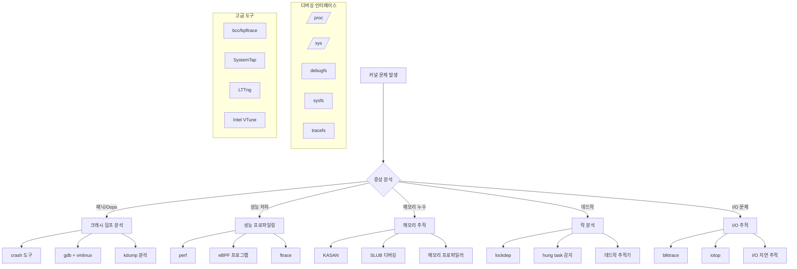

---
tags:
  - Kernel
  - Debugging
  - eBPF
  - ftrace
  - Performance
  - Overview
---

# 4.5.2: 커널 디버깅 기법

## 🎯 "커널 패닉이 발생해요"

"안녕하세요, 운영 중인 서버에서 간헐적으로 커널 패닉이 발생하고 있어요. dmesg에는 오류 메시지가 있지만 원인을 파악하기 어렵습니다. 특정 워크로드에서만 발생하는 것 같은데, 커널 레벨에서 뭔가 잘못되고 있는 것 같습니다. 어떻게 디버깅할 수 있을까요?"

커널 레벨의 문제는 시스템 전체에 영향을 미치므로 신속하고 정확한 진단이 중요합니다. 현대적인 커널 디버깅 도구와 기법을 체계적으로 학습해보겠습니다.

## 📚 학습 로드맵

이 섹션은 3개의 전문화된 문서로 구성되어 있습니다:

### 1️⃣ [종합 커널 진단 시스템](04-05-03-comprehensive-diagnostic-system.md)

- 통합적인 커널 상태 분석 도구 개발
- 커널 버전 및 디버깅 기능 확인
- dmesg 로그 자동 패턴 분석
- 메모리 사용량과 SLUB 캐시 분석
- 성능 카운터와 락 상태 모니터링
- ftrace와 perf를 활용한 커널 함수 추적
- 하드웨어 오류 감지 (MCE, EDAC)

### 2️⃣ [eBPF 기반 고급 추적 시스템](04-03-03-ebpf-advanced-tracing.md)

- 시스템 호출 지연시간 실시간 분석
- 커널 메모리 누수 감지 및 추적
- 락 경합 모니터링과 성능 병목 발견
- I/O 지연시간 분석과 성능 최적화
- 고성능 eBPF 프로그램 작성 기법
- BCC와 bpftrace를 활용한 동적 추적

### 3️⃣ [실무 적용 사례 및 추가 리소스](04-06-02-practical-cases-resources.md)

- 실제 프로덕션 환경 디버깅 사례
  - 간헐적 응답 지연 문제 해결
  - 높은 시스템 CPU 사용률 최적화
  - 커널 패닉 분석과 크래시 덤프 해석
- 디버깅 도구 비교 및 선택 가이드
- 추가 학습 리소스와 실습 환경 구축
- 초급자부터 고급자까지 학습 로드맵

## 🛠️ 커널 디버깅 도구 생태계

## 🎯 핵심 개념 비교표

| 도구 유형 | 전통적 방법 | 현대적 방법 | 주요 장점 |
|-----------|------------|------------|----------|
| **시스템 진단** | strace, lsof | 통합 분석 도구 | 자동화된 패턴 인식 |
| **성능 분석** | top, sar | perf, eBPF | 나노초 단위 정밀 측정 |
| **메모리 추적** | /proc 수동 확인 | KASAN, SLUB 디버깅 | 실시간 누수 감지 |
| **커널 추적** | printk 로그 | ftrace, eBPF | 오버헤드 최소화 |
| **크래시 분석** | 로그 기반 추측 | crash + kdump | 완전한 메모리 덤프 분석 |

## 🚀 실전 활용 시나리오

### 시나리오 1: 간헐적 시스템 성능 저하

- **적용 도구**: 종합 진단 시스템 + eBPF 추적
- **핵심 이점**: 자동화된 패턴 분석과 실시간 성능 모니터링
- **해결 과정**: 시스템 리소스 → 커널 함수 → 성능 병목 식별

### 시나리오 2: 메모리 누수와 OOM 킬러

- **적용 도구**: SLUB 디버깅 + eBPF 메모리 추적
- **핵심 이점**: 실시간 할당/해제 패턴 분석
- **해결 과정**: 메모리 사용량 → 누수 프로세스 → 스택 트레이스

### 시나리오 3: 커널 패닉과 시스템 크래시

- **적용 도구**: crash + kdump 분석
- **핵심 이점**: 완전한 메모리 덤프로 정확한 원인 파악
- **해결 과정**: 크래시 덤프 → 백트레이스 → 드라이버/하드웨어 문제

### 시나리오 4: 높은 시스템 CPU와 락 경합

- **적용 도구**: eBPF 락 추적 + perf 분석
- **핵심 이점**: 나노초 단위 락 대기 시간 측정
- **해결 과정**: 시스템 호출 → 락 경합 → 최적화 포인트

## 🔗 연관 학습

### 선행 학습

- [시스템 호출과 커널](04-01-01-system-call-basics.md) - 커널 인터페이스 기초
- [커널 아키텍처](04-01-02-kernel-architecture.md) - 커널 내부 구조 이해

### 후속 학습

- [성능 최적화](../chapter-11-performance-optimization/index.md) - 시스템 성능 튜닝
- [보안 엔지니어링](../chapter-17-security-engineering/index.md) - 시스템 보안과 디버깅

## 🏆 학습 성과 지표

이 시리즈를 완주하면 다음과 같은 역량을 갖추게 됩니다:

- ✅ **종합 진단**: 커널 레벨 문제를 체계적으로 분석하고 해결
- ✅ **고급 추적**: eBPF와 ftrace를 활용한 실시간 성능 모니터링
- ✅ **프로덕션 대응**: 실무에서 발생하는 복잡한 시스템 문제 해결
- ✅ **도구 개발**: 맞춤형 디버깅 도구와 모니터링 시스템 구축

커널 디버깅은 시스템 안정성과 성능에 직결되는 핵심 기술입니다. 체계적인 학습을 통해 어떤 커널 문제든 자신 있게 해결할 수 있는 전문가가 되어보십시오! 🎯🔧

---

**다음**: [종합 커널 진단 시스템](04-05-03-comprehensive-diagnostic-system.md)으로 시작하여 단계별 학습을 진행하세요.
