---
tags:
  - character-device
  - deep-study
  - device-driver
  - hands-on
  - intermediate
  - kernel-development
  - kernel-module
  - proc-filesystem
  - 시스템프로그래밍
difficulty: INTERMEDIATE
learning_time: "6-10시간"
main_topic: "시스템 프로그래밍"
priority_score: 5
---

# 4.6.1: 실무 커널 모듈 개발

## 이 섹션에서 학습할 내용

- 완전한 "Hello World" 커널 모듈 개발
- proc 파일시스템을 통한 인터페이스 구현
- 커널 모듈 컴파일과 테스트 방법
- 실무에서 기억해야 할 커널 개발 원칙

## 들어가며: 나만의 커널 코드 작성

이론을 배운 후에는 직접 해보는 것이 가장 좋은 학습 방법입니다. 이 섹션에서는 실제로 동작하는 커널 모듈을 처음부터 끝까지 개발해보겠습니다. 단순한 "Hello World"를 넘어서 사용자와 상호작용할 수 있는 정교한 모듈을 만들어보겠습니다.

## 1. 완전한 "Hello World" 커널 모듈

### 1.1 모듈 소스 코드

```c
// hello.c
#include <linux/init.h>
#include <linux/module.h>
#include <linux/kernel.h>
#include <linux/proc_fs.h>
#include <linux/uaccess.h>

#define PROC_FILENAME "hello_proc"

static struct proc_dir_entry *proc_entry;

// proc 파일 읽기 함수
static ssize_t hello_read(struct file *file, char __user *buffer,
                         size_t count, loff_t *pos) {
    static const char message[] = "Hello from kernel module!\n";
    size_t message_len = sizeof(message) - 1;

    if (*pos >= message_len) {
        return 0;  // EOF
    }

    if (count > message_len - *pos) {
        count = message_len - *pos;
    }

    if (copy_to_user(buffer, message + *pos, count)) {
        return -EFAULT;
    }

    *pos += count;
    return count;
}

// proc 파일 쓰기 함수
static ssize_t hello_write(struct file *file, const char __user *buffer,
                          size_t count, loff_t *pos) {
    printk(KERN_INFO "Hello module: received %zu bytes\n", count);
    return count;
}

// 파일 연산 구조체
static const struct proc_ops hello_proc_ops = {
    .proc_read = hello_read,
    .proc_write = hello_write,
};

// 모듈 초기화
static int __init hello_init(void) {
    printk(KERN_INFO "Hello module: initializing\n");

    // /proc/hello_proc 파일 생성
    proc_entry = proc_create(PROC_FILENAME, 0666, NULL, &hello_proc_ops);
    if (!proc_entry) {
        printk(KERN_ERR "Hello module: failed to create proc entry\n");
        return -ENOMEM;
    }

    printk(KERN_INFO "Hello module: loaded successfully\n");
    return 0;
}

// 모듈 정리
static void __exit hello_exit(void) {
    if (proc_entry) {
        proc_remove(proc_entry);
    }
    printk(KERN_INFO "Hello module: unloaded\n");
}

module_init(hello_init);
module_exit(hello_exit);

MODULE_LICENSE("GPL");
MODULE_AUTHOR("Your Name");
MODULE_DESCRIPTION("Hello World kernel module with proc interface");
MODULE_VERSION("1.0");
```

### 1.2 Makefile 작성

```makefile
# Makefile
obj-m += hello.o

KERNEL_DIR := /lib/modules/$(shell uname -r)/build
PWD := $(shell pwd)

all:
 $(MAKE) -C $(KERNEL_DIR) M=$(PWD) modules

clean:
 $(MAKE) -C $(KERNEL_DIR) M=$(PWD) clean

install:
 sudo insmod hello.ko

remove:
 sudo rmmod hello

test:
 echo "Testing module..."
 cat /proc/hello_proc
 echo "Hello from userspace!" | sudo tee /proc/hello_proc
 dmesg | tail -5
```

### 1.3 컴파일과 테스트

```bash
# 컴파일
$ make
make -C /lib/modules/5.15.0-generic/build M=/home/user/hello modules
make[1]: Entering directory '/usr/src/linux-headers-5.15.0-generic'
  CC [M]  /home/user/hello/hello.o
  MODPOST /home/user/hello/Module.symvers
  CC [M]  /home/user/hello/hello.mod.o
  LD [M]  /home/user/hello/hello.ko
make[1]: Leaving directory '/usr/src/linux-headers-5.15.0-generic'

# 모듈 로드
$ sudo insmod hello.ko

# 테스트
$ cat /proc/hello_proc
Hello from kernel module!

$ echo "Test message" | sudo tee /proc/hello_proc
Test message

$ dmesg | tail -3
[  123.456789] Hello module: loaded successfully
[  124.567890] Hello module: received 13 bytes

# 모듈 제거
$ sudo rmmod hello
$ dmesg | tail -1
[  125.678901] Hello module: unloaded
```

## 2. 고급 커널 모듈: 디바이스 드라이버

### 2.1 사용자 인터페이스를 가진 디바이스

```c
// advanced_device.c
#include <linux/init.h>
#include <linux/module.h>
#include <linux/fs.h>
#include <linux/cdev.h>
#include <linux/device.h>
#include <linux/uaccess.h>
#include <linux/slab.h>
#include <linux/mutex.h>

#define DEVICE_NAME "advanced_dev"
#define CLASS_NAME "advanced"
#define BUFFER_SIZE 1024

static int major_number;
static struct class *device_class = NULL;
static struct device *device_handle = NULL;
static struct cdev device_cdev;

// 디바이스 데이터 구조체
struct device_data {
    char buffer[BUFFER_SIZE];
    size_t buffer_size;
    struct mutex lock;
    int open_count;
};

static struct device_data *dev_data;

// 디바이스 열기
static int device_open(struct inode *inode, struct file *file) {
    mutex_lock(&dev_data->lock);
    
    dev_data->open_count++;
    printk(KERN_INFO "Device opened (count: %d)\n", dev_data->open_count);
    
    // 비블록킹 오픈인지 확인
    if (file->f_flags & O_NONBLOCK) {
        printk(KERN_INFO "Non-blocking open\n");
    }
    
    mutex_unlock(&dev_data->lock);
    return 0;
}

// 디바이스 닫기
static int device_release(struct inode *inode, struct file *file) {
    mutex_lock(&dev_data->lock);
    
    dev_data->open_count--;
    printk(KERN_INFO "Device closed (count: %d)\n", dev_data->open_count);
    
    mutex_unlock(&dev_data->lock);
    return 0;
}

// 디바이스 읽기
static ssize_t device_read(struct file *file, char __user *user_buffer,
                          size_t count, loff_t *pos) {
    ssize_t bytes_read = 0;
    
    mutex_lock(&dev_data->lock);
    
    // 더 이상 읽을 데이터가 없음
    if (*pos >= dev_data->buffer_size) {
        goto out;
    }
    
    // 읽을 바이트 수 계산
    if (count > dev_data->buffer_size - *pos) {
        count = dev_data->buffer_size - *pos;
    }
    
    // 사용자 공간으로 데이터 복사
    if (copy_to_user(user_buffer, dev_data->buffer + *pos, count)) {
        bytes_read = -EFAULT;
        goto out;
    }
    
    *pos += count;
    bytes_read = count;
    
    printk(KERN_DEBUG "Read %zu bytes from device\n", count);
    
out:
    mutex_unlock(&dev_data->lock);
    return bytes_read;
}

// 디바이스 쓰기
static ssize_t device_write(struct file *file, const char __user *user_buffer,
                           size_t count, loff_t *pos) {
    ssize_t bytes_written = 0;
    
    mutex_lock(&dev_data->lock);
    
    // 버퍼 오버플로우 방지
    if (*pos >= BUFFER_SIZE) {
        bytes_written = -ENOSPC;
        goto out;
    }
    
    if (count > BUFFER_SIZE - *pos) {
        count = BUFFER_SIZE - *pos;
    }
    
    // 사용자 공간에서 데이터 복사
    if (copy_from_user(dev_data->buffer + *pos, user_buffer, count)) {
        bytes_written = -EFAULT;
        goto out;
    }
    
    *pos += count;
    if (*pos > dev_data->buffer_size) {
        dev_data->buffer_size = *pos;
    }
    
    bytes_written = count;
    printk(KERN_DEBUG "Written %zu bytes to device\n", count);
    
out:
    mutex_unlock(&dev_data->lock);
    return bytes_written;
}

// ioctl 처리
#define IOCTL_RESET    _IO('a', 1)
#define IOCTL_GET_SIZE _IOR('a', 2, int)
#define IOCTL_SET_SIZE _IOW('a', 3, int)

static long device_ioctl(struct file *file, unsigned int cmd, unsigned long arg) {
    int retval = 0;
    
    switch (cmd) {
    case IOCTL_RESET:
        mutex_lock(&dev_data->lock);
        dev_data->buffer_size = 0;
        memset(dev_data->buffer, 0, BUFFER_SIZE);
        mutex_unlock(&dev_data->lock);
        printk(KERN_INFO "Device buffer reset\n");
        break;
        
    case IOCTL_GET_SIZE:
        mutex_lock(&dev_data->lock);
        retval = put_user(dev_data->buffer_size, (int __user *)arg);
        mutex_unlock(&dev_data->lock);
        break;
        
    case IOCTL_SET_SIZE:
        {
            int new_size;
            if (get_user(new_size, (int __user *)arg)) {
                retval = -EFAULT;
                break;
            }
            
            if (new_size < 0 || new_size > BUFFER_SIZE) {
                retval = -EINVAL;
                break;
            }
            
            mutex_lock(&dev_data->lock);
            dev_data->buffer_size = new_size;
            mutex_unlock(&dev_data->lock);
            printk(KERN_INFO "Device buffer size set to %d\n", new_size);
        }
        break;
        
    default:
        retval = -ENOTTY;
        break;
    }
    
    return retval;
}

// 파일 연산 구조체
static const struct file_operations device_fops = {
    .owner = THIS_MODULE,
    .open = device_open,
    .release = device_release,
    .read = device_read,
    .write = device_write,
    .unlocked_ioctl = device_ioctl,
};

// 모듈 초기화
static int __init advanced_init(void) {
    int ret;
    dev_t dev_num;
    
    printk(KERN_INFO "Advanced device module initializing\n");
    
    // 디바이스 데이터 할당
    dev_data = kzalloc(sizeof(struct device_data), GFP_KERNEL);
    if (!dev_data) {
        return -ENOMEM;
    }
    
    mutex_init(&dev_data->lock);
    
    // 주요 번호 할당
    ret = alloc_chrdev_region(&dev_num, 0, 1, DEVICE_NAME);
    if (ret < 0) {
        printk(KERN_ERR "Failed to allocate device numbers\n");
        goto err_alloc;
    }
    
    major_number = MAJOR(dev_num);
    
    // cdev 초기화
    cdev_init(&device_cdev, &device_fops);
    device_cdev.owner = THIS_MODULE;
    
    ret = cdev_add(&device_cdev, dev_num, 1);
    if (ret) {
        printk(KERN_ERR "Failed to add cdev\n");
        goto err_cdev;
    }
    
    // 디바이스 클래스 생성
    device_class = class_create(THIS_MODULE, CLASS_NAME);
    if (IS_ERR(device_class)) {
        ret = PTR_ERR(device_class);
        printk(KERN_ERR "Failed to create device class\n");
        goto err_class;
    }
    
    // 디바이스 노드 생성
    device_handle = device_create(device_class, NULL, dev_num, NULL, DEVICE_NAME);
    if (IS_ERR(device_handle)) {
        ret = PTR_ERR(device_handle);
        printk(KERN_ERR "Failed to create device\n");
        goto err_device;
    }
    
    printk(KERN_INFO "Advanced device module loaded (major: %d)\n", major_number);
    return 0;
    
err_device:
    class_destroy(device_class);
err_class:
    cdev_del(&device_cdev);
err_cdev:
    unregister_chrdev_region(MKDEV(major_number, 0), 1);
err_alloc:
    kfree(dev_data);
    return ret;
}

// 모듈 정리
static void __exit advanced_exit(void) {
    device_destroy(device_class, MKDEV(major_number, 0));
    class_destroy(device_class);
    cdev_del(&device_cdev);
    unregister_chrdev_region(MKDEV(major_number, 0), 1);
    
    if (dev_data) {
        mutex_destroy(&dev_data->lock);
        kfree(dev_data);
    }
    
    printk(KERN_INFO "Advanced device module unloaded\n");
}

module_init(advanced_init);
module_exit(advanced_exit);

MODULE_LICENSE("GPL");
MODULE_AUTHOR("Your Name");
MODULE_DESCRIPTION("Advanced character device driver");
MODULE_VERSION("1.0");
```

### 2.2 사용자 공간 테스트 프로그램

```c
// test_device.c
#include <stdio.h>
#include <stdlib.h>
#include <string.h>
#include <unistd.h>
#include <fcntl.h>
#include <sys/ioctl.h>

#define DEVICE_PATH "/dev/advanced_dev"
#define IOCTL_RESET    _IO('a', 1)
#define IOCTL_GET_SIZE _IOR('a', 2, int)
#define IOCTL_SET_SIZE _IOW('a', 3, int)

int main() {
    int fd;
    char buffer[1024];
    ssize_t bytes;
    int size;
    
    // 디바이스 열기
    fd = open(DEVICE_PATH, O_RDWR);
    if (fd < 0) {
        perror("Failed to open device");
        return 1;
    }
    
    printf("Device opened successfully\n");
    
    // 디바이스에 데이터 쓰기
    const char *test_data = "Hello from userspace!";
    bytes = write(fd, test_data, strlen(test_data));
    printf("Written %zd bytes: %s\n", bytes, test_data);
    
    // 현재 크기 확인
    if (ioctl(fd, IOCTL_GET_SIZE, &size) == 0) {
        printf("Current buffer size: %d bytes\n", size);
    }
    
    // 디바이스에서 데이터 읽기
    lseek(fd, 0, SEEK_SET);  // 처음으로 이동
    bytes = read(fd, buffer, sizeof(buffer) - 1);
    if (bytes > 0) {
        buffer[bytes] = '\0';
        printf("Read %zd bytes: %s\n", bytes, buffer);
    }
    
    // 버퍼 리셋
    if (ioctl(fd, IOCTL_RESET) == 0) {
        printf("Buffer reset successfully\n");
    }
    
    // 크기 확인
    if (ioctl(fd, IOCTL_GET_SIZE, &size) == 0) {
        printf("Buffer size after reset: %d bytes\n", size);
    }
    
    close(fd);
    printf("Device closed\n");
    
    return 0;
}
```

### 2.3 고급 모듈 테스트

```bash
# 모듈 컴파일은 이전과 동일
$ make

# 모듈 로드
$ sudo insmod advanced_device.ko

# 디바이스 노드 확인
$ ls -l /dev/advanced_dev
crw-rw-rw- 1 root root 240, 0 Jan 15 10:30 /dev/advanced_dev

# 테스트 프로그램 컴파일
$ gcc -o test_device test_device.c

# 테스트 실행
$ ./test_device
Device opened successfully
Written 22 bytes: Hello from userspace!
Current buffer size: 22 bytes
Read 22 bytes: Hello from userspace!
Buffer reset successfully
Buffer size after reset: 0 bytes
Device closed

# 커널 메시지 확인
$ dmesg | tail -10
[  456.789] Advanced device module loaded (major: 240)
[  457.123] Device opened (count: 1)
[  457.124] Written 22 bytes to device
[  457.125] Read 22 bytes from device
[  457.126] Device buffer reset
[  457.127] Device closed (count: 0)
```

## 3. 커널 개발 모범 사례

### 3.1 오류 처리 패턴

```c
// 올바른 오류 처리 예제
static int device_init_resources(struct my_device *dev) {
    int ret = 0;
    
    // 순차적 자원 할당
    dev->buffer = kzalloc(BUFFER_SIZE, GFP_KERNEL);
    if (!dev->buffer) {
        ret = -ENOMEM;
        goto err_buffer;
    }
    
    dev->work_queue = alloc_workqueue("my_device_wq", 0, 1);
    if (!dev->work_queue) {
        ret = -ENOMEM;
        goto err_workqueue;
    }
    
    ret = request_irq(dev->irq, device_interrupt_handler, 
                      IRQF_SHARED, "my_device", dev);
    if (ret) {
        printk(KERN_ERR "Failed to request IRQ %d\n", dev->irq);
        goto err_irq;
    }
    
    mutex_init(&dev->lock);
    init_completion(&dev->completion);
    
    return 0;
    
    // 역순으로 자원 정리
err_irq:
    destroy_workqueue(dev->work_queue);
err_workqueue:
    kfree(dev->buffer);
err_buffer:
    return ret;
}

static void device_cleanup_resources(struct my_device *dev) {
    if (dev) {
        free_irq(dev->irq, dev);
        
        if (dev->work_queue) {
            flush_workqueue(dev->work_queue);
            destroy_workqueue(dev->work_queue);
        }
        
        mutex_destroy(&dev->lock);
        kfree(dev->buffer);
    }
}
```

### 3.2 성능 최적화 기법

```c
// 캐시 친화적 데이터 구조
struct optimized_device {
    // 자주 액세스되는 데이터 (첫 번째 캐시 라인)
    volatile int status;        // 4 bytes
    atomic_t ref_count;         // 4 bytes
    spinlock_t fast_lock;       // 보통 8 bytes
    
    // 중간 빈도 액세스 데이터
    struct list_head list;
    wait_queue_head_t wait_queue;
    
    // 드문 사용 데이터 (다음 캐시 라인)
    char name[NAME_LENGTH];
    void *private_data;
    struct mutex slow_lock;
} __attribute__((packed, aligned(64)));

// 빠른 경로 최적화
static inline int fast_operation(struct optimized_device *dev, int value) {
    // likely/unlikely 힌트
    if (likely(atomic_read(&dev->ref_count) > 0)) {
        // 일반적인 경우
        spin_lock(&dev->fast_lock);
        dev->status = value;
        spin_unlock(&dev->fast_lock);
        return 0;
    }
    
    // 드문 경우
    if (unlikely(value < 0)) {
        return -EINVAL;
    }
    
    return slow_operation(dev, value);
}

// 비동기 I/O를 위한 work queue 활용
struct work_data {
    struct work_struct work;
    struct optimized_device *dev;
    int operation_type;
    void *data;
};

static void async_work_handler(struct work_struct *work) {
    struct work_data *work_data = container_of(work, struct work_data, work);
    
    // 무거운 작업 수행
    perform_heavy_operation(work_data->dev, work_data->data);
    
    // 완료 신호
    complete(&work_data->dev->completion);
    kfree(work_data);
}

static int schedule_async_operation(struct optimized_device *dev, void *data) {
    struct work_data *work_data;
    
    work_data = kzalloc(sizeof(*work_data), GFP_KERNEL);
    if (!work_data)
        return -ENOMEM;
        
    INIT_WORK(&work_data->work, async_work_handler);
    work_data->dev = dev;
    work_data->data = data;
    
    queue_work(dev->work_queue, &work_data->work);
    return 0;
}
```

## 4. 실무 커널 개발 원칙

### 4.1 커널에서 기억해야 할 것들

```mermaid
mindmap
  root(("커널 개발 원칙"))
    메모리 관리
      적절한 GFP 플래그
        GFP_KERNEL: 일반
        GFP_ATOMIC: 인터럽트
        GFP_USER: 사용자
      할당 후 반드시 해제
      메모리 누수 방지
    동기화
      짧은 임계구역: 스핀락
      긴 임계구역: 뮤텍스
      읽기 전용: RCU
      데드락 방지
    오류 처리
      모든 함수 작용 검사
      goto 문 활용
      역순 자원 정리
      적절한 errno 설정
    컨텍스트 인식
      인터럽트 vs 프로세스
      원자적 vs 수면 가능
      커널 vs 사용자 공간
```



### 4.2 커널 개발 체크리스트

```c
// 커널 모듈 개발 체크리스트

/* [v] 기본 모듈 설정 */
// [v] MODULE_LICENSE 설정
// [v] MODULE_AUTHOR 설정
// [v] MODULE_DESCRIPTION 설정
// [v] module_init/module_exit 지정

/* [v] 메모리 관리 */
// [v] 모든 kmalloc에 대응하는 kfree
// [v] 인터럽트 컨텍스트에서 GFP_ATOMIC 사용
// [v] 메모리 할당 실패 처리
// [v] 사용자 공간 접근 시 copy_to_user/copy_from_user

/* [v] 동기화 */
// [v] 공유 데이터 보호를 위한 락 사용
// [v] 인터럽트 비활성화를 고려한 spin_lock_irqsave
// [v] 데드락 방지를 위한 락 순서 유지

/* [v] 오류 처리 */
// [v] 모든 함수 반환값 검사
// [v] goto 방식의 오류 처리
// [v] 역순으로 자원 정리
// [v] 적절한 오류 코드 반환

/* [v] 보안 */
// [v] 입력 값 검증
// [v] 버퍼 오버플로우 방지
// [v] 권한 검사
// [v] 사용자 데이터 신뢰하지 않기

/* [v] 디버깅 */
// [v] 적절한 printk 레벨 사용
// [v] /proc 또는 /sys 인터페이스 제공
// [v] 디버그 빌드에서만 디버그 메시지
```

### 4.3 성능 최적화 가이드라인

1. **빠른 경로 최적화**
   - likely/unlikely 힌트 활용
   - 인라인 함수로 호출 오버헤드 감소
   - 캐시 친화적 데이터 구조 설계

2. **동기화 오버헤드 최소화**
   - 짧은 임계 구역에는 스핀락
   - 읽기 전용 접근은 RCU 고려
   - lock-free 알고리즘 활용

3. **메모리 관리 최적화**
   - 자주 사용되는 객체는 slab cache
   - 대용량 메모리는 vmalloc 고려
   - 메모리 풀링으로 할당/해제 빈도 감소

4. **비동기 처리 활용**
   - work queue로 무거운 작업 연기
   - completion으로 비동기 동기화
   - tasklet으로 전용 작업 처리

## 핵심 요점

### 1. 커널 모듈 개발의 기초

단순한 "Hello World"부터 시작하여 사용자와 상호작용하는 복잡한 디바이스 드라이버까지 단계적으로 접근해야 합니다.

### 2. 안전한 자원 관리

모든 리소스 할당에 대해 적절한 오류 처리와 정리 코드를 작성해야 합니다.

### 3. 사용자 공간 인터페이스

proc, sysfs, character device 등을 통해 사용자 공간과 안전하게 통신하는 방법을 마스터해야 합니다.

### 4. 성능과 안정성의 균형

커널 개발에서는 고성능과 안정성을 동시에 달성하는 것이 가장 중요합니다.

---

**이전**: [04-05-01-sync-memory-debug.md](04-05-01-sync-memory-debug.md)  
**다음 단계**: 전체 커널 아키텍처 이해를 바탕으로 [04-01-07-system-call-implementation.md](04-01-07-system-call-implementation.md)에서 시스템 호출 내부 구현을 학습합니다.

## 📚 관련 문서

### 📖 현재 문서 정보

- **난이도**: INTERMEDIATE
- **주제**: 시스템 프로그래밍
- **예상 시간**: 6-10시간

### 🎯 학습 경로

- [📚 INTERMEDIATE 레벨 전체 보기](../learning-paths/intermediate/)
- [🏠 메인 학습 경로](../learning-paths/)
- [📋 전체 가이드 목록](../README.md)

### 📂 같은 챕터 (chapter-04-syscall-kernel)

- [Chapter 4-1-1: 시스템 호출 기초와 인터페이스](./04-01-01-system-call-basics.md)
- [Chapter 4-1-2: 리눅스 커널 아키텍처 개요](./04-01-02-kernel-architecture.md)
- [Chapter 4-1-3: 커널 설계 철학과 아키텍처 기초](./04-01-03-kernel-design-philosophy.md)
- [Chapter 4-1-3: 커널 설계 철학과 전체 구조](./04-01-04-kernel-design-structure.md)
- [Chapter 4-1-5: 핵심 서브시스템 탐구](./04-01-05-core-subsystems.md)

### 🏷️ 관련 키워드

`kernel-module`, `device-driver`, `proc-filesystem`, `character-device`, `kernel-development`

### ⏭️ 다음 단계 가이드

- 실무 적용을 염두에 두고 프로젝트에 적용해보세요
- 관련 도구들을 직접 사용해보는 것이 중요합니다
