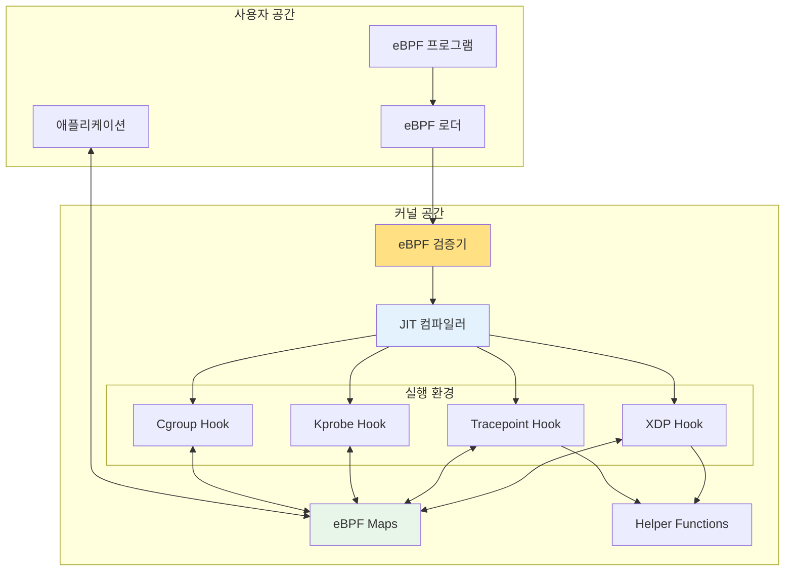

---
tags:
  - XDP
  - advanced
  - deep-study
  - eBPF
  - hands-on
  - kernel programming
  - network security
  - performance monitoring
  - 시스템프로그래밍
difficulty: ADVANCED
learning_time: "15-25시간"
main_topic: "시스템 프로그래밍"
priority_score: 4
---

# 4.4e: eBPF - 커널 프로그래밍의 혁명

## 🎯 이 문서를 읽고 나면 얻을 수 있는 것들

이 문서를 마스터하면, 여러분은:

1. **"eBPF가 왜 게임 체인저인가요?"** - 커널 내에서 안전하게 실행되는 사용자 코드의 혁신성을 이해합니다
2. **"네트워크 패킷을 어떻게 필터링하나요?"** - XDP를 통한 고성능 패킷 처리를 배웁니다
3. **"시스템 호출을 어떻게 추적하나요?"** - 트레이스포인트와 kprobe를 활용한 모니터링을 익힙니다
4. **"성능 분석은 어떻게 하나요?"** - eBPF를 이용한 실시간 시스템 분석 기법을 배웁니다

## 1. eBPF 개념과 아키텍처

### 1.1 eBPF의 혁신성

eBPF(Extended Berkeley Packet Filter)는 사용자가 커널 내부에서 실행되는 작은 프로그램을 작성할 수 있게 해주는 혁신적인 기술입니다.



### 1.2 간단한 eBPF 프로그램

```c
// simple_ebpf.c - 간단한 eBPF 프로그램
#include <linux/bpf.h>
#include <linux/if_ether.h>
#include <linux/ip.h>
#include <linux/tcp.h>
#include <bpf/bpf_helpers.h>

// 패킷 카운터 맵
struct {
    __uint(type, BPF_MAP_TYPE_ARRAY);
    __uint(max_entries, 256);
    __type(key, __u32);
    __type(value, __u64);
} packet_count SEC(".maps");

// XDP 프로그램: 네트워크 패킷 필터링
SEC("xdp")
int packet_filter(struct xdp_md *ctx) {
    void *data_end = (void *)(long)ctx->data_end;
    void *data = (void *)(long)ctx->data;
    
    // 이더넷 헤더 검사
    struct ethhdr *eth = data;
    if ((void *)(eth + 1) > data_end)
        return XDP_PASS;
    
    // IP 패킷만 처리
    if (eth->h_proto != __constant_htons(ETH_P_IP))
        return XDP_PASS;
    
    // IP 헤더 검사
    struct iphdr *ip = (void *)(eth + 1);
    if ((void *)(ip + 1) > data_end)
        return XDP_PASS;
    
    // 패킷 카운터 업데이트
    __u32 protocol = ip->protocol;
    __u64 *count = bpf_map_lookup_elem(&packet_count, &protocol);
    if (count)
        (*count)++;
    
    // TCP 패킷 특별 처리
    if (ip->protocol == IPPROTO_TCP) {
        struct tcphdr *tcp = (void *)(ip + 1);
        if ((void *)(tcp + 1) > data_end)
            return XDP_PASS;
        
        // 특정 포트 차단 (예: 8080)
        if (tcp->dest == __constant_htons(8080)) {
            return XDP_DROP;  // 패킷 드롭
        }
    }
    
    return XDP_PASS;  // 패킷 통과
}

// 트레이스포인트 프로그램: 시스템 호출 추적
SEC("tracepoint/syscalls/sys_enter_open")
int trace_open(void *ctx) {
    char comm[16];
    bpf_get_current_comm(&comm, sizeof(comm));
    
    bpf_printk("프로세스 %s가 파일을 열었습니다\n", comm);
    return 0;
}

char LICENSE[] SEC("license") = "GPL";
```

## 2. eBPF 프로그램 로드와 사용

### 2.1 eBPF 프로그램 로더

```c
// ebpf_loader.c - eBPF 프로그램 로더
#include <stdio.h>
#include <stdlib.h>
#include <unistd.h>
#include <bpf/bpf.h>
#include <bpf/libbpf.h>
#include <net/if.h>

int main(int argc, char *argv[]) {
    struct bpf_object *obj;
    struct bpf_program *prog;
    int prog_fd, map_fd;
    int ifindex;
    
    if (argc != 2) {
        printf("사용법: %s <interface>\n", argv[0]);
        return 1;
    }
    
    ifindex = if_nametoindex(argv[1]);
    if (ifindex == 0) {
        printf("인터페이스 %s를 찾을 수 없습니다\n", argv[1]);
        return 1;
    }
    
    // eBPF 오브젝트 파일 로드
    obj = bpf_object__open_file("simple_ebpf.o", NULL);
    if (libbpf_get_error(obj)) {
        printf("eBPF 오브젝트 파일을 열 수 없습니다\n");
        return 1;
    }
    
    // 커널로 로드
    if (bpf_object__load(obj)) {
        printf("eBPF 프로그램을 로드할 수 없습니다\n");
        bpf_object__close(obj);
        return 1;
    }
    
    // XDP 프로그램 찾기
    prog = bpf_object__find_program_by_name(obj, "packet_filter");
    if (!prog) {
        printf("XDP 프로그램을 찾을 수 없습니다\n");
        bpf_object__close(obj);
        return 1;
    }
    
    prog_fd = bpf_program__fd(prog);
    
    // 네트워크 인터페이스에 XDP 프로그램 연결
    if (bpf_set_link_xdp_fd(ifindex, prog_fd, 0) < 0) {
        printf("XDP 프로그램을 인터페이스에 연결할 수 없습니다\n");
        bpf_object__close(obj);
        return 1;
    }
    
    printf("eBPF 프로그램이 %s에 연결되었습니다\n", argv[1]);
    
    // 맵 찾기
    struct bpf_map *map = bpf_object__find_map_by_name(obj, "packet_count");
    if (map) {
        map_fd = bpf_map__fd(map);
        
        printf("패킷 통계 모니터링 중... (Ctrl+C로 중단)\n");
        
        while (1) {
            sleep(5);
            
            printf("\n=== 패킷 통계 ===\n");
            for (__u32 key = 0; key < 256; key++) {
                __u64 value;
                if (bpf_map_lookup_elem(map_fd, &key, &value) == 0 && value > 0) {
                    const char *protocol_name = "알 수 없음";
                    switch (key) {
                        case IPPROTO_TCP: protocol_name = "TCP"; break;
                        case IPPROTO_UDP: protocol_name = "UDP"; break;
                        case IPPROTO_ICMP: protocol_name = "ICMP"; break;
                    }
                    printf("프로토콜 %s (ID %u): %llu 패킷\n", 
                           protocol_name, key, value);
                }
            }
        }
    }
    
    // 정리
    bpf_set_link_xdp_fd(ifindex, -1, 0);  // XDP 프로그램 해제
    bpf_object__close(obj);
    
    return 0;
}
```

### 2.2 Makefile과 컴파일

```makefile
# Makefile - eBPF 프로그램 빌드
CLANG = clang
LLC = llc
CC = gcc

# eBPF 프로그램 컴파일 플래그
BPF_CFLAGS = -O2 -target bpf -c
BPF_HEADERS = -I/usr/include/x86_64-linux-gnu

# 사용자 공간 프로그램 컴파일 플래그
USER_CFLAGS = -O2 -Wall
USER_LIBS = -lbpf -lelf -lz

.PHONY: all clean

all: simple_ebpf.o ebpf_loader

# eBPF 프로그램 컴파일
simple_ebpf.o: simple_ebpf.c
 $(CLANG) $(BPF_CFLAGS) $(BPF_HEADERS) -o $@ $<

# 사용자 공간 로더 컴파일
ebpf_loader: ebpf_loader.c
 $(CC) $(USER_CFLAGS) -o $@ $< $(USER_LIBS)

# 실행 권한이 필요한 작업들
install: all
 sudo ./ebpf_loader eth0

# 디버깅을 위한 어셈블리 출력
disasm: simple_ebpf.o
 llvm-objdump -S simple_ebpf.o

clean:
 rm -f *.o ebpf_loader

# 도움말
help:
 @echo "Available targets:"
 @echo "  all       - Build eBPF program and loader"
 @echo "  install   - Load eBPF program (requires sudo)"
 @echo "  disasm    - Show disassembly"
 @echo "  clean     - Remove build files"
```

## 3. 고급 eBPF 활용 예제

### 3.1 시스템 호출 모니터링

```c
// syscall_monitor.c - 시스템 호출 모니터링 eBPF 프로그램
#include <linux/bpf.h>
#include <bpf/bpf_helpers.h>
#include <linux/ptrace.h>

// 시스템 호출 통계 맵
struct {
    __uint(type, BPF_MAP_TYPE_HASH);
    __uint(max_entries, 1024);
    __type(key, __u32);    // 시스템 호출 번호
    __type(value, __u64);  // 호출 횟수
} syscall_stats SEC(".maps");

// 프로세스별 시스템 호출 맵
struct {
    __uint(type, BPF_MAP_TYPE_HASH);
    __uint(max_entries, 1024);
    __type(key, __u32);    // PID
    __type(value, __u64);  // 총 시스템 호출 수
} process_stats SEC(".maps");

// 시스템 호출 진입점
SEC("tracepoint/raw_syscalls/sys_enter")
int trace_syscall_enter(struct bpf_raw_tracepoint_args *ctx) {
    __u64 id = bpf_get_current_pid_tgid();
    __u32 pid = id >> 32;
    __u32 syscall_nr = ctx->args[1];
    
    // 시스템 호출별 통계 업데이트
    __u64 *count = bpf_map_lookup_elem(&syscall_stats, &syscall_nr);
    if (count) {
        (*count)++;
    } else {
        __u64 initial = 1;
        bpf_map_update_elem(&syscall_stats, &syscall_nr, &initial, BPF_ANY);
    }
    
    // 프로세스별 통계 업데이트
    __u64 *proc_count = bpf_map_lookup_elem(&process_stats, &pid);
    if (proc_count) {
        (*proc_count)++;
    } else {
        __u64 initial = 1;
        bpf_map_update_elem(&process_stats, &pid, &initial, BPF_ANY);
    }
    
    // 특정 시스템 호출 로깅
    if (syscall_nr == 2) {  // sys_open
        char comm[16];
        bpf_get_current_comm(&comm, sizeof(comm));
        bpf_printk("Process %s (PID: %d) called open()\n", comm, pid);
    }
    
    return 0;
}

// 파일 열기 시스템 호출 상세 추적
SEC("tracepoint/syscalls/sys_enter_openat")
int trace_openat(struct trace_event_raw_sys_enter *ctx) {
    __u64 id = bpf_get_current_pid_tgid();
    __u32 pid = id >> 32;
    
    char comm[16];
    bpf_get_current_comm(&comm, sizeof(comm));
    
    // 파일명을 안전하게 읽기 (최대 64바이트)
    char filename[64];
    bpf_probe_read_user_str(&filename, sizeof(filename), (void *)ctx->args[1]);
    
    bpf_printk("PID %d (%s) opening: %s\n", pid, comm, filename);
    
    return 0;
}

char LICENSE[] SEC("license") = "GPL";
```

### 3.2 네트워크 보안 필터

```c
// network_security.c - 네트워크 보안 필터 eBPF 프로그램
#include <linux/bpf.h>
#include <linux/if_ether.h>
#include <linux/ip.h>
#include <linux/tcp.h>
#include <linux/udp.h>
#include <bpf/bpf_helpers.h>
#include <bpf/bpf_endian.h>

// 차단된 IP 주소 맵
struct {
    __uint(type, BPF_MAP_TYPE_HASH);
    __uint(max_entries, 10000);
    __type(key, __u32);    // IP 주소
    __type(value, __u64);  // 차단 시간
} blocked_ips SEC(".maps");

// 포트별 연결 수 추적
struct {
    __uint(type, BPF_MAP_TYPE_HASH);
    __uint(max_entries, 65536);
    __type(key, __u16);    // 포트 번호
    __type(value, __u32);  // 연결 수
} port_connections SEC(".maps");

// 보안 이벤트 링 버퍼
struct {
    __uint(type, BPF_MAP_TYPE_RINGBUF);
    __uint(max_entries, 256 * 1024);
} security_events SEC(".maps");

struct security_event {
    __u32 src_ip;
    __u32 dst_ip;
    __u16 src_port;
    __u16 dst_port;
    __u8 protocol;
    __u8 action;  // 0=PASS, 1=DROP
    __u64 timestamp;
};

// XDP 보안 필터
SEC("xdp")
int security_filter(struct xdp_md *ctx) {
    void *data_end = (void *)(long)ctx->data_end;
    void *data = (void *)(long)ctx->data;
    
    // 이더넷 헤더 파싱
    struct ethhdr *eth = data;
    if ((void *)(eth + 1) > data_end)
        return XDP_PASS;
    
    if (eth->h_proto != bpf_htons(ETH_P_IP))
        return XDP_PASS;
    
    // IP 헤더 파싱
    struct iphdr *ip = (void *)(eth + 1);
    if ((void *)(ip + 1) > data_end)
        return XDP_PASS;
    
    __u32 src_ip = bpf_ntohl(ip->saddr);
    __u32 dst_ip = bpf_ntohl(ip->daddr);
    
    // 차단된 IP 확인
    if (bpf_map_lookup_elem(&blocked_ips, &src_ip)) {
        // 보안 이벤트 기록
        struct security_event *event = bpf_ringbuf_reserve(&security_events, 
                                                          sizeof(*event), 0);
        if (event) {
            event->src_ip = src_ip;
            event->dst_ip = dst_ip;
            event->src_port = 0;
            event->dst_port = 0;
            event->protocol = ip->protocol;
            event->action = 1;  // DROP
            event->timestamp = bpf_ktime_get_ns();
            bpf_ringbuf_submit(event, 0);
        }
        
        return XDP_DROP;
    }
    
    // TCP 패킷 상세 검사
    if (ip->protocol == IPPROTO_TCP) {
        struct tcphdr *tcp = (void *)(ip + 1);
        if ((void *)(tcp + 1) > data_end)
            return XDP_PASS;
        
        __u16 dst_port = bpf_ntohs(tcp->dest);
        
        // 포트별 연결 수 업데이트
        __u32 *conn_count = bpf_map_lookup_elem(&port_connections, &dst_port);
        if (conn_count) {
            (*conn_count)++;
        } else {
            __u32 initial = 1;
            bpf_map_update_elem(&port_connections, &dst_port, &initial, BPF_ANY);
        }
        
        // SYN 플래그가 설정된 패킷 (새 연결 시도)
        if (tcp->syn && !tcp->ack) {
            // 포트 스캔 감지 (단순한 예)
            if (dst_port > 1024 && dst_port < 1100) {
                // 의심스러운 포트 범위 스캔
                struct security_event *event = 
                    bpf_ringbuf_reserve(&security_events, sizeof(*event), 0);
                if (event) {
                    event->src_ip = src_ip;
                    event->dst_ip = dst_ip;
                    event->src_port = bpf_ntohs(tcp->source);
                    event->dst_port = dst_port;
                    event->protocol = IPPROTO_TCP;
                    event->action = 0;  // PASS (but logged)
                    event->timestamp = bpf_ktime_get_ns();
                    bpf_ringbuf_submit(event, 0);
                }
            }
        }
        
        // DDoS 방지: 특정 포트로의 과도한 연결 시도
        if (conn_count && *conn_count > 1000) {
            // 임시 IP 차단 (1분)
            __u64 block_until = bpf_ktime_get_ns() + 60000000000ULL;
            bpf_map_update_elem(&blocked_ips, &src_ip, &block_until, BPF_ANY);
            
            return XDP_DROP;
        }
    }
    
    return XDP_PASS;
}

char LICENSE[] SEC("license") = "GPL";
```

### 3.3 사용자 공간 이벤트 처리기

```c
// security_monitor.c - 보안 이벤트 모니터
#include <stdio.h>
#include <stdlib.h>
#include <unistd.h>
#include <signal.h>
#include <time.h>
#include <arpa/inet.h>
#include <bpf/bpf.h>
#include <bpf/libbpf.h>

struct security_event {
    __u32 src_ip;
    __u32 dst_ip;
    __u16 src_port;
    __u16 dst_port;
    __u8 protocol;
    __u8 action;
    __u64 timestamp;
};

static volatile int running = 1;

void signal_handler(int sig) {
    running = 0;
}

const char* ip_to_string(__u32 ip) {
    static char buffer[INET_ADDRSTRLEN];
    struct in_addr addr;
    addr.s_addr = htonl(ip);
    inet_ntop(AF_INET, &addr, buffer, INET_ADDRSTRLEN);
    return buffer;
}

const char* protocol_to_string(__u8 protocol) {
    switch (protocol) {
        case IPPROTO_TCP: return "TCP";
        case IPPROTO_UDP: return "UDP";
        case IPPROTO_ICMP: return "ICMP";
        default: return "UNKNOWN";
    }
}

int handle_security_event(void *ctx, void *data, size_t data_sz) {
    struct security_event *event = (struct security_event *)data;
    
    // 타임스탬프를 읽을 수 있는 형태로 변환
    time_t timestamp = event->timestamp / 1000000000ULL;
    struct tm *tm_info = localtime(&timestamp);
    char time_str[64];
    strftime(time_str, sizeof(time_str), "%Y-%m-%d %H:%M:%S", tm_info);
    
    printf("[%s] %s Event: %s:%u -> %s:%u (%s)\n",
           time_str,
           event->action ? "DROP" : "PASS",
           ip_to_string(event->src_ip), event->src_port,
           ip_to_string(event->dst_ip), event->dst_port,
           protocol_to_string(event->protocol));
    
    // 보안 이벤트 로그 파일에 저장
    static FILE *log_file = NULL;
    if (!log_file) {
        log_file = fopen("security.log", "a");
    }
    
    if (log_file) {
        fprintf(log_file, "%s,%s,%s,%u,%s,%u,%s\n",
                time_str,
                event->action ? "DROP" : "PASS",
                ip_to_string(event->src_ip), event->src_port,
                ip_to_string(event->dst_ip), event->dst_port,
                protocol_to_string(event->protocol));
        fflush(log_file);
    }
    
    return 0;
}

void print_statistics(struct bpf_object *obj) {
    struct bpf_map *port_map = bpf_object__find_map_by_name(obj, "port_connections");
    struct bpf_map *blocked_map = bpf_object__find_map_by_name(obj, "blocked_ips");
    
    if (!port_map || !blocked_map) return;
    
    int port_fd = bpf_map__fd(port_map);
    int blocked_fd = bpf_map__fd(blocked_map);
    
    printf("\n=== 보안 통계 ===\n");
    
    // 상위 10개 포트 연결 수 출력
    printf("상위 포트별 연결 수:\n");
    __u16 port = 0;
    __u32 connections;
    
    // 간단한 방법: 잘 알려진 포트들만 확인
    __u16 common_ports[] = {22, 23, 25, 53, 80, 110, 143, 443, 993, 995, 0};
    
    for (int i = 0; common_ports[i] != 0; i++) {
        if (bpf_map_lookup_elem(port_fd, &common_ports[i], &connections) == 0) {
            if (connections > 0) {
                printf("  포트 %u: %u 연결\n", common_ports[i], connections);
            }
        }
    }
    
    // 차단된 IP 수 계산
    __u32 blocked_count = 0;
    __u32 ip = 0;
    __u64 block_time;
    __u64 current_time = time(NULL) * 1000000000ULL;
    
    // BPF_MAP_TYPE_HASH의 모든 엔트리를 순회하는 것은 복잡하므로
    // 여기서는 간단히 맵 크기 정보만 출력
    printf("\n차단된 IP 관리 중...\n");
}

int main(int argc, char *argv[]) {
    struct bpf_object *obj;
    struct ring_buffer *rb = NULL;
    int err;
    
    if (argc != 2) {
        printf("사용법: %s <interface>\n", argv[0]);
        return 1;
    }
    
    signal(SIGINT, signal_handler);
    signal(SIGTERM, signal_handler);
    
    // eBPF 프로그램 로드
    obj = bpf_object__open_file("network_security.o", NULL);
    if (libbpf_get_error(obj)) {
        fprintf(stderr, "eBPF 오브젝트 로드 실패\n");
        return 1;
    }
    
    err = bpf_object__load(obj);
    if (err) {
        fprintf(stderr, "eBPF 프로그램 로드 실패\n");
        goto cleanup;
    }
    
    // XDP 프로그램 인터페이스에 연결
    struct bpf_program *prog = bpf_object__find_program_by_name(obj, "security_filter");
    if (!prog) {
        fprintf(stderr, "보안 필터 프로그램을 찾을 수 없습니다\n");
        goto cleanup;
    }
    
    int ifindex = if_nametoindex(argv[1]);
    int prog_fd = bpf_program__fd(prog);
    
    if (bpf_set_link_xdp_fd(ifindex, prog_fd, 0) < 0) {
        fprintf(stderr, "XDP 프로그램 연결 실패\n");
        goto cleanup;
    }
    
    printf("네트워크 보안 모니터링 시작 (인터페이스: %s)\n", argv[1]);
    printf("Ctrl+C로 중단\n\n");
    
    // 링 버퍼 설정
    struct bpf_map *events_map = bpf_object__find_map_by_name(obj, "security_events");
    if (events_map) {
        rb = ring_buffer__new(bpf_map__fd(events_map), handle_security_event, NULL, NULL);
        if (!rb) {
            fprintf(stderr, "링 버퍼 설정 실패\n");
            goto cleanup;
        }
    }
    
    // 이벤트 처리 루프
    while (running) {
        if (rb) {
            err = ring_buffer__poll(rb, 1000);  // 1초 타임아웃
            if (err == -EINTR) {
                break;
            }
            if (err < 0) {
                fprintf(stderr, "링 버퍼 폴링 오류: %d\n", err);
                break;
            }
        }
        
        // 5초마다 통계 출력
        static time_t last_stats = 0;
        time_t now = time(NULL);
        if (now - last_stats >= 5) {
            print_statistics(obj);
            last_stats = now;
        }
    }
    
    printf("\n보안 모니터링 종료\n");
    
cleanup:
    if (rb)
        ring_buffer__free(rb);
    
    // XDP 프로그램 해제
    bpf_set_link_xdp_fd(ifindex, -1, 0);
    
    if (obj)
        bpf_object__close(obj);
    
    return err;
}
```

## 4. eBPF 성능 최적화와 모니터링

### 4.1 성능 측정 도구

```c
// perf_monitor.c - eBPF 성능 모니터링
#include <linux/bpf.h>
#include <bpf/bpf_helpers.h>
#include <linux/ptrace.h>

// 성능 메트릭 맵
struct {
    __uint(type, BPF_MAP_TYPE_PERCPU_ARRAY);
    __uint(max_entries, 10);
    __type(key, __u32);
    __type(value, __u64);
} perf_metrics SEC(".maps");

#define METRIC_SYSCALLS     0
#define METRIC_PAGE_FAULTS  1
#define METRIC_CONTEXT_SWITCHES 2
#define METRIC_CPU_CYCLES   3

// 시스템 호출 카운터
SEC("tracepoint/raw_syscalls/sys_enter")
int count_syscalls(void *ctx) {
    __u32 key = METRIC_SYSCALLS;
    __u64 *count = bpf_map_lookup_elem(&perf_metrics, &key);
    if (count)
        (*count)++;
    
    return 0;
}

// 페이지 폴트 카운터
SEC("tracepoint/exceptions/page_fault_user")
int count_page_faults(void *ctx) {
    __u32 key = METRIC_PAGE_FAULTS;
    __u64 *count = bpf_map_lookup_elem(&perf_metrics, &key);
    if (count)
        (*count)++;
    
    return 0;
}

// 컨텍스트 스위치 카운터
SEC("tracepoint/sched/sched_switch")
int count_context_switches(void *ctx) {
    __u32 key = METRIC_CONTEXT_SWITCHES;
    __u64 *count = bpf_map_lookup_elem(&perf_metrics, &key);
    if (count)
        (*count)++;
    
    return 0;
}

// CPU 사이클 측정 (kprobe 예제)
SEC("kprobe/finish_task_switch")
int measure_cpu_cycles(struct pt_regs *ctx) {
    __u64 cycles = bpf_get_smp_processor_id();  // 간단한 예제
    __u32 key = METRIC_CPU_CYCLES;
    __u64 *count = bpf_map_lookup_elem(&perf_metrics, &key);
    if (count)
        (*count) += cycles;
    
    return 0;
}

char LICENSE[] SEC("license") = "GPL";
```

### 4.2 성능 분석 도구

```c
// perf_analyzer.c - eBPF 성능 분석기
#include <stdio.h>
#include <stdlib.h>
#include <unistd.h>
#include <time.h>
#include <bpf/bpf.h>
#include <bpf/libbpf.h>

struct perf_data {
    __u64 syscalls;
    __u64 page_faults;
    __u64 context_switches;
    __u64 cpu_cycles;
};

void print_performance_report(struct perf_data *current, struct perf_data *previous, 
                            double interval) {
    printf("\n=== 성능 보고서 (%.1f초 간격) ===\n", interval);
    
    __u64 syscall_rate = (current->syscalls - previous->syscalls) / interval;
    __u64 pf_rate = (current->page_faults - previous->page_faults) / interval;
    __u64 cs_rate = (current->context_switches - previous->context_switches) / interval;
    
    printf("시스템 호출/초: %lu\n", syscall_rate);
    printf("페이지 폴트/초: %lu\n", pf_rate);
    printf("컨텍스트 스위치/초: %lu\n", cs_rate);
    
    // 성능 지표 분석
    if (syscall_rate > 10000) {
        printf("⚠️  높은 시스템 호출 빈도 감지\n");
    }
    
    if (pf_rate > 1000) {
        printf("⚠️  높은 페이지 폴트 빈도 - 메모리 압박 가능성\n");
    }
    
    if (cs_rate > 5000) {
        printf("⚠️  높은 컨텍스트 스위치 빈도 - CPU 경합 가능성\n");
    }
    
    printf("\n");
}

int collect_metrics(int map_fd, struct perf_data *data) {
    __u32 key;
    __u64 value;
    
    // CPU별 데이터를 합산
    int nr_cpus = libbpf_num_possible_cpus();
    __u64 *values = calloc(nr_cpus, sizeof(__u64));
    
    if (!values) return -1;
    
    // 시스템 호출 수
    key = 0;
    if (bpf_map_lookup_elem(map_fd, &key, values) == 0) {
        data->syscalls = 0;
        for (int i = 0; i < nr_cpus; i++) {
            data->syscalls += values[i];
        }
    }
    
    // 페이지 폴트 수
    key = 1;
    if (bpf_map_lookup_elem(map_fd, &key, values) == 0) {
        data->page_faults = 0;
        for (int i = 0; i < nr_cpus; i++) {
            data->page_faults += values[i];
        }
    }
    
    // 컨텍스트 스위치 수
    key = 2;
    if (bpf_map_lookup_elem(map_fd, &key, values) == 0) {
        data->context_switches = 0;
        for (int i = 0; i < nr_cpus; i++) {
            data->context_switches += values[i];
        }
    }
    
    // CPU 사이클
    key = 3;
    if (bpf_map_lookup_elem(map_fd, &key, values) == 0) {
        data->cpu_cycles = 0;
        for (int i = 0; i < nr_cpus; i++) {
            data->cpu_cycles += values[i];
        }
    }
    
    free(values);
    return 0;
}

int main() {
    struct bpf_object *obj;
    struct bpf_map *map;
    int map_fd;
    
    // eBPF 프로그램 로드
    obj = bpf_object__open_file("perf_monitor.o", NULL);
    if (libbpf_get_error(obj)) {
        fprintf(stderr, "eBPF 오브젝트 로드 실패\n");
        return 1;
    }
    
    if (bpf_object__load(obj)) {
        fprintf(stderr, "eBPF 프로그램 로드 실패\n");
        bpf_object__close(obj);
        return 1;
    }
    
    // 성능 메트릭 맵 찾기
    map = bpf_object__find_map_by_name(obj, "perf_metrics");
    if (!map) {
        fprintf(stderr, "성능 메트릭 맵을 찾을 수 없습니다\n");
        bpf_object__close(obj);
        return 1;
    }
    
    map_fd = bpf_map__fd(map);
    
    printf("eBPF 성능 모니터링 시작\n");
    printf("Ctrl+C로 중단\n");
    
    struct perf_data current_data = {0};
    struct perf_data previous_data = {0};
    
    // 초기 데이터 수집
    collect_metrics(map_fd, &previous_data);
    
    while (1) {
        sleep(5);  // 5초 간격
        
        collect_metrics(map_fd, &current_data);
        print_performance_report(&current_data, &previous_data, 5.0);
        
        previous_data = current_data;
    }
    
    bpf_object__close(obj);
    return 0;
}
```

## 5. 정리: eBPF 활용 가이드

### 📊 eBPF의 장단점

**장점:**

- 커널 모듈 없이 커널 기능 확장
- 안전성 (검증기를 통한 사전 검사)
- 고성능 (JIT 컴파일, 커널 내 실행)
- 동적 로딩/언로딩 가능
- 다양한 훅 포인트 지원

**단점:**

- 학습 곡선이 가파름
- 디버깅이 어려움
- 커널 버전 의존성
- 제한된 프로그래밍 모델

### 🎯 사용 시나리오

**eBPF를 사용해야 할 때:**

- 네트워크 패킷 고성능 처리
- 시스템 호출 모니터링
- 보안 필터링 및 감시
- 성능 프로파일링
- 커널 디버깅

**eBPF를 사용하지 말아야 할 때:**

- 복잡한 비즈니스 로직
- 상태를 많이 유지해야 하는 작업
- 부동소수점 연산이 필요한 경우
- 커널과의 깊은 상호작용이 필요한 경우

### ⚡ 성능 최적화 팁

1. **맵 선택**: 용도에 맞는 맵 타입 선택
2. **검증기 친화적 코드**: 루프 제한, 메모리 접근 검사
3. **CPU별 데이터**: PERCPU 맵으로 락 경합 방지
4. **효율적인 데이터 구조**: 링 버퍼 활용
5. **프로그램 크기 최적화**: 불필요한 코드 제거

## 다음 단계

eBPF는 현대 리눅스 시스템의 핵심 기술 중 하나입니다. 이를 통해:

- 시스템 성능을 실시간으로 모니터링
- 네트워크 보안을 강화
- 애플리케이션 동작을 상세히 분석
- 커널의 동작을 안전하게 확장

할 수 있습니다. eBPF는 계속 발전하는 기술이므로, 최신 동향을 주시하고 실제 프로젝트에 적용해보며 경험을 쌓는 것이 중요합니다!

## 참고 자료

- [eBPF Official Documentation](https://ebpf.io/)
- [Linux Kernel BPF Documentation](https://www.kernel.org/doc/html/latest/bpf/)
- [libbpf Library](https://github.com/libbpf/libbpf)
- [BCC Tools](https://github.com/iovisor/bcc)
- [Cilium eBPF Library](https://github.com/cilium/ebpf)
- [eBPF Summit Talks](https://ebpf.io/summit-2021/)

## 📚 관련 문서

### 📖 현재 문서 정보

- **난이도**: ADVANCED
- **주제**: 시스템 프로그래밍
- **예상 시간**: 15-25시간

### 🎯 학습 경로

- [📚 ADVANCED 레벨 전체 보기](../learning-paths/advanced/)
- [🏠 메인 학습 경로](../learning-paths/)
- [📋 전체 가이드 목록](../README.md)

### 📂 같은 챕터 (chapter-10-syscall-kernel)

- [Chapter 10-1: 시스템 호출 기초와 인터페이스](./10-01-system-call-basics.md)
- [Chapter 10-2: 리눅스 커널 아키텍처 개요](./10-02-kernel-architecture.md)
- [Chapter 10-2A: 커널 설계 철학과 아키텍처 기초](./10-10-kernel-design-philosophy.md)
- [Chapter 10-2A: 커널 설계 철학과 전체 구조](./10-11-kernel-design-structure.md)
- [Chapter 10-2B: 핵심 서브시스템 탐구](./10-12-core-subsystems.md)

### 🏷️ 관련 키워드

`eBPF`, `XDP`, `kernel programming`, `network security`, `performance monitoring`

### ⏭️ 다음 단계 가이드

- 시스템 전체의 관점에서 이해하려 노력하세요
- 다른 고급 주제들과의 연관성을 파악해보세요
