---
tags:
  - intermediate
  - kernel-subsystems
  - medium-read
  - memory-management
  - network-stack
  - scheduler
  - theoretical
  - vfs
  - 시스템프로그래밍
difficulty: INTERMEDIATE
learning_time: "4-6시간"
main_topic: "시스템 프로그래밍"
priority_score: 4
---

# 4.2B: 핵심 서브시스템 탐구

## 이 섹션에서 학습할 내용

- CFS (Completely Fair Scheduler)의 동작 원리
- 커널 메모리 관리 서브시스템의 구조
- VFS (Virtual File System)의 추상화 메커니즘
- 네트워크 스택의 계층화된 프로토콜 처리

## 들어가며: 커널 서브시스템의 협력

리눅스 커널은 여러 전문화된 서브시스템들이 서로 협력하여 동작하는 복잡한 소프트웨어입니다. 각 서브시스템은 특정 자원(CPU, 메모리, 파일, 네트워크)을 관리하는 전문가 역할을 수행하면서도, 다른 서브시스템과 긴밀하게 연결되어 있습니다.

## 1. 프로세스 스케줄러: CFS (Completely Fair Scheduler)

리눅스의 스케줄러는 어떻게 수십만 개의 태스크를 공정하게 관리할까요?

### 1.1 스케줄러 핵심 구조체

```c
// 스케줄러 핵심 구조체 (단순화)
struct task_struct {
    int prio, static_prio, normal_prio;
    struct sched_entity se;
    struct sched_rt_entity rt;
    struct sched_dl_entity dl;

    // 가상 런타임 (CFS의 핵심)
    u64 vruntime;

    // 프로세스 상태
    int state;  // RUNNING, INTERRUPTIBLE, UNINTERRUPTIBLE, etc.

    // 메모리 관리
    struct mm_struct *mm;

    // 파일 디스크립터
    struct files_struct *files;

    // 신호 처리
    struct signal_struct *signal;
};

// CFS 스케줄러의 핵심 알고리즘
static struct task_struct *pick_next_task_fair(struct rq *rq) {
    struct sched_entity *se;
    struct cfs_rq *cfs_rq = &rq->cfs;

    // 적색-흑색 트리에서 가장 왼쪽 노드 선택
    // (가장 작은 vruntime을 가진 태스크)
    se = __pick_first_entity(cfs_rq);
    if (!se)
        return NULL;

    return task_of(se);
}
```

### 1.2 CFS 스케줄링 원리

```mermaid
graph LR
    subgraph "CFS 런큐 (Red-Black Tree)"
        A["Task A<br/>vruntime: 100ms"]
        B["Task B<br/>vruntime: 150ms"]
        C["Task C<br/>vruntime: 75ms"]
        D["Task D<br/>vruntime: 200ms"]
    end
    
    C -->|"가장 작은 vruntime"| RUNNING["현재 실행 중"]
    
    style C fill:#E8F5E9
    style RUNNING fill:#FFE082
```



**CFS의 핵심 아이디어:**

- 각 태스크는 `vruntime` (가상 런타임)을 가짐
- 가장 적은 `vruntime`을 가진 태스크가 다음에 실행됨
- 실행 시간이 늘어날수록 `vruntime`도 증가
- 우선순위가 높을수록 `vruntime` 증가율이 낮음

## 2. 메모리 관리 서브시스템

### 2.1 메모리 관리 핵심 구조체들

```c
// 메모리 관리의 핵심 구조체들
struct mm_struct {
    struct vm_area_struct *mmap;        // VMA 리스트
    struct rb_root mm_rb;               // VMA 적색-흑색 트리

    pgd_t *pgd;                         // 페이지 테이블 디렉토리

    unsigned long start_code, end_code;  // 코드 영역
    unsigned long start_data, end_data;  // 데이터 영역
    unsigned long start_brk, brk;        // 힙 영역
    unsigned long start_stack;           // 스택 영역

    atomic_t mm_users;                   // 참조 카운터
};

// VMA (Virtual Memory Area) - 가상 메모리 영역
struct vm_area_struct {
    unsigned long vm_start;              // 시작 주소
    unsigned long vm_end;                // 끝 주소
    struct vm_area_struct *vm_next;      // 다음 VMA

    pgprot_t vm_page_prot;               // 페이지 보호 속성
    unsigned long vm_flags;              // 플래그 (읽기/쓰기/실행)

    struct file *vm_file;                // 매핑된 파일 (있다면)
    const struct vm_operations_struct *vm_ops;  // 연산들
};
```

### 2.2 가상 메모리 영역 구조

```mermaid
graph TB
    subgraph "프로세스 가상 메모리 공간"
        STACK["스택 영역<br/>지역 변수, 함수 호출"]
        HEAP["힙 영역<br/>동적 할당 (malloc)"]
        BSS["BSS 영역<br/>초기화되지 않은 전역 변수"]
        DATA["데이터 영역<br/>초기화된 전역 변수"]
        TEXT["텍스트 영역<br/>프로그램 코드"]
    end
    
    subgraph "VMA 구조체들"
        VMA1["VMA 1<br/>스택"]
        VMA2["VMA 2<br/>힙"]
        VMA3["VMA 3<br/>BSS"]
        VMA4["VMA 4<br/>데이터"]
        VMA5["VMA 5<br/>텍스트"]
    end
    
    STACK -.-> VMA1
    HEAP -.-> VMA2
    BSS -.-> VMA3
    DATA -.-> VMA4
    TEXT -.-> VMA5
    
    style STACK fill:#FFE082
    style HEAP fill:#E8F5E9
    style DATA fill:#E3F2FD
    style TEXT fill:#FFF3E0
```



## 3. VFS (Virtual File System): 통합 인터페이스

### 3.1 VFS의 핵심 추상화

```c
// VFS의 핵심 추상화
struct super_block {
    struct list_head s_list;        // 슈퍼블록 리스트
    dev_t s_dev;                    // 디바이스 식별자
    unsigned char s_blocksize_bits;  // 블록 크기
    unsigned long s_blocksize;
    loff_t s_maxbytes;              // 최대 파일 크기
    struct file_system_type *s_type; // 파일시스템 타입

    const struct super_operations *s_op; // 연산 함수들
    struct dentry *s_root;          // 루트 디렉토리
};

struct inode {
    umode_t i_mode;                 // 파일 타입과 권한
    unsigned int i_nlink;           // 하드링크 수
    uid_t i_uid;                    // 소유자 ID
    gid_t i_gid;                    // 그룹 ID
    loff_t i_size;                  // 파일 크기

    const struct inode_operations *i_op;
    const struct file_operations *i_fop;
    struct super_block *i_sb;

    union {
        struct pipe_inode_info *i_pipe;
        struct block_device *i_bdev;
        struct cdev *i_cdev;
    };
};

// 파일 연산 예제 (ext4 파일시스템)
const struct file_operations ext4_file_operations = {
    .llseek         = ext4_llseek,
    .read_iter      = ext4_file_read_iter,
    .write_iter     = ext4_file_write_iter,
    .unlocked_ioctl = ext4_ioctl,
    .mmap           = ext4_file_mmap,
    .open           = ext4_file_open,
    .release        = ext4_release_file,
    .fsync          = ext4_sync_file,
};
```

### 3.2 VFS 계층 구조

```mermaid
graph TD
    subgraph "사용자 애플리케이션"
        APP["open(), read(), write()"]
    end
    
    subgraph "VFS 계층"
        SYSCALL["시스템 호출 인터페이스"]
        VFS["VFS 공통 인터페이스"]
        DENTRY["Dentry Cache<br/>디렉토리 엔트리"]
        INODE["Inode Cache<br/>파일 메타데이터"]
    end
    
    subgraph "구체적 파일시스템"
        EXT4["ext4"]
        XFS["XFS"]
        BTRFS["Btrfs"]
        PROC["procfs"]
        TMPFS["tmpfs"]
    end
    
    subgraph "블록 계층"
        BLOCK["블록 디바이스"]
        DISK["물리 디스크"]
    end
    
    APP --> SYSCALL
    SYSCALL --> VFS
    VFS --> DENTRY
    VFS --> INODE
    
    VFS --> EXT4
    VFS --> XFS
    VFS --> BTRFS
    VFS --> PROC
    VFS --> TMPFS
    
    EXT4 --> BLOCK
    XFS --> BLOCK
    BTRFS --> BLOCK
    BLOCK --> DISK
    
    style VFS fill:#FFE082
    style DENTRY fill:#E8F5E9
    style INODE fill:#E3F2FD
```



## 4. 네트워크 스택: 계층화된 프로토콜

### 4.1 네트워크 스택 구조

```c
// 네트워크 스택의 계층 구조
struct net_protocol {
    int (*handler)(struct sk_buff *skb);
    void (*err_handler)(struct sk_buff *skb, u32 info);
    unsigned int no_policy:1,
                 netns_ok:1,
                 icmp_strict_tag_validation:1;
};

// 소켓 구조체
struct socket {
    socket_state state;             // 소켓 상태
    short type;                     // 소켓 타입 (STREAM, DGRAM, etc.)
    unsigned long flags;
    struct file *file;              // 연관된 파일 객체
    struct sock *sk;                // 프로토콜 특화 데이터
    const struct proto_ops *ops;    // 프로토콜 연산
};

// TCP 소켓 (struct sock의 확장)
struct tcp_sock {
    struct inet_connection_sock inet_conn;

    u32 rcv_nxt;                    // 다음 예상 시퀀스 번호
    u32 snd_nxt;                    // 다음 전송 시퀀스 번호
    u32 snd_una;                    // 확인되지 않은 첫 번째 바이트
    u32 window_clamp;               // 윈도우 크기 제한

    struct sk_buff_head out_of_order_queue; // 순서 없는 패킷 큐
};
```

### 4.2 네트워크 패킷 처리 흐름

```mermaid
sequenceDiagram
    participant APP as 애플리케이션
    participant SOCKET as 소켓 계층
    participant TCP as TCP 계층
    participant IP as IP 계층
    participant ETH as 이더넷 계층
    participant HW as 네트워크 하드웨어
    
    Note over APP,HW: 송신 경로
    APP->>SOCKET: send() 시스템 호출
    SOCKET->>TCP: TCP 헤더 추가
    TCP->>IP: IP 헤더 추가
    IP->>ETH: 이더넷 헤더 추가
    ETH->>HW: 물리적 전송
    
    Note over APP,HW: 수신 경로
    HW->>ETH: 인터럽트 발생
    ETH->>IP: 이더넷 헤더 제거
    IP->>TCP: IP 헤더 제거
    TCP->>SOCKET: TCP 처리
    SOCKET->>APP: 데이터 전달
```



### 4.3 sk_buff: 패킷 표현 구조체

```c
// 네트워크 패킷을 표현하는 핵심 구조체
struct sk_buff {
    struct sk_buff *next;           // 리스트 연결
    struct sk_buff *prev;
    
    struct sock *sk;                // 연관된 소켓
    
    unsigned int len;               // 데이터 길이
    unsigned int data_len;          // 페이로드 길이
    
    unsigned char *head;            // 버퍼 시작
    unsigned char *data;            // 현재 데이터 위치
    unsigned char *tail;            // 데이터 끝
    unsigned char *end;             // 버퍼 끝
    
    // 네트워크 헤더 포인터들
    unsigned char *network_header;   // IP 헤더
    unsigned char *transport_header; // TCP/UDP 헤더
    unsigned char *mac_header;       // 이더넷 헤더
};
```

## 핵심 요점

### 1. 스케줄러의 공정성 보장

CFS는 가상 런타임을 통해 모든 프로세스가 공정한 CPU 시간을 받도록 보장합니다.

### 2. 메모리 가상화의 유연성

VMA를 통한 가상 메모리 관리는 프로세스 간 메모리 보호와 효율적인 메모리 사용을 가능하게 합니다.

### 3. VFS의 통합 인터페이스

VFS는 다양한 파일시스템을 동일한 인터페이스로 접근할 수 있게 해주는 강력한 추상화 계층입니다.

### 4. 네트워크 스택의 계층화

계층화된 네트워크 스택은 각 프로토콜의 독립적인 구현과 확장을 가능하게 합니다.

---

**이전**: [04-10-kernel-design-philosophy.md](04-10-kernel-design-philosophy.md)  
**다음**: [04-13-interrupt-module-system.md](04-13-interrupt-module-system.md)에서 인터럽트 처리와 커널 모듈 시스템을 학습합니다.

## 📚 관련 문서

### 📖 현재 문서 정보

- **난이도**: INTERMEDIATE
- **주제**: 시스템 프로그래밍
- **예상 시간**: 4-6시간

### 🎯 학습 경로

- [📚 INTERMEDIATE 레벨 전체 보기](../learning-paths/intermediate/)
- [🏠 메인 학습 경로](../learning-paths/)
- [📋 전체 가이드 목록](../README.md)

### 📂 같은 챕터 (chapter-10-syscall-kernel)

- [Chapter 10-1: 시스템 호출 기초와 인터페이스](./04-01-system-call-basics.md)
- [Chapter 10-2: 리눅스 커널 아키텍처 개요](./04-02-kernel-architecture.md)
- [Chapter 10-2A: 커널 설계 철학과 아키텍처 기초](./04-10-kernel-design-philosophy.md)
- [Chapter 10-2A: 커널 설계 철학과 전체 구조](./04-11-kernel-design-structure.md)
- [Chapter 10-2C: 인터럽트 처리와 모듈 시스템](./04-13-interrupt-module-system.md)

### 🏷️ 관련 키워드

`kernel-subsystems`, `scheduler`, `memory-management`, `vfs`, `network-stack`

### ⏭️ 다음 단계 가이드

- 실무 적용을 염두에 두고 프로젝트에 적용해보세요
- 관련 도구들을 직접 사용해보는 것이 중요합니다
