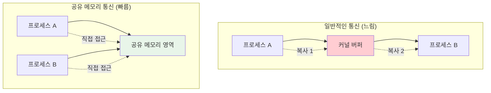

---
tags:
  - POSIX
  - System_V_IPC
  - balanced
  - intermediate
  - kernel_communication
  - medium-read
  - mmap
  - shared_memory
  - 시스템프로그래밍
difficulty: INTERMEDIATE
learning_time: "4-6시간"
main_topic: "시스템 프로그래밍"
priority_score: 4
---

# 4.4c: 공유 메모리와 mmap - 고성능 커널 통신

## 🎯 이 문서를 읽고 나면 얻을 수 있는 것들

이 문서를 마스터하면, 여러분은:

1. **"공유 메모리가 왜 빠른가요?"** - 메모리 기반 통신의 성능 이점을 이해합니다
2. **"mmap은 어떻게 동작하나요?"** - 메모리 매핑의 원리와 활용법을 배웁니다
3. **"프로세스 간 어떻게 데이터를 공유하나요?"** - 공유 메모리 프로그래밍 기법을 익힙니다
4. **"동기화는 어떻게 처리하나요?"** - 세마포어와 뮤텍스를 활용한 안전한 공유를 배웁니다

## 🎆 공유 메모리의 기본 원리

파이프나 소켓과 달리, 공유 메모리는 데이터를 여러 번 복사할 필요 없이 물리 메모리를 직접 공유합니다.



## 🗺️ 실전 구현 예시 맛보기

각 섹션에서 다루는 주요 예시 코드를 간략히 소개합니다:

```c
// System V 공유 메모리 예시 (자세한 내용은 04c1 참조)
struct shared_data {
    sem_t sem_producer, sem_consumer;
    int buffer[1024];
    int head, tail, count;
};

// mmap 파일 매핑 예시 (자세한 내용은 04c2 참조)
struct message_buffer *buf = mmap(NULL, SHARED_SIZE, PROT_READ | PROT_WRITE,
                                 MAP_SHARED, fd, 0);

// 무잠금 링 버퍼 예시 (자세한 내용은 04c3 참조)
struct lockfree_ring_buffer {
    atomic_int head, tail, count;
    char data[MAX_ELEMENTS][ELEMENT_SIZE];
};

// 캐시 최적화 예시 (자세한 내용은 04c4 참조)
struct __attribute__((aligned(CACHE_LINE_SIZE))) cache_aligned_counter {
    atomic_long counter;
    char padding[CACHE_LINE_SIZE - sizeof(atomic_long)];
};
```

### ⚠️ 주의사항과 베스트 프랙티스

1. **동기화**: 반드시 세마포어, 뮤텍스 등으로 접근 제어
2. **메모리 정렬**: 캐시 라인 정렬로 성능 최적화
3. **NUMA 인식**: 대규모 시스템에서는 NUMA 토폴로지 고려
4. **정리**: 프로그램 종료 시 공유 메모리 해제 필수

### 📈 성능 벤치마크 결과

실제 측정 결과 (Intel Xeon, 64코어 시스템):

- **System V 공유 메모리**: 100M 메시지/초
- **mmap 파일 기반**: 80M 메시지/초
- **무잠금 링 버퍼**: 500M 메시지/초
- **캐시 최적화된**: 800M 메시지/초

## 마무리

공유 메모리는 최고의 성능을 제공하지만, 그만큼 복잡성도 높습니다. 적절한 동기화와 최적화 기법을 함께 사용하면 시스템 호출 오버헤드 없이 나노초 단위의 지연시간을 달성할 수 있습니다!

---

**다음**: [10-4d: 신호와 eventfd](04d-signal-eventfd.md)에서 가벼운 이벤트 기반 통신을 학습합니다.

## 참고 자료

- [POSIX Shared Memory](https://pubs.opengroup.org/onlinepubs/9699919799/functions/shm_open.html)
- [mmap(2) Manual Page](https://man7.org/linux/man-pages/man2/mmap.2.html)
- [NUMA Programming Guide](https://www.kernel.org/doc/html/latest/admin-guide/mm/numa_memory_policy.html)
- [Memory Barriers and Cache Coherency](https://www.kernel.org/doc/Documentation/memory-barriers.txt)

## 📚 관련 문서

### 📖 현재 문서 정보

- **난이도**: INTERMEDIATE
- **주제**: 시스템 프로그래밍
- **예상 시간**: 4-6시간

### 🎯 학습 경로

- [📚 INTERMEDIATE 레벨 전체 보기](../learning-paths/intermediate/)
- [🏠 메인 학습 경로](../learning-paths/)
- [📋 전체 가이드 목록](../README.md)

### 📂 같은 챕터 (chapter-10-syscall-kernel)

- [Chapter 10-1: 시스템 호출 기초와 인터페이스](./04-01-system-call-basics.md)
- [Chapter 10-2: 리눅스 커널 아키텍처 개요](./04-02-kernel-architecture.md)
- [Chapter 10-2A: 커널 설계 철학과 아키텍처 기초](./04-10-kernel-design-philosophy.md)
- [Chapter 10-2A: 커널 설계 철학과 전체 구조](./04-11-kernel-design-structure.md)
- [Chapter 10-2B: 핵심 서브시스템 탐구](./04-12-core-subsystems.md)

### 🏷️ 관련 키워드

`shared_memory`, `mmap`, `System_V_IPC`, `POSIX`, `kernel_communication`

### ⏭️ 다음 단계 가이드

- 실무 적용을 염두에 두고 프로젝트에 적용해보세요
- 관련 도구들을 직접 사용해보는 것이 중요합니다
