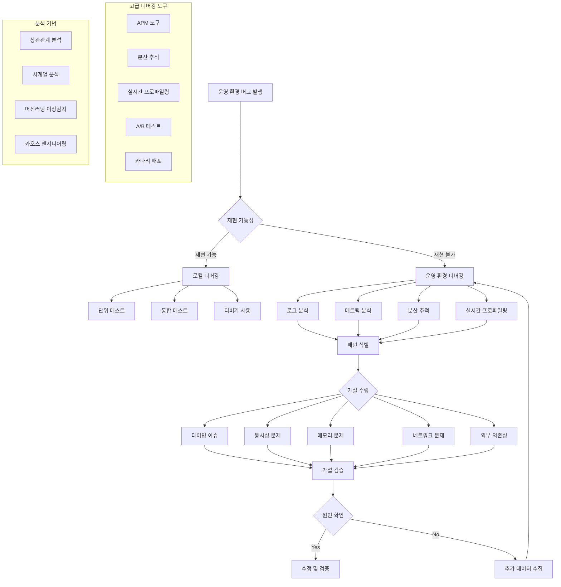

---
tags:
  - Advanced Debugging
  - Root Cause Analysis
  - Production Debugging
  - Troubleshooting
---

# 고급 디버깅 전략: "운영 환경에서만 발생하는 버그"

## 상황: 재현 불가능한 프로덕션 버그

"안녕하세요, 운영 환경에서만 간헐적으로 발생하는 이상한 버그가 있어요. 개발 환경에서는 아무리 테스트해도 재현이 안 되고, 로그도 명확하지 않습니다. 사용자들이 가끔 '응답이 없다'고 하는데 서버는 정상 동작하고 있어요. 이런 상황에서 어떻게 원인을 찾을 수 있을까요?"

이런 상황은 실제 운영 환경에서 가장 어려운 디버깅 시나리오입니다. 체계적인 접근법과 고급 디버깅 기법이 필요합니다.

## 고급 디버깅 방법론



## 1. 종합 디버깅 플랫폼

운영 환경에서 체계적인 디버깅을 위한 통합 시스템입니다.

```python
#!/usr/bin/env python3
# advanced_debugger.py

import os
import sys
import json
import time
import threading
import subprocess
import requests
import pandas as pd
import numpy as np
from datetime import datetime, timedelta
from collections import defaultdict, deque
import logging
import argparse
import concurrent.futures
import sqlite3

class AdvancedDebugger:
    def __init__(self, config_file=None):
        self.config = self._load_config(config_file)
        self.db_connection = self._init_database()
        self.metrics_buffer = deque(maxlen=10000)
        self.correlation_data = defaultdict(list)
        self.anomaly_threshold = 2.0  # 표준편차 기준
        
        # 로깅 설정
        logging.basicConfig(
            level=logging.INFO,
            format='%(asctime)s - %(levelname)s - %(message)s',
            handlers=[
                logging.FileHandler('advanced_debugger.log'),
                logging.StreamHandler()
            ]
        )
        self.logger = logging.getLogger(__name__)
    
    def _load_config(self, config_file):
        """설정 파일 로드"""
        default_config = {
            'monitoring': {
                'interval': 30,
                'metrics_retention': 7200,  # 2시간
                'enable_profiling': True
            },
            'services': {
                'app_endpoints': [],
                'database_urls': [],
                'cache_urls': []
            },
            'thresholds': {
                'response_time': 1000,  # ms
                'error_rate': 0.05,
                'cpu_usage': 80,
                'memory_usage': 85
            },
            'notifications': {
                'webhook_url': '',
                'email_recipients': []
            }
        }
        
        if config_file and os.path.exists(config_file):
            try:
                with open(config_file, 'r') as f:
                    user_config = json.load(f)
                    default_config.update(user_config)
            except Exception as e:
                self.logger.warning(f"설정 파일 로드 실패: {e}")
        
        return default_config
    
    def _init_database(self):
        """디버깅 데이터 저장용 데이터베이스 초기화"""
        conn = sqlite3.connect('debugging_data.db', check_same_thread=False)
        
        # 테이블 생성
        conn.execute('''
            CREATE TABLE IF NOT EXISTS events (
                id INTEGER PRIMARY KEY AUTOINCREMENT,
                timestamp DATETIME,
                event_type TEXT,
                severity TEXT,
                message TEXT,
                metadata JSON,
                correlation_id TEXT
            )
        ''')
        
        conn.execute('''
            CREATE TABLE IF NOT EXISTS metrics (
                id INTEGER PRIMARY KEY AUTOINCREMENT,
                timestamp DATETIME,
                metric_name TEXT,
                value REAL,
                tags JSON
            )
        ''')
        
        conn.execute('''
            CREATE TABLE IF NOT EXISTS traces (
                id INTEGER PRIMARY KEY AUTOINCREMENT,
                trace_id TEXT,
                span_id TEXT,
                parent_span_id TEXT,
                operation_name TEXT,
                start_time DATETIME,
                duration_ms REAL,
                tags JSON,
                logs JSON
            )
        ''')
        
        conn.commit()
        return conn
    
    def collect_system_metrics(self):
        """시스템 메트릭 수집"""
        try:
            import psutil
            
            # CPU 메트릭
            cpu_percent = psutil.cpu_percent(interval=1)
            cpu_per_core = psutil.cpu_percent(percpu=True)
            
            # 메모리 메트릭
            memory = psutil.virtual_memory()
            
            # 디스크 I/O 메트릭
            disk_io = psutil.disk_io_counters()
            
            # 네트워크 I/O 메트릭
            network_io = psutil.net_io_counters()
            
            # 프로세스별 리소스 사용량
            processes = []
            for proc in psutil.process_iter(['pid', 'name', 'cpu_percent', 'memory_percent']):
                try:
                    if proc.info['cpu_percent'] > 5 or proc.info['memory_percent'] > 5:
                        processes.append(proc.info)
                except (psutil.NoSuchProcess, psutil.AccessDenied):
                    continue
            
            metrics = {
                'timestamp': datetime.now().isoformat(),
                'cpu': {
                    'overall': cpu_percent,
                    'per_core': cpu_per_core,
                    'count': psutil.cpu_count()
                },
                'memory': {
                    'total': memory.total,
                    'available': memory.available,
                    'percent': memory.percent,
                    'used': memory.used
                },
                'disk_io': {
                    'read_bytes': disk_io.read_bytes if disk_io else 0,
                    'write_bytes': disk_io.write_bytes if disk_io else 0,
                    'read_count': disk_io.read_count if disk_io else 0,
                    'write_count': disk_io.write_count if disk_io else 0
                },
                'network_io': {
                    'bytes_sent': network_io.bytes_sent,
                    'bytes_recv': network_io.bytes_recv,
                    'packets_sent': network_io.packets_sent,
                    'packets_recv': network_io.packets_recv
                },
                'top_processes': processes[:10]
            }
            
            return metrics
            
        except ImportError:
            self.logger.error("psutil 모듈이 필요합니다: pip install psutil")
            return None
        except Exception as e:
            self.logger.error(f"시스템 메트릭 수집 실패: {e}")
            return None
    
    def collect_application_metrics(self):
        """애플리케이션 메트릭 수집"""
        app_metrics = {}
        
        for endpoint in self.config['services']['app_endpoints']:
            try:
                start_time = time.time()
                response = requests.get(
                    f"{endpoint}/health", 
                    timeout=10,
                    headers={'User-Agent': 'AdvancedDebugger/1.0'}
                )
                response_time = (time.time() - start_time) * 1000  # ms
                
                app_metrics[endpoint] = {
                    'status_code': response.status_code,
                    'response_time_ms': response_time,
                    'content_length': len(response.content),
                    'headers': dict(response.headers)
                }
                
                # 커스텀 메트릭이 있다면 수집
                if response.status_code == 200:
                    try:
                        health_data = response.json()
                        if 'metrics' in health_data:
                            app_metrics[endpoint]['custom_metrics'] = health_data['metrics']
                    except:
                        pass
                        
            except requests.exceptions.RequestException as e:
                app_metrics[endpoint] = {
                    'error': str(e),
                    'status': 'unreachable'
                }
                self.logger.warning(f"애플리케이션 메트릭 수집 실패 {endpoint}: {e}")
        
        return app_metrics
    
    def detect_anomalies(self, metrics):
        """이상 상황 감지"""
        anomalies = []
        
        # CPU 이상 감지
        if 'cpu' in metrics and metrics['cpu']['overall'] > self.config['thresholds']['cpu_usage']:
            anomalies.append({
                'type': 'high_cpu',
                'severity': 'warning',
                'value': metrics['cpu']['overall'],
                'threshold': self.config['thresholds']['cpu_usage'],
                'message': f"높은 CPU 사용률: {metrics['cpu']['overall']:.1f}%"
            })
        
        # 메모리 이상 감지
        if 'memory' in metrics and metrics['memory']['percent'] > self.config['thresholds']['memory_usage']:
            anomalies.append({
                'type': 'high_memory',
                'severity': 'warning',
                'value': metrics['memory']['percent'],
                'threshold': self.config['thresholds']['memory_usage'],
                'message': f"높은 메모리 사용률: {metrics['memory']['percent']:.1f}%"
            })
        
        # 급격한 메트릭 변화 감지 (시계열 기반)
        self.metrics_buffer.append(metrics)
        
        if len(self.metrics_buffer) >= 30:  # 최소 30개 데이터 포인트
            recent_cpu = [m['cpu']['overall'] for m in list(self.metrics_buffer)[-30:] 
                         if 'cpu' in m]
            
            if recent_cpu:
                cpu_mean = np.mean(recent_cpu)
                cpu_std = np.std(recent_cpu)
                current_cpu = recent_cpu[-1]
                
                if abs(current_cpu - cpu_mean) > self.anomaly_threshold * cpu_std:
                    anomalies.append({
                        'type': 'cpu_anomaly',
                        'severity': 'warning',
                        'value': current_cpu,
                        'mean': cpu_mean,
                        'std': cpu_std,
                        'message': f"CPU 사용률 이상 패턴: {current_cpu:.1f}% (평균: {cpu_mean:.1f}%)"
                    })
        
        return anomalies
    
    def analyze_correlations(self, metrics, window_minutes=30):
        """메트릭 간 상관관계 분석"""
        correlations = {}
        
        # 최근 데이터만 사용
        cutoff_time = datetime.now() - timedelta(minutes=window_minutes)
        
        try:
            cursor = self.db_connection.cursor()
            cursor.execute("""
                SELECT metric_name, value, timestamp 
                FROM metrics 
                WHERE timestamp > ? 
                ORDER BY timestamp
            """, (cutoff_time.isoformat(),))
            
            db_metrics = cursor.fetchall()
            
            if len(db_metrics) > 10:
                # 데이터프레임으로 변환
                df = pd.DataFrame(db_metrics, columns=['metric', 'value', 'timestamp'])
                df['timestamp'] = pd.to_datetime(df['timestamp'])
                
                # 피벗 테이블 생성
                pivot_df = df.pivot(index='timestamp', columns='metric', values='value')
                
                # 상관관계 매트릭스 계산
                correlation_matrix = pivot_df.corr()
                
                # 높은 상관관계 (|r| > 0.7) 찾기
                for metric1 in correlation_matrix.columns:
                    for metric2 in correlation_matrix.columns:
                        if metric1 != metric2:
                            corr_value = correlation_matrix.loc[metric1, metric2]
                            if not pd.isna(corr_value) and abs(corr_value) > 0.7:
                                correlations[f"{metric1}_vs_{metric2}"] = corr_value
                
        except Exception as e:
            self.logger.error(f"상관관계 분석 실패: {e}")
        
        return correlations
    
    def collect_distributed_traces(self, trace_id=None):
        """분산 추적 정보 수집"""
        traces = []
        
        # Jaeger, Zipkin 등의 추적 시스템에서 데이터 수집
        # 여기서는 시뮬레이션된 데이터 사용
        
        if trace_id:
            # 특정 trace_id의 스팬들
            cursor = self.db_connection.cursor()
            cursor.execute("""
                SELECT * FROM traces WHERE trace_id = ? ORDER BY start_time
            """, (trace_id,))
            traces = cursor.fetchall()
        else:
            # 최근 추적 데이터
            cursor = self.db_connection.cursor()
            cursor.execute("""
                SELECT * FROM traces 
                WHERE start_time > ? 
                ORDER BY start_time DESC 
                LIMIT 100
            """, ((datetime.now() - timedelta(hours=1)).isoformat(),))
            traces = cursor.fetchall()
        
        return traces
    
    def generate_hypothesis(self, metrics, anomalies, correlations):
        """증상 기반 가설 생성"""
        hypotheses = []
        
        # 높은 CPU 사용률 기반 가설
        high_cpu_anomalies = [a for a in anomalies if a['type'] in ['high_cpu', 'cpu_anomaly']]
        if high_cpu_anomalies:
            hypotheses.append({
                'type': 'cpu_bottleneck',
                'confidence': 0.8,
                'description': 'CPU 병목으로 인한 성능 저하',
                'evidence': high_cpu_anomalies,
                'investigation_steps': [
                    'CPU 프로파일링 실행',
                    '상위 CPU 소모 프로세스 확인',
                    '시스템 호출 패턴 분석',
                    '스레드 덤프 분석'
                ]
            })
        
        # 메모리 이상 기반 가설
        memory_anomalies = [a for a in anomalies if a['type'] == 'high_memory']
        if memory_anomalies:
            hypotheses.append({
                'type': 'memory_leak',
                'confidence': 0.7,
                'description': '메모리 누수 또는 과도한 메모리 사용',
                'evidence': memory_anomalies,
                'investigation_steps': [
                    '힙 덤프 분석',
                    '가비지 컬렉션 로그 확인',
                    '메모리 할당 패턴 추적',
                    '캐시 사용량 검토'
                ]
            })
        
        # 상관관계 기반 가설
        strong_correlations = {k: v for k, v in correlations.items() if abs(v) > 0.85}
        if strong_correlations:
            hypotheses.append({
                'type': 'cascading_failure',
                'confidence': 0.6,
                'description': '연쇄 장애 또는 시스템 간 의존성 문제',
                'evidence': strong_correlations,
                'investigation_steps': [
                    '서비스 의존성 맵 확인',
                    '외부 API 응답시간 모니터링',
                    '데이터베이스 연결 풀 상태 확인',
                    '네트워크 지연시간 측정'
                ]
            })
        
        # 간헐적 문제 패턴 감지
        if len(self.metrics_buffer) > 60:
            recent_errors = []
            for i, metrics_point in enumerate(list(self.metrics_buffer)[-60:]):
                if 'errors' in metrics_point and metrics_point['errors'] > 0:
                    recent_errors.append(i)
            
            # 주기적 패턴 감지
            if len(recent_errors) > 3:
                intervals = [recent_errors[i+1] - recent_errors[i] for i in range(len(recent_errors)-1)]
                if len(set(intervals)) <= 2:  # 일정한 간격
                    hypotheses.append({
                        'type': 'periodic_issue',
                        'confidence': 0.7,
                        'description': '주기적으로 발생하는 문제 (크론 작업, 배치 등)',
                        'evidence': {'error_intervals': intervals},
                        'investigation_steps': [
                            '스케줄된 작업 확인',
                            '배치 프로세스 모니터링',
                            '가비지 컬렉션 주기 확인',
                            '외부 시스템 스케줄 확인'
                        ]
                    })
        
        return hypotheses
    
    def run_automated_diagnostics(self, hypothesis):
        """가설 기반 자동 진단 실행"""
        diagnostics_results = {}
        
        if hypothesis['type'] == 'cpu_bottleneck':
            # CPU 프로파일링 실행
            try:
                result = subprocess.run([
                    'timeout', '30s', 'perf', 'top', '-g', '-K'
                ], capture_output=True, text=True, timeout=35)
                
                if result.returncode == 0:
                    diagnostics_results['perf_top'] = result.stdout
                else:
                    diagnostics_results['perf_top'] = 'perf 실행 실패'
            except:
                diagnostics_results['perf_top'] = '권한 부족 또는 도구 없음'
            
            # 상위 CPU 프로세스
            try:
                result = subprocess.run([
                    'ps', 'aux', '--sort=-%cpu'
                ], capture_output=True, text=True)
                
                lines = result.stdout.split(', ')[:11]  # 헤더 + 상위 10개
                diagnostics_results['top_cpu_processes'] = ', '.join(lines)
            except:
                diagnostics_results['top_cpu_processes'] = '프로세스 정보 수집 실패'
        
        elif hypothesis['type'] == 'memory_leak':
            # 메모리 사용량 상세 분석
            try:
                result = subprocess.run([
                    'ps', 'aux', '--sort=-%mem'
                ], capture_output=True, text=True)
                
                lines = result.stdout.split(', ')[:11]
                diagnostics_results['top_memory_processes'] = ', '.join(lines)
            except:
                diagnostics_results['top_memory_processes'] = '메모리 정보 수집 실패'
            
            # 시스템 메모리 상세
            try:
                with open('/proc/meminfo', 'r') as f:
                    diagnostics_results['meminfo'] = f.read()
            except:
                diagnostics_results['meminfo'] = '메모리 정보 읽기 실패'
        
        return diagnostics_results
    
    def continuous_monitoring(self, duration_minutes=60):
        """연속 모니터링 및 실시간 분석"""
        self.logger.info(f"연속 모니터링 시작 ({duration_minutes}분)")
        
        start_time = time.time()
        end_time = start_time + (duration_minutes * 60)
        
        while time.time() < end_time:
            try:
                # 메트릭 수집
                system_metrics = self.collect_system_metrics()
                app_metrics = self.collect_application_metrics()
                
                if system_metrics:
                    # 데이터베이스에 저장
                    timestamp = datetime.now().isoformat()
                    
                    cursor = self.db_connection.cursor()
                    
                    # 시스템 메트릭 저장
                    cursor.execute("""
                        INSERT INTO metrics (timestamp, metric_name, value, tags)
                        VALUES (?, ?, ?, ?)
                    """, (timestamp, 'cpu_percent', system_metrics['cpu']['overall'], '{}'))
                    
                    cursor.execute("""
                        INSERT INTO metrics (timestamp, metric_name, value, tags)
                        VALUES (?, ?, ?, ?)
                    """, (timestamp, 'memory_percent', system_metrics['memory']['percent'], '{}'))
                    
                    self.db_connection.commit()
                    
                    # 이상 감지
                    anomalies = self.detect_anomalies(system_metrics)
                    
                    if anomalies:
                        self.logger.warning(f"이상 상황 감지: {len(anomalies)}개")
                        
                        # 상관관계 분석
                        correlations = self.analyze_correlations(system_metrics)
                        
                        # 가설 생성
                        hypotheses = self.generate_hypothesis(system_metrics, anomalies, correlations)
                        
                        if hypotheses:
                            # 가장 신뢰도 높은 가설에 대해 자동 진단
                            best_hypothesis = max(hypotheses, key=lambda h: h['confidence'])
                            self.logger.info(f"주요 가설: {best_hypothesis['description']}")
                            
                            diagnostics = self.run_automated_diagnostics(best_hypothesis)
                            
                            # 결과 저장
                            cursor.execute("""
                                INSERT INTO events (timestamp, event_type, severity, message, metadata)
                                VALUES (?, ?, ?, ?, ?)
                            """, (
                                timestamp, 
                                'anomaly_detected', 
                                'warning',
                                best_hypothesis['description'],
                                json.dumps({
                                    'hypothesis': best_hypothesis,
                                    'anomalies': anomalies,
                                    'diagnostics': diagnostics
                                })
                            ))
                            self.db_connection.commit()
                
                # 설정된 간격만큼 대기
                time.sleep(self.config['monitoring']['interval'])
                
            except KeyboardInterrupt:
                self.logger.info("모니터링 중단됨")
                break
            except Exception as e:
                self.logger.error(f"모니터링 오류: {e}")
                time.sleep(5)
    
    def generate_debug_report(self, hours_back=24):
        """종합 디버깅 리포트 생성"""
        print("="*60)
        print("고급 디버깅 리포트")
        print("="*60)
        
        cutoff_time = datetime.now() - timedelta(hours=hours_back)
        
        cursor = self.db_connection.cursor()
        
        # 이벤트 요약
        cursor.execute("""
            SELECT event_type, severity, COUNT(*) as count
            FROM events 
            WHERE timestamp > ?
            GROUP BY event_type, severity
            ORDER BY count DESC
        """, (cutoff_time.isoformat(),))
        
        events_summary = cursor.fetchall()
        
        print(f", 최근 {hours_back}시간 이벤트 요약:")
        print("타입\t\t심각도\t\t횟수")
        print("-" * 40)
        for event_type, severity, count in events_summary:
            print(f"{event_type}\t{severity}\t\t{count}")
        
        # 성능 트렌드
        cursor.execute("""
            SELECT metric_name, AVG(value) as avg_value, MAX(value) as max_value, MIN(value) as min_value
            FROM metrics 
            WHERE timestamp > ?
            GROUP BY metric_name
        """, (cutoff_time.isoformat(),))
        
        metrics_summary = cursor.fetchall()
        
        print(f", 성능 메트릭 요약:")
        print("메트릭\t\t평균\t\t최대\t\t최소")
        print("-" * 50)
        for metric, avg_val, max_val, min_val in metrics_summary:
            print(f"{metric}\t{avg_val:.2f}\t\t{max_val:.2f}\t\t{min_val:.2f}")
        
        # 최근 이상 상황
        cursor.execute("""
            SELECT timestamp, message, metadata
            FROM events 
            WHERE event_type = 'anomaly_detected' AND timestamp > ?
            ORDER BY timestamp DESC
            LIMIT 5
        """, (cutoff_time.isoformat(),))
        
        recent_anomalies = cursor.fetchall()
        
        print(f", 최근 이상 상황:")
        for timestamp, message, metadata in recent_anomalies:
            print(f"- {timestamp}: {message}")
            
            try:
                meta_data = json.loads(metadata)
                if 'hypothesis' in meta_data:
                    hypothesis = meta_data['hypothesis']
                    print(f"  가설: {hypothesis['description']} (신뢰도: {hypothesis['confidence']})")
                    print(f"  조사 단계: {', '.join(hypothesis['investigation_steps'][:2])}...")
            except:
                pass
        
        print(", " + "="*60)
        print("권장사항:")
        
        # 자동 권장사항 생성
        if events_summary:
            most_common_event = events_summary[0]
            if most_common_event[0] == 'anomaly_detected':
                print("1. 반복되는 이상 패턴이 감지되었습니다. 근본 원인 분석이 필요합니다.")
                print("2. 프로덕션 환경에서 상세 프로파일링을 고려하세요.")
                print("3. 모니터링 알림 임계값을 조정하여 노이즈를 줄이세요.")
        
        print("4. 분산 추적을 활성화하여 요청 흐름을 추적하세요.")
        print("5. 카나리 배포나 A/B 테스트로 변경사항의 영향을 최소화하세요.")

def main():
    parser = argparse.ArgumentParser(description='고급 디버깅 도구')
    parser.add_argument('--config', type=str, help='설정 파일 경로')
    parser.add_argument('--monitor', type=int, default=60, 
                       help='연속 모니터링 시간 (분)')
    parser.add_argument('--report', type=int, default=24,
                       help='리포트 기간 (시간)')
    parser.add_argument('--analyze-trace', type=str,
                       help='특정 trace ID 분석')
    
    args = parser.parse_args()
    
    debugger = AdvancedDebugger(args.config)
    
    try:
        if args.analyze_trace:
            traces = debugger.collect_distributed_traces(args.analyze_trace)
            print(f"Trace {args.analyze_trace} 분석 결과: {len(traces)} 스팬")
        elif args.monitor:
            debugger.continuous_monitoring(args.monitor)
        else:
            debugger.generate_debug_report(args.report)
            
    except KeyboardInterrupt:
        print(", 프로그램이 중단되었습니다")
    except Exception as e:
        print(f"오류: {e}")

if __name__ == '__main__':
    main()
```
