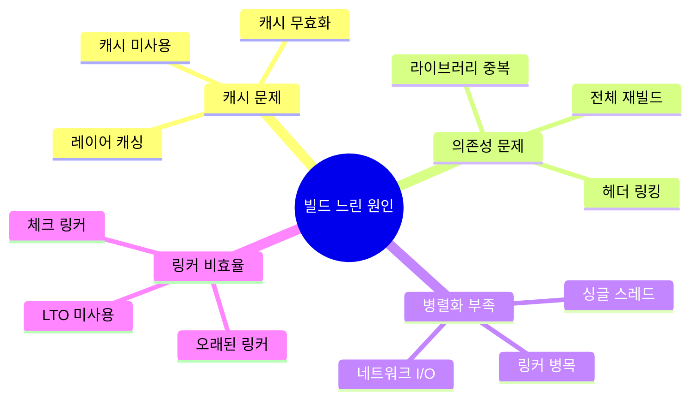
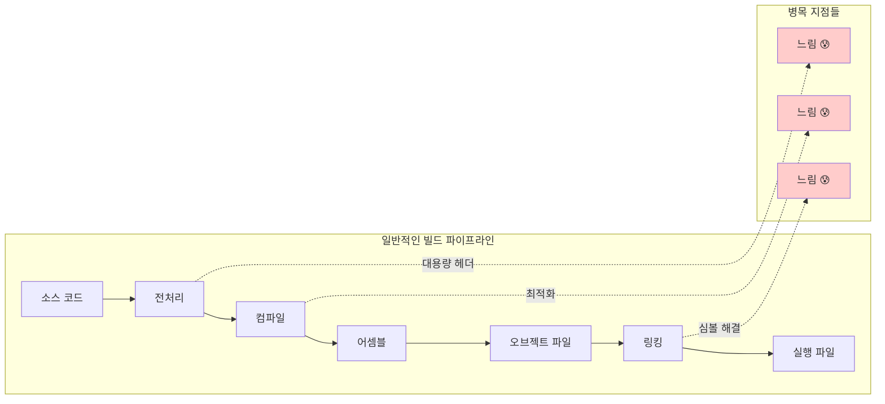
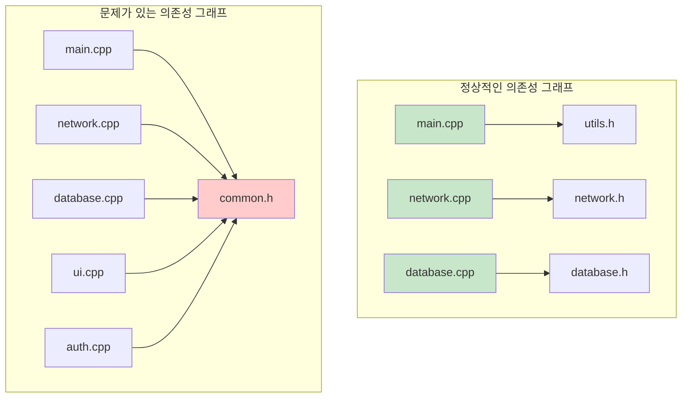
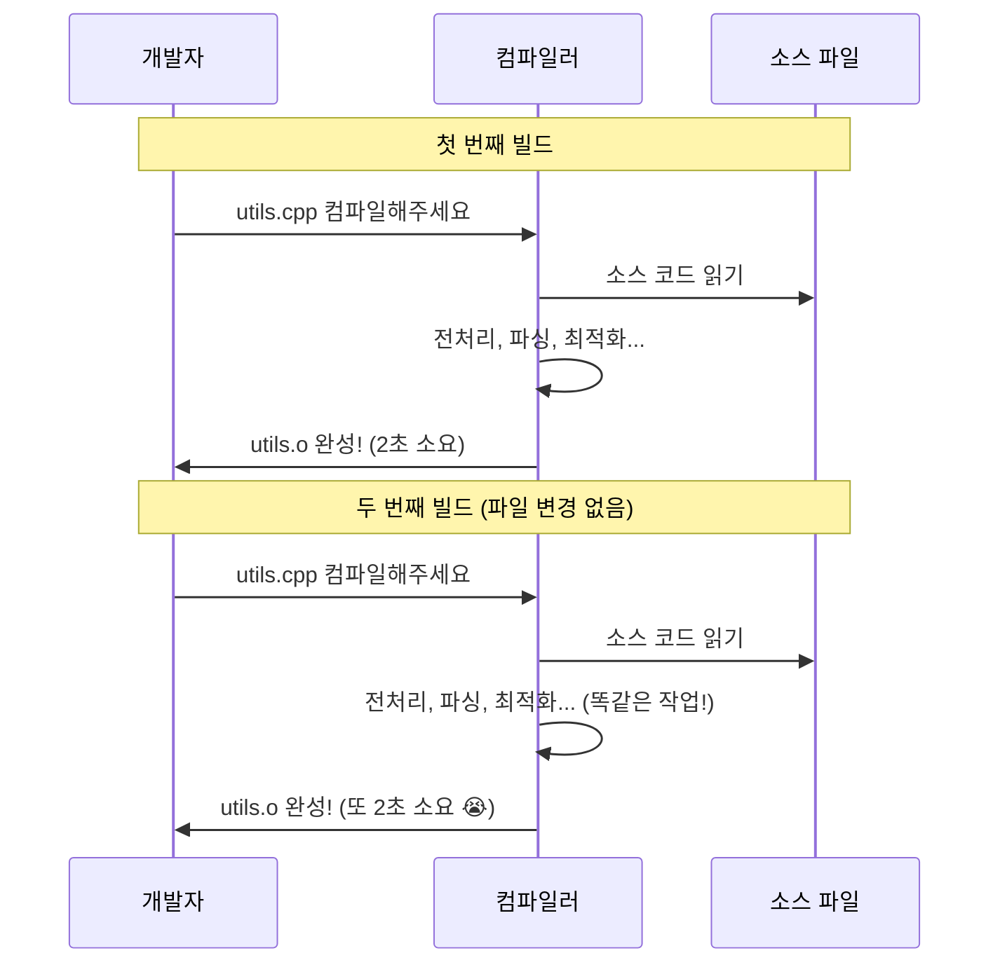
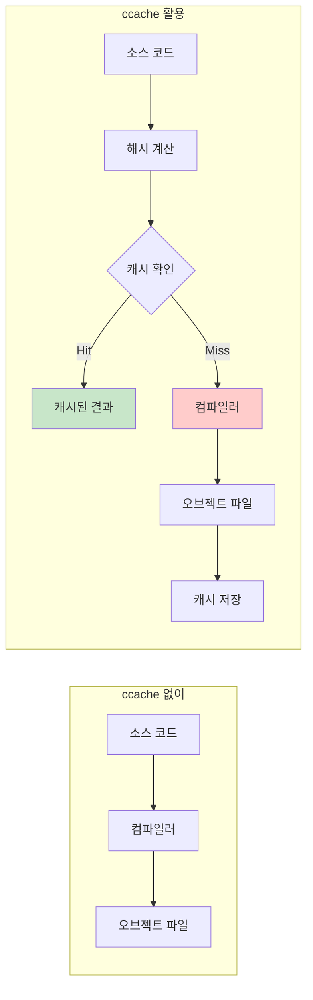

---
tags:
  - build_optimization
  - ccache
  - ci_cd
  - compilation_cache
  - docker_build
  - hands-on
  - intermediate
  - medium-read
  - 인프라스트럭처
difficulty: INTERMEDIATE
learning_time: "4-6시간"
main_topic: "인프라스트럭처"
priority_score: 4
---

# 1-5: 빌드 시스템 디버깅 - "왜 빌드가 이렇게 느리지?"

## 이 문서를 읽으면 답할 수 있는 질문들

- 왜 Docker에서 코드 한 줄만 바꿔도 전체가 재빌드될까요?
- ccache/sccache가 정확히 어떻게 빌드 속도를 향상시키는가?
- CI/CD 빌드 시간을 극단적으로 줄이는 방법은?
- incremental compilation이 제대로 동작하지 않는 이유는?
- 링커 선택이 빌드 속도에 어떤 영향을 줄까요?

## 들어가며: 빌드가 느린 진짜 이유

개발자를 가장 지치게 만드는 것 중 하나가 "기다리는 시간"입니다.

"코드 한 줄 바꿨는데 왜 10분을 기다려야 하죠?"

이런 경험 다들 있으신가요? 특히 Docker 환경에서 CI/CD를 사용할 때 더욱 심해지죠.

### 빌드 시간 폭발의 주범들



각각이 어떻게 연결되어 느린 빌드를 만드는지 하나씩 파헤쳐보겠습니다.

## 1. 빌드 시간 병목점 찾기

### 1.1 빌드 시간이 느려지는 근본 원인

빌드가 느린 이유를 이해하려면 컴파일 과정을 다시 살펴봐야 합니다:



각 단계에서 시간이 오래 걸리는 이유:

1. **전처리 단계**: `#include`로 인한 헤더 파일 중복 처리
2. **컴파일 단계**: 복잡한 템플릿, 최적화 수행
3. **링킹 단계**: 수많은 심볼들의 주소 해결

### 1.2 빌드 시간 측정과 분석

먼저 현재 상황을 정확히 진단해봅시다:

```bash
# 전체 빌드 시간 측정
$ time make -j$(nproc)
real    5m23.456s  # 실제 경과 시간
user    15m12.123s # CPU가 사용자 모드에서 소비한 시간
sys     1m45.678s  # CPU가 시스템 모드에서 소비한 시간

# user + sys > real 이면 병렬화가 효과적으로 동작 중
# user + sys ≈ real 이면 병렬화 개선 필요
```

병렬 빌드 효과를 측정해보세요:

```bash
# 병렬도별 성능 측정 스크립트
#!/bin/bash
for threads in 1 2 4 8 16; do
    echo "=== $threads threads ==="
    make clean > /dev/null
    time make -j$threads
done
```

결과 해석:

- 스레드 수 증가에 따른 성능 향상이 선형적이지 않다면 → 의존성 병목
- 8스레드 이상에서 성능 차이가 없다면 → I/O 병목 또는 메모리 부족

### 1.3 구체적인 병목점 찾기

이제 어디서 시간이 오래 걸리는지 구체적으로 찾아봅시다:

```bash
# 의존성 그래프 분석 (CMake)
$ cmake --graphviz=deps.dot .
$ dot -Tpng deps.dot -o deps.png

# 컴파일 명령어 분석
$ bear -- make        # compile_commands.json 생성
$ compdb list         # 컴파일 명령어 목록 확인

# 각 단계별 시간 측정 (CMake)
$ cmake --build . --target all -- VERBOSE=1

# 가장 오래 걸리는 소스 파일 찾기
$ make -j1 2>&1 | grep -E '^\[.*\].*\.cpp' | \
  while read line; do
    echo "$(date): $line"
  done
```

**의존성 그래프 해석법**:



- **정상**: 각 모듈이 독립적 → 병렬 빌드 효과 좋음
- **문제**: 모든 파일이 하나의 헤더에 의존 → 순차 빌드 유발

## 2. 컴파일 캐시의 마법 - ccache/sccache

### 2.1 왜 캐시가 필요한가?

컴파일러는 기본적으로 **건망증 환자**입니다. 매번 처음부터 모든 것을 다시 계산하죠:



ccache는 이 문제를 해결합니다:

### 2.2 ccache 동작 원리



**핵심 아이디어**:

- 소스 코드 + 컴파일 옵션 → 해시값 생성
- 같은 해시값이면 이전 결과 재사용
- 다른 해시값이면 새로 컴파일 후 캐시 저장

### 2.3 ccache 설정과 최적화

```bash
# ccache 설치
$ sudo apt install ccache  # Ubuntu/Debian
$ brew install ccache       # macOS

# 기본 설정
$ ccache --set-config cache_dir=$HOME/.ccache
$ ccache --set-config max_size=10G    # 충분히 크게!
$ ccache --set-config compression=true
$ ccache --set-config compression_level=6

# 컴파일러 래퍼 설정
$ export CC="ccache gcc"
$ export CXX="ccache g++"

# CMake에서 ccache 사용
set(CMAKE_C_COMPILER_LAUNCHER ccache)
set(CMAKE_CXX_COMPILER_LAUNCHER ccache)
```

**중요한 설정 팁들**:

```bash
# 절대 경로 저장 (Docker 환경에서 중요)
$ ccache --set-config hash_dir=false

# 시간 기반 무효화 (개발 중에는 끄기)
$ ccache --set-config sloppiness=time_macros

# 병렬 압축 (최신 ccache)
$ ccache --set-config compression_level=1  # 속도 우선
$ ccache --set-config compression_level=9  # 압축률 우선
```

### ccache 통계와 최적화

```bash
# 캐시 효율성 확인
$ ccache -s
cache directory                     /home/user/.ccache
cache hit (direct)                 1234
cache hit (preprocessed)           567
cache miss                         89
compile failed                     12
cache hit rate                     95.2 %

# 캐시 정리
$ ccache -C        # 전체 캐시 삭제
$ ccache -c        # 통계 초기화

# 캐시된 파일 목록
$ ccache -z        # 통계 초기화
$ make clean && make
$ ccache -s        # 결과 확인
```

### sccache (Rust 기반 분산 캐시)

```bash
# sccache 설치
$ cargo install sccache

# 환경 변수 설정
export RUSTC_WRAPPER=sccache
export CC="sccache gcc"
export CXX="sccache g++"

# Redis 백엔드 사용
export SCCACHE_REDIS=redis://localhost:6379

# AWS S3 백엔드 사용
export SCCACHE_BUCKET=my-build-cache
export SCCACHE_REGION=us-west-2

# 통계 확인
$ sccache --show-stats
```

## Docker 빌드 최적화

### Dockerfile 최적화 패턴

```dockerfile
# ❌ 나쁜 예: 캐시 무효화가 자주 발생
FROM ubuntu:20.04
COPY . /app
RUN apt-get update && apt-get install -y gcc g++
RUN make -j$(nproc)

# ✅ 좋은 예: 레이어 캐싱 최적화
FROM ubuntu:20.04 as builder

# 의존성 먼저 설치 (변경 빈도 낮음)
RUN apt-get update && apt-get install -y \
    gcc g++ cmake make \
    && rm -rf /var/lib/apt/lists/*

# 빌드 설정 파일만 복사
COPY CMakeLists.txt /app/
COPY cmake/ /app/cmake/
WORKDIR /app

# 의존성 다운로드/빌드
RUN cmake . && make dependencies

# 소스 코드 복사 (변경 빈도 높음)
COPY src/ /app/src/

# 실제 빌드
RUN make -j$(nproc)
```

### Docker BuildKit 활용

```dockerfile
# syntax=docker/dockerfile:1
FROM ubuntu:20.04 as builder

# BuildKit 캐시 마운트
RUN --mount=type=cache,target=/var/cache/apt \
    --mount=type=cache,target=/var/lib/apt \
    apt-get update && apt-get install -y gcc g++

# ccache 캐시 마운트
RUN --mount=type=cache,target=/root/.ccache \
    --mount=type=bind,source=.,target=/src \
    cd /src && make -j$(nproc)
```

### Docker 빌드 명령어 최적화

```bash
# DOCKER_BUILDKIT 활성화
export DOCKER_BUILDKIT=1

# 병렬 빌드
$ docker build --progress=plain \
    --build-arg MAKEFLAGS="-j$(nproc)" \
    -t myapp .

# 캐시 외부 저장
$ docker build --cache-from myapp:latest \
    --cache-to type=local,dest=/tmp/buildcache \
    -t myapp .

# 멀티 스테이지 빌드 타겟 지정
$ docker build --target builder \
    -t myapp:builder .
```

## incremental compilation 이해

### Make의 의존성 관리

```makefile
# 자동 의존성 생성
CFLAGS += -MMD -MP
SOURCES := $(wildcard src/*.c)
OBJECTS := $(SOURCES:.c=.o)
DEPENDS := $(OBJECTS:.o=.d)

all: myapp

myapp: $(OBJECTS)
 gcc -o $@ $(OBJECTS)

# 의존성 파일 포함
-include $(DEPENDS)

# 헤더 파일 변경 감지
src/%.o: src/%.c
 gcc $(CFLAGS) -c $< -o $@

.PHONY: clean
clean:
 rm -f $(OBJECTS) $(DEPENDS) myapp
```

### CMake의 의존성 추적

```cmake
# 자동 헤더 의존성
set(CMAKE_DEPENDS_USE_COMPILER TRUE)

# 사전 컴파일된 헤더 (PCH)
target_precompile_headers(myapp PRIVATE
    <iostream>
    <vector>
    <string>
)

# Unity build (소스 파일 묶기)
set_property(TARGET myapp PROPERTY UNITY_BUILD TRUE)
set_property(TARGET myapp PROPERTY UNITY_BUILD_BATCH_SIZE 8)

# Ninja 빌드 시스템
set(CMAKE_GENERATOR "Ninja")
```

### 헤더 파일 최적화

```cpp
// ❌ 헤더에서 불필요한 include
// MyClass.h
#include <iostream>    // 불필요
#include <vector>      // 불필요
#include "BigHeader.h" // 불필요

class MyClass {
public:
    void process(const std::string& data);  // 선언만 필요
};

// ✅ 전방 선언 활용
// MyClass.h
#include <string>  // 실제 필요한 것만

class BigClass;  // 전방 선언

class MyClass {
public:
    void process(const std::string& data);
    void work(BigClass* obj);  // 포인터/참조는 전방선언으로 충분
};
```

## 링커 최적화

### 링크 시간 최적화 (LTO)

```bash
# GCC LTO
$ gcc -flto -O2 -c file1.c file2.c
$ gcc -flto -O2 file1.o file2.o -o program

# Clang ThinLTO (더 빠름)
$ clang -flto=thin -O2 -c file1.c file2.c
$ clang -flto=thin -O2 file1.o file2.o -o program

# 병렬 LTO
$ gcc -flto -fuse-linker-plugin -O2 -Wl,-flto-partition=balanced *.o
```

### 링커 선택과 최적화

```bash
# gold 링커 (빠름)
$ gcc -fuse-ld=gold -O2 *.o -o program

# lld 링커 (더 빠름)
$ clang -fuse-ld=lld -O2 *.o -o program

# mold 링커 (가장 빠름)
$ gcc -B/usr/local/libexec/mold *.o -o program

# 병렬 링킹
$ ld --threads --thread-count=8
```

## 빌드 모니터링과 분석

### 빌드 프로파일링

```bash
# GCC 타임 리포트
$ gcc -ftime-report -c file.c

# Clang 빌드 통계
$ clang -ftime-trace -c file.c
# 결과: file.json (Chrome tracing 형식)

# CMake 빌드 타이밍
$ cmake --build . -- -j$(nproc) --time

# Ninja 빌드 로그
$ ninja -j$(nproc) -v -d stats
```

### 빌드 메트릭 수집

```python
#!/usr/bin/env python3
# build_metrics.py
import time
import subprocess
import json
from datetime import datetime

def measure_build():
    start_time = time.time()

    # 빌드 실행
    result = subprocess.run(['make', '-j8'],
                          capture_output=True, text=True)

    end_time = time.time()
    build_time = end_time - start_time

    # 메트릭 수집
    metrics = {
        'timestamp': datetime.now().isoformat(),
        'build_time': build_time,
        'success': result.returncode == 0,
        'output_lines': len(result.stdout.split(', ')),
        'error_lines': len(result.stderr.split(', '))
    }

    # 결과 저장
    with open('build_metrics.json', 'a') as f:
        json.dump(metrics, f)
        f.write(', ')

    return metrics

if __name__ == '__main__':
    print(json.dumps(measure_build(), indent=2))
```

## CI/CD 최적화

### GitHub Actions 최적화

```yaml
# .github/workflows/build.yml
name: Build

on: [push, pull_request]

jobs:
  build:
    runs-on: ubuntu-latest

    steps:
    - uses: actions/checkout@v3

    # ccache 캐싱
    - name: Setup ccache
      uses: hendrikmuhs/ccache-action@v1.2
      with:
        key: ${{ runner.os }}-ccache-${{ github.sha }}
        restore-keys: |
          ${{ runner.os }}-ccache-

    # 의존성 캐싱
    - name: Cache dependencies
      uses: actions/cache@v3
      with:
        path: |
          ~/.cache/pip
          build/_deps
        key: ${{ runner.os }}-deps-${{ hashFiles('**/requirements.txt', '**/CMakeLists.txt') }}

    - name: Build
      run: |
        export CC="ccache gcc"
        export CXX="ccache g++"
        cmake -B build -DCMAKE_BUILD_TYPE=Release
        cmake --build build -j$(nproc)

    # 빌드 아티팩트 캐싱
    - name: Save build cache
      uses: actions/cache/save@v3
      with:
        path: build
        key: ${{ runner.os }}-build-${{ github.sha }}
```

### Jenkins 빌드 최적화

```groovy
// Jenkinsfile
pipeline {
    agent any

    environment {
        CC = 'ccache gcc'
        CXX = 'ccache g++'
        CCACHE_DIR = '/tmp/ccache'
    }

    stages {
        stage('Setup Cache') {
            steps {
                // ccache 복원
                sh 'ccache -z'  // 통계 초기화
            }
        }

        stage('Build') {
            steps {
                sh '''
                    cmake -B build -DCMAKE_BUILD_TYPE=Release
                    cmake --build build -j\$(nproc)
                '''
            }
        }

        stage('Cache Stats') {
            steps {
                sh 'ccache -s'  // 캐시 효율성 확인
            }
        }
    }

    post {
        always {
            // 빌드 시간 기록
            script {
                def buildTime = currentBuild.duration / 1000
                echo "Build time: ${buildTime} seconds"
            }
        }
    }
}
```

## 실전 디버깅 시나리오

### 시나리오 1: "undefined reference" 에러

```bash
# 에러 발생
$ gcc main.c -o program
/usr/bin/ld: main.o: in function `main':
main.c:(.text+0x1a): undefined reference to `my_function'

# 디버깅 단계
# 1. 심볼 테이블 확인
$ nm main.o | grep my_function
                 U my_function    # U = undefined

# 2. 오브젝트 파일 확인
$ nm libmylib.a | grep my_function
000000000000001a T my_function    # T = text section

# 3. 올바른 링킹
$ gcc main.c libmylib.a -o program
# 또는
$ gcc main.c -L. -lmylib -o program
```

### 시나리오 2: "헤더 파일 수정 시 전체 재빌드"

```cpp
// 문제가 되는 헤더 파일 찾기
$ find . -name "*.h" -exec grep -l "problem_header.h" {} \;

// 의존성 그래프 분석
$ gcc -M src/*.c | dot -Tpng > dependencies.png

// 해결책: 헤더 분할
// common.h -> common_types.h + common_functions.h
// 자주 변경되지 않는 부분과 자주 변경되는 부분 분리
```

### 시나리오 3: "릴리즈 빌드에서만 크래시"

```bash
# 최적화로 인한 undefined behavior 확인
$ gcc -fsanitize=undefined -O2 main.c

# 디버그 정보를 포함한 릴리즈 빌드
$ gcc -O2 -g -DNDEBUG main.c

# 최적화 단계별 확인
$ gcc -O1 main.c && ./a.out  # 정상?
$ gcc -O2 main.c && ./a.out  # 문제?

# 특정 최적화 옵션 비활성화
$ gcc -O2 -fno-strict-aliasing main.c
```

## 성능 측정과 최적화 효과 확인

### 빌드 시간 벤치마크

```bash
#!/bin/bash
# build_benchmark.sh

echo "=== Build Performance Test ==="

for threads in 1 2 4 8 16; do
    echo "Testing with $threads threads..."
    make clean
    time make -j$threads 2>&1 | tee build_j${threads}.log
done

# ccache 효과 측정
echo "=== ccache effectiveness ==="
ccache -z  # 통계 초기화
make clean
time make -j8  # 첫 번째 빌드
ccache -s

make clean
time make -j8  # 두 번째 빌드 (캐시 활용)
ccache -s
```

### 메모리 사용량 모니터링

```bash
# 빌드 중 메모리 사용량 모니터링
$ while true; do
    ps aux | grep -E '(gcc|g\+\+|ld)' |
    awk '{sum += $6} END {print "Memory: " sum/1024 " MB"}';
    sleep 1;
  done &

# 실행 후
$ make -j8
```

## 실무 체크리스트

### 빌드 최적화 체크리스트

- [ ] ccache/sccache 설정 완료
- [ ] 병렬 빌드 최적화 (-j 옵션)
- [ ] 불필요한 헤더 include 제거
- [ ] 전방 선언 활용
- [ ] Docker 레이어 캐싱 최적화
- [ ] CI/CD 캐시 설정 완료
- [ ] 링커 최적화 (gold, lld, mold)
- [ ] LTO (Link Time Optimization) 적용

### 문제 해결 체크리스트

- [ ] 링킹 에러 시 nm, objdump 활용
- [ ] 빌드 시간 프로파일링
- [ ] 의존성 그래프 분석
- [ ] 최적화 단계별 테스트
- [ ] Sanitizer 활용한 버그 확인
- [ ] 빌드 메트릭 수집 및 모니터링

## 다음 단계

빌드 시스템 최적화를 마스터했다면, 이제 [1-6: 링커 에러 해결](05-41-linking-debugging.md)에서 복잡한 링킹 문제들을 해결하는 방법을 배워봅시다.

빌드가 빨라지면 개발자의 생산성도 함께 향상됩니다! 🚀

## 📚 관련 문서

### 📖 현재 문서 정보

- **난이도**: INTERMEDIATE
- **주제**: 인프라스트럭처
- **예상 시간**: 4-6시간

### 🎯 학습 경로

- [📚 INTERMEDIATE 레벨 전체 보기](../learning-paths/intermediate/)
- [🏠 메인 학습 경로](../learning-paths/)
- [📋 전체 가이드 목록](../README.md)

### 📂 같은 챕터 (chapter-01-compiler-linker)

- [Chapter 1-1: 컴파일은 어떻게 동작하는가](./05-10-compilation.md)
- [Chapter 1-2: 링킹은 어떻게 동작하는가](./05-11-linking.md)
- [Chapter 1-3: 로딩과 실행은 어떻게 동작하는가](./05-12-loading-execution.md)
- [Chapter 1-4: 컴파일러 최적화는 어떻게 동작하는가](./05-30-compiler-optimization.md)
- [1-6: 링커 에러 해결 - "undefined reference가 계속 나요"](./05-41-linking-debugging.md)

### 🏷️ 관련 키워드

`build_optimization`, `ccache`, `docker_build`, `ci_cd`, `compilation_cache`

### ⏭️ 다음 단계 가이드

- 실무 적용을 염두에 두고 프로젝트에 적용해보세요
- 관련 도구들을 직접 사용해보는 것이 중요합니다
