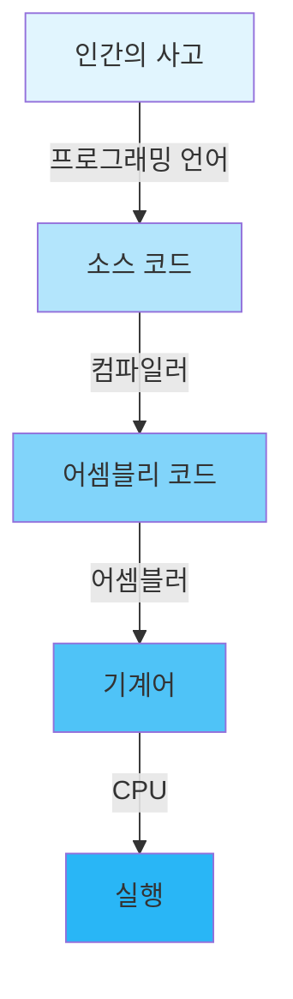
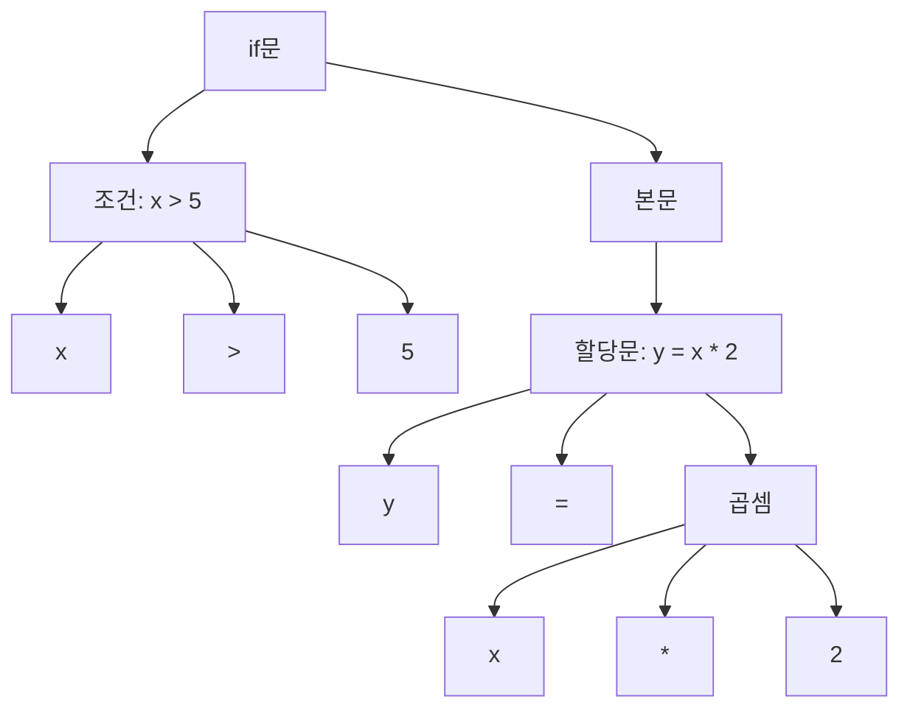
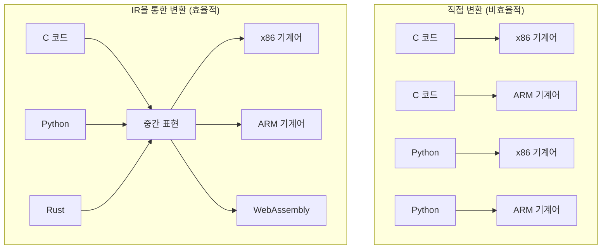
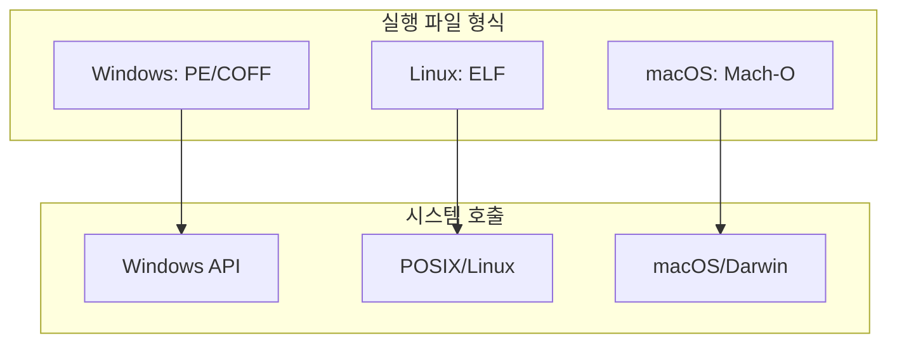
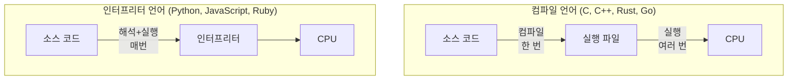
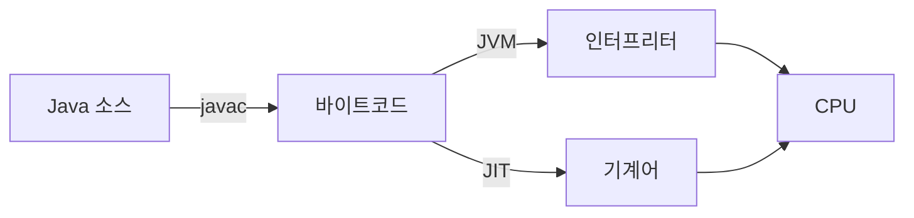

---
tags:
  - Compiler
  - Compilation
  - intermediate
  - medium-read
  - system-call
  - 시스템프로그래밍
difficulty: INTERMEDIATE
learning_time: "4-6시간"
main_topic: "시스템 프로그래밍"
priority_score: 4
---

# 5.1.1: 컴파일은 어떻게 동작하는가

## 이 문서를 읽으면 답할 수 있는 질문들

- 우리가 작성한 코드는 어떻게 CPU가 이해할 수 있는 형태가 될까요?
- 컴파일러는 내부적으로 어떤 단계들을 거칠까요?
- 왜 같은 코드가 다른 컴퓨터에서 실행되지 않을 때가 있을까요?
- 프로그래밍 언어마다 왜 실행 방식이 다를까요?

## 들어가며: 코드에서 실행까지의 여정

"Hello, World!"를 출력하는 프로그램을 작성했다고 생각해봅시다. 키보드로 타이핑한 문자들이 어떻게 화면에 글자를 출력하는 '실행'이 될까요?

이것은 마치 한국어로 쓴 편지를 영어만 아는 친구에게 전달하는 것과 같습니다. 중간에 누군가가 번역을 해줘야 하죠. 컴파일러가 바로 그 번역가입니다. 하지만 단순한 번역 그 이상의 일을 합니다.

## 1. 인간과 기계의 언어 차이

### 1.1 인간이 생각하는 방식

우리가 프로그램을 작성할 때, 우리는 이렇게 생각합니다:

```c
// "만약 온도가 30도보다 높으면, 에어컨을 켜라"
if (temperature > 30) {
    turn_on_aircon();
}
```

이것은 매우 자연스러운 사고 흐름입니다. 조건이 있고, 그에 따른 행동이 있죠. 우리는 "temperature"라는 단어가 온도를 의미한다는 것을 알고, ">"가 '크다'를 의미한다는 것을 압니다.

### 1.2 기계가 이해하는 방식

하지만 CPU는 오직 0과 1, 즉 전기 신호의 유무만을 이해합니다. CPU가 실제로 실행하는 것은 이런 형태입니다:

```asm
10110000 00011110    ; 30이라는 숫자를 레지스터에 넣어라
00111001 11000001    ; 메모리의 특정 위치 값과 비교하라
01110111 00001000    ; 조건이 참이면 8바이트 뒤로 점프하라
...
```

이진수의 나열입니다. 각 숫자 묶음은 특정한 의미를 가진 '명령어(instruction)'입니다.

### 1.3 추상화 계층의 필요성

만약 우리가 모든 프로그램을 0과 1로 작성해야 한다면 어떨까요?

```text
원하는 동작: 두 숫자를 더하기
고급 언어: result = a + b;
어셈블리: ADD RAX, RBX
기계어: 01001000 00000001 11011000
```

간단한 덧셈 하나도 이진수로 표현하려면 복잡합니다. 더 큰 문제는:

1. **실수하기 쉽다**: 0과 1을 하나만 잘못 써도 전혀 다른 명령이 됩니다
2. **읽기 어렵다**: 다른 사람은 물론, 자신도 나중에 이해하기 어렵습니다
3. **수정이 거의 불가능**: 중간에 명령어 하나를 추가하면 모든 주소를 다시 계산해야 합니다

그래서 우리는 **추상화 계층**을 만들었습니다:



## 2. 컴파일러의 내부 구조

컴파일러는 단순한 번역기가 아닙니다. 여러 단계를 거쳐 코드를 분석하고, 최적화하고, 변환합니다.

### 2.1 컴파일러의 주요 단계


각 단계를 자세히 살펴보죠.

### 2.2 어휘 분석 (Lexical Analysis)

어휘 분석은 소스 코드를 '토큰(token)'이라는 의미 있는 단위로 나누는 과정이에요.

예를 들어:

```c
int sum = a + b;
```

이 코드는 다음과 같은 토큰들로 분해됩니다:

```text
[int] [sum] [=] [a] [+] [b] [;]
  ↓     ↓    ↓   ↓   ↓   ↓   ↓
키워드 식별자 연산자 식별자 연산자 식별자 구분자
```

이것은 마치 문장을 단어로 나누는 것과 같습니다:

- "나는 학교에 간다" → ["나는", "학교에", "간다"]

어휘 분석기는 다음과 같은 일도 합니다:

- 공백과 주석 제거
- 잘못된 문자 감지 (예: 한글 변수명을 지원하지 않는 언어에서 한글 사용)
- 숫자와 문자열 리터럴 인식

### 2.3 구문 분석 (Syntax Analysis)

구문 분석은 토큰들이 언어의 문법 규칙에 맞는지 확인하고, **파스 트리(parse tree)** 또는 **추상 구문 트리(AST)**를 만듭니다.

```c
// 소스 코드
if (x > 5) {
    y = x * 2;
}
```

이것은 다음과 같은 트리 구조가 됩니다:



이 단계에서 문법 오류를 발견합니다:

- 괄호가 맞지 않음: `if (x > 5 {`
- 세미콜론 누락: `int x = 5`
- 잘못된 구조: `if if (x > 5)`

### 2.4 의미 분석 (Semantic Analysis)

문법적으로는 맞지만 의미적으로 틀린 것들을 찾아냅니다.

예를 들어:

```c
int x = "hello";  // 타입 불일치: 정수 변수에 문자열 할당
y = 10;           // 오류: y가 선언되지 않음
int arr[5];
arr[10] = 1;      // 경고: 배열 범위 초과 (일부 컴파일러)
```

의미 분석은 **심볼 테이블(symbol table)**을 만들어 관리합니다:

| 이름 | 타입 | 범위 | 메모리 위치 |
|------|------|------|------------|
| x | int | 전역 | 0x1000 |
| arr | int[5] | 전역 | 0x1004 |
| sum | 함수 | 전역 | 0x2000 |

### 2.5 중간 표현 (Intermediate Representation)

컴파일러는 소스 코드를 바로 기계어로 변환하지 않고, 중간 표현(IR)을 거칩니다. 왜일까요?



중간 표현의 장점:

1. **최적화가 쉽다**: 플랫폼 독립적인 최적화 가능
2. **재사용 가능**: 여러 언어가 같은 백엔드 사용 가능
3. **이식성**: 새로운 CPU 지원이 쉬움

LLVM IR의 예:

```llvm
; C 코드: int add(int a, int b) { return a + b; }
define i32 @add(i32 %a, i32 %b) {
entry:
    %sum = add i32 %a, %b
    ret i32 %sum
}
```

### 2.6 최적화 (Optimization)

컴파일러는 코드를 더 빠르고 효율적으로 만드는 다양한 최적화를 수행합니다.

#### 상수 접기 (Constant Folding)

```c
// 원본 코드
int x = 2 * 3 * 4;

// 최적화 후
int x = 24;  // 컴파일 시점에 계산
```

#### 죽은 코드 제거 (Dead Code Elimination)

```c
// 원본 코드
int calculate() {
    int x = 5;
    int y = 10;
    return x;  // y는 사용되지 않음
}

// 최적화 후
int calculate() {
    return 5;
}
```

#### 루프 최적화

```c
// 원본 코드
for (int i = 0; i < 1000; i++) {
    arr[i] = i * 2;
}

// 루프 언롤링 최적화 후
for (int i = 0; i < 1000; i += 4) {
    arr[i] = i * 2;
    arr[i+1] = (i+1) * 2;
    arr[i+2] = (i+2) * 2;
    arr[i+3] = (i+3) * 2;
}
// 루프 제어 오버헤드 감소
```

#### 인라인 확장

```c
// 원본 코드
int square(int x) { return x * x; }
int main() {
    int result = square(5);
}

// 인라인 최적화 후
int main() {
    int result = 5 * 5;  // 함수 호출 오버헤드 제거
}
```

## 3. 왜 같은 프로그램이 다른 컴퓨터에서 안 돌아갈까?

### 3.1 CPU 아키텍처의 차이

서로 다른 CPU는 서로 다른 명령어 집합을 가집니다:

```assembly
; x86 (Intel/AMD)
MOV RAX, 5
ADD RAX, 3

; ARM
MOV R0, #5
ADD R0, R0, #3

; RISC-V
LI a0, 5
ADDI a0, a0, 3
```

같은 "5 + 3"이라는 연산도 CPU마다 다른 명령어를 사용합니다. 이것은 마치 한국어, 영어, 일본어가 다른 것과 같습니다.

### 3.2 운영체제의 차이

같은 x86 CPU라도 운영체제가 다르면 실행 파일 형식이 다릅니다:



예를 들어, 파일을 열 때:

```c
// Windows
HANDLE file = CreateFile("test.txt", GENERIC_READ, ...);

// Linux/Unix
int fd = open("test.txt", O_RDONLY);

// 같은 동작, 다른 시스템 호출
```

### 3.3 라이브러리 의존성

프로그램은 보통 외부 라이브러리를 사용합니다:

```c
#include <stdio.h>  // C 표준 라이브러리
#include <math.h>   // 수학 라이브러리

int main() {
    printf("Square root of 2: %f, ", sqrt(2.0));
}
```

이 프로그램이 실행되려면:

1. C 런타임 라이브러리가 있어야 함
2. 수학 라이브러리가 있어야 함
3. 올바른 버전이어야 함

## 4. 컴파일 언어 vs 인터프리터 언어

### 4.1 실행 방식의 차이

프로그래밍 언어는 실행 방식에 따라 크게 두 가지로 나뉩니다:



### 4.2 각 방식의 특징

#### 컴파일 언어

**장점:**

- 실행 속도가 빠름 (이미 기계어로 변환됨)
- 실행 시 인터프리터 불필요
- 소스 코드 보호 가능

**단점:**

- 수정 시 재컴파일 필요
- 플랫폼별로 다시 컴파일 필요
- 컴파일 시간이 걸림

#### 인터프리터 언어

**장점:**

- 수정 후 즉시 실행 가능
- 플랫폼 독립적 (인터프리터만 있으면 됨)
- 동적인 코드 실행 가능

**단점:**

- 실행 속도가 상대적으로 느림
- 실행 시 인터프리터 필요
- 소스 코드가 노출됨

### 4.3 하이브리드 방식

많은 현대 언어들은 두 방식을 혼합합니다:

#### Java의 방식



Java는:

1. 소스를 바이트코드로 컴파일
2. JVM이 바이트코드를 인터프리터로 실행
3. 자주 실행되는 부분은 JIT 컴파일러가 기계어로 변환

#### Python의 방식

```python
# Python도 실제로는 바이트코드로 컴파일됨
def hello():
    print("Hello, World!")

# 컴파일된 바이트코드 확인
import dis
dis.dis(hello)

# 출력:
#   2           0 LOAD_GLOBAL              0 (print)
#               2 LOAD_CONST               1 ('Hello, World!')
#               4 CALL_FUNCTION            1
#               6 POP_TOP
#               8 LOAD_CONST               0 (None)
#              10 RETURN_VALUE
```

## 5. 컴파일 과정의 실제 예제

간단한 C 프로그램을 통해 전체 과정을 봅시다:

### 5.1 소스 코드

```c
// hello.c
#include <stdio.h>

int main() {
    int x = 5;
    int y = 10;
    int sum = x + y;
    printf("Sum: %d, ", sum);
    return 0;
}
```

### 5.2 전처리 후

```bash
gcc -E hello.c  # 전처리만 수행
```

```c
// stdio.h의 내용이 포함됨
extern int printf(const char *format, ...);
// ... 수백 줄의 선언 ...

int main() {
    int x = 5;
    int y = 10;
    int sum = x + y;
    printf("Sum: %d, ", sum);
    return 0;
}
```

### 5.3 어셈블리 코드

```bash
gcc -S hello.c  # 어셈블리 생성
```

```assembly
main:
    push    rbp
    mov     rbp, rsp
    sub     rsp, 16
    mov     DWORD PTR [rbp-4], 5    ; x = 5
    mov     DWORD PTR [rbp-8], 10   ; y = 10
    mov     edx, DWORD PTR [rbp-4]  ; edx = x
    mov     eax, DWORD PTR [rbp-8]  ; eax = y
    add     eax, edx                ; eax = x + y
    mov     DWORD PTR [rbp-12], eax ; sum = eax
    mov     eax, DWORD PTR [rbp-12]
    mov     esi, eax
    lea     rdi, .LC0[rip]          ; "Sum: %d, "
    call    printf
    mov     eax, 0
    leave
    ret
```

### 5.4 최적화된 버전

```bash
gcc -O2 -S hello.c  # 최적화 레벨 2
```

```assembly
main:
    sub     rsp, 8
    mov     esi, 15          ; 5 + 10을 미리 계산!
    lea     rdi, .LC0[rip]
    xor     eax, eax
    call    printf
    xor     eax, eax
    add     rsp, 8
    ret
```

컴파일러가 `x + y`를 컴파일 시점에 계산해서 `15`로 바꿨네요!

## 6. 정리: 핵심 개념들

### 컴파일이란?

- **정의**: 고급 프로그래밍 언어를 기계어로 변환하는 과정
- **목적**: 인간이 이해하기 쉬운 코드를 CPU가 실행할 수 있는 형태로 변환
- **과정**: 어휘 분석 → 구문 분석 → 의미 분석 → 최적화 → 코드 생성

### 왜 중요한가?

1. **성능**: 컴파일러의 최적화가 프로그램 속도를 크게 좌우
2. **오류 검출**: 실행 전에 많은 오류를 찾아냄
3. **이식성**: 한 소스 코드를 여러 플랫폼에서 실행 가능

### 기억해야 할 점

- 컴파일러는 단순한 번역기가 아니라 복잡한 분석과 최적화를 수행합니다
- CPU 아키텍처와 운영체제에 따라 다른 기계어 생성 필요
- 컴파일 언어와 인터프리터 언어는 각각의 장단점이 있음
- 현대 언어들은 두 방식을 혼합하여 사용

## 다음 섹션 예고

다음 섹션([5.2: 링킹은 어떻게 동작하는가](05-02-01-linking.md))에서는 **링킹(Linking)** 과정을 자세히 다룹니다:

- 여러 오브젝트 파일이 어떻게 하나가 되는가?
- 심볼 해결과 재배치는 어떻게 동작하는가?
- 정적 vs 동적 링킹의 실제 차이점
- 링킹 에러 해결 방법

링킹은 컴파일된 코드 조각들을 완전한 프로그램으로 만드는 핵심 과정입니다.

### 직접 연관 문서

- [5.2: 링킹은 어떻게 동작하는가](05-02-01-linking.md) - 컴파일 후 링킹 과정
- [5.4: 컴파일러 최적화](05-04-01-compiler-optimization.md) - 컴파일러의 최적화 기법

### 고급 주제

- [5.5: 빌드 시스템 디버깅](05-05-01-build-debugging.md) - 컴파일 성능 최적화
- [5.6: 링커 에러 해결](05-05-02-linking-debugging.md) - 컴파일/링킹 문제 해결

### 관련 시스템 개념

- [Chapter 2: 메모리 아키텍처](../chapter-03-memory-system/index.md) - 컴파일된 프로그램의 메모리 구조
- [프로세스와 스레드](../chapter-01-process-thread/index.md) - 컴파일된 프로그램의 실행 환경

## 📚 관련 문서

### 📖 현재 문서 정보

- **난이도**: INTERMEDIATE
- **주제**: 시스템 프로그래밍
- **예상 시간**: 4-6시간

### 🎯 학습 경로

- [📚 INTERMEDIATE 레벨 전체 보기](../learning-paths/intermediate/)
- [🏠 메인 학습 경로](../learning-paths/)
- [📋 전체 가이드 목록](../README.md)

### 📂 같은 챕터 (chapter-01-compiler-linker)

- [5.2: 링킹은 어떻게 동작하는가](./05-02-01-linking.md)
- [5.3: 로딩과 실행은 어떻게 동작하는가](./05-03-01-loading-execution.md)
- [5.4: 컴파일러 최적화는 어떻게 동작하는가](./05-04-01-compiler-optimization.md)
- [5.5: 빌드 시스템 디버깅 - "왜 빌드가 이렇게 느리지?"](./05-05-01-build-debugging.md)
- [5.6: 링커 에러 해결 - "undefined reference가 계속 나요"](./05-05-02-linking-debugging.md)

### 🏷️ 관련 키워드

`fork`, `process-creation`, `copy-on-write`, `system-call`, `multiprocessing`

### ⏭️ 다음 단계 가이드

- 실무 적용을 염두에 두고 프로젝트에 적용해보세요
- 관련 도구들을 직접 사용해보는 것이 중요합니다
