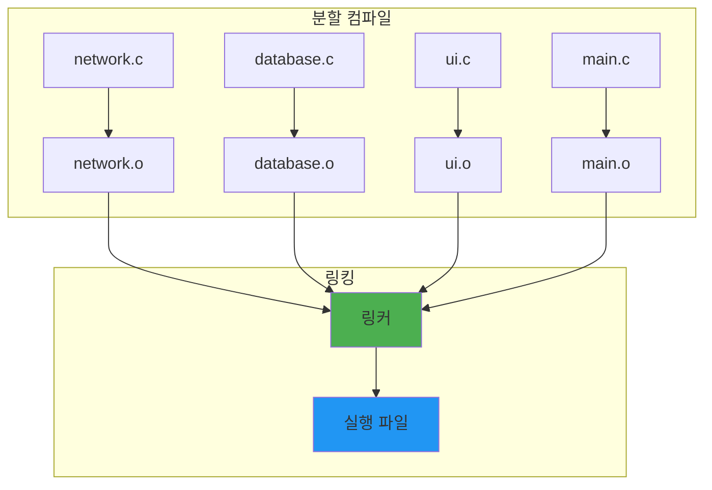
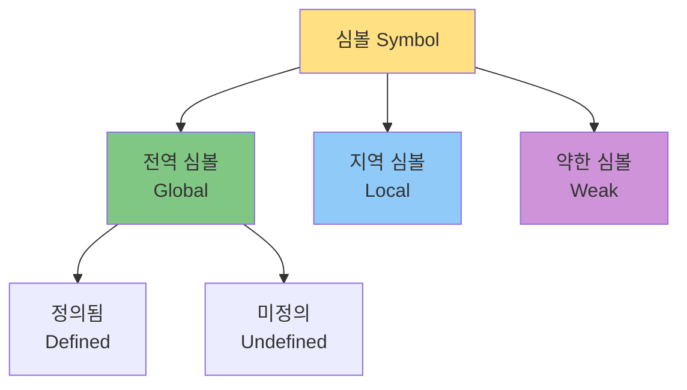
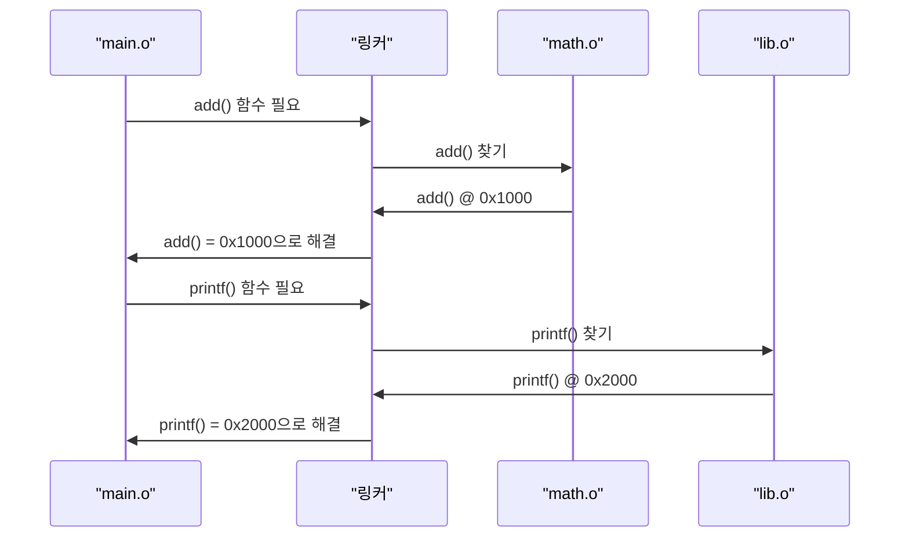
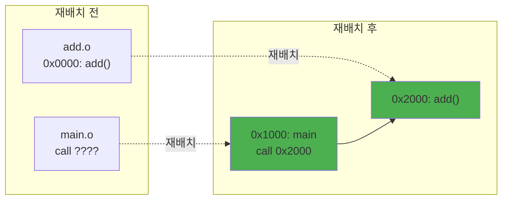
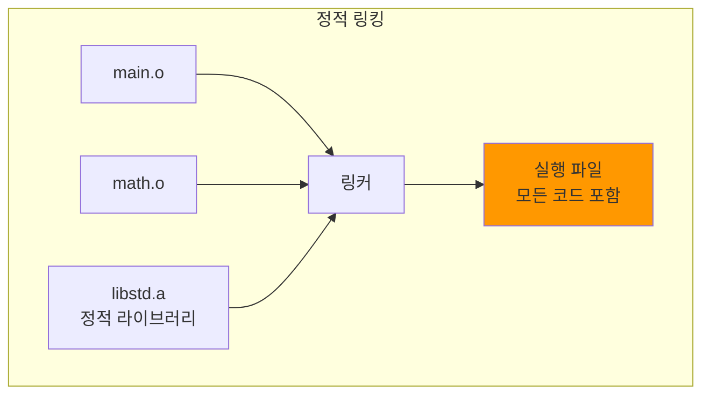
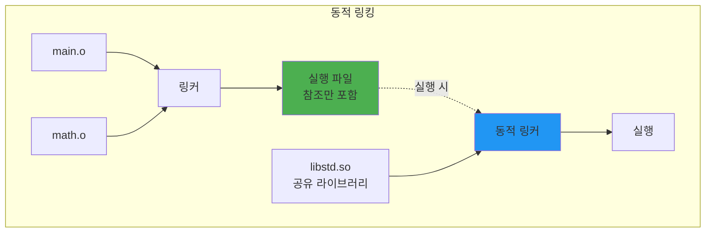
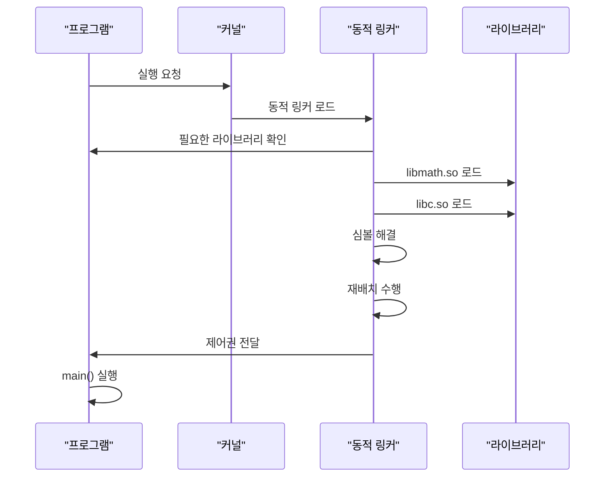
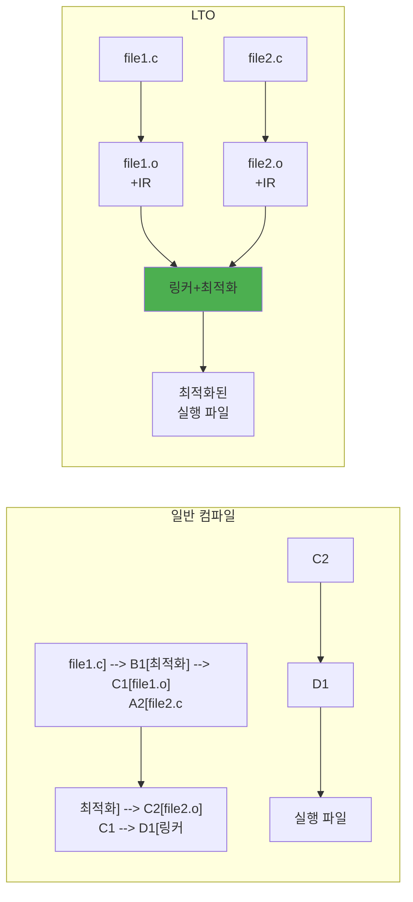
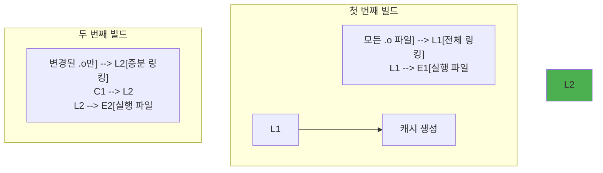

---
tags:
  - balanced
  - fundamentals
  - linking
  - medium-read
  - object-files
  - relocation
  - static-dynamic-linking
  - symbol-resolution
  - 시스템프로그래밍
difficulty: FUNDAMENTALS
learning_time: "3-4시간"
main_topic: "시스템 프로그래밍"
priority_score: 4
---

# 5.2.1: 링킹은 어떻게 동작하는가

## 이 문서를 읽으면 답할 수 있는 질문들

- 여러 소스 파일이 어떻게 하나의 실행 파일이 될까요?
- 함수를 호출할 때 실제 주소는 언제, 어떻게 결정될까요?
- 라이브러리는 어떻게 프로그램과 연결될까요?
- 왜 같은 이름의 함수를 두 번 정의하면 오류가 날까요?
- 동적 라이브러리와 정적 라이브러리의 실제 차이는 무엇일까요?

## 들어가며: 퍼즐 조각을 맞추는 과정

프로그래밍을 하다 보면 이런 오류를 본 적이 있을 것입니다:

```text
undefined reference to `calculate_sum'
multiple definition of `global_counter'
cannot find -lmath
```

이것들은 모두 '링커(Linker)' 오류입니다. 컴파일은 성공했지만, 링킹 단계에서 실패한 것이죠.

큰 프로그램을 작성할 때 코드를 여러 파일로 나눕니다. 각 파일은 독립적으로 컴파일되어 '오브젝트 파일'이 됩니다. 그런데 이 오브젝트 파일들은 아직 완전하지 않아요. 서로 참조하는 함수나 변수의 실제 주소를 모르기 때문입니다.

링커는 이런 불완전한 퍼즐 조각들을 모아서 하나의 완전한 그림, 즉 실행 가능한 프로그램을 만드는 일을 합니다.

## 1. 링킹이 필요한 이유

### 1.1 분할 컴파일의 필요성

하나의 거대한 파일로 프로그램을 작성한다고 상상해봅시다:

```text
program.c (100,000줄)
├── 네트워크 코드
├── 데이터베이스 코드
├── UI 코드
├── 비즈니스 로직
└── 유틸리티 함수들
```

문제점:

1. **컴파일 시간**: 한 줄만 수정해도 10만 줄 전체를 재컴파일
2. **협업 불가능**: 여러 사람이 동시에 작업 불가
3. **코드 재사용 불가**: 다른 프로젝트에서 일부만 사용 불가
4. **메모리 한계**: 컴파일러가 한 번에 처리하기 너무 큼

### 1.2 분할 컴파일의 해결책



각 파일을 독립적으로 컴파일하고, 나중에 합치는 방식입니다.

### 1.3 오브젝트 파일의 불완전성

컴파일러가 생성한 오브젝트 파일을 자세히 봅시다:

```c
// ⭐ 기본적인 다중 파일 프로젝트 - 링킹의 근본 원리 이해를 위한 최소 예제
// 실제 동작: 컴파일러가 생성한 불완전한 오브젝트 파일들을 링커가 연결하는 과정
// 교육 목적: "왜 헤더 파일과 소스 파일을 분리하는가?"에 대한 실질적 답변

// ⭐ 1단계: 함수 정의 (Definition) - 실제 구현을 포함한 심볼 생성
// math.c
int add(int a, int b) {     // 전역 함수 = Strong Symbol로 심볼 테이블에 등록
    return a + b;           // 컴파일러가 이를 어셈블리로 변환:
}                           // mov eax, edi; add eax, esi; ret
                           // math.o 파일의 .text 섹션에 기계어로 저장

// ⭐ 2단계: 함수 선언 (Declaration) - "다른 곳에 있다"는 링커 약속
// main.c
extern int add(int a, int b); // 컴파일러에게: "add 함수가 존재하지만 여기엔 없음"
                              // 링커가 나중에 실제 위치를 찾아서 연결해줄 것
                              // main.o의 심볼 테이블에 UNDEFINED로 표시

int main() {
    int result = add(3, 4);   // call 명령어 생성, 하지만 타겟 주소는 0x00000000
                              // 재배치 테이블에 "이 위치에 add 함수 주소 삽입" 기록
    return result;            // 링커가 math.o에서 add를 찾아 실제 주소로 패치
}

// ⭐ 링커의 심볼 해결 과정:
// 1) main.o 분석: "add 함수를 사용하지만 여기엔 정의 없음" (UNDEFINED)
// 2) math.o 분석: "add 함수 정의 발견" (DEFINED in .text section)
// 3) 심볼 매칭: main.o의 add 참조 → math.o의 add 정의 연결
// 4) 재배치 수행: call 명령어의 타겟을 실제 add 함수 주소로 패치
//
// ⭐ 실제 어셈블리 변환 과정:
// main.c 컴파일 후 (링킹 전):
//   call 0x00000000    ; placeholder address
// 링킹 후:
//   call 0x401020      ; actual address of add function
//
// ⭐ 실무에서의 확장:
// - 헤더 파일(.h): 여러 .c 파일에서 동일한 선언을 공유
// - 라이브러리(.a/.so): 자주 사용하는 함수들을 미리 컴파일해서 재사용
// - 네임스페이스/모듈: 이름 충돌 방지를 위한 심볼 구분
//
// ⭐ 성능 고려사항:
// - 함수 호출 오버헤드: call/ret 명령어 + 스택 프레임 설정
// - 인라이닝 제한: 다른 파일의 함수는 인라인하기 어려움
// - LTO 필요성: Link Time Optimization으로 파일 경계 넘어 최적화
```

`main.c`를 컴파일할 때, 컴파일러는 `add` 함수가 어디 있는지 모릅니다:

```assembly
; main.o의 어셈블리 (의사 코드)
main:
    push 4
    push 3
    call ????    ; add 함수의 주소를 모름!
    ret
```

이 `????` 부분을 채우는 것이 링커의 역할입니다.

## 2. 심볼(Symbol)과 심볼 테이블

### 2.1 심볼이란?

심볼은 프로그램에서 이름을 가진 모든 것입니다:

- **함수**: `main`, `printf`, `calculate`
- **전역 변수**: `global_counter`, `config_data`
- **정적 변수**: 파일 내부에서만 사용되는 변수

### 2.2 심볼 테이블의 구조

각 오브젝트 파일은 심볼 테이블을 가지고 있습니다:

```text
심볼 테이블 (math.o)
┌─────────────┬──────────┬────────┬─────────┐
│ 이름         │ 타입      │ 값      │ 섹션     │
├─────────────┼──────────┼────────┼─────────┤
│ add         │ FUNCTION │ 0x0000 │ .text   │
│ multiply    │ FUNCTION │ 0x0020 │ .text   │
└─────────────┴──────────┴────────┴─────────┘

심볼 테이블 (main.o)
┌─────────────┬──────────┬────────┬─────────┐
│ 이름         │ 타입      │ 값      │ 섹션     │
├─────────────┼──────────┼────────┼─────────┤
│ main        │ FUNCTION │ 0x0000 │ .text   │
│ add         │ UNDEFINED│ 0x0000 │ -       │
└─────────────┴──────────┴────────┴─────────┘
```

`main.o`에서 `add`는 **UNDEFINED**로 표시됩니다. "이 함수를 사용하지만 여기엔 없어요"라는 의미입니다.

### 2.3 심볼의 종류



#### 전역 심볼 (Global Symbol)

다른 파일에서 접근 가능:

```c
// 전역 함수
int calculate(int x) { return x * 2; }

// 전역 변수
int global_data = 100;
```

#### 지역 심볼 (Local Symbol)

현재 파일에서만 접근 가능:

```c
// static 함수
static int helper(int x) { return x + 1; }

// static 변수
static int file_counter = 0;
```

#### 약한 심볼 (Weak Symbol)

덮어쓰기 가능한 심볼:

```c
// 약한 심볼 (초기화되지 않은 전역 변수)
int buffer_size;  // weak

// 강한 심볼 (초기화된 전역 변수)
int buffer_size = 1024;  // strong

// 약한 심볼은 강한 심볼에 의해 덮어써짐
```

## 3. 링킹 과정 상세

### 3.1 링커의 두 가지 주요 작업

링커는 크게 두 가지 일을 합니다:

1. **심볼 해결 (Symbol Resolution)**: 각 심볼 참조를 정의와 연결
2. **재배치 (Relocation)**: 코드와 데이터를 메모리 주소에 배치

### 3.2 심볼 해결 과정



실제 예제로 봅시다:

```c
// ⭐ 멀티모듈 심볼 해결의 전형적 예제 - 링커의 핵심 동작 원리 시연
// 실제 동작: 링커가 여러 오브젝트 파일에 흩어진 심볼들을 하나로 연결하는 과정
// 실무 중요성: 대규모 C/C++ 프로젝트에서 모듈 간 의존성 관리의 기초

// ⭐ 1단계: 전역 심볼 정의 (Strong Symbol)
// file1.c
int shared_var = 10;    // 초기화된 전역 변수 → .data 섹션에 배치
void func1() {
    shared_var++;       // 전역 변수 수정 → 링커가 주소 해결 필요
}

// ⭐ 2단계: 외부 심볼 참조 선언
// file2.c
extern int shared_var;  // 다른 파일의 심볼을 참조한다고 컴파일러에 알림
void func2() {
    shared_var *= 2;    // 링커가 file1.c의 shared_var와 연결해야 함
}

// ⭐ 3단계: 통합 실행 코드
// main.c
extern void func1();    // 함수 전방 선언 - 링킹 시점에 해결
extern void func2();    // 컴파일러: "이 함수들이 어디 있는지 모르지만 링커가 찾아줄 것"
extern int shared_var;  // 변수도 마찬가지로 링킹 시점 해결

int main() {
    func1();           // call 명령어의 타겟 주소는 링커가 채움
    func2();           // 각 함수 호출은 재배치(relocation) 대상
    return shared_var; // 전역 변수 접근도 재배치 필요
}

// ⭐ 실제 사용 사례:
// - Linux 커널: 모듈별로 분리된 subsystem들의 심볼 해결
// - LLVM/GCC: 컴파일러 자체도 수백 개 오브젝트 파일로 구성
// - Chrome: Blink 렌더링 엔진의 거대한 모듈 간 연결
//
// ⭐ 링커 동작 순서:
// 1) file1.o, file2.o, main.o에서 심볼 테이블 수집
// 2) shared_var의 정의(file1.o)와 참조들(file2.o, main.o) 매칭
// 3) func1, func2 정의와 호출 위치 매칭
// 4) 최종 주소 할당 후 모든 참조를 실제 주소로 패치
//
// ⭐ 성능 최적화 포인트:
// - LTO(Link Time Optimization)로 모듈 경계를 넘는 인라이닝 가능
// - 사용되지 않는 함수 제거 (Dead Code Elimination)
// - Position Independent Code(PIC)로 ASLR 지원하면서도 성능 유지
```

링커의 심볼 해결 과정:

1. 모든 오브젝트 파일의 심볼 테이블 수집
2. `shared_var`의 정의를 `file1.o`에서 발견
3. `func1`, `func2`의 정의를 각각 발견
4. 모든 참조를 실제 정의와 연결

### 3.3 재배치 (Relocation)

오브젝트 파일의 코드는 주소 0부터 시작한다고 가정합니다:

```text
math.o:
0x0000: add 함수 시작
0x0020: multiply 함수 시작

main.o:
0x0000: main 함수 시작
0x0030: call ????  (add 호출)
```

링커가 최종 실행 파일을 만들 때:

```text
실행 파일:
0x1000: main 함수 (main.o에서)
0x1030: call 0x2000  (수정됨!)
...
0x2000: add 함수 (math.o에서)
0x2020: multiply 함수
```

이 과정을 시각화하면:



### 3.4 재배치 정보

오브젝트 파일은 재배치 정보를 포함합니다:

```text
재배치 테이블 (main.o)
┌──────────┬───────────┬──────────────┐
│ 오프셋   │ 심볼      │ 타입         │
├──────────┼───────────┼──────────────┤
│ 0x0030   │ add       │ R_CALL       │
│ 0x0040   │ global_var│ R_ABS32      │
└──────────┴───────────┴──────────────┘
```

이 정보는 "0x0030 위치의 명령어는 add 함수를 호출하니까, add의 실제 주소로 수정해주세요"라는 의미입니다.

## 4. 정적 링킹 vs 동적 링킹

### 4.1 정적 링킹 (Static Linking)

정적 링킹은 필요한 모든 코드를 실행 파일에 포함시킵니다:



장점:

- **독립적**: 추가 파일 없이 실행 가능
- **빠른 실행**: 모든 코드가 이미 로드됨
- **버전 문제 없음**: 라이브러리 버전 충돌 없음

단점:

- **큰 파일 크기**: 모든 라이브러리 코드 포함
- **메모리 낭비**: 같은 라이브러리를 여러 프로그램이 중복 로드
- **업데이트 어려움**: 라이브러리 패치 시 재컴파일 필요

### 4.2 동적 링킹 (Dynamic Linking)

동적 링킹은 라이브러리 코드를 별도 파일로 유지합니다:



장점:

- **작은 파일 크기**: 라이브러리 코드 미포함
- **메모리 공유**: 여러 프로세스가 같은 라이브러리 공유
- **쉬운 업데이트**: 라이브러리만 교체 가능

단점:

- **의존성 문제**: 필요한 라이브러리가 없으면 실행 불가
- **버전 충돌**: DLL Hell 문제
- **약간 느린 시작**: 동적 링킹 오버헤드

### 4.3 동적 링킹의 실제 동작

프로그램이 실행될 때 일어나는 일:



## 5. 실행 파일 형식

### 5.1 다양한 실행 파일 형식

운영체제마다 다른 실행 파일 형식을 사용합니다:

| OS | 형식 | 설명 | 매직넘버 |
|----|------|------|---------|
| Linux | ELF | Executable and Linkable Format | 0x7F 'E' 'L' 'F' |
| Windows | PE | Portable Executable | 'M' 'Z' |
| macOS | Mach-O | Mach Object | 0xFE 0xED 0xFA 0xCE |
| 고전 Unix | a.out | Assembler Output | 0x01 0x07 |

각 형식의 특징:

- **ELF**: 위치 독립 코드(PIC) 지원, 동적 링킹 최적화
- **PE**: Windows DLL 시스템과 긴밀 통합, COM+ 지원
- **Mach-O**: 다중 아키텍처 바이너리(Universal Binary) 지원

### 5.2 ELF 파일 구조

Linux의 ELF 형식을 예로 들어봅시다:

```text
ELF 파일 구조
┌─────────────────────┐
│    ELF 헤더         │ ← 매직 넘버, 아키텍처, 엔트리 포인트
├─────────────────────┤
│ 프로그램 헤더 테이블 │ ← 실행 시 사용 (세그먼트 정보)
├─────────────────────┤
│    .text 섹션       │ ← 실행 코드
├─────────────────────┤
│    .data 섹션       │ ← 초기화된 전역 변수
├─────────────────────┤
│    .bss 섹션        │ ← 초기화되지 않은 전역 변수
├─────────────────────┤
│   .rodata 섹션      │ ← 읽기 전용 데이터 (문자열 상수)
├─────────────────────┤
│   .symtab 섹션      │ ← 심볼 테이블
├─────────────────────┤
│   .strtab 섹션      │ ← 문자열 테이블
├─────────────────────┤
│    .rel.* 섹션      │ ← 재배치 정보
├─────────────────────┤
│  섹션 헤더 테이블    │ ← 링킹 시 사용 (섹션 정보)
└─────────────────────┘
```

### 5.3 실행 파일 분석 도구

실행 파일을 분석하는 도구들:

```bash
# Linux - ELF 파일 분석
$ file program          # 파일 형식 확인
$ readelf -h program    # ELF 헤더 보기
$ objdump -d program    # 디스어셈블
$ nm program           # 심볼 테이블
$ ldd program          # 동적 라이브러리 의존성

# 실제 예시
$ nm program
0000000000401000 T main
0000000000401020 T add
                 U printf@@GLIBC_2.2.5

# T: 정의된 텍스트(코드) 심볼
# U: 미정의 심볼 (외부 라이브러리)
```

## 6. 링커 스크립트

### 6.1 링커 스크립트란?

링커 스크립트는 링커에게 메모리 레이아웃을 지시하는 파일입니다:

```ld
// ⭐ 링커 스크립트 기초 - 메모리 레이아웃을 직접 제어하는 핵심 도구
// 실제 동작: 링커에게 각 섹션을 메모리 어디에 배치할지 명시적 지시
// 사용 시기: 임베디드, 커널 개발, 부트로더에서 필수적

/* simple.ld - 간단한 링커 스크립트 */
SECTIONS
{
    // ⭐ 1단계: 코드 섹션 배치 - 실행 권한이 필요한 영역
    . = 0x10000;        /* Location Counter 설정 - 현재 배치 위치 */
                        /* 0x10000 = 64KB, 일반적으로 NULL 포인터 보호 영역 이후 */

    .text : {           /* 실행 코드가 들어갈 섹션 정의 */
        *(.text)        /* 모든 오브젝트 파일의 .text 섹션을 여기에 수집 */
                        /* CPU가 실행할 기계어 명령어들이 연속적으로 배치됨 */
    }
    // → 결과: 0x10000부터 모든 실행 코드가 순서대로 배치

    // ⭐ 2단계: 데이터 섹션 분리 배치 - NX(Non-eXecute) 보안 강화
    . = 0x20000;        /* 데이터 시작 주소 - 코드와 64KB 떨어뜨려 분리 */
                        /* 이유: 코드 인젝션 공격 방지, MMU 권한 설정 분리 */

    .data : {           /* 초기화된 전역/정적 변수 섹션 */
        *(.data)        /* 모든 .data 섹션 통합 */
                        /* 컴파일 시점에 값이 정해진 전역 변수들 */
    }
    // → 결과: 0x20000부터 초기화된 데이터가 배치

    // ⭐ 3단계: BSS 섹션 - 0으로 초기화되는 변수들의 최적화된 배치
    .bss : {            /* Block Started by Symbol - 역사적 명칭 */
        *(.bss)         /* 초기화되지 않은 전역/정적 변수들 */
                        /* 실행 파일에는 크기 정보만, 실제 데이터는 없음 */
    }
    // → 결과: 프로그램 로드 시 OS가 이 영역을 0으로 초기화
}

// ⭐ 실제 사용 사례:
// - Linux 커널: arch/x86/kernel/vmlinux.lds.S에서 복잡한 메모리 레이아웃 정의
// - U-Boot 부트로더: 플래시/RAM 분리 배치로 임베디드 시스템 부팅
// - UEFI 펌웨어: DXE 단계에서 모듈별 메모리 영역 격리
// - PlayStation/Xbox: 게임 엔진의 메모리 풀 최적화
//
// ⭐ 고급 기능들:
// - MEMORY 블록으로 하드웨어 제약 정의 (ROM/RAM 크기 제한)
// - ALIGN()으로 캐시 라인 경계 정렬 (성능 최적화)
// - PROVIDE()로 조건부 심볼 정의 (라이브러리 호환성)
// - OVERLAY로 메모리 재사용 (임베디드 메모리 절약)
```

### 6.2 왜 링커 스크립트가 필요한가?

일반 프로그램은 OS가 메모리를 관리하지만, 특수한 경우에는 직접 제어가 필요합니다:

#### 임베디드 시스템

```ld
// ⭐ 임베디드 시스템 링커 스크립트 - 하드웨어 제약을 반영한 실전 메모리 관리
// 실제 동작: 플래시 ROM의 코드를 RAM으로 복사하면서 실행하는 임베디드 패턴
// 적용 분야: STM32, Arduino, IoT 디바이스 등 모든 마이크로컨트롤러

// ⭐ 1단계: 하드웨어 메모리 맵핑 정의 - MCU 데이터시트 기반
MEMORY
{
    // 플래시 메모리: 읽기/실행 가능, 쓰기 불가 (비휘발성)
    FLASH (rx)  : ORIGIN = 0x08000000, LENGTH = 256K
                  // STM32F4 계열의 전형적인 플래시 시작 주소
                  // rx = read, execute 권한만 허용

    // SRAM: 읽기/쓰기/실행 가능 (휘발성, 빠른 접근)
    RAM (rwx)   : ORIGIN = 0x20000000, LENGTH = 64K
                  // 0x20000000 = ARM Cortex-M의 표준 SRAM 시작 주소
                  // rwx = read, write, execute 모두 허용
}

// ⭐ 2단계: 섹션별 메모리 할당 전략
SECTIONS
{
    // ⭐ 코드 + 상수 데이터 → 플래시에 영구 저장
    .text : {
        *(.text)     // 실행 코드: 플래시에서 직접 실행 (XIP - eXecute In Place)
        *(.rodata)   // 읽기 전용 데이터: 문자열 상수, const 변수들
                     // 플래시에 두면 RAM 절약 + 전원 꺼져도 유지
    } > FLASH

    // ⭐ 3단계: 초기화된 변수의 이중 배치 전략
    .data : {
        *(.data)     // 초기화된 전역 변수들
                     // 문제: 값이 있어야 하는데 RAM은 휘발성
                     // 해결: 플래시에 초기값 저장 → 부팅 시 RAM으로 복사
    } > RAM AT> FLASH
    //    ↑       ↑
    //   실행 위치  저장 위치
    // 스타트업 코드가 FLASH의 .data 초기값을 RAM으로 memcpy

    // ⭐ 4단계: BSS 최적화 - 0 초기화 변수들
    .bss : {
        *(.bss)      // 초기화되지 않은/0으로 초기화된 전역 변수
                     // 플래시에 저장할 필요 없음 (어차피 0)
                     // 스타트업 코드가 이 영역을 memset(0)
    } > RAM
}

// ⭐ 실제 부팅 시퀀스 (스타트업 코드에서):
// 1) Reset_Handler에서 시작
// 2) 스택 포인터 설정 (SP = __stack)
// 3) .data 섹션을 FLASH에서 RAM으로 복사
//    memcpy(&__data_start__, &__data_load__, &__data_size__);
// 4) .bss 섹션을 0으로 초기화
//    memset(&__bss_start__, 0, &__bss_size__);
// 5) main() 함수 호출
//
// ⭐ 실제 사용 사례:
// - STM32CubeIDE: HAL 라이브러리가 이 패턴 사용
// - FreeRTOS: 태스크별 스택을 RAM에, 코드는 플래시에 분리
// - Arduino: bootloader가 이 방식으로 스케치를 로드
// - Zephyr RTOS: 디바이스 트리와 연동된 메모리 관리
//
// ⭐ 메모리 사용량 최적화 기법:
// - 큰 배열/버퍼는 .bss로 선언 (플래시 용량 절약)
// - 상수 테이블은 PROGMEM/.rodata 활용 (RAM 절약)
// - 스택 크기는 worst-case 분석으로 최소화
// - 힙은 남은 RAM 영역을 동적 할당에 활용
```

#### 부트로더

```ld
SECTIONS
{
    . = 0x7C00;  /* BIOS가 부트로더를 로드하는 주소 */

    .text : {
        boot.o(.text)  /* boot.o를 먼저 배치 */
        *(.text)
    }

    /* 부트 섹터는 정확히 512바이트 */
    . = 0x7DFE;
    .sig : {
        SHORT(0xAA55)  /* 부트 시그니처 */
    }
}
```

## 7. 링킹 최적화 기법

### 7.1 Link Time Optimization (LTO)

LTO는 링크 시점에 전체 프로그램을 최적화합니다:



LTO의 장점:

- **인라인 최적화**: 파일 경계를 넘어 함수 인라인
- **죽은 코드 제거**: 사용되지 않는 함수 제거
- **전역 최적화**: 전체 프로그램 분석

### 7.2 Incremental Linking

큰 프로젝트에서 링킹 시간을 줄이는 기법:



## 8. 실전 예제: 링킹 문제 해결

### 8.1 Undefined Reference

가장 흔한 링커 오류:

```c
// math.c
int add(int a, int b) {
    return a + b;
}

// main.c
int Add(int a, int b);  // 대소문자 오타!

int main() {
    return Add(3, 4);
}
```

```bash
$ gcc -c math.c main.c
$ gcc math.o main.o
main.o: undefined reference to `Add'
```

해결 방법:

1. 함수 이름 확인 (대소문자, 오타)
2. 필요한 오브젝트 파일이 링크되는지 확인
3. 라이브러리가 올바른 순서로 링크되는지 확인

### 8.2 Multiple Definition

중복 정의 오류:

```c
// header.h
int global_var = 10;  // 문제! 헤더에 정의

// file1.c
#include "header.h"

// file2.c
#include "header.h"
```

```bash
$ gcc file1.c file2.c
multiple definition of `global_var'
```

해결 방법:

```c
// header.h
extern int global_var;  // 선언만

// file1.c
int global_var = 10;    // 한 곳에서만 정의
```

### 8.3 라이브러리 순서 문제

링커는 왼쪽에서 오른쪽으로 처리합니다:

```bash
# 잘못된 순서 - 실패
$ gcc main.o -lmath -lbase
# main.o가 math 사용, math가 base 사용

# 올바른 순서 - 성공
$ gcc main.o -lbase -lmath
# 또는 순환 의존성 해결
$ gcc main.o -lmath -lbase -lmath
```

의존성 그래프:


## 9. 정리: 링킹의 핵심 개념

### 링킹이란?

- **정의**: 여러 오브젝트 파일을 하나의 실행 파일로 합치는 과정
- **목적**: 분할 컴파일된 코드들을 연결하여 완전한 프로그램 생성
- **주요 작업**: 심볼 해결(Symbol Resolution)과 재배치(Relocation)

### 왜 중요한가?

1. **모듈화**: 큰 프로그램을 작은 단위로 나누어 개발 가능
2. **재사용**: 라이브러리를 통한 코드 재사용
3. **효율성**: 변경된 부분만 재컴파일 가능

### 기억해야 할 점

- 오브젝트 파일은 불완전하며, 링커가 완성시킴
- 심볼 테이블을 통해 함수와 변수를 찾음
- 정적 링킹은 독립적이지만 크고, 동적 링킹은 효율적이지만 의존적
- 링커 스크립트로 메모리 레이아웃을 세밀하게 제어 가능
- LTO로 전체 프로그램 최적화 가능

## 다음 섹션 예고

다음 섹션([5.3: 로딩과 실행은 어떻게 동작하는가](05-03-01-loading-execution.md))에서는 **로더(Loader)와 프로그램 실행** 과정을 다룹니다:

- 실행 파일이 메모리에 어떻게 로드되는가?
- 동적 링킹은 실행 시점에 어떻게 일어나는가?
- 프로세스 주소 공간은 어떻게 구성되는가?
- 공유 라이브러리는 어떻게 메모리를 절약하는가?

링킹으로 만들어진 실행 파일이 실제로 어떻게 메모리에 올라가고 실행되는지, 그 신비로운 과정을 함께 살펴보겠습니다.

## 📚 관련 문서

### 📖 현재 문서 정보

- **난이도**: FUNDAMENTALS
- **주제**: 시스템 프로그래밍
- **예상 시간**: 3-4시간

### 🎯 학습 경로

- [📚 FUNDAMENTALS 레벨 전체 보기](../learning-paths/fundamentals/)
- [🏠 메인 학습 경로](../learning-paths/)
- [📋 전체 가이드 목록](../README.md)

### 📂 같은 챕터 (chapter-01-compiler-linker)

- [5.1: 컴파일은 어떻게 동작하는가](./05-01-01-compilation.md)
- [5.3: 로딩과 실행은 어떻게 동작하는가](./05-03-01-loading-execution.md)
- [5.4: 컴파일러 최적화는 어떻게 동작하는가](./05-04-01-compiler-optimization.md)
- [5.5: 빌드 시스템 디버깅 - "왜 빌드가 이렇게 느리지?"](./05-05-01-build-debugging.md)
- [5.6: 링커 에러 해결 - "undefined reference가 계속 나요"](./05-05-02-linking-debugging.md)

### 🏷️ 관련 키워드

`linking`, `symbol-resolution`, `relocation`, `object-files`, `static-dynamic-linking`

### ⏭️ 다음 단계 가이드

- 기초 개념을 충분히 이해한 후 INTERMEDIATE 레벨로 진행하세요
- 실습 위주의 학습을 권장합니다
