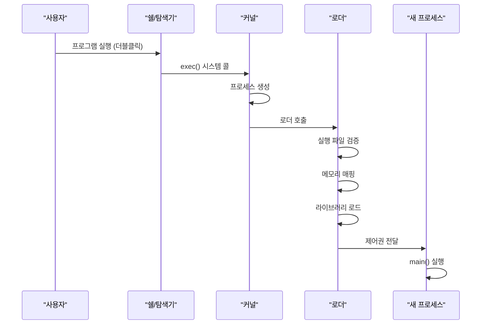
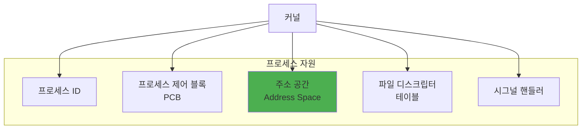
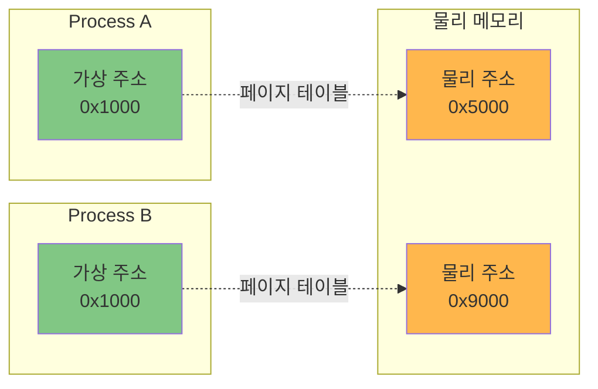
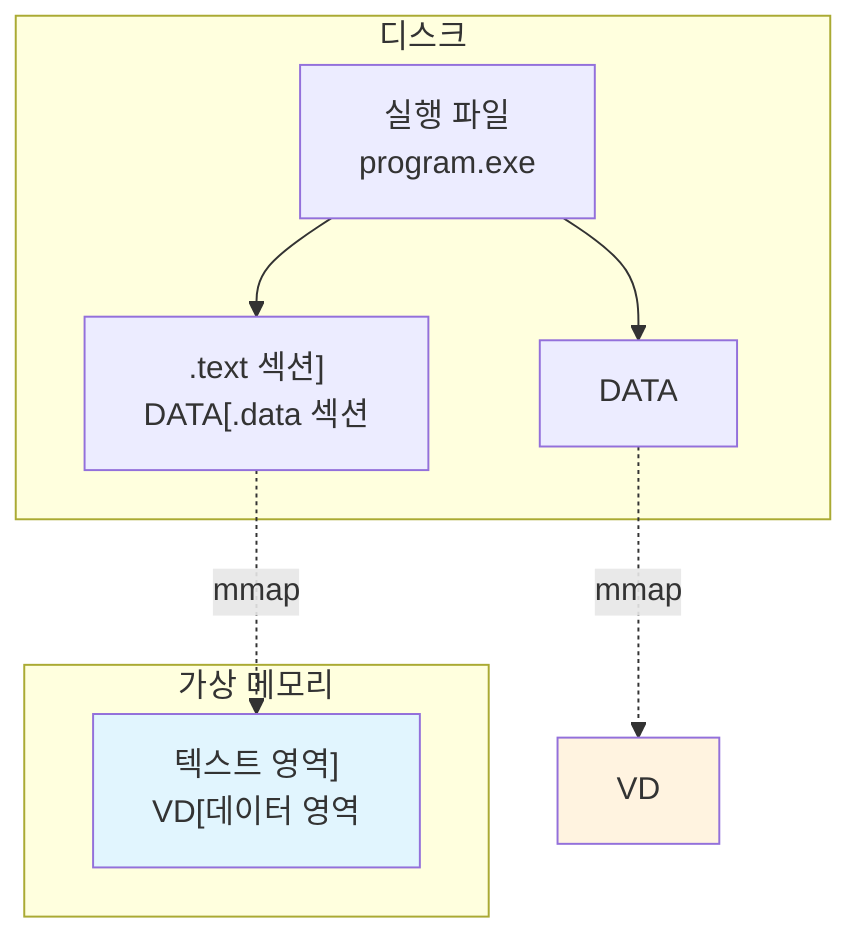
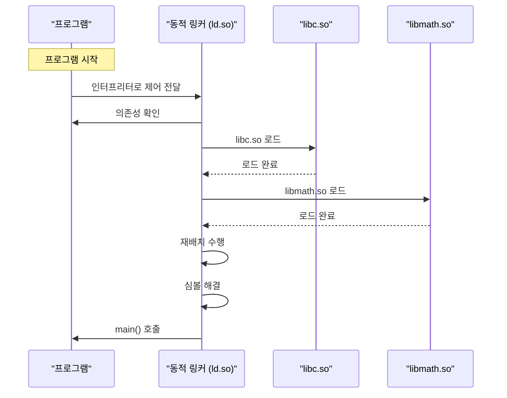
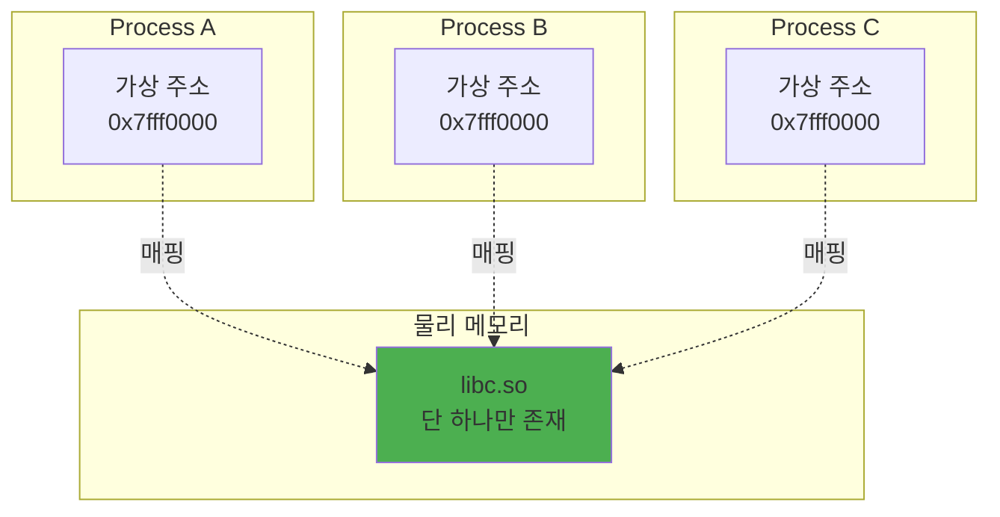
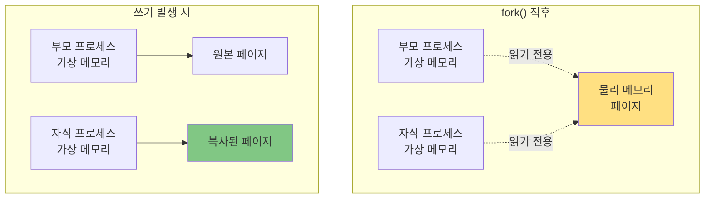

---
tags:
  - aslr
  - deep-study
  - dynamic-linking
  - intermediate
  - loader
  - plt-got
  - theoretical
  - virtual-memory
  - 시스템프로그래밍
difficulty: INTERMEDIATE
learning_time: "5-7시간"
main_topic: "시스템 프로그래밍"
priority_score: 5
---

# 5.3.1: 로딩과 실행은 어떻게 동작하는가

## 이 문서를 읽으면 답할 수 있는 질문들

- 더블클릭한 프로그램이 어떻게 실행되기 시작할까요?
- 실행 파일이 메모리의 어디에, 어떻게 배치될까요?
- 여러 프로그램이 같은 주소를 사용해도 충돌하지 않는 이유는 뭘까요?
- 공유 라이브러리가 정말로 메모리를 절약할까요?
- 프로그램 시작 전에 운영체제가 하는 준비 작업은 무엇일까요?

## 들어가며: 클릭에서 실행까지의 여정

프로그램 아이콘을 더블클릭합니다. 잠시 후 프로그램이 실행됩니다. 이 짧은 순간에 무슨 일이 일어날까요?

디스크에 있던 실행 파일이 갑자기 살아 움직이는 프로세스가 되는 과정은 마법처럼 보입니다. 하지만 이건 '로더(Loader)'라는 운영체제의 핵심 구성요소가 수행하는 정교한 작업의 결과예요.

링커가 만든 실행 파일은 아직 '레시피'에 불과해요. 로더는 이 레시피를 읽고 필요한 재료(메모리, 라이브러리)를 준비하고 실제로 요리(실행)를 시작하는 요리사예요.

## 1. 프로그램 실행의 시작

### 1.1 실행 요청에서 프로세스 생성까지



### 1.2 실행 파일 검증

로더가 가장 먼저 하는 일은 파일이 실행 가능한지 확인하는 것입니다:

```text
실행 파일 헤더 검사
┌────────────────────────┐
│ 매직 넘버 확인         │ ← 0x7F 'E' 'L' 'F' (Linux)
│                        │ ← 'M' 'Z' (Windows)
│                        │ ← 0xFE 0xED 0xFA 0xCE (macOS)
├────────────────────────┤
│ 아키텍처 확인          │ ← x86_64? ARM?
├────────────────────────┤
│ 실행 권한 확인         │ ← 실행 가능 비트 설정?
├────────────────────────┤
│ 종속성 확인            │ ← 필요한 라이브러리 존재?
└────────────────────────┘
```

### 1.3 프로세스 생성

운영체제는 새 프로세스를 위한 자원을 할당합니다:



## 2. 메모리 공간 구성

### 2.1 가상 주소 공간

모든 프로세스는 자신만의 가상 주소 공간을 가집니다:

```text
64비트 시스템의 가상 주소 공간 (Linux)
┌─────────────────┐ 0xFFFFFFFFFFFFFFFF
│                 │
│   커널 공간     │ (운영체제 전용)
│                 │
├─────────────────┤ 0xFFFF800000000000
│                 │
│   사용 불가     │ (미사용 영역)
│                 │
├─────────────────┤ 0x00007FFFFFFFFFFF
│     스택        │ ↓ (아래로 성장)
├─────────────────┤
│                 │
│   메모리 매핑   │ (공유 라이브러리, mmap)
│                 │
├─────────────────┤
│                 │
│      힙         │ ↑ (위로 성장)
├─────────────────┤
│     BSS         │ (초기화되지 않은 데이터)
├─────────────────┤
│    데이터       │ (초기화된 데이터)
├─────────────────┤
│    텍스트       │ (실행 코드)
└─────────────────┘ 0x0000000000400000
```

### 2.2 왜 가상 메모리인가?

물리 메모리를 직접 사용하면 어떤 문제가 있을까요?

#### 문제 1: 주소 충돌

```text
물리 메모리 직접 사용 시
┌─────────────────┐
│  Program A      │ 0x1000: int data = 5;
├─────────────────┤
│  Program B      │ 0x1000: char* str = "hello";  // 충돌!
└─────────────────┘
```

#### 문제 2: 보안 문제

```text
악의적인 프로그램이 다른 프로그램의 메모리를 읽거나 수정 가능
Program A의 비밀번호 → Program B가 훔쳐볼 수 있음
```

#### 해결: 가상 메모리



같은 가상 주소 0x1000이 서로 다른 물리 주소로 매핑됩니다!

## 3. 실행 파일 로딩 과정

### 3.1 메모리 매핑

로더는 실행 파일을 메모리에 직접 복사하지 않고 '매핑'합니다:



메모리 매핑의 장점:

1.**지연 로딩**: 필요한 부분만 실제로 메모리에 로드
2.**메모리 절약**: 여러 프로세스가 같은 코드 공유
3.**빠른 시작**: 전체를 복사하지 않고 매핑만 설정

### 3.2 섹션별 로딩

실행 파일의 각 섹션은 다른 권한으로 로드됩니다:

| 섹션 | 내용 | 권한 | 특징 |
|------|------|------|------|
| .text | 실행 코드 | R-X | 읽기/실행 가능, 쓰기 불가 |
| .rodata | 상수 데이터 | R-- | 읽기만 가능 |
| .data | 초기화된 전역 변수 | RW- | 읽기/쓰기 가능 |
| .bss | 초기화 안 된 전역 변수 | RW- | 0으로 초기화 |

### 3.3 실제 로딩 예제

간단한 프로그램이 어떻게 메모리에 배치되는지 봅시다:

```c
// example.c
#include <stdio.h>

const char* message = "Hello";  // .rodata
int initialized = 42;           // .data
int uninitialized;              // .bss

int main() {                    // .text
    int local = 10;             // stack
    return 0;
}
```

메모리 배치:

```text
가상 주소 공간
┌─────────────────┐ 높은 주소
│   스택          │
│   local = 10    │
├─────────────────┤
│     ...         │
├─────────────────┤
│   .bss          │
│ uninitialized=0 │
├─────────────────┤
│   .data         │
│ initialized=42  │
├─────────────────┤
│   .rodata       │
│ "Hello"         │
├─────────────────┤
│   .text         │
│ main() 코드     │
└─────────────────┘ 낮은 주소
```

## 4. 동적 링킹의 실제

### 4.1 동적 링커의 동작

프로그램이 동적 라이브러리를 사용할 때:



### 4.2 PLT와 GOT

동적 링킹은 PLT(Procedure Linkage Table)와 GOT(Global Offset Table)를 사용합니다:

```text
첫 번째 printf() 호출
┌──────────────┐      ┌──────────────┐      ┌──────────────┐
│   main()     │ ---> │   PLT        │ ---> │   GOT        │
│ call printf  │      │ jmp *GOT[3]  │      │ 해결 루틴    │
└──────────────┘      └──────────────┘      └──────────────┘
                                                    ↓
                                             동적 링커 호출
                                                    ↓
                                             printf 주소 찾기
                                                    ↓
두 번째 printf() 호출                        GOT 업데이트
┌──────────────┐      ┌──────────────┐      ┌──────────────┐
│   main()     │ ---> │   PLT        │ ---> │   GOT        │
│ call printf  │      │ jmp *GOT[3]  │      │ printf 주소  │
└──────────────┘      └──────────────┘      └──────────────┘
                                                    ↓
                                             직접 printf 호출
```

이를**Lazy Binding**이라고 합니다. 함수를 처음 호출할 때만 주소를 찾습니다.

#### PLT/GOT 실제 어셈블리 코드

```assembly
; printf@plt 엔트리 (첫 번째 호출)
printf@plt:
    jmp    QWORD PTR [rip+0x2f92]  ; GOT[printf]로 점프
    push   0x1                      ; 재배치 인덱스
    jmp    .plt.got               ; 동적 링커 호출

; 동적 링커가 주소 해결 후 GOT 업데이트
; GOT[printf] = 0x7ffff7a649c0 (실제 printf 주소)

; printf@plt 엔트리 (두 번째 호출 이후)
printf@plt:
    jmp    QWORD PTR [rip+0x2f92]  ; 직접 printf로 점프!
```

이러한 메커니즘으로:

- 첫 호출: PLT → GOT → 동적 링커 → 실제 함수 (느림)
- 이후 호출: PLT → GOT → 실제 함수 (빠름)

### 4.3 공유 라이브러리의 메모리 공유

여러 프로세스가 같은 라이브러리를 사용할 때:



메모리 절약 효과:

- libc.so 크기: 2MB
- 100개 프로세스 사용
- 절약: 198MB (2MB × 99)

## 5. 프로그램 시작 과정

### 5.1 진입점(Entry Point)

프로그램은 main()이 아닌 _start에서 시작합니다:

```text
실행 흐름
┌─────────────┐
│   _start    │ ← 진짜 시작점
└──────┬──────┘
       ↓
┌─────────────┐
│ __libc_start│ ← C 런타임 초기화
└──────┬──────┘
       ↓
┌─────────────┐
│    main()   │ ← 우리가 작성한 코드
└──────┬──────┘
       ↓
┌─────────────┐
│    exit()   │ ← 정리 작업
└─────────────┘
```

### 5.2 C 런타임 초기화

main() 전에 수행되는 작업들:

```c
// 의사 코드로 표현한 초기화 과정
void __libc_start_main() {
    // 1. 환경 변수 설정
    setup_environment(envp);

    // 2. 명령행 인자 준비
    prepare_argv(argc, argv);

    // 3. 표준 입출력 초기화
    init_stdio();

    // 4. 힙 관리자 초기화
    init_heap();

    // 5. 스레드 지원 초기화
    pthread_init();

    // 6. 시그널 핸들러 설정
    setup_signals();

    // 7. 전역 생성자 실행 (C++)
    call_global_constructors();

    // 8. main 호출
    int ret = main(argc, argv, envp);

    // 9. 종료 처리
    exit(ret);
}
```

### 5.3 스택 초기화

main() 호출 전 스택 상태:

```text
스택 (높은 주소에서 낮은 주소로)
┌─────────────────┐
│  환경 변수      │ "PATH=/usr/bin"
│                 │ "HOME=/home/user"
├─────────────────┤
│  NULL           │ (환경 변수 끝)
├─────────────────┤
│  명령행 인자    │ "./program"
│                 │ "arg1"
│                 │ "arg2"
├─────────────────┤
│  NULL           │ (인자 끝)
├─────────────────┤
│  argv[2]        │ → "arg2"
├─────────────────┤
│  argv[1]        │ → "arg1"
├─────────────────┤
│  argv[0]        │ → "./program"
├─────────────────┤
│  argc           │ 3
└─────────────────┘
```

## 6. 메모리 보호와 보안

### 6.1 메모리 보호 메커니즘

운영체제는 여러 보호 메커니즘을 제공합니다:

#### DEP/NX (Data Execution Prevention)

```text
┌─────────────────┐
│   스택 (RW-)    │ ← 실행 불가! 쉘코드 방지
├─────────────────┤
│   힙 (RW-)      │ ← 실행 불가!
├─────────────────┤
│   코드 (R-X)    │ ← 쓰기 불가! 코드 변조 방지
└─────────────────┘
```

#### ASLR (Address Space Layout Randomization)

```text
실행할 때마다 주소가 달라짐:

첫 번째 실행:
스택: 0x7ffd12345678
힙:   0x5612abcdef00
libc: 0x7f8899aabbcc

두 번째 실행:
스택: 0x7ffea9876543  ← 다름!
힙:   0x5587fedcba00  ← 다름!
libc: 0x7f1122334455  ← 다름!
```

### 6.2 Copy-on-Write (CoW)

fork() 시스템 콜에서 메모리 효율성:



## 7. 실전: 프로그램 로딩 분석

### 7.1 실제 프로그램 분석

Linux에서 프로그램 로딩 과정 관찰:

```bash
# 프로세스 메모리 맵 확인
$ cat /proc/self/maps

00400000-00401000 r-xp  /bin/cat      # 실행 코드
00600000-00601000 r--p  /bin/cat      # 읽기 전용 데이터
00601000-00602000 rw-p  /bin/cat      # 읽기/쓰기 데이터
7f8a12345000-7f8a12500000 r-xp /lib/libc.so.6  # libc
7ffd98765000-7ffd98786000 rw-p [stack]         # 스택

# 동적 링킹 정보
$ ldd /bin/ls
    linux-vdso.so.1 =>  (0x00007fff...)
    libc.so.6 => /lib/x86_64-linux-gnu/libc.so.6
    /lib64/ld-linux-x86-64.so.2 (0x00007f...)

# 로딩 과정 추적
$ strace ./program 2>&1 | head -20
execve("./program", ["./program"], ...)
brk(NULL)                               # 힙 초기화
mmap(NULL, 8192, PROT_READ|PROT_WRITE, ...)  # 메모리 매핑
access("/etc/ld.so.preload", R_OK)     # 프리로드 확인
open("/lib/x86_64-linux-gnu/libc.so.6", O_RDONLY)  # libc 열기
mmap(NULL, 3936288, PROT_READ|PROT_EXEC, ...)      # libc 매핑
```

### 7.2 성능 최적화

#### Preloading

```bash
# 특정 라이브러리 미리 로드
LD_PRELOAD=/path/to/mylib.so ./program

# 시스템 전체 프리로드
echo "/usr/lib/important.so" >> /etc/ld.so.preload
```

#### Prelinking (deprecated but instructive)

```text
일반 동적 링킹:
프로그램 시작 → 라이브러리 로드 → 재배치 → 실행
                              ↑
                         시간 소요 (매번)

Prelinking:
사전에 재배치 완료 → 프로그램 시작 → 즉시 실행
                                ↑
                           시간 절약
```

## 8. 특수한 로딩 시나리오

### 8.1 인터프리터 스크립트

셔뱅(#!)으로 시작하는 스크립트:

```python
#!/usr/bin/python3
print("Hello, World!")
```

로딩 과정:


### 8.2 정적 링킹 프로그램

정적으로 링크된 프로그램의 로딩:

```text
동적 링킹 프로그램:          정적 링킹 프로그램:
┌─────────────┐            ┌─────────────┐
│  작은 실행  │            │  큰 실행    │
│   파일      │            │   파일      │
├─────────────┤            │ (라이브러리 │
│ 동적 링커   │            │   포함)     │
│   필요      │            ├─────────────┤
├─────────────┤            │ 동적 링커   │
│ 라이브러리  │            │   불필요    │
│   로드      │            └─────────────┘
└─────────────┘

로딩 시간: 느림             로딩 시간: 빠름
메모리: 효율적              메모리: 비효율적
```

## 9. 정리: 로딩과 실행의 핵심

### 로더란?

-**정의**: 실행 파일을 메모리에 적재하고 실행을 준비하는 시스템 구성요소
-**목적**: 디스크의 정적인 파일을 동적인 프로세스로 변환
-**주요 작업**: 메모리 매핑, 동적 링킹, 재배치, 초기화

### 왜 중요한가?

1.**메모리 효율**: 공유 라이브러리로 메모리 절약
2.**보안**: 가상 메모리와 보호 메커니즘
3.**유연성**: 동적 링킹으로 모듈화 가능
4.**성능**: 지연 로딩과 Copy-on-Write

### 기억해야 할 점

- 모든 프로세스는 독립된 가상 주소 공간을 가짐
- 실행 파일은 메모리에 매핑되며, 필요한 부분만 로드됨
- 동적 링킹은 실행 시점에 라이브러리를 연결
- main() 전에 많은 초기화 작업이 수행됨
- ASLR, DEP 등 보안 기능이 기본 적용됨

## 다음 섹션 예고

다음 섹션([5.4: 컴파일러 최적화는 어떻게 동작하는가](05-04-01-compiler-optimization.md))에서는**컴파일러 최적화**기법을 다룹니다:

- 컴파일러는 어떤 최적화를 수행하는가?
- 최적화 레벨(-O0, -O2, -O3)의 실제 차이는?
- 인라이닝, 루프 최적화, 벡터화란?
- 최적화가 때로는 문제가 되는 이유는?

컴파일러가 우리 코드를 어떻게 더 빠르게 만드는지, 그 놀라운 기법들을 함께 살펴보겠습니다.

## 📚 관련 문서

### 📖 현재 문서 정보

-**난이도**: INTERMEDIATE
-**주제**: 시스템 프로그래밍
-**예상 시간**: 5-7시간

### 🎯 학습 경로

- [📚 INTERMEDIATE 레벨 전체 보기](../learning-paths/intermediate/)
- [🏠 메인 학습 경로](../learning-paths/)
- [📋 전체 가이드 목록](../README.md)

### 📂 같은 챕터 (chapter-01-compiler-linker)

- [5.1: 컴파일은 어떻게 동작하는가](./05-01-01-compilation.md)
- [5.2: 링킹은 어떻게 동작하는가](./05-02-01-linking.md)
- [5.4: 컴파일러 최적화는 어떻게 동작하는가](./05-04-01-compiler-optimization.md)
- [5.5: 빌드 시스템 디버깅 - "왜 빌드가 이렇게 느리지?"](./05-05-01-build-debugging.md)
- [5.6: 링커 에러 해결 - "undefined reference가 계속 나요"](./05-05-02-linking-debugging.md)

### 🏷️ 관련 키워드

`loader`, `virtual-memory`, `dynamic-linking`, `plt-got`, `aslr`

### ⏭️ 다음 단계 가이드

- 실무 적용을 염두에 두고 프로젝트에 적용해보세요
- 관련 도구들을 직접 사용해보는 것이 중요합니다
