---
tags:
  - balanced
  - compiler-optimization
  - intermediate
  - loop-optimization
  - medium-read
  - performance
  - simd
  - vectorization
  - 시스템프로그래밍
difficulty: INTERMEDIATE
learning_time: "3-4시간"
main_topic: "시스템 프로그래밍"
priority_score: 4
---

# 5.4.1: 컴파일러 최적화

## 이 문서를 읽으면 답할 수 있는 질문들

- 컴파일러는 우리 코드를 어떻게 더 빠르게 만들까요?
- -O0, -O1, -O2, -O3의 실제 차이는 무엇일까요?
- 왜 디버그 빌드와 릴리즈 빌드의 성능 차이가 클까요?
- 최적화가 버그를 만들 수 있는 이유는 뭔가요?
- 컴파일러 최적화를 믿어도 될까요, 아니면 수동 최적화가 필요할까요?

## 들어가며: 컴파일러는 마법사인가?

두 개발자가 같은 문제를 해결하는 코드를 작성했어요. 한 명은 최적화에 신경 쓰지 않고 읽기 쉽게 작성했고, 다른 한 명은 성능을 위해 복잡하게 작성했어요. 그런데 컴파일 후 성능을 측정해보니 거의 같았어요. 대체 어떻게 된 일일까요?

현대 컴파일러는 단순한 번역기가 아닙니다. 수십 년간 축적된 최적화 기법을 사용하여 우리가 작성한 코드를 놀랍도록 효율적으로 변환합니다. 때로는 우리가 상상하지 못한 방법으로 코드를 개선하기도 합니다.

하지만 컴파일러는 마법사가 아니에요. 코드의 의도를 완벽하게 이해하지 못하고, 때로는 우리 기대와 다르게 동작해요. 컴파일러 최적화를 이해하면 더 좋은 코드를 작성할 수 있어요.

## 1. 최적화의 기본 원리

### 1.1 최적화의 목표

컴파일러 최적화는 여러 목표를 추구합니다:

```mermaid
graph TD
    O[최적화 목표] --> S["속도
Speed"]
    O --> M["크기
Size"]
    O --> P["전력
Power"]
    O --> C["캐시
Cache"]

    S --> S1["실행 시간 단축"]
    M --> M1["바이너리 크기 감소"]
    P --> P1["전력 소비 감소"]
    C --> C1["캐시 미스 감소"]

    style O fill:#FFE082
    style S fill:#81C784
    style M fill:#90CAF9
    style P fill:#CE93D8
    style C fill:#FFAB91
```



때로는 이 목표들이 충돌합니다:

- 속도를 위해 코드를 복제하면 → 크기 증가
- 크기를 줄이기 위해 함수 호출하면 → 속도 감소

### 1.2 최적화의 제약

컴파일러는 프로그램의 의미를 바꾸지 않는 선에서 최적화해요:

```c
// 원본 코드
int calculate(int x) {
    int a = x * 2;
    int b = x * 2;
    return a + b;
}

// 최적화 가능: 의미가 같음
int calculate_opt1(int x) {
    return x * 4;  // 2*x + 2*x = 4*x
}

// 최적화 불가능: 의미가 다름
int calculate_wrong(int x) {
    return 0;  // 잘못된 최적화!
}
```

### 1.3 최적화 레벨

GCC/Clang의 최적화 레벨:

| 레벨 | 설명 | 용도 |
|------|------|------|
| -O0 | 최적화 없음 | 디버깅 |
| -O1 | 기본 최적화 | 빠른 컴파일 |
| -O2 | 권장 최적화 | 일반적 사용 |
| -O3 | 공격적 최적화 | 최대 성능 |
| -Os | 크기 최적화 | 임베디드 |
| -Og | 디버그 최적화 | 디버깅+약간의 최적화 |

## 2. 주요 최적화 기법들

### 2.1 상수 폴딩 (Constant Folding)

컴파일 시점에 계산 가능한 것은 미리 계산합니다:

```c
// 원본 코드
int get_buffer_size() {
    return 1024 * 1024 * 16;  // 16MB
}

// 최적화 후 (어셈블리 의사 코드)
get_buffer_size:
    mov eax, 16777216  // 이미 계산된 값
    ret
```

더 복잡한 예:

```c
// 원본
double calculate() {
    double pi = 3.14159265359;
    double radius = 10.0;
    return 2 * pi * radius;
}

// 최적화 후
double calculate() {
    return 62.83185307179586;  // 컴파일 시점에 계산
}
```

### 2.2 죽은 코드 제거 (Dead Code Elimination)

실행되지 않거나 결과가 사용되지 않는 코드를 제거합니다:

```c
// 원본 코드
int process(int x) {
    int unused = x * 100;     // 사용 안 됨

    if (0) {                  // 절대 실행 안 됨
        printf("Never, ");
    }

    int result = x + 1;
    result = x + 2;           // 이전 값 덮어씀

    return result;
}

// 최적화 후
int process(int x) {
    return x + 2;
}
```

### 2.3 함수 인라이닝 (Function Inlining)

작은 함수를 호출 위치에 직접 삽입합니다:

```c
// 원본 코드
inline int square(int x) {
    return x * x;
}

int calculate(int a, int b) {
    return square(a) + square(b);
}

// 최적화 후
int calculate(int a, int b) {
    return (a * a) + (b * b);  // 함수 호출 오버헤드 제거
}
```

인라이닝의 효과:


### 2.4 루프 최적화

#### 루프 언롤링 (Loop Unrolling)

```c
// 원본 코드
for (int i = 0; i < 4; i++) {
    sum += array[i];
}

// 언롤링 후
sum += array[0];
sum += array[1];
sum += array[2];
sum += array[3];
// 루프 제어 오버헤드 제거
```

#### 루프 불변 코드 이동 (Loop-Invariant Code Motion)

```c
// 원본 코드
for (int i = 0; i < n; i++) {
    int constant = x * y;  // 루프마다 같은 값
    result[i] = array[i] + constant;
}

// 최적화 후
int constant = x * y;  // 루프 밖으로 이동
for (int i = 0; i < n; i++) {
    result[i] = array[i] + constant;
}
```

#### 루프 융합 (Loop Fusion)

```c
// 원본 코드
for (int i = 0; i < n; i++) {
    a[i] = b[i] + 1;
}
for (int i = 0; i < n; i++) {
    c[i] = a[i] * 2;
}

// 융합 후
for (int i = 0; i < n; i++) {
    a[i] = b[i] + 1;
    c[i] = a[i] * 2;  // 캐시 지역성 향상
}
```

### 2.5 공통 부분식 제거 (Common Subexpression Elimination)

같은 계산을 반복하지 않습니다:

```c
// 원본 코드
int calculate(int x, int y) {
    int a = (x + y) * 2;
    int b = (x + y) * 3;
    int c = (x + y) / 2;
    return a + b + c;
}

// 최적화 후
int calculate(int x, int y) {
    int temp = x + y;  // 한 번만 계산
    int a = temp * 2;
    int b = temp * 3;
    int c = temp / 2;
    return a + b + c;
}
```

## 3. 고급 최적화 기법

### 3.1 벡터화 (Vectorization)

SIMD 명령어를 사용하여 여러 데이터를 동시 처리:

```c
// 원본 코드
for (int i = 0; i < 1024; i++) {
    c[i] = a[i] + b[i];
}

// 벡터화 후 (의사 코드)
for (int i = 0; i < 1024; i += 4) {
    // 4개씩 동시 처리
    vector_add(c + i, a + i, b + i, 4);
}
```

벡터화 효과:

```mermaid
graph TD
    subgraph "스칼라 처리"
        A1["a[0]"] --> P1[+] --> C1["c[0]"]
        A2["a[1]"] --> P2[+] --> C2["c[1]"]
        A3["a[2]"] --> P3[+] --> C3["c[2]"]
        A4["a[3]"] --> P4[+] --> C4["c[3]"]
    end

    subgraph "벡터 처리 (SIMD)"
        AV["a[0:3]"] --> PV["Vector +"] --> CV["c[0:3]"]
    end

    style PV fill:#4CAF50
```



### 3.2 분기 예측 최적화

조건문을 최적화하여 파이프라인 효율성 향상:

```c
// 원본 코드
for (int i = 0; i < n; i++) {
    if (likely(array[i] > 0)) {  // 대부분 참
        positive_count++;
    } else {
        negative_count++;
    }
}

// 컴파일러 힌트 사용
#define likely(x)   __builtin_expect(!!(x), 1)
#define unlikely(x) __builtin_expect(!!(x), 0)
```

### 3.3 테일 콜 최적화 (Tail Call Optimization)

재귀를 반복문으로 변환:

```c
// 원본 재귀 코드
int factorial(int n, int acc) {
    if (n <= 1) return acc;
    return factorial(n - 1, n * acc);  // 테일 콜
}

// 최적화 후 (반복문으로 변환)
int factorial(int n, int acc) {
    while (n > 1) {
        acc = n * acc;
        n = n - 1;
    }
    return acc;
}
```

스택 사용량 비교:

```text
재귀 버전:              최적화 버전:
┌──────────┐           ┌──────────┐
│factorial │ n=5       │factorial │ n=5
├──────────┤           └──────────┘
│factorial │ n=4       (스택 프레임 1개만 사용)
├──────────┤
│factorial │ n=3
├──────────┤
│factorial │ n=2
├──────────┤
│factorial │ n=1
└──────────┘
```

## 4. 최적화 레벨별 차이

### 4.1 실제 예제로 보는 차이

간단한 함수를 각 최적화 레벨로 컴파일:

```c
// test.c
int sum_array(int* arr, int n) {
    int sum = 0;
    for (int i = 0; i < n; i++) {
        sum += arr[i];
    }
    return sum;
}
```

#### -O0 (최적화 없음)

```assembly
sum_array:
    push   rbp
    mov    rbp, rsp
    mov    QWORD PTR [rbp-24], rdi  ; arr 저장
    mov    DWORD PTR [rbp-28], esi  ; n 저장
    mov    DWORD PTR [rbp-4], 0     ; sum = 0
    mov    DWORD PTR [rbp-8], 0     ; i = 0
.L3:
    mov    eax, DWORD PTR [rbp-8]   ; i 로드
    cmp    eax, DWORD PTR [rbp-28]  ; i < n 비교
    jge    .L2
    ; ... 복잡한 메모리 접근 ...
    add    DWORD PTR [rbp-4], eax   ; sum += arr[i]
    add    DWORD PTR [rbp-8], 1     ; i++
    jmp    .L3
.L2:
    mov    eax, DWORD PTR [rbp-4]
    pop    rbp
    ret
```

#### -O2 (권장 최적화)

```assembly
sum_array:
    test   esi, esi          ; n == 0?
    jle    .L4
    lea    eax, [rsi-1]      ; 루프 준비
    xor    edx, edx          ; sum = 0 (레지스터)
    xor    ecx, ecx          ; i = 0 (레지스터)
.L3:
    add    edx, DWORD PTR [rdi+rcx*4]  ; sum += arr[i]
    inc    rcx                          ; i++
    cmp    rax, rcx
    jne    .L3
    mov    eax, edx
    ret
.L4:
    xor    eax, eax          ; return 0
    ret
```

#### -O3 (공격적 최적화, 벡터화 포함)

```assembly
sum_array:
    ; SIMD 명령어 사용
    vpxor   xmm0, xmm0, xmm0    ; 벡터 레지스터 초기화
    ; ... 4개씩 병렬 처리 ...
    vpaddd  xmm0, xmm0, XMMWORD PTR [rdi+rax*4]
    ; ... 나머지 처리 ...
```

### 4.2 성능 비교

```text
벤치마크 결과 (1,000,000 요소 배열):
┌─────────┬────────────┬─────────────┐
│ 레벨    │ 실행 시간   │ 상대 성능    │
├─────────┼────────────┼─────────────┤
│ -O0     │ 4.2ms      │ 1.0x        │
│ -O1     │ 2.1ms      │ 2.0x        │
│ -O2     │ 1.3ms      │ 3.2x        │
│ -O3     │ 0.8ms      │ 5.2x        │
│ -Os     │ 1.5ms      │ 2.8x        │
└─────────┴────────────┴─────────────┘
```

## 5. 최적화의 부작용

### 5.1 정밀도 문제

부동소수점 연산 순서 변경:

```c
// 원본 코드
float calculate(float a, float b, float c) {
    return (a + b) + c;
}

// 최적화로 순서 변경 가능
float calculate_opt(float a, float b, float c) {
    return a + (b + c);  // 결과가 다를 수 있음!
}

// 예: a = 1e30, b = -1e30, c = 1.0
// (a + b) + c = 0.0 + 1.0 = 1.0
// a + (b + c) = 1e30 + (-1e30 + 1.0) = 1e30 - 1e30 = 0.0
```

### 5.2 Undefined Behavior

컴파일러는 undefined behavior가 없다고 가정합니다:

```c
// 위험한 코드
int dangerous(int x) {
    int result = x + 1;
    if (x == INT_MAX) {  // 오버플로우 체크
        return -1;
    }
    return result;
}

// 컴파일러 최적화 후
int dangerous_opt(int x) {
    return x + 1;  // 체크 제거! (UB는 없다고 가정)
}
```

### 5.3 메모리 재정렬

멀티스레드 환경에서 문제:

```c
// 원본 코드
int data = 0;
int flag = 0;

// Thread 1
void writer() {
    data = 42;
    flag = 1;  // data 준비 완료 신호
}

// Thread 2
void reader() {
    if (flag == 1) {
        use(data);  // data = 42 기대
    }
}

// 최적화로 순서 변경 가능!
void writer_opt() {
    flag = 1;  // 순서 바뀜!
    data = 42;
}
```

해결: 메모리 배리어와 Atomic Operations

```c
#include <stdatomic.h>

// C11 atomic을 사용한 안전한 버전
atomic_int data = ATOMIC_VAR_INIT(0);
atomic_int flag = ATOMIC_VAR_INIT(0);

void writer_safe() {
    atomic_store_explicit(&data, 42, memory_order_relaxed);
    atomic_store_explicit(&flag, 1, memory_order_release);  // release barrier
}

void reader_safe() {
    if (atomic_load_explicit(&flag, memory_order_acquire) == 1) {  // acquire barrier
        int value = atomic_load_explicit(&data, memory_order_relaxed);
        use(value);  // data = 42 보장됨
    }
}

// 또는 전통적인 메모리 배리어 사용
void writer_traditional() {
    data = 42;
    __sync_synchronize();  // full memory barrier
    flag = 1;
}
```

**메모리 순서 보장 (Memory Ordering):**

- `memory_order_relaxed`: 순서 보장 없음, 원자성만 보장
- `memory_order_acquire`: 이후 메모리 접근이 앞으로 이동하지 않음
- `memory_order_release`: 이전 메모리 접근이 뒤로 이동하지 않음
- `memory_order_seq_cst`: 순차 일관성 (기본값)

## 6. 컴파일러 도움받기

### 6.1 컴파일러 힌트

```c
// 1. inline 힌트
inline int small_function(int x) {
    return x * 2;
}

// 2. 분기 예측 힌트
if (__builtin_expect(error_condition, 0)) {  // unlikely
    handle_error();
}

// 3. 정렬 힌트
struct __attribute__((aligned(64))) cache_line {
    int data[16];  // 캐시 라인 정렬
};

// 4. 순수 함수 힌트
__attribute__((pure))
int pure_function(int x) {
    return x * x;  // 부작용 없음
}

// 5. restrict 포인터
void copy(int* restrict dst, const int* restrict src, int n) {
    // dst와 src가 겹치지 않음을 보장
    for (int i = 0; i < n; i++) {
        dst[i] = src[i];
    }
}
```

### 6.2 프로파일 기반 최적화 (PGO)

실행 프로파일을 수집하여 최적화:

```bash
# 1단계: 프로파일 수집용 빌드
gcc -fprofile-generate program.c -o program

# 2단계: 대표적인 워크로드 실행
./program < typical_input.txt

# 3단계: 프로파일 기반 재컴파일
gcc -fprofile-use program.c -o program_optimized
```

PGO 효과:

```mermaid
graph LR
    subgraph "일반 최적화"
        C1["코드"] --> O1["정적 분석"] --> B1["바이너리"]
    end

    subgraph "PGO"
        C2["코드"] --> P["프로파일
실행"] --> O2["동적 분석"] --> B2["최적화된
바이너리"]
    end

    style P fill:#FFE082
    style B2 fill:#4CAF50
```



## 7. 실전: 최적화 분석

### 7.1 컴파일러 출력 분석

```bash
# 최적화 리포트 생성
gcc -O2 -fopt-info-vec-all program.c

# 출력 예:
program.c:10:5: optimized: loop vectorized using 32 byte vectors
program.c:15:8: note: not vectorized: not enough data-refs
program.c:20:3: optimized: loop unrolled 4 times

# 어셈블리 생성
gcc -S -O2 -fverbose-asm program.c

# 최적화 통계
gcc -O2 -fdump-statistics program.c
```

### 7.2 최적화 전후 비교

실제 코드 예제:

```c
// matrix_multiply.c
void matrix_multiply(double* C, const double* A, const double* B, int n) {
    for (int i = 0; i < n; i++) {
        for (int j = 0; j < n; j++) {
            double sum = 0.0;
            for (int k = 0; k < n; k++) {
                sum += A[i*n + k] * B[k*n + j];
            }
            C[i*n + j] = sum;
        }
    }
}
```

최적화 기법 적용:

```c
// 캐시 친화적 버전 (타일링)
void matrix_multiply_tiled(double* C, const double* A, const double* B, int n) {
    const int TILE = 64;

    for (int i0 = 0; i0 < n; i0 += TILE) {
        for (int j0 = 0; j0 < n; j0 += TILE) {
            for (int k0 = 0; k0 < n; k0 += TILE) {
                // 타일 내부 처리
                for (int i = i0; i < min(i0+TILE, n); i++) {
                    for (int j = j0; j < min(j0+TILE, n); j++) {
                        double sum = C[i*n + j];
                        for (int k = k0; k < min(k0+TILE, n); k++) {
                            sum += A[i*n + k] * B[k*n + j];
                        }
                        C[i*n + j] = sum;
                    }
                }
            }
        }
    }
}
```

성능 차이:

```text
행렬 크기: 1024x1024
┌──────────────┬──────────┬────────────┐
│ 버전         │ 시간(ms) │ 캐시 미스   │
├──────────────┼──────────┼────────────┤
│ 기본 (-O0)   │ 2850     │ 65M        │
│ 기본 (-O2)   │ 920      │ 64M        │
│ 기본 (-O3)   │ 680      │ 63M        │
│ 타일링 (-O2) │ 340      │ 8M         │
│ 타일링 (-O3) │ 280      │ 7M         │
└──────────────┴──────────┴────────────┘
```

## 8. 최적화 가이드라인

### 8.1 DO - 권장 사항

1.**측정이 먼저**: 추측하지 말고 프로파일링부터
2.**알고리즘이 먼저**: O(n²) → O(n log n)이 최우선
3.**컴파일러 믿기**: 단순한 최적화는 컴파일러가 더 잘해요
4.**가독성 우선**: 읽기 쉬운 코드가 최적화하기도 쉬워요
5.**적절한 레벨**: 대부분 -O2로 충분해요

### 8.2 DON'T - 피해야 할 것

1.**조기 최적화**: "Premature optimization is the root of all evil"
2.**과도한 수동 최적화**: 컴파일러를 방해할 수 있음
3.**UB 의존**: Undefined behavior에 의존하는 코드
4.**이식성 무시**: 특정 컴파일러/아키텍처 전용 코드
5.**맹목적 -O3**: 항상 빠른 것은 아님

## 9. 정리: 컴파일러 최적화의 핵심

### 최적화란?

-**정의**: 프로그램의 의미를 유지하면서 성능을 개선하는 변환
-**목적**: 실행 속도 향상, 메모리 사용 감소, 전력 효율 개선
-**제약**: 프로그램의 관찰 가능한 동작은 변경하지 않음

### 왜 중요한가?

1.**무료 성능 향상**: 코드 변경 없이 2-10배 성능 개선
2.**하드웨어 활용**: SIMD, 캐시, 파이프라인 최적 활용
3.**개발 생산성**: 최적화는 컴파일러에게, 로직은 개발자가

### 기억해야 할 점

- 컴파일러는 강력하지만 만능이 아니에요
- 최적화 레벨에 따라 다른 기법이 적용돼요
- 알고리즘 개선이 컴파일러 최적화보다 중요해요
- 최적화는 때로 예상치 못한 부작용을 가져와요
- 측정 없는 최적화는 그냥 추측일 뿐이죠

## 다음 장 예고

Chapter 1을 마치고, [Chapter 2: 메모리 아키텍처](../chapter-03-memory-system/index.md)에서는**프로그램 로딩과 메모리 레이아웃**을 다룹니다:

- 프로세스의 메모리는 어떻게 구성되는가?
- 스택과 힙은 어떻게 자라는가?
- 메모리 누수는 왜 발생하는가?
- 가상 메모리는 어떻게 동작하는가?

컴파일과 링킹을 거쳐 만들어진 프로그램이 실제로 메모리에서 어떻게 살아 숨쉬는지, 그 흥미로운 세계로 함께 떠나봅시다.

## 📚 관련 문서

### 📖 현재 문서 정보

-**난이도**: INTERMEDIATE
-**주제**: 시스템 프로그래밍
-**예상 시간**: 3-4시간

### 🎯 학습 경로

- [📚 INTERMEDIATE 레벨 전체 보기](../learning-paths/intermediate/)
- [🏠 메인 학습 경로](../learning-paths/)
- [📋 전체 가이드 목록](../README.md)

### 📂 같은 챕터 (chapter-01-compiler-linker)

- [5.1: 컴파일은 어떻게 동작하는가](./05-01-01-compilation.md)
- [5.2: 링킹은 어떻게 동작하는가](./05-02-01-linking.md)
- [5.3: 로딩과 실행은 어떻게 동작하는가](./05-03-01-loading-execution.md)
- [5.5: 빌드 시스템 디버깅 - "왜 빌드가 이렇게 느리지?"](./05-05-01-build-debugging.md)
- [5.6: 링커 에러 해결 - "undefined reference가 계속 나요"](./05-05-02-linking-debugging.md)

### 🏷️ 관련 키워드

`compiler-optimization`, `performance`, `vectorization`, `loop-optimization`, `simd`

### ⏭️ 다음 단계 가이드

- 실무 적용을 염두에 두고 프로젝트에 적용해보세요
- 관련 도구들을 직접 사용해보는 것이 중요합니다
