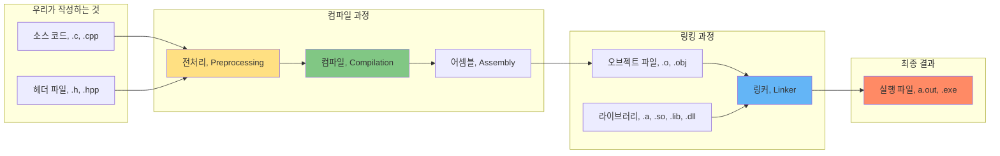
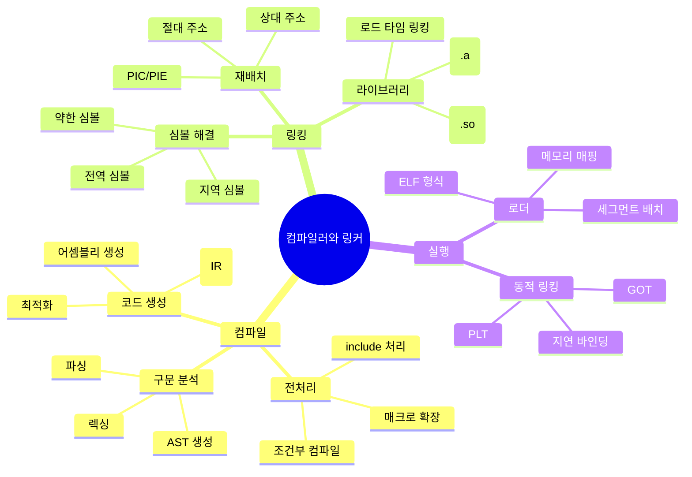

---
tags:
  - Compiler
  - Linker
  - BuildSystem
  - SystemProgramming
  - Optimization
  - deep-study
  - hands-on
  - intermediate
  - 시스템프로그래밍
difficulty: INTERMEDIATE
learning_time: "12-20시간"
main_topic: "시스템 프로그래밍"
priority_score: 4
---

# Chapter 05: 컴파일러와 링커 - 프로그램 생성의 과학

## 이 장에서 다루는 내용

소스코드부터 실행 파일까지, 컴파일과 링킹 과정의 이해와 최적화 기법을 다룹니다.

## 왜 이것을 알아야 하는가?

### 실무에서 마주치는 문제들

다음과 같은 상황을 겪어보셨나요?

- 💢 **"undefined reference to..."** 에러 메시지를 보고 막막했던 순간
- 🐌 헤더 파일 하나 수정했는데 전체 프로젝트가 재컴파일되는 고통
- 🤔 디버그 모드에서는 잘 되는데 릴리즈 모드에서만 크래시가 나는 미스터리
- 📦 실행 파일이 왜 이렇게 큰지, 어떻게 줄일 수 있을지 고민

이런 문제들의 근본 원인은 대부분 컴파일과 링킹 과정에 있습니다. 이 과정을 이해하면 더 이상 에러 메시지가 두렵지 않을 거예요.

## 전체 빌드 과정 한눈에 보기



## 📚 이 장의 구성

### 5.1 기초 개념

- [05-01-01: 컴파일은 어떻게 동작하는가](05-01-01-compilation.md)
  - **"Hello, World"에서 기계어까지**
  - 🔄 인간의 언어 → 기계의 언어: 소스 코드가 CPU 명령어가 되는 과정
  - 🏗️ 컴파일러의 내부 구조: 렉싱, 파싱, 의미 분석, 코드 생성의 4단계
  - 🎯 타겟 아키텍처: x86, ARM, RISC-V - 왜 다른 CPU용으로 컴파일해야 하는가?

### 5.2 핵심 구현

- [05-02-01: 링킹은 어떻게 동작하는가](05-02-01-linking.md)
  - **"조각들을 하나로 - 링커의 역할"**
  - 🧩 심볼 해결(Symbol Resolution): 함수와 변수를 어떻게 찾아 연결하는가?
  - 📍 재배치(Relocation): 각 모듈의 주소를 어떻게 조정하는가?
  - 📚 정적 vs 동적 링킹: 실행 파일 크기와 메모리 효율성의 트레이드오프

### 5.3 고급 기법

- [05-03-01: 로딩과 실행은 어떻게 동작하는가](05-03-01-loading-execution.md)
  - **"더블클릭에서 실행까지"**
  - 🚀 프로그램 로딩: 운영체제가 실행 파일을 메모리에 올리는 과정
  - 🗺️ 가상 주소 공간: 모든 프로그램이 같은 주소를 사용해도 충돌하지 않는 이유
  - 🔗 동적 링킹의 실제: PLT와 GOT를 통한 라이브러리 함수 호출

### 5.4 성능 최적화

- [05-04-01: 컴파일러 최적화](05-04-01-compiler-optimization.md)
  - **"더 빠르게, 더 작게 - 컴파일러의 마법"**
  - ⚡ 최적화 레벨: -O0, -O1, -O2, -O3, -Os의 차이점과 선택 기준
  - 🔄 주요 최적화 기법: 인라이닝, 루프 언롤링, 벡터화, 데드 코드 제거
  - ⚠️ 최적화의 함정: volatile, 메모리 배리어, undefined behavior

### 5.5 디버깅과 분석

- [05-05-01: 빌드 시스템 디버깅](05-05-01-build-debugging.md)
  - **"왜 빌드가 이렇게 느리지? - 빌드 성능 최적화"**
  - 🚀 빌드 캐싱: ccache, sccache를 활용한 컴파일 시간 단축
  - 🐳 Docker 빌드 최적화: 레이어 캐싱과 멀티스테이지 빌드
  - ⚡ 병렬 빌드: make -j, ninja를 활용한 빌드 시간 최적화

- [05-05-02: 링커 에러 해결](05-05-02-linking-debugging.md)
  - **"undefined reference가 계속 나요 - 링커 디버깅"**
  - 🔍 심볼 분석: nm, objdump, readelf를 활용한 심볼 테이블 분석
  - 🐛 링커 에러 해결: undefined reference, multiple definition 해결법
  - 📚 라이브러리 디버깅: 동적 라이브러리 로딩 문제 해결

## 실습 환경 준비

이 장의 예제들을 직접 실행해보려면 다음 도구들이 필요합니다:

```bash
# Linux/Mac
$ gcc --version    # GNU 컴파일러
$ objdump --version # 오브젝트 파일 분석 도구
$ ldd --version    # 동적 라이브러리 의존성 확인
$ nm --version     # 심볼 테이블 확인

# 유용한 컴파일 옵션들
$ gcc -save-temps  # 중간 파일들 저장 (.i, .s, .o)
$ gcc -S          # 어셈블리 코드만 생성
$ gcc -E          # 전처리만 수행
$ gcc -v          # 상세한 컴파일 과정 출력
```

## 이 장을 읽고 나면

✅ **에러 메시지 해독 능력**: "undefined reference"가 무엇을 의미하는지 정확히 알게 됩니다
✅ **빌드 시간 최적화**: 불필요한 재컴파일을 줄이는 방법을 배웁니다
✅ **디버깅 능력 향상**: 실행 파일 내부를 들여다보고 문제를 찾을 수 있습니다
✅ **성능 튜닝**: 컴파일러 최적화 옵션을 적절히 활용할 수 있습니다

## 핵심 개념 미리보기



## 다음 단계

이제 [5.1: 컴파일은 어떻게 동작하는가](05-01-01-compilation.md)부터 시작해서 소스 코드가 실행 파일이 되기까지의 여정을 함께 떠나봅시다.

우리 코드가 어떻게 생명을 얻는지, 그 신비로운 과정을 하나씩 밝혀나가겠습니다.

## 📚 관련 문서

### 📖 현재 문서 정보

- **난이도**: INTERMEDIATE
- **주제**: 시스템 프로그래밍
- **예상 시간**: 12-20시간

### 🎯 학습 경로

- [📚 INTERMEDIATE 레벨 전체 보기](../learning-paths/intermediate/)
- [🏠 메인 학습 경로](../learning-paths/)
- [📋 전체 가이드 목록](../README.md)

### 🏷️ 관련 키워드

`Compiler`, `Linker`, `BuildSystem`, `SystemProgramming`, `Optimization`

## 🔗 관련 챕터

### 📚 시스템 프로그래밍 기초

- [Chapter 1: 프로세스와 스레드](../chapter-01-process-thread/index.md)
- [Chapter 3: 메모리 시스템](../chapter-03-memory-system/index.md)
- [Chapter 6: 파일 시스템과 I/O](../chapter-06-file-io/index.md)

### 🚀 성능 관련  

- [Chapter 11: 성능 최적화](../chapter-11-performance-optimization/index.md)

### 🔧 고급 주제

- [Chapter 4: 시스템콜과 커널](../chapter-04-syscall-kernel/index.md)
- [Chapter 17: 보안 엔지니어링](../chapter-17-security-engineering/index.md)
