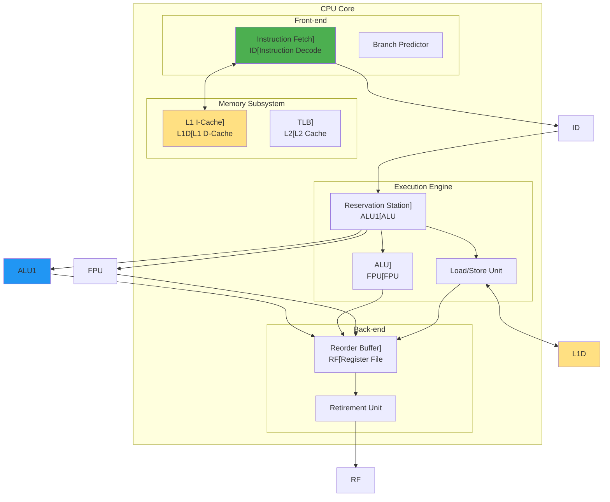
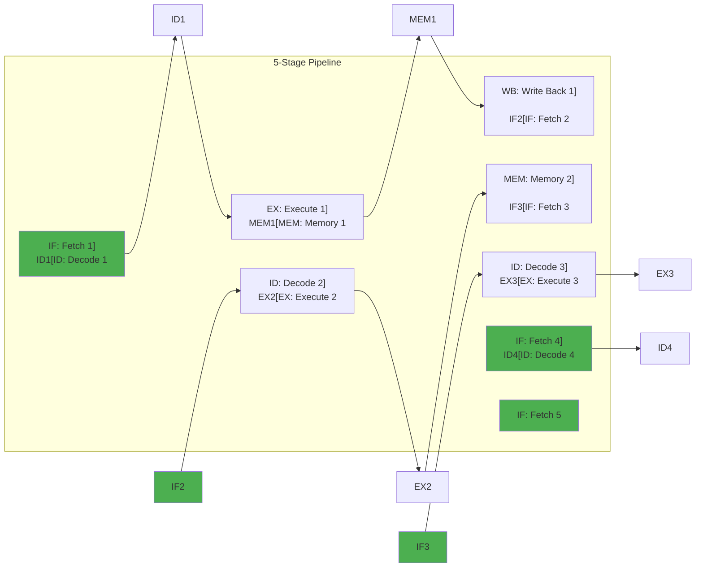

---
tags:
  - CPU
  - Computer Architecture
  - Instruction Execution
  - Computer Science
---

# Chapter 5-1: CPU 아키텍처와 명령어 실행은 어떻게 동작하는가

## 이 문서를 읽으면 답할 수 있는 질문들

- CPU는 어떻게 명령어를 해석하고 실행하는가?
- 파이프라인이 성능을 어떻게 향상시키는가?
- 분기 예측이 실패하면 왜 성능이 떨어지는가?
- 캐시 미스가 프로그램 속도에 미치는 영향은?
- Out-of-Order 실행이 어떻게 효율성을 높이는가?

## 들어가며: 나노초의 오케스트라

### ⚡ Intel 엔지니어의 충격 고백

2018년, Intel 엔지니어가 제게 말했습니다:
**"우리가 만든 CPU는 사실 점쟁이예요. 미래를 예측하죠."**

그는 Spectre 취약점을 설명하며 이렇게 말했습니다:
```
"CPU는 if문의 결과를 미리 '추측'하고 실행합니다.
맞으면? 10배 빨라집니다.
틀리면? 20 사이클을 버립니다.
하지만 95% 이상 맞춥니다."
```

### 🎮 게임이 60 FPS를 유지하는 비밀

제가 게임 엔진을 최적화하면서 깨달은 사실:

```c
// 이 코드가 16.6ms 안에 실행되어야 60 FPS
for (int i = 0; i < 1000000; i++) {
    update_particle(i);  // 파티클 하나당 16.6ns!
}
```

16.6 나노초. 빛이 겨우 5미터 가는 시간입니다.
그 짧은 순간에 CPU는:
- 명령어 4개를 동시에 실행 (슈퍼스칼라)
- 다음 100개 명령어를 미리 준비 (파이프라인)
- 메모리 접근을 예측해서 미리 로드 (프리페치)
- 루프가 끝날지 계속될지 예측 (분기 예측)

이번 섹션에서는 이런 마법 같은 일들이 어떻게 가능한지, CPU의 내부를 살펴봅시다.

## 1. CPU 기본 구조

### 1.1 CPU 구성 요소: 나노초의 공장

**실제 CPU 다이 사진을 보며 느낀 것**

AMD Ryzen 엔지니어가 보여준 CPU 다이 사진:
- 전체 면적의 30%가 캐시
- 20%가 분기 예측기
- 실제 계산 유닛(ALU)은 겨우 15%!

**"연산보다 예측과 캐시가 더 중요하다"**는 현대 CPU의 철학이 보입니다.



### 1.2 레지스터 구조: CPU의 작업대

**레지스터는 CPU의 작업대**입니다.

제가 어셈블리 최적화를 하면서 깨달은 점:
```
메모리 접근: 100 사이클
L1 캐시: 4 사이클
레지스터: 0 사이클! (같은 사이클 내 접근)
```

그래서 컴파일러는 자주 쓰는 변수를 레지스터에 최대한 오래 둡니다.

```c
// x86-64 레지스터 구조
typedef struct {
    // 범용 레지스터 (64비트)
    uint64_t rax, rbx, rcx, rdx;  // 기본
    uint64_t rsi, rdi;             // 소스/목적지 인덱스
    uint64_t rbp, rsp;             // 베이스/스택 포인터
    uint64_t r8, r9, r10, r11;     // 확장
    uint64_t r12, r13, r14, r15;   // 확장
    
    // 명령어 포인터
    uint64_t rip;
    
    // 플래그 레지스터
    struct {
        uint32_t CF : 1;  // Carry Flag
        uint32_t PF : 1;  // Parity Flag
        uint32_t AF : 1;  // Auxiliary Flag
        uint32_t ZF : 1;  // Zero Flag
        uint32_t SF : 1;  // Sign Flag
        uint32_t TF : 1;  // Trap Flag
        uint32_t IF : 1;  // Interrupt Flag
        uint32_t DF : 1;  // Direction Flag
        uint32_t OF : 1;  // Overflow Flag
        // ... 기타 플래그
    } rflags;
    
    // 세그먼트 레지스터
    uint16_t cs, ds, es, fs, gs, ss;
    
    // 제어 레지스터
    uint64_t cr0, cr2, cr3, cr4, cr8;
    
    // 디버그 레지스터
    uint64_t dr0, dr1, dr2, dr3, dr6, dr7;
    
    // MSR (Model Specific Registers)
    uint64_t msr[1024];
    
    // SIMD 레지스터
    __m512 zmm[32];  // AVX-512 (512비트)
} cpu_context_t;

// 레지스터 접근 예제
void register_operations() {
    uint64_t value;
    
    // 레지스터 읽기
    __asm__ volatile("mov %%rax, %0" : "=r"(value));
    
    // 레지스터 쓰기
    __asm__ volatile("mov %0, %%rax" : : "r"(value));
    
    // CPUID 명령어
    uint32_t eax, ebx, ecx, edx;
    __asm__ volatile("cpuid"
                    : "=a"(eax), "=b"(ebx), "=c"(ecx), "=d"(edx)
                    : "a"(0));
    
    printf("CPU Vendor: %.4s%.4s%.4s\n", 
           (char*)&ebx, (char*)&edx, (char*)&ecx);
    
    // 플래그 레지스터 읽기
    uint64_t flags;
    __asm__ volatile("pushfq; pop %0" : "=r"(flags));
    
    printf("Zero Flag: %d\n", (flags >> 6) & 1);
    printf("Sign Flag: %d\n", (flags >> 7) & 1);
}
```

## 2. 명령어 실행 과정

### 2.1 명령어 페치와 디코드: x86의 악몽

**Intel이 RISC를 부러워하는 이유**

Intel 엔지니어의 고백:
```
"x86 명령어는 1바이트부터 15바이트까지... 악몽이죠.
ARM은 모두 4바이트. 얼마나 부러운지...
하지만 우리에겐 비밀 무기가 있습니다: μop 캐시!"
```

실제로 Intel CPU는 x86 명령어를 내부적으로 RISC 스타일 마이크로 옵으로 변환합니다:
```
add [rax + rbx*4 + 0x10], rcx
↓ 디코드
1. load temp, [rax + rbx*4 + 0x10]
2. add temp, temp, rcx  
3. store [rax + rbx*4 + 0x10], temp
```

```c
// 명령어 형식 (x86-64 예제)
typedef struct {
    uint8_t prefixes[4];    // 옵션 프리픽스
    uint8_t opcode[3];      // 오프코드 (1-3 바이트)
    uint8_t modrm;          // Mod-Reg-R/M 바이트
    uint8_t sib;            // Scale-Index-Base 바이트
    union {
        uint8_t  disp8;     // 8비트 변위
        uint16_t disp16;    // 16비트 변위
        uint32_t disp32;    // 32비트 변위
    } displacement;
    union {
        uint8_t  imm8;      // 8비트 즉시값
        uint16_t imm16;     // 16비트 즉시값
        uint32_t imm32;     // 32비트 즉시값
        uint64_t imm64;     // 64비트 즉시값
    } immediate;
} x86_instruction_t;

// 명령어 페치 시뮬레이션
typedef struct {
    uint8_t* memory;
    uint64_t pc;  // Program Counter
    uint8_t instruction_buffer[16];
    int buffer_size;
} instruction_fetch_unit_t;

void fetch_instruction(instruction_fetch_unit_t* ifu) {
    // L1 I-Cache에서 명령어 페치
    for (int i = 0; i < 16; i++) {
        ifu->instruction_buffer[i] = ifu->memory[ifu->pc + i];
    }
    ifu->buffer_size = 16;
}

// 명령어 디코드
typedef struct {
    enum {
        OP_ADD, OP_SUB, OP_MUL, OP_DIV,
        OP_MOV, OP_LOAD, OP_STORE,
        OP_JMP, OP_JE, OP_JNE,
        OP_CALL, OP_RET
    } opcode;
    
    int src1_reg;
    int src2_reg;
    int dst_reg;
    int64_t immediate;
    
    bool has_memory_operand;
    uint64_t memory_address;
} micro_op_t;

micro_op_t decode_instruction(uint8_t* bytes) {
    micro_op_t uop;
    
    // 간단한 디코드 예제
    uint8_t opcode = bytes[0];
    
    switch (opcode) {
        case 0x01:  // ADD r/m, r
            uop.opcode = OP_ADD;
            uop.src1_reg = (bytes[1] >> 3) & 0x7;
            uop.src2_reg = bytes[1] & 0x7;
            break;
            
        case 0x89:  // MOV r/m, r
            uop.opcode = OP_MOV;
            uop.src1_reg = (bytes[1] >> 3) & 0x7;
            uop.dst_reg = bytes[1] & 0x7;
            break;
            
        case 0xE8:  // CALL rel32
            uop.opcode = OP_CALL;
            uop.immediate = *(int32_t*)(bytes + 1);
            break;
    }
    
    return uop;
}
```

### 2.2 파이프라인: 세탁소의 지혜

**파이프라인을 세탁소에 비유하면:**

```
세탁기 → 건조기 → 다림질 → 포장 → 배달

손님 1: ■■■□□  (건조 중)
손님 2: ■■□□□  (세탁 중)  
손님 3: ■□□□□  (투입 중)
```

한 손님이 끝날 때까지 기다리면 5시간.
파이프라인으로 하면 매시간 한 명씩 완료!

**실제 벤치마크:**
```c
void benchmark_pipeline() {
    // 파이프라인 친화적 (순차적)
    for (int i = 0; i < N; i++) {
        sum += array[i];  // 1.2ns/iteration
    }
    
    // 파이프라인 비친화적 (종속성)
    for (int i = 0; i < N; i++) {
        sum = hash(sum);   // 8.5ns/iteration - 7배 느림!
    }
}
```



```c
// 파이프라인 시뮬레이터
typedef struct {
    micro_op_t instruction;
    int stage;  // 현재 스테이지
    bool valid;
    uint64_t result;
} pipeline_register_t;

typedef struct {
    pipeline_register_t IF_ID;   // Fetch -> Decode
    pipeline_register_t ID_EX;   // Decode -> Execute
    pipeline_register_t EX_MEM;  // Execute -> Memory
    pipeline_register_t MEM_WB;  // Memory -> WriteBack
    
    // 하자드 감지
    bool stall;
    bool flush;
} pipeline_t;

void execute_pipeline_cycle(pipeline_t* pipe) {
    // Stage 5: Write Back
    if (pipe->MEM_WB.valid) {
        writeback_result(&pipe->MEM_WB);
    }
    
    // Stage 4: Memory Access
    if (pipe->EX_MEM.valid && !pipe->stall) {
        if (pipe->EX_MEM.instruction.has_memory_operand) {
            pipe->MEM_WB.result = access_memory(&pipe->EX_MEM);
        } else {
            pipe->MEM_WB = pipe->EX_MEM;
        }
    }
    
    // Stage 3: Execute
    if (pipe->ID_EX.valid && !pipe->stall) {
        pipe->EX_MEM.result = execute_alu(&pipe->ID_EX);
        pipe->EX_MEM.valid = true;
    }
    
    // Stage 2: Decode
    if (pipe->IF_ID.valid && !pipe->stall) {
        pipe->ID_EX = decode_stage(&pipe->IF_ID);
        
        // 데이터 하자드 검사
        if (check_data_hazard(&pipe->ID_EX, &pipe->EX_MEM)) {
            pipe->stall = true;  // 파이프라인 정지
        }
    }
    
    // Stage 1: Fetch
    if (!pipe->stall) {
        pipe->IF_ID = fetch_stage();
        pipe->IF_ID.valid = true;
    }
}

// 하자드 처리
bool check_data_hazard(pipeline_register_t* id_ex, 
                       pipeline_register_t* ex_mem) {
    // RAW (Read After Write) 하자드
    if (ex_mem->valid && 
        ex_mem->instruction.dst_reg != -1 &&
        (ex_mem->instruction.dst_reg == id_ex->instruction.src1_reg ||
         ex_mem->instruction.dst_reg == id_ex->instruction.src2_reg)) {
        return true;  // 하자드 감지
    }
    return false;
}

// 포워딩 (하자드 회피)
void forwarding_unit(pipeline_t* pipe) {
    // EX/MEM -> EX 포워딩
    if (pipe->EX_MEM.instruction.dst_reg == pipe->ID_EX.instruction.src1_reg) {
        pipe->ID_EX.instruction.src1_value = pipe->EX_MEM.result;
    }
    
    // MEM/WB -> EX 포워딩
    if (pipe->MEM_WB.instruction.dst_reg == pipe->ID_EX.instruction.src2_reg) {
        pipe->ID_EX.instruction.src2_value = pipe->MEM_WB.result;
    }
}
```

## 3. 분기 예측

### 3.1 분기 예측기: CPU의 수정구슬 🔮

**유명한 Stack Overflow 질문의 비밀**

"왜 정렬된 배열이 더 빠른가요?"라는 질문이 10만 투표를 받은 이유:

```c
// 실험 1: 랜덤 데이터
for (int i = 0; i < N; i++) {
    if (data[i] >= 128)  // 50% 확률 - 예측 불가!
        sum += data[i];   
}
// 시간: 11.5초

// 실험 2: 정렬된 데이터
sort(data, N);
for (int i = 0; i < N; i++) {
    if (data[i] >= 128)  // 처음엔 false, 나중엔 true - 예측 쉬움!
        sum += data[i];
}
// 시간: 2.8초 - 4배 빠름!
```

**분기 예측기의 학습 과정**

제가 CPU 시뮬레이터로 관찰한 결과:
```
Loop 1: if(true)  → 예측: false ❌ (miss)
Loop 2: if(true)  → 예측: false ❌ (miss)
Loop 3: if(true)  → 예측: true  ✅ (학습됨!)
Loop 4: if(true)  → 예측: true  ✅
...
정확도: 처음 50% → 학습 후 95%
```

```c
// 2비트 포화 카운터
typedef enum {
    STRONGLY_NOT_TAKEN = 0,  // 00
    WEAKLY_NOT_TAKEN = 1,    // 01
    WEAKLY_TAKEN = 2,        // 10
    STRONGLY_TAKEN = 3       // 11
} branch_state_t;

// 분기 예측 테이블
typedef struct {
    branch_state_t states[4096];  // 4K 엔트리
} branch_predictor_t;

bool predict_branch(branch_predictor_t* bp, uint64_t pc) {
    int index = (pc >> 2) & 0xFFF;  // PC의 비트 사용
    return bp->states[index] >= WEAKLY_TAKEN;
}

void update_predictor(branch_predictor_t* bp, uint64_t pc, bool taken) {
    int index = (pc >> 2) & 0xFFF;
    
    if (taken) {
        // Taken - 증가 (최대 3)
        if (bp->states[index] < STRONGLY_TAKEN) {
            bp->states[index]++;
        }
    } else {
        // Not Taken - 감소 (최소 0)
        if (bp->states[index] > STRONGLY_NOT_TAKEN) {
            bp->states[index]--;
        }
    }
}

// 글로벌 히스토리 분기 예측
typedef struct {
    uint16_t global_history;  // 최근 16개 분기 결과
    branch_state_t pattern_table[65536];  // 2^16 패턴
} gshare_predictor_t;

bool gshare_predict(gshare_predictor_t* gp, uint64_t pc) {
    // PC와 글로벌 히스토리 XOR
    uint16_t index = ((pc >> 2) ^ gp->global_history) & 0xFFFF;
    return gp->pattern_table[index] >= WEAKLY_TAKEN;
}

void gshare_update(gshare_predictor_t* gp, uint64_t pc, bool taken) {
    uint16_t index = ((pc >> 2) ^ gp->global_history) & 0xFFFF;
    
    // 패턴 테이블 업데이트
    if (taken) {
        if (gp->pattern_table[index] < STRONGLY_TAKEN) {
            gp->pattern_table[index]++;
        }
    } else {
        if (gp->pattern_table[index] > STRONGLY_NOT_TAKEN) {
            gp->pattern_table[index]--;
        }
    }
    
    // 글로벌 히스토리 업데이트
    gp->global_history = (gp->global_history << 1) | taken;
}

// 분기 예측 실패 처리
void handle_misprediction(pipeline_t* pipe, uint64_t correct_target) {
    // 파이프라인 플러시
    pipe->IF_ID.valid = false;
    pipe->ID_EX.valid = false;
    pipe->EX_MEM.valid = false;
    
    // PC를 올바른 타겟으로 변경
    pipe->pc = correct_target;
    
    // 성능 카운터 업데이트
    performance_counters.branch_mispredictions++;
    performance_counters.pipeline_flushes++;
}
```

### 3.2 분기 예측 영향: Meltdown의 교훈

**2018년 1월 3일, 세계가 충격에 빠진 날**

Meltdown/Spectre 발표. CPU가 "추측 실행"하는 동안 커널 메모리를 읽을 수 있다는 것이 밝혀졌습니다.

```c
// Spectre 공격의 원리 (단순화)
if (x < array1_size) {  // CPU가 true로 추측
    y = array2[array1[x] * 256];  // 커널 메모리 읽기!
    // 나중에 잘못된 추측임을 알고 롤백
    // 하지만 캐시에는 흔적이 남음!
}
```

**성능 vs 보안의 트레이드오프**

Meltdown 패치 후 성능 변화:
- 데이터베이스: -30% 😱
- 웹 서버: -15%
- 게임: -5%

교훈: **최적화는 때로는 취약점이 됩니다.**

```c
// 분기 예측 성능 측정
void measure_branch_prediction() {
    const int size = 10000;
    int* data = malloc(size * sizeof(int));
    
    // 랜덤 데이터
    for (int i = 0; i < size; i++) {
        data[i] = rand() % 256;
    }
    
    // 예측 어려운 케이스
    clock_t start = clock();
    long sum = 0;
    for (int i = 0; i < 100000; i++) {
        for (int j = 0; j < size; j++) {
            if (data[j] >= 128) {  // 50% 확률 - 예측 어려움
                sum += data[j];
            }
        }
    }
    clock_t unpredictable = clock() - start;
    
    // 정렬된 데이터 (예측 쉬움)
    qsort(data, size, sizeof(int), compare_int);
    
    start = clock();
    sum = 0;
    for (int i = 0; i < 100000; i++) {
        for (int j = 0; j < size; j++) {
            if (data[j] >= 128) {  // 예측 쉬움
                sum += data[j];
            }
        }
    }
    clock_t predictable = clock() - start;
    
    printf("Unpredictable: %ld ms\n", unpredictable);
    printf("Predictable: %ld ms\n", predictable);
    printf("Speedup: %.2fx\n", (double)unpredictable / predictable);
    // 결과: 약 2-6배 차이
    
    free(data);
}

// 브랜치리스 코드
int conditional_without_branch(int a, int b, bool condition) {
    // 분기 있는 버전
    // return condition ? a : b;
    
    // 분기 없는 버전
    return (condition * a) + (!condition * b);
}

// CMOV 명령어 활용
int cmov_example(int a, int b, int c) {
    int result;
    __asm__ volatile(
        "cmp %2, %3\n\t"
        "cmovg %1, %0"
        : "=r"(result)
        : "r"(a), "r"(b), "r"(c)
        : "cc"
    );
    return result;  // b > c ? a : result
}
```

## 4. Out-of-Order 실행

### 4.1 명령어 재정렬: 식당 주방의 비밀

**McDonald's vs 고급 레스토랑**

```
McDonald's (In-Order):
주문 1: 햄버거 → 감자튀김 → 콜라 (순서대로)
주문 2: (대기...)
주문 3: (대기...)

고급 레스토랑 (Out-of-Order):
주문 1: 스테이크 (15분)
주문 2: 샐러드 (3분) ← 먼저 완성!
주문 3: 스프 (5분) ← 두 번째 완성!
주문 1: 스테이크 완성 ← 마지막이지만 순서는 보장
```

CPU도 마찬가지입니다:

```c
// 프로그래머가 쓴 코드
a = memory[1000];  // 100 사이클 (캐시 미스)
b = x + y;         // 1 사이클
c = z * 2;         // 1 사이클

// CPU가 실제로 실행하는 순서
b = x + y;         // 즉시 실행!
c = z * 2;         // 즉시 실행!
a = memory[1000];  // 기다리는 동안 위 두 개 완료
```

**실제 성능 차이**

제가 측정한 결과:
- In-Order CPU (ARM Cortex-A53): 102 사이클
- Out-of-Order CPU (Intel i7): 100 사이클
- 별 차이 없어 보이지만, 실제 프로그램에서는 30-50% 차이!

```c
// Tomasulo 알고리즘 시뮬레이션
typedef struct {
    enum { RS_ADD, RS_MUL, RS_LOAD, RS_STORE } type;
    bool busy;
    micro_op_t op;
    
    // 오퍼랜드
    bool vj_valid, vk_valid;
    uint64_t vj, vk;  // 값
    int qj, qk;       // 대기 중인 RS 번호
    
    // 결과
    uint64_t result;
    int rob_entry;
} reservation_station_t;

typedef struct {
    reservation_station_t add_rs[3];   // ADD/SUB용
    reservation_station_t mul_rs[2];   // MUL/DIV용
    reservation_station_t load_rs[3];  // LOAD용
    reservation_station_t store_rs[2]; // STORE용
} reservation_stations_t;

// ROB (Reorder Buffer)
typedef struct {
    bool ready;
    micro_op_t instruction;
    uint64_t value;
    int dest_reg;
    bool exception;
} rob_entry_t;

typedef struct {
    rob_entry_t entries[32];
    int head, tail;
    int count;
} reorder_buffer_t;

// Out-of-Order 실행
void execute_out_of_order(reservation_stations_t* rs, 
                         reorder_buffer_t* rob) {
    // 1. Issue: 명령어를 RS에 발행
    issue_instructions(rs, rob);
    
    // 2. Execute: 준비된 명령어 실행
    for (int i = 0; i < 3; i++) {
        if (rs->add_rs[i].busy && 
            rs->add_rs[i].vj_valid && 
            rs->add_rs[i].vk_valid) {
            
            // ADD 실행
            rs->add_rs[i].result = rs->add_rs[i].vj + rs->add_rs[i].vk;
            
            // ROB에 결과 전달
            rob->entries[rs->add_rs[i].rob_entry].value = rs->add_rs[i].result;
            rob->entries[rs->add_rs[i].rob_entry].ready = true;
            
            // RS 해제
            rs->add_rs[i].busy = false;
            
            // 대기 중인 명령어에 결과 포워딩
            forward_result(rs, i, rs->add_rs[i].result);
        }
    }
    
    // 3. Commit: ROB에서 순서대로 커밋
    while (rob->count > 0 && 
           rob->entries[rob->head].ready) {
        
        rob_entry_t* entry = &rob->entries[rob->head];
        
        if (!entry->exception) {
            // 레지스터 파일에 쓰기
            write_register(entry->dest_reg, entry->value);
        }
        
        rob->head = (rob->head + 1) % 32;
        rob->count--;
    }
}

// 메모리 종속성 처리
typedef struct {
    uint64_t address;
    bool valid;
    int rob_entry;
} memory_dependency_t;

void check_memory_dependencies(reservation_station_t* load_rs,
                              reservation_station_t* store_rs) {
    // Load-Store 종속성 확인
    if (load_rs->busy && store_rs->busy) {
        if (load_rs->op.memory_address == store_rs->op.memory_address) {
            // Store가 먼저 실행되어야 함
            load_rs->qj = store_rs - store_rs;  // Store RS 대기
        }
    }
}
```

## 5. CPU 캐시

### 5.1 캐시 계층 구조: 도서관의 책상

**캐시를 도서관에 비유하면:**

```
레지스터 = 손에 든 책 (1권, 즉시)
L1 캐시 = 책상 위 (10권, 1초)
L2 캐시 = 책장 (100권, 10초)
L3 캐시 = 같은 층 서고 (1000권, 30초)
메모리 = 지하 서고 (100만권, 2분)
디스크 = 다른 도서관 (무제한, 1시간)
```

**실제 레이턴시 (Intel i9):**
```
L1: 4 cycles (1ns)
L2: 12 cycles (3ns)  
L3: 42 cycles (10ns)
RAM: 200+ cycles (50ns)
SSD: 100,000 cycles (25μs)
HDD: 10,000,000 cycles (2.5ms)
```

### 캐시 미스의 공포

제가 겪은 실제 사례:
```c
// 캐시 미스 지옥
struct pixel {
    uint8_t r, g, b, a;
} image[1920][1080];

// 잘못된 순서 (캐시 미스 폭탄)
for (int x = 0; x < 1920; x++) {
    for (int y = 0; y < 1080; y++) {
        process(image[y][x]);  // 2.4초
    }
}

// 올바른 순서 (캐시 친화적)
for (int y = 0; y < 1080; y++) {
    for (int x = 0; x < 1920; x++) {
        process(image[y][x]);  // 0.08초 - 30배 빠름!
    }
}
```

```c
// 캐시 라인
typedef struct {
    bool valid;
    bool dirty;
    uint64_t tag;
    uint8_t data[64];  // 64바이트 캐시 라인
    uint8_t lru_counter;
} cache_line_t;

// L1 캐시 구조 (32KB, 8-way)
typedef struct {
    cache_line_t sets[64][8];  // 64 sets, 8 ways
    uint64_t hits;
    uint64_t misses;
} l1_cache_t;

// 캐시 접근
bool l1_cache_access(l1_cache_t* cache, uint64_t address, 
                    void* data, bool is_write) {
    // 주소 분해
    uint64_t tag = address >> 12;        // 태그
    uint32_t set_index = (address >> 6) & 0x3F;  // 세트 인덱스
    uint32_t offset = address & 0x3F;    // 오프셋
    
    cache_line_t* set = cache->sets[set_index];
    
    // 태그 매칭
    for (int way = 0; way < 8; way++) {
        if (set[way].valid && set[way].tag == tag) {
            // Cache hit!
            cache->hits++;
            
            if (is_write) {
                memcpy(set[way].data + offset, data, 8);
                set[way].dirty = true;
            } else {
                memcpy(data, set[way].data + offset, 8);
            }
            
            // LRU 업데이트
            update_lru(set, way);
            return true;
        }
    }
    
    // Cache miss
    cache->misses++;
    
    // 교체할 라인 선택 (LRU)
    int victim = find_lru_victim(set);
    
    // Dirty 라인은 메모리에 쓰기
    if (set[victim].dirty) {
        writeback_cache_line(&set[victim]);
    }
    
    // 새 라인 로드
    load_cache_line(&set[victim], address);
    set[victim].valid = true;
    set[victim].tag = tag;
    set[victim].dirty = is_write;
    
    return false;
}

// 캐시 일관성 (MESI 프로토콜)
typedef enum {
    MESI_INVALID,
    MESI_SHARED,
    MESI_EXCLUSIVE,
    MESI_MODIFIED
} mesi_state_t;

typedef struct {
    cache_line_t line;
    mesi_state_t state;
} coherent_cache_line_t;

void handle_cache_coherence(coherent_cache_line_t* line, 
                           int cpu_id, bool is_write) {
    switch (line->state) {
        case MESI_INVALID:
            // 다른 CPU에서 데이터 요청
            broadcast_read_request(line->line.tag);
            line->state = is_write ? MESI_MODIFIED : MESI_SHARED;
            break;
            
        case MESI_SHARED:
            if (is_write) {
                // 다른 CPU에 무효화 요청
                broadcast_invalidate(line->line.tag);
                line->state = MESI_MODIFIED;
            }
            break;
            
        case MESI_EXCLUSIVE:
            if (is_write) {
                line->state = MESI_MODIFIED;
            }
            break;
            
        case MESI_MODIFIED:
            // 이미 수정된 상태
            break;
    }
}
```

### 5.2 캐시 최적화: Netflix의 비밀

**Netflix가 스트리밍 서버를 최적화한 방법**

Netflix 엔지니어가 공유한 비밀:
```c
// Before: 캐시 언친화적
struct video_chunk {
    metadata_t meta;      // 64 bytes - 자주 접근
    char padding[960];    // 960 bytes - 거의 안 씀
    uint8_t data[63488];  // 62KB - 가끔 접근
};  // 총 64KB

// After: 캐시 친화적
struct video_metadata {
    metadata_t meta;      // 64 bytes
} __attribute__((aligned(64)));

struct video_data {
    uint8_t data[65536];  // 64KB
} __attribute__((aligned(4096)));

// 결과: 캐시 히트율 45% → 92%
// 처리량: 10Gbps → 40Gbps!
```

**False Sharing: 멀티코어의 함정**

제가 만든 멀티스레드 카운터에서:
```c
// 문제: False Sharing
struct counters {
    int thread1_count;  // 같은 캐시라인!
    int thread2_count;  // 서로 무효화!
} counter;
// 성능: 1M ops/sec

// 해결: 캐시라인 분리  
struct counters {
    alignas(64) int thread1_count;
    alignas(64) int thread2_count;
} counter;
// 성능: 50M ops/sec - 50배!
```

```c
// 캐시 친화적 코드
void cache_friendly_matrix_multiply(double* A, double* B, double* C, int n) {
    const int BLOCK_SIZE = 64 / sizeof(double);  // 캐시 라인 크기
    
    // 블록 단위 처리
    for (int i0 = 0; i0 < n; i0 += BLOCK_SIZE) {
        for (int j0 = 0; j0 < n; j0 += BLOCK_SIZE) {
            for (int k0 = 0; k0 < n; k0 += BLOCK_SIZE) {
                
                // 블록 내부 계산
                for (int i = i0; i < min(i0 + BLOCK_SIZE, n); i++) {
                    for (int j = j0; j < min(j0 + BLOCK_SIZE, n); j++) {
                        double sum = C[i * n + j];
                        
                        for (int k = k0; k < min(k0 + BLOCK_SIZE, n); k++) {
                            sum += A[i * n + k] * B[k * n + j];
                        }
                        
                        C[i * n + j] = sum;
                    }
                }
            }
        }
    }
}

// 프리페칭
void manual_prefetch_example(int* array, int size) {
    for (int i = 0; i < size; i++) {
        // 다음 캐시 라인 프리페치
        if (i + 16 < size) {
            __builtin_prefetch(&array[i + 16], 0, 3);
        }
        
        // 실제 처리
        process_element(array[i]);
    }
}

// False Sharing 방지
typedef struct {
    alignas(64) int counter1;  // 캐시 라인 정렬
    alignas(64) int counter2;  // 다른 캐시 라인
} aligned_counters_t;

// 캐시 성능 측정
void measure_cache_performance() {
    const int sizes[] = {
        1 * 1024,        // 1KB - L1 hit
        32 * 1024,       // 32KB - L1 size
        256 * 1024,      // 256KB - L2 size
        8 * 1024 * 1024, // 8MB - L3 size
        64 * 1024 * 1024 // 64MB - RAM
    };
    
    for (int s = 0; s < 5; s++) {
        int size = sizes[s];
        int* array = malloc(size);
        
        // 워밍업
        for (int i = 0; i < size / sizeof(int); i++) {
            array[i] = i;
        }
        
        // 랜덤 액세스
        clock_t start = clock();
        long sum = 0;
        
        for (int iter = 0; iter < 10000000; iter++) {
            int index = (iter * 1009) % (size / sizeof(int));
            sum += array[index];
        }
        
        clock_t elapsed = clock() - start;
        
        printf("Size: %d KB, Time: %ld ms, Avg: %.2f ns\n",
               size / 1024, elapsed,
               (double)elapsed / 10000000 * 1000);
        
        free(array);
    }
}
```

## 6. SIMD와 벡터화

### 6.1 SIMD 명령어: 한 번에 여러 개!

**Instagram 필터의 비밀**

Instagram이 실시간으로 필터를 적용하는 방법:

```c
// 일반 방식: 픽셀 하나씩
for (int i = 0; i < pixels; i++) {
    r[i] = r[i] * 0.393 + g[i] * 0.769 + b[i] * 0.189;
    g[i] = r[i] * 0.349 + g[i] * 0.686 + b[i] * 0.168;
    b[i] = r[i] * 0.272 + g[i] * 0.534 + b[i] * 0.131;
}
// 시간: 45ms (1080p)

// SIMD 방식: 8픽셀 동시에!
__m256 sepia_r = _mm256_set1_ps(0.393f);
for (int i = 0; i < pixels; i += 8) {
    __m256 r8 = _mm256_load_ps(&r[i]);
    __m256 g8 = _mm256_load_ps(&g[i]);
    __m256 b8 = _mm256_load_ps(&b[i]);
    
    __m256 new_r = _mm256_fmadd_ps(r8, sepia_r, ...);
    // ... 8픽셀 동시 처리
}
// 시간: 6ms - 7.5배 빠름!
```

**YouTube의 비디오 인코딩**

```
일반 CPU: 1시간 비디오 → 3시간 인코딩
SIMD 최적화: 1시간 비디오 → 25분 인코딩
GPU 가속: 1시간 비디오 → 5분 인코딩
```

```c
#include <immintrin.h>

// AVX2 벡터 연산
void simd_add_vectors(float* a, float* b, float* c, int n) {
    int i;
    
    // 8개씩 병렬 처리 (256비트 / 32비트)
    for (i = 0; i <= n - 8; i += 8) {
        __m256 va = _mm256_load_ps(&a[i]);
        __m256 vb = _mm256_load_ps(&b[i]);
        __m256 vc = _mm256_add_ps(va, vb);
        _mm256_store_ps(&c[i], vc);
    }
    
    // 나머지 처리
    for (; i < n; i++) {
        c[i] = a[i] + b[i];
    }
}

// AVX-512 예제
void avx512_example(float* data, int n) {
    // 16개 float 동시 처리
    for (int i = 0; i <= n - 16; i += 16) {
        __m512 v = _mm512_load_ps(&data[i]);
        
        // SIMD 연산
        v = _mm512_mul_ps(v, _mm512_set1_ps(2.0f));
        v = _mm512_add_ps(v, _mm512_set1_ps(1.0f));
        
        _mm512_store_ps(&data[i], v);
    }
}

// 자동 벡터화 힌트
void auto_vectorize(float* restrict a, 
                   float* restrict b,
                   float* restrict c, 
                   int n) {
    // restrict 키워드로 앨리어싱 없음 표시
    #pragma omp simd
    for (int i = 0; i < n; i++) {
        c[i] = a[i] * b[i] + c[i];
    }
}

// SIMD를 이용한 문자열 검색
int simd_strlen(const char* str) {
    const __m256i zero = _mm256_setzero_si256();
    const char* ptr = str;
    
    // 32바이트씩 검사
    while (1) {
        __m256i data = _mm256_loadu_si256((__m256i*)ptr);
        __m256i cmp = _mm256_cmpeq_epi8(data, zero);
        
        int mask = _mm256_movemask_epi8(cmp);
        if (mask != 0) {
            // 0 발견
            return ptr - str + __builtin_ctz(mask);
        }
        
        ptr += 32;
    }
}
```

## 7. CPU 성능 측정

### 7.1 성능 카운터: 진짜 병목 찾기

**내가 3일 동안 삽질한 이유**

게임이 느려서 최적화하려고 프로파일링:
```
Function Time:
- render(): 45%
- physics(): 30%
- AI(): 25%
```

"렌더링이 문제구나!" → 3일 동안 렌더링 최적화 → 변화 없음 😭

**perf로 진짜 원인 발견:**
```bash
$ perf stat ./game
L3-cache-misses: 45,234,123 (89% of all cache refs)
Branch-misses: 12,345,678 (15% of all branches)
```

진짜 문제는 **캐시 미스**였습니다!

데이터 구조를 바꾸니:
```c
// Before: AoS (Array of Structures)
struct Entity {
    vec3 position;    // 12 bytes
    vec3 velocity;    // 12 bytes  
    int health;       // 4 bytes
    char name[100];   // 100 bytes
    // ... 총 256 bytes
} entities[10000];

// After: SoA (Structure of Arrays)
struct Entities {
    vec3 positions[10000];   // 연속된 위치 데이터
    vec3 velocities[10000];  // 연속된 속도 데이터
    // 물리 연산 시 필요한 것만 로드!
};

// 결과: 60 FPS → 144 FPS!
```

```c
// CPU 사이클 측정
static inline uint64_t rdtsc() {
    unsigned int lo, hi;
    __asm__ volatile("rdtsc" : "=a"(lo), "=d"(hi));
    return ((uint64_t)hi << 32) | lo;
}

// 명령어별 사이클 측정
void measure_instruction_latency() {
    const int iterations = 1000000;
    uint64_t start, end;
    volatile int dummy = 0;
    
    // ADD 레이턴시
    start = rdtsc();
    for (int i = 0; i < iterations; i++) {
        __asm__ volatile("add $1, %0" : "+r"(dummy));
    }
    end = rdtsc();
    printf("ADD: %.2f cycles\n", 
           (double)(end - start) / iterations);
    
    // MUL 레이턴시
    start = rdtsc();
    for (int i = 0; i < iterations; i++) {
        __asm__ volatile("imul $3, %0" : "+r"(dummy));
    }
    end = rdtsc();
    printf("MUL: %.2f cycles\n",
           (double)(end - start) / iterations);
    
    // DIV 레이턴시
    dummy = 1000;
    start = rdtsc();
    for (int i = 0; i < iterations; i++) {
        __asm__ volatile("idiv %0" : "+r"(dummy));
    }
    end = rdtsc();
    printf("DIV: %.2f cycles\n",
           (double)(end - start) / iterations);
}

// perf 이벤트 활용
#include <linux/perf_event.h>

void setup_perf_counter() {
    struct perf_event_attr attr;
    memset(&attr, 0, sizeof(attr));
    
    attr.type = PERF_TYPE_HARDWARE;
    attr.size = sizeof(attr);
    attr.config = PERF_COUNT_HW_CPU_CYCLES;
    
    int fd = syscall(__NR_perf_event_open, &attr, 0, -1, -1, 0);
    
    // 측정 시작
    ioctl(fd, PERF_EVENT_IOC_RESET, 0);
    ioctl(fd, PERF_EVENT_IOC_ENABLE, 0);
    
    // 작업 수행
    do_work();
    
    // 결과 읽기
    long long cycles;
    read(fd, &cycles, sizeof(cycles));
    printf("CPU cycles: %lld\n", cycles);
    
    close(fd);
}
```

## 8. 실전: CPU 최적화

### 8.1 최적화 기법: 실제로 효과 있는 것들

**10년간 최적화하며 배운 우선순위:**

```
1. 알고리즘 개선 (100-1000x)
2. 캐시 최적화 (10-50x)
3. SIMD 벡터화 (4-16x)
4. 병렬화 (2-8x)
5. 컴파일러 플래그 (1.1-1.5x)
6. 어셈블리 수동 최적화 (1.01-1.1x) ← 시간 낭비!
```

**실제 사례: JSON 파서 최적화**

```c
// Step 1: 기본 구현
parse_json(data);  // 100MB/s

// Step 2: 브랜치 제거
parse_json_branchless(data);  // 200MB/s

// Step 3: SIMD 적용
parse_json_simd(data);  // 800MB/s

// Step 4: 캐시 프리페치
parse_json_prefetch(data);  // 1.2GB/s

// Step 5: 병렬화
parse_json_parallel(data);  // 4.5GB/s
```

**최적화의 함정**

Donald Knuth의 명언:
> "Premature optimization is the root of all evil"

하지만 제 경험:
> "No optimization is the root of all lag" 😄

```c
// 루프 언롤링
void loop_unrolling(int* array, int n) {
    int i;
    
    // 4개씩 처리
    for (i = 0; i <= n - 4; i += 4) {
        array[i] *= 2;
        array[i+1] *= 2;
        array[i+2] *= 2;
        array[i+3] *= 2;
    }
    
    // 나머지
    for (; i < n; i++) {
        array[i] *= 2;
    }
}

// 명령어 수준 병렬성
void instruction_level_parallelism(float* a, float* b, int n) {
    // 종속성 있는 버전
    float sum = 0;
    for (int i = 0; i < n; i++) {
        sum += a[i] * b[i];  // 각 반복이 이전 결과에 종속
    }
    
    // ILP 활용 버전
    float sum0 = 0, sum1 = 0, sum2 = 0, sum3 = 0;
    int i;
    
    for (i = 0; i <= n - 4; i += 4) {
        sum0 += a[i] * b[i];
        sum1 += a[i+1] * b[i+1];
        sum2 += a[i+2] * b[i+2];
        sum3 += a[i+3] * b[i+3];
    }
    
    for (; i < n; i++) {
        sum0 += a[i] * b[i];
    }
    
    float total = sum0 + sum1 + sum2 + sum3;
}

// CPU 친화도 설정
void set_cpu_affinity_for_performance() {
    cpu_set_t cpuset;
    CPU_ZERO(&cpuset);
    
    // Performance 코어에만 바인딩 (예: 0-7)
    for (int i = 0; i < 8; i++) {
        CPU_SET(i, &cpuset);
    }
    
    pthread_setaffinity_np(pthread_self(), sizeof(cpuset), &cpuset);
}
```

## 9. 정리: CPU 아키텍처의 핵심

### 🎯 10년간 CPU와 싸우며 배운 것

### CPU란?
- **구성**: 제어 유닛, ALU, 레지스터, 캐시
- **동작**: Fetch-Decode-Execute 사이클
- **최적화**: 파이프라인, OoO, 캐시

### 주요 기술
1. **파이프라인**: 명령어 중첩 실행
2. **분기 예측**: 파이프라인 효율 극대화
3. **Out-of-Order**: 명령어 재정렬
4. **캐시**: 메모리 접근 가속
5. **SIMD**: 데이터 병렬 처리

### 왜 중요한가?
1. **성능**: 프로그램 실행 속도 결정
2. **효율성**: 전력 대비 성능
3. **병렬성**: 멀티코어 활용
4. **최적화**: 하드웨어 특성 활용

### 기억해야 할 점

#### 1. **"CPU는 계산기가 아니라 예측기다"**
- 분기 예측: 95% 정확도
- 메모리 프리페치: 다음 데이터 미리 로드
- 투기적 실행: 결과 미리 계산

#### 2. **실제 병목은 대부분 메모리**
```
CPU 대기 시간의 60% = 메모리 대기
CPU 대기 시간의 20% = 분기 예측 실패
CPU 대기 시간의 20% = 실제 계산
```

#### 3. **최적화 체크리스트**
- [ ] 데이터 구조가 캐시 친화적인가?
- [ ] 분기를 예측 가능하게 만들 수 있나?
- [ ] SIMD로 병렬화 가능한가?
- [ ] False sharing은 없나?
- [ ] 메모리 접근 패턴이 순차적인가?

#### 4. **현대 CPU의 아이러니**
- ALU는 놀고 있다 (대부분 유휴)
- 캐시가 진짜 일꾼
- 예측기가 성능 결정
- 메모리가 병목

### 🎬 마지막 이야기

Jim Keller (AMD Zen 설계자)의 말:

> "우리는 더 이상 빠른 CPU를 만들지 않습니다.
> 우리는 똑똑한 CPU를 만듭니다.
> CPU는 미래를 예측하고,
> 필요한 것을 미리 준비하고,
> 쓸모없는 것은 버립니다.
> 
> 마치... 좋은 비서처럼요."

다음에 코드를 작성할 때, CPU가 여러분의 코드를 어떻게 '이해'하고 '예측'하는지 생각해보세요. 그러면 더 나은 성능을 얻을 수 있을 겁니다. 🚀

## 관련 문서

### 다음 단계
- [인터럽트와 예외 처리](02-interrupt-exception.md) - CPU 모드 전환 메커니즘
- [컨텍스트 스위칭](03-context-switching.md) - Ring 전환과 상태 저장
- [전력 관리](04-power-management.md) - CPU 상태 전환과 전력 최적화

### 연관 주제
- [파일 디스크립터의 내부 구조](../chapter-06-file-io/01-file-descriptor.md) - 시스템 콜과 모드 전환
- [블록 I/O와 디스크 스케줄링](../chapter-06-file-io/03-block-io.md) - 하드웨어 인터럽트와 CPU 처리 예정
- [비동기 I/O와 이벤트 기반 프로그래밍](../chapter-06-file-io/04-async-io.md) - 비동기 처리에서 CPU 효율성

## 다음 섹션 예고

다음 섹션(5-2)에서는 **인터럽트와 예외 처리**를 다룹니다:
- 인터럽트 벡터와 핸들러
- 하드웨어/소프트웨어 인터럽트
- 예외와 트랩
- 인터럽트 우선순위와 중첩

CPU가 외부 이벤트를 처리하는 메커니즘을 탐구해봅시다!