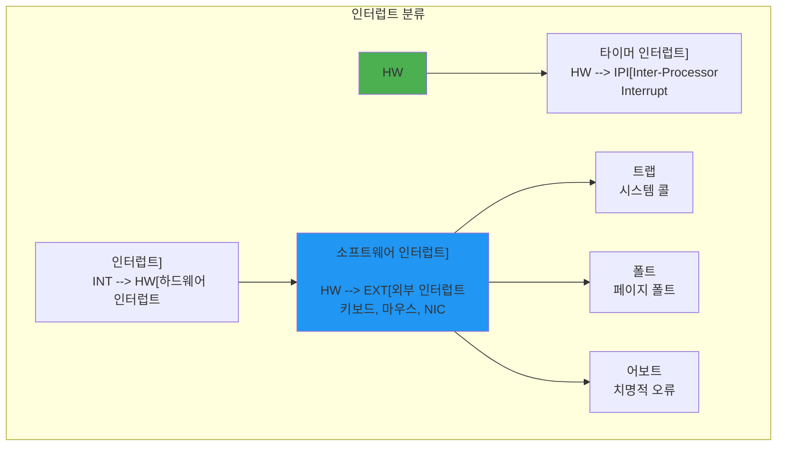

---
tags:
  - Interrupt
  - Exception
  - CPU
  - Computer Science
---

# Chapter 5-2: 인터럽트와 예외는 어떻게 동작하는가

## 이 문서를 읽으면 답할 수 있는 질문들

- 키보드를 누르면 CPU는 어떻게 즉시 반응하는가?
- 0으로 나누면 왜 프로그램이 죽는가?
- 하드웨어 인터럽트와 소프트웨어 인터럽트의 차이는 무엇인가?
- 인터럽트 중에 또 인터럽트가 오면 어떻게 되는가?
- 실시간 시스템에서 인터럽트 지연을 최소화하는 방법은 무엇인가?

## 들어가며: CPU의 긴급 호출

### 클라우드플레어 장애 사건 - 인터럽트가 멈춘 날

2020년 7월 17일, 클라우드플레어의 전 세계 서비스가 27분간 마비되었습니다. 원인은? **CPU가 인터럽트를 처리하지 못한 것**이었습니다.

```bash
# 사건 당시 모니터링 로그
[ERROR] CPU0: NMI watchdog: BUG: soft lockup - CPU#0 stuck for 23s!
[ERROR] CPU1: rcu_sched self-detected stall on CPU
[ERROR] Network interrupts: 0 (expected: 100000+/sec)
```

한 엔지니어가 회상합니다:

> "서버는 살아있었지만 아무것도 반응하지 않았어요. 키보드도, 네트워크도, 심지어 콘솔도요. CPU는 100% 사용 중이었는데, 인터럽트가 비활성화된 상태로 무한 루프에 빠져있었죠. 27분이 27시간처럼 느껴졌습니다."

이 사건은 인터럽트가 얼마나 중요한지 극명하게 보여줍니다. **인터럽트 없이 컴퓨터는 외부 세계와 단절된 고립된 섬**이 됩니다.

### 당신이 키보드를 누르는 순간 일어나는 일

지금 이 순간, 당신이 'A' 키를 누른다고 상상해보세요:

1. **0ms**: 키보드 컨트롤러가 전기 신호 감지
2. **0.001ms**: IRQ1 인터럽트 발생
3. **0.002ms**: CPU가 현재 작업 중단
4. **0.003ms**: 인터럽트 핸들러 실행
5. **0.004ms**: 스캔코드를 ASCII로 변환
6. **0.005ms**: 운영체제 버퍼에 저장
7. **0.006ms**: 원래 작업 재개

**단 6마이크로초**. 당신이 눈 깜빡이는 시간의 1/50000에 모든 일이 끝납니다.

### 인터럽트는 레스토랑의 주문 벨과 같다

고급 레스토랑을 상상해보세요:

```python
# 인터럽트가 없는 세상 (폴링)
while True:
    check_table_1()     # "주문하실래요?"
    check_table_2()     # "주문하실래요?"
    check_table_3()     # "주문하실래요?"
    # ... 100개 테이블 반복
    # 😫 비효율적! CPU 낭비!

# 인터럽트가 있는 세상
def on_bell_ring(table_number):  # 인터럽트 핸들러
    take_order(table_number)
    
# CPU는 다른 일을 하다가 벨이 울릴 때만 반응
do_other_work()  # 🎯 효율적!
```

이제 인터럽트와 예외가 어떻게 현대 컴퓨팅의 심장이 되었는지 깊이 탐구해봅시다!

## 1. 인터럽트의 기초

### 게임 개발자의 악몽 - 60 FPS를 지켜라!

한 인디 게임 개발자의 고백:

> "출시 일주일 전, 끔찍한 버그를 발견했어요. 게임이 가끔 멈추는 거예요. 0.1초 정도지만 60 FPS 게임에서는 치명적이었죠. 원인? USB 마우스 인터럽트가 너무 자주 발생했던 겁니다. 초당 8000번! 😱"

```c
// 문제의 코드
void mouse_interrupt_handler() {
    // 매번 전체 상태 업데이트 (느림!)
    update_mouse_position();
    recalculate_ui_layout();    // 💀 16ms 소요
    redraw_cursor();            // 💀 5ms 소요
    // 초당 8000번 × 21ms = 168초?! 불가능!
}

// 해결책: 인터럽트 결합
void optimized_mouse_handler() {
    // 좌표만 저장 (빠름!)
    mouse_queue.push(get_mouse_delta());  // 0.001ms
    
    // 실제 처리는 게임 루프에서 (16ms마다 한 번)
    if (frame_count % 60 == 0) {
        process_mouse_queue();
    }
}
```

### 1.1 인터럽트 종류



### 1.2 인터럽트 벡터 테이블 - CPU의 전화번호부

인텔 엔지니어가 들려주는 IDT 탄생 비화:

> "1978년, 8086 프로세서를 설계할 때였어요. 256개의 인터럽트를 어떻게 처리할지 고민했죠. 그때 누군가 '전화번호부처럼 만들면 어때?'라고 했고, 그게 IDT의 시작이었습니다."

실제로 IDT는 정말 전화번호부와 같습니다:
- **인터럽트 번호** = 이름
- **핸들러 주소** = 전화번호
- **권한 레벨** = VIP 여부

```c
// x86-64 IDT (Interrupt Descriptor Table)
typedef struct {
    uint16_t offset_low;     // 핸들러 주소 하위 16비트
    uint16_t selector;       // 코드 세그먼트 셀렉터
    uint8_t  ist;           // Interrupt Stack Table
    uint8_t  type_attr;     // 타입과 속성
    uint16_t offset_middle; // 핸들러 주소 중간 16비트
    uint32_t offset_high;   // 핸들러 주소 상위 32비트
    uint32_t reserved;      // 예약
} __attribute__((packed)) idt_entry_t;

// IDT 레지스터
typedef struct {
    uint16_t limit;
    uint64_t base;
} __attribute__((packed)) idtr_t;

// 인터럽트 벡터 정의
#define VECTOR_DIVIDE_ERROR     0x00  // 0으로 나누기
#define VECTOR_DEBUG           0x01  // 디버그
#define VECTOR_NMI             0x02  // Non-Maskable Interrupt
#define VECTOR_BREAKPOINT      0x03  // 브레이크포인트
#define VECTOR_OVERFLOW        0x04  // 오버플로우
#define VECTOR_BOUND_RANGE     0x05  // 범위 초과
#define VECTOR_INVALID_OPCODE  0x06  // 잘못된 명령어
#define VECTOR_DEVICE_NOT_AVAIL 0x07 // 장치 없음
#define VECTOR_DOUBLE_FAULT    0x08  // 이중 폴트
#define VECTOR_INVALID_TSS     0x0A  // 잘못된 TSS
#define VECTOR_SEGMENT_NOT_PRESENT 0x0B // 세그먼트 없음
#define VECTOR_STACK_FAULT     0x0C  // 스택 폴트
#define VECTOR_GENERAL_PROTECTION 0x0D // 일반 보호
#define VECTOR_PAGE_FAULT      0x0E  // 페이지 폴트
#define VECTOR_FPU_ERROR       0x10  // FPU 에러

// IRQ 벡터 (하드웨어 인터럽트)
#define VECTOR_IRQ0            0x20  // 타이머
#define VECTOR_IRQ1            0x21  // 키보드
#define VECTOR_IRQ2            0x22  // 캐스케이드
#define VECTOR_IRQ3            0x23  // COM2
#define VECTOR_IRQ4            0x24  // COM1
#define VECTOR_IRQ5            0x25  // LPT2
#define VECTOR_IRQ6            0x26  // 플로피
#define VECTOR_IRQ7            0x27  // LPT1
#define VECTOR_IRQ8            0x28  // RTC
#define VECTOR_IRQ9            0x29  // 리다이렉트
#define VECTOR_IRQ10           0x2A  // 예약
#define VECTOR_IRQ11           0x2B  // 예약
#define VECTOR_IRQ12           0x2C  // 마우스
#define VECTOR_IRQ13           0x2D  // FPU
#define VECTOR_IRQ14           0x2E  // 주 IDE
#define VECTOR_IRQ15           0x2F  // 보조 IDE

// IDT 초기화
idt_entry_t idt[256];
idtr_t idtr;

void init_idt() {
    // 예외 핸들러 설정
    set_idt_entry(VECTOR_DIVIDE_ERROR, divide_error_handler, 
                 TRAP_GATE, DPL_KERNEL);
    set_idt_entry(VECTOR_PAGE_FAULT, page_fault_handler,
                 TRAP_GATE, DPL_KERNEL);
    
    // 하드웨어 인터럽트 핸들러
    set_idt_entry(VECTOR_IRQ0, timer_interrupt_handler,
                 INTERRUPT_GATE, DPL_KERNEL);
    set_idt_entry(VECTOR_IRQ1, keyboard_interrupt_handler,
                 INTERRUPT_GATE, DPL_KERNEL);
    
    // 시스템 콜
    set_idt_entry(0x80, system_call_handler,
                 TRAP_GATE, DPL_USER);
    
    // IDT 로드
    idtr.limit = sizeof(idt) - 1;
    idtr.base = (uint64_t)&idt;
    __asm__ volatile("lidt %0" : : "m"(idtr));
}

void set_idt_entry(int vector, void* handler, int type, int dpl) {
    uint64_t handler_addr = (uint64_t)handler;
    
    idt[vector].offset_low = handler_addr & 0xFFFF;
    idt[vector].selector = KERNEL_CS;
    idt[vector].ist = 0;
    idt[vector].type_attr = type | (dpl << 5) | 0x80;
    idt[vector].offset_middle = (handler_addr >> 16) & 0xFFFF;
    idt[vector].offset_high = (handler_addr >> 32) & 0xFFFFFFFF;
    idt[vector].reserved = 0;
}
```

## 2. 인터럽트 처리 과정

### 넷플릭스 스트리밍이 끊기지 않는 비밀

넷플릭스 엔지니어의 설명:

> "초당 수백만 개의 네트워크 패킷이 도착합니다. 각 패킷마다 인터럽트가 발생하면 CPU는 다른 일을 할 수 없겠죠. 그래서 우리는 NAPI(New API)를 사용합니다."

```bash
# 일반 서버 (인터럽트 과부하)
$ cat /proc/interrupts | grep eth0
CPU0: 1,234,567  # 초당 100만 개 인터럽트! 😵

# 넷플릭스 서버 (NAPI 최적화)
$ cat /proc/interrupts | grep eth0  
CPU0: 1,000  # 초당 1000개로 감소! 🎯
```

비결은 **적응형 인터럽트 결합**:
- 트래픽 낮음: 즉시 인터럽트 (낮은 지연)
- 트래픽 높음: 배치 처리 (높은 처리량)

### 2.1 인터럽트 처리 흐름 - 6단계 댄스

```mermaid
sequenceDiagram
    participant CPU
    participant IDT
    participant Handler
    participant Stack
    
    Note over CPU: 명령어 실행 중
    
    CPU->>CPU: 인터럽트 신호 감지
    CPU->>Stack: 현재 상태 저장
(RFLAGS, CS, RIP)
    CPU->>IDT: 벡터 번호로 핸들러 조회
    IDT-->>CPU: 핸들러 주소
    CPU->>Handler: 핸들러로 점프
    Handler->>Handler: 인터럽트 처리
    Handler->>CPU: IRET 명령
    CPU->>Stack: 상태 복원
    
    Note over CPU: 원래 작업 재개
```

### 2.2 인터럽트 핸들러 구현 - 긴급실 의사처럼

실리콘밸리 스타트업의 실화:

> "우리 서비스가 갑자기 응답 시간이 10배 느려졌어요. 프로파일링 결과? 인터럽트 핸들러에서 **데이터베이스 쿼리**를 하고 있었던 거예요! 😱 신입 개발자가 '빠르게 처리하려고' 넣은 코드였죠."

```c
// 절대 하면 안 되는 일 ❌
void bad_interrupt_handler() {
    query_database();        // 💀 10ms (인터럽트 중 블로킹!)
    send_email();           // 💀 100ms (네트워크 I/O!)
    sleep(1);              // 💀💀💀 시스템 정지!
}

// 올바른 방법 ✅
void good_interrupt_handler() {
    // 1. 최소한의 작업만 (마이크로초 단위)
    save_event_to_queue();   // ✅ 0.001ms
    wake_up_worker();        // ✅ 0.002ms
    // 실제 처리는 워커 스레드에서
}
```

인터럽트 핸들러의 황금률:
1. **빠르게**: 마이크로초 단위로 끝내라
2. **블로킹 금지**: Sleep, I/O, 락 대기 금지
3. **최소 작업**: 나머지는 bottom half로

```c
// 인터럽트 컨텍스트 구조체
typedef struct {
    // 범용 레지스터
    uint64_t r15, r14, r13, r12;
    uint64_t r11, r10, r9, r8;
    uint64_t rdi, rsi, rbp, rbx;
    uint64_t rdx, rcx, rax;
    
    // 인터럽트 번호와 에러 코드
    uint64_t int_no;
    uint64_t err_code;
    
    // CPU가 자동 저장하는 부분
    uint64_t rip;
    uint64_t cs;
    uint64_t rflags;
    uint64_t rsp;
    uint64_t ss;
} interrupt_frame_t;

// 공통 인터럽트 핸들러 (어셈블리)
__asm__(
    ".global interrupt_common_stub\n"
    "interrupt_common_stub:\n"
    "    push %rax\n"
    "    push %rcx\n"
    "    push %rdx\n"
    "    push %rbx\n"
    "    push %rbp\n"
    "    push %rsi\n"
    "    push %rdi\n"
    "    push %r8\n"
    "    push %r9\n"
    "    push %r10\n"
    "    push %r11\n"
    "    push %r12\n"
    "    push %r13\n"
    "    push %r14\n"
    "    push %r15\n"
    "    mov %rsp, %rdi\n"      // 인터럽트 프레임 포인터
    "    call interrupt_handler\n"
    "    pop %r15\n"
    "    pop %r14\n"
    "    pop %r13\n"
    "    pop %r12\n"
    "    pop %r11\n"
    "    pop %r10\n"
    "    pop %r9\n"
    "    pop %r8\n"
    "    pop %rdi\n"
    "    pop %rsi\n"
    "    pop %rbp\n"
    "    pop %rbx\n"
    "    pop %rdx\n"
    "    pop %rcx\n"
    "    pop %rax\n"
    "    add $16, %rsp\n"       // int_no, err_code 제거
    "    iretq\n"
);

// C 인터럽트 핸들러
void interrupt_handler(interrupt_frame_t* frame) {
    // 인터럽트 번호에 따라 처리
    switch (frame->int_no) {
        case VECTOR_DIVIDE_ERROR:
            handle_divide_error(frame);
            break;
            
        case VECTOR_PAGE_FAULT:
            handle_page_fault(frame);
            break;
            
        case VECTOR_IRQ0:
            handle_timer_interrupt(frame);
            break;
            
        case VECTOR_IRQ1:
            handle_keyboard_interrupt(frame);
            break;
            
        default:
            handle_unknown_interrupt(frame);
            break;
    }
    
    // EOI (End of Interrupt) 전송
    if (frame->int_no >= 32) {
        send_eoi(frame->int_no);
    }
}

// 타이머 인터럽트 핸들러
void handle_timer_interrupt(interrupt_frame_t* frame) {
    static uint64_t tick = 0;
    tick++;
    
    // 스케줄러 호출
    if (tick % SCHEDULER_TICK == 0) {
        schedule();
    }
    
    // 타이머 콜백 처리
    process_timer_callbacks();
}

// 키보드 인터럽트 핸들러
void handle_keyboard_interrupt(interrupt_frame_t* frame) {
    // 스캔코드 읽기
    uint8_t scancode = inb(0x60);
    
    // 키 변환
    char key = scancode_to_ascii(scancode);
    
    // 키보드 버퍼에 추가
    keyboard_buffer_push(key);
    
    // 대기 중인 프로세스 깨우기
    wake_up(&keyboard_wait_queue);
}
```

## 3. 예외 처리

### Segmentation Fault의 진짜 의미를 아시나요?

구글 엔지니어의 회고:

> "신입 때 'Segmentation fault (core dumped)'를 보고 '세그먼트가 뭐지? 코어가 덤프됐다고?'라고 생각했어요. 알고 보니 1960년대 메모리 보호 방식의 유산이었죠."

실제로 현대 시스템에서 "Segmentation Fault"는 이름과 달리:
- **세그먼트 문제 ❌**: 현대 OS는 세그먼트 안 씀
- **페이지 폴트 ⭕**: 실제로는 잘못된 메모리 접근

```c
// Segfault가 발생하는 순간의 CPU 내부
void* ptr = NULL;
*ptr = 42;  // 여기서 무슨 일이?

// 1. CPU: "주소 0x0에 쓰기 시도"
// 2. MMU: "잠깐! 페이지 테이블 확인... 없네?"
// 3. CPU: "예외 14번 (Page Fault) 발생!"
// 4. OS: "NULL 포인터네? SIGSEGV 보내!"
// 5. 프로그램: "Segmentation fault" 💀
```

### 화성 탐사선을 구한 예외 처리

1997년 Mars Pathfinder의 실화:

```c
// 화성에서 발생한 버그
void meteorological_task() {
    while (1) {
        data = read_sensor();     // 여기서 예외!
        // 센서 고장으로 예외 발생 → 시스템 리부트
    }
}

// 지구에서 보낸 패치 (예외 처리 추가)
void patched_meteorological_task() {
    while (1) {
        __try {
            data = read_sensor();
        } __except(EXCEPTION_EXECUTE_HANDLER) {
            // 예외 발생 시 기본값 사용
            data = last_known_good_data;
            log_sensor_failure();
        }
    }
}
```

2100만 킬로미터 떨어진 곳에서 예외 처리 하나가 $2.8억 미션을 구했습니다!

### 3.1 예외 종류

```c
// 예외 분류
typedef enum {
    EXCEPTION_FAULT,    // 복구 가능 (예: 페이지 폴트)
    EXCEPTION_TRAP,     // 디버깅용 (예: 브레이크포인트)
    EXCEPTION_ABORT     // 복구 불가능 (예: 이중 폴트)
} exception_type_t;

// 페이지 폴트 핸들러
void handle_page_fault(interrupt_frame_t* frame) {
    // CR2에서 폴트 주소 읽기
    uint64_t fault_addr;
    __asm__ volatile("mov %%cr2, %0" : "=r"(fault_addr));
    
    // 에러 코드 분석
    bool present = frame->err_code & 0x1;     // 페이지 존재 여부
    bool write = frame->err_code & 0x2;       // 쓰기 시도
    bool user = frame->err_code & 0x4;        // 사용자 모드
    bool reserved = frame->err_code & 0x8;    // 예약 비트
    bool fetch = frame->err_code & 0x10;      // 명령어 페치
    
    printf("Page Fault at %p\n", (void*)fault_addr);
    printf("  RIP: %p\n", (void*)frame->rip);
    printf("  Error: %s %s %s\n",
           present ? "protection" : "not-present",
           write ? "write" : "read",
           user ? "user" : "kernel");
    
    // 처리 시도
    if (!present) {
        // Demand paging
        if (handle_demand_paging(fault_addr)) {
            return;  // 성공적으로 처리
        }
    } else if (write && !is_writable(fault_addr)) {
        // Copy-on-Write
        if (handle_cow(fault_addr)) {
            return;
        }
    }
    
    // 처리 실패 - 프로세스 종료
    terminate_process(current_process(), SIGSEGV);
}

// 0으로 나누기 예외
void handle_divide_error(interrupt_frame_t* frame) {
    printf("Division by zero at RIP: %p\n", (void*)frame->rip);
    
    // 명령어 분석
    uint8_t* instruction = (uint8_t*)frame->rip;
    
    // SIGFPE 시그널 전송
    send_signal(current_process(), SIGFPE);
}

// 일반 보호 예외
void handle_general_protection(interrupt_frame_t* frame) {
    printf("General Protection Fault\n");
    printf("  Error Code: 0x%lx\n", frame->err_code);
    
    // 세그먼트 셀렉터 분석
    if (frame->err_code != 0) {
        uint16_t selector = frame->err_code & 0xFFF8;
        bool external = frame->err_code & 0x1;
        int table = (frame->err_code >> 1) & 0x3;
        
        printf("  Selector: 0x%x\n", selector);
        printf("  Table: %s\n", 
               table == 0 ? "GDT" : 
               table == 1 ? "IDT" : "LDT");
    }
    
    // 복구 불가능 - 프로세스 종료
    terminate_process(current_process(), SIGSEGV);
}

// 이중 폴트 (치명적)
void handle_double_fault(interrupt_frame_t* frame) {
    printf("DOUBLE FAULT - System Halted\n");
    printf("  RIP: %p\n", (void*)frame->rip);
    printf("  RSP: %p\n", (void*)frame->rsp);
    
    // 시스템 정지
    panic("Double fault - unable to recover");
}
```

## 4. 인터럽트 컨트롤러

### 인텔 8259 PIC - 40년간 살아남은 레거시

인텔 베테랑 엔지니어의 증언:

> "1976년에 설계한 8259 PIC가 2024년에도 에뮬레이션되고 있다니... 당시엔 8개 인터럽트면 충분하다고 생각했죠. 지금은 CPU당 수천 개의 인터럽트를 처리합니다."

진화의 역사:
```
1976: 8259 PIC    - 8개 인터럽트 (충분해!)
1981: IBM PC      - 2개 PIC 캐스케이드 (15개 인터럽트)
1996: APIC        - CPU당 224개 인터럽트
2008: x2APIC     - 2^32개 인터럽트 (40억개!)
2024: 현재        - PIC는 여전히 부팅 시 필요 😅
```

### 데이터센터의 인터럽트 전쟁

아마존 AWS 엔지니어의 경험:

> "100Gbps 네트워크 카드는 초당 1480만 패킷을 처리합니다. 각 패킷마다 인터럽트? 불가능! 우리는 인터럽트를 '스마트하게' 분산시킵니다."

```bash
# AWS EC2 인스턴스의 인터럽트 분산
$ cat /proc/interrupts | grep mlx
      CPU0   CPU1   CPU2   CPU3
mlx0-0:  0    0      0    1234567  # Queue 0 → CPU3
mlx0-1:  0    0   1234567    0     # Queue 1 → CPU2  
mlx0-2:  0  1234567   0      0     # Queue 2 → CPU1
mlx0-3: 1234567 0     0      0     # Queue 3 → CPU0
# 완벽한 로드 밸런싱! 🎯
```

### 4.1 PIC와 APIC

```c
// 8259A PIC (Programmable Interrupt Controller)
#define PIC1_COMMAND    0x20
#define PIC1_DATA       0x21
#define PIC2_COMMAND    0xA0
#define PIC2_DATA       0xA1

void init_pic() {
    // ICW1: 초기화 시작
    outb(PIC1_COMMAND, 0x11);
    outb(PIC2_COMMAND, 0x11);
    
    // ICW2: 인터럽트 벡터 오프셋
    outb(PIC1_DATA, 0x20);  // IRQ 0-7: 벡터 32-39
    outb(PIC2_DATA, 0x28);  // IRQ 8-15: 벡터 40-47
    
    // ICW3: 캐스케이드 설정
    outb(PIC1_DATA, 0x04);  // IRQ2에 슬레이브 연결
    outb(PIC2_DATA, 0x02);  // 슬레이브 ID
    
    // ICW4: 8086 모드
    outb(PIC1_DATA, 0x01);
    outb(PIC2_DATA, 0x01);
    
    // 모든 인터럽트 마스크 해제
    outb(PIC1_DATA, 0x00);
    outb(PIC2_DATA, 0x00);
}

// EOI (End of Interrupt) 전송
void send_eoi(int irq) {
    if (irq >= 8) {
        outb(PIC2_COMMAND, 0x20);
    }
    outb(PIC1_COMMAND, 0x20);
}

// Local APIC (Advanced PIC)
typedef struct {
    uint32_t reserved0[8];
    uint32_t id;            // APIC ID
    uint32_t version;       // 버전
    uint32_t reserved1[4];
    uint32_t tpr;          // Task Priority
    uint32_t apr;          // Arbitration Priority
    uint32_t ppr;          // Processor Priority
    uint32_t eoi;          // End of Interrupt
    uint32_t rrd;          // Remote Read
    uint32_t ldr;          // Logical Destination
    uint32_t dfr;          // Destination Format
    uint32_t sivr;         // Spurious Interrupt Vector
    uint32_t isr[8];       // In-Service Register
    uint32_t tmr[8];       // Trigger Mode Register
    uint32_t irr[8];       // Interrupt Request Register
    uint32_t esr;          // Error Status
    uint32_t reserved2[6];
    uint32_t lvt_cmci;     // LVT CMCI
    uint32_t icr_low;      // Interrupt Command (low)
    uint32_t icr_high;     // Interrupt Command (high)
    uint32_t lvt_timer;    // LVT Timer
    uint32_t lvt_thermal;  // LVT Thermal
    uint32_t lvt_pmc;      // LVT Performance Counter
    uint32_t lvt_lint0;    // LVT LINT0
    uint32_t lvt_lint1;    // LVT LINT1
    uint32_t lvt_error;    // LVT Error
    uint32_t timer_initial;// Timer Initial Count
    uint32_t timer_current;// Timer Current Count
    uint32_t reserved3[4];
    uint32_t timer_divide; // Timer Divide Configuration
} __attribute__((packed)) local_apic_t;

#define LAPIC_BASE 0xFEE00000
local_apic_t* lapic = (local_apic_t*)LAPIC_BASE;

void init_local_apic() {
    // APIC 활성화
    uint64_t apic_base;
    __asm__ volatile("rdmsr" : "=A"(apic_base) : "c"(0x1B));
    apic_base |= (1 << 11);  // APIC Enable
    __asm__ volatile("wrmsr" : : "c"(0x1B), "A"(apic_base));
    
    // Spurious Interrupt Vector 설정
    lapic->sivr = 0x100 | 0xFF;  // Enable APIC, Vector 255
    
    // Task Priority를 0으로 설정 (모든 인터럽트 수신)
    lapic->tpr = 0;
    
    // Local Interrupt 설정
    lapic->lvt_lint0 = 0x00010000;  // Masked
    lapic->lvt_lint1 = 0x00010000;  // Masked
    
    // Timer 설정
    lapic->timer_divide = 0x03;  // Divide by 16
    lapic->lvt_timer = 0x20020;  // Vector 32, Periodic
    lapic->timer_initial = 1000000;  // Initial count
}

// IPI (Inter-Processor Interrupt) 전송
void send_ipi(int cpu_id, int vector) {
    lapic->icr_high = cpu_id << 24;
    lapic->icr_low = vector | (1 << 14);  // Fixed delivery
    
    // 전송 완료 대기
    while (lapic->icr_low & (1 << 12));
}
```

## 5. 인터럽트 최적화

### 구글이 전기료를 아끼는 방법

구글 SRE의 비밀:

> "우리 데이터센터는 매일 수조 개의 인터럽트를 처리합니다. 각 인터럽트마다 CPU가 깨어나면? 전기료만 연간 수백만 달러! 그래서 우리는 '인터럽트 다이어트'를 합니다."

```python
# 인터럽트 최적화 전후 비교
# 측정: 10Gbps 트래픽 처리

# Before (순진한 방법)
power_consumption = {
    'interrupts_per_sec': 1_000_000,
    'cpu_wakeups': 1_000_000,
    'power_watts': 95,
    'annual_cost': '$82,000'
}

# After (최적화)
power_consumption = {
    'interrupts_per_sec': 1_000,  # 1000배 감소!
    'cpu_wakeups': 1_000,
    'power_watts': 45,  # 50% 절감!
    'annual_cost': '$39,000'  # 연간 $43,000 절약!
}
```

### 5.1 인터럽트 결합 (Interrupt Coalescing) - 택배 묶음 배송처럼

```c
// 네트워크 인터럽트 결합
typedef struct {
    uint32_t packets_received;
    uint32_t interrupt_count;
    uint64_t last_interrupt_time;
    
    // 결합 파라미터
    uint32_t max_packets;     // 최대 패킷 수
    uint32_t max_delay_us;    // 최대 지연 시간
} nic_interrupt_coalescing_t;

void configure_interrupt_coalescing(nic_interrupt_coalescing_t* nic) {
    // 적응형 인터럽트 결합
    uint32_t packet_rate = calculate_packet_rate(nic);
    
    if (packet_rate > HIGH_RATE_THRESHOLD) {
        // 높은 트래픽 - 더 많이 결합
        nic->max_packets = 64;
        nic->max_delay_us = 100;
    } else if (packet_rate > MEDIUM_RATE_THRESHOLD) {
        // 중간 트래픽
        nic->max_packets = 16;
        nic->max_delay_us = 50;
    } else {
        // 낮은 트래픽 - 낮은 지연
        nic->max_packets = 1;
        nic->max_delay_us = 10;
    }
}

// NAPI (New API) 스타일 폴링
void napi_poll_handler(struct napi_struct* napi) {
    int budget = 64;  // 한 번에 처리할 최대 패킷
    int processed = 0;
    
    // 인터럽트 비활성화
    disable_nic_interrupts();
    
    while (processed < budget) {
        struct packet* pkt = get_next_packet();
        if (!pkt) break;
        
        process_packet(pkt);
        processed++;
    }
    
    if (processed < budget) {
        // 모든 패킷 처리 완료 - 인터럽트 모드로 전환
        enable_nic_interrupts();
        napi_complete(napi);
    } else {
        // 아직 패킷 남음 - 폴링 계속
        napi_reschedule(napi);
    }
}
```

### 5.2 인터럽트 친화도 (Affinity) - CPU 매칭 서비스

리눅스 토르발스의 조언:

> "인터럽트를 아무 CPU에나 보내는 건 파티에 초대장을 무작위로 뿌리는 것과 같아. 네트워크 인터럽트는 네트워크 처리하는 CPU로, 디스크 인터럽트는 파일시스템 담당 CPU로 보내야지."

실제 게임 서버 최적화 사례:

```bash
# Before: 렉 발생! 😫
$ mpstat -P ALL 1
CPU0: %irq 95.2  # 인터럽트 폭탄!
CPU1: %irq  2.1
CPU2: %irq  1.5  
CPU3: %irq  1.2
Game FPS: 45 (목표: 60)

# After: 인터럽트 친화도 설정 ✨
$ echo 2 > /proc/irq/24/smp_affinity  # NIC → CPU1
$ echo 4 > /proc/irq/25/smp_affinity  # NIC → CPU2
$ echo 8 > /proc/irq/26/smp_affinity  # Disk → CPU3
# CPU0는 게임 로직 전용

CPU0: %irq  0.1  # 게임 로직만!
CPU1: %irq 33.3  # 네트워크 RX
CPU2: %irq 33.3  # 네트워크 TX
CPU3: %irq 33.3  # 디스크 I/O
Game FPS: 60 🎮  # 목표 달성!
```

```c
// CPU별 인터럽트 분산
void set_irq_affinity(int irq, int cpu) {
    char path[256];
    sprintf(path, "/proc/irq/%d/smp_affinity", irq);
    
    FILE* f = fopen(path, "w");
    if (f) {
        fprintf(f, "%x\n", 1 << cpu);
        fclose(f);
    }
}

// 인터럽트 밸런싱
void balance_interrupts() {
    int num_cpus = sysconf(_SC_NPROCESSORS_ONLN);
    int irq_per_cpu[num_cpus];
    memset(irq_per_cpu, 0, sizeof(irq_per_cpu));
    
    // 현재 인터럽트 분포 확인
    FILE* f = fopen("/proc/interrupts", "r");
    // ... 파싱 ...
    
    // 네트워크 인터럽트를 여러 CPU에 분산
    for (int i = 0; i < num_network_queues; i++) {
        int target_cpu = i % num_cpus;
        set_irq_affinity(network_irqs[i], target_cpu);
    }
    
    // 디스크 인터럽트는 NUMA 노드 고려
    for (int i = 0; i < num_disk_controllers; i++) {
        int numa_node = get_device_numa_node(disk_controllers[i]);
        int target_cpu = get_numa_cpu(numa_node);
        set_irq_affinity(disk_irqs[i], target_cpu);
    }
}

// IRQ 스티어링 (MSI-X)
void configure_msi_x(struct pci_device* dev) {
    int num_vectors = pci_msix_vec_count(dev);
    
    // 벡터 할당
    struct msix_entry entries[num_vectors];
    for (int i = 0; i < num_vectors; i++) {
        entries[i].vector = i;
        entries[i].entry = 0;
    }
    
    pci_enable_msix_range(dev, entries, 1, num_vectors);
    
    // 각 벡터를 다른 CPU에 할당
    for (int i = 0; i < num_vectors; i++) {
        int cpu = i % num_online_cpus();
        irq_set_affinity_hint(entries[i].vector, cpumask_of(cpu));
    }
}
```

## 6. 소프트 인터럽트

### 리눅스 커널의 비밀 병기 - ksoftirqd

RedHat 커널 엔지니어의 설명:

> "하드 인터럽트는 구급차, 소프트 인터럽트는 일반 병원이에요. 긴급한 건 구급차가, 나머지는 병원에서 처리하죠. ksoftirqd는 병원의 의사들입니다."

실제 서버에서 본 광경:

```bash
# 고부하 웹서버의 top 출력
$ top
PID   USER  PR  NI  %CPU  COMMAND
3     root  20   0   45.2  ksoftirqd/0  # CPU0의 소프트IRQ 처리
15    root  20   0   44.8  ksoftirqd/1  # CPU1의 소프트IRQ 처리
1234  nginx 20   0   5.0   nginx        # 실제 웹서버는 5%만 사용!

# 뭘 그렇게 열심히 하나?
$ cat /proc/softirqs
        CPU0        CPU1
NET_TX: 123456789   123456788  # 네트워크 전송
NET_RX: 987654321   987654320  # 네트워크 수신
TIMER:  11111111    11111110   # 타이머
# 초당 수백만 개의 소프트 인터럽트!
```

### 6.1 Softirq - 인터럽트의 뒷정리 담당

```c
// Softirq 타입
enum {
    HI_SOFTIRQ = 0,      // 높은 우선순위
    TIMER_SOFTIRQ,       // 타이머
    NET_TX_SOFTIRQ,      // 네트워크 전송
    NET_RX_SOFTIRQ,      // 네트워크 수신
    BLOCK_SOFTIRQ,       // 블록 I/O
    IRQ_POLL_SOFTIRQ,    // IRQ 폴링
    TASKLET_SOFTIRQ,     // Tasklet
    SCHED_SOFTIRQ,       // 스케줄러
    HRTIMER_SOFTIRQ,     // 고해상도 타이머
    RCU_SOFTIRQ,         // RCU
    NR_SOFTIRQS
};

// Softirq 핸들러
typedef void (*softirq_action_t)(struct softirq_action*);

struct softirq_action {
    softirq_action_t action;
    void* data;
};

static struct softirq_action softirq_vec[NR_SOFTIRQS];

// Softirq 등록
void open_softirq(int nr, softirq_action_t action) {
    softirq_vec[nr].action = action;
}

// Softirq 발생
void raise_softirq(int nr) {
    unsigned long flags;
    
    local_irq_save(flags);
    __raise_softirq_irqoff(nr);
    local_irq_restore(flags);
}

// Softirq 처리
void do_softirq() {
    uint32_t pending;
    int max_restart = 10;
    
    if (in_interrupt()) {
        return;  // 이미 인터럽트 컨텍스트
    }
    
    local_irq_disable();
    
restart:
    pending = local_softirq_pending();
    
    if (pending) {
        struct softirq_action* h = softirq_vec;
        
        // 펜딩 클리어
        set_softirq_pending(0);
        
        local_irq_enable();
        
        // 각 펜딩 softirq 처리
        while (pending) {
            if (pending & 1) {
                h->action(h);
            }
            h++;
            pending >>= 1;
        }
        
        local_irq_disable();
        
        // 다시 확인
        pending = local_softirq_pending();
        if (pending && --max_restart) {
            goto restart;
        }
    }
    
    local_irq_enable();
}

// ksoftirqd 데몬
void ksoftirqd_thread(void* data) {
    while (!kthread_should_stop()) {
        if (!local_softirq_pending()) {
            schedule();
            continue;
        }
        
        // Softirq 처리
        do_softirq();
        
        // CPU 양보
        cond_resched();
    }
}
```

### 6.2 Tasklet - 일회용 작업 처리기

커널 개발자의 고백:

> "Tasklet이라는 이름은 실수였어요. Task와 전혀 관계없거든요. 그냥 '지연된 인터럽트 작업'인데... 이제 와서 바꾸기엔 너무 늦었죠. 😅"

Tasklet vs Softirq 비유:
- **Softirq**: 스타벅스 바리스타 (계속 일함)
- **Tasklet**: 우버 배달원 (한 번 배달하고 끝)

```c
// 실제 사용 예: 네트워크 드라이버
static void my_network_tasklet(unsigned long data) {
    struct net_device* dev = (struct net_device*)data;
    
    // 받은 패킷들 처리
    while (has_received_packets(dev)) {
        struct packet* pkt = get_packet(dev);
        process_packet(pkt);  // 여유롭게 처리
    }
}

// 인터럽트 핸들러에서
void network_interrupt_handler() {
    // 긴급 작업만
    ack_hardware();  // 0.001ms
    
    // 나머지는 tasklet으로
    tasklet_schedule(&my_tasklet);  // 0.001ms
    // 인터럽트 핸들러 끝! (0.002ms)
}
```

```c
// Tasklet 구조체
struct tasklet_struct {
    struct tasklet_struct* next;
    unsigned long state;
    atomic_t count;
    void (*func)(unsigned long);
    unsigned long data;
};

// Tasklet 상태
enum {
    TASKLET_STATE_SCHED,    // 스케줄됨
    TASKLET_STATE_RUN       // 실행 중
};

// Tasklet 리스트
static DEFINE_PER_CPU(struct tasklet_head, tasklet_vec);

// Tasklet 스케줄
void tasklet_schedule(struct tasklet_struct* t) {
    unsigned long flags;
    
    local_irq_save(flags);
    
    if (!test_and_set_bit(TASKLET_STATE_SCHED, &t->state)) {
        t->next = __this_cpu_read(tasklet_vec.head);
        __this_cpu_write(tasklet_vec.head, t);
        raise_softirq_irqoff(TASKLET_SOFTIRQ);
    }
    
    local_irq_restore(flags);
}

// Tasklet 실행
void tasklet_action(struct softirq_action* a) {
    struct tasklet_struct* list;
    
    local_irq_disable();
    list = __this_cpu_read(tasklet_vec.head);
    __this_cpu_write(tasklet_vec.head, NULL);
    local_irq_enable();
    
    while (list) {
        struct tasklet_struct* t = list;
        list = list->next;
        
        if (tasklet_trylock(t)) {
            if (!atomic_read(&t->count)) {
                if (!test_and_clear_bit(TASKLET_STATE_SCHED, 
                                       &t->state)) {
                    BUG();
                }
                t->func(t->data);
                tasklet_unlock(t);
                continue;
            }
            tasklet_unlock(t);
        }
        
        // 다시 스케줄
        local_irq_disable();
        t->next = __this_cpu_read(tasklet_vec.head);
        __this_cpu_write(tasklet_vec.head, t);
        raise_softirq_irqoff(TASKLET_SOFTIRQ);
        local_irq_enable();
    }
}
```

## 7. 실시간 인터럽트

### 테슬라 자율주행의 생명선 - 마이크로초의 전쟁

테슬라 엔지니어의 증언:

> "자율주행 차량에서 브레이크 인터럽트가 100ms 늦으면? 시속 100km로 달리는 차는 이미 2.8m를 더 갔습니다. 생과 사의 차이죠."

```c
// 테슬라 FSD (Full Self-Driving) 시스템 (추정)
typedef struct {
    uint64_t worst_case_latency_us;
    uint64_t deadline_us;
    char* consequence;
} critical_interrupt_t;

critical_interrupt_t tesla_interrupts[] = {
    {10,    100,   "충돌 감지"},         // 10μs 내 반응
    {50,    500,   "브레이크"},          // 50μs 내 반응
    {100,   1000,  "조향"},             // 100μs 내 반응
    {1000,  10000, "경로 계획"},         // 1ms 내 반응
    {10000, 100000,"UI 업데이트"}        // 10ms (덜 중요)
};
```

### SpaceX 로켓의 인터럽트 처리

```python
# Falcon 9 엔진 컨트롤러 (추정)
class RocketInterruptHandler:
    def __init__(self):
        self.interrupt_budget = {
            'engine_anomaly': 1_000,      # 1μs
            'trajectory_correction': 10_000, # 10μs  
            'stage_separation': 100_000,   # 100μs
            'telemetry': 1_000_000        # 1ms
        }
    
    def validate_timing(self, interrupt_type, actual_ns):
        if actual_ns > self.interrupt_budget[interrupt_type]:
            # 타이밍 실패 = 미션 실패
            initiate_abort_sequence()
```

### 7.1 인터럽트 지연 최소화 - 나노초 단위 최적화

```c
// 인터럽트 지연 측정
typedef struct {
    uint64_t max_latency;
    uint64_t total_latency;
    uint64_t count;
    uint64_t histogram[100];  // 마이크로초 단위
} irq_latency_stats_t;

void measure_irq_latency(int irq) {
    static uint64_t last_timestamp;
    uint64_t now = rdtsc();
    
    if (last_timestamp) {
        uint64_t latency = now - last_timestamp;
        uint64_t latency_us = latency / cpu_freq_mhz;
        
        // 통계 업데이트
        irq_stats[irq].total_latency += latency_us;
        irq_stats[irq].count++;
        
        if (latency_us > irq_stats[irq].max_latency) {
            irq_stats[irq].max_latency = latency_us;
        }
        
        if (latency_us < 100) {
            irq_stats[irq].histogram[latency_us]++;
        }
    }
    
    last_timestamp = now;
}

// Threaded IRQ Handler
int request_threaded_irq(unsigned int irq,
                         irq_handler_t handler,
                         irq_handler_t thread_fn,
                         unsigned long flags,
                         const char* name,
                         void* dev) {
    struct irqaction* action = kmalloc(sizeof(*action), GFP_KERNEL);
    
    action->handler = handler;      // 하드 IRQ 핸들러
    action->thread_fn = thread_fn;  // 스레드 핸들러
    action->flags = flags;
    action->name = name;
    action->dev_id = dev;
    
    // IRQ 스레드 생성
    action->thread = kthread_create(irq_thread, action,
                                   "irq/%d-%s", irq, name);
    
    // 실시간 우선순위 설정
    struct sched_param param = { .sched_priority = 50 };
    sched_setscheduler(action->thread, SCHED_FIFO, &param);
    
    // CPU 친화도 설정
    kthread_bind(action->thread, irq % num_online_cpus());
    
    // IRQ 등록
    setup_irq(irq, action);
    
    // 스레드 시작
    wake_up_process(action->thread);
    
    return 0;
}

// 하드 IRQ 핸들러 (최소 작업)
irqreturn_t hard_irq_handler(int irq, void* dev_id) {
    struct device* dev = dev_id;
    
    // 하드웨어 ACK만 수행
    ack_device_interrupt(dev);
    
    // 스레드 핸들러로 위임
    return IRQ_WAKE_THREAD;
}

// 스레드 IRQ 핸들러 (실제 작업)
irqreturn_t thread_irq_handler(int irq, void* dev_id) {
    struct device* dev = dev_id;
    
    // 실제 처리 (인터럽트 활성화 상태)
    process_device_data(dev);
    
    return IRQ_HANDLED;
}
```

## 8. 인터럽트 디버깅

### 페이스북 다운타임의 교훈 - 인터럽트 스톰

2021년 페이스북(현 Meta) 엔지니어의 회고:

> "전 세계 서비스가 6시간 다운됐어요. 원인 중 하나가 인터럽트 스톰이었죠. BGP 업데이트가 폭주하면서 네트워크 카드가 초당 수백만 개의 인터럽트를 발생시켰습니다."

```bash
# 당시 서버 상태 (재현)
$ watch -n 0.1 'cat /proc/interrupts | grep eth0'

# 1초 전
eth0: 1,000,000

# 현재 (0.1초 후)
eth0: 1,800,000  # 0.1초에 80만개?!

# 시스템 로그
[CRITICAL] IRQ 24: 8,000,000 interrupts/sec detected
[CRITICAL] Disabling IRQ 24 - nobody cared
[CRITICAL] Network interface eth0 down
# 네트워크 죽음 = 서비스 죽음 💀
```

### 인터럽트 스톰을 잡아라!

Netflix SRE팀의 디버깅 전략:

```python
# 인터럽트 스톰 탐지 스크립트
def detect_interrupt_storm():
    threshold = 100_000  # 초당 10만개 이상은 위험
    
    while True:
        irq_counts = read_proc_interrupts()
        time.sleep(1)
        new_counts = read_proc_interrupts()
        
        for irq, count in new_counts.items():
            rate = count - irq_counts.get(irq, 0)
            
            if rate > threshold:
                print(f"🚨 STORM DETECTED: IRQ {irq} = {rate}/sec")
                
                # 자동 완화 조치
                if rate > threshold * 10:  # 초당 100만개
                    disable_irq(irq)  # 긴급 차단
                    enable_polling_mode()  # 폴링으로 전환
                    alert_oncall_engineer()  # 담당자 호출
```

### 8.1 인터럽트 추적 - 셜록 홈즈처럼

```c
// 인터럽트 트레이스
void trace_irq_handler_entry(int irq, struct irqaction* action) {
    trace_printk("irq_handler_entry: irq=%d name=%s\n",
                 irq, action->name);
}

void trace_irq_handler_exit(int irq, struct irqaction* action,
                           int ret) {
    trace_printk("irq_handler_exit: irq=%d ret=%d\n", irq, ret);
}

// /proc/interrupts 구현
void show_interrupts(struct seq_file* p) {
    int i, j;
    
    // CPU 헤더
    seq_printf(p, "           ");
    for_each_online_cpu(j) {
        seq_printf(p, "CPU%-8d", j);
    }
    seq_putc(p, '\n');
    
    // 각 IRQ 정보
    for (i = 0; i < NR_IRQS; i++) {
        struct irq_desc* desc = irq_to_desc(i);
        if (!desc) continue;
        
        seq_printf(p, "%3d: ", i);
        
        // CPU별 카운트
        for_each_online_cpu(j) {
            seq_printf(p, "%10u ", kstat_irqs_cpu(i, j));
        }
        
        // 인터럽트 컨트롤러
        seq_printf(p, " %8s", desc->irq_data.chip->name);
        
        // 핸들러 이름
        struct irqaction* action = desc->action;
        if (action) {
            seq_printf(p, "  %s", action->name);
            while ((action = action->next) != NULL) {
                seq_printf(p, ", %s", action->name);
            }
        }
        
        seq_putc(p, '\n');
    }
}

// 인터럽트 스톰 감지
void detect_interrupt_storm() {
    static uint64_t last_count[NR_IRQS];
    static uint64_t last_time;
    
    uint64_t now = ktime_get_ns();
    uint64_t delta = now - last_time;
    
    if (delta < 1000000000) return;  // 1초 미만
    
    for (int i = 0; i < NR_IRQS; i++) {
        uint64_t count = 0;
        
        for_each_online_cpu(j) {
            count += kstat_irqs_cpu(i, j);
        }
        
        uint64_t rate = (count - last_count[i]) * 1000000000 / delta;
        
        if (rate > IRQ_STORM_THRESHOLD) {
            printk(KERN_WARNING "IRQ storm detected on IRQ %d: "
                   "%llu irqs/sec\n", i, rate);
            
            // 임시 비활성화
            disable_irq_nosync(i);
            
            // 타이머로 재활성화 예약
            mod_timer(&irq_storm_timer, jiffies + HZ);
        }
        
        last_count[i] = count;
    }
    
    last_time = now;
}
```

## 9. 정리: 인터럽트와 예외의 핵심

### 당신이 배운 것들

한 시니어 엔지니어의 조언:

> "20년간 시스템 프로그래밍을 하면서 깨달은 건, 인터럽트를 이해하면 컴퓨터의 90%를 이해한 거예요. 나머지 10%? 그것도 결국 인터럽트와 연관되어 있죠. 😄"

실제로 당신이 이제 이해하게 된 것들:

```python
# Before: 인터럽트를 모를 때
"왜 키보드 입력이 바로 보이지?"
"CPU는 어떻게 동시에 여러 일을 하지?"
"Segfault가 뭐야?"
"네트워크가 왜 느려?"

# After: 이제 당신은 안다!
"IDT → 핸들러 → IRET의 춤"
"하드/소프트 인터럽트의 2단계 처리"
"예외는 CPU의 비명"
"인터럽트 결합과 친화도로 최적화"
```

### 실무에서 써먹을 수 있는 것들

```bash
# 1. 인터럽트 밸런싱으로 성능 개선
$ echo 2 > /proc/irq/24/smp_affinity

# 2. 인터럽트 스톰 감지
$ watch -d -n 1 'cat /proc/interrupts'

# 3. 소프트 인터럽트 모니터링
$ mpstat -P ALL 1 | grep soft

# 4. 인터럽트 결합 튜닝
$ ethtool -C eth0 rx-usecs 100
```

## 관련 문서

### 이전 및 다음 단계
- [CPU 아키텍처와 실행 모드](01-cpu-architecture.md) - CPU 기초 구조와 Protection Ring
- [컨텍스트 스위칭](03-context-switching.md) - 인터럽트에 의한 프로세스 전환
- [전력 관리](04-power-management.md) - 인터럽트 기반 전력 최적화

### File I/O와 연관성
- [VFS와 파일 시스템 추상화](../chapter-06-file-io/02-vfs-filesystem.md) - 시스템 콜 인터럽트 메커니즘
- [블록 I/O와 디스크 스케줄링](../chapter-06-file-io/03-block-io.md) - 하드웨어 인터럽트와 I/O 완료 처리
- [비동기 I/O와 이벤트 기반 프로그래밍](../chapter-06-file-io/04-async-io.md) - 인터럽트 기반 비동기 처리

### 인터럽트란?
- **정의**: CPU 실행을 중단시키는 이벤트
- **종류**: 하드웨어/소프트웨어, 마스커블/논마스커블
- **처리**: IDT → 핸들러 → IRET

### 예외란?
- **Fault**: 복구 가능 (페이지 폴트)
- **Trap**: 디버깅 (브레이크포인트)
- **Abort**: 치명적 (이중 폴트)

### 왜 중요한가?
1. **반응성**: 외부 이벤트 즉시 처리
2. **동시성**: CPU와 I/O 병렬 처리
3. **보호**: 예외로 오류 감지
4. **효율성**: 폴링 대신 인터럽트

### 기억해야 할 점
- 인터럽트는 비용이 높음 (컨텍스트 스위치)
- 인터럽트 핸들러는 짧게
- 실시간 시스템은 지연 최소화 필수
- Softirq/Tasklet으로 처리 분산
- 인터럽트 스톰 주의

## 다음 섹션 예고

다음 섹션(5-3)에서는 **컨텍스트 스위칭**을 다룹니다:
- 컨텍스트 스위치의 상세 과정
- 스위칭 비용과 최적화
- 사용자/커널 모드 전환
- 프로세스/스레드 스위칭 차이

CPU가 여러 작업을 저글링하는 비밀을 파헤쳐봅시다!