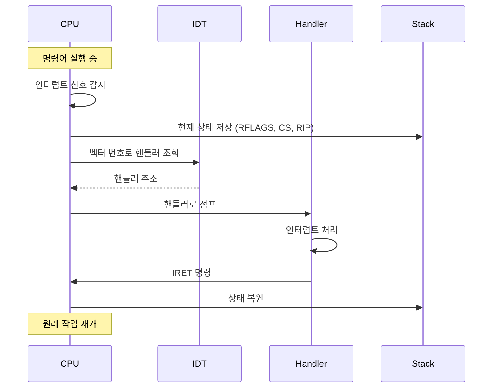

---
tags:
  - Interrupt
  - Exception
  - CPU
  - Computer Science
  - Processing
---

# Chapter 5-2B: 인터럽트 처리 과정과 예외 처리

## 2. 인터럽트 처리 과정

### 넷플릭스 스트리밍이 끔기지 않는 비밀

넷플릭스 엔지니어의 설명:

> "초당 수백만 개의 네트워크 패킷이 도착합니다. 각 패킷마다 인터럽트가 발생하면 CPU는 다른 일을 할 수 없겠죠. 그래서 우리는 NAPI(New API)를 사용합니다."

```bash
# 일반 서버 (인터럽트 과부하)
$ cat /proc/interrupts | grep eth0
CPU0: 1,234,567  # 초당 100만 개 인터럽트! 😵

# 넷플릭스 서버 (NAPI 최적화)
$ cat /proc/interrupts | grep eth0  
CPU0: 1,000  # 초당 1000개로 감소! 🎯
```

비결은 **적응형 인터럽트 결합**:

- 트래픽 낮음: 즉시 인터럽트 (낮은 지연)
- 트래픽 높음: 배치 처리 (높은 처리량)

### 2.1 인터럽트 처리 흐름 - 6단계 댄스



### 2.2 인터럽트 핸들러 구현 - 긴급실 의사처럼

실리콘밸리 스타트업의 실화:

> "우리 서비스가 갑자기 응답 시간이 10배 느려졌어요. 프로파일링 결과? 인터럽트 핸들러에서 **데이터베이스 쿼리**를 하고 있었던 거예요! 😱 신입 개발자가 '빠르게 처리하려고' 넣은 코드였죠."

```c
// 절대 하면 안 되는 일 ❌
void bad_interrupt_handler() {
    query_database();        // 💀 10ms (인터럽트 중 블로킹!)
    send_email();           // 💀 100ms (네트워크 I/O!)
    sleep(1);              // 💀💀💀 시스템 정지!
}

// 올바른 방법 ✅
void good_interrupt_handler() {
    // 1. 최소한의 작업만 (마이크로초 단위)
    save_event_to_queue();   // ✅ 0.001ms
    wake_up_worker();        // ✅ 0.002ms
    // 실제 처리는 워커 스레드에서
}
```

인터럽트 핸들러의 황금률:

1. **빠르게**: 마이크로초 단위로 끝내라
2. **블로킹 금지**: Sleep, I/O, 락 대기 금지
3. **최소 작업**: 나머지는 bottom half로

```c
// 인터럽트 컨텍스트 구조체
typedef struct {
    // 범용 레지스터
    uint64_t r15, r14, r13, r12;
    uint64_t r11, r10, r9, r8;
    uint64_t rdi, rsi, rbp, rbx;
    uint64_t rdx, rcx, rax;
    
    // 인터럽트 번호와 에러 코드
    uint64_t int_no;
    uint64_t err_code;
    
    // CPU가 자동 저장하는 부분
    uint64_t rip;
    uint64_t cs;
    uint64_t rflags;
    uint64_t rsp;
    uint64_t ss;
} interrupt_frame_t;

// 공통 인터럽트 핸들러 (어셈블리) - 모든 인터럽트의 진입점
// 이 코드가 없으면 인터럽트 발생시 시스템이 크래시!
__asm__(
    ".global interrupt_common_stub \n"      // 전역 심볼 선언 (링커가 찾을 수 있도록)
    "interrupt_common_stub: \n"
    
    // === 1단계: 레지스터 상태 완전 보존 ===
    // 사용자 프로그램이 실행 중이던 모든 상태를 스택에 저장
    // 이걸 안하면 인터럽트 처리 후 프로그램이 망가짐!
    "    pushq %rax \n"          // 누산기 레지스터 (함수 리턴값)
    "    pushq %rcx \n"          // 카운터 레지스터 (루프 변수 등)
    "    pushq %rdx \n"          // 데이터 레지스터 (입출력, 곱셈 결과)
    "    pushq %rbx \n"          // 베이스 레지스터 (배열 인덱스)
    "    pushq %rbp \n"          // 베이스 포인터 (스택 프레임)
    "    pushq %rsi \n"          // 소스 인덱스 (문자열 복사 등)
    "    pushq %rdi \n"          // 목적지 인덱스 (첫 번째 함수 인자)
    "    pushq %r8 \n"           // 64비트 모드 확장 레지스터들
    "    pushq %r9 \n"           // (r8-r15는 x86-64에서만 존재)
    "    pushq %r10 \n"
    "    pushq %r11 \n"
    "    pushq %r12 \n"
    "    pushq %r13 \n"
    "    pushq %r14 \n"
    "    pushq %r15 \n"
    
    // === 2단계: C 핸들러 호출 ===
    // 현재 스택 포인터를 함수 인자로 전달
    // System V ABI: 첫 번째 인자는 %rdi에 저장
    "    movq %rsp, %rdi \n"     // 인터럽트 프레임 구조체 포인터를 rdi에
    "    call interrupt_handler \n"  // C로 작성된 실제 처리 루틴 호출
                                 // 이때 스택은: [r15][r14]...[rax][frame]
    
    // === 3단계: 레지스터 상태 완전 복원 ===
    // LIFO 순서로 정확히 되돌려야 함 (push와 반대 순서!)
    // 하나라도 빠뜨리면 프로그램이 이상하게 동작
    "    popq %r15 \n"
    "    popq %r14 \n"
    "    popq %r13 \n"
    "    popq %r12 \n"
    "    popq %r11 \n"
    "    popq %r10 \n"
    "    popq %r9 \n"
    "    popq %r8 \n"
    "    popq %rdi \n"
    "    popq %rsi \n"
    "    popq %rbp \n"
    "    popq %rbx \n"
    "    popq %rdx \n"
    "    popq %rcx \n"
    "    popq %rax \n"
    
    // === 4단계: 인터럽트 프레임 정리 ===
    // 우리가 추가한 int_no와 err_code를 스택에서 제거
    "    addq $16, %rsp \n"      // 8바이트 × 2 = 16바이트 제거
                             // 이제 스택에는 CPU가 저장한 프레임만 남음
    
    // === 5단계: 원래 프로그램으로 복귀 ===
    // IRET: Interrupt Return - 특별한 복귀 명령어
    // CPU가 자동으로 저장한 RIP, CS, RFLAGS, RSP, SS를 복원
    "    iretq \n"               // 64비트 모드의 인터럽트 리턴
                             // 마법 같은 이 명령어로 시간이 되돌아간다!
);

// C 인터럽트 핸들러
void interrupt_handler(interrupt_frame_t* frame) {
    // 인터럽트 번호에 따라 처리
    switch (frame->int_no) {
        case VECTOR_DIVIDE_ERROR:
            handle_divide_error(frame);
            break;
            
        case VECTOR_PAGE_FAULT:
            handle_page_fault(frame);
            break;
            
        case VECTOR_IRQ0:
            handle_timer_interrupt(frame);
            break;
            
        case VECTOR_IRQ1:
            handle_keyboard_interrupt(frame);
            break;
            
        default:
            handle_unknown_interrupt(frame);
            break;
    }
    
    // EOI (End of Interrupt) 전송
    if (frame->int_no >= 32) {
        send_eoi(frame->int_no);
    }
}

// 타이머 인터럽트 핸들러
void handle_timer_interrupt(interrupt_frame_t* frame) {
    static uint64_t tick = 0;
    tick++;
    
    // 스케줄러 호출
    if (tick % SCHEDULER_TICK == 0) {
        schedule();
    }
    
    // 타이머 콜백 처리
    process_timer_callbacks();
}

// 키보드 인터럽트 핸들러
void handle_keyboard_interrupt(interrupt_frame_t* frame) {
    // 스캔코드 읽기
    uint8_t scancode = inb(0x60);
    
    // 키 변환
    char key = scancode_to_ascii(scancode);
    
    // 키보드 버퍼에 추가
    keyboard_buffer_push(key);
    
    // 대기 중인 프로세스 깨우기
    wake_up(&keyboard_wait_queue);
}
```

## 3. 예외 처리

### Segmentation Fault의 진짜 의미를 아시나요?

구글 엔지니어의 회고:

> "신입 때 'Segmentation fault (core dumped)'를 보고 '세그먼트가 뾰지? 코어가 덤프됐다고?'라고 생각했어요. 알고 보니 1960년대 메모리 보호 방식의 유산이었죠."

실제로 현대 시스템에서 "Segmentation Fault"는 이름과 달리:

- **세그먼트 문제 ❌**: 현대 OS는 세그먼트 안 쓰단
- **페이지 폴트 ⭕**: 실제로는 잘못된 메모리 접근

```c
// Segfault가 발생하는 순간의 CPU 내부
void* ptr = NULL;
*ptr = 42;  // 여기서 무슨 일이?

// 1. CPU: "주소 0x0에 쓰기 시도"
// 2. MMU: "잠깐! 페이지 테이블 확인... 없네?"
// 3. CPU: "예외 14번 (Page Fault) 발생!"
// 4. OS: "NULL 포인터네? SIGSEGV 보내!"
// 5. 프로그램: "Segmentation fault" 💀
```

### 화성 탐사선을 구한 예외 처리

1997년 Mars Pathfinder의 실화:

```c
// 화성에서 발생한 버그
void meteorological_task() {
    while (1) {
        data = read_sensor();     // 여기서 예외!
        // 센서 고장으로 예외 발생 → 시스템 리부트
    }
}

// 지구에서 보낸 패치 (예외 처리 추가)
void patched_meteorological_task() {
    while (1) {
        __try {
            data = read_sensor();
        } __except(EXCEPTION_EXECUTE_HANDLER) {
            // 예외 발생 시 기본값 사용
            data = last_known_good_data;
            log_sensor_failure();
        }
    }
}
```

2100만 킬로미터 떨어진 곳에서 예외 처리 하나가 $2.8억 미션을 구했습니다!

### 3.1 예외 종류

```c
// 예외 분류
typedef enum {
    EXCEPTION_FAULT,    // 복구 가능 (예: 페이지 폴트)
    EXCEPTION_TRAP,     // 디버깅용 (예: 브레이크포인트)
    EXCEPTION_ABORT     // 복구 불가능 (예: 이중 폴트)
} exception_type_t;

// 페이지 폴트 핸들러
void handle_page_fault(interrupt_frame_t* frame) {
    // CR2에서 폴트 주소 읽기
    uint64_t fault_addr;
    __asm__ volatile("mov %%cr2, %0" : "=r"(fault_addr));
    
    // 에러 코드 분석
    bool present = frame->err_code & 0x1;     // 페이지 존재 여부
    bool write = frame->err_code & 0x2;       // 쓰기 시도
    bool user = frame->err_code & 0x4;        // 사용자 모드
    bool reserved = frame->err_code & 0x8;    // 예약 비트
    bool fetch = frame->err_code & 0x10;      // 명령어 페치
    
    printf("Page Fault at %p, ", (void*)fault_addr);
    printf("  RIP: %p, ", (void*)frame->rip);
    printf("  Error: %s %s %s, ",
           present ? "protection" : "not-present",
           write ? "write" : "read",
           user ? "user" : "kernel");
    
    // 처리 시도
    if (!present) {
        // Demand paging
        if (handle_demand_paging(fault_addr)) {
            return;  // 성공적으로 처리
        }
    } else if (write && !is_writable(fault_addr)) {
        // Copy-on-Write
        if (handle_cow(fault_addr)) {
            return;
        }
    }
    
    // 처리 실패 - 프로세스 종료
    terminate_process(current_process(), SIGSEGV);
}

// 0으로 나누기 예외
void handle_divide_error(interrupt_frame_t* frame) {
    printf("Division by zero at RIP: %p, ", (void*)frame->rip);
    
    // 명령어 분석
    uint8_t* instruction = (uint8_t*)frame->rip;
    
    // SIGFPE 시그널 전송
    send_signal(current_process(), SIGFPE);
}

// 일반 보호 예외
void handle_general_protection(interrupt_frame_t* frame) {
    printf("General Protection Fault, ");
    printf("  Error Code: 0x%lx, ", frame->err_code);
    
    // 세그먼트 셀렉터 분석
    if (frame->err_code != 0) {
        uint16_t selector = frame->err_code & 0xFFF8;
        bool external = frame->err_code & 0x1;
        int table = (frame->err_code >> 1) & 0x3;
        
        printf("  Selector: 0x%x, ", selector);
        printf("  Table: %s, ", 
               table == 0 ? "GDT" : 
               table == 1 ? "IDT" : "LDT");
    }
    
    // 복구 불가능 - 프로세스 종료
    terminate_process(current_process(), SIGSEGV);
}

// 이중 폴트 (치명적)
void handle_double_fault(interrupt_frame_t* frame) {
    printf("DOUBLE FAULT - System Halted, ");
    printf("  RIP: %p, ", (void*)frame->rip);
    printf("  RSP: %p, ", (void*)frame->rsp);
    
    // 시스템 정지
    panic("Double fault - unable to recover");
}
```

## 핵심 요점

### 1. 인터럽트 처리 단계

6단계 과정을 통해 CPU는 외부 이벤트에 대응하고 원래 작업으로 복귀합니다.

### 2. 인터럽트 핸들러 설계 원칙

빠르고, 블로킹하지 않으며, 최소한의 작업만 수행해야 합니다.

### 3. 예외의 세 종류

Fault(복구가능), Trap(디버깅), Abort(복구불가)로 구분됩니다.

---

**이전**: [인터럽트 기초와 개념](02a-interrupt-basics.md)  
**다음**: [인터럽트 컨트롤러와 최적화](02c-interrupt-controllers.md)에서 PIC와 APIC의 진화 과정을 학습합니다.
