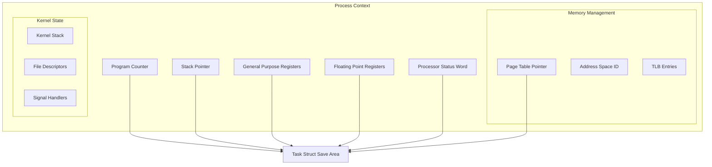

---
tags:
  - CPU
  - Context Switching
  - Process Management
  - Kernel
---

# Chapter 5-3A: 컨텍스트 스위칭 기초 - CPU의 저글링

## 🎯 컨텍스트 스위칭 기본 원리

멀티태스킹 환경에서 CPU가 여러 프로세스를 동시에 처리하는 핵심 메커니즘인 컨텍스트 스위칭의 기본 개념과 구성 요소를 살펴봅니다.

## 도입: 멀티태스킹의 핵심 메커니즘

### 구글 크롬이 탭 100개를 동시에 처리하는 비밀

한 구글 엔지니어의 경험담:

> "사용자가 크롬에서 탭 100개를 열어놓고 유튜브 동영상을 보면서, 구글 독스로 문서를 작성하고, Gmail을 확인합니다. CPU 코어는 4개뿐인데 어떻게 가능할까요? 비밀은 **초당 1000번의 컨텍스트 스위칭**이죠."

실제 측정 결과:

```bash
# 크롬 브라우저 실행 중 컨텍스트 스위칭 측정
$ vmstat 1
procs -----------memory---------- ---swap-- -----io---- -system-- ------cpu-----
 r  b   swpd   free   buff  cache   si   so    bi    bo   in   cs us sy id wa st
2  0      0 8234560 234560 4567890    0    0     0     8  2341 4567 45 12 43  0  0
#                                                           ^^^^ 초당 4567번!

# 각 탭이 받는 시간
100개 탭 ÷ 4 코어 = 코어당 25개 탭
1초 ÷ 25 = 40ms per 탭
# 40ms면 충분합니다! 인간은 50ms 이하 지연을 느끼지 못하거든요
```

### CPU의 저글링 - 프로세스 공을 떨어뜨리지 마라

서커스 저글러를 상상해보세요:

- **공 = 프로세스**
- **손 = CPU 코어**
- **공 잡기/던지기 = 컨텍스트 스위칭**

```python
# CPU의 저글링 시뮬레이션
class CPU:
    def juggle_processes(self):
        while True:
            process = self.catch_ball()     # 현재 프로세스 상태 저장
            self.juggle_time(10_ms)         # 10ms 동안 실행
            self.throw_ball(process)        # 다음을 위해 저장
            next_process = self.grab_next() # 다음 프로세스 로드
            # 🎪 완벽한 저글링! 아무도 떨어지지 않음
```

이제 이 마법같은 저글링이 어떻게 작동하는지 깊이 들어가봅시다!

## CPU 컨텍스트의 구성 요소

### 리누스 토르발스의 고백 - "컨텍스트는 무겁다"

리누스 토르발스의 커밋 메시지에서:

> "컨텍스트 스위칭은 생각보다 훨씬 무겁습니다. 레지스터 몇 개 저장하는 게 아니에요. CPU의 전체 상태, 메모리 맵핑, 캐시, TLB... 마치 이사하는 것과 같죠. 🏠→🏠"

실제로 저장해야 하는 것들:

```python
# 프로세스 이사 체크리스트
context_checklist = {
    '가구': ['레지스터 16개', 'PC', 'SP', 'FLAGS'],           # 64B
    '가전': ['FPU 상태', 'SSE/AVX 벡터'],                    # 512B
    '주소록': ['페이지 테이블 포인터', 'TLB 엔트리'],          # 4KB
    '개인물품': ['파일 디스크립터', '시그널 핸들러'],           # 8KB
    '보안': ['권한 정보', 'capabilities'],                    # 1KB
    # 총 이사 짐: 프로세스당 약 14KB!
}
```

### 프로세스 컨텍스트 구조 - CPU의 신분증



### Task Struct의 컨텍스트 저장 영역 - 프로세스의 블랙박스

넷플릭스 엔지니어의 디버깅 스토리:

> "서버가 갑자기 느려졌어요. 프로파일링 결과? 컨텍스트 스위칭이 초당 10만 번! task_struct를 덤프해보니 FPU 상태 저장/복원이 병목이었죠. AVX-512 사용을 끄니 30% 빨라졌습니다."

```c
// Linux task_struct의 스레드 정보 - 프로세스의 모든 것
struct thread_struct {
    // CPU 레지스터 상태
    struct pt_regs regs;

    // x86-64 아키텍처 특정 레지스터
    unsigned long sp;       // Stack pointer
    unsigned long ip;       // Instruction pointer

    // 세그먼트 레지스터
    unsigned short es, ds, fsindex, gsindex;
    unsigned long fs, gs;

    // 디버그 레지스터
    unsigned long debugreg[8];

    // FPU/SSE/AVX 상태
    struct fpu fpu;

    // I/O 권한 비트맵
    unsigned long *io_bitmap_ptr;
    unsigned long iopl;

    // TLS (Thread Local Storage)
    struct desc_struct tls_array[GDT_ENTRY_TLS_ENTRIES];
};

// 레지스터 세트 구조체
struct pt_regs {
    // 범용 레지스터 (x86-64)
    unsigned long r15, r14, r13, r12;
    unsigned long rbp, rbx;
    unsigned long r11, r10, r9, r8;
    unsigned long rax, rcx, rdx;
    unsigned long rsi, rdi;

    // 특수 레지스터
    unsigned long orig_rax;
    unsigned long rip;      // Instruction pointer
    unsigned long cs;       // Code segment
    unsigned long rflags;   // CPU flags
    unsigned long rsp;      // Stack pointer
    unsigned long ss;       // Stack segment
};
```

## 핵심 요점

### 1. 컨텍스트 스위칭의 본질

컨텍스트 스위칭은 CPU가 하나의 프로세스 실행을 중단하고 다른 프로세스 실행을 시작하는 과정입니다. 이는 멀티태스킹의 핵심 메커니즘입니다.

### 2. 저장해야 하는 상태 정보

프로세스의 완전한 실행 상태를 보존하기 위해 CPU 레지스터, 메모리 관리 정보, 커널 상태 등 다양한 정보를 저장해야 합니다.

### 3. Task Struct의 중요성

Linux의 task_struct는 프로세스의 모든 상태 정보를 담고 있는 핵심 데이터 구조로, 효율적인 컨텍스트 스위칭을 위한 설계입니다.

---

**이전**: [인터럽트와 예외 처리](02-interrupt-exception.md)에서 하드웨어 인터럽트의 동작을 학습했습니다.
**다음**: [컨텍스트 스위칭 구현](03b-context-switching-implementation.md)에서 실제 컨텍스트 스위칭 과정의 상세 구현을 학습합니다.
