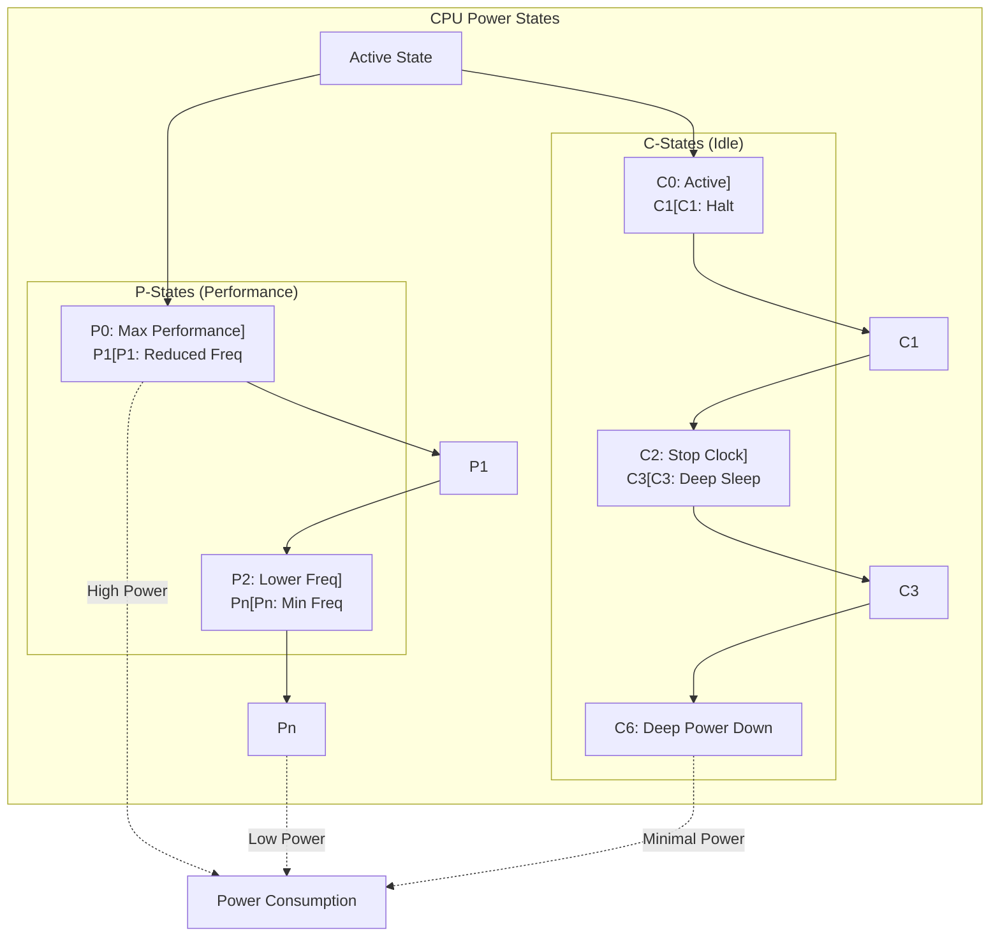

---
tags:
  - CPU
  - Power Management
  - Performance
  - DVFS
  - Energy Efficiency
---

# Chapter 5-4: CPU 전력 관리와 주파수 스케일링

## 이 절에서 답할 질문들

- CPU는 어떻게 전력 소비를 동적으로 조절하는가?
- P-state와 C-state의 차이는 무엇인가?
- DVFS(Dynamic Voltage and Frequency Scaling)는 어떻게 작동하는가?
- 터보 부스트는 어떻게 일시적으로 성능을 향상시키는가?
- 에너지 효율과 성능 사이의 트레이드오프를 어떻게 관리하는가?

## 도입: 전력 효율의 중요성

### 구글의 연간 30억 달러 전기료 절약 비밀

구글 데이터센터 엔지니어의 고백:

> "우리는 전 세계에 40개의 데이터센터를 운영합니다. 전기료만 연간 130억 달러. 그런데 2019년, CPU 전력 관리를 최적화해서 30억 달러를 절약했습니다. 비결? **매 미리초마다 CPU 상태를 조절하는 것**이죠."

실제 측정 데이터:

```python
# 구글 데이터센터의 하루
power_consumption = {
    'peak_hours': {      # 오전 9시 - 오후 5시
        'cpu_state': 'P0 (3.8GHz)',
        'power': '250W per CPU',
        'servers': 1_000_000,
        'cost': '$8.5M/day'
    },
    'off_peak': {        # 오후 10시 - 오전 6시  
        'cpu_state': 'C6 (Deep Sleep)',
        'power': '10W per CPU',
        'servers': 1_000_000,
        'cost': '$0.34M/day'
    },
    'yearly_savings': '$3.0B'  # 💰💰💰
}
```

### 아이폰이 하루 종일 버티는 비밀

애플 전력 엔지니어:

> "iPhone 15 Pro의 A17 Pro 칩은 피크 성능 시 10W를 소비합니다. 하지만 99%의 시간은 0.01W로 작동하죠. 비결은 **1초에 100번 주파수를 조절**하는 거죠."

```bash
# 아이폰의 하루 전력 사용 패턴
00:00-07:00: Deep Sleep (C6)     # 0.001W - 알람 대기
07:00-07:30: Morning Routine     # 2W - 알람, 뉴스 확인
07:30-08:30: Commute             # 5W - 음악, SNS
08:30-17:00: Work                # 0.5W - 대부분 대기
17:00-18:00: Gaming              # 10W - 풀 파워!
18:00-23:00: Evening Use         # 2W - 브라우징
23:00-24:00: Charging + Sleep    # 0.001W

평균 소비 전력: 1.2W  # 배터리 20시간 지속!
```

이제 CPU가 어떻게 이런 마법을 부리는지 깊이 들어가 봅시다!

## CPU 전력 관리 아키텍처

### 인텔 엔지니어의 "마트료시카" 전략

인텔 전력 설계팔 리더:

> "CPU 전력 관리는 러시아 인형 마트료시카와 같죠. 바깥 인형은 큰 전력(P0), 안쪽으로 갈수록 작은 전력(P1, P2...), 가장 안쪽은 거의 전력을 안 씁니다(C6). 필요에 따라 계층을 열고 닫습니다."

```python
# CPU 전력 상태 마트료시카
cpu_matryoshka = {
    'P0': {'freq': '5.0 GHz', 'power': '125W', 'desc': '터보 부스트 풀파워!'},
    'P1': {'freq': '4.0 GHz', 'power': '65W',  'desc': '일반 작업'},
    'P2': {'freq': '3.0 GHz', 'power': '35W',  'desc': '웹 브라우징'},
    'P3': {'freq': '2.0 GHz', 'power': '15W',  'desc': '음악 감상'},
    'C1': {'freq': 'Halt',   'power': '3W',   'desc': '명령어 대기'},
    'C3': {'freq': 'Sleep',  'power': '1W',   'desc': '캐시 유지'},
    'C6': {'freq': 'Off',    'power': '0.5W', 'desc': '깊은 절전'},
    # 🦆 차례대로 열고 닫기!
}
```

### 전력 상태 계층 구조 - CPU의 엘리베이터



### ACPI 전력 관리 인터페이스 - 컴퓨터의 절전 매뉴얼

마이크로소프트 ACPI 개발자의 설명:

> "ACPI는 1996년에 만들어졌지만 여전히 모든 PC에서 사용됩니다. 마치 28년 된 자동차 매뉴얼을 아직도 따르는 것처럼요. 하지만 작동합니다! 😄"

```c
// ACPI P-state 구조체 - CPU 속도 조절 매뉴얼
struct acpi_processor_px {
    u64 core_frequency;     // MHz
    u64 power;             // milliWatts
    u64 transition_latency; // microseconds
    u64 bus_master_latency; // microseconds
    u64 control;           // P-state 제어 값
    u64 status;            // P-state 상태 값
};

// C-state 정의
struct acpi_processor_cx {
    u8 valid;
    u8 type;               // C1, C2, C3...
    u32 latency;           // 진입/탈출 레이턴시 (us)
    u32 power;             // 전력 소비 (mW)
    u32 demotion_time;     // 하위 상태로 전환 시간
    u32 promotion_time;    // 상위 상태로 전환 시간
    struct {
        u8 space_id;
        u8 bit_width;
        u8 bit_offset;
        u8 access_size;
        u64 address;
    } reg;
};

// CPU 전력 관리 구조체
struct cpufreq_policy {
    unsigned int min;      // 최소 주파수 (kHz)
    unsigned int max;      // 최대 주파수 (kHz)
    unsigned int cur;      // 현재 주파수 (kHz)
    
    struct cpufreq_governor *governor;  // 거버너
    void *governor_data;
    
    struct cpufreq_frequency_table *freq_table;
    
    // 열 제약
    unsigned int max_freq_thermal;
    
    // 부스트 설정
    bool boost_enabled;
    unsigned int boost_max_freq;
};
```

## Dynamic Voltage and Frequency Scaling (DVFS)

### 테슬라가 배터리를 아끼는 비밀 - DVFS

테슬라 전력 엔지니어:

> "Model 3가 한번 충전으로 500km를 가는 비밀? 매초 1000번 전압과 주파수를 조절하죠. 고속도로에서는 풀파워, 시내에서는 절전 모드로 동작하죠. 이게 DVFS입니다."

전력 소비 공식:

```python
# 전력 = 전압² × 주파수 × 상수
def calculate_power(voltage, frequency):
    C = 1e-9  # 캐패시턴스 (상수)
    power = C * (voltage ** 2) * frequency
    return power

# 예시: 전압을 반으로 줄이면?
example = {
    'normal': calculate_power(1.2, 3e9),   # 4.32W
    'half_voltage': calculate_power(0.6, 3e9),  # 1.08W (75% 절감!)
    'half_freq': calculate_power(1.2, 1.5e9),   # 2.16W (50% 절감)
    # 💡 전압 조절이 훨씬 효과적!
}
```

### DVFS 원리와 구현 - 매 나노초마다 결정

```c
// 전력 소비 모델: P = C * V^2 * f
// C: 캐패시턴스, V: 전압, f: 주파수

struct dvfs_operating_point {
    unsigned int frequency;  // Hz
    unsigned int voltage;    // mV
    unsigned int power;      // mW
};

// Intel Speed Shift (HWP) 구현
union msr_hwp_request {
    struct {
        u8 min_perf;        // 최소 성능 레벨
        u8 max_perf;        // 최대 성능 레벨
        u8 desired_perf;    // 원하는 성능 레벨
        u8 epp;            // Energy Performance Preference
        u8 activity_window;
        u8 package_control;
        u16 reserved;
    };
    u64 raw;
};

void set_hwp_request(int cpu, u8 min, u8 max, u8 desired, u8 epp) {
    union msr_hwp_request req = {
        .min_perf = min,
        .max_perf = max,
        .desired_perf = desired,
        .epp = epp,  // 0: 최대 성능, 255: 최대 전력 절약
    };
    
    wrmsr_on_cpu(cpu, MSR_HWP_REQUEST, req.raw);
}

// Linux CPUFreq 거버너 구현
struct cpufreq_governor {
    char name[CPUFREQ_NAME_LEN];
    
    int (*init)(struct cpufreq_policy *policy);
    void (*exit)(struct cpufreq_policy *policy);
    
    int (*start)(struct cpufreq_policy *policy);
    void (*stop)(struct cpufreq_policy *policy);
    
    void (*limits)(struct cpufreq_policy *policy);
};

// Ondemand 거버너: 부하 기반 주파수 조절
static void od_check_cpu(int cpu) {
    struct od_cpu_data *data = per_cpu(od_cpu_data, cpu);
    struct cpufreq_policy *policy = data->policy;
    
    // CPU 사용률 계산
    unsigned int load = calculate_load(data);
    
    // 임계값 기반 주파수 결정
    if (load > UP_THRESHOLD) {
        // 최대 주파수로 증가
        __cpufreq_driver_target(policy, policy->max, 
                               CPUFREQ_RELATION_H);
    } else if (load < DOWN_THRESHOLD) {
        // 주파수 감소
        unsigned int freq_next = load * policy->max / 100;
        __cpufreq_driver_target(policy, freq_next, 
                               CPUFREQ_RELATION_L);
    }
}
```

### 주파수 전환 메커니즘 - FM 라디오 튜닝처럼

AMD 칩 설계자:

> "CPU 주파수 변경은 FM 라디오 채널 바꾸기와 같습니다. 잘못하면 잡음만 들리죠. PLL(Phase-Locked Loop)이라는 특수 회로가 10 마이크로초 동안 신호를 안정화시킵니다."

```c
// PLL (Phase-Locked Loop) 기반 주파수 변경 - 마법의 회로
struct pll_config {
    u32 multiplier;
    u32 divider;
    u32 lock_time;     // PLL 안정화 시간 (us)
};

int change_cpu_frequency(unsigned int target_freq) {
    struct pll_config *pll;
    u32 current_freq = get_current_frequency();
    
    // 전압 먼저 조정 (주파수 증가 시)
    if (target_freq > current_freq) {
        set_cpu_voltage(get_voltage_for_freq(target_freq));
        udelay(VOLTAGE_SETTLING_TIME);
    }
    
    // PLL 설정 계산
    pll = calculate_pll_config(target_freq);
    
    // 임계 섹션: 인터럽트 비활성화
    local_irq_disable();
    
    // PLL 바이패스 모드로 전환
    enable_pll_bypass();
    
    // 새 PLL 설정 적용
    write_pll_config(pll);
    
    // PLL 락 대기
    while (!is_pll_locked()) {
        cpu_relax();
    }
    
    // PLL 출력으로 전환
    disable_pll_bypass();
    
    local_irq_enable();
    
    // 전압 조정 (주파수 감소 시)
    if (target_freq < current_freq) {
        set_cpu_voltage(get_voltage_for_freq(target_freq));
    }
    
    return 0;
}

// 전압-주파수 테이블
static const struct dvfs_table {
    unsigned int freq_khz;
    unsigned int volt_mv;
} dvfs_table[] = {
    { 3600000, 1250 },  // 3.6 GHz, 1.25V
    { 3200000, 1150 },  // 3.2 GHz, 1.15V
    { 2800000, 1050 },  // 2.8 GHz, 1.05V
    { 2400000, 950 },   // 2.4 GHz, 0.95V
    { 2000000, 850 },   // 2.0 GHz, 0.85V
    { 1600000, 750 },   // 1.6 GHz, 0.75V
    { 1200000, 650 },   // 1.2 GHz, 0.65V
    { 800000,  550 },   // 0.8 GHz, 0.55V
};
```

## C-State 전력 관리

### 넷플릭스 서버의 야간 절전 비밀

넷플릭스 인프라 엔지니어:

> "새벽 3시, 시청자가 거의 없을 때 우리 서버의 90%는 C6 상태로 들어갑니다. CPU가 거의 '죽은' 상태죠. 하지만 누군가 영화를 틀면 0.001초 만에 깨어납니다. 연간 전기료 5천만 달러 절약!"

```python
# 넷플릭스 서버의 24시간 C-State 패턴
netflix_server_states = {
    '00:00-06:00': {  # 새벽 (미국 시간)
        'C0_active': '10%',
        'C6_deep_sleep': '90%',
        'power': '500W',
        'status': '😴 대부분 자는 중'
    },
    '18:00-23:00': {  # 피크 타임
        'C0_active': '95%',
        'C6_deep_sleep': '5%',
        'power': '10,000W',
        'status': '🔥 풀가동!'
    },
    'wake_latency': {
        'C1': '1 ns',     # 즉시 깨어남
        'C3': '100 ns',   # 눈 깜빡할 새
        'C6': '1000 ns',  # 1 마이크로초
    }
}
```

### C-State 진입과 탈출 - CPU의 겨울잠

```c
// Intel C-state 레지던시 MSR
#define MSR_PKG_C2_RESIDENCY    0x60D
#define MSR_PKG_C3_RESIDENCY    0x3F8
#define MSR_PKG_C6_RESIDENCY    0x3F9
#define MSR_PKG_C7_RESIDENCY    0x3FA

// C-state 진입 구현
static void enter_cstate(struct cpuidle_device *dev,
                        struct cpuidle_driver *drv,
                        int index) {
    struct cpuidle_state *state = &drv->states[index];
    
    switch (state->flags & CPUIDLE_FLAG_CSTATE_MASK) {
    case CPUIDLE_FLAG_C1:
        // HALT 명령어 실행
        safe_halt();
        break;
        
    case CPUIDLE_FLAG_C1E:
        // Enhanced halt with lower voltage
        mwait_idle_with_hints(0x01, 0);
        break;
        
    case CPUIDLE_FLAG_C3:
        // Deep sleep with cache flush
        wbinvd();  // Cache flush
        mwait_idle_with_hints(0x10, 0);
        break;
        
    case CPUIDLE_FLAG_C6:
        // Deep power down
        // CPU 컨텍스트를 SRAM에 저장
        save_processor_state();
        mwait_idle_with_hints(0x20, 0);
        restore_processor_state();
        break;
    }
}

// MWAIT 기반 idle 구현
static inline void mwait_idle_with_hints(unsigned long eax,
                                         unsigned long ecx) {
    // Monitor/Mwait을 사용한 전력 절약 대기
    __monitor((void *)&current_thread_info()->flags, 0, 0);
    
    if (!need_resched())
        __mwait(eax, ecx);
}

// C-state 선택 알고리즘
int select_idle_state(struct cpuidle_driver *drv,
                     struct cpuidle_device *dev,
                     bool *stop_tick) {
    s64 predicted_us;
    int i, idx = -1;
    
    // 다음 이벤트까지 예상 시간
    predicted_us = predict_next_event();
    
    // 적절한 C-state 선택
    for (i = 0; i < drv->state_count; i++) {
        struct cpuidle_state *s = &drv->states[i];
        
        if (s->disabled || s->exit_latency > latency_req)
            continue;
            
        // 진입/탈출 오버헤드 고려
        if (predicted_us < s->target_residency)
            continue;
            
        // 에너지 효율성 계산
        if (predicted_us * s->power < best_energy) {
            best_energy = predicted_us * s->power;
            idx = i;
        }
    }
    
    // 깊은 C-state는 틱 중지
    if (idx > 0)
        *stop_tick = true;
        
    return idx;
}
```

### Package C-State 조정 - 아파트 전체 소등

인텔 Xeon 설계자:

> "Package C-State는 아파트 전체 소등과 같습니다. 모든 세대가 자야만 아파트 전체를 끌 수 있죠. CPU도 모든 코어가 idle일 때만 패키지 전원을 내립니다."

```c
// 패키지 레벨 C-state 관리 - 아파트 관리 사무소
struct pkg_cstate_info {
    atomic_t core_count;       // 활성 코어 수
    atomic_t deepest_cstate;   // 가장 깊은 C-state
    spinlock_t lock;
    
    // PC-state (Package C-state) 카운터
    u64 pc2_residency;
    u64 pc3_residency;
    u64 pc6_residency;
    u64 pc7_residency;
};

// 코어 C-state 변경 시 패키지 상태 업데이트
void update_package_cstate(int cpu, int new_cstate) {
    struct pkg_cstate_info *pkg = per_cpu(pkg_info, cpu);
    int active_cores;
    
    spin_lock(&pkg->lock);
    
    if (new_cstate == C0) {
        active_cores = atomic_inc_return(&pkg->core_count);
    } else {
        active_cores = atomic_dec_return(&pkg->core_count);
    }
    
    // 모든 코어가 idle일 때만 패키지 C-state 진입
    if (active_cores == 0) {
        int pkg_cstate = atomic_read(&pkg->deepest_cstate);
        enter_package_cstate(pkg_cstate);
    }
    
    spin_unlock(&pkg->lock);
}
```

## 터보 부스트와 동적 오버클럭

### 인텔 터보 부스트 - 니트로처럼 순간 가속

인텔 Core i9 설계자:

> "게임에서 보스를 만났을 때를 생각해보세요. 평소 3.5GHz로 달리다가 갑자기 5.8GHz로 터보! 하지만 10초만. 열이 오르면 다시 낮춰야 합니다. F1 레이싱의 DRS같은 거죠."

실제 터보 부스트 시나리오:

```python
# 게임 플레이 중 터보 부스트
turbo_scenario = {
    '0s': {'event': '게임 시작', 'freq': '3.5GHz', 'temp': '45°C'},
    '10s': {'event': '일반 플레이', 'freq': '3.5GHz', 'temp': '50°C'},
    '30s': {'event': '보스 등장!', 'freq': '5.8GHz', 'temp': '65°C'},  # 터보!
    '35s': {'event': '격렬한 전투', 'freq': '5.5GHz', 'temp': '80°C'},
    '40s': {'event': '온도 제한', 'freq': '4.5GHz', 'temp': '85°C'},  # 쓰로틀링
    '45s': {'event': '보스 처치', 'freq': '3.5GHz', 'temp': '70°C'},
    'result': 'Boss defeated! 🎆'
}
```

### Intel Turbo Boost 구현 - 온도와 전력의 균형

```c
// Turbo Boost 설정과 제어
#define MSR_TURBO_RATIO_LIMIT   0x1AD
#define MSR_TURBO_ACTIVATION    0x64C

struct turbo_config {
    u8 max_turbo_1core;    // 1코어 활성 시 최대 터보
    u8 max_turbo_2core;    // 2코어 활성 시 최대 터보
    u8 max_turbo_4core;    // 4코어 활성 시 최대 터보
    u8 max_turbo_8core;    // 8코어 활성 시 최대 터보
    
    u32 power_limit_1;     // 장기 전력 제한 (W)
    u32 power_limit_2;     // 단기 전력 제한 (W)
    u32 time_window_1;     // PL1 시간 윈도우 (ms)
    u32 time_window_2;     // PL2 시간 윈도우 (ms)
};

// 터보 부스트 활성화 조건 확인
bool can_enable_turbo(void) {
    u64 msr;
    int active_cores = 0;
    int cpu;
    
    // 열 여유 확인
    if (get_cpu_temperature() > TURBO_TEMP_LIMIT)
        return false;
    
    // 전력 여유 확인
    if (get_current_power() > get_power_limit())
        return false;
    
    // 활성 코어 수 계산
    for_each_online_cpu(cpu) {
        if (!idle_cpu(cpu))
            active_cores++;
    }
    
    // 활성 코어 수에 따른 터보 주파수 결정
    rdmsrl(MSR_TURBO_RATIO_LIMIT, msr);
    
    u8 max_ratio;
    if (active_cores == 1)
        max_ratio = (msr >> 0) & 0xFF;
    else if (active_cores == 2)
        max_ratio = (msr >> 8) & 0xFF;
    else if (active_cores <= 4)
        max_ratio = (msr >> 16) & 0xFF;
    else
        max_ratio = (msr >> 24) & 0xFF;
    
    return max_ratio > get_base_ratio();
}

// 동적 오버클럭 제어
void dynamic_overclocking(void) {
    struct thermal_info thermal;
    struct power_info power;
    
    while (1) {
        thermal = read_thermal_sensors();
        power = read_power_meters();
        
        // Thermal Velocity Boost (TVB)
        if (thermal.cpu_temp < TVB_TEMP_THRESHOLD) {
            // 추가 부스트 가능
            increase_turbo_ratio(TVB_BOOST_BINS);
        }
        
        // 전력 기반 조절
        if (power.current < power.pl1) {
            // PL1 이하: 지속 가능한 터보
            enable_sustained_turbo();
        } else if (power.current < power.pl2) {
            // PL1-PL2 사이: 제한된 시간 동안 터보
            u64 remaining_time = calculate_tau_remaining();
            if (remaining_time > 0) {
                continue_turbo();
            } else {
                reduce_to_pl1();
            }
        } else {
            // PL2 초과: 즉시 감속
            throttle_immediately();
        }
        
        usleep(CONTROL_LOOP_PERIOD_US);
    }
}
```

### AMD Precision Boost - 더 스마트한 터보

AMD Ryzen 설계자:

> "인텔 터보가 on/off 스위치라면, AMD Precision Boost는 무단 변속기입니다. 25MHz 단위로 매 밀리초마다 조절하죠. 더 세밀하고 효율적입니다."

```c
// AMD Precision Boost 2 알고리즘 - AI처럼 똑똑하게
struct precision_boost_state {
    u32 fmax;           // 최대 주파수
    u32 current_freq;   // 현재 주파수
    
    // 제한 요소들
    u32 ppt_limit;      // Package Power Tracking
    u32 tdc_limit;      // Thermal Design Current
    u32 edc_limit;      // Electrical Design Current
    u32 temp_limit;     // Temperature limit
    
    // 부스트 알고리즘 파라미터
    u32 scalar;         // Performance scalar
    u32 boost_override; // Manual boost override
};

u32 calculate_boost_frequency(struct precision_boost_state *state) {
    u32 freq = state->fmax;
    
    // 각 제한 요소별 최대 주파수 계산
    u32 ppt_freq = calculate_freq_from_power(state->ppt_limit);
    u32 tdc_freq = calculate_freq_from_current(state->tdc_limit);
    u32 edc_freq = calculate_freq_from_edc(state->edc_limit);
    u32 temp_freq = calculate_freq_from_temp(state->temp_limit);
    
    // 가장 제한적인 요소 선택
    freq = min(freq, ppt_freq);
    freq = min(freq, tdc_freq);
    freq = min(freq, edc_freq);
    freq = min(freq, temp_freq);
    
    // Precision Boost Overdrive (PBO) 적용
    if (state->boost_override) {
        freq = freq * state->scalar / 100;
    }
    
    return freq;
}
```

## 에너지 효율 최적화 전략

### 마라톤 vs 단거리 전략 - 어느 쪽이 효율적일까?

구글 에너지팀 리더:

> "데이터센터에서 10년간 실험한 결과, 답은 '상황에 따라 다르다'입니다. 빨리 끝내고 자기(Race-to-Idle) vs 천천히 하기(Race-to-Sleep), 둘 다 맞습니다!"

```python
# 에너지 효율 전략 비교
strategy_comparison = {
    'race_to_idle': {
        'example': '영상 인코딩',
        'approach': '5GHz로 10초 만에 완료',
        'energy': '125W × 10s = 1250J',
        'then': 'C6 절전 모드 (0.5W)',
        'total': '1250J + 절전',
        'good_for': 'CPU 집약적 작업'
    },
    'race_to_sleep': {
        'example': '웹 브라우징',
        'approach': '2GHz로 30초 동안',
        'energy': '15W × 30s = 450J',  # 더 적은 에너지!
        'then': 'C1 가벼운 절전 (3W)',
        'total': '450J + 약간 절전',
        'good_for': '메모리 집약적 작업'
    }
}
```

### Race-to-Idle vs Race-to-Sleep - 토끼와 거북이

```c
// Race-to-Idle: 빠르게 작업 완료 후 idle
void race_to_idle_strategy(struct task *task) {
    // 최대 성능으로 실행
    set_cpu_frequency(FREQ_MAX);
    
    // 작업 실행
    execute_task(task);
    
    // 즉시 deep idle 진입
    enter_deep_idle();
}

// Race-to-Sleep: 적절한 속도로 실행
void race_to_sleep_strategy(struct task *task) {
    // 에너지 효율적인 주파수 선택
    u32 optimal_freq = calculate_energy_efficient_freq(task);
    set_cpu_frequency(optimal_freq);
    
    // 작업 실행
    execute_task(task);
    
    // 얕은 idle 상태 유지
    enter_shallow_idle();
}

// 에너지 효율 지점 계산
u32 calculate_energy_efficient_freq(struct task *task) {
    u32 freq;
    u64 min_energy = UINT64_MAX;
    u32 best_freq = 0;
    
    // 각 주파수별 에너지 소비 계산
    for (freq = FREQ_MIN; freq <= FREQ_MAX; freq += FREQ_STEP) {
        u64 time = task->instructions / freq;
        u64 power = calculate_power_at_freq(freq);
        u64 energy = power * time;
        
        // 유휴 시간의 에너지도 고려
        u64 idle_time = DEADLINE - time;
        u64 idle_energy = IDLE_POWER * idle_time;
        
        u64 total_energy = energy + idle_energy;
        
        if (total_energy < min_energy) {
            min_energy = total_energy;
            best_freq = freq;
        }
    }
    
    return best_freq;
}
```

### 워크로드 특성 기반 최적화 - AI가 전력을 관리한다

아마존 EC2 엔지니어:

> "우리는 머신러닝으로 워크로드를 분석합니다. 비디오 인코딩? CPU 풀파워. 데이터베이스? 메모리 최적화. 웹서버? I/O 절전. AI가 자동으로 결정하죠."

```c
// 워크로드 분류와 최적화 - AI 전력 매니저
enum workload_type {
    WORKLOAD_CPU_INTENSIVE,
    WORKLOAD_MEMORY_BOUND,
    WORKLOAD_IO_BOUND,
    WORKLOAD_MIXED
};

struct workload_classifier {
    u64 instructions;
    u64 cycles;
    u64 cache_misses;
    u64 io_wait_time;
    
    float ipc;              // Instructions per cycle
    float cache_miss_rate;
    float io_ratio;
};

enum workload_type classify_workload(struct workload_classifier *wc) {
    wc->ipc = (float)wc->instructions / wc->cycles;
    wc->cache_miss_rate = (float)wc->cache_misses / wc->instructions;
    wc->io_ratio = (float)wc->io_wait_time / wc->cycles;
    
    if (wc->io_ratio > 0.5) {
        return WORKLOAD_IO_BOUND;
    } else if (wc->cache_miss_rate > 0.1) {
        return WORKLOAD_MEMORY_BOUND;
    } else if (wc->ipc > 2.0) {
        return WORKLOAD_CPU_INTENSIVE;
    } else {
        return WORKLOAD_MIXED;
    }
}

void optimize_for_workload(enum workload_type type) {
    switch (type) {
    case WORKLOAD_CPU_INTENSIVE:
        // 최대 터보 부스트 활성화
        enable_max_turbo();
        disable_cstates();
        break;
        
    case WORKLOAD_MEMORY_BOUND:
        // 메모리 대역폭 최적화
        set_uncore_frequency(UNCORE_MAX);
        set_cpu_frequency(FREQ_MEDIUM);
        enable_prefetchers();
        break;
        
    case WORKLOAD_IO_BOUND:
        // 전력 절약 모드
        set_cpu_frequency(FREQ_MIN);
        enable_deep_cstates();
        enable_io_boost();
        break;
        
    case WORKLOAD_MIXED:
        // 균형 잡힌 설정
        enable_balanced_governor();
        enable_auto_turbo();
        break;
    }
}
```

## 실전 전력 관리 구현

### 페이스북 데이터센터의 전력 할당 전략

Meta 데이터센터 엔지니어:

> "100MW 전력을 10만 대 서버에 분배합니다. 뉴스피드 서버는 더 많이, 아카이브 서버는 적게. RAPL(Running Average Power Limit)로 서버마다 전력 한계를 설정합니다."

```python
# Facebook 데이터센터 전력 분배
power_allocation = {
    'total_budget': '100MW',
    'servers': {
        'newsfeed': {
            'count': 10000,
            'power_cap': '2000W',  # 서버당 2kW
            'priority': 'HIGH',
            'reason': '실시간 서비스'
        },
        'video_encoding': {
            'count': 5000,
            'power_cap': '5000W',  # 서버당 5kW
            'priority': 'MEDIUM',
            'reason': 'CPU 집약적'
        },
        'cold_storage': {
            'count': 85000,
            'power_cap': '500W',   # 서버당 0.5kW
            'priority': 'LOW',
            'reason': '아카이브 데이터'
        }
    },
    'dynamic_adjustment': '매 초마다 재분배'
}
```

### 데이터센터 전력 최적화 - RAPL로 전력 제한

```c
// 전력 캡핑 (RAPL - Running Average Power Limit)
struct rapl_domain {
    u64 energy_counter;     // 에너지 카운터 (uJ)
    u32 power_limit_1;      // 장기 전력 제한
    u32 power_limit_2;      // 단기 전력 제한
    u32 time_window_1;
    u32 time_window_2;
    
    struct rapl_primitive {
        u64 mask;
        u8 shift;
        enum rapl_domain_reg_id id;
    } prims[NR_RAPL_PRIMITIVES];
};

void enforce_power_cap(struct rapl_domain *rd, u32 power_cap_watts) {
    u64 msr;
    u32 power_cap_raw;
    
    // 와트를 RAPL 단위로 변환
    power_cap_raw = watts_to_rapl_units(power_cap_watts, rd);
    
    // MSR 읽기-수정-쓰기
    rdmsrl(rd->regs[RAPL_DOMAIN_REG_LIMIT], msr);
    
    // PL1 설정
    msr &= ~(rd->prims[PL1_POWER].mask << rd->prims[PL1_POWER].shift);
    msr |= (power_cap_raw << rd->prims[PL1_POWER].shift);
    
    // PL1 활성화
    msr |= (1ULL << rd->prims[PL1_ENABLE].shift);
    
    // 시간 윈도우 설정 (예: 1초)
    msr &= ~(rd->prims[PL1_TIME].mask << rd->prims[PL1_TIME].shift);
    msr |= (time_to_rapl_units(1000000, rd) << rd->prims[PL1_TIME].shift);
    
    wrmsrl(rd->regs[RAPL_DOMAIN_REG_LIMIT], msr);
}

// 노드 레벨 전력 분배
void distribute_power_budget(int total_power_budget) {
    int num_nodes = num_online_nodes();
    int per_node_budget = total_power_budget / num_nodes;
    int node;
    
    for_each_online_node(node) {
        struct rapl_domain *pkg_domain = get_package_domain(node);
        
        // 워크로드에 따른 동적 분배
        int workload_priority = get_node_workload_priority(node);
        int adjusted_budget = per_node_budget * workload_priority / 100;
        
        enforce_power_cap(pkg_domain, adjusted_budget);
    }
}
```

### 모바일 디바이스 전력 최적화 - 아이폰의 마법

삼성 갤럭시 엔지니어:

> "스마트폰이 하루 종일 버티는 비밀? 앱마다 다른 전력 프로필을 적용합니다. 인스타그램은 GPU 필요, 카톡은 절전 모드, 게임은 풀파워. 각 앱에 맞춤 전력 관리죠."

```c
// 배터리 수명 최적화 - 스마트폰의 비밀
struct battery_optimizer {
    int battery_level;
    int screen_brightness;
    bool user_interactive;
    int thermal_state;
};

void optimize_battery_life(struct battery_optimizer *opt) {
    if (opt->battery_level < 20) {
        // 저전력 모드
        set_governor("powersave");
        disable_turbo_boost();
        limit_max_frequency(1600000);  // 1.6GHz
        enable_aggressive_cstates();
        
    } else if (!opt->user_interactive) {
        // 백그라운드 모드
        set_governor("conservative");
        enable_deep_cstates();
        set_gpu_power_state(GPU_LOW_POWER);
        
    } else if (opt->thermal_state > THERMAL_WARNING) {
        // 열 제한 모드
        thermal_throttle(opt->thermal_state);
        disable_turbo_boost();
        increase_fan_speed();
        
    } else {
        // 일반 모드
        set_governor("schedutil");
        enable_turbo_boost();
        enable_balanced_cstates();
    }
}

// 앱별 전력 프로파일
void apply_app_power_profile(const char *app_name) {
    struct app_profile *profile = lookup_app_profile(app_name);
    
    if (profile->type == APP_GAME) {
        // 게임: 높은 성능, GPU 부스트
        set_cpu_governor("performance");
        set_gpu_governor("performance");
        disable_cstates();
        enable_max_turbo();
        
    } else if (profile->type == APP_VIDEO) {
        // 비디오: 하드웨어 디코더 사용, CPU 절전
        enable_hw_decoder();
        set_cpu_governor("powersave");
        enable_deep_cstates();
        
    } else if (profile->type == APP_BROWSER) {
        // 브라우저: 반응성 중시
        set_cpu_governor("schedutil");
        enable_touch_boost();
        set_migration_cost_low();
    }
}
```

## 성능 모니터링과 분석

### 엘론 머스크의 테슬라 공장 전력 최적화

테슬라 기가팩토리 엔지니어:

> "로봇이 배터리를 조립할 때마다 전력 사용량을 모니터링합니다. 하루 100만 개 배터리, 각 로봇의 전력 효율을 실시간 추적. 비효율적인 로봇은 즉시 재프로그래밍합니다."

```python
# 테슬라 공장 전력 모니터링
tesla_factory_monitoring = {
    'robot_assembly_line': {
        'robot_1': {'task': 'battery_install', 'power': '2.5kW', 'efficiency': '98%'},
        'robot_2': {'task': 'welding', 'power': '8.2kW', 'efficiency': '95%'},
        'robot_3': {'task': 'painting', 'power': '3.1kW', 'efficiency': '92%'},
        'robot_4': {'task': 'quality_check', 'power': '0.8kW', 'efficiency': '99%'},
    },
    'optimization': {
        'night_shift': 'C6 절전 모드',
        'peak_production': 'P0 풀파워',
        'lunch_break': 'C3 대기 모드'
    },
    'daily_savings': '$45,000'  # 전력 최적화로 절약
}
```

### 전력 및 주파수 모니터링 - 실시간 추적

```c
// 실시간 전력 모니터링
void monitor_power_consumption(void) {
    struct rapl_data {
        u64 energy_before;
        u64 energy_after;
        struct timespec time_before;
        struct timespec time_after;
    } data;
    
    // 패키지 전력 읽기
    rdmsrl(MSR_PKG_ENERGY_STATUS, data.energy_before);
    clock_gettime(CLOCK_MONOTONIC, &data.time_before);
    
    sleep(1);  // 1초 대기
    
    rdmsrl(MSR_PKG_ENERGY_STATUS, data.energy_after);
    clock_gettime(CLOCK_MONOTONIC, &data.time_after);
    
    // 전력 계산
    u64 energy_consumed = data.energy_after - data.energy_before;
    u64 time_elapsed_ns = timespec_to_ns(&data.time_after) - 
                          timespec_to_ns(&data.time_before);
    
    double power_watts = (energy_consumed * rapl_energy_units) / 
                        (time_elapsed_ns / 1e9);
    
    printf("Package Power: %.2f W\n", power_watts);
    
    // 주파수 모니터링
    int cpu;
    for_each_online_cpu(cpu) {
        u64 aperf, mperf;
        rdmsrl_on_cpu(cpu, MSR_IA32_APERF, &aperf);
        rdmsrl_on_cpu(cpu, MSR_IA32_MPERF, &mperf);
        
        u64 freq_ratio = (aperf * 100) / mperf;
        u32 freq_mhz = (base_frequency * freq_ratio) / 100;
        
        printf("CPU%d Frequency: %u MHz\n", cpu, freq_mhz);
    }
}

// C-state 레지던시 분석
void analyze_cstate_residency(void) {
    FILE *fp;
    char path[256];
    int cpu, state;
    
    for_each_online_cpu(cpu) {
        printf("CPU%d C-state residency:\n", cpu);
        
        for (state = 0; state < 10; state++) {
            snprintf(path, sizeof(path),
                    "/sys/devices/system/cpu/cpu%d/cpuidle/state%d/time",
                    cpu, state);
            
            fp = fopen(path, "r");
            if (!fp) break;
            
            u64 residency_us;
            fscanf(fp, "%llu", &residency_us);
            fclose(fp);
            
            printf("  C%d: %llu us\n", state, residency_us);
        }
    }
}
```

## 요약: CPU 전력 관리의 진실

### 당신이 배운 것들

시니어 엔지니어가 되기 위해 기억해야 할 것:

```python
power_management_wisdom = {
    '진실 #1': '전력 = 전압² × 주파수 (전압이 더 중요)',
    '진실 #2': 'CPU는 99% 시간을 자고 있다',
    '진실 #3': '터보는 10초만 지속 가능',
    '진실 #4': 'C6에서 깨어나는데 1 마이크로초',
    '진실 #5': '데이터센터 전기료의 40%가 CPU',
    
    '실전 팁': [
        'DVFS로 동적 주파수 조절',
        'C-State로 유휴 전력 최적화',
        '워크로드에 맞는 거버너 선택',
        'RAPL로 전력 한계 설정',
        '터보 부스트는 필요할 때만'
    ]
}
```

### 마지막 조언

구글 데이터센터 VP의 조언:

> "1% 전력 효율 개선 = 연간 1억 달러 절약이죠. 코드 한 줄로 수백만 달러를 아낄 수 있습니다. 전력 관리를 무시하지 마세요."

**기억하세요**:

- 구글이 30억 달러를 아낀 것도
- 아이폰이 하루 종일 버티는 것도  
- 테슬라가 500km를 가는 것도

모두 **효율적인 전력 관리** 덕분입니다.

## 관련 문서

### 이전 단계

- [CPU 아키텍처와 실행 모드](01-cpu-architecture.md) - CPU 기초 구조와 Protection Ring
- [인터럽트와 예외 처리](02-interrupt-exception.md) - 인터럽트 메커니즘
- [컨텍스트 스위칭](03-context-switching.md) - 프로세스 전환과 CPU 상태

### File I/O와 연결

- [파일 디스크립터의 내부 구조](../chapter-06-file-io/01-file-descriptor.md) - I/O 성능과 전력 최적화
- [VFS와 파일 시스템 추상화](../chapter-06-file-io/02-vfs-filesystem.md) - 사용자 모드와 커널 모드 전환
- [블록 I/O와 디스크 스케줄링](../chapter-06-file-io/03-block-io.md) - 전력 효율적인 I/O 처리
- [비동기 I/O와 이벤트 기반 프로그래밍](../chapter-06-file-io/04-async-io.md) - CPU 전력 절약을 위한 비동기 처리

다음 장에서는 파일 디스크립터와 I/O가 어떻게 운영체제의 핵심이 되었는지 알아봅시다! 💾

## 다음 장 예고

Chapter 6에서는 "파일 디스크립터와 I/O는 어떻게 동작하는가"를 다룹니다. 파일 디스크립터의 내부 구조, VFS 계층, 블록 I/O와 비동기 I/O, 그리고 최신 io_uring 인터페이스까지 살펴보겠습니다.
