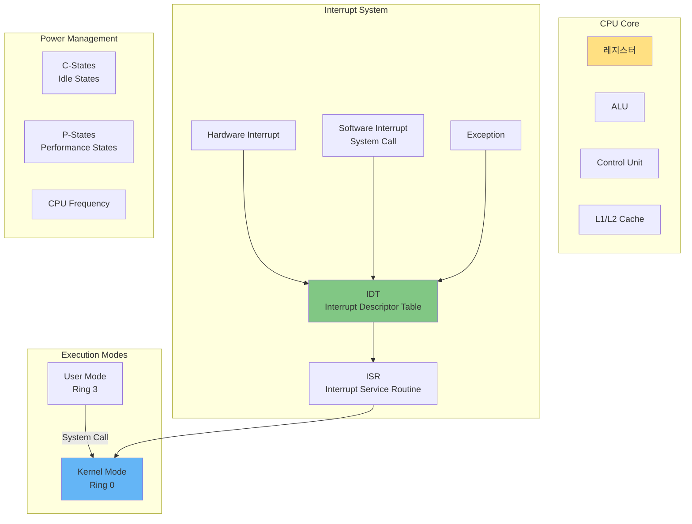
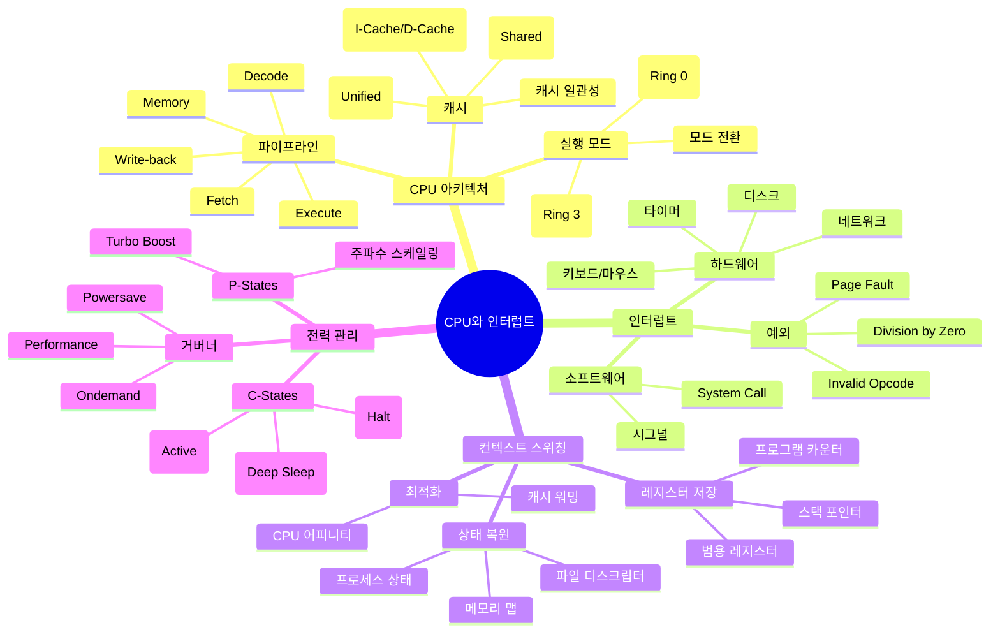
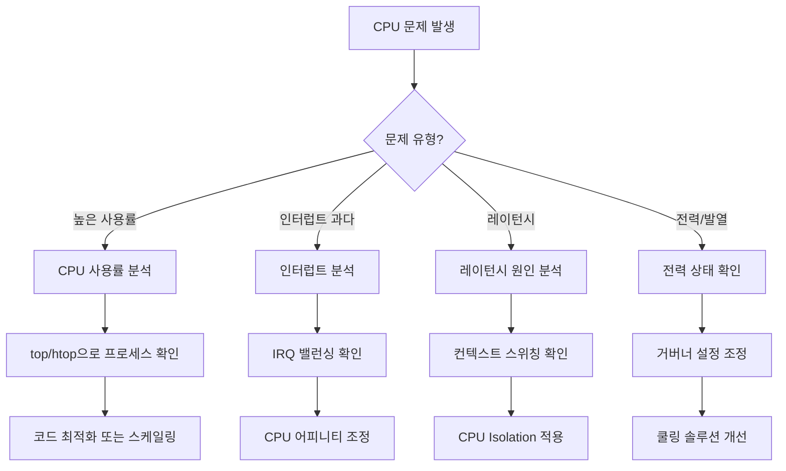

---
tags:
  - CPU
  - Interrupt
  - SystemCall
  - Guide
  - Kernel
  - SystemProgramming
---

# Chapter 5: CPU와 인터럽트 - 시스템의 심장박동

## 이 장에서 다루는 내용

당신이 지금 이 글을 읽는 동안, CPU는 초당 수백만 번 User mode와 Kernel mode를 오가며, 수천 개의 인터럽트를 처리하고, 수십 개의 프로세스를 스케줄링합니다.

마우스를 움직이면 인터럽트가 발생하고, 키보드를 누르면 또 인터럽트가 발생합니다. 네트워크 패킷이 도착해도, 디스크 I/O가 완료되어도 인터럽트입니다.

이 장에서는 현대 컴퓨터의 심장박동인 CPU 아키텍처와 인터럽트 시스템을 깊이 있게 탐구합니다. CPU가 어떻게 수많은 작업을 효율적으로 처리하는지, 인터럽트가 어떻게 시스템의 반응성을 높이는지, 그리고 전력 관리는 어떻게 이루어지는지 알아봅니다.

## 왜 이것을 알아야 하는가?

### 실무에서 마주치는 CPU/인터럽트 문제들

다음과 같은 상황을 경험해보셨나요?

- ⚡ **높은 CPU 사용률**: 100% CPU인데 실제 작업은 없는 상황
- 🔥 **Soft Lockup**: 시스템이 멈춘 것처럼 보이는 현상
- 🎯 **인터럽트 스톰**: 과도한 인터럽트로 시스템 마비
- ⏰ **레이턴시 문제**: 실시간 처리가 필요한데 지연 발생
- 🔋 **전력 소모**: 배터리가 빨리 닳거나 발열 문제

이런 문제들의 근본 원인은 CPU와 인터럽트 시스템에 대한 이해 부족입니다. 이 장을 마스터하면, 시스템 레벨에서 성능을 최적화하고 문제를 진단할 수 있습니다.

## CPU와 인터럽트 아키텍처 한눈에 보기



## 이 장의 구성

### [5-1: CPU 아키텍처와 실행](01-cpu-architecture.md)

**"CPU의 내부 구조와 명령어 실행 과정"**

- 🏗️ **CPU 구조**: 레지스터, ALU, 제어 유닛의 역할
- 🔄 **파이프라이닝**: 명령어 병렬 처리 기법
- 💾 **캐시 계층**: L1/L2/L3 캐시와 성능
- 🎯 **분기 예측**: CPU가 미래를 예측하는 방법

### [5-2: 인터럽트와 예외](02-interrupt-exception.md)

**"시스템의 이벤트 처리 메커니즘"**

- 📡 **인터럽트 종류**: 하드웨어/소프트웨어 인터럽트
- ⚠️ **예외 처리**: Fault, Trap, Abort의 차이
- 🔧 **IDT와 ISR**: 인터럽트 처리 과정
- 📊 **인터럽트 밸런싱**: IRQ 어피니티와 성능

### [5-3: 컨텍스트 스위칭](03-context-switching.md)

**"작업 전환의 비용과 최적화"**

- 🔄 **컨텍스트 스위칭 과정**: 레지스터 저장과 복원
- 💰 **스위칭 비용**: 캐시 무효화와 TLB 플러시
- ⚡ **최적화 기법**: 스위칭 빈도 줄이기
- 🎯 **CPU 어피니티**: 캐시 친화적 스케줄링

### [5-4: 전력 관리](04-power-management.md)

**"성능과 효율의 균형"**

- 🔋 **C-States**: CPU 유휴 상태 관리
- ⚡ **P-States**: 동적 주파수 조정
- 🌡️ **열 관리**: Thermal Throttling
- 🎮 **성능 거버너**: 전력 정책 설정

## 실습 환경 준비

이 장의 예제들을 직접 실행해보려면 다음 도구들이 필요합니다:

```bash
# CPU 정보 확인
$ lscpu                      # CPU 아키텍처 정보
$ cat /proc/cpuinfo         # 상세 CPU 정보
$ cpupower frequency-info   # 주파수 정보

# 인터럽트 모니터링
$ cat /proc/interrupts      # 인터럽트 통계
$ watch -n 1 'cat /proc/interrupts | grep -E "CPU|timer"'
$ mpstat -P ALL 1          # CPU별 인터럽트 확인

# 성능 분석
$ perf stat -e cycles,instructions,cache-misses
$ perf record -e cpu-cycles -g
$ turbostat                # 전력 상태 모니터링

# 컨텍스트 스위칭
$ vmstat 1                  # cs 컬럼 확인
$ pidstat -w 1             # 프로세스별 스위칭
```

## 이 장을 읽고 나면

✅ **CPU 이해**: 현대 CPU의 내부 동작 원리 완벽 이해  
✅ **인터럽트 마스터**: 인터럽트 처리와 최적화 능력  
✅ **성능 진단**: CPU 병목 현상 분석과 해결  
✅ **전력 최적화**: 성능과 전력 소비의 균형 조정  
✅ **시스템 튜닝**: 워크로드에 맞는 CPU 설정 최적화  

## 핵심 개념 미리보기



## CPU 문제 진단 플로우차트



## 다음 단계

이제 [5-1: CPU 아키텍처와 실행](01-cpu-architecture.md)부터 시작하여, CPU의 내부 구조와 명령어 실행 과정을 깊이 있게 탐구해봅시다.

CPU와 인터럽트는 컴퓨터 시스템의 심장과 신경계입니다. 이들이 어떻게 협력하여 복잡한 작업을 처리하는지 이해하면, 진정한 시스템 엔지니어로 거듭날 수 있습니다.