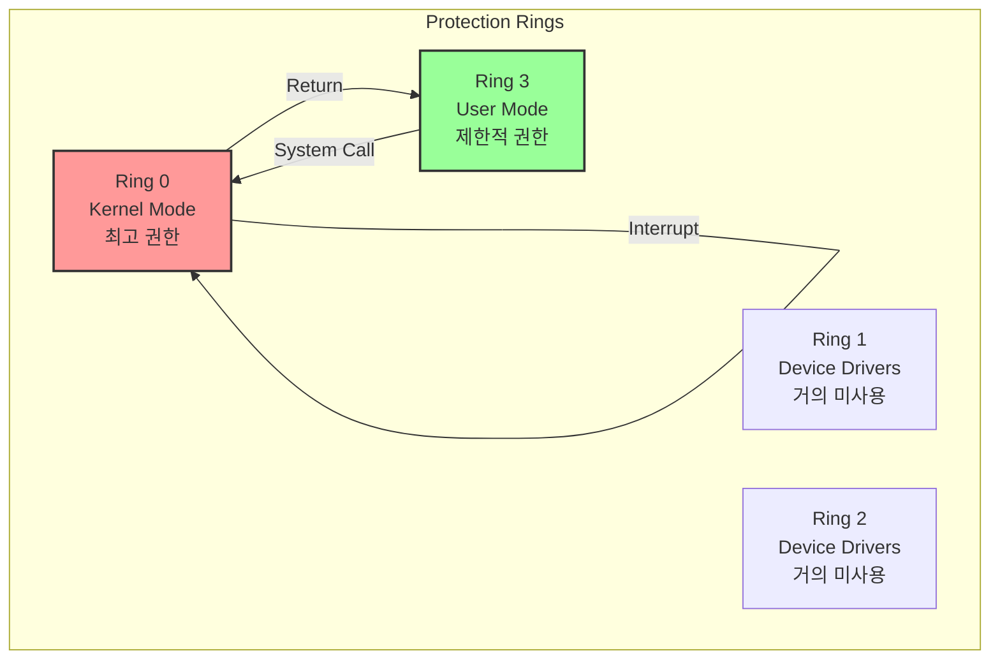
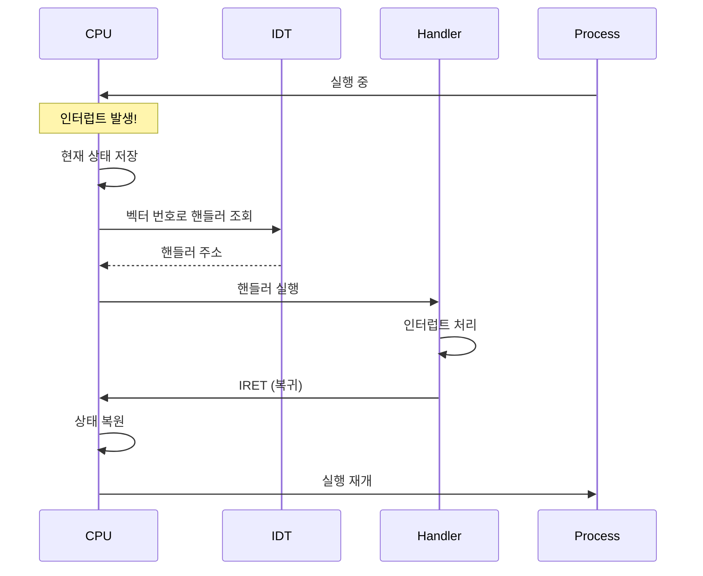

---
tags:
  - CPU
  - Interrupt
  - SystemCall
  - Guide
  - Kernel
---

# Chapter 5: CPU와 인터럽트 시스템

## 이 장을 읽으면 답할 수 있는 질문들

- CPU는 어떻게 여러 작업을 동시에 처리하는 것처럼 보일까?
- 인터럽트와 예외의 차이는?
- System Call은 어떻게 커널 모드로 전환되는가?
- Timer Interrupt는 어떻게 스케줄링을 가능하게 하는가?
- CPU Isolation은 어떻게 레이턴시를 줄이는가?

---

## 들어가며: 시스템의 심장박동

당신이 지금 이 글을 읽는 동안, CPU는 초당 수백만 번 User mode와 Kernel mode를 오가며, 수천 개의 인터럽트를 처리하고, 수십 개의 프로세스를 스케줄링합니다. 마우스를 움직이면 인터럽트가 발생하고, 키보드를 누르면 또 인터럽트가 발생합니다. 네트워크 패킷이 도착해도, 디스크 I/O가 완료되어도 인터럽트입니다.

이 모든 일이 어떻게 질서정연하게 처리되는 걸까요? CPU는 어떻게 중요한 일과 덜 중요한 일을 구분하는 걸까요? 이번 장에서는 현대 컴퓨터의 심장박동인 인터럽트 시스템과 CPU의 동작 원리를 깊이 있게 살펴보겠습니다.

## Section 1: CPU 실행 모드 - 특권의 계층

### 1.1 Protection Ring

x86 아키텍처의 권한 레벨:



### 1.2 User Mode vs Kernel Mode

```cpp
// User mode에서 불가능한 작업들
void user_mode_restrictions() {
    // 1. 특권 명령어 실행 불가
    // asm("cli");  // 인터럽트 비활성화 - General Protection Fault!
    // asm("hlt");  // CPU 정지 - GPF!
    
    // 2. I/O 포트 직접 접근 불가
    // outb(0x3F8, 'A');  // 시리얼 포트 쓰기 - GPF!
    
    // 3. 특수 레지스터 접근 불가
    // uint64_t cr3;
    // asm("mov %%cr3, %0" : "=r"(cr3));  // 페이지 테이블 읽기 - GPF!
    
    // 4. 커널 메모리 접근 불가
    // int* kernel_mem = (int*)0xffffffff80000000;
    // *kernel_mem = 42;  // Segmentation Fault!
    
    // 대신 System Call을 통해 요청
    int fd = open("/dev/port", O_RDWR);  // 커널이 대신 처리
    write(fd, "data", 4);
}
```

### 1.3 모드 전환 시점

```cpp
// CPU가 Kernel Mode로 전환되는 경우
enum mode_switch_reason {
    SYSTEM_CALL,      // 프로그램이 OS 서비스 요청
    INTERRUPT,        // 하드웨어 인터럽트
    EXCEPTION,        // CPU 예외 (Page Fault, Division by Zero 등)
    SIGNAL,           // 시그널 처리
};

// 실제 전환 과정 (x86-64)
void mode_switch_overhead() {
    struct timespec start, end;
    
    // System Call을 통한 모드 전환 측정
    clock_gettime(CLOCK_MONOTONIC, &start);
    
    for (int i = 0; i < 1000000; i++) {
        getpid();  // 가장 가벼운 시스템 콜
    }
    
    clock_gettime(CLOCK_MONOTONIC, &end);
    
    long ns = (end.tv_sec - start.tv_sec) * 1000000000 + 
              (end.tv_nsec - start.tv_nsec);
    
    printf("Mode switch overhead: %ld ns per syscall\n", ns / 1000000);
    // 결과 예시: 시스템 콜당 약 50-100ns (최신 CPU 기준)
}
```

## Section 2: 인터럽트 처리 과정 - 하드웨어와 소프트웨어의 협력

### 2.1 인터럽트 종류

```cpp
// 인터럽트 분류
typedef enum {
    // 1. 동기적 (Synchronous) - CPU 명령 실행 중 발생
    FAULT,      // 복구 가능한 예외 (Page Fault)
    TRAP,       // 의도적 예외 (Breakpoint, System Call)
    ABORT,      // 복구 불가능한 예외 (Machine Check)
    
    // 2. 비동기적 (Asynchronous) - 외부 이벤트
    HARDWARE_IRQ,   // 하드웨어 인터럽트
    SOFTWARE_IRQ,   // 소프트웨어 인터럽트 (IPI)
} interrupt_type_t;

// x86 인터럽트 벡터 테이블 (IDT)
struct idt_entry {
    uint16_t offset_low;     // Handler 주소 하위 16비트
    uint16_t selector;       // 코드 세그먼트 셀렉터
    uint8_t  ist;           // Interrupt Stack Table
    uint8_t  type_attr;     // 타입과 속성
    uint16_t offset_mid;    // Handler 주소 중간 16비트
    uint32_t offset_high;   // Handler 주소 상위 32비트
    uint32_t reserved;
} __attribute__((packed));

// IDT 설정 예제
void setup_idt() {
    struct idt_entry idt[256];
    
    // 예외 핸들러 설정 (0-31)
    set_idt_entry(&idt[0], divide_error_handler);         // Divide by 0
    set_idt_entry(&idt[14], page_fault_handler);         // Page Fault
    
    // 시스템 콜 (128 또는 0x80)
    set_idt_entry(&idt[0x80], system_call_handler);
    
    // 하드웨어 인터럽트 (32-255)
    set_idt_entry(&idt[32], timer_interrupt_handler);    // Timer
    set_idt_entry(&idt[33], keyboard_interrupt_handler); // Keyboard
    
    // IDT 로드
    lidt(&idt_descriptor);
}
```

### 2.2 인터럽트 처리 흐름



### 2.3 인터럽트 핸들러 구현

```cpp
// 인터럽트 핸들러 예제 (커널 코드)
__attribute__((interrupt))
void timer_interrupt_handler(struct interrupt_frame* frame) {
    // 1. 레지스터 저장 (컴파일러가 자동 처리)
    
    // 2. 인터럽트 컨트롤러에 ACK
    outb(0x20, 0x20);  // EOI to PIC
    
    // 3. 통계 업데이트
    current->utime++;
    jiffies++;
    
    // 4. 스케줄링 필요 체크
    if (--current->timeslice == 0) {
        current->need_resched = 1;
    }
    
    // 5. 타이머 콜백 처리
    run_timer_callbacks();
    
    // 6. 복귀 (IRET 명령으로 자동 처리)
}

// 고해상도 타이머 측정
void measure_interrupt_latency() {
    #define SAMPLES 1000
    uint64_t latencies[SAMPLES];
    
    for (int i = 0; i < SAMPLES; i++) {
        uint64_t start = rdtsc();  // CPU 사이클 카운터 읽기
        
        // 소프트웨어 인터럽트 트리거
        asm volatile("int $0x80");
        
        uint64_t end = rdtsc();
        latencies[i] = end - start;
    }
    
    // 통계 계산
    uint64_t min = latencies[0], max = latencies[0], sum = 0;
    for (int i = 0; i < SAMPLES; i++) {
        if (latencies[i] < min) min = latencies[i];
        if (latencies[i] > max) max = latencies[i];
        sum += latencies[i];
    }
    
    printf("Interrupt latency (cycles): Min=%lu, Max=%lu, Avg=%lu\n",
           min, max, sum / SAMPLES);
    // 결과 예시: Min=500, Max=2000, Avg=800 cycles
}
```

### 2.4 인터럽트 우선순위

```cpp
// Linux IRQ 우선순위 관리
struct irq_desc {
    irq_flow_handler_t handle_irq;
    struct irqaction* action;     // 핸들러 리스트
    unsigned int depth;           // 중첩 비활성화 깊이
    unsigned int irq_count;       // IRQ 발생 횟수
    unsigned int irqs_unhandled;  // 처리 안된 IRQ
    raw_spinlock_t lock;
    cpumask_var_t affinity;       // CPU 친화성
    // ...
};

// IRQ 친화성 설정
void set_irq_affinity(unsigned int irq, unsigned int cpu) {
    cpumask_t mask;
    cpumask_clear(&mask);
    cpumask_set_cpu(cpu, &mask);
    
    irq_set_affinity_hint(irq, &mask);
    
    // /proc/irq/N/smp_affinity로도 설정 가능
    char path[64];
    sprintf(path, "/proc/irq/%d/smp_affinity", irq);
    
    int fd = open(path, O_WRONLY);
    write(fd, "01", 2);  // CPU 0에만 전달
    close(fd);
}
```

## Section 3: System Call 메커니즘 - 커널의 관문

### 3.1 System Call 진입

```cpp
// System Call 호출 방법의 진화
// 1. INT 0x80 (레거시)
int legacy_syscall() {
    int result;
    asm volatile(
        "movl $1, %%eax\n"    // sys_exit
        "movl $0, %%ebx\n"    // status = 0
        "int $0x80"
        : "=a"(result)
    );
    return result;
}

// 2. SYSENTER/SYSEXIT (32비트)
int sysenter_syscall() {
    int result;
    asm volatile(
        "movl $1, %%eax\n"
        "movl $0, %%ebx\n"
        "call *%%gs:0x10"     // vDSO의 __kernel_vsyscall
        : "=a"(result)
    );
    return result;
}

// 3. SYSCALL/SYSRET (64비트, 현재 표준)
long modern_syscall() {
    long result;
    asm volatile(
        "movq $60, %%rax\n"   // sys_exit
        "movq $0, %%rdi\n"    // status = 0
        "syscall"
        : "=a"(result)
        : : "rcx", "r11", "memory"
    );
    return result;
}
```

### 3.2 System Call 테이블

```cpp
// System Call 테이블 (커널)
typedef long (*sys_call_ptr_t)(unsigned long, unsigned long, 
                               unsigned long, unsigned long,
                               unsigned long, unsigned long);

// x86-64 시스템 콜 테이블
sys_call_ptr_t sys_call_table[__NR_syscall_max] = {
    [0] = sys_read,
    [1] = sys_write,
    [2] = sys_open,
    [3] = sys_close,
    [4] = sys_stat,
    [5] = sys_fstat,
    // ... 300+ system calls
    [59] = sys_execve,
    [60] = sys_exit,
    [61] = sys_wait4,
    [62] = sys_kill,
    // ...
};

// System Call 디스패처 (간략화)
long system_call_handler(long nr, long a1, long a2, long a3, 
                        long a4, long a5, long a6) {
    // 1. 범위 체크
    if (nr >= __NR_syscall_max) {
        return -ENOSYS;
    }
    
    // 2. 추적 (ptrace, seccomp 등)
    if (test_thread_flag(TIF_SYSCALL_TRACE)) {
        syscall_trace_enter();
    }
    
    // 3. 실제 시스템 콜 호출
    long ret = sys_call_table[nr](a1, a2, a3, a4, a5, a6);
    
    // 4. 추적 (종료)
    if (test_thread_flag(TIF_SYSCALL_TRACE)) {
        syscall_trace_exit();
    }
    
    return ret;
}
```

### 3.3 vDSO - 빠른 System Call

```cpp
// vDSO (virtual Dynamic Shared Object)
// 커널이 제공하는 사용자 공간 코드

// vDSO를 통한 빠른 시스템 콜
#include <time.h>
#include <sys/time.h>

void benchmark_vdso() {
    struct timespec ts;
    struct timeval tv;
    
    // 1. clock_gettime - vDSO 사용 (모드 전환 없음!)
    clock_t start = clock();
    for (int i = 0; i < 10000000; i++) {
        clock_gettime(CLOCK_MONOTONIC, &ts);
    }
    printf("clock_gettime (vDSO): %ld ms\n",
           (clock() - start) * 1000 / CLOCKS_PER_SEC);
    
    // 2. gettimeofday - vDSO 사용
    start = clock();
    for (int i = 0; i < 10000000; i++) {
        gettimeofday(&tv, NULL);
    }
    printf("gettimeofday (vDSO): %ld ms\n",
           (clock() - start) * 1000 / CLOCKS_PER_SEC);
    
    // 3. getpid - 실제 시스템 콜
    start = clock();
    for (int i = 0; i < 10000000; i++) {
        getpid();
    }
    printf("getpid (syscall): %ld ms\n",
           (clock() - start) * 1000 / CLOCKS_PER_SEC);
    
    // 결과 예시:
    // clock_gettime (vDSO): 50 ms
    // gettimeofday (vDSO): 45 ms
    // getpid (syscall): 500 ms (10배 느림!)
}

// vDSO 매핑 확인
void check_vdso() {
    FILE* maps = fopen("/proc/self/maps", "r");
    char line[256];
    
    while (fgets(line, sizeof(line), maps)) {
        if (strstr(line, "[vdso]")) {
            printf("vDSO mapping: %s", line);
            // 예: 7fff12345000-7fff12346000 r-xp ... [vdso]
        }
    }
    fclose(maps);
}
```

### 3.4 seccomp - System Call 필터링

```cpp
#include <linux/seccomp.h>
#include <linux/filter.h>
#include <sys/prctl.h>

// seccomp-BPF를 이용한 시스템 콜 제한
void setup_seccomp_filter() {
    struct sock_filter filter[] = {
        // 아키텍처 체크
        BPF_STMT(BPF_LD | BPF_W | BPF_ABS,
                offsetof(struct seccomp_data, arch)),
        BPF_JUMP(BPF_JMP | BPF_JEQ | BPF_K, AUDIT_ARCH_X86_64, 1, 0),
        BPF_STMT(BPF_RET | BPF_K, SECCOMP_RET_KILL),
        
        // 시스템 콜 번호 로드
        BPF_STMT(BPF_LD | BPF_W | BPF_ABS,
                offsetof(struct seccomp_data, nr)),
        
        // 허용할 시스템 콜들
        BPF_JUMP(BPF_JMP | BPF_JEQ | BPF_K, __NR_read, 0, 1),
        BPF_STMT(BPF_RET | BPF_K, SECCOMP_RET_ALLOW),
        
        BPF_JUMP(BPF_JMP | BPF_JEQ | BPF_K, __NR_write, 0, 1),
        BPF_STMT(BPF_RET | BPF_K, SECCOMP_RET_ALLOW),
        
        BPF_JUMP(BPF_JMP | BPF_JEQ | BPF_K, __NR_exit, 0, 1),
        BPF_STMT(BPF_RET | BPF_K, SECCOMP_RET_ALLOW),
        
        // 나머지는 거부
        BPF_STMT(BPF_RET | BPF_K, SECCOMP_RET_KILL),
    };
    
    struct sock_fprog prog = {
        .len = sizeof(filter) / sizeof(filter[0]),
        .filter = filter,
    };
    
    // seccomp 활성화
    prctl(PR_SET_NO_NEW_PRIVS, 1, 0, 0, 0);
    prctl(PR_SET_SECCOMP, SECCOMP_MODE_FILTER, &prog);
    
    // 이제 read, write, exit만 가능
    // open("/etc/passwd", O_RDONLY);  // 죽음!
}
```

## Section 4: Softirq와 Tasklet - Bottom Half 처리

### 4.1 Top Half vs Bottom Half

```cpp
// 인터럽트 처리의 두 단계
// Top Half: 긴급한 작업만 (인터럽트 컨텍스트)
// Bottom Half: 나머지 작업 (프로세스 컨텍스트)

// Top Half - 네트워크 카드 인터럽트 핸들러
irqreturn_t network_card_irq_handler(int irq, void* dev_id) {
    struct net_device* dev = dev_id;
    
    // 1. 인터럽트 원인 확인 (빠르게!)
    uint32_t status = read_register(STATUS_REG);
    
    if (!(status & IRQ_PENDING)) {
        return IRQ_NONE;
    }
    
    // 2. 인터럽트 비활성화
    write_register(IRQ_MASK, 0);
    
    // 3. Bottom Half 스케줄링
    napi_schedule(&dev->napi);  // softirq로 처리
    
    return IRQ_HANDLED;
}

// Bottom Half - NAPI poll 함수
int network_poll(struct napi_struct* napi, int budget) {
    int packets_processed = 0;
    
    // budget만큼만 처리 (공정성)
    while (packets_processed < budget) {
        struct sk_buff* skb = get_next_packet();
        
        if (!skb) {
            // 더 이상 패킷 없음
            napi_complete(napi);
            enable_interrupts();
            break;
        }
        
        // 패킷 처리 (시간 걸림)
        netif_receive_skb(skb);
        packets_processed++;
    }
    
    return packets_processed;
}
```

### 4.2 Softirq 종류

```cpp
// Linux softirq 타입
enum {
    HI_SOFTIRQ = 0,      // 높은 우선순위 tasklet
    TIMER_SOFTIRQ,       // 타이머
    NET_TX_SOFTIRQ,      // 네트워크 전송
    NET_RX_SOFTIRQ,      // 네트워크 수신
    BLOCK_SOFTIRQ,       // 블록 I/O
    IRQ_POLL_SOFTIRQ,    // IRQ 폴링
    TASKLET_SOFTIRQ,     // 일반 tasklet
    SCHED_SOFTIRQ,       // 스케줄러
    HRTIMER_SOFTIRQ,     // 고해상도 타이머
    RCU_SOFTIRQ,         // RCU
    NR_SOFTIRQS
};

// ksoftirqd 커널 스레드
void ksoftirqd_thread(void* data) {
    while (!kthread_should_stop()) {
        if (local_softirq_pending()) {
            __do_softirq();
        } else {
            schedule();  // CPU 양보
        }
    }
}

// softirq 통계 확인
void check_softirq_stats() {
    system("cat /proc/softirqs");
    // 출력 예시:
    //                 CPU0       CPU1       CPU2       CPU3
    // HI:             0          0          0          0
    // TIMER:          1234567    2345678    3456789    4567890
    // NET_TX:         12345      23456      34567      45678
    // NET_RX:         234567     345678     456789     567890
}
```

### 4.3 Tasklet 사용

```cpp
#include <linux/interrupt.h>

// Tasklet 선언
void my_tasklet_func(unsigned long data);
DECLARE_TASKLET(my_tasklet, my_tasklet_func, 0);

// Tasklet 함수
void my_tasklet_func(unsigned long data) {
    // Bottom Half 작업
    struct work_data* work = (struct work_data*)data;
    
    // 시간이 걸리는 작업 수행
    process_deferred_work(work);
    
    // 주의: sleep 불가, 스핀락만 사용
}

// 인터럽트 핸들러에서 tasklet 스케줄
irqreturn_t device_irq_handler(int irq, void* dev_id) {
    // Top Half: 긴급 처리
    clear_interrupt();
    
    // Bottom Half 스케줄
    tasklet_schedule(&my_tasklet);
    
    return IRQ_HANDLED;
}

// Workqueue vs Tasklet
void choose_bottom_half() {
    // Tasklet: 빠르지만 제약 많음
    // - 같은 CPU에서 실행
    // - sleep 불가
    // - 한 번에 하나만 실행
    
    // Workqueue: 유연하지만 느림
    // - 프로세스 컨텍스트
    // - sleep 가능
    // - 동시 실행 가능
    
    // 선택 기준:
    // 짧고 빠른 작업 → Tasklet
    // 긴 작업, sleep 필요 → Workqueue
}
```

## Section 5: Timer와 시간 관리 - 시스템의 맥박

### 5.1 Timer Interrupt와 HZ

```cpp
// 시스템 타이머 주파수
#define HZ 1000  // 1000Hz = 1ms 간격 (최신 커널)
// 옛날: HZ=100 (10ms)
// 서버: HZ=250 (4ms)
// 데스크탑: HZ=1000 (1ms)

// jiffies - 부팅 후 타이머 틱 수
extern unsigned long volatile jiffies;

void timer_example() {
    unsigned long start = jiffies;
    
    // 100ms 대기
    while (time_before(jiffies, start + HZ/10)) {
        cpu_relax();
    }
    
    printf("Waited %lu jiffies (%lu ms)\n", 
           jiffies - start, 
           (jiffies - start) * 1000 / HZ);
}

// 고해상도 타이머 (hrtimer)
#include <linux/hrtimer.h>

struct hrtimer my_timer;

enum hrtimer_restart timer_callback(struct hrtimer* timer) {
    // 나노초 단위 정밀도
    ktime_t now = ktime_get();
    
    // 작업 수행
    do_periodic_work();
    
    // 다음 타이머 설정
    hrtimer_forward_now(timer, ns_to_ktime(1000000));  // 1ms
    
    return HRTIMER_RESTART;
}

void setup_hrtimer() {
    ktime_t ktime = ktime_set(0, 1000000);  // 1ms
    
    hrtimer_init(&my_timer, CLOCK_MONOTONIC, HRTIMER_MODE_REL);
    my_timer.function = timer_callback;
    hrtimer_start(&my_timer, ktime, HRTIMER_MODE_REL);
}
```

### 5.2 Tickless Kernel (NO_HZ)

```cpp
// Tickless 모드 - 불필요한 타이머 인터럽트 제거
void tickless_idle() {
    // CPU가 idle 상태일 때
    if (need_resched()) {
        return;  // 스케줄링 필요
    }
    
    // 다음 타이머 이벤트까지 시간 계산
    ktime_t next_event = get_next_timer_interrupt();
    ktime_t now = ktime_get();
    ktime_t delta = ktime_sub(next_event, now);
    
    if (delta > ktime_set(0, 1000000)) {  // 1ms 이상
        // 타이머 인터럽트 중지
        tick_nohz_stop_tick();
        
        // CPU를 저전력 상태로
        cpu_idle_sleep(delta);
        
        // 타이머 재시작
        tick_nohz_restart_tick();
    }
}

// NO_HZ 통계 확인
void check_nohz_stats() {
    system("cat /proc/timer_stats");  // 구버전
    system("cat /proc/stat | grep cpu");
    
    // NO_HZ_FULL 모드 확인
    system("cat /sys/devices/system/cpu/nohz_full");
}
```

### 5.3 시간 소스와 정밀도

```cpp
// 다양한 시간 소스
typedef enum {
    CLOCK_SOURCE_TSC,      // CPU Time Stamp Counter (가장 빠름)
    CLOCK_SOURCE_HPET,     // High Precision Event Timer
    CLOCK_SOURCE_ACPI_PM,  // ACPI Power Management Timer
    CLOCK_SOURCE_PIT,      // Programmable Interval Timer (레거시)
} clock_source_t;

// TSC 읽기
static inline uint64_t rdtsc() {
    uint32_t lo, hi;
    asm volatile("rdtsc" : "=a"(lo), "=d"(hi));
    return ((uint64_t)hi << 32) | lo;
}

// 다양한 시간 함수 비교
void compare_time_sources() {
    struct timespec ts;
    struct timeval tv;
    
    // 1. TSC - 가장 빠름 (몇 사이클)
    uint64_t tsc = rdtsc();
    
    // 2. clock_gettime - vDSO 최적화 (~20ns)
    clock_gettime(CLOCK_MONOTONIC, &ts);
    
    // 3. gettimeofday - vDSO 최적화 (~20ns)
    gettimeofday(&tv, NULL);
    
    // 4. time() - 시스템 콜 (~50ns)
    time_t t = time(NULL);
    
    printf("TSC: %lu cycles\n", tsc);
    printf("clock_gettime: %ld.%09ld\n", ts.tv_sec, ts.tv_nsec);
    printf("gettimeofday: %ld.%06ld\n", tv.tv_sec, tv.tv_usec);
    printf("time: %ld\n", t);
}
```

## Section 6: CPU Isolation - 레이턴시 최소화

### 6.1 CPU Isolation 설정

```cpp
// isolcpus 부트 파라미터
// GRUB: isolcpus=2,3 nohz_full=2,3 rcu_nocbs=2,3

// 격리된 CPU 사용
void use_isolated_cpu() {
    cpu_set_t cpuset;
    
    // CPU 2로 고정
    CPU_ZERO(&cpuset);
    CPU_SET(2, &cpuset);
    
    if (sched_setaffinity(0, sizeof(cpuset), &cpuset) == -1) {
        perror("sched_setaffinity");
        return;
    }
    
    // 실시간 우선순위 설정
    struct sched_param param = {.sched_priority = 99};
    if (sched_setscheduler(0, SCHED_FIFO, &param) == -1) {
        perror("sched_setscheduler");
        return;
    }
    
    // 이제 CPU 2에서 독점 실행
    // 인터럽트 최소화, 스케줄링 없음
    
    // 레이턴시 민감한 작업
    while (1) {
        process_realtime_data();
    }
}
```

### 6.2 IRQ Affinity 설정

```bash
#!/bin/bash

# 모든 IRQ를 CPU 0,1로 제한
for irq in /proc/irq/*/smp_affinity; do
    echo "3" > $irq  # CPU 0,1 (비트마스크)
done

# 특정 네트워크 카드 IRQ만 CPU 0으로
ETH0_IRQ=$(grep eth0 /proc/interrupts | awk '{print $1}' | sed 's/://')
echo "1" > /proc/irq/$ETH0_IRQ/smp_affinity

# IRQ 밸런싱 비활성화
systemctl stop irqbalance
```

### 6.3 CPU Isolation 효과 측정

```cpp
#include <sched.h>
#include <time.h>

void measure_isolation_effect() {
    const int SAMPLES = 10000;
    long latencies_normal[SAMPLES];
    long latencies_isolated[SAMPLES];
    
    // 1. 일반 CPU에서 측정
    cpu_set_t normal_cpu;
    CPU_ZERO(&normal_cpu);
    CPU_SET(0, &normal_cpu);
    sched_setaffinity(0, sizeof(normal_cpu), &normal_cpu);
    
    measure_latencies(latencies_normal, SAMPLES);
    
    // 2. 격리된 CPU에서 측정
    cpu_set_t isolated_cpu;
    CPU_ZERO(&isolated_cpu);
    CPU_SET(2, &isolated_cpu);
    sched_setaffinity(0, sizeof(isolated_cpu), &isolated_cpu);
    
    // 실시간 우선순위
    struct sched_param param = {.sched_priority = 99};
    sched_setscheduler(0, SCHED_FIFO, &param);
    
    measure_latencies(latencies_isolated, SAMPLES);
    
    // 결과 비교
    print_statistics("Normal CPU", latencies_normal, SAMPLES);
    print_statistics("Isolated CPU", latencies_isolated, SAMPLES);
    
    // 예시 결과:
    // Normal CPU:   Min=100ns, Max=50000ns, Avg=500ns, 99%=5000ns
    // Isolated CPU: Min=50ns,  Max=200ns,   Avg=80ns,  99%=150ns
}

void measure_latencies(long* latencies, int count) {
    struct timespec start, end, target;
    
    for (int i = 0; i < count; i++) {
        clock_gettime(CLOCK_MONOTONIC, &start);
        
        // 1μs 후 목표 시간
        target = start;
        target.tv_nsec += 1000;
        if (target.tv_nsec >= 1000000000) {
            target.tv_sec++;
            target.tv_nsec -= 1000000000;
        }
        
        // 바쁜 대기
        do {
            clock_gettime(CLOCK_MONOTONIC, &end);
        } while (timespec_compare(&end, &target) < 0);
        
        // 레이턴시 계산
        latencies[i] = (end.tv_sec - target.tv_sec) * 1000000000 +
                      (end.tv_nsec - target.tv_nsec);
    }
}
```

## 실전: 인터럽트 스톰과 성능 튜닝

### Case Study 1: 네트워크 인터럽트 스톰

10Gbps 네트워크에서 작은 패킷 처리:

```cpp
// 문제: 초당 1400만 패킷 = 1400만 인터럽트!
// CPU가 인터럽트 처리만 하느라 정작 패킷 처리 못함

// 해결 1: NAPI (Interrupt Coalescing)
struct napi_struct {
    struct list_head poll_list;
    unsigned long state;
    int weight;  // 한 번에 처리할 패킷 수
    int (*poll)(struct napi_struct*, int);
};

// 해결 2: RSS (Receive Side Scaling)
void setup_rss() {
    // 여러 CPU에 패킷 분산
    for (int i = 0; i < num_rx_queues; i++) {
        // 각 큐를 다른 CPU에 할당
        set_queue_affinity(i, i % num_cpus);
    }
}

// 해결 3: Interrupt Moderation
void set_interrupt_moderation() {
    // 인터럽트 발생 주기 제한
    ethtool_set_coalesce(dev, 
        .rx_usecs = 100,      // 100μs마다
        .rx_max_frames = 64   // 또는 64 패킷마다
    );
}
```

### Case Study 2: 실시간 오디오 처리

```cpp
// JACK Audio Server 같은 실시간 오디오
void realtime_audio_thread() {
    // 1. CPU 격리
    bind_to_isolated_cpu(3);
    
    // 2. 실시간 스케줄링
    set_realtime_priority(95);
    
    // 3. 메모리 잠금
    mlockall(MCL_CURRENT | MCL_FUTURE);
    
    // 4. 인터럽트 쓰레드 우선순위 조정
    set_irq_thread_priority("snd_hda_intel", 90);
    
    while (running) {
        // 48kHz, 64 샘플 = 1.33ms 마감
        wait_for_audio_interrupt();
        
        // DSP 처리
        process_audio_buffer(input, output, 64);
        
        // 데드라인 체크
        if (missed_deadline()) {
            xrun_count++;  // 언더런/오버런
        }
    }
}
```

### Case Study 3: 게임 서버 틱 레이트

```cpp
// 60Hz 게임 서버 (16.67ms per tick)
void game_server_loop() {
    const int64_t TICK_DURATION_NS = 16666667;  // 16.67ms
    
    // 타이머 정밀도 향상
    struct sched_param param = {.sched_priority = 50};
    sched_setscheduler(0, SCHED_RR, &param);
    
    struct timespec next_tick;
    clock_gettime(CLOCK_MONOTONIC, &next_tick);
    
    while (running) {
        // 게임 로직
        update_game_state();
        send_updates_to_clients();
        
        // 다음 틱까지 대기
        next_tick.tv_nsec += TICK_DURATION_NS;
        if (next_tick.tv_nsec >= 1000000000) {
            next_tick.tv_sec++;
            next_tick.tv_nsec -= 1000000000;
        }
        
        clock_nanosleep(CLOCK_MONOTONIC, TIMER_ABSTIME, 
                       &next_tick, NULL);
        
        // 틱 정확도 모니터링
        measure_tick_jitter();
    }
}
```

## 정리: 핵심 포인트

### 🎯 꼭 기억해야 할 것들

1. **CPU 실행 모드**
   - Ring 0 (Kernel) vs Ring 3 (User)
   - 모드 전환 비용이 높다 (~50-100ns)
   - vDSO로 일부 회피 가능

2. **인터럽트 처리**
   - Top Half: 긴급한 것만
   - Bottom Half: 나머지 (softirq/tasklet)
   - 우선순위와 CPU 친화성 중요

3. **System Call**
   - SYSCALL/SYSRET (x86-64)
   - 시스템 콜 테이블
   - seccomp로 필터링

4. **Timer와 시간**
   - HZ와 jiffies
   - Tickless kernel (NO_HZ)
   - 고해상도 타이머

5. **CPU Isolation**
   - isolcpus로 격리
   - IRQ affinity 설정
   - 실시간 레이턴시 보장

### 📚 더 자세히 알고 싶다면

**관련 문서:**

### 이 장의 세부 내용
- [CPU 아키텍처와 실행 모드](01-cpu-architecture.md) - CPU 기초 구조와 Protection Ring
- [인터럽트와 예외 처리](02-interrupt-exception.md) - 인터럽트 메커니즘과 IDT
- [컨텍스트 스위칭](03-context-switching.md) - 프로세스 전환의 내부 구현
- [전력 관리](04-power-management.md) - CPU 전력 상태와 최적화

### File I/O와 연관성
- [파일 디스크립터의 내부 구조](../chapter-06-file-io/01-file-descriptor.md) - 시스템 콜과 컨텍스트 스위칭 연관성
- [VFS와 파일 시스템 추상화](../chapter-06-file-io/02-vfs-filesystem.md) - 커널 서비스 호출 메커니즘
- [블록 I/O와 디스크 스케줄링](../chapter-06-file-io/03-block-io.md) - 하드웨어 인터럽트와 I/O 처리
- [비동기 I/O와 이벤트 기반 프로그래밍](../chapter-06-file-io/04-async-io.md) - 인터럽트 기반 비동기 처리

**추가로 필요한 문서 (TODO):**
- CPU 아키텍처 상세
- APIC와 MSI
- 실시간 패치 (PREEMPT_RT)
- RCU 메커니즘
- CPU 핫플러그

### 💡 실전 팁

```bash
# 인터럽트 통계
watch -n 1 'cat /proc/interrupts'

# Softirq 통계
watch -n 1 'cat /proc/softirqs'

# CPU 격리 확인
cat /sys/devices/system/cpu/isolated

# IRQ 친화성 설정
echo 1 > /proc/irq/24/smp_affinity

# 실시간 우선순위 설정
chrt -f 99 ./realtime_app

# 시스템 콜 추적
strace -c ./app  # 통계
perf trace ./app  # 상세
```

다음 장에서는 "Everything is a file"이라는 Unix 철학의 핵심, File Descriptor와 I/O 모델을 다룹니다. 파일, 소켓, 파이프가 어떻게 같은 인터페이스로 다뤄지는지, 그리고 I/O 성능을 극대화하는 방법을 알아보겠습니다.