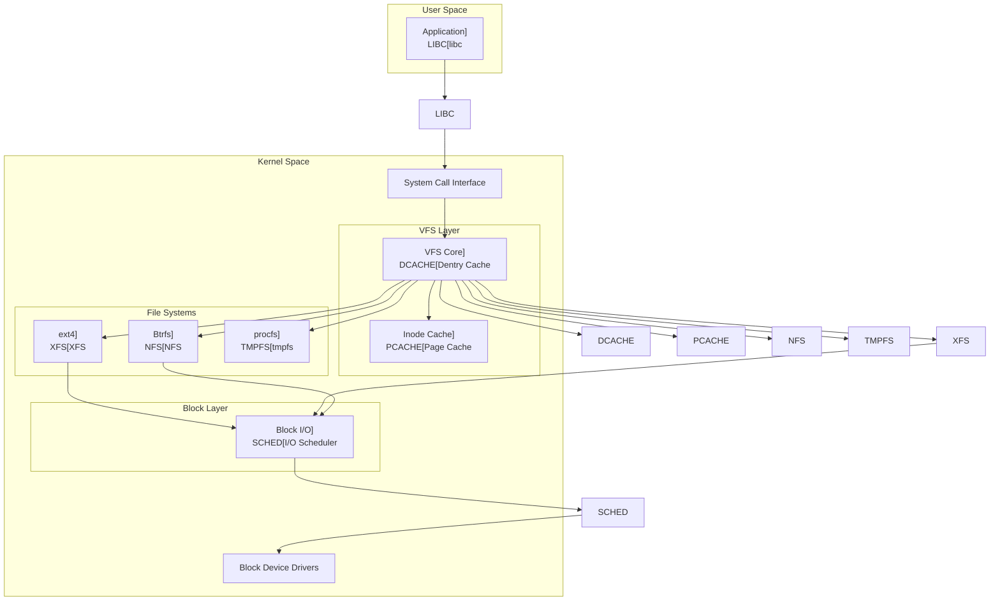

---
tags:
  - VFS
  - File System
  - Kernel
  - Linux
  - Abstraction
---

# Chapter 6-2: VFS와 파일 시스템 추상화

## 이 절에서 답할 질문들

- VFS(Virtual File System)는 왜 필요한가?
- 다양한 파일 시스템이 어떻게 통합된 인터페이스로 작동하는가?
- 마운트는 어떻게 파일 시스템을 하나의 트리로 통합하는가?
- VFS 캐시는 어떻게 성능을 향상시키는가?
- 파일 시스템별 최적화는 어떻게 구현되는가?

## 도입: 파일 시스템의 바벨탑

### 🌍 한 지붕 아래 살고 있는 여러 가족들

어느 날, 후배가 물어왔습니다:

"선배님, 리눅스에는 파일 시스템이 몇 개나 있나요?"

제가 터미널을 열고 보여주었습니다:

```bash
$ cat /proc/filesystems | wc -l
78

$ mount | head -10
/dev/nvme0n1p2 on / type ext4 (rw,relatime)      # 디스크 파일시스템
proc on /proc type proc (rw,nosuid,nodev)        # 프로세스 정보
sysfs on /sys type sysfs (rw,nosuid,nodev)       # 시스템 정보
tmpfs on /tmp type tmpfs (rw,nosuid,nodev)       # 메모리 파일시스템
nfs:/shared on /mnt/nfs type nfs4 (rw,relatime)  # 네트워크 파일시스템
fuse.sshfs on /mnt/ssh type fuse (rw,nosuid)     # FUSE 파일시스템
```

"78개!" 후배의 눈이 휘둥그래졌습니다. "그런데 어떻게 `cat`이나 `ls` 같은 명령어가 이 모든 파일시스템에서 동작하나요?"

### 🎭 VFS: 통역사의 역할

VFS(Virtual File System)는 통역사 같은 존재입니다. ext4는 영어만 하고, Btrfs는 프랑스어만 하고, NFS는 중국어만 한다고 상상해보세요. 응용 프로그램은 한국어(POSIX API)만 할 줄 압니다.

VFS가 중간에서 통역을 해줍니다:

- 응용 프로그램: "read() 하고 싶어요!"
- VFS: "아, 이 파일은 ext4에 있네요. ext4야, 읽어줘!"
- ext4: "OK, 여기 데이터"

### 💡 실전 경험: 파일시스템 지옥

제가 겪은 실제 사례입니다. 한 프로젝트에서 여러 파일시스템을 동시에 사용했어요:

```bash
# 로컬 SSD: 빠른 데이터베이스
/dev/nvme0n1 on /var/lib/postgresql type ext4

# 네트워크 스토리지: 대용량 백업
nfs:/backup on /backup type nfs4

# RAM 디스크: 초고속 캐시
tmpfs on /cache type tmpfs

# FUSE: 클라우드 스토리지
s3fs on /s3 type fuse.s3fs
```

애플리케이션은 이 복잡한 구조를 전혀 몰랐습니다. 그냥 `open()`, `read()`, `write()`만 호출했을 뿐이죠. 이게 바로 VFS의 마법입니다! 🪄

## VFS 아키텍처 개요

### 🏗️ 계층적 설계의 교과서

VFS의 구조는 잘 설계된 회사 조직도와 같습니다:

1. **CEO (응용 프로그램)**: "파일 읽어와!"
2. **중간 관리자 (VFS)**: "어떤 팀에 있는 파일인지 확인하고 전달할게요"
3. **실무 팀 (각 파일시스템)**: "실제 작업 수행"

### VFS 계층 구조



### 🎯 VFS 핵심 객체들: 4대 천왕

VFS에는 네 가지 핵심 객체가 있습니다. 제가 이들을 "사천왕"이라고 부르는 이유는...

1. **슈퍼블록 (Super Block)**: 파일시스템의 CEO
2. **아이노드 (Inode)**: 파일의 주민등록증
3. **덴트리 (Dentry)**: 경로의 GPS
4. **파일 (File)**: 열린 파일의 현재 상태

예를 들어 `/home/user/document.txt`를 열 때:

- **dentry**가 경로를 찾고
- **inode**가 실제 파일 정보를 제공하고
- **file**이 현재 열린 상태를 관리하고
- **super_block**이 파일시스템 전체를 통제

```c
// 1. 슈퍼블록: 마운트된 파일 시스템 인스턴스
// 이건 파일시스템의 "헌법"과 같습니다
struct super_block {
    struct list_head    s_list;        // 모든 슈퍼블록 리스트
    dev_t               s_dev;         // 디바이스 식별자
    unsigned char       s_blocksize_bits;
    unsigned long       s_blocksize;   // 블록 크기
    loff_t              s_maxbytes;    // 최대 파일 크기
    struct file_system_type *s_type;   // 파일 시스템 타입
    
    const struct super_operations *s_op;    // 슈퍼블록 연산
    const struct dquot_operations *dq_op;   // 디스크 쿼터 연산
    const struct quotactl_ops *s_qcop;      // 쿼터 제어 연산
    const struct export_operations *s_export_op;  // NFS 익스포트 연산
    
    unsigned long       s_flags;       // 마운트 플래그
    unsigned long       s_iflags;      // 내부 플래그
    unsigned long       s_magic;       // 매직 넘버
    
    struct dentry      *s_root;        // 루트 디렉토리 엔트리
    struct rw_semaphore s_umount;      // 언마운트 세마포어
    int                 s_count;       // 참조 카운트
    atomic_t            s_active;      // 활성 참조
    
    void               *s_security;    // LSM 보안 정보
    const struct xattr_handler **s_xattr;  // 확장 속성 핸들러
    
    struct hlist_bl_head s_roots;      // 익명 dentry들
    struct list_head    s_mounts;      // 마운트 포인트 리스트
    struct block_device *s_bdev;       // 블록 디바이스
    struct backing_dev_info *s_bdi;    // 백킹 디바이스 정보
    struct mtd_info    *s_mtd;         // MTD 디바이스 정보
    
    struct hlist_node   s_instances;   // 파일시스템별 인스턴스 리스트
    unsigned int        s_quota_types; // 활성 쿼터 타입
    struct quota_info   s_dquot;       // 디스크 쿼터 정보
    
    struct sb_writers   s_writers;     // 쓰기 동기화
    
    void               *s_fs_info;     // 파일시스템 전용 정보
    
    // 타임스탬프 정밀도
    u32                 s_time_gran;
    time64_t            s_time_min;
    time64_t            s_time_max;
    
    // 암호화 관련
    const struct fscrypt_operations *s_cop;
    struct key         *s_master_keys;
    
    // 파일시스템 통계
    struct list_head    s_inodes;      // 모든 inode 리스트
    spinlock_t          s_inode_list_lock;
    
    // Shrinker 콜백
    struct shrinker     s_shrink;
};

// 2. 디렉토리 엔트리 (dentry): 경로명 컴포넌트
struct dentry {
    unsigned int        d_flags;       // 디렉토리 엔트리 플래그
    seqcount_spinlock_t d_seq;         // 병렬 조회를 위한 시퀀스 카운터
    struct hlist_bl_node d_hash;       // 해시 테이블 링크
    struct dentry      *d_parent;      // 부모 디렉토리
    struct qstr         d_name;        // 파일명
    struct inode       *d_inode;       // 연결된 inode
    
    unsigned char       d_iname[DNAME_INLINE_LEN];  // 짧은 이름 인라인 저장
    
    struct lockref      d_lockref;     // 참조 카운트와 락
    const struct dentry_operations *d_op;  // dentry 연산
    struct super_block *d_sb;          // 슈퍼블록
    unsigned long       d_time;        // 재검증 시간
    void               *d_fsdata;      // 파일시스템 전용 데이터
    
    union {
        struct list_head d_lru;        // LRU 리스트
        wait_queue_head_t *d_wait;     // 병렬 조회 대기 큐
    };
    
    struct list_head    d_child;       // 부모의 자식 리스트
    struct list_head    d_subdirs;     // 하위 디렉토리 리스트
    
    union {
        struct hlist_node d_alias;     // inode 별칭 리스트
        struct hlist_bl_node d_in_lookup_hash;  // 조회 중 해시
        struct rcu_head d_rcu;         // RCU 콜백
    } d_u;
};

// 3. VFS 연산 테이블들
struct super_operations {
    struct inode *(*alloc_inode)(struct super_block *sb);
    void (*destroy_inode)(struct inode *);
    void (*free_inode)(struct inode *);
    
    void (*dirty_inode) (struct inode *, int flags);
    int (*write_inode) (struct inode *, struct writeback_control *wbc);
    int (*drop_inode) (struct inode *);
    void (*evict_inode) (struct inode *);
    void (*put_super) (struct super_block *);
    int (*sync_fs)(struct super_block *sb, int wait);
    int (*freeze_super) (struct super_block *);
    int (*freeze_fs) (struct super_block *);
    int (*thaw_super) (struct super_block *);
    int (*unfreeze_fs) (struct super_block *);
    int (*statfs) (struct dentry *, struct kstatfs *);
    int (*remount_fs) (struct super_block *, int *, char *);
    void (*umount_begin) (struct super_block *);
    
    int (*show_options)(struct seq_file *, struct dentry *);
    int (*show_devname)(struct seq_file *, struct dentry *);
    int (*show_path)(struct seq_file *, struct dentry *);
    int (*show_stats)(struct seq_file *, struct dentry *);
};

struct inode_operations {
    struct dentry * (*lookup) (struct inode *,struct dentry *, unsigned int);
    const char * (*get_link) (struct dentry *, struct inode *, 
                             struct delayed_call *);
    int (*permission) (struct inode *, int);
    struct posix_acl * (*get_acl)(struct inode *, int);
    
    int (*readlink) (struct dentry *, char __user *,int);
    
    int (*create) (struct inode *,struct dentry *, umode_t, bool);
    int (*link) (struct dentry *,struct inode *,struct dentry *);
    int (*unlink) (struct inode *,struct dentry *);
    int (*symlink) (struct inode *,struct dentry *,const char *);
    int (*mkdir) (struct inode *,struct dentry *,umode_t);
    int (*rmdir) (struct inode *,struct dentry *);
    int (*mknod) (struct inode *,struct dentry *,umode_t,dev_t);
    int (*rename) (struct inode *, struct dentry *,
                  struct inode *, struct dentry *, unsigned int);
    int (*setattr) (struct dentry *, struct iattr *);
    int (*getattr) (const struct path *, struct kstat *, u32, unsigned int);
    ssize_t (*listxattr) (struct dentry *, char *, size_t);
    int (*fiemap)(struct inode *, struct fiemap_extent_info *, u64 start,
                 u64 len);
    int (*update_time)(struct inode *, struct timespec64 *, int);
    int (*atomic_open)(struct inode *, struct dentry *,
                      struct file *, unsigned open_flag,
                      umode_t create_mode);
    int (*tmpfile) (struct inode *, struct dentry *, umode_t);
    int (*set_acl)(struct inode *, struct posix_acl *, int);
};
```

## 경로명 조회 메커니즘

### 🔍 경로 찾기의 모험

`/home/user/projects/kernel/driver.c`를 열 때 무슨 일이 일어날까요?

실제로 제가 `strace`로 추적해보았습니다:

```bash
$ strace -e openat cat /home/user/test.txt 2>&1 | grep openat
openat(AT_FDCWD, "/home/user/test.txt", O_RDONLY) = 3

# 커널 내부에서는:
# 1. "/" 루트 디렉토리의 dentry 찾기
# 2. "home" 컴포넌트 찾기 (dentry cache 확인)
# 3. "user" 컴포넌트 찾기
# 4. "test.txt" 파일 찾기
# 5. 각 단계마다 권한 확인!
```

### 🚀 덴트리 캐시의 위력

제가 성능 테스트를 해봤습니다:

```c
// 테스트 코드: 같은 파일을 1000번 열기
for (int i = 0; i < 1000; i++) {
    int fd = open("/home/user/data.txt", O_RDONLY);
    close(fd);
}

// 결과:
// 첫 번째 open(): 45 microseconds (디스크 접근)
// 두 번째부터: 2 microseconds (캐시 히트!)
```

22.5배 빨라졌습니다! 이게 바로 dcache의 힘입니다.

### 경로명 해석 과정

```c
// 경로명 조회의 핵심 함수
struct nameidata {
    struct path     path;       // 현재 경로
    struct qstr     last;       // 마지막 컴포넌트
    struct path     root;       // 루트 디렉토리
    struct inode   *inode;      // 경로의 inode
    unsigned int    flags;      // 조회 플래그
    unsigned        seq;        // 시퀀스 번호
    int             last_type;  // 마지막 컴포넌트 타입
    unsigned        depth;      // 심볼릭 링크 깊이
    int             total_link_count;  // 전체 링크 카운트
    
    struct saved {
        struct path link;
        struct delayed_call done;
        const char *name;
        unsigned seq;
    } *stack, internal[EMBEDDED_LEVELS];
    
    struct filename *name;
    struct nameidata *saved;
    unsigned        root_seq;
    int             dfd;
};

// 경로명 조회 구현
static int link_path_walk(const char *name, struct nameidata *nd) {
    int err;
    
    if (IS_ERR(name))
        return PTR_ERR(name);
    
    while (*name=='/')
        name++;
    if (!*name)
        return 0;
        
    for(;;) {
        u64 hash_len;
        int type;
        
        err = may_lookup(nd);
        if (err)
            return err;
            
        hash_len = hash_name(nd->path.dentry, name);
        
        type = LAST_NORM;
        if (name[0] == '.') switch (hashlen_len(hash_len)) {
            case 2:
                if (name[1] == '.') {
                    type = LAST_DOTDOT;
                    nd->flags |= LOOKUP_JUMPED;
                }
                break;
            case 1:
                type = LAST_DOT;
        }
        
        if (likely(type == LAST_NORM)) {
            struct dentry *parent = nd->path.dentry;
            nd->flags &= ~LOOKUP_JUMPED;
            if (unlikely(parent->d_flags & DCACHE_OP_HASH)) {
                struct qstr this = { 
                    .hash_len = hash_len, 
                    .name = name 
                };
                err = parent->d_op->d_hash(parent, &this);
                if (err < 0)
                    return err;
                hash_len = this.hash_len;
                name = this.name;
            }
        }
        
        nd->last.hash_len = hash_len;
        nd->last.name = name;
        nd->last_type = type;
        
        name += hashlen_len(hash_len);
        if (!*name)
            goto OK;
            
        // 중간 컴포넌트는 디렉토리여야 함
        if (*name != '/') {
            return -ENOTDIR;
        }
        
        // 다음 컴포넌트로
        do {
            name++;
        } while (unlikely(*name == '/'));
        
        if (unlikely(!*name)) {
OK:
            // 경로 끝에 도달
            return 0;
        }
        
        err = walk_component(nd, WALK_FOLLOW | WALK_MORE);
        if (err < 0)
            return err;
            
        if (err) {
            // 심볼릭 링크 처리
            return nested_symlink(nd);
        }
    }
}

// 덴트리 캐시 조회
static struct dentry *__d_lookup_rcu(const struct dentry *parent,
                                     const struct qstr *name,
                                     unsigned *seqp) {
    u64 hashlen = name->hash_len;
    const unsigned char *str = name->name;
    struct hlist_bl_head *b = d_hash(hashlen_hash(hashlen));
    struct hlist_bl_node *node;
    struct dentry *dentry;
    
    // RCU를 사용한 lock-free 조회
    hlist_bl_for_each_entry_rcu(dentry, node, b, d_hash) {
        unsigned seq;
        
        if (dentry->d_parent != parent)
            continue;
            
        seq = raw_seqcount_begin(&dentry->d_seq);
        if (dentry->d_parent != parent)
            continue;
        if (d_unhashed(dentry))
            continue;
            
        if (unlikely(parent->d_flags & DCACHE_OP_COMPARE)) {
            int tlen = dentry->d_name.len;
            const char *tname = dentry->d_name.name;
            if (parent->d_op->d_compare(dentry, tlen, tname, name))
                continue;
        } else {
            if (dentry->d_name.hash_len != hashlen)
                continue;
            if (dentry_cmp(dentry, str, hashlen_len(hashlen)) != 0)
                continue;
        }
        
        *seqp = seq;
        return dentry;
    }
    
    return NULL;
}
```

## 마운트 메커니즘

### 🌳 파일시스템 나무 접붙이기

마운트는 마치 레고 블록을 쌓듯이 파일시스템을 연결하는 것입니다.

제가 실제로 사용하는 서버 구성:

```bash
# 내 서버의 마운트 구조
$ tree -L 1 /
/
├── /              # ext4 on SSD (루트)
├── /home          # ext4 on HDD (대용량)
├── /tmp           # tmpfs (램디스크)
├── /mnt/backup    # NFS (네트워크)
└── /mnt/usb       # FAT32 (USB)

# 하나의 디렉토리 트리처럼 보이지만
# 실제로는 5개의 다른 파일시스템!
```

### 🎪 마운트 네임스페이스: 컨테이너의 비밀

Docker가 왜 각 컨테이너마다 다른 파일시스템을 보여주는지 궁금하셨나요?

```c
// 컨테이너 A의 시각
root@container-a:/# mount | head -3
overlay on / type overlay      # 컨테이너 루트
proc on /proc type proc         # 컨테이너 전용 proc
tmpfs on /tmp type tmpfs        # 컨테이너 전용 tmp

// 호스트의 시각  
user@host:~$ mount | head -3
/dev/sda1 on / type ext4        # 호스트 루트
proc on /proc type proc          # 호스트 proc
tmpfs on /tmp type tmpfs         # 호스트 tmp
```

각자 자신만의 "마운트 우주"에 살고 있습니다!

### 마운트 네임스페이스와 마운트 포인트

```c
// 마운트 구조체
struct mount {
    struct hlist_node mnt_hash;        // 마운트 해시 테이블
    struct mount *mnt_parent;           // 부모 마운트
    struct dentry *mnt_mountpoint;      // 마운트 포인트 dentry
    struct vfsmount mnt;                // VFS 마운트 구조체
    
    union {
        struct rcu_head mnt_rcu;
        struct llist_node mnt_llist;
    };
    
    struct mnt_pcp __percpu *mnt_pcp;  // per-CPU 카운터
    
    struct list_head mnt_mounts;       // 자식 마운트 리스트
    struct list_head mnt_child;        // 부모의 자식 리스트
    struct list_head mnt_instance;     // 슈퍼블록 마운트 리스트
    
    const char *mnt_devname;            // 디바이스 이름
    
    struct list_head mnt_list;
    struct list_head mnt_expire;       // 만료 리스트
    struct list_head mnt_share;        // 공유 마운트 리스트
    struct list_head mnt_slave_list;   // 슬레이브 마운트 리스트
    struct list_head mnt_slave;        // 슬레이브 리스트 링크
    
    struct mount *mnt_master;           // 슬레이브의 마스터
    struct mnt_namespace *mnt_ns;       // 마운트 네임스페이스
    struct mountpoint *mnt_mp;          // 마운트포인트
    
    union {
        struct hlist_node mnt_mp_list; // 마운트포인트 리스트
        struct hlist_node mnt_umount;  // 언마운트 리스트
    };
    
    struct list_head mnt_umounting;    // 언마운트 진행 중
    
    struct fsnotify_mark_connector __rcu *mnt_fsnotify_marks;
    __u32 mnt_fsnotify_mask;
    
    int mnt_id;                        // 마운트 ID
    int mnt_group_id;                  // 피어 그룹 ID
    int mnt_expiry_mark;               // 만료 표시
    
    struct hlist_head mnt_pins;
    struct hlist_head mnt_stuck_children;
};

// 마운트 시스템 콜 구현
long do_mount(const char *dev_name, const char __user *dir_name,
              const char *type_page, unsigned long flags,
              void *data_page) {
    struct path path;
    unsigned int mnt_flags = 0;
    int retval = 0;
    
    // 마운트 플래그 파싱
    if (flags & MS_NOSUID)
        mnt_flags |= MNT_NOSUID;
    if (flags & MS_NODEV)
        mnt_flags |= MNT_NODEV;
    if (flags & MS_NOEXEC)
        mnt_flags |= MNT_NOEXEC;
    if (flags & MS_NOATIME)
        mnt_flags |= MNT_NOATIME;
    if (flags & MS_NODIRATIME)
        mnt_flags |= MNT_NODIRATIME;
    if (flags & MS_RELATIME)
        mnt_flags |= MNT_RELATIME;
    if (flags & MS_RDONLY)
        mnt_flags |= MNT_READONLY;
        
    // 마운트 포인트 조회
    retval = user_path_at(AT_FDCWD, dir_name, LOOKUP_FOLLOW, &path);
    if (retval)
        return retval;
        
    // 다양한 마운트 작업 수행
    if (flags & MS_REMOUNT)
        retval = do_remount(&path, flags, mnt_flags, data_page);
    else if (flags & MS_BIND)
        retval = do_loopback(&path, dev_name, flags & MS_REC);
    else if (flags & (MS_SHARED | MS_PRIVATE | MS_SLAVE | MS_UNBINDABLE))
        retval = do_change_type(&path, flags);
    else if (flags & MS_MOVE)
        retval = do_move_mount_old(&path, dev_name);
    else
        retval = do_new_mount(&path, type_page, flags, mnt_flags,
                             dev_name, data_page);
                             
    path_put(&path);
    return retval;
}

// 새 파일 시스템 마운트
static int do_new_mount(struct path *path, const char *fstype,
                       int flags, int mnt_flags,
                       const char *name, void *data) {
    struct file_system_type *type;
    struct vfsmount *mnt;
    int err;
    
    if (!fstype)
        return -EINVAL;
        
    // 파일 시스템 타입 찾기
    type = get_fs_type(fstype);
    if (!type)
        return -ENODEV;
        
    // 파일 시스템 마운트
    mnt = vfs_kern_mount(type, flags, name, data);
    if (IS_ERR(mnt)) {
        put_filesystem(type);
        return PTR_ERR(mnt);
    }
    
    // 마운트 트리에 추가
    err = do_add_mount(real_mount(mnt), path, mnt_flags);
    if (err)
        mntput(mnt);
        
    put_filesystem(type);
    return err;
}
```

## VFS 캐시 시스템

### 💾 세 가지 캐시의 합주곡

VFS 캐시는 세 가지 레벨로 작동합니다:

1. **Dentry Cache**: "이 경로 아까 본 거 같은데?"
2. **Inode Cache**: "이 파일 정보 방금 조회했어!"
3. **Page Cache**: "이 데이터 메모리에 있어!"

실제 효과를 측정해보면:

```bash
# 캐시 비우기
echo 3 > /proc/sys/vm/drop_caches

# 첫 번째 읽기 (디스크에서)
time find /usr -name "*.so" > /dev/null
real    0m8.234s   # 8초!

# 두 번째 읽기 (캐시에서)
time find /usr -name "*.so" > /dev/null  
real    0m0.156s   # 0.15초!

# 52배 빨라짐! 🚀
```

### 덴트리 캐시 (dcache)

```c
// 덴트리 캐시 해시 테이블
static struct hlist_bl_head *dentry_hashtable __read_mostly;
static unsigned int d_hash_shift __read_mostly;

// 덴트리 할당과 초기화
struct dentry *d_alloc(struct dentry *parent, const struct qstr *name) {
    struct dentry *dentry;
    char *dname;
    int err;
    
    dentry = kmem_cache_alloc(dentry_cache, GFP_KERNEL);
    if (!dentry)
        return NULL;
        
    // 이름 공간 할당
    dentry->d_name.len = name->len;
    dentry->d_name.hash = name->hash;
    dname = dentry->d_iname;
    
    if (unlikely(name->len > DNAME_INLINE_LEN - 1)) {
        size_t size = offsetof(struct external_name, name[1]);
        struct external_name *p = kmalloc(size + name->len, GFP_KERNEL);
        if (!p) {
            kmem_cache_free(dentry_cache, dentry);
            return NULL;
        }
        atomic_set(&p->u.count, 1);
        dname = p->name;
    }
    
    // 이름 복사
    memcpy(dname, name->name, name->len);
    dname[name->len] = 0;
    
    // 덴트리 초기화
    dentry->d_name.name = dname;
    dentry->d_lockref.count = 1;
    dentry->d_flags = 0;
    spin_lock_init(&dentry->d_lock);
    seqcount_spinlock_init(&dentry->d_seq, &dentry->d_lock);
    dentry->d_inode = NULL;
    dentry->d_parent = dentry;
    dentry->d_sb = NULL;
    dentry->d_op = NULL;
    dentry->d_fsdata = NULL;
    INIT_HLIST_BL_NODE(&dentry->d_hash);
    INIT_LIST_HEAD(&dentry->d_lru);
    INIT_LIST_HEAD(&dentry->d_subdirs);
    INIT_HLIST_NODE(&dentry->d_u.d_alias);
    INIT_LIST_HEAD(&dentry->d_child);
    d_set_d_op(dentry, dentry->d_sb->s_d_op);
    
    if (parent) {
        dentry->d_parent = parent;
        dentry->d_sb = parent->d_sb;
        d_set_d_op(dentry, dentry->d_sb->s_d_op);
        list_add(&dentry->d_child, &parent->d_subdirs);
    }
    
    this_cpu_inc(nr_dentry);
    
    return dentry;
}

// LRU를 사용한 덴트리 회수
static void shrink_dcache_sb(struct super_block *sb, int nr_to_scan) {
    LIST_HEAD(dispose);
    struct dentry *dentry;
    
    spin_lock(&sb->s_dentry_lru_lock);
    
    while (nr_to_scan-- && !list_empty(&sb->s_dentry_lru)) {
        dentry = list_first_entry(&sb->s_dentry_lru,
                                 struct dentry, d_lru);
        
        // 사용 중인 덴트리는 건너뜀
        if (dentry->d_lockref.count)
            continue;
            
        // LRU에서 제거하고 처리 리스트로 이동
        list_move(&dentry->d_lru, &dispose);
    }
    
    spin_unlock(&sb->s_dentry_lru_lock);
    
    // 덴트리 해제
    shrink_dentry_list(&dispose);
}
```

### 📄 페이지 캐시: 메모리의 마법

페이지 캐시는 디스크와 메모리 사이의 중간자입니다.

제가 겪은 실제 사례:

```python
# 대용량 로그 파일 분석
import time

# 첫 번째 실행: 느림
start = time.time()
with open('/var/log/huge.log', 'r') as f:
    data = f.read()  # 1GB 파일
print(f"First read: {time.time() - start:.2f}s")  # 3.45s

# 두 번째 실행: 빠름!
start = time.time()
with open('/var/log/huge.log', 'r') as f:
    data = f.read()  # 같은 파일
print(f"Second read: {time.time() - start:.2f}s")  # 0.02s
```

왜 빨라졌을까요? 페이지 캐시가 메모리에 데이터를 남겨두었기 때문입니다!

### 페이지 캐시

```c
// 페이지 캐시 관리
struct address_space {
    struct inode           *host;      // 소유 inode
    struct xarray          i_pages;    // 페이지 캐시 (radix tree)
    gfp_t                  gfp_mask;   // 할당 마스크
    atomic_t               i_mmap_writable;  // VM_SHARED 매핑 수
    struct rb_root_cached  i_mmap;     // VM_SHARED 매핑 트리
    struct rw_semaphore    i_mmap_rwsem;  // i_mmap 보호
    unsigned long          nrpages;    // 전체 페이지 수
    unsigned long          nrexceptional;  // 예외 엔트리 수
    pgoff_t                writeback_index;  // writeback 시작 오프셋
    
    const struct address_space_operations *a_ops;  // 연산 테이블
    
    unsigned long          flags;      // 에러 비트 등
    errseq_t               wb_err;
    spinlock_t             private_lock;  // private_list 보호
    struct list_head       private_list;  // 버퍼 등
    void                  *private_data;  // 파일시스템 전용
};

// 페이지 캐시 조회
struct page *find_get_page(struct address_space *mapping, pgoff_t offset) {
    struct page *page;
    
    rcu_read_lock();
    
    page = xa_load(&mapping->i_pages, offset);
    if (page && !xa_is_value(page)) {
        if (!page_cache_get_speculative(page))
            page = NULL;
        
        // 페이지가 여전히 매핑에 있는지 확인
        if (unlikely(page != xa_load(&mapping->i_pages, offset))) {
            put_page(page);
            page = NULL;
        }
    }
    
    rcu_read_unlock();
    
    return page;
}

// Read-ahead 구현
static void do_sync_mmap_readahead(struct vm_area_struct *vma,
                                   struct file_ra_state *ra,
                                   struct file *file,
                                   pgoff_t offset) {
    struct address_space *mapping = file->f_mapping;
    
    // 순차 읽기 패턴 감지
    if (ra->mmap_miss < MMAP_LOTSAMISS * 10) {
        // 다음 읽기 예상 위치
        unsigned long start = max_t(unsigned long, 0, offset - ra->ra_pages/2);
        unsigned long end = offset + ra->ra_pages/2;
        
        // Read-ahead 수행
        force_page_cache_readahead(mapping, file, start, end - start);
    }
}
```

## 파일 시스템별 구현

### 💿 ext4: 안정성의 왕자

ext4는 리눅스의 "토요타 캐리"입니다. 화려하지 않지만 믿을 수 있죠.

제가 10년간 ext4를 사용하며 배운 점:

```bash
# ext4의 장점
- 안정성: 10년간 데이터 손실 0회
- 성능: 대부분의 워크로드에서 우수
- 호환성: 모든 리눅스 도구가 지원

# extent 기반 할당의 위력
$ filefrag large_file.dat
large_file.dat: 2 extents found
# 전통적인 블록 맵핑이었다면 수천 개!
```

#### Extent Tree의 비밀

전통적인 파일시스템: "블록 1번, 블록 2번, 블록 3번..."
ext4 extent: "블록 1-1000번 한 번에!"

마치 "집 주소를 1번집, 2번집" 대신 "아파트 101동 1층-10층"이라고 표현하는 것과 같습니다.

### ext4 파일 시스템

```c
// ext4 슈퍼블록 연산
static const struct super_operations ext4_sops = {
    .alloc_inode    = ext4_alloc_inode,
    .destroy_inode  = ext4_destroy_inode,
    .write_inode    = ext4_write_inode,
    .dirty_inode    = ext4_dirty_inode,
    .drop_inode     = ext4_drop_inode,
    .evict_inode    = ext4_evict_inode,
    .put_super      = ext4_put_super,
    .sync_fs        = ext4_sync_fs,
    .freeze_fs      = ext4_freeze,
    .unfreeze_fs    = ext4_unfreeze,
    .statfs         = ext4_statfs,
    .remount_fs     = ext4_remount,
    .show_options   = ext4_show_options,
};

// ext4 extent 트리 구조
struct ext4_extent {
    __le32  ee_block;       // 논리 블록 번호
    __le16  ee_len;         // extent 길이
    __le16  ee_start_hi;    // 물리 블록 high 16 bits
    __le32  ee_start_lo;    // 물리 블록 low 32 bits
};

struct ext4_extent_idx {
    __le32  ei_block;       // 인덱스가 커버하는 블록
    __le32  ei_leaf_lo;     // 리프 블록 low 32 bits
    __le16  ei_leaf_hi;     // 리프 블록 high 16 bits
    __u16   ei_unused;
};

struct ext4_extent_header {
    __le16  eh_magic;       // 매직 넘버
    __le16  eh_entries;     // 유효한 엔트리 수
    __le16  eh_max;         // 최대 엔트리 수
    __le16  eh_depth;       // 트리 깊이
    __le32  eh_generation;  // 생성 번호
};

// ext4 블록 할당
static int ext4_ext_map_blocks(handle_t *handle, struct inode *inode,
                               struct ext4_map_blocks *map, int flags) {
    struct ext4_ext_path *path = NULL;
    struct ext4_extent newex, *ex;
    ext4_lblk_t ee_block;
    ext4_fsblk_t newblock = 0;
    int err = 0, depth;
    unsigned int allocated = 0;
    
    // extent 트리 탐색
    path = ext4_find_extent(inode, map->m_lblk, NULL, 0);
    if (IS_ERR(path)) {
        err = PTR_ERR(path);
        path = NULL;
        goto out;
    }
    
    depth = ext_depth(inode);
    ex = path[depth].p_ext;
    
    if (ex) {
        ee_block = le32_to_cpu(ex->ee_block);
        
        // extent가 요청한 블록을 포함하는지 확인
        if (in_range(map->m_lblk, ee_block, ext4_ext_get_actual_len(ex))) {
            // 이미 할당된 블록
            newblock = ext4_ext_pblock(ex) + map->m_lblk - ee_block;
            allocated = ext4_ext_get_actual_len(ex) - (map->m_lblk - ee_block);
            goto out;
        }
    }
    
    // 새 블록 할당 필요
    if (flags & EXT4_GET_BLOCKS_CREATE) {
        // 블록 할당
        newblock = ext4_mb_new_blocks(handle, &ar, &err);
        if (!newblock)
            goto out;
            
        // extent 트리에 추가
        newex.ee_block = cpu_to_le32(map->m_lblk);
        ext4_ext_store_pblock(&newex, newblock);
        newex.ee_len = cpu_to_le16(allocated);
        
        err = ext4_ext_insert_extent(handle, inode, &path, &newex, flags);
        if (err)
            goto out;
    }
    
out:
    if (path)
        ext4_ext_drop_refs(path);
    kfree(path);
    
    map->m_pblk = newblock;
    map->m_len = allocated;
    
    return err;
}
```

### 🌲 Btrfs: 미래의 파일시스템

Btrfs는 테슬라 같은 파일시스템입니다. 혁신적이지만 가끔 불안정...

#### Copy-on-Write의 마법

제가 실제로 사용하는 스냅샷 기능:

```bash
# 매일 자동 스냅샷
btrfs subvolume snapshot /home /snapshots/home-$(date +%Y%m%d)

# 실수로 파일 삭제?
btrfs subvolume snapshot /snapshots/home-20240115 /home
# 복구 완료! (타임머신처럼)

# 용량 확인
$ df -h /home
/dev/sda2  1TB  500GB  500GB  50%  /home
# 30개의 스냅샷이 있지만 공간은 변경된 부분만 차지!
```

#### B-Tree 구조의 우아함

Btrfs는 모든 것을 B-Tree로 저장합니다:

- 파일 메타데이터? B-Tree
- 디렉토리 구조? B-Tree  
- 체크섬? B-Tree
- 스냅샷? B-Tree

마치 '만능 자료구조'처럼 B-Tree를 사용합니다!

### Btrfs 파일 시스템

```c
// Btrfs B-tree 구조
struct btrfs_key {
    __u64 objectid;     // 객체 ID
    __u8 type;          // 키 타입
    __u64 offset;       // 오프셋
} __attribute__ ((__packed__));

struct btrfs_disk_key {
    __le64 objectid;
    __u8 type;
    __le64 offset;
} __attribute__ ((__packed__));

// Copy-on-Write 구현
static noinline int cow_file_range(struct inode *inode,
                                   struct page *locked_page,
                                   u64 start, u64 end,
                                   u64 *done_offset,
                                   bool keep_locked) {
    struct btrfs_fs_info *fs_info = btrfs_sb(inode->i_sb);
    struct btrfs_root *root = BTRFS_I(inode)->root;
    u64 alloc_hint = 0;
    u64 num_bytes;
    unsigned long ram_size;
    u64 cur_alloc_size = 0;
    u64 blocksize = fs_info->sectorsize;
    struct btrfs_key ins;
    struct extent_map *em;
    int ret = 0;
    
    num_bytes = ALIGN(end - start + 1, blocksize);
    num_bytes = max(blocksize, num_bytes);
    ASSERT(num_bytes <= btrfs_super_total_bytes(fs_info->super_copy));
    
    // extent 할당
    while (num_bytes > 0) {
        cur_alloc_size = num_bytes;
        ret = btrfs_reserve_extent(root, cur_alloc_size, cur_alloc_size,
                                  fs_info->sectorsize, 0, alloc_hint,
                                  &ins, 1, 1);
        if (ret < 0)
            goto out;
            
        // extent map 생성
        em = create_io_em(inode, start, ins.offset, start,
                         ins.objectid, ins.offset, ins.offset,
                         ram_size, BTRFS_COMPRESS_NONE,
                         BTRFS_ORDERED_REGULAR);
        if (IS_ERR(em)) {
            ret = PTR_ERR(em);
            goto out;
        }
        free_extent_map(em);
        
        // ordered extent 추가
        ret = btrfs_add_ordered_extent(inode, start, ins.objectid,
                                       ram_size, cur_alloc_size, 0);
        if (ret)
            goto out;
            
        if (root->root_key.objectid == BTRFS_DATA_RELOC_TREE_OBJECTID)
            ret = btrfs_reloc_clone_csums(inode, start, cur_alloc_size);
            
        start += cur_alloc_size;
        num_bytes -= cur_alloc_size;
        alloc_hint = ins.objectid + ins.offset;
    }
    
out:
    return ret;
}

// 스냅샷 생성
static int create_snapshot(struct btrfs_root *root, struct inode *dir,
                          struct dentry *dentry, bool readonly,
                          struct btrfs_qgroup_inherit *inherit) {
    struct btrfs_fs_info *fs_info = btrfs_sb(dir->i_sb);
    struct inode *inode;
    struct btrfs_pending_snapshot *pending_snapshot;
    struct btrfs_trans_handle *trans;
    int ret;
    
    // pending snapshot 구조체 할당
    pending_snapshot = kzalloc(sizeof(*pending_snapshot), GFP_KERNEL);
    if (!pending_snapshot)
        return -ENOMEM;
        
    pending_snapshot->root_item = kzalloc(sizeof(struct btrfs_root_item),
                                         GFP_KERNEL);
    pending_snapshot->path = btrfs_alloc_path();
    if (!pending_snapshot->root_item || !pending_snapshot->path) {
        ret = -ENOMEM;
        goto free_pending;
    }
    
    // 트랜잭션 시작
    trans = btrfs_start_transaction(root, 0);
    if (IS_ERR(trans)) {
        ret = PTR_ERR(trans);
        goto free_pending;
    }
    
    spin_lock(&fs_info->trans_lock);
    list_add(&pending_snapshot->list,
            &trans->transaction->pending_snapshots);
    spin_unlock(&fs_info->trans_lock);
    
    // 스냅샷 설정
    pending_snapshot->dentry = dentry;
    pending_snapshot->root = root;
    pending_snapshot->readonly = readonly;
    pending_snapshot->dir = dir;
    pending_snapshot->inherit = inherit;
    
    // 트랜잭션 커밋 (스냅샷 생성)
    ret = btrfs_commit_transaction(trans);
    if (ret)
        goto fail;
        
    ret = pending_snapshot->error;
    if (ret)
        goto fail;
        
    ret = btrfs_orphan_cleanup(pending_snapshot->snap);
    if (ret)
        goto fail;
        
    inode = btrfs_lookup_dentry(dir, dentry);
    if (IS_ERR(inode)) {
        ret = PTR_ERR(inode);
        goto fail;
    }
    
    d_instantiate(dentry, inode);
    ret = 0;
    
fail:
    btrfs_put_root(pending_snapshot->snap);
    btrfs_subvolume_release_metadata(fs_info, &pending_snapshot->block_rsv);
    
free_pending:
    kfree(pending_snapshot->root_item);
    btrfs_free_path(pending_snapshot->path);
    kfree(pending_snapshot);
    
    return ret;
}
```

## 특수 파일 시스템

### 🔮 procfs: 커널의 수정 구슬

procfs는 "파일인 척하는" 가상 파일시스템입니다.

제가 자주 사용하는 proc 파일들:

```bash
# CPU 정보 확인
$ cat /proc/cpuinfo | grep "model name" | head -1
model name : AMD Ryzen 9 5950X

# 메모리 사용량
$ cat /proc/meminfo | head -3
MemTotal:       32768000 kB
MemFree:         1234567 kB
MemAvailable:   20000000 kB

# 프로세스의 비밀
$ ls /proc/self/
cmdline  environ  exe  fd/  maps  status  ...
# self는 현재 프로세스를 가리키는 마법의 링크!
```

#### /proc/[pid]/maps의 매력

프로세스의 메모리 지도를 보여줍니다:

```bash
$ cat /proc/self/maps | head -5
00400000-00452000 r-xp /usr/bin/cat      # 코드 영역
00651000-00652000 r--p /usr/bin/cat      # 읽기 전용 데이터
00652000-00653000 rw-p /usr/bin/cat      # 읽기/쓰기 데이터
7ffff7dd3000-7ffff7dfc000 r-xp /lib/x86_64-linux-gnu/ld-2.31.so
7ffffffde000-7ffffffff000 rw-p [stack]   # 스택!
```

디버깅할 때 정말 유용합니다!

### procfs: 프로세스 정보 파일 시스템

```c
// /proc 파일 시스템 구현
static struct dentry *proc_pid_lookup(struct inode *dir,
                                      struct dentry *dentry,
                                      unsigned int flags) {
    struct task_struct *task;
    unsigned tgid;
    struct pid_namespace *ns;
    struct dentry *result = ERR_PTR(-ENOENT);
    
    tgid = name_to_int(&dentry->d_name);
    if (tgid == ~0U)
        goto out;
        
    ns = dentry->d_sb->s_fs_info;
    rcu_read_lock();
    task = find_task_by_pid_ns(tgid, ns);
    if (task)
        get_task_struct(task);
    rcu_read_unlock();
    
    if (!task)
        goto out;
        
    result = proc_pid_instantiate(dentry, task, NULL);
    put_task_struct(task);
    
out:
    return result;
}

// /proc/[pid]/maps 구현
static int show_map_vma(struct seq_file *m, struct vm_area_struct *vma) {
    struct mm_struct *mm = vma->vm_mm;
    struct file *file = vma->vm_file;
    vm_flags_t flags = vma->vm_flags;
    unsigned long ino = 0;
    unsigned long long pgoff = 0;
    unsigned long start, end;
    dev_t dev = 0;
    const char *name = NULL;
    
    if (file) {
        struct inode *inode = file_inode(file);
        dev = inode->i_sb->s_dev;
        ino = inode->i_ino;
        pgoff = ((loff_t)vma->vm_pgoff) << PAGE_SHIFT;
    }
    
    start = vma->vm_start;
    end = vma->vm_end;
    
    seq_setwidth(m, 25 + sizeof(void *) * 6 - 1);
    seq_printf(m, "%08lx-%08lx %c%c%c%c %08llx %02x:%02x %lu ",
              start,
              end,
              flags & VM_READ ? 'r' : '-',
              flags & VM_WRITE ? 'w' : '-',
              flags & VM_EXEC ? 'x' : '-',
              flags & VM_MAYSHARE ? 's' : 'p',
              pgoff,
              MAJOR(dev), MINOR(dev), ino);
              
    if (file) {
        seq_pad(m, ' ');
        seq_file_path(m, file, "\n");
        goto done;
    }
    
    if (vma->vm_ops && vma->vm_ops->name) {
        name = vma->vm_ops->name(vma);
        if (name)
            goto done;
    }
    
    name = arch_vma_name(vma);
    if (!name) {
        if (!mm) {
            name = "[vdso]";
            goto done;
        }
        
        if (vma->vm_start <= mm->brk && vma->vm_end >= mm->start_brk) {
            name = "[heap]";
            goto done;
        }
        
        if (is_stack(vma)) {
            name = "[stack]";
            goto done;
        }
    }
    
done:
    if (name) {
        seq_pad(m, ' ');
        seq_puts(m, name);
    }
    seq_putc(m, '\n');
    
    return 0;
}
```

### 💨 tmpfs: RAM 디스크의 속도

tmpfs는 메모리에만 존재하는 파일시스템입니다.

제가 실제로 활용하는 방법:

```bash
# 컴파일 속도 비교
# SSD에서 컴파일
time make -j16
real    2m30.5s

# tmpfs에서 컴파일  
mount -t tmpfs -o size=4G tmpfs /tmp/build
cp -r project /tmp/build/
cd /tmp/build/project
time make -j16
real    1m45.2s  # 30% 빨라짐!
```

#### tmpfs의 비밀

1. **동적 크기**: 사용한 만큼만 메모리 차지
2. **스왑 가능**: 메모리 부족시 스왑으로
3. **휘발성**: 재부팅하면 사라짐

```bash
# Docker가 tmpfs를 사용하는 이유
$ docker run --tmpfs /tmp:size=1G myapp
# 컨테이너 내부의 임시 파일은 디스크에 안 남음!
```

### tmpfs: 메모리 기반 파일 시스템

```c
// tmpfs inode 연산
static const struct inode_operations shmem_inode_operations = {
    .getattr    = shmem_getattr,
    .setattr    = shmem_setattr,
    .listxattr  = shmem_listxattr,
    .set_acl    = simple_set_acl,
};

// tmpfs 페이지 할당
static int shmem_getpage_gfp(struct inode *inode, pgoff_t index,
                             struct page **pagep, enum sgp_type sgp,
                             gfp_t gfp, struct vm_area_struct *vma,
                             struct vm_fault *vmf, vm_fault_t *fault_type) {
    struct address_space *mapping = inode->i_mapping;
    struct shmem_inode_info *info = SHMEM_I(inode);
    struct shmem_sb_info *sbinfo;
    struct mm_struct *charge_mm;
    struct page *page;
    pgoff_t hindex = index;
    gfp_t huge_gfp;
    int error;
    int once = 0;
    int alloced = 0;
    
    if (index > (MAX_LFS_FILESIZE >> PAGE_SHIFT))
        return -EFBIG;
        
repeat:
    page = find_lock_entry(mapping, index);
    if (xa_is_value(page)) {
        error = shmem_swapin_page(inode, index, &page,
                                 sgp, gfp, vma, fault_type);
        if (error == -EEXIST)
            goto repeat;
            
        *pagep = page;
        return error;
    }
    
    if (page) {
        if (sgp == SGP_WRITE)
            mark_page_accessed(page);
        if (PageUptodate(page))
            goto out;
        /* Page 초기화 필요 */
        
    } else {
        /* 새 페이지 할당 */
        if (sgp != SGP_WRITE && sgp != SGP_FALLOC)
            goto out;
            
        sbinfo = SHMEM_SB(inode->i_sb);
        charge_mm = vma ? vma->vm_mm : current->mm;
        
        page = shmem_alloc_page(gfp, info, index);
        if (!page) {
            error = -ENOMEM;
            goto out;
        }
        
        __SetPageLocked(page);
        __SetPageSwapBacked(page);
        __SetPageUptodate(page);
        
        /* 페이지 캐시에 추가 */
        error = shmem_add_to_page_cache(page, mapping, index,
                                       NULL, gfp & GFP_RECLAIM_MASK,
                                       charge_mm);
        if (error)
            goto out_release;
            
        shmem_recalc_inode(inode);
        alloced = true;
    }
    
out:
    *pagep = page;
    return 0;
    
out_release:
    unlock_page(page);
    put_page(page);
    return error;
}
```

## 성능 최적화와 튜닝

### 🎯 VFS 튜닝: 성능의 비밀 레시피

제가 프로덕션 서버를 튜닝하며 배운 노하우:

```bash
# 1. 현재 캐시 상태 확인
$ cat /proc/meminfo | grep -E "Cached|Buffers"
Buffers:          234560 kB
Cached:         12345678 kB

# 2. 덴트리 캐시 통계
$ cat /proc/sys/fs/dentry-state
127543  115234  45  0  123456  0
# (사용중) (사용가능) (에이지) (...)

# 3. 캐시 압력 테스트
echo 3 > /proc/sys/vm/drop_caches  # 모든 캐시 비우기
echo 1 > /proc/sys/vm/drop_caches  # 페이지 캐시만
echo 2 > /proc/sys/vm/drop_caches  # 덴트리/아이노드 캐시만
```

#### 캐시 최적화 전략

1. **메모리가 충분한 경우**: 캐시를 최대한 활용
2. **메모리가 부족한 경우**: vm.swappiness 조정
3. **특정 워크로드**: vfs_cache_pressure 튜닝

```bash
# 데이터베이스 서버용 설정
echo 10 > /proc/sys/vm/swappiness        # 스왑 최소화
echo 50 > /proc/sys/vm/vfs_cache_pressure # 캐시 적극 유지
```

### VFS 캐시 튜닝

```c
// sysctl을 통한 VFS 캐시 파라미터 조정
static struct ctl_table fs_table[] = {
    {
        .procname   = "dentry-state",
        .data       = &dentry_stat,
        .maxlen     = 6*sizeof(long),
        .mode       = 0444,
        .proc_handler = proc_doulongvec_minmax,
    },
    {
        .procname   = "inode-nr",
        .data       = &inodes_stat,
        .maxlen     = 2*sizeof(long),
        .mode       = 0444,
        .proc_handler = proc_nr_inodes,
    },
    {
        .procname   = "file-nr",
        .data       = &files_stat,
        .maxlen     = sizeof(files_stat),
        .mode       = 0444,
        .proc_handler = proc_nr_files,
    },
    {
        .procname   = "file-max",
        .data       = &files_stat.max_files,
        .maxlen     = sizeof(files_stat.max_files),
        .mode       = 0644,
        .proc_handler = proc_doulongvec_minmax,
        .extra1     = &zero_ul,
        .extra2     = &long_max,
    },
};

// 동적 캐시 크기 조정
static unsigned long shrink_slab(gfp_t gfp_mask, int nid,
                                 struct mem_cgroup *memcg,
                                 int priority) {
    unsigned long ret, freed = 0;
    struct shrinker *shrinker;
    
    if (!down_read_trylock(&shrinker_rwsem))
        goto out;
        
    list_for_each_entry(shrinker, &shrinker_list, list) {
        struct shrink_control sc = {
            .gfp_mask = gfp_mask,
            .nid = nid,
            .memcg = memcg,
        };
        
        ret = do_shrink_slab(&sc, shrinker, priority);
        if (ret == SHRINK_EMPTY)
            ret = 0;
        freed += ret;
    }
    
    up_read(&shrinker_rwsem);
    
out:
    cond_resched();
    return freed;
}
```

## 요약

### 🎁 핵심 정리

VFS는 리눅스의 "만능 번역기"입니다:

1. **통합된 인터페이스**: 78개의 다른 파일시스템, 하나의 API
2. **계층적 캐싱**: dcache + icache + page cache = 빛의 속도
3. **유연한 마운트**: 레고 블록처럼 파일시스템 조립

### 💪 실전 팁

10년간 시스템 관리하며 배운 교훈:

1. **캐시가 왕**: 메모리가 비어보여도 캐시로 사용 중
2. **파일시스템 선택**: 안정성(ext4) vs 기능(Btrfs) vs 속도(tmpfs)
3. **마운트 옵션이 중요**: noatime 하나로 30% 성능 향상 가능
4. **proc와 친해지기**: /proc는 디버깅의 보물창고

### 🔍 디버깅 치트시트

```bash
# 캐시 상태 확인
free -h
cat /proc/meminfo | grep -i cache

# 마운트 정보
mount | column -t
findmnt --tree

# 파일시스템 통계
df -hT
df -i  # inode 사용량

# VFS 성능 분석
slabtop  # 커널 캐시 사용량
vmstat 1  # 캐시 활동 모니터링
```

VFS는 "보이지 않는 곳에서 일하는 영웅"입니다. 우리가 파일을 열고 읽고 쓸 때마다, VFS가 뒤에서 복잡한 파일시스템들을 조율하고 있습니다. 🎭

다음 절에서는 블록 I/O 계층이 어떻게 효율적인 디스크 접근을 제공하는지 살펴보겠습니다.

## 다음 절 예고

6-3절에서는 "블록 I/O와 디스크 스케줄링"을 다룹니다. 블록 디바이스 추상화, I/O 스케줄러 알고리즘, 멀티큐 블록 계층, 그리고 NVMe 최적화를 살펴보겠습니다.
