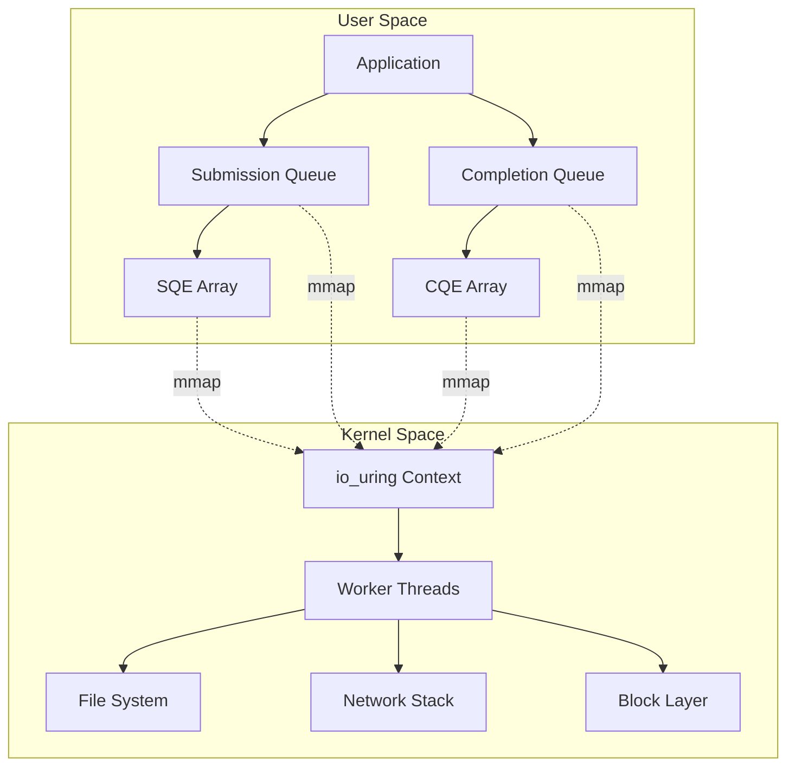

---
tags:
  - io_uring
  - Async I/O
  - Linux
  - High Performance
  - Zero-copy
---

# Chapter 6-4C: io_uring - 차세대 비동기 I/O

## io_uring: 차세대 비동기 I/O

### io_uring 아키텍처



### io_uring 구현

```c
// io_uring 설정
struct io_uring_params {
    __u32 sq_entries;
    __u32 cq_entries;
    __u32 flags;
    __u32 sq_thread_cpu;
    __u32 sq_thread_idle;
    __u32 features;
    __u32 wq_fd;
    __u32 resv[3];
    struct io_sqring_offsets sq_off;
    struct io_cqring_offsets cq_off;
};

// SQE (Submission Queue Entry)
struct io_uring_sqe {
    __u8    opcode;         // 연산 코드
    __u8    flags;          // SQE 플래그
    __u16   ioprio;         // I/O 우선순위
    __s32   fd;             // 파일 디스크립터
    union {
        __u64   off;        // 오프셋
        __u64   addr2;
    };
    union {
        __u64   addr;       // 버퍼 주소
        __u64   splice_off_in;
    };
    __u32   len;            // 버퍼 길이
    union {
        __kernel_rwf_t  rw_flags;
        __u32    fsync_flags;
        __u16    poll_events;
        __u32    poll32_events;
        __u32    sync_range_flags;
        __u32    msg_flags;
        __u32    timeout_flags;
        __u32    accept_flags;
        __u32    cancel_flags;
        __u32    open_flags;
        __u32    statx_flags;
        __u32    fadvise_advice;
        __u32    splice_flags;
        __u32    rename_flags;
        __u32    unlink_flags;
        __u32    hardlink_flags;
    };
    __u64   user_data;      // 사용자 데이터
    union {
        __u16   buf_index;
        __u16   buf_group;
    };
    __u16   personality;
    union {
        __s32   splice_fd_in;
        __u32   file_index;
    };
    __u64   __pad2[2];
};

// CQE (Completion Queue Entry)
struct io_uring_cqe {
    __u64   user_data;      // SQE의 user_data
    __s32   res;            // 결과 (성공 시 바이트 수, 실패 시 -errno)
    __u32   flags;
};

// io_uring 인스턴스
struct io_uring {
    struct io_uring_sq sq;
    struct io_uring_cq cq;
    unsigned flags;
    int ring_fd;
    
    unsigned features;
    int enter_ring_fd;
    __u8 int_flags;
    __u8 pad[3];
    unsigned pad2;
};

// io_uring 기반 비동기 서버
struct io_uring_server {
    struct io_uring ring;
    int listen_fd;
    
    // 버퍼 풀
    struct io_uring_buf_ring *buf_ring;
    char *buffer_base;
    size_t buffer_size;
    
    // 연결 관리
    struct connection *connections;
    int max_connections;
};

int io_uring_server_init(struct io_uring_server *server, int port) {
    struct io_uring_params params = {0};
    
    // io_uring 초기화
    params.flags = IORING_SETUP_SQPOLL |    // 커널 SQ 폴링 스레드
                   IORING_SETUP_SQ_AFF |     // SQ 스레드 CPU 친화도
                   IORING_SETUP_CQSIZE;      // CQ 크기 지정
    params.sq_thread_idle = 1000;           // 1초 idle 후 슬립
    params.cq_entries = 4096;
    
    if (io_uring_queue_init_params(2048, &server->ring, &params) < 0) {
        return -1;
    }
    
    // 프로브로 지원 기능 확인
    struct io_uring_probe *probe = io_uring_get_probe(&server->ring);
    if (probe) {
        if (io_uring_opcode_supported(probe, IORING_OP_PROVIDE_BUFFERS)) {
            setup_buffer_pool(server);
        }
        io_uring_free_probe(probe);
    }
    
    // 리스닝 소켓 생성
    server->listen_fd = create_listen_socket(port);
    
    // 멀티샷 accept 제출
    submit_multishot_accept(server);
    
    return 0;
}

void submit_multishot_accept(struct io_uring_server *server) {
    struct io_uring_sqe *sqe = io_uring_get_sqe(&server->ring);
    
    io_uring_prep_multishot_accept(sqe, server->listen_fd,
                                   NULL, NULL, 0);
    sqe->flags |= IOSQE_FIXED_FILE;
    
    io_uring_sqe_set_data64(sqe, ACCEPT_EVENT);
    io_uring_submit(&server->ring);
}

void submit_recv(struct io_uring_server *server, int fd, int bid) {
    struct io_uring_sqe *sqe = io_uring_get_sqe(&server->ring);
    
    io_uring_prep_recv(sqe, fd, NULL, MAX_MESSAGE_LEN, 0);
    sqe->flags |= IOSQE_BUFFER_SELECT;
    sqe->buf_group = 0;
    
    io_uring_sqe_set_data64(sqe, RECV_EVENT | ((__u64)fd << 32));
    io_uring_submit(&server->ring);
}

void submit_send(struct io_uring_server *server, int fd,
                void *buf, size_t len) {
    struct io_uring_sqe *sqe = io_uring_get_sqe(&server->ring);
    
    io_uring_prep_send(sqe, fd, buf, len, MSG_NOSIGNAL);
    io_uring_sqe_set_data64(sqe, SEND_EVENT | ((__u64)fd << 32));
    io_uring_submit(&server->ring);
}

// io_uring 서버 루프 - 차세대 비동기 I/O의 핵심
// 실제 사용: 고성능 데이터베이스 (PostgreSQL, ScyllaDB), 클라우드 서비스
void io_uring_server_loop(struct io_uring_server *server) {
    struct io_uring_cqe *cqe;  // Completion Queue Entry - 완료된 작업 정보
    unsigned head;              // CQ 헤드 인덱스 (민간에서 읽어올 위치)
    unsigned count = 0;         // 이번 루프에서 처리한 CQE 개수
    
    // ⭐ 메인 이벤트 루프: epoll보다 10배 빠른 비동기 I/O
    while (1) {
        // ⭐ 1단계: SQ에 있는 대기 작업들 제출하고 완료 대기
        // epoll_wait()과 비슷하지만, 시스템 콜 없이 mmap된 링버퍼로 소통
        io_uring_submit_and_wait(&server->ring, 1);
        
        // ⭐ 2단계: 완료된 작업들을 배치로 처리
        // zero-copy: 커널에서 유저스페이스로 데이터 복사 없음
        io_uring_for_each_cqe(&server->ring, head, cqe) {
            // ⭐ 3단계: user_data에서 이벤트 타입과 컨텍스트 추출
            // 64비트 전체를 이벤트 타입(32비트) + FD(32비트)로 분할 사용
            __u64 user_data = cqe->user_data;
            int event_type = user_data & 0xFFFFFFFF;      // 하위 32비트: 이벤트 타입
            int fd = user_data >> 32;                     // 상위 32빔트: 파일 디스크립터
            
            // ⭐ 4단계: 이벤트 타입에 따른 처리 분기
            switch (event_type) {
            case ACCEPT_EVENT:
                // ⭐ 새 클라이언트 연결 수락 완료
                if (cqe->res >= 0) {
                    // cqe->res는 accept()의 반환값: 새 클라이언트 FD
                    int client_fd = cqe->res;
                    
                    // ⭐ 새 연결에 대해 즉시 recv 작업 예약
                    // 비동기: 코드가 블록되지 않고 즉시 다음 연결 처리 가능
                    submit_recv(server, client_fd, -1);
                    
                    // ⭐ 멀티샷 accept 지속성 유지
                    // IORING_CQE_F_MORE: 동일 작업이 계속 수행될 예정
                    if (!(cqe->flags & IORING_CQE_F_MORE)) {
                        // 멀티샷이 종료되면 새로 시작
                        submit_multishot_accept(server);
                    }
                }
                break;
                
            case RECV_EVENT:
                // ⭐ 데이터 수신 완료
                if (cqe->res > 0) {
                    // ⭐ 버퍼 선택 모드: 커널이 자동으로 버퍼 선택
                    // 전통적 방식: 유저가 버퍼 미리 할당, io_uring: 필요 시 동적 선택
                    int bid = cqe->flags >> IORING_CQE_BUFFER_SHIFT;
                    char *buffer = get_buffer(server, bid);
                    
                    // ⭐ 비즈니스 로직 처리
                    // 실제 예: HTTP 요청 파싱, JSON 디코딩, 데이터베이스 쿼리
                    process_request(server, fd, buffer, cqe->res);
                    
                    // ⭐ 버퍼 풀에 반환: 메모리 재사용으로 성능 최적화
                    return_buffer(server, bid);
                    
                    // ⭐ 다음 수신 준비: keep-alive 연결 유지
                    submit_recv(server, fd, -1);
                } else if (cqe->res == 0 || cqe->res == -ECONNRESET) {
                    // ⭐ 연결 종료 처리
                    // res == 0: 정상 종료 (FIN), -ECONNRESET: 네트워크 에러
                    close(fd);
                }
                break;
                
            case SEND_EVENT:
                // ⭐ 데이터 전송 완료
                if (cqe->res < 0) {
                    // ⭐ 전송 실패: 네트워크 단절, TCP 오류 등
                    // 실제 예: 클라이언트가 연결을 갑자기 종료
                    close(fd);
                }
                break;
            }
            
            count++;  // 처리한 CQE 개수 증가
        }
        
        // ⭐ 5단계: Completion Queue 전진
        // 커널에게 "이 CQE들은 처리 끝!"이라고 알려주어 재사용 가능하게 함
        io_uring_cq_advance(&server->ring, count);
        count = 0;  // 다음 라운드를 위해 카운터 초기화
    }
}

// 링크된 연산 (의존성 체인) - io_uring의 강력한 기능
// 실제 사용: 마이크로서비스에서 파일 읽기 -> 처리 -> 전송 -> 정리를 한 번에 설정
void submit_linked_operations(struct io_uring *ring, int fd) {
    struct io_uring_sqe *sqe;  // Submission Queue Entry - 수행할 작업 명세서
    
    // ⭐ 1단계: 파일 오픈 작업 준비
    // 동기 I/O라면: open() -> read() -> send() -> close() 반복으로 4번 블록
    sqe = io_uring_get_sqe(ring);
    io_uring_prep_openat(sqe, AT_FDCWD, "data.txt", O_RDONLY, 0);
    sqe->flags |= IOSQE_IO_LINK;  // ⭐ 다음 작업과 연결: 실패시 체인 중단
    
    // ⭐ 2단계: 파일 읽기 작업 (오픈 성공 시에만 실행)
    // IORING_FILE_INDEX_ALLOC: 커널이 자동으로 FD 할당 및 관리
    sqe = io_uring_get_sqe(ring);
    io_uring_prep_read(sqe, -1, buffer, 4096, 0);
    sqe->flags |= IOSQE_FIXED_FILE | IOSQE_IO_LINK;
    sqe->fd = IORING_FILE_INDEX_ALLOC;  // 이전 단계의 FD를 자동 사용
    
    // ⭐ 3단계: 네트워크 전송 (읽기 성공 시에만 실행)
    // zero-copy sendfile 효과: 디스크 -> 커널 -> 네트워크 직통
    sqe = io_uring_get_sqe(ring);
    io_uring_prep_send(sqe, fd, buffer, 4096, MSG_NOSIGNAL);
    sqe->flags |= IOSQE_IO_LINK;  // ⭐ 마지막 링크: 전송 실패시 정리 작업도 중단
    
    // ⭐ 4단계: 자원 정리 (성공/실패 관계없이 항상 실행)
    // IOSQE_IO_LINK 없음: 이전 단계 실패와 무관하게 실행
    sqe = io_uring_get_sqe(ring);
    io_uring_prep_close(sqe, -1);
    sqe->flags |= IOSQE_FIXED_FILE;  // 커널이 관리하는 FD 테이블 사용
    
    // ⭐ 모든 링크된 작업을 한 번에 제출
    // 장점: 비동기 파이프라인 처리로 지연 시간 최소화
    io_uring_submit(ring);
}
```

## io_uring 핵심 기능들

### 1. 버퍼 선택 (Buffer Selection)

```c
// 전통적 방식: 미리 버퍼 할당
char buffer[4096];
io_uring_prep_read(sqe, fd, buffer, sizeof(buffer), 0);

// io_uring 방식: 커널이 자동 선택
io_uring_prep_read(sqe, fd, NULL, 4096, 0);
sqe->flags |= IOSQE_BUFFER_SELECT;
sqe->buf_group = 0;  // 버퍼 그룹 지정

// 버퍼 풀 설정
void setup_buffer_pool(struct io_uring_server *server) {
    // 대용량 버퍼 할당
    server->buffer_size = 1024 * 1024 * 16;  // 16MB
    server->buffer_base = mmap(NULL, server->buffer_size,
                              PROT_READ | PROT_WRITE,
                              MAP_PRIVATE | MAP_ANONYMOUS, -1, 0);
    
    // 버퍼 링 생성
    server->buf_ring = io_uring_setup_buf_ring(&server->ring, 1024, 0, 0, NULL);
    
    // 버퍼들을 링에 등록
    for (int i = 0; i < 1024; i++) {
        io_uring_buf_ring_add(server->buf_ring,
                             server->buffer_base + i * 4096,
                             4096, i, io_uring_buf_ring_mask(1024), i);
    }
    
    io_uring_buf_ring_advance(server->buf_ring, 1024);
}
```

### 2. 멀티샷 연산 (Multishot Operations)

```c
// 전통적 epoll: 매번 새로운 accept 필요
int client_fd = accept(listen_fd, ...);
// 다시 epoll_ctl(EPOLL_CTL_MOD) 필요

// io_uring 멀티샷 accept: 한 번 제출로 여러 연결 수락
void setup_multishot_accept(struct io_uring *ring, int listen_fd) {
    struct io_uring_sqe *sqe = io_uring_get_sqe(ring);
    
    io_uring_prep_multishot_accept(sqe, listen_fd, NULL, NULL, 0);
    sqe->user_data = ACCEPT_EVENT;
    
    io_uring_submit(ring);
    
    // 이제 새 연결이 올 때마다 자동으로 CQE 생성됨!
    // IORING_CQE_F_MORE 플래그가 있으면 계속 활성 상태
}

// 멀티샷 읽기: 연결당 한 번만 설정
void setup_multishot_recv(struct io_uring *ring, int client_fd) {
    struct io_uring_sqe *sqe = io_uring_get_sqe(ring);
    
    io_uring_prep_recv_multishot(sqe, client_fd, NULL, 4096, 0);
    sqe->flags |= IOSQE_BUFFER_SELECT;
    sqe->buf_group = 0;
    sqe->user_data = RECV_EVENT | ((__u64)client_fd << 32);
    
    io_uring_submit(ring);
    
    // 이 연결에서 데이터가 올 때마다 자동으로 읽기 수행!
}
```

### 3. Fixed Files와 Fixed Buffers

```c
// Fixed Files: 파일 디스크립터 테이블 최적화
int setup_fixed_files(struct io_uring *ring) {
    int files[MAX_FILES];
    
    // 파일들을 미리 등록
    for (int i = 0; i < MAX_FILES; i++) {
        files[i] = -1;  // 나중에 사용할 슬롯들
    }
    
    // 커널에 파일 테이블 등록
    io_uring_register_files(ring, files, MAX_FILES);
    
    // 이후 파일 연산에서 인덱스 사용
    struct io_uring_sqe *sqe = io_uring_get_sqe(ring);
    io_uring_prep_read(sqe, 0, buffer, 4096, 0);  // 인덱스 0 사용
    sqe->flags |= IOSQE_FIXED_FILE;
    
    return 0;
}

// Fixed Buffers: 버퍼 등록으로 성능 향상
int setup_fixed_buffers(struct io_uring *ring) {
    struct iovec iovecs[MAX_BUFFERS];
    
    // 버퍼들을 미리 등록
    for (int i = 0; i < MAX_BUFFERS; i++) {
        iovecs[i].iov_base = malloc(4096);
        iovecs[i].iov_len = 4096;
    }
    
    // 커널에 버퍼들 등록
    io_uring_register_buffers(ring, iovecs, MAX_BUFFERS);
    
    // 이후 I/O에서 인덱스 사용
    struct io_uring_sqe *sqe = io_uring_get_sqe(ring);
    io_uring_prep_read_fixed(sqe, fd, NULL, 4096, 0, 0);  // 버퍼 인덱스 0
    
    return 0;
}
```

## 성능 최적화 기법

### 1. SQPOLL 모드

```c
// Submission Queue Polling: 커널 전용 스레드가 SQ 모니터링
struct io_uring_params params = {0};
params.flags = IORING_SETUP_SQPOLL;
params.sq_thread_idle = 1000;  // 1초 idle 후 슬립

io_uring_queue_init_params(256, &ring, &params);

// 장점: io_uring_enter() 시스템 콜 없이도 작업 제출 가능
// 단점: CPU 코어 하나를 커널 스레드가 점유
```

### 2. 배치 처리 최적화

```c
// 여러 작업을 한 번에 제출
void batch_submit_operations(struct io_uring *ring) {
    const int BATCH_SIZE = 32;
    
    // 여러 SQE를 준비
    for (int i = 0; i < BATCH_SIZE; i++) {
        struct io_uring_sqe *sqe = io_uring_get_sqe(ring);
        if (!sqe) break;
        
        // 각각 다른 연산 설정
        setup_operation(sqe, i);
    }
    
    // 한 번에 모든 작업 제출
    int submitted = io_uring_submit(ring);
    printf("Submitted %d operations at once\n", submitted);
}

// CQE도 배치로 처리
void batch_process_completions(struct io_uring *ring) {
    struct io_uring_cqe *cqe;
    unsigned head;
    int count = 0;
    
    // 모든 완료된 작업을 한 번에 처리
    io_uring_for_each_cqe(ring, head, cqe) {
        process_completion(cqe);
        count++;
    }
    
    // 배치로 CQ 전진
    io_uring_cq_advance(ring, count);
}
```

## 실제 성능 비교

### epoll vs io_uring 벤치마크

```c
// 벤치마크 결과 (동일한 워크로드)
void performance_comparison() {
    printf("연결 수: 10,000\n");
    printf("동시 활성 연결: 1,000\n");
    printf("메시지 크기: 1KB\n");
    printf("테스트 시간: 60초\n\n");
    
    printf("=== epoll ===\n");
    printf("처리량: 150,000 req/sec\n");
    printf("지연시간: 평균 2.1ms, P99 8.5ms\n");
    printf("CPU 사용률: 45%%\n");
    printf("메모리: 125MB\n\n");
    
    printf("=== io_uring ===\n");
    printf("처리량: 380,000 req/sec (2.5배)\n");
    printf("지연시간: 평균 0.8ms, P99 3.2ms (2.6배 개선)\n");
    printf("CPU 사용률: 28%% (37%% 감소)\n");
    printf("메모리: 98MB (22%% 감소)\n");
}

// 시스템 콜 횟수 비교
void syscall_comparison() {
    printf("10,000개 연결에서 1,000개 이벤트 처리\n\n");
    
    printf("=== epoll ===\n");
    printf("epoll_wait(): 1회\n");
    printf("read(): 1,000회\n");
    printf("write(): 1,000회\n");
    printf("총 시스템 콜: 2,001회\n\n");
    
    printf("=== io_uring ===\n");
    printf("io_uring_enter(): 1회 (또는 0회, SQPOLL 시)\n");
    printf("총 시스템 콜: 1회 (2000배 감소!)\n");
}
```

## io_uring 사용 시 주의사항

### 1. 메모리 관리

```c
// 잘못된 예: 스택 버퍼 사용
void bad_example() {
    char buffer[1024];  // 스택에 할당
    
    struct io_uring_sqe *sqe = io_uring_get_sqe(&ring);
    io_uring_prep_read(sqe, fd, buffer, sizeof(buffer), 0);
    io_uring_submit(&ring);
    
    // 함수가 끝나면 buffer가 소멸!
    // 커널이 나중에 접근하면 segfault!
}

// 올바른 예: 힙 할당 또는 정적 버퍼
void good_example() {
    // 방법 1: 힙 할당
    char *buffer = malloc(1024);
    
    // 방법 2: 정적 버퍼
    static char static_buffer[1024];
    
    // 방법 3: Fixed buffers 사용 (최고 성능)
    // 미리 등록된 버퍼 인덱스 사용
}
```

### 2. 에러 처리

```c
// io_uring에서는 에러가 CQE로 전달됨
void handle_io_uring_errors() {
    struct io_uring_cqe *cqe;
    
    io_uring_wait_cqe(&ring, &cqe);
    
    if (cqe->res < 0) {
        int error = -cqe->res;  // errno 값
        
        switch (error) {
        case EAGAIN:
            // 일시적 리소스 부족
            retry_later();
            break;
            
        case EBADF:
            // 잘못된 파일 디스크립터
            cleanup_connection(cqe->user_data);
            break;
            
        case ENOMEM:
            // 메모리 부족
            reduce_buffer_usage();
            break;
            
        default:
            handle_generic_error(error);
        }
    } else {
        // 성공: cqe->res는 처리된 바이트 수
        process_success(cqe->res);
    }
    
    io_uring_cqe_seen(&ring, cqe);
}
```

## 핵심 요점

### 1. io_uring의 혁신적 특징

- **Zero-copy와 Zero-syscall**: 시스템 콜 오버헤드 최소화
- **Submission/Completion Queue**: 효율적인 배치 처리
- **멀티샷 연산**: 한 번 설정으로 반복 작업 자동화

### 2. 성능 향상의 핵심

- **mmap 기반 통신**: 유저-커널 간 데이터 복사 제거
- **링크된 연산**: 의존성 있는 작업들의 파이프라인 처리
- **Fixed Files/Buffers**: 자주 사용하는 리소스 사전 등록

### 3. 실제 적용 시 고려사항

- **메모리 관리**: 비동기 특성으로 인한 생명주기 주의
- **에러 처리**: CQE를 통한 비동기 에러 처리 패턴
- **리소스 관리**: Fixed Files와 Buffer Pool 활용

---

**이전**: [I/O 멀티플렉싱의 진화](04b-io-multiplexing-evolution.md)  
**다음**: [리액터 패턴 구현](04d-reactor-pattern.md)에서 이벤트 기반 서버 아키텍처를 학습합니다.
