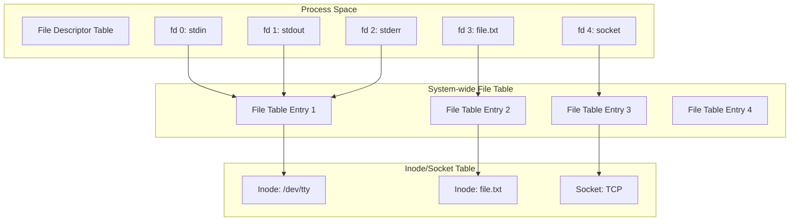

---
tags:
  - file_descriptor
  - fundamentals
  - io_basics
  - kernel_structures
  - medium-read
  - theoretical
  - unix_philosophy
  - vfs
  - 시스템프로그래밍
difficulty: FUNDAMENTALS
learning_time: "2-3시간"
main_topic: "시스템 프로그래밍"
priority_score: 4
---

# 6.1.1: 파일 디스크립터 기초와 구조

## 도입: 유닉스의 핵심 추상화

### 🎯 3이라는 숫자의 비밀

어느 날, 주니어 개발자가 물어왔습니다.

"선배님, 왜 제가 파일을 열면 항상 파일 디스크립터가 3부터 시작하나요? 0, 1, 2는 어디 갔나요?"

저는 웃으며 터미널을 열었습니다:

```bash
# 모든 프로세스의 시작
$ ls -la /proc/self/fd/
lrwx------ 1 user user 64 Nov 19 10:23 0 -> /dev/pts/0  # stdin
lrwx------ 1 user user 64 Nov 19 10:23 1 -> /dev/pts/0  # stdout
lrwx------ 1 user user 64 Nov 19 10:23 2 -> /dev/pts/0  # stderr
```

"모든 유닉스 프로세스는 태어날 때부터 3개의 선물을 받습니다. stdin(0), stdout(1), stderr(2)죠. 그래서 당신이 여는 첫 번째 파일은 항상 3번이 되는 겁니다."

### 🏗️ Everything is a File의 진짜 의미

"Everything is a file"이라는 유닉스 철학을 처음 들었을 때, 저는 "그래서 뭐? 파일이면 다 똑같은 거 아냐?"라고 생각했습니다.

하지만 실제로 시스템 프로그래밍을 해보니 이것은 천재적인 추상화였습니다:

```c
// 파일 읽기
int fd1 = open("data.txt", O_RDONLY);
read(fd1, buffer, 1024);

// 네트워크 소켓 읽기  
int fd2 = socket(AF_INET, SOCK_STREAM, 0);
connect(fd2, &addr, sizeof(addr));
read(fd2, buffer, 1024);  // 똑같은 read()!

// 파이프 읽기
int pipefd[2];
pipe(pipefd);
read(pipefd[0], buffer, 1024);  // 역시 똑같은 read()!

// 디바이스 읽기
int fd3 = open("/dev/random", O_RDONLY);
read(fd3, buffer, 1024);  // 여전히 똑같은 read()!
```

일반 파일, 네트워크 연결, 프로세스 간 통신, 하드웨어 디바이스... 모두 똑같은 인터페이스로 다룰 수 있습니다! 이게 바로 유닉스의 마법입니다. 🪄

### 💡 실전 경험: 파일 디스크립터 고갈 사건

제가 스타트업에서 일할 때 겪은 실제 사건입니다.

금요일 오후 5시, 서비스가 갑자기 "Too many open files" 에러를 뱉으며 죽기 시작했습니다:

```bash
# 긴급 진단
$ lsof -p $(pgrep myapp) | wc -l
65534

$ ulimit -n
65536

# 헉! 파일 디스크립터가 거의 다 소진됨!
```

원인은 간단했습니다. HTTP 요청마다 파일을 열고... 닫는 걸 까먹었죠:

```python
# 문제의 코드
def handle_request(request):
    f = open(f"/tmp/{request.id}.tmp", 'w')
    f.write(request.data)
    # f.close()를 깜빡!  😱
    return "OK"
```

이 단순해 보이는 정수 뒤에는 복잡한 커널 자료구조가 숨어 있습니다. 파일 디스크립터는 프로세스별 파일 디스크립터 테이블의 인덱스이며, 이는 다시 시스템 전역 파일 테이블을 가리키고, 최종적으로 inode나 소켓 구조체와 연결됩니다.

지금부터 이 마법의 숫자가 어떻게 작동하는지, 그 내부를 들여다보겠습니다!

## 파일 디스크립터의 3단계 구조

### 🏛️ 러시아 인형 같은 구조

파일 디스크립터의 내부 구조는 러시아 마트료시카 인형 같습니다. 겉으로는 단순한 정수지만, 열어보면 계속 새로운 구조가 나타나죠.

실제로 `strace`로 간단한 파일 열기를 추적해보면:

```bash
$ strace -e openat cat /etc/passwd 2>&1 | head -3
openat(AT_FDCWD, "/etc/passwd", O_RDONLY) = 3
# fd 3이 반환됨!
```

이 숫자 3이 가리키는 것을 따라가보면:

1. **프로세스의 fd 테이블**: "3번 칸을 보세요"
2. **시스템 파일 테이블**: "아, 이건 읽기 전용으로 열린 파일이네요"
3. **inode 테이블**: "실제 파일은 디스크의 이 위치에 있습니다"

### 커널 내부 자료구조 계층



### 📊 핵심 자료구조 정의

이제 실제 커널 코드를 봅시다. 처음엔 복잡해 보이지만, 각 구조체의 역할을 이해하면 퍼즐이 맞춰집니다:

```c
// 1. 프로세스별 파일 디스크립터 테이블 - "내 파일들의 전화번호부"
// === 메모리 레이아웃과 성능 최적화 전략 ===
// 이 구조체는 각 프로세스가 가지는 개인적인 "파일 관리 사무실"
// 평균 크기: ~200바이트, 하지만 fd_array가 동적 확장 가능
struct files_struct {
    // === 멀티스레드 안전성 보장 ===
    atomic_t count;              // 참조 카운트: fork()시 공유, clone()시 복사 결정
                                 // 이 값이 > 1이면 여러 프로세스가 같은 파일 테이블 공유!
                                 // 예: 바쉬에서 백그라운드 프로세스들이 stdin/stdout 공유
    
    // === 동적 확장 시스템 (성능의 핵심!) ===
    bool resize_in_progress;     // 테이블 확장 중? (다른 스레드 대기 필요)
    wait_queue_head_t resize_wait; // 확장 완료 대기큐 - 여기서 스레드들이 줄서서 기다림
    
    // === RCU(Read-Copy-Update) 최적화 ===
    struct fdtable __rcu *fdt;   // 실제 파일 디스크립터 테이블 포인터
                                 // __rcu 표시 = 무잠금 읽기 가능 (초당 수백만 번 접근!)
    struct fdtable fdtab;        // 기본 내장 테이블 (처음 64개 fd용)
                                 // 작은 프로그램은 별도 할당 없이 여기서 처리
    
    // === 동시성 제어 ===
    spinlock_t file_lock;        // 테이블 수정 시 보호 락
                                 // 스핀락 이유: fd 할당/해제는 매우 빠른 작업
                                 // 컨텍스트 스위치 오버헤드 > 스핀 대기 시간
    
    // === 할당 최적화 힌트 ===
    unsigned int next_fd;        // 다음 할당할 fd 번호 힌트
                                 // O(n) 순차 검색 → O(1) 즉시 할당 최적화
                                 // 예: next_fd=5라면 fd 5부터 검색 시작
    
    // === 비트맵 기반 고속 검색 ===
    // 각 비트 = 하나의 fd 상태 (0=사용안함, 1=사용중)
    unsigned long close_on_exec_init[1];  // exec() 시 자동으로 닫을 fd들
                                          // 보안: shell 스크립트가 실행될 때 
                                          // 부모의 민감한 파일 자동 차단
    unsigned long open_fds_init[1];       // 현재 열린 fd 비트맵
                                          // 한 번에 64개 fd 상태 확인 가능!
    unsigned long full_fds_bits_init[1];  // 가득 찬 64비트 섹션 추적
                                          // 빈 fd 찾기 최적화: 가득 찬 섹션은 건너뛰기
    
    // === 소규모 프로그램 최적화 ===
    struct file __rcu *fd_array[NR_OPEN_DEFAULT];  // 기본 64개 파일 포인터 배열
                                                   // 대부분 프로그램은 10개 미만 파일 사용
                                                   // → 별도 메모리 할당 불필요 = 빠른 시작!
};

// 2. 파일 디스크립터 테이블 - "동적 확장 가능한 전화번호부"
// === 확장성과 메모리 효율성의 절묘한 균형 ===
struct fdtable {
    // === 동적 확장의 핵심 ===
    unsigned int max_fds;        // 현재 테이블이 수용할 수 있는 최대 fd 개수
                                 // 시작: 64 → 128 → 256 → 512... (2의 배수로 증가)
                                 // 리눅스 기본 제한: 1,048,576개 (2^20)
    
    // === 포인터 배열의 메모리 레이아웃 ===
    struct file __rcu **fd;      // 실제 파일 포인터 배열 (동적 할당됨)
                                 // __rcu = 무잠금 읽기 최적화
                                 // fd[3] = stdin의 struct file* 주소
                                 // NULL이면 해당 fd는 미사용
    
    // === 비트맵 최적화 시스템 ===
    // 각 포인터는 동적 할당된 비트맵을 가리킴 (메모리 절약)
    unsigned long *close_on_exec;  // exec() 시 닫을 fd들의 비트맵
                                   // 보안 중요: 자식 프로세스가 부모의 중요 파일 접근 차단
                                   // 예: 데이터베이스 연결, 로그 파일 등
    unsigned long *open_fds;        // 열린 fd들의 비트맵
                                   // 빠른 fd 검색: 비트 연산으로 O(1) 시간에 빈 슬롯 발견
    unsigned long *full_fds_bits;  // 완전히 가득 찬 64비트 섹션 추적
                                   // 성능 최적화: 가득 찬 구간은 건너뛰고 빈 구간만 탐색
    
    // === RCU 메모리 관리 ===
    struct rcu_head rcu;           // RCU 기반 안전한 메모리 해제
                                   // 읽는 중인 스레드가 있으면 해제 지연
                                   // 멀티코어에서 race condition 방지의 핵심!
};
```

## 핵심 요점

### 1. 단순한 인터페이스, 복잡한 구현

파일 디스크립터는 겉보기에 단순한 정수지만, 내부는 3단계의 정교한 구조로 이루어져 있습니다.

### 2. Everything is a File의 구현

파일, 소켓, 파이프, 디바이스 모두 동일한 인터페이스로 추상화됩니다.

### 3. 성능 최적화의 결정체

RCU, 비트맵, 캐시 등 다양한 최적화 기법이 적용되어 있습니다.

---

**다음**: [파일 디스크립터 할당과 관리](./06-02-02-fd-allocation-management.md)에서 실제 할당 메커니즘과 프로세스 간 공유 방식을 학습합니다.

## 📚 관련 문서

### 📖 현재 문서 정보

- **난이도**: FUNDAMENTALS
- **주제**: 시스템 프로그래밍
- **예상 시간**: 2-3시간

### 🎯 학습 경로

- [📚 FUNDAMENTALS 레벨 전체 보기](../learning-paths/fundamentals/)
- [🏠 메인 학습 경로](../learning-paths/)
- [📋 전체 가이드 목록](../README.md)

### 📂 같은 챕터 (chapter-06-file-io)

- [6.2.1: 파일 디스크립터의 내부 구조](./06-02-01-file-descriptor.md)
- [6.2.2: 파일 디스크립터 할당과 공유 메커니즘](./06-02-02-fd-allocation-management.md)
- [6.2.3: 파일 연산과 VFS 다형성](./06-02-03-file-operations-vfs.md)
- [6.2.4: VFS와 파일 시스템 추상화 개요](./06-02-04-vfs-filesystem.md)
- [6.1.2: VFS 기본 개념과 아키텍처](./06-01-02-vfs-fundamentals.md)

### 🏷️ 관련 키워드

`file_descriptor`, `unix_philosophy`, `kernel_structures`, `vfs`, `io_basics`

### ⏭️ 다음 단계 가이드

- 기초 개념을 충분히 이해한 후 INTERMEDIATE 레벨로 진행하세요
- 실습 위주의 학습을 권장합니다
