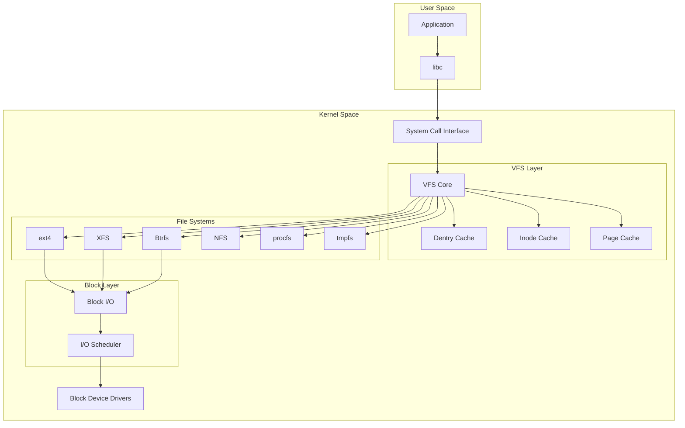

---
tags:
  - VFS
  - balanced
  - intermediate
  - medium-read
  - 시스템콜
  - 시스템프로그래밍
  - 아키텍처
  - 커널
  - 파일시스템
difficulty: INTERMEDIATE
learning_time: "4-6시간"
main_topic: "시스템 프로그래밍"
priority_score: 4
---

# 6.1.2: VFS 기초 개념과 동작원리

## 도입: 파일 시스템의 바벨탑

### 🌍 한 지붕 아래 살고 있는 여러 가족들

어느 날, 후배가 물어왔습니다:

"선배님, 리눅스에는 파일 시스템이 몇 개나 있나요?"

제가 터미널을 열고 보여주었습니다:

```bash
$ cat /proc/filesystems | wc -l
78

$ mount | head -10
/dev/nvme0n1p2 on / type ext4 (rw,relatime)      # 디스크 파일시스템
proc on /proc type proc (rw,nosuid,nodev)        # 프로세스 정보
sysfs on /sys type sysfs (rw,nosuid,nodev)       # 시스템 정보
tmpfs on /tmp type tmpfs (rw,nosuid,nodev)       # 메모리 파일시스템
nfs:/shared on /mnt/nfs type nfs4 (rw,relatime)  # 네트워크 파일시스템
fuse.sshfs on /mnt/ssh type fuse (rw,nosuid)     # FUSE 파일시스템
```

"78개!" 후배의 눈이 휘둥그래졌습니다. "그런데 어떻게 `cat`이나 `ls` 같은 명령어가 이 모든 파일시스템에서 동작하나요?"

### 🎭 VFS: 통역사의 역할

VFS(Virtual File System)는 통역사 같은 존재입니다. ext4는 영어만 하고, Btrfs는 프랑스어만 하고, NFS는 중국어만 한다고 상상해보세요. 응용 프로그램은 한국어(POSIX API)만 할 줄 압니다.

VFS가 중간에서 통역을 해줍니다:

- 응용 프로그램: "read() 하고 싶어요!"
- VFS: "아, 이 파일은 ext4에 있네요. ext4야, 읽어줘!"
- ext4: "OK, 여기 데이터"

### 💡 실전 경험: 파일시스템 지옥

제가 겪은 실제 사례입니다. 한 프로젝트에서 여러 파일시스템을 동시에 사용했어요:

```bash
# 로컬 SSD: 빠른 데이터베이스
/dev/nvme0n1 on /var/lib/postgresql type ext4

# 네트워크 스토리지: 대용량 백업
nfs:/backup on /backup type nfs4

# RAM 디스크: 초고속 캐시
tmpfs on /cache type tmpfs

# FUSE: 클라우드 스토리지
s3fs on /s3 type fuse.s3fs
```

애플리케이션은 이 복잡한 구조를 전혀 몰랐습니다. 그냥 `open()`, `read()`, `write()`만 호출했을 뿐이죠. 이게 바로 VFS의 마법입니다! 🪄

## VFS 아키텍처 개요

### 🏗️ 계층적 설계의 교과서

VFS의 구조는 잘 설계된 회사 조직도와 같습니다:

1.**CEO (응용 프로그램)**: "파일 읽어와!"
2.**중간 관리자 (VFS)**: "어떤 팀에 있는 파일인지 확인하고 전달할게요"
3.**실무 팀 (각 파일시스템)**: "실제 작업 수행"

### VFS 계층 구조



### 🎯 VFS 핵심 객체들: 4대 천왕

VFS에는 네 가지 핵심 객체가 있습니다. 제가 이들을 "사천왕"이라고 부르는 이유는...

1.**슈퍼블록 (Super Block)**: 파일시스템의 CEO
2.**아이노드 (Inode)**: 파일의 주민등록증
3.**덴트리 (Dentry)**: 경로의 GPS
4.**파일 (File)**: 열린 파일의 현재 상태

예를 들어 `/home/user/document.txt`를 열 때:

-**dentry**가 경로를 찾고
-**inode**가 실제 파일 정보를 제공하고
-**file**이 현재 열린 상태를 관리하고
-**super_block**이 파일시스템 전체를 통제

## VFS 핵심 구조체 분석

### 슈퍼블록: 파일시스템의 헌법

```c
// 1. 슈퍼블록: 마운트된 파일 시스템 인스턴스
// 이건 파일시스템의 "헌법"과 같습니다
struct super_block {
    struct list_head    s_list;        // 모든 슈퍼블록 리스트
    dev_t               s_dev;         // 디바이스 식별자
    unsigned char       s_blocksize_bits;
    unsigned long       s_blocksize;   // 블록 크기
    loff_t              s_maxbytes;    // 최대 파일 크기
    struct file_system_type *s_type;   // 파일 시스템 타입
    
    const struct super_operations *s_op;    // 슈퍼블록 연산
    const struct dquot_operations *dq_op;   // 디스크 쿼터 연산
    const struct quotactl_ops *s_qcop;      // 쿼터 제어 연산
    const struct export_operations *s_export_op;  // NFS 익스포트 연산
    
    unsigned long       s_flags;       // 마운트 플래그
    unsigned long       s_iflags;      // 내부 플래그
    unsigned long       s_magic;       // 매직 넘버
    
    struct dentry      *s_root;        // 루트 디렉토리 엔트리
    struct rw_semaphore s_umount;      // 언마운트 세마포어
    int                 s_count;       // 참조 카운트
    atomic_t            s_active;      // 활성 참조
    
    void               *s_security;    // LSM 보안 정보
    const struct xattr_handler**s_xattr;  // 확장 속성 핸들러
    
    struct hlist_bl_head s_roots;      // 익명 dentry들
    struct list_head    s_mounts;      // 마운트 포인트 리스트
    struct block_device *s_bdev;       // 블록 디바이스
    struct backing_dev_info *s_bdi;    // 백킹 디바이스 정보
    struct mtd_info    *s_mtd;         // MTD 디바이스 정보
    
    struct hlist_node   s_instances;   // 파일시스템별 인스턴스 리스트
    unsigned int        s_quota_types; // 활성 쿼터 타입
    struct quota_info   s_dquot;       // 디스크 쿼터 정보
    
    struct sb_writers   s_writers;     // 쓰기 동기화
    
    void               *s_fs_info;     // 파일시스템 전용 정보
    
    // 타임스탬프 정밀도
    u32                 s_time_gran;
    time64_t            s_time_min;
    time64_t            s_time_max;
    
    // 암호화 관련
    const struct fscrypt_operations *s_cop;
    struct key         *s_master_keys;
    
    // 파일시스템 통계
    struct list_head    s_inodes;      // 모든 inode 리스트
    spinlock_t          s_inode_list_lock;
    
    // Shrinker 콜백
    struct shrinker     s_shrink;
};
```

### 덴트리: 경로의 GPS

```c
// 2. 디렉토리 엔트리 (dentry): 경로명 컴포넌트
struct dentry {
    unsigned int        d_flags;       // 디렉토리 엔트리 플래그
    seqcount_spinlock_t d_seq;         // 병렬 조회를 위한 시퀀스 카운터
    struct hlist_bl_node d_hash;       // 해시 테이블 링크
    struct dentry      *d_parent;      // 부모 디렉토리
    struct qstr         d_name;        // 파일명
    struct inode       *d_inode;       // 연결된 inode
    
    unsigned char       d_iname[DNAME_INLINE_LEN];  // 짧은 이름 인라인 저장
    
    struct lockref      d_lockref;     // 참조 카운트와 락
    const struct dentry_operations *d_op;  // dentry 연산
    struct super_block *d_sb;          // 슈퍼블록
    unsigned long       d_time;        // 재검증 시간
    void               *d_fsdata;      // 파일시스템 전용 데이터
    
    union {
        struct list_head d_lru;        // LRU 리스트
        wait_queue_head_t *d_wait;     // 병렬 조회 대기 큐
    };
    
    struct list_head    d_child;       // 부모의 자식 리스트
    struct list_head    d_subdirs;     // 하위 디렉토리 리스트
    
    union {
        struct hlist_node d_alias;     // inode 별칭 리스트
        struct hlist_bl_node d_in_lookup_hash;  // 조회 중 해시
        struct rcu_head d_rcu;         // RCU 콜백
    } d_u;
};
```

### VFS 연산 테이블

```c
// 3. VFS 연산 테이블들
struct super_operations {
    struct inode *(*alloc_inode)(struct super_block *sb);
    void (*destroy_inode)(struct inode *);
    void (*free_inode)(struct inode *);
    
    void (*dirty_inode) (struct inode *, int flags);
    int (*write_inode) (struct inode *, struct writeback_control *wbc);
    int (*drop_inode) (struct inode *);
    void (*evict_inode) (struct inode *);
    void (*put_super) (struct super_block *);
    int (*sync_fs)(struct super_block *sb, int wait);
    int (*freeze_super) (struct super_block *);
    int (*freeze_fs) (struct super_block *);
    int (*thaw_super) (struct super_block *);
    int (*unfreeze_fs) (struct super_block *);
    int (*statfs) (struct dentry *, struct kstatfs *);
    int (*remount_fs) (struct super_block *, int *, char *);
    void (*umount_begin) (struct super_block *);
    
    int (*show_options)(struct seq_file *, struct dentry *);
    int (*show_devname)(struct seq_file *, struct dentry *);
    int (*show_path)(struct seq_file *, struct dentry *);
    int (*show_stats)(struct seq_file *, struct dentry *);
};

struct inode_operations {
    struct dentry * (*lookup) (struct inode *,struct dentry *, unsigned int);
    const char * (*get_link) (struct dentry *, struct inode *, 
                             struct delayed_call *);
    int (*permission) (struct inode *, int);
    struct posix_acl * (*get_acl)(struct inode *, int);
    
    int (*readlink) (struct dentry *, char __user *,int);
    
    int (*create) (struct inode *,struct dentry *, umode_t, bool);
    int (*link) (struct dentry *,struct inode *,struct dentry *);
    int (*unlink) (struct inode *,struct dentry *);
    int (*symlink) (struct inode *,struct dentry *,const char *);
    int (*mkdir) (struct inode *,struct dentry *,umode_t);
    int (*rmdir) (struct inode *,struct dentry *);
    int (*mknod) (struct inode *,struct dentry *,umode_t,dev_t);
    int (*rename) (struct inode *, struct dentry *,
                  struct inode *, struct dentry *, unsigned int);
    int (*setattr) (struct dentry *, struct iattr *);
    int (*getattr) (const struct path *, struct kstat *, u32, unsigned int);
    ssize_t (*listxattr) (struct dentry *, char *, size_t);
    int (*fiemap)(struct inode *, struct fiemap_extent_info *, u64 start,
                 u64 len);
    int (*update_time)(struct inode *, struct timespec64 *, int);
    int (*atomic_open)(struct inode *, struct dentry *,
                      struct file *, unsigned open_flag,
                      umode_t create_mode);
    int (*tmpfile) (struct inode *, struct dentry *, umode_t);
    int (*set_acl)(struct inode *, struct posix_acl *, int);
};
```

## VFS 동작 원리 이해

### 파일 열기 과정 추적

실제로 `/home/user/test.txt` 파일을 열 때 어떤 일이 일어나는지 추적해보겠습니다:

```c
// 실제 open() 시스템 콜의 간단한 버전
SYSCALL_DEFINE3(open, const char __user *, filename, int, flags, umode_t, mode)
{
    // 1. 사용자 공간 파일명을 커널 공간으로 복사
    struct filename *tmp = getname(filename);
    if (IS_ERR(tmp))
        return PTR_ERR(tmp);
    
    // 2. 파일 디스크립터와 파일 구조체 할당
    int fd = get_unused_fd_flags(flags);
    if (fd >= 0) {
        // 3. 실제 파일 열기 (VFS 계층으로)
        struct file *f = do_filp_open(AT_FDCWD, tmp, &op);
        if (IS_ERR(f)) {
            put_unused_fd(fd);
            fd = PTR_ERR(f);
        } else {
            // 4. 파일 디스크립터 테이블에 등록
            fsnotify_open(f);
            fd_install(fd, f);
        }
    }
    
    putname(tmp);
    return fd;
}
```

### VFS와 파일시스템 상호작용

```c
// VFS가 파일시스템과 어떻게 상호작용하는지 보여주는 예제
static struct file *do_open(struct nameidata *nd,
                           const struct open_flags *op,
                           int flags) {
    struct file *file;
    int error;
    
    // 1. 경로명 조회를 통해 파일 찾기 (dentry cache 활용)
    error = path_openat(nd, op, flags);
    if (error)
        return ERR_PTR(error);
    
    // 2. 찾은 파일에 대한 file 구조체 생성
    file = alloc_file(&nd->path, op->open_flag, op->intent);
    if (IS_ERR(file))
        return file;
    
    // 3. 파일시스템별 open 함수 호출
    if (file->f_op->open) {
        error = file->f_op->open(file->f_inode, file);
        if (error) {
            fput(file);
            return ERR_PTR(error);
        }
    }
    
    return file;
}
```

## 핵심 요점

### 1. VFS의 역할

VFS는 다양한 파일시스템을 하나의 일관된 인터페이스로 통합합니다:

- 78개의 서로 다른 파일시스템을 투명하게 처리
- 응용 프로그램은 파일시스템 종류를 몰라도 됨
- POSIX 호환 인터페이스 제공

### 2. 계층적 구조의 장점

-**유연성**: 새로운 파일시스템 쉽게 추가 가능
-**성능**: 각 계층별 최적화 가능 (캐시, 스케줄링)
-**안정성**: 각 파일시스템의 문제가 전체에 영향 안 줌

### 3. 핵심 객체들의 역할

-**super_block**: 파일시스템 메타데이터 관리
-**dentry**: 경로명 캐싱으로 성능 향상
-**inode**: 파일 메타데이터 추상화
-**file**: 열린 파일 상태 관리

---

**이전**: [Chapter 6-2 개요](./06-02-04-vfs-filesystem.md)  
**다음**: [Chapter 6.2.5: 경로명 조회와 덴트리 캐시](./06-02-05-path-lookup.md)에서 VFS의 핵심 성능 메커니즘을 학습합니다.

## 📚 관련 문서

### 📖 현재 문서 정보

-**난이도**: INTERMEDIATE
-**주제**: 시스템 프로그래밍
-**예상 시간**: 4-6시간

### 🎯 학습 경로

- [📚 INTERMEDIATE 레벨 전체 보기](../learning-paths/intermediate/)
- [🏠 메인 학습 경로](../learning-paths/)
- [📋 전체 가이드 목록](../README.md)

### 📂 같은 챕터 (chapter-06-file-io)

- [6.2.1: 파일 디스크립터의 내부 구조](./06-02-01-file-descriptor.md)
- [6.1.1: 파일 디스크립터 기본 개념과 3단계 구조](./06-01-01-fd-basics-structure.md)
- [6.2.2: 파일 디스크립터 할당과 공유 메커니즘](./06-02-02-fd-allocation-management.md)
- [6.2.3: 파일 연산과 VFS 다형성](./06-02-03-file-operations-vfs.md)
- [6.2.4: VFS와 파일 시스템 추상화 개요](./06-02-04-vfs-filesystem.md)

### 🏷️ 관련 키워드

`VFS`, `파일시스템`, `커널`, `아키텍처`, `시스템콜`

### ⏭️ 다음 단계 가이드

- 실무 적용을 염두에 두고 프로젝트에 적용해보세요
- 관련 도구들을 직접 사용해보는 것이 중요합니다
