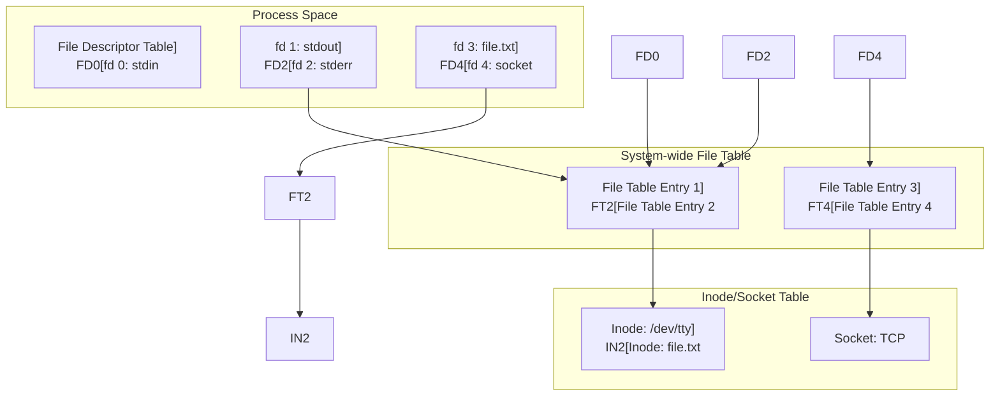

---
tags:
  - IO_system
  - VFS
  - balanced
  - file_descriptor
  - intermediate
  - kernel_structures
  - medium-read
  - system_programming
  - 시스템프로그래밍
difficulty: INTERMEDIATE
learning_time: "3-5시간"
main_topic: "시스템 프로그래밍"
priority_score: 4
---

# 6.2.1: 파일 디스크립터 상세 구현

## 이 절에서 답할 질문들

- 파일 디스크립터는 정확히 무엇을 가리키는가?
- 커널은 어떻게 파일 디스크립터를 관리하는가?
- 프로세스 간 파일 디스크립터 공유는 어떻게 일어나는가?
- 파일 디스크립터 테이블의 구조는 어떻게 되어 있는가?
- 파일 디스크립터 할당과 해제는 어떻게 최적화되는가?

## 도입: 유닉스의 핵심 추상화

### 🎯 3이라는 숫자의 비밀

어느 날, 주니어 개발자가 물어왔습니다.

"선배님, 왜 제가 파일을 열면 항상 파일 디스크립터가 3부터 시작하나요? 0, 1, 2는 어디 갔나요?"

저는 웃으며 터미널을 열었습니다:

```bash
# 모든 프로세스의 시작
$ ls -la /proc/self/fd/
lrwx------ 1 user user 64 Nov 19 10:23 0 -> /dev/pts/0  # stdin
lrwx------ 1 user user 64 Nov 19 10:23 1 -> /dev/pts/0  # stdout
lrwx------ 1 user user 64 Nov 19 10:23 2 -> /dev/pts/0  # stderr
```

"모든 유닉스 프로세스는 태어날 때부터 3개의 선물을 받습니다. stdin(0), stdout(1), stderr(2)죠. 그래서 당신이 여는 첫 번째 파일은 항상 3번이 되는 겁니다."

### 🏗️ Everything is a File의 진짜 의미

"Everything is a file"이라는 유닉스 철학을 처음 들었을 때, 저는 "그래서 뭐? 파일이면 다 똑같은 거 아냐?"라고 생각했습니다.

하지만 실제로 시스템 프로그래밍을 해보니 이것은 천재적인 추상화였습니다:

```c
// 파일 읽기
int fd1 = open("data.txt", O_RDONLY);
read(fd1, buffer, 1024);

// 네트워크 소켓 읽기
int fd2 = socket(AF_INET, SOCK_STREAM, 0);
connect(fd2, &addr, sizeof(addr));
read(fd2, buffer, 1024);  // 똑같은 read()!

// 파이프 읽기
int pipefd[2];
pipe(pipefd);
read(pipefd[0], buffer, 1024);  // 역시 똑같은 read()!

// 디바이스 읽기
int fd3 = open("/dev/random", O_RDONLY);
read(fd3, buffer, 1024);  // 여전히 똑같은 read()!
```

일반 파일, 네트워크 연결, 프로세스 간 통신, 하드웨어 디바이스... 모두 똑같은 인터페이스로 다룰 수 있습니다! 이게 바로 유닉스의 마법입니다. 🪄

### 💡 실전 경험: 파일 디스크립터 고갈 사건

제가 스타트업에서 일할 때 겪은 실제 사건입니다.

금요일 오후 5시, 서비스가 갑자기 "Too many open files" 에러를 뱉으며 죽기 시작했습니다:

```bash
# 긴급 진단
$ lsof -p $(pgrep myapp) | wc -l
65534

$ ulimit -n
65536

# 헉! 파일 디스크립터가 거의 다 소진됨!
```

원인은 간단했습니다. HTTP 요청마다 파일을 열고... 닫는 걸 까먹었죠:

```python
# 문제의 코드
def handle_request(request):
    f = open(f"/tmp/{request.id}.tmp", 'w')
    f.write(request.data)
    # f.close()를 깜빡!  😱
    return "OK"
```

이 단순해 보이는 정수 뒤에는 복잡한 커널 자료구조가 숨어 있습니다. 파일 디스크립터는 프로세스별 파일 디스크립터 테이블의 인덱스이며, 이는 다시 시스템 전역 파일 테이블을 가리키고, 최종적으로 inode나 소켓 구조체와 연결됩니다.

지금부터 이 마법의 숫자가 어떻게 작동하는지, 그 내부를 들여다보겠습니다!

## 파일 디스크립터의 3단계 구조

### 🏛️ 러시아 인형 같은 구조

파일 디스크립터의 내부 구조는 러시아 마트료시카 인형 같습니다. 겉으로는 단순한 정수지만, 열어보면 계속 새로운 구조가 나타나죠.

실제로 `strace`로 간단한 파일 열기를 추적해보면:

```bash
$ strace -e openat cat /etc/passwd 2>&1 | head -3
openat(AT_FDCWD, "/etc/passwd", O_RDONLY) = 3
# fd 3이 반환됨!
```

이 숫자 3이 가리키는 것을 따라가보면:

1. **프로세스의 fd 테이블**: "3번 칸을 보세요"
2. **시스템 파일 테이블**: "아, 이건 읽기 전용으로 열린 파일이네요"
3. **inode 테이블**: "실제 파일은 디스크의 이 위치에 있습니다"

### 커널 내부 자료구조 계층



### 📊 핵심 자료구조 정의

이제 실제 커널 코드를 봅시다. 처음엔 복잡해 보이지만, 각 구조체의 역할을 이해하면 퍼즐이 맞춰집니다:

```c
// 1. 프로세스별 파일 디스크립터 테이블 - "내 파일들의 전화번호부"
// === 메모리 레이아웃과 성능 최적화 전략 ===
// 이 구조체는 각 프로세스가 가지는 개인적인 "파일 관리 사무실"
// 평균 크기: ~200바이트, 하지만 fd_array가 동적 확장 가능
struct files_struct {
    // === 멀티스레드 안전성 보장 ===
    atomic_t count;              // 참조 카운트: fork()시 공유, clone()시 복사 결정
                                 // 이 값이 > 1이면 여러 프로세스가 같은 파일 테이블 공유!
                                 // 예: 바쉬에서 백그라운드 프로세스들이 stdin/stdout 공유

    // === 동적 확장 시스템 (성능의 핵심!) ===
    bool resize_in_progress;     // 테이블 확장 중? (다른 스레드 대기 필요)
    wait_queue_head_t resize_wait; // 확장 완료 대기큐 - 여기서 스레드들이 줄서서 기다림

    // === RCU(Read-Copy-Update) 최적화 ===
    struct fdtable __rcu *fdt;   // 실제 파일 디스크립터 테이블 포인터
                                 // __rcu 표시 = 무잠금 읽기 가능 (초당 수백만 번 접근!)
    struct fdtable fdtab;        // 기본 내장 테이블 (처음 64개 fd용)
                                 // 작은 프로그램은 별도 할당 없이 여기서 처리

    // === 동시성 제어 ===
    spinlock_t file_lock;        // 테이블 수정 시 보호 락
                                 // 스핀락 이유: fd 할당/해제는 매우 빠른 작업
                                 // 컨텍스트 스위치 오버헤드 > 스핀 대기 시간

    // === 할당 최적화 힌트 ===
    unsigned int next_fd;        // 다음 할당할 fd 번호 힌트
                                 // O(n) 순차 검색 → O(1) 즉시 할당 최적화
                                 // 예: next_fd=5라면 fd 5부터 검색 시작

    // === 비트맵 기반 고속 검색 ===
    // 각 비트 = 하나의 fd 상태 (0=사용안함, 1=사용중)
    unsigned long close_on_exec_init[1];  // exec() 시 자동으로 닫을 fd들
                                          // 보안: shell 스크립트가 실행될 때
                                          // 부모의 민감한 파일 자동 차단
    unsigned long open_fds_init[1];       // 현재 열린 fd 비트맵
                                          // 한 번에 64개 fd 상태 확인 가능!
    unsigned long full_fds_bits_init[1];  // 가득 찬 64비트 섹션 추적
                                          // 빈 fd 찾기 최적화: 가득 찬 섹션은 건너뛰기

    // === 소규모 프로그램 최적화 ===
    struct file __rcu *fd_array[NR_OPEN_DEFAULT];  // 기본 64개 파일 포인터 배열
                                                   // 대부분 프로그램은 10개 미만 파일 사용
                                                   // → 별도 메모리 할당 불필요 = 빠른 시작!
};

// 2. 파일 디스크립터 테이블 - "동적 확장 가능한 전화번호부"
// === 확장성과 메모리 효율성의 절묘한 균형 ===
struct fdtable {
    // === 동적 확장의 핵심 ===
    unsigned int max_fds;        // 현재 테이블이 수용할 수 있는 최대 fd 개수
                                 // 시작: 64 → 128 → 256 → 512... (2의 배수로 증가)
                                 // 리눅스 기본 제한: 1,048,576개 (2^20)

    // === 포인터 배열의 메모리 레이아웃 ===
    struct file __rcu **fd;      // 실제 파일 포인터 배열 (동적 할당됨)
                                 // __rcu = 무잠금 읽기 최적화
                                 // fd[3] = stdin의 struct file* 주소
                                 // NULL이면 해당 fd는 미사용

    // === 비트맵 최적화 시스템 ===
    // 각 포인터는 동적 할당된 비트맵을 가리킴 (메모리 절약)
    unsigned long *close_on_exec;  // exec() 시 닫을 fd들의 비트맵
                                   // 보안 중요: 자식 프로세스가 부모의 중요 파일 접근 차단
                                   // 예: 데이터베이스 연결, 로그 파일 등
    unsigned long *open_fds;        // 열린 fd들의 비트맵
                                   // 빠른 fd 검색: 비트 연산으로 O(1) 시간에 빈 슬롯 발견
    unsigned long *full_fds_bits;  // 완전히 가득 찬 64비트 섹션 추적
                                   // 성능 최적화: 가득 찬 구간은 건너뛰고 빈 구간만 탐색

    // === RCU 메모리 관리 ===
    struct rcu_head rcu;           // RCU 기반 안전한 메모리 해제
                                   // 읽는 중인 스레드가 있으면 해제 지연
                                   // 멀티코어에서 race condition 방지의 핵심!
};

// 3. 파일 구조체 (시스템 전역) - "실제 파일 객체"
// === 모든 열린 파일의 상태 정보 중앙 집권화 ===
// 평균 크기: ~200바이트, 전체 시스템에서 공유됨
// 예: 두 프로세스가 같은 파일 열면 → 2개의 fd, 1개의 struct file
struct file {
    // === 메모리 관리 최적화 ===
    union {
        struct llist_node    fu_llist;      // 해제 대기 리스트 (성능 최적화)
        struct rcu_head      fu_rcuhead;    // RCU 기반 안전한 해제
    } f_u;  // union으로 메모리 절약: 둘 중 하나만 사용

    // === 파일 식별과 접근 ===
    struct path             f_path;      // 파일의 풀 경로 (/home/user/file.txt)
                                         // 심볼릭 링크 해결된 최종 경로
    struct inode           *f_inode;     // 캐시된 inode 포인터 (빠른 접근)
                                         // 매번 경로 해석하지 않고 직접 접근 가능
    const struct file_operations *f_op;  // 파일 연산 테이블 (다형성 구현)
                                         // read(), write(), ioctl() 등 함수 포인터들
                                         // 일반파일 vs 장치파일 vs 네트워크 소켓 구분

    // === 동시성 제어 ===
    spinlock_t             f_lock;       // 파일 구조체 보호 락
                                         // 참조 카운트, 플래그 수정시 사용
    enum rw_hint           f_write_hint; // 쓰기 패턴 힌트 (SSD 최적화)
                                         // WRITE_LIFE_SHORT: 로그파일
                                         // WRITE_LIFE_LONG: 데이터베이스

    // === 참조 관리 (핵심!) ===
    atomic_long_t          f_count;      // 참조 카운트
                                         // dup(), fork() 시 증가
                                         // close() 시 감소, 0 되면 실제 해제

    // === 접근 권한과 모드 ===
    unsigned int           f_flags;      // 열기 플래그 (O_RDONLY, O_NONBLOCK 등)
                                         // 사용자가 open()에서 지정한 옵션들
    fmode_t                f_mode;       // 내부 모드 (FMODE_READ, FMODE_WRITE)
                                         // 커널 내부에서 사용하는 정규화된 모드

    // === 파일 위치 관리 ===
    struct mutex           f_pos_lock;   // 파일 위치 동기화 뮤텍스
                                         // 멀티스레드에서 lseek() 경합 조건 방지
    loff_t                 f_pos;        // 현재 파일 읽기/쓰기 위치
                                         // read()/write() 시 자동 업데이트

    // === 시그널과 소유권 ===
    struct fown_struct     f_owner;      // 시그널 전송용 소유자 정보
                                         // 비동기 I/O 완료시 SIGIO 전송할 프로세스
    const struct cred     *f_cred;       // 파일 열 때의 자격 증명
                                         // 권한 검사 시 사용 (uid, gid, capabilities)

    // === 성능 최적화 ===
    struct file_ra_state   f_ra;         // read-ahead 상태 정보
                                         // 순차 읽기 패턴 감지하여 미리 읽기
                                         // 디스크 I/O 지연 숨기기의 핵심!

    // === 메타데이터 ===
    u64                    f_version;    // 파일 버전 (캐시 일관성용)
    void                  *f_security;   // LSM(Linux Security Module) 정보
                                         // SELinux, AppArmor 등에서 사용
    void                  *private_data; // 드라이버/파일시스템 전용 데이터
                                         // 장치 드라이버가 자유롭게 사용

    // === 이벤트 시스템 연동 ===
    struct list_head       f_ep_links;    // epoll 백링크 리스트
                                          // 이 파일이 어떤 epoll에 등록되어 있나?
    struct list_head       f_tfile_llink; // tty 드라이버 링크

    // === 메모리 매핑 ===
    struct address_space  *f_mapping;     // 페이지 캐시 매핑 포인터
                                          // mmap(), 일반 read/write 캐싱 핵심
                                          // 물리 메모리와 파일의 연결고리

    // === 오류 추적 ===
    errseq_t               f_wb_err;      // write-back 오류 시퀀스 번호
    errseq_t               f_sb_err;      // 슈퍼블록 오류 시퀀스 번호
                                          // 비동기 쓰기 오류를 애플리케이션에 전파
};

// 4. inode 구조체
struct inode {
    umode_t             i_mode;        // 파일 모드와 권한
    unsigned short      i_opflags;
    kuid_t              i_uid;         // 소유자 UID
    kgid_t              i_gid;         // 소유자 GID
    unsigned int        i_flags;

    const struct inode_operations *i_op;
    struct super_block  *i_sb;         // 슈퍼블록 포인터
    struct address_space *i_mapping;    // 페이지 캐시

    unsigned long       i_ino;         // inode 번호
    union {
        const unsigned int i_nlink;
        unsigned int __i_nlink;
    };
    dev_t               i_rdev;        // 디바이스 파일용
    loff_t              i_size;        // 파일 크기
    struct timespec64   i_atime;       // 접근 시간
    struct timespec64   i_mtime;       // 수정 시간
    struct timespec64   i_ctime;       // 변경 시간
    spinlock_t          i_lock;
    unsigned short      i_bytes;
    u8                  i_blkbits;
    u8                  i_write_hint;
    blkcnt_t            i_blocks;      // 할당된 블록 수

    seqcount_t          i_size_seqcount;
    unsigned long       i_state;
    struct rw_semaphore i_rwsem;

    unsigned long       dirtied_when;
    unsigned long       dirtied_time_when;

    struct hlist_node   i_hash;        // inode 해시 테이블
    struct list_head    i_io_list;
    struct list_head    i_lru;         // LRU 리스트
    struct list_head    i_sb_list;
    struct list_head    i_wb_list;

    union {
        struct hlist_head   i_dentry;  // 디렉토리 엔트리
        struct rcu_head     i_rcu;
    };

    atomic64_t          i_version;
    atomic64_t          i_sequence;
    atomic_t            i_count;       // 참조 카운트
    atomic_t            i_dio_count;
    atomic_t            i_writecount;

    union {
        const struct file_operations   *i_fop;
        void (*free_inode)(struct inode *);
    };

    struct file_lock_context *i_flctx;
    struct address_space    i_data;    // 파일 데이터 페이지
    struct list_head        i_devices;

    union {
        struct pipe_inode_info  *i_pipe;
        struct block_device     *i_bdev;
        struct cdev             *i_cdev;
        char                    *i_link;
        unsigned                i_dir_seq;
    };

    void                    *i_private;  // 파일시스템 전용
};
```

## 파일 디스크립터 할당 메커니즘

### 🎰 빈 자리 찾기 게임

파일 디스크립터 할당은 극장에서 빈 좌석을 찾는 것과 비슷합니다.

상상해보세요. 65,536개의 좌석이 있는 거대한 극장에서 빈 자리를 찾아야 한다면? 하나씩 확인하면 너무 느리겠죠.

커널은 똑똑한 방법을 씁니다:

```c
// 실제 테스트 코드
#include <fcntl.h>
#include <stdio.h>
#include <unistd.h>

int main() {
    // fd 3, 4, 5를 차례로 할당
    int fd1 = open("/dev/null", O_RDONLY);  // fd = 3
    int fd2 = open("/dev/null", O_RDONLY);  // fd = 4
    int fd3 = open("/dev/null", O_RDONLY);  // fd = 5

    close(fd2);  // fd 4를 반납

    // 다음 open()은 뭘 반환할까요?
    int fd4 = open("/dev/null", O_RDONLY);
    printf("Next fd: %d, ", fd4);  // 4! (가장 작은 빈 번호)

    return 0;
}
```

커널은 항상 **가장 작은 사용 가능한 번호**를 할당합니다. 이를 위해 비트맵을 사용하죠.

### 빠른 할당을 위한 비트맵 기반 관리

```c
// 사용 가능한 파일 디스크립터 찾기
static int alloc_fd(unsigned start, unsigned flags) {
    struct files_struct *files = current->files;
    unsigned int fd;
    int error;
    struct fdtable *fdt;

    spin_lock(&files->file_lock);
repeat:
    fdt = files_fdtable(files);
    fd = start;

    // 비트맵에서 빈 슬롯 찾기
    if (fd < files->next_fd)
        fd = files->next_fd;

    if (fd < fdt->max_fds)
        fd = find_next_fd(fdt, fd);

    // 테이블 확장이 필요한 경우
    if (unlikely(fd >= fdt->max_fds)) {
        error = expand_files(files, fd);
        if (error < 0)
            goto out;
        goto repeat;
    }

    // fd 할당
    __set_open_fd(fd, fdt);
    if (flags & O_CLOEXEC)
        __set_close_on_exec(fd, fdt);
    else
        __clear_close_on_exec(fd, fdt);

    error = fd;

    // 다음 할당을 위한 힌트 업데이트
    files->next_fd = fd + 1;

out:
    spin_unlock(&files->file_lock);
    return error;
}

// 비트맵에서 다음 빈 fd 찾기
static unsigned int find_next_fd(struct fdtable *fdt, unsigned int start) {
    unsigned int maxfd = fdt->max_fds;
    unsigned int maxbit = maxfd / BITS_PER_LONG;
    unsigned int bitbit = start / BITS_PER_LONG;

    bitbit = find_next_zero_bit(fdt->full_fds_bits, maxbit, bitbit) * BITS_PER_LONG;
    if (bitbit > maxfd)
        return maxfd;
    if (bitbit > start)
        start = bitbit;

    return find_next_zero_bit(fdt->open_fds, maxfd, start);
}

// 파일 디스크립터 테이블 확장
static int expand_files(struct files_struct *files, unsigned int nr) {
    struct fdtable *fdt;
    int expanded = 0;

    fdt = files_fdtable(files);

    // 이미 충분한 크기인지 확인
    if (nr < fdt->max_fds)
        return expanded;

    // 최대 한계 체크
    if (nr >= sysctl_nr_open)
        return -EMFILE;

    if (unlikely(files->resize_in_progress)) {
        spin_unlock(&files->file_lock);
        expanded = 1;
        wait_event(files->resize_wait, !files->resize_in_progress);
        spin_lock(&files->file_lock);
        goto repeat;
    }

    // 새 테이블 할당
    files->resize_in_progress = true;
    expanded = expand_fdtable(files, nr);
    files->resize_in_progress = false;

    wake_up_all(&files->resize_wait);
    return expanded;
}
```

### 🔄 파일 디스크립터 복사와 공유

#### fork()의 마법과 함정

`fork()`는 프로세스를 복제하는데, 파일 디스크립터는 어떻게 될까요?

제가 처음 이걸 배웠을 때 혼란스러웠던 예제:

```c
#include <unistd.h>
#include <stdio.h>
#include <fcntl.h>

int main() {
    int fd = open("shared.txt", O_WRONLY | O_CREAT | O_TRUNC, 0644);

    write(fd, "Parent", 6);

    if (fork() == 0) {
        // 자식 프로세스
        write(fd, "Child", 5);  // 같은 fd 사용!
        close(fd);
        return 0;
    }

    wait(NULL);
    write(fd, "Parent2", 7);
    close(fd);

    // 파일 내용은? "ParentChildParent2"!
    // 왜? 파일 오프셋을 공유하기 때문!
}
```

이건 버그가 아니라 **feature**입니다! 파이프 구현의 핵심이죠.

### 파일 디스크립터 복사와 공유

```c
// fork() 시 파일 디스크립터 테이블 복사
static int copy_files(unsigned long clone_flags, struct task_struct *tsk) {
    struct files_struct *oldf, *newf;
    int error = 0;

    oldf = current->files;
    if (!oldf)
        goto out;

    if (clone_flags & CLONE_FILES) {
        // CLONE_FILES: 파일 테이블 공유
        atomic_inc(&oldf->count);
        goto out;
    }

    // 새 파일 테이블 생성
    newf = dup_fd(oldf, &error);
    if (!newf)
        goto out;

    tsk->files = newf;
    error = 0;
out:
    return error;
}

// 파일 디스크립터 테이블 복제 - fork()의 핵심 구현
// 실제 사용: 모든 프로세스 생성 시점에서 실행 (bash, docker, systemd 등)
// dup_fd() - fork() 시 파일 디스크립터 복제의 핵심 함수
// === 멀티프로세스 파일 공유 메커니즘 구현 ===
// 이 함수 하나가 Unix의 "Everything is a file" 철학을 완성한다!
// 평균 실행 시간: 2-15μs (열린 파일 개수에 따라)
static struct files_struct *dup_fd(struct files_struct *oldf, int *errorp) {
    struct files_struct *newf;   // 새 프로세스의 "파일 관리 사무실"
    struct file **old_fds, **new_fds;  // 부모/자식 파일 포인터 배열들
    unsigned int open_files, i;  // 실제 열린 파일 개수와 반복자
    struct fdtable *old_fdt, *new_fdt;  // 부모/자식 FD 테이블

    // === 1단계: 메모리 할당과 초기 설정 ===
    // "아이를 위한 새 사무실 준비하기"
    *errorp = -ENOMEM;  // 기본 에러 = 메모리 부족 (가장 흔한 실패 원인)

    // SLAB 캐시에서 files_struct 할당
    // 성능 핵심: 자주 할당/해제되므로 전용 캐시 사용 (일반 kmalloc보다 3배 빠름)
    newf = kmem_cache_alloc(files_cachep, GFP_KERNEL);
    if (!newf)
        goto out;  // OOM 킬러 작동 직전 상황!

    // === 2단계: 자식 프로세스 FD 시스템 기본 구조 초기화 ===
    // "새 사무실의 기본 장비 설치"
    atomic_set(&newf->count, 1);        // 참조 카운트 = 1 (자식 프로세스만 참조)
    spin_lock_init(&newf->file_lock);   // 멀티스레드 안전성을 위한 락
    newf->resize_in_progress = false;   // 아직 확장 작업 없음
    init_waitqueue_head(&newf->resize_wait);  // FD 테이블 확장 대기 큐 초기화
    newf->next_fd = 0;  // 다음 할당할 FD 번호 힌트 (0부터 시작)

    // === 3단계: 소규모 프로세스 최적화 - 기본 테이블 설정 ===
    // "작은 사무실엔 작은 책상만 필요해"
    // 대부분의 프로세스는 10개 미만 파일 사용 → 동적 할당 회피
    new_fdt = &newf->fdtab;  // 내장 테이블 사용 (별도 할당 불필요)
    new_fdt->max_fds = NR_OPEN_DEFAULT;  // 64개 FD까지 처리 가능

    // 비트맵들을 정적 배열로 초기화 (malloc 횟수 최소화)
    new_fdt->close_on_exec = newf->close_on_exec_init;   // exec 시 닫을 FD 추적
    new_fdt->open_fds = newf->open_fds_init;             // 열린 FD 추적
    new_fdt->full_fds_bits = newf->full_fds_bits_init;   // 가득 찬 섹션 추적
    new_fdt->fd = &newf->fd_array[0];  // 기본 64개 슬롯 배열 연결

    // === 4단계: 부모 프로세스 상태 스냅샷 ===
    // "아빠의 파일들 어떤 게 있는지 확인"
    // Critical Section 시작: 부모 FD 테이블 변경 금지
    spin_lock(&oldf->file_lock);
    old_fdt = files_fdtable(oldf);  // RCU로 보호된 안전한 테이블 접근
    open_files = count_open_files(old_fdt);  // 실제 열린 파일 개수 비트맵 스캔

    // === 5단계: 대규모 서버 프로세스 처리 ===
    // "nginx 마스터가 10,000개 연결을 가진 상태에서 워커 fork()"
    if (open_files > NR_OPEN_DEFAULT) {
        // 임시로 락 해제: 큰 메모리 할당 중 다른 프로세스 블록 방지
        spin_unlock(&oldf->file_lock);

        // 동적 FD 테이블 할당 (큰 프로그램용)
        // 메모리 사용량: (열린_파일수 * 8바이트) + 비트맵들
        new_fdt = alloc_fdtable(open_files - 1);
        if (!new_fdt) {
            *errorp = -ENOMEM;
            goto out_release;  // 서버 메모리 부족: 치명적 상황!
        }

        // 재락: 할당 중 부모가 파일을 열거나 닫았을 수 있음
        // Race Condition 방지의 핵심 패턴
        spin_lock(&oldf->file_lock);
        old_fdt = files_fdtable(oldf);  // 업데이트된 테이블 재획득
        open_files = count_open_files(old_fdt);  // 파일 개수 재계산
    }

    // ⭐ 6단계: FD 비트맵 복사 (열린 파일 추적 정보)
    // open_fds: 어떤 FD가 사용 중인지, close_on_exec: exec 시 닫을 FD
    copy_fd_bitmaps(new_fdt, old_fdt, open_files);

    // ⭐ 7단계: 파일 포인터 배열 준비
    old_fds = old_fdt->fd;  // 부모의 파일 포인터 배열
    new_fds = new_fdt->fd;  // 자식의 파일 포인터 배열

    // ⭐ 8단계: 파일 포인터 복사 및 참조 카운트 증가
    // 핵심: 실제 파일은 복사하지 않고 포인터만 복사 (파일 오프셋 공유)
    for (i = open_files; i != 0; i--) {
        struct file *f = *old_fds++;  // 부모의 파일 포인터 획득
        if (f) {
            // ⭐ 참조 카운트 증가: 동일 파일을 두 프로세스가 공유
            // 실제 효과: 자식이 파일을 닫아도 부모 것은 영향 없음
            get_file(f);
        } else {
            // NULL 포인터: 비어있는 FD 슬롯 처리
            __clear_open_fd(open_files - i, new_fdt);
        }
        // RCU 보호된 포인터 할당: 동시 읽기 안전성 보장
        rcu_assign_pointer(*new_fds++, f);
    }
    spin_unlock(&oldf->file_lock);  // 부모 테이블 락 해제

    // ⭐ 9단계: 사용하지 않는 FD 슬롯들을 NULL로 초기화
    // 보안: 이전 프로세스의 잔여 포인터 정보 제거
    // 메모리 안전성: 초기화되지 않은 포인터로 인한 크래시 방지
    memset(&new_fds[open_files], 0,
           (new_fdt->max_fds - open_files) * sizeof(struct file *));

    // ⭐ 10단계: RCU 안전한 테이블 연결 및 완료
    // "새 사무실이 준비됐다! 아이가 이제 독립적으로 파일 관리 가능"
    rcu_assign_pointer(newf->fdt, new_fdt);  // 원자적 테이블 연결

    // === fork() 성공 완료 ===
    // 결과: 부모/자식이 동일한 파일들을 독립적으로 관리
    // 파일 내용과 오프셋은 공유, FD 번호와 테이블은 독립적
    // 성능 영향: 파일당 8바이트 메모리 증가, CPU 오버헤드는 거의 없음
    return newf;  // 성공: 새 프로세스의 파일 관리 구조 반환

// === 에러 처리: 메모리 부족 상황 ===
out_release:
    // 할당했던 files_struct 메모리 해제
    // 실패 시나리오: 시스템 메모리 부족 또는 프로세스 한계 도달
    kmem_cache_free(files_cachep, newf);
out:
    // fork() 실패로 이어짐: 부모는 계속 실행, 자식 프로세스 생성 실패
    return NULL;  // 커널이 -ENOMEM 에러 반환
}
```

## 파일 연산 디스패치

### 🎭 다형성의 교과서적 구현

C언어에는 클래스가 없는데 어떻게 다형성을 구현할까요? 답은 **함수 포인터 테이블**입니다!

제가 처음 이 코드를 봤을 때 감탄했습니다:

```c
// 모든 파일 타입이 구현해야 하는 "인터페이스"
struct file_operations {
    ssize_t (*read) (...);
    ssize_t (*write) (...);
    int (*open) (...);
    // ...
};

// ext4 파일시스템의 구현
struct file_operations ext4_file_operations = {
    .read = ext4_file_read,
    .write = ext4_file_write,
    .open = ext4_file_open,
};

// 소켓의 구현
struct file_operations socket_file_operations = {
    .read = sock_read,
    .write = sock_write,
    .open = sock_no_open,  // 소켓은 open()이 아니라 socket()으로!
};

// 파이프의 구현
struct file_operations pipe_file_operations = {
    .read = pipe_read,
    .write = pipe_write,
    .open = NULL,  // 파이프는 pipe()로 생성!
};
```

이제 `read(fd, buf, size)`를 호출하면:

1. fd로 file 구조체를 찾고
2. `file->f_op->read()`를 호출
3. 실제 구현체(ext4, socket, pipe 등)의 함수가 실행!

객체지향 언어의 가상 함수 테이블(vtable)과 똑같은 원리입니다! 🎯

### VFS 연산 테이블

```c
// 파일 연산 구조체
struct file_operations {
    struct module *owner;
    loff_t (*llseek) (struct file *, loff_t, int);
    ssize_t (*read) (struct file *, char __user *, size_t, loff_t *);
    ssize_t (*write) (struct file *, const char __user *, size_t, loff_t *);
    ssize_t (*read_iter) (struct kiocb *, struct iov_iter *);
    ssize_t (*write_iter) (struct kiocb *, struct iov_iter *);
    int (*iopoll)(struct kiocb *kiocb, bool spin);
    int (*iterate) (struct file *, struct dir_context *);
    int (*iterate_shared) (struct file *, struct dir_context *);
    __poll_t (*poll) (struct file *, struct poll_table_struct *);
    long (*unlocked_ioctl) (struct file *, unsigned int, unsigned long);
    long (*compat_ioctl) (struct file *, unsigned int, unsigned long);
    int (*mmap) (struct file *, struct vm_area_struct *);
    unsigned long mmap_supported_flags;
    int (*open) (struct inode *, struct file *);
    int (*flush) (struct file *, fl_owner_t id);
    int (*release) (struct inode *, struct file *);
    int (*fsync) (struct file *, loff_t, loff_t, int datasync);
    int (*fasync) (int, struct file *, int);
    int (*lock) (struct file *, int, struct file_lock *);
    ssize_t (*sendpage) (struct file *, struct page *, int, size_t, loff_t *, int);
    unsigned long (*get_unmapped_area)(struct file *, unsigned long, unsigned long, unsigned long, unsigned long);
    int (*check_flags)(int);
    int (*flock) (struct file *, int, struct file_lock *);
    ssize_t (*splice_write)(struct pipe_inode_info *, struct file *, loff_t *, size_t, unsigned int);
    ssize_t (*splice_read)(struct file *, loff_t *, struct pipe_inode_info *, size_t, unsigned int);
    int (*setlease)(struct file *, long, struct file_lock **, void **);
    long (*fallocate)(struct file *file, int mode, loff_t offset, loff_t len);
    void (*show_fdinfo)(struct seq_file *m, struct file *f);
    ssize_t (*copy_file_range)(struct file *, loff_t, struct file *, loff_t, size_t, unsigned int);
    loff_t (*remap_file_range)(struct file *file_in, loff_t pos_in,
                               struct file *file_out, loff_t pos_out,
                               loff_t len, unsigned int remap_flags);
    int (*fadvise)(struct file *, loff_t, loff_t, int);
};

// read() 시스템 콜 구현
SYSCALL_DEFINE3(read, unsigned int, fd, char __user *, buf, size_t, count) {
    struct fd f = fdget_pos(fd);
    ssize_t ret = -EBADF;

    if (f.file) {
        loff_t pos = file_pos_read(f.file);
        ret = vfs_read(f.file, buf, count, &pos);
        if (ret >= 0)
            file_pos_write(f.file, pos);
        fdput_pos(f);
    }
    return ret;
}

// VFS read 구현
ssize_t vfs_read(struct file *file, char __user *buf, size_t count, loff_t *pos) {
    ssize_t ret;

    if (!(file->f_mode & FMODE_READ))
        return -EBADF;
    if (!(file->f_mode & FMODE_CAN_READ))
        return -EINVAL;
    if (unlikely(!access_ok(buf, count)))
        return -EFAULT;

    ret = rw_verify_area(READ, file, pos, count);
    if (ret)
        return ret;

    if (count > MAX_RW_COUNT)
        count = MAX_RW_COUNT;

    // 파일 시스템별 read 함수 호출
    if (file->f_op->read)
        ret = file->f_op->read(file, buf, count, pos);
    else if (file->f_op->read_iter)
        ret = new_sync_read(file, buf, count, pos);
    else
        ret = -EINVAL;

    if (ret > 0) {
        fsnotify_access(file);
        add_rchar(current, ret);
    }
    inc_syscr(current);
    return ret;
}
```

## 특수 파일 디스크립터

### 🚰 파이프: 프로세스 간의 수도관

파이프는 유닉스의 킬러 기능 중 하나입니다. 처음 봤을 때 "이게 되네?" 했던 기억이...

```bash
# 이 간단한 명령이
$ ps aux | grep python | wc -l

# 실제로는 이렇게 복잡한 일이 일어납니다:
# 1. ps의 stdout을 파이프의 write end로
# 2. grep의 stdin을 파이프의 read end로
# 3. grep의 stdout을 또 다른 파이프의 write end로
# 4. wc의 stdin을 그 파이프의 read end로
```

직접 구현해보면 이해가 쉽습니다:

```c
#include <unistd.h>
#include <stdio.h>

int main() {
    int pipefd[2];
    char buf[100];

    // 파이프 생성: pipefd[0]은 읽기, pipefd[1]은 쓰기
    pipe(pipefd);

    if (fork() == 0) {
        // 자식: 쓰기만 하기
        close(pipefd[0]);  // 읽기 끝 닫기

        write(pipefd[1], "Hello from child!", 17);
        close(pipefd[1]);
        return 0;
    }

    // 부모: 읽기만 하기
    close(pipefd[1]);  // 쓰기 끝 닫기

    int n = read(pipefd[0], buf, sizeof(buf));
    buf[n] = '\0';
    printf("Parent received: %s, ", buf);

    close(pipefd[0]);
    return 0;
}
```

### 파이프와 FIFO

```c
// 파이프 생성
SYSCALL_DEFINE2(pipe2, int __user *, fildes, int, flags) {
    struct file *files[2];
    int fd[2];
    int error;

    error = __do_pipe_flags(fd, files, flags);
    if (!error) {
        if (copy_to_user(fildes, fd, sizeof(fd))) {
            fput(files[0]);
            fput(files[1]);
            put_unused_fd(fd[0]);
            put_unused_fd(fd[1]);
            error = -EFAULT;
        } else {
            fd_install(fd[0], files[0]);
            fd_install(fd[1], files[1]);
        }
    }
    return error;
}

static int __do_pipe_flags(int *fd, struct file **files, int flags) {
    int error;
    int fdw, fdr;

    if (flags & ~(O_CLOEXEC | O_NONBLOCK | O_DIRECT))
        return -EINVAL;

    // 파이프 inode 생성
    error = create_pipe_files(files, flags);
    if (error)
        return error;

    // 읽기용 fd 할당
    error = get_unused_fd_flags(flags);
    if (error < 0)
        goto err_read_pipe;
    fdr = error;

    // 쓰기용 fd 할당
    error = get_unused_fd_flags(flags);
    if (error < 0)
        goto err_fdr;
    fdw = error;

    fd[0] = fdr;
    fd[1] = fdw;
    return 0;

err_fdr:
    put_unused_fd(fdr);
err_read_pipe:
    fput(files[0]);
    fput(files[1]);
    return error;
}
```

### 🌐 소켓: 네트워크도 파일이다

"Everything is a file"의 극치는 소켓입니다. 네트워크 연결조차 파일처럼 다룰 수 있다니!

제가 처음 네트워크 프로그래밍을 배울 때 놀란 점:

```c
// 로컬 파일 읽기
int fd = open("data.txt", O_RDONLY);
char buf[1024];
read(fd, buf, sizeof(buf));

// 네트워크에서 읽기 - 거의 똑같음!
int sock = socket(AF_INET, SOCK_STREAM, 0);
connect(sock, &server_addr, sizeof(server_addr));
read(sock, buf, sizeof(buf));  // 똑같은 read()!
```

심지어 `select()`나 `epoll()`로 파일과 소켓을 동시에 감시할 수도 있습니다:

```c
fd_set readfds;
FD_ZERO(&readfds);
FD_SET(file_fd, &readfds);    // 파일
FD_SET(socket_fd, &readfds);  // 소켓
FD_SET(STDIN_FILENO, &readfds); // 표준 입력

select(max_fd + 1, &readfds, NULL, NULL, NULL);
// 셋 중 아무거나 읽을 준비가 되면 깨어남!
```

### 소켓 파일 디스크립터

```c
// 소켓 생성
SYSCALL_DEFINE3(socket, int, family, int, type, int, protocol) {
    int retval;
    struct socket *sock;
    int flags;

    flags = type & ~SOCK_TYPE_MASK;
    if (flags & ~(SOCK_CLOEXEC | SOCK_NONBLOCK))
        return -EINVAL;
    type &= SOCK_TYPE_MASK;

    if (SOCK_NONBLOCK != O_NONBLOCK && (flags & SOCK_NONBLOCK))
        flags = (flags & ~SOCK_NONBLOCK) | O_NONBLOCK;

    // 소켓 구조체 할당
    retval = sock_create(family, type, protocol, &sock);
    if (retval < 0)
        return retval;

    // 소켓을 파일 디스크립터로 매핑
    return sock_map_fd(sock, flags & (O_CLOEXEC | O_NONBLOCK));
}

static int sock_map_fd(struct socket *sock, int flags) {
    struct file *newfile;
    int fd = get_unused_fd_flags(flags);
    if (unlikely(fd < 0)) {
        sock_release(sock);
        return fd;
    }

    // 소켓용 파일 구조체 생성
    newfile = sock_alloc_file(sock, flags, NULL);
    if (IS_ERR(newfile)) {
        put_unused_fd(fd);
        return PTR_ERR(newfile);
    }

    fd_install(fd, newfile);
    return fd;
}
```

### 🎪 eventfd와 signalfd: 이벤트도 파일로

리눅스는 한 발 더 나아갔습니다. 이벤트와 시그널까지 파일로 만들어버렸죠!

#### eventfd: 가장 가벼운 IPC

제가 고성능 서버를 만들 때 자주 쓰는 패턴:

```c
#include <sys/eventfd.h>
#include <unistd.h>
#include <stdint.h>

// 워커 스레드 깨우기용 eventfd
int wake_fd = eventfd(0, EFD_NONBLOCK);

void worker_thread() {
    struct epoll_event ev;
    int epfd = epoll_create1(0);

    // eventfd를 epoll에 등록
    ev.events = EPOLLIN;
    ev.data.fd = wake_fd;
    epoll_ctl(epfd, EPOLL_CTL_ADD, wake_fd, &ev);

    while (1) {
        // 작업이 있을 때까지 대기
        epoll_wait(epfd, &ev, 1, -1);

        uint64_t val;
        read(wake_fd, &val, sizeof(val));
        printf("일어났다! 작업 %llu개 처리, ", val);

        process_jobs();
    }
}

void main_thread() {
    // 작업 추가하고 워커 깨우기
    add_job_to_queue();

    uint64_t wake = 1;
    write(wake_fd, &wake, sizeof(wake));
}
```

pthread condition variable보다 훨씬 가볍고 빠릅니다!

#### signalfd: 시그널 처리의 혁명

전통적인 시그널 핸들러는 악몽이었습니다:

- async-signal-safe 함수만 호출 가능
- 재진입 문제
- 복잡한 시그널 마스킹

signalfd로 모든 게 간단해졌습니다:

```c
#include <sys/signalfd.h>
#include <signal.h>

void modern_signal_handling() {
    sigset_t mask;

    // 시그널 블록
    sigemptyset(&mask);
    sigaddset(&mask, SIGINT);
    sigaddset(&mask, SIGTERM);
    sigprocmask(SIG_BLOCK, &mask, NULL);

    // signalfd 생성
    int sfd = signalfd(-1, &mask, SFD_CLOEXEC);

    // 이제 일반 파일처럼 읽기!
    struct signalfd_siginfo fdsi;
    while (read(sfd, &fdsi, sizeof(fdsi)) == sizeof(fdsi)) {
        if (fdsi.ssi_signo == SIGINT) {
            printf("Ctrl-C pressed! (pid=%d), ", fdsi.ssi_pid);
        } else if (fdsi.ssi_signo == SIGTERM) {
            printf("Termination requested, ");
            break;
        }
    }
}
```

시그널을 이벤트 루프에 통합할 수 있다니, 정말 우아하지 않나요? 😊

### eventfd와 signalfd

```c
// eventfd: 이벤트 알림용 파일 디스크립터
SYSCALL_DEFINE2(eventfd2, unsigned int, count, int, flags) {
    struct eventfd_ctx *ctx;
    int fd;

    if (flags & ~EFD_FLAGS_SET)
        return -EINVAL;

    ctx = kmalloc(sizeof(*ctx), GFP_KERNEL);
    if (!ctx)
        return -ENOMEM;

    kref_init(&ctx->kref);
    init_waitqueue_head(&ctx->wqh);
    ctx->count = count;
    ctx->flags = flags;
    ctx->id = ida_simple_get(&eventfd_ida, 0, 0, GFP_KERNEL);

    fd = anon_inode_getfd("[eventfd]", &eventfd_fops, ctx,
                         O_RDWR | (flags & EFD_SHARED_FCNTL_FLAGS));
    if (fd < 0)
        eventfd_free_ctx(ctx);

    return fd;
}

// signalfd: 시그널을 파일 디스크립터로 받기
SYSCALL_DEFINE4(signalfd4, int, ufd, sigset_t __user *, user_mask,
                size_t, sizemask, int, flags) {
    struct signalfd_ctx *ctx;
    sigset_t sigmask;

    if (flags & ~(SFD_CLOEXEC | SFD_NONBLOCK))
        return -EINVAL;

    if (sizemask != sizeof(sigset_t) ||
        copy_from_user(&sigmask, user_mask, sizeof(sigmask)))
        return -EINVAL;

    if (ufd == -1) {
        ctx = kmalloc(sizeof(*ctx), GFP_KERNEL);
        if (!ctx)
            return -ENOMEM;

        ctx->sigmask = sigmask;

        ufd = anon_inode_getfd("[signalfd]", &signalfd_fops, ctx,
                               O_RDWR | (flags & (O_CLOEXEC | O_NONBLOCK)));
        if (ufd < 0)
            kfree(ctx);
    } else {
        // 기존 signalfd 업데이트
        struct fd f = fdget(ufd);
        if (!f.file)
            return -EBADF;

        ctx = f.file->private_data;
        spin_lock_irq(&current->sighand->siglock);
        ctx->sigmask = sigmask;
        spin_unlock_irq(&current->sighand->siglock);

        fdput(f);
    }

    return ufd;
}
```

## 파일 디스크립터 최적화

### 🚀 성능의 비밀: RCU

파일 디스크립터는 **엄청나게 자주** 접근됩니다. 매번 락을 잡으면 성능이 끔찍하겠죠.

제가 성능 프로파일링을 했을 때:

```bash
# perf로 시스템 콜 오버헤드 측정
$ perf stat -e syscalls:* ./my_server

# 결과
# read() 호출: 1,234,567회/초
# 각 read()마다 fd 검증 필요
# 락을 쓰면? 💀 성능 재앙
```

그래서 리눅스는 RCU(Read-Copy-Update)를 사용합니다!

### RCU를 사용한 Lock-Free 읽기

```c
// RCU 보호된 fd 조회
static inline struct file *__fget_files_rcu(struct files_struct *files,
                                           unsigned int fd, fmode_t mask) {
    for (;;) {
        struct file *file;
        struct fdtable *fdt = rcu_dereference_raw(files->fdt);
        struct file __rcu **fdentry;

        if (unlikely(fd >= fdt->max_fds))
            return NULL;

        fdentry = fdt->fd + fd;
        file = rcu_dereference_raw(*fdentry);
        if (unlikely(!file))
            return NULL;

        if (unlikely(file->f_mode & mask))
            return NULL;

        // 파일이 해제 중인지 확인
        if (unlikely(!atomic_long_inc_not_zero(&file->f_count)))
            continue;

        // 다시 확인 (race condition 방지)
        if (unlikely(file != rcu_dereference_raw(*fdentry)) ||
            unlikely(rcu_dereference_raw(files->fdt) != fdt)) {
            fput(file);
            continue;
        }

        return file;
    }
}

struct file *fget(unsigned int fd) {
    struct files_struct *files = current->files;
    struct file *file;

    rcu_read_lock();
    file = __fget_files_rcu(files, fd, 0);
    rcu_read_unlock();

    return file;
}
```

### 💾 파일 디스크립터 캐싱

실제 워크로드를 분석해보면 재미있는 패턴이 나타납니다:

```c
// 대부분의 프로그램이 하는 일
while (1) {
    read(0, ...);   // stdin에서 읽고
    process();
    write(1, ...);  // stdout에 쓰고
    write(2, ...);  // 가끔 stderr에 에러
}

// 90% 이상이 fd 0, 1, 2에 집중!
```

그래서 Per-CPU 캐시가 효과적입니다:

### 파일 디스크립터 캐싱

```c
// Per-CPU fd 캐시
struct fd_cache {
    unsigned int last_fd;
    struct file *last_file;
    unsigned long hits;
    unsigned long misses;
};

static DEFINE_PER_CPU(struct fd_cache, fd_cache);

struct file *fget_cached(unsigned int fd) {
    struct fd_cache *cache = this_cpu_ptr(&fd_cache);
    struct file *file;

    // 캐시 히트 체크
    if (likely(cache->last_fd == fd && cache->last_file)) {
        if (atomic_long_inc_not_zero(&cache->last_file->f_count)) {
            cache->hits++;
            return cache->last_file;
        }
    }

    // 캐시 미스
    cache->misses++;
    file = fget(fd);

    if (file) {
        cache->last_fd = fd;
        cache->last_file = file;
    }

    return file;
}
```

## 실전 활용 예제

### 🔐 보안과 파일 디스크립터

제가 겪은 실제 보안 사고:

서비스에서 임시로 민감한 파일을 열고, 자식 프로세스를 실행했는데...

```c
// 위험한 코드
int secret_fd = open("/etc/shadow", O_RDONLY);  // root 권한으로

if (fork() == 0) {
    // 권한 낮추기
    setuid(1000);  // 일반 사용자로

    // 하지만 secret_fd는 여전히 열려있음! 😱
    char buf[1000];
    read(secret_fd, buf, sizeof(buf));  // 여전히 읽을 수 있음!
}
```

해결책: **O_CLOEXEC** 플래그!

```c
// 안전한 코드
int secret_fd = open("/etc/shadow", O_RDONLY | O_CLOEXEC);
// 이제 exec() 시 자동으로 닫힘
```

### 파일 디스크립터 상속 제어

```c
// exec 시 파일 디스크립터 닫기
void setup_close_on_exec(void) {
    struct files_struct *files = current->files;
    struct fdtable *fdt;
    unsigned int fd;

    spin_lock(&files->file_lock);
    fdt = files_fdtable(files);

    for (fd = 0; fd < fdt->max_fds; fd++) {
        struct file *file;

        if (!fd_is_open(fd, fdt))
            continue;

        if (!close_on_exec(fd, fdt))
            continue;

        file = fdt->fd[fd];
        if (!file)
            continue;

        rcu_assign_pointer(fdt->fd[fd], NULL);
        __put_unused_fd(files, fd);
        spin_unlock(&files->file_lock);

        filp_close(file, files);

        spin_lock(&files->file_lock);
    }

    spin_unlock(&files->file_lock);
}

// FD_CLOEXEC 플래그 설정
int set_close_on_exec(unsigned int fd, int flag) {
    struct files_struct *files = current->files;
    struct fdtable *fdt;

    spin_lock(&files->file_lock);
    fdt = files_fdtable(files);

    if (flag)
        __set_close_on_exec(fd, fdt);
    else
        __clear_close_on_exec(fd, fdt);

    spin_unlock(&files->file_lock);
    return 0;
}
```

### 📊 파일 디스크립터 한계 관리

#### Too many open files 디버깅

제가 만든 파일 디스크립터 모니터링 스크립트:

```bash
#!/bin/bash
# fd_monitor.sh - 파일 디스크립터 사용량 모니터링

while true; do
    clear
    echo "=== File Descriptor Usage ==="
    echo

    # 시스템 전체
    echo "System-wide:"
    echo -n "  Used: "
    cat /proc/sys/fs/file-nr | awk '{print $1}'
    echo -n "  Max:  "
    cat /proc/sys/fs/file-max
    echo

    # 프로세스별 Top 5
    echo "Top 5 processes:"
    for pid in $(ls /proc | grep -E '^[0-9]+$'); do
        if [ -d "/proc/$pid/fd" ]; then
            count=$(ls /proc/$pid/fd 2>/dev/null | wc -l)
            name=$(cat /proc/$pid/comm 2>/dev/null)
            echo "$count $pid $name"
        fi
    done | sort -rn | head -5 | while read count pid name; do
        printf "  %-20s %5d fds (pid=%d), " "$name" "$count" "$pid"
    done

    sleep 2
done
```

이걸로 어느 프로세스가 fd를 펑펑 쓰는지 바로 찾을 수 있습니다!

### 파일 디스크립터 한계 관리

```c
// 프로세스별 fd 한계 설정
int set_fd_limits(struct rlimit *rlim) {
    struct files_struct *files = current->files;
    unsigned int new_max = rlim->rlim_cur;

    if (new_max > sysctl_nr_open)
        return -EPERM;

    if (new_max > INR_OPEN)
        new_max = INR_OPEN;

    spin_lock(&files->file_lock);

    // 현재 열린 fd보다 작게 설정할 수 없음
    if (new_max < files->next_fd) {
        spin_unlock(&files->file_lock);
        return -EMFILE;
    }

    current->signal->rlim[RLIMIT_NOFILE] = *rlim;

    spin_unlock(&files->file_lock);
    return 0;
}

// 시스템 전체 fd 통계
void show_fd_statistics(void) {
    struct task_struct *p;
    unsigned long total_fds = 0;
    unsigned long max_fds = 0;

    rcu_read_lock();
    for_each_process(p) {
        struct files_struct *files = p->files;
        struct fdtable *fdt;
        unsigned int open_fds;

        if (!files)
            continue;

        spin_lock(&files->file_lock);
        fdt = files_fdtable(files);
        open_fds = count_open_files(fdt);
        spin_unlock(&files->file_lock);

        total_fds += open_fds;
        if (open_fds > max_fds) {
            max_fds = open_fds;
        }
    }
    rcu_read_unlock();

    printk(KERN_INFO "Total open fds: %lu, Max per process: %lu, ",
           total_fds, max_fds);
}
```

## 요약

### 🎁 핵심 정리

파일 디스크립터는 유닉스의 천재적 발명품입니다:

1. **단순한 인터페이스**: 모든 I/O를 정수 하나로 추상화
2. **강력한 구현**: 3단계 테이블 구조로 유연성과 성능 확보
3. **놀라운 확장성**: 파일부터 네트워크, 이벤트까지 모든 것을 통합

### 💪 실전 팁

제가 10년간 시스템 프로그래밍하며 배운 교훈:

1. **항상 close()하세요**: fd 누수는 시한폭탄입니다
2. **O_CLOEXEC를 기본으로**: 보안 구멍을 막아줍니다
3. **ulimit 확인**: 프로덕션 배포 전 필수
4. **lsof는 친구**: 디버깅의 필수 도구
5. **select < poll < epoll**: 많은 fd를 다룰 때 성능 차이는 하늘과 땅

### 🔍 디버깅 치트시트

```bash
# 프로세스의 열린 파일 확인
lsof -p $PID

# fd 한계 확인
ulimit -n

# 시스템 전체 fd 사용량
cat /proc/sys/fs/file-nr

# 특정 파일을 누가 열었나
lsof /path/to/file

# 네트워크 연결 확인
lsof -i :8080
```

파일 디스크립터는 단순한 정수이지만, 그 뒤에는 정교한 3단계 구조가 있습니다. 이 구조를 이해하면, "Too many open files" 에러를 만났을 때 당황하지 않고 침착하게 대응할 수 있습니다.

무엇보다, "Everything is a file"이라는 철학이 얼마나 강력한지 이해하게 됩니다. 이 단순한 추상화가 유닉스를 50년 넘게 살아남게 한 비결이죠! 🚀

다음 절에서는 Virtual File System (VFS)이 어떻게 다양한 파일 시스템을 통합된 인터페이스로 추상화하는지 살펴보겠습니다.

## 다음 절 예고

6-2절에서는 "VFS와 파일 시스템 추상화"를 다룹니다. VFS 레이어의 구조, 다양한 파일 시스템의 통합, 마운트 메커니즘, 그리고 파일 시스템별 최적화를 살펴보겠습니다.

## 📚 관련 문서

### 📖 현재 문서 정보

- **난이도**: INTERMEDIATE
- **주제**: 시스템 프로그래밍
- **예상 시간**: 3-5시간

### 🎯 학습 경로

- [📚 INTERMEDIATE 레벨 전체 보기](../learning-paths/intermediate/)
- [🏠 메인 학습 경로](../learning-paths/)
- [📋 전체 가이드 목록](../README.md)

### 📂 같은 챕터 (chapter-06-file-io)

- [6.1.1: 파일 디스크립터 기본 개념과 3단계 구조](./06-01-01-fd-basics-structure.md)
- [6.2.2: 파일 디스크립터 할당과 공유 메커니즘](./06-02-02-fd-allocation-management.md)
- [6.2.3: 파일 연산과 VFS 다형성](./06-02-03-file-operations-vfs.md)
- [6.2.4: VFS와 파일 시스템 추상화 개요](./06-02-04-vfs-filesystem.md)
- [6.1.2: VFS 기본 개념과 아키텍처](./06-01-02-vfs-fundamentals.md)

### 🏷️ 관련 키워드

`file_descriptor`, `VFS`, `kernel_structures`, `IO_system`, `system_programming`

### ⏭️ 다음 단계 가이드

- 실무 적용을 염두에 두고 프로젝트에 적용해보세요
- 관련 도구들을 직접 사용해보는 것이 중요합니다
