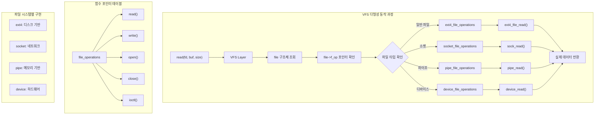

---
tags:
  - VFS
  - balanced
  - file_operations
  - intermediate
  - medium-read
  - 다형성
  - 시스템프로그래밍
  - 커널 구조체
  - 파일 디스크립터
difficulty: INTERMEDIATE
learning_time: "4-6시간"
main_topic: "시스템 프로그래밍"
priority_score: 4
---

# 6.2.3: 파일 연산과 VFS 인터페이스

## 파일 연산 디스패치

### 🎭 다형성의 교과서적 구현

C언어에는 클래스가 없는데 어떻게 다형성을 구현할까요? 답은 **함수 포인터 테이블**입니다!

제가 처음 이 코드를 봤을 때 감탄했습니다:

```c
// 모든 파일 타입이 구현해야 하는 "인터페이스"
struct file_operations {
    ssize_t (*read) (...);
    ssize_t (*write) (...);
    int (*open) (...);
    // ...
};

// ext4 파일시스템의 구현
struct file_operations ext4_file_operations = {
    .read = ext4_file_read,
    .write = ext4_file_write,
    .open = ext4_file_open,
};

// 소켓의 구현  
struct file_operations socket_file_operations = {
    .read = sock_read,
    .write = sock_write,
    .open = sock_no_open,  // 소켓은 open()이 아니라 socket()으로!
};

// 파이프의 구현
struct file_operations pipe_file_operations = {
    .read = pipe_read,
    .write = pipe_write,
    .open = NULL,  // 파이프는 pipe()로 생성!
};
```

### VFS 다형성 메커니즘



이제 `read(fd, buf, size)`를 호출하면:

1. fd로 file 구조체를 찾고
2. `file->f_op->read()`를 호출
3. 실제 구현체(ext4, socket, pipe 등)의 함수가 실행!

객체지향 언어의 가상 함수 테이블(vtable)과 똑같은 원리입니다! 🎯

### VFS 연산 테이블

```c
// 파일 연산 구조체
struct file_operations {
    struct module *owner;
    loff_t (*llseek) (struct file *, loff_t, int);
    ssize_t (*read) (struct file *, char __user *, size_t, loff_t *);
    ssize_t (*write) (struct file *, const char __user *, size_t, loff_t *);
    ssize_t (*read_iter) (struct kiocb *, struct iov_iter *);
    ssize_t (*write_iter) (struct kiocb *, struct iov_iter *);
    int (*iopoll)(struct kiocb *kiocb, bool spin);
    int (*iterate) (struct file *, struct dir_context *);
    int (*iterate_shared) (struct file *, struct dir_context *);
    __poll_t (*poll) (struct file *, struct poll_table_struct *);
    long (*unlocked_ioctl) (struct file *, unsigned int, unsigned long);
    long (*compat_ioctl) (struct file *, unsigned int, unsigned long);
    int (*mmap) (struct file *, struct vm_area_struct *);
    unsigned long mmap_supported_flags;
    int (*open) (struct inode *, struct file *);
    int (*flush) (struct file *, fl_owner_t id);
    int (*release) (struct inode *, struct file *);
    int (*fsync) (struct file *, loff_t, loff_t, int datasync);
    int (*fasync) (int, struct file *, int);
    int (*lock) (struct file *, int, struct file_lock *);
    ssize_t (*sendpage) (struct file *, struct page *, int, size_t, loff_t *, int);
    unsigned long (*get_unmapped_area)(struct file *, unsigned long, unsigned long, unsigned long, unsigned long);
    int (*check_flags)(int);
    int (*flock) (struct file *, int, struct file_lock *);
    ssize_t (*splice_write)(struct pipe_inode_info *, struct file *, loff_t *, size_t, unsigned int);
    ssize_t (*splice_read)(struct file *, loff_t *, struct pipe_inode_info *, size_t, unsigned int);
    int (*setlease)(struct file *, long, struct file_lock **, void **);
    long (*fallocate)(struct file *file, int mode, loff_t offset, loff_t len);
    void (*show_fdinfo)(struct seq_file *m, struct file *f);
    ssize_t (*copy_file_range)(struct file *, loff_t, struct file *, loff_t, size_t, unsigned int);
    loff_t (*remap_file_range)(struct file *file_in, loff_t pos_in,
                               struct file *file_out, loff_t pos_out,
                               loff_t len, unsigned int remap_flags);
    int (*fadvise)(struct file *, loff_t, loff_t, int);
};

// read() 시스템 콜 구현
SYSCALL_DEFINE3(read, unsigned int, fd, char __user *, buf, size_t, count) {
    struct fd f = fdget_pos(fd);
    ssize_t ret = -EBADF;
    
    if (f.file) {
        loff_t pos = file_pos_read(f.file);
        ret = vfs_read(f.file, buf, count, &pos);
        if (ret >= 0)
            file_pos_write(f.file, pos);
        fdput_pos(f);
    }
    return ret;
}

// VFS read 구현
ssize_t vfs_read(struct file *file, char __user *buf, size_t count, loff_t *pos) {
    ssize_t ret;
    
    if (!(file->f_mode & FMODE_READ))
        return -EBADF;
    if (!(file->f_mode & FMODE_CAN_READ))
        return -EINVAL;
    if (unlikely(!access_ok(buf, count)))
        return -EFAULT;
    
    ret = rw_verify_area(READ, file, pos, count);
    if (ret)
        return ret;
        
    if (count > MAX_RW_COUNT)
        count = MAX_RW_COUNT;
    
    // 파일 시스템별 read 함수 호출
    if (file->f_op->read)
        ret = file->f_op->read(file, buf, count, pos);
    else if (file->f_op->read_iter)
        ret = new_sync_read(file, buf, count, pos);
    else
        ret = -EINVAL;
        
    if (ret > 0) {
        fsnotify_access(file);
        add_rchar(current, ret);
    }
    inc_syscr(current);
    return ret;
}
```

## struct file 구조체 상세 구조

```c
// 3. 파일 구조체 (시스템 전역) - "실제 파일 객체"
// === 모든 열린 파일의 상태 정보 중앙 집권화 ===
// 평균 크기: ~200바이트, 전체 시스템에서 공유됨
// 예: 두 프로세스가 같은 파일 열면 → 2개의 fd, 1개의 struct file
struct file {
    // === 메모리 관리 최적화 ===
    union {
        struct llist_node    fu_llist;      // 해제 대기 리스트 (성능 최적화)
        struct rcu_head      fu_rcuhead;    // RCU 기반 안전한 해제
    } f_u;  // union으로 메모리 절약: 둘 중 하나만 사용
    
    // === 파일 식별과 접근 ===
    struct path             f_path;      // 파일의 풀 경로 (/home/user/file.txt)
                                         // 심볼릭 링크 해결된 최종 경로
    struct inode           *f_inode;     // 캐시된 inode 포인터 (빠른 접근)
                                         // 매번 경로 해석하지 않고 직접 접근 가능
    const struct file_operations *f_op;  // 파일 연산 테이블 (다형성 구현)
                                         // read(), write(), ioctl() 등 함수 포인터들
                                         // 일반파일 vs 장치파일 vs 네트워크 소켓 구분
    
    // === 동시성 제어 ===
    spinlock_t             f_lock;       // 파일 구조체 보호 락
                                         // 참조 카운트, 플래그 수정시 사용
    enum rw_hint           f_write_hint; // 쓰기 패턴 힌트 (SSD 최적화)
                                         // WRITE_LIFE_SHORT: 로그파일
                                         // WRITE_LIFE_LONG: 데이터베이스
    
    // === 참조 관리 (핵심!) ===
    atomic_long_t          f_count;      // 참조 카운트
                                         // dup(), fork() 시 증가
                                         // close() 시 감소, 0 되면 실제 해제
    
    // === 접근 권한과 모드 ===
    unsigned int           f_flags;      // 열기 플래그 (O_RDONLY, O_NONBLOCK 등)
                                         // 사용자가 open()에서 지정한 옵션들
    fmode_t                f_mode;       // 내부 모드 (FMODE_READ, FMODE_WRITE)
                                         // 커널 내부에서 사용하는 정규화된 모드
    
    // === 파일 위치 관리 ===
    struct mutex           f_pos_lock;   // 파일 위치 동기화 뮤텍스
                                         // 멀티스레드에서 lseek() 경합 조건 방지
    loff_t                 f_pos;        // 현재 파일 읽기/쓰기 위치
                                         // read()/write() 시 자동 업데이트
    
    // === 시그널과 소유권 ===
    struct fown_struct     f_owner;      // 시그널 전송용 소유자 정보
                                         // 비동기 I/O 완료시 SIGIO 전송할 프로세스
    const struct cred     *f_cred;       // 파일 열 때의 자격 증명
                                         // 권한 검사 시 사용 (uid, gid, capabilities)
    
    // === 성능 최적화 ===
    struct file_ra_state   f_ra;         // read-ahead 상태 정보
                                         // 순차 읽기 패턴 감지하여 미리 읽기
                                         // 디스크 I/O 지연 숨기기의 핵심!
    
    // === 메타데이터 ===
    u64                    f_version;    // 파일 버전 (캐시 일관성용)
    void                  *f_security;   // LSM(Linux Security Module) 정보
                                         // SELinux, AppArmor 등에서 사용
    void                  *private_data; // 드라이버/파일시스템 전용 데이터
                                         // 장치 드라이버가 자유롭게 사용
    
    // === 이벤트 시스템 연동 ===
    struct list_head       f_ep_links;    // epoll 백링크 리스트
                                          // 이 파일이 어떤 epoll에 등록되어 있나?
    struct list_head       f_tfile_llink; // tty 드라이버 링크
    
    // === 메모리 매핑 ===
    struct address_space  *f_mapping;     // 페이지 캐시 매핑 포인터
                                          // mmap(), 일반 read/write 캐싱 핵심
                                          // 물리 메모리와 파일의 연결고리
    
    // === 오류 추적 ===
    errseq_t               f_wb_err;      // write-back 오류 시퀄스 번호
    errseq_t               f_sb_err;      // 슈퍼블록 오류 시퀄스 번호
                                          // 비동기 쓰기 오류를 애플리케이션에 전파
};

// 4. inode 구조체
struct inode {
    umode_t             i_mode;        // 파일 모드와 권한
    unsigned short      i_opflags;
    kuid_t              i_uid;         // 소유자 UID
    kgid_t              i_gid;         // 소유자 GID
    unsigned int        i_flags;
    
    const struct inode_operations *i_op;
    struct super_block  *i_sb;         // 슈퍼블록 포인터
    struct address_space *i_mapping;    // 페이지 캐시
    
    unsigned long       i_ino;         // inode 번호
    union {
        const unsigned int i_nlink;
        unsigned int __i_nlink;
    };
    dev_t               i_rdev;        // 디바이스 파일용
    loff_t              i_size;        // 파일 크기
    struct timespec64   i_atime;       // 접근 시간
    struct timespec64   i_mtime;       // 수정 시간  
    struct timespec64   i_ctime;       // 변경 시간
    spinlock_t          i_lock;
    unsigned short      i_bytes;
    u8                  i_blkbits;
    u8                  i_write_hint;
    blkcnt_t            i_blocks;      // 할당된 블록 수
    
    seqcount_t          i_size_seqcount;
    unsigned long       i_state;
    struct rw_semaphore i_rwsem;
    
    unsigned long       dirtied_when;
    unsigned long       dirtied_time_when;
    
    struct hlist_node   i_hash;        // inode 해시 테이블
    struct list_head    i_io_list;
    struct list_head    i_lru;         // LRU 리스트
    struct list_head    i_sb_list;
    struct list_head    i_wb_list;
    
    union {
        struct hlist_head   i_dentry;  // 디렉토리 엔트리
        struct rcu_head     i_rcu;
    };
    
    atomic64_t          i_version;
    atomic64_t          i_sequence;
    atomic_t            i_count;       // 참조 카운트
    atomic_t            i_dio_count;
    atomic_t            i_writecount;
    
    union {
        const struct file_operations   *i_fop;
        void (*free_inode)(struct inode *);
    };
    
    struct file_lock_context *i_flctx;
    struct address_space    i_data;    // 파일 데이터 페이지
    struct list_head        i_devices;
    
    union {
        struct pipe_inode_info  *i_pipe;
        struct block_device     *i_bdev;
        struct cdev             *i_cdev;
        char                    *i_link;
        unsigned                i_dir_seq;
    };
    
    void                    *i_private;  // 파일시스템 전용
};
```

## 핵심 요점

### 1. VFS 다형성 구현

C 언어에서 함수 포인터 테이블을 통해 다형성을 구현하여, 모든 파일 타입을 통일된 인터페이스로 추상화합니다.

### 2. 실제 파일 상태 관리

struct file은 열린 파일의 모든 상태를 중앙집중식으로 관리하며, 다양한 최적화 기술을 적용합니다.

### 3. 참조 계수 기반 메모리 관리

동일한 파일을 여러 프로세스가 공유할 때 참조 계수를 통해 안전하게 메모리를 관리합니다.

---

**이전**: [Chapter 6.2.2: 파일 디스크립터 할당과 관리](./06-02-02-fd-allocation-management.md)  
**다음**: [Chapter 6.2.4: VFS와 파일시스템 구조](./06-02-04-vfs-filesystem.md)에서 VFS와 파일시스템의 상세한 관계를 학습합니다.

## 📚 관련 문서

### 📖 현재 문서 정보

- **난이도**: INTERMEDIATE
- **주제**: 시스템 프로그래밍
- **예상 시간**: 4-6시간

### 🎯 학습 경로

- [📚 INTERMEDIATE 레벨 전체 보기](../learning-paths/intermediate/)
- [🏠 메인 학습 경로](../learning-paths/)
- [📋 전체 가이드 목록](../README.md)

### 📂 같은 챕터 (chapter-06-file-io)

- [6.2.1: 파일 디스크립터의 내부 구조](./06-02-01-file-descriptor.md)
- [6.1.1: 파일 디스크립터 기본 개념과 3단계 구조](./06-01-01-fd-basics-structure.md)
- [6.2.2: 파일 디스크립터 할당과 공유 메커니즘](./06-02-02-fd-allocation-management.md)
- [6.2.4: VFS와 파일 시스템 추상화 개요](./06-02-04-vfs-filesystem.md)
- [6.1.2: VFS 기본 개념과 아키텍처](./06-01-02-vfs-fundamentals.md)

### 🏷️ 관련 키워드

`VFS`, `file_operations`, `다형성`, `커널 구조체`, `파일 디스크립터`

### ⏭️ 다음 단계 가이드

- 실무 적용을 염두에 두고 프로젝트에 적용해보세요
- 관련 도구들을 직접 사용해보는 것이 중요합니다
