---
tags:
  - balanced
  - dentry_cache
  - intermediate
  - medium-read
  - path_lookup
  - rcu
  - security
  - vfs
  - 시스템프로그래밍
difficulty: INTERMEDIATE
learning_time: "4-6시간"
main_topic: "시스템 프로그래밍"
priority_score: 4
---

# 6.2.5: 경로 탐색과 이름 해석

## 경로명 조회 메커니즘

### 🔍 경로 찾기의 모험

`/home/user/projects/kernel/driver.c`를 열 때 무슨 일이 일어날까요?

실제로 제가 `strace`로 추적해보았습니다:

```bash
$ strace -e openat cat /home/user/test.txt 2>&1 | grep openat
openat(AT_FDCWD, "/home/user/test.txt", O_RDONLY) = 3

# 커널 내부에서는:
# 1. "/" 루트 디렉토리의 dentry 찾기
# 2. "home" 컴포넌트 찾기 (dentry cache 확인)
# 3. "user" 컴포넌트 찾기
# 4. "test.txt" 파일 찾기
# 5. 각 단계마다 권한 확인!
```

### 🚀 덴트리 캐시의 위력

제가 성능 테스트를 해봤습니다:

```c
// 테스트 코드: 같은 파일을 1000번 열기
for (int i = 0; i < 1000; i++) {
    int fd = open("/home/user/data.txt", O_RDONLY);
    close(fd);
}

// 결과:
// 첫 번째 open(): 45 microseconds (디스크 접근)
// 두 번째부터: 2 microseconds (캐시 히트!)
```

22.5배 빨라졌습니다! 이게 바로 dcache의 힘입니다.

### 경로명 해석 과정

```mermaid
graph TD
    subgraph "경로 해석 과정: /home/user/test.txt"
        A["경로 시작: /home/user/test.txt"] --> B["1. Root dentry 획득 (/)"]
        B --> C["2. 'home' 컴포넌트 찾기"]
        C --> D{dentry cache hit?}
        D -->|Yes| E["캐시에서 dentry 반환"]
        D -->|No| F["디스크에서 읽기"]
        F --> G["dentry cache에 저장"]
        G --> E
        E --> H["3. 권한 검사 (x 비트)"]
        H --> I["4. 'user' 컴포넌트 찾기"]
        I --> J{dentry cache hit?}
        J -->|Yes| K["캐시에서 반환"]
        J -->|No| L["디스크에서 읽기"]
        L --> M["캐시에 저장"]
        M --> K
        K --> N["5. 권한 검사"]
        N --> O["6. 'test.txt' 파일 찾기"]
        O --> P["7. 최종 inode 반환"]
    end
    
    subgraph "dentry cache 구조"
        DC1["Hash Table"]
        DC2["LRU List"]
        DC3["RCU Protection"]
        DC4["Negative dentries"]
    end
    
    subgraph "성능 최적화"
        OP1["RCU 무잠금 읽기"]
        OP2["해시 기반 빠른 조회"]
        OP3["부정 캐시 (파일 없음 정보)"]
        OP4["경로별 권한 캐싱"]
    end
```



경로명 조회의 핵심 구조체와 알고리즘을 살펴보겠습니다:

```c
// 경로명 조회의 핵심 함수
struct nameidata {
    struct path     path;       // 현재 경로
    struct qstr     last;       // 마지막 컴포넌트
    struct path     root;       // 루트 디렉토리
    struct inode   *inode;      // 경로의 inode
    unsigned int    flags;      // 조회 플래그
    unsigned        seq;        // 시퀀스 번호
    int             last_type;  // 마지막 컴포넌트 타입
    unsigned        depth;      // 심볼릭 링크 깊이
    int             total_link_count;  // 전체 링크 카운트
    
    struct saved {
        struct path link;
        struct delayed_call done;
        const char *name;
        unsigned seq;
    } *stack, internal[EMBEDDED_LEVELS];
    
    struct filename *name;
    struct nameidata *saved;
    unsigned        root_seq;
    int             dfd;
};
```

## 경로명 해석 핵심 알고리즘

```c
// 경로명 해석 핵심 알고리즘 - 모든 파일 접근의 시작점
// 실제 사용: open(), stat(), access() 등 모든 파일 시스템 호출에서 실행 (1초당 수만 번)
// 성능: 경로 해석은 전체 I/O 성능의 20-30%를 차지하는 중요한 부분
static int link_path_walk(const char *name, struct nameidata *nd) {
    int err;
    
    // ⭐ 1단계: 입력 경로 유효성 검증
    // IS_ERR: 커널 포인터 에러 체크 (예: -ENOMEM, -EFAULT)
    if (IS_ERR(name))
        return PTR_ERR(name);
    
    // ⭐ 2단계: 경로 시작 부분의 슬래시 제거
    // 예시: "///usr///bin//ls" → "usr///bin//ls"
    // 성능 최적화: 불필요한 루프 반복 방지
    while (*name=='/')
        name++;
    if (!*name)
        return 0;  // 루트 경로만 있는 경우 ("/" or "///" 등)
        
    // ⭐ 3단계: 경로 컴포넌트별 순차 처리 루프
    // 실무 예시: "/usr/bin/gcc" → "usr" → "bin" → "gcc" 순서로 처리
    for(;;) {
        u64 hash_len;  // 해시값과 길이를 64비트로 패킹 (성능 최적화)
        int type;      // 컴포넌트 타입 (일반/현재디렉토리/상위디렉토리)
        
        // ⭐ 4단계: 디렉토리 탐색 권한 확인 - 보안의 첫 번째 방어선
        // === 보안 컨텍스트: Unix 권한 모델의 핵심 ===
        // may_lookup: 현재 디렉토리에 대한 실행 권한 검사 (x 비트)
        // 
        // 🔒 보안 시나리오 예시:
        // - /home/alice/private/ (700 권한) → bob 사용자는 접근 불가
        // - /var/log/ (755 권한) → 일반 사용자도 디렉토리 탐색 가능
        // - /root/ (700 권한) → root만 접근 가능 (관리자 디렉토리 보호)
        //
        // 🚨 실제 공격 방어:
        // - Path Traversal 공격: "../../../etc/passwd" 같은 경로에서 권한 확인
        // - Privilege Escalation: 권한 없는 사용자의 시스템 디렉토리 접근 차단
        // - Directory Enumeration: 디렉토리 목록 조회 권한 사전 검증
        //
        // 성능 vs 보안: 매 컴포넌트마다 권한 검사 → 약간의 오버헤드 있지만 보안 필수
        err = may_lookup(nd);
        if (err)
            return err;  // -EACCES: 권한 거부, -EPERM: 작업 불허
            
        // ⭐ 5단계: 컴포넌트 이름 해시 계산
        // hash_name: dcache 조회를 위한 해시값 생성 (빠른 캐시 탐색)
        // 성능: O(1) 해시 테이블 조회로 디스크 접근 최소화
        hash_len = hash_name(nd->path.dentry, name);
        
        // ⭐ 6단계: 특수 디렉토리 처리 ("." and "..") - 경로 조작 공격의 핵심 방어점
        // === 보안 컨텍스트: Path Traversal 공격 방어 ===
        type = LAST_NORM;
        if (name[0] == '.') switch (hashlen_len(hash_len)) {
            case 2:
                if (name[1] == '.') {
                    // 🚨 ".." 상위 디렉토리 - 가장 위험한 경로 조작 벡터
                    // 
                    // 실제 공격 시나리오:
                    // - 웹 서버: "../../../etc/passwd" → 시스템 파일 접근 시도
                    // - 컨테이너 탈출: "../../../../host_root/" → 호스트 파일시스템 접근
                    // - chroot 탈출: 루트 디렉토리 변경 우회 시도
                    //
                    // 🛡️ 보안 대응 메커니즘:
                    // 1. 마운트 경계 검사: 다른 파일시스템으로 넘어가는지 확인
                    // 2. chroot 감옥 탈출 방지: 루트 디렉토리 이상 이동 차단
                    // 3. 컨테이너 경계 확인: namespace 경계 넘나듦 탐지
                    //
                    // LOOKUP_JUMPED 플래그: 보안 감사를 위한 추적 정보
                    // - SELinux/AppArmor가 이 플래그로 경계 넘나듦 탐지
                    // - 컨테이너 런타임이 탈출 시도 모니터링
                    type = LAST_DOTDOT;
                    nd->flags |= LOOKUP_JUMPED;  // 보안 감사 시스템에 신호
                }
                break;
            case 1:
                // "." 현재 디렉토리: 상대적으로 안전하지만 성능 최적화 필요
                // 보안 영향: 무한 루프 방지 (예: "./././." 패턴)
                type = LAST_DOT;
        }
        
        // ⭐ 7단계: 일반 파일명에 대한 파일시스템별 해시 처리
        // === 보안 컨텍스트: 파일명 정규화 공격 방어 ===
        if (likely(type == LAST_NORM)) {
            struct dentry *parent = nd->path.dentry;
            nd->flags &= ~LOOKUP_JUMPED;  // 정상 경로로 복귀
            
            // 🔍 파일시스템별 커스텀 해시 함수 - 파일명 정규화 공격 방어점
            // 
            // 🚨 Unicode 정규화 공격 시나리오:
            // - "file.txt" vs "f‌ile.txt" (중간에 제로폭 문자 삽입)
            // - "résumé.pdf" vs "resume\u0301.pdf" (조합 문자 vs 사전 조합)
            // - "test.EXE" vs "test.exe" (대소문자 혼용으로 필터 우회)
            //
            // 🛡️ 방어 메커니즘별 예시:
            // - FAT32: 모든 파일명을 대문자로 정규화 → 대소문자 우회 공격 차단
            // - NTFS: Unicode NFC 정규화 → 동일 문자의 다양한 인코딩 통일
            // - ext4 casefold: 대소문자 구분 없는 조회 → 일관된 보안 정책
            //
            // 실무 예시: FAT32는 대소문자 구분 안함, NTFS는 Unicode 정규화
            if (unlikely(parent->d_flags & DCACHE_OP_HASH)) {
                struct qstr this = { 
                    .hash_len = hash_len, 
                    .name = name 
                };
                // 파일시스템별 보안 정책 적용 (정규화, 필터링, 변환)
                err = parent->d_op->d_hash(parent, &this);
                if (err < 0)
                    return err;  // 보안 정책 위반 시 접근 차단
                hash_len = this.hash_len;
                name = this.name;  // 정규화된 안전한 파일명으로 교체
            }
        }
        
        // ⭐ 8단계: 현재 컴포넌트 정보 nameidata에 저장
        // 다음 단계 (walk_component)에서 사용할 정보 준비
        nd->last.hash_len = hash_len;
        nd->last.name = name;
        nd->last_type = type;
        
        // ⭐ 9단계: 다음 컴포넌트 위치로 이동
        name += hashlen_len(hash_len);
        if (!*name)
            goto OK;  // 경로 끝 도달: 마지막 컴포넌트 처리 완료
            
        // ⭐ 10단계: 중간 경로 유효성 검증
        // 중간 컴포넌트는 반드시 디렉토리여야 함 (예: /usr/bin/gcc에서 usr, bin)
        if (*name != '/') {
            return -ENOTDIR;  // "file.txt/invalid" 같은 잘못된 경로
        }
        
        // ⭐ 11단계: 연속된 슬래시 처리
        // 예시: "usr///bin" → 다음 "bin" 위치로 이동
        // POSIX 호환성: 여러 슬래시를 하나로 처리
        do {
            name++;
        } while (unlikely(*name == '/'));
        
        if (unlikely(!*name)) {
OK:
            // 경로 끝에 도달: 성공적으로 모든 컴포넌트 파싱 완료
            return 0;
        }
        
        // ⭐ 12단계: 실제 디렉토리 탐색 실행
        // walk_component: dcache 조회 → 캐시 미스 시 디스크 I/O
        // WALK_FOLLOW: 심볼릭 링크 따라가기, WALK_MORE: 더 많은 컴포넌트 존재
        err = walk_component(nd, WALK_FOLLOW | WALK_MORE);
        if (err < 0)
            return err;
            
        // ⭐ 13단계: 심볼릭 링크 처리 - 복잡한 보안 벡터
        // === 보안 컨텍스트: 심볼릭 링크 공격 방어 ===
        if (err) {
            // 🚨 심볼릭 링크 발견 - 다양한 보안 위협의 시작점
            // 
            // 주요 공격 시나리오:
            // 1. 🔄 심볼릭 링크 루프 공격:
            //    - /tmp/a → /tmp/b, /tmp/b → /tmp/a (무한 루프)
            //    - 시스템 리소스 고갈 (CPU, 메모리) → DoS 공격
            //
            // 2. 🎯 권한 우회 공격:
            //    - /tmp/evil → /etc/passwd (높은 권한 파일 접근)
            //    - /var/www/upload/hack → /root/.ssh/id_rsa (SSH 키 탈취)
            //
            // 3. 🏃 Race Condition 공격 (TOCTTOU):
            //    - 검사 시점: /tmp/safe → /tmp/harmless.txt
            //    - 사용 시점: /tmp/safe → /etc/passwd (링크 대상 변경)
            //
            // 4. 📂 디렉토리 순회 공격:
            //    - ../../../etc/shadow (상대 경로를 통한 시스템 파일 접근)
            //    - 컨테이너 탈출: ../../../../host_root/etc/passwd
            //
            // 🛡️ 보안 대응 메커니즘:
            // - nested_symlink(): 재귀 깊이 제한 (MAXSYMLINKS = 40)
            // - 권한 재검사: 링크 대상에 대한 새로운 권한 확인
            // - 마운트 경계 추적: 다른 파일시스템으로의 이동 감지
            // - LOOKUP_JUMPED 플래그: 보안 감사 시스템 알림
            //
            // 실무 예시: /usr/bin → /bin 심볼릭 링크 처리 (정상적 사용)
            // 성능 영향: 링크당 추가 경로 해석 비용 (약 1-5μs)
            return nested_symlink(nd);  // 보안 검사와 함께 링크 대상으로 이동
        }
    }
}
```

## 덴트리 캐시 구현

### 덴트리 캐시 조회 최적화

```c
// 덴트리 캐시 조회
static struct dentry *__d_lookup_rcu(const struct dentry *parent,
                                     const struct qstr *name,
                                     unsigned *seqp) {
    u64 hashlen = name->hash_len;
    const unsigned char *str = name->name;
    struct hlist_bl_head *b = d_hash(hashlen_hash(hashlen));
    struct hlist_bl_node *node;
    struct dentry *dentry;
    
    // RCU를 사용한 lock-free 조회
    hlist_bl_for_each_entry_rcu(dentry, node, b, d_hash) {
        unsigned seq;
        
        if (dentry->d_parent != parent)
            continue;
            
        seq = raw_seqcount_begin(&dentry->d_seq);
        if (dentry->d_parent != parent)
            continue;
        if (d_unhashed(dentry))
            continue;
            
        if (unlikely(parent->d_flags & DCACHE_OP_COMPARE)) {
            int tlen = dentry->d_name.len;
            const char *tname = dentry->d_name.name;
            if (parent->d_op->d_compare(dentry, tlen, tname, name))
                continue;
        } else {
            if (dentry->d_name.hash_len != hashlen)
                continue;
            if (dentry_cmp(dentry, str, hashlen_len(hashlen)) != 0)
                continue;
        }
        
        *seqp = seq;
        return dentry;
    }
    
    return NULL;
}
```

### 덴트리 캐시 관리

```c
// 덴트리 캐시 해시 테이블
static struct hlist_bl_head *dentry_hashtable __read_mostly;
static unsigned int d_hash_shift __read_mostly;

// 덴트리 할당과 초기화
struct dentry *d_alloc(struct dentry *parent, const struct qstr *name) {
    struct dentry *dentry;
    char *dname;
    int err;
    
    dentry = kmem_cache_alloc(dentry_cache, GFP_KERNEL);
    if (!dentry)
        return NULL;
        
    // 이름 공간 할당
    dentry->d_name.len = name->len;
    dentry->d_name.hash = name->hash;
    dname = dentry->d_iname;
    
    if (unlikely(name->len > DNAME_INLINE_LEN - 1)) {
        size_t size = offsetof(struct external_name, name[1]);
        struct external_name *p = kmalloc(size + name->len, GFP_KERNEL);
        if (!p) {
            kmem_cache_free(dentry_cache, dentry);
            return NULL;
        }
        atomic_set(&p->u.count, 1);
        dname = p->name;
    }
    
    // 이름 복사
    memcpy(dname, name->name, name->len);
    dname[name->len] = 0;
    
    // 덴트리 초기화
    dentry->d_name.name = dname;
    dentry->d_lockref.count = 1;
    dentry->d_flags = 0;
    spin_lock_init(&dentry->d_lock);
    seqcount_spinlock_init(&dentry->d_seq, &dentry->d_lock);
    dentry->d_inode = NULL;
    dentry->d_parent = dentry;
    dentry->d_sb = NULL;
    dentry->d_op = NULL;
    dentry->d_fsdata = NULL;
    INIT_HLIST_BL_NODE(&dentry->d_hash);
    INIT_LIST_HEAD(&dentry->d_lru);
    INIT_LIST_HEAD(&dentry->d_subdirs);
    INIT_HLIST_NODE(&dentry->d_u.d_alias);
    INIT_LIST_HEAD(&dentry->d_child);
    d_set_d_op(dentry, dentry->d_sb->s_d_op);
    
    if (parent) {
        dentry->d_parent = parent;
        dentry->d_sb = parent->d_sb;
        d_set_d_op(dentry, dentry->d_sb->s_d_op);
        list_add(&dentry->d_child, &parent->d_subdirs);
    }
    
    this_cpu_inc(nr_dentry);
    
    return dentry;
}
```

### LRU 기반 캐시 관리

```c
// LRU를 사용한 덴트리 회수
static void shrink_dcache_sb(struct super_block *sb, int nr_to_scan) {
    LIST_HEAD(dispose);
    struct dentry *dentry;
    
    spin_lock(&sb->s_dentry_lru_lock);
    
    while (nr_to_scan-- && !list_empty(&sb->s_dentry_lru)) {
        dentry = list_first_entry(&sb->s_dentry_lru,
                                 struct dentry, d_lru);
        
        // 사용 중인 덴트리는 건너뜀
        if (dentry->d_lockref.count)
            continue;
            
        // LRU에서 제거하고 처리 리스트로 이동
        list_move(&dentry->d_lru, &dispose);
    }
    
    spin_unlock(&sb->s_dentry_lru_lock);
    
    // 덴트리 해제
    shrink_dentry_list(&dispose);
}
```

## 성능 최적화 사례

### 캐시 히트 비율 분석

실제 프로덕션 서버에서 측정한 덴트리 캐시 효과:

```bash
# 캐시 통계 확인
$ cat /proc/sys/fs/dentry-state
127543  115234  45  0  123456  0
# (사용중) (사용가능) (에이지) (...)

# 캐시 히트 비율 측정 스크립트
#!/bin/bash
echo "덴트리 캐시 효과 측정"

# 캐시 비우기
echo 2 > /proc/sys/vm/drop_caches

echo "첫 번째 스캔 (캐시 미스)"
time find /usr -type f -name "*.so" | wc -l

echo "두 번째 스캔 (캐시 히트)"
time find /usr -type f -name "*.so" | wc -l

# 결과 예시:
# 첫 번째: 8.234초
# 두 번째: 0.156초 (52배 빨라짐!)
```

### RCU 기반 Lock-free 조회

덴트리 캐시의 핵심 성능 최적화는 RCU(Read-Copy-Update)를 사용한 lock-free 조회입니다:

```c
// RCU 보호된 덴트리 조회
static inline struct dentry *__d_lookup(const struct dentry *parent,
                                        const struct qstr *name) {
    unsigned int len = name->len;
    unsigned int hash = name->hash;
    const unsigned char *str = name->name;
    struct hlist_bl_head *b = d_hash(hash);
    struct hlist_bl_node *node;
    struct dentry *found = NULL;
    struct dentry *dentry;
    
    // RCU 읽기 섹션 시작
    rcu_read_lock();
    
    hlist_bl_for_each_entry_rcu(dentry, node, b, d_hash) {
        if (dentry->d_name.hash != hash)
            continue;
        if (dentry->d_parent != parent)
            continue;
        if (!d_same_name(dentry, parent, name))
            continue;
        
        // 참조 카운트 증가 (안전하게)
        if (!lockref_get_not_dead(&dentry->d_lockref))
            continue;
            
        found = dentry;
        break;
    }
    
    rcu_read_unlock();
    return found;
}
```

## 보안 고려사항

### Path Traversal 방어

경로명 조회 과정에서의 주요 보안 검증점:

1.**권한 검사**: 각 디렉토리별 실행 권한 확인
2.**경계 검사**: chroot, 마운트 경계 넘나듦 탐지
3.**심볼릭 링크 제한**: 무한 루프 방지 및 깊이 제한
4.**파일명 정규화**: Unicode 공격 방어

```c
// 권한 검사 예시
static int may_lookup(struct nameidata *nd) {
    if (nd->flags & LOOKUP_RCU) {
        int err = inode_permission(nd->inode, MAY_EXEC|MAY_NOT_BLOCK);
        if (err != -ECHILD)
            return err;
        if (unlazy_walk(nd, NULL, 0))
            return -ECHILD;
    }
    return inode_permission(nd->inode, MAY_EXEC);
}
```

## 핵심 요점

### 1. 덴트리 캐시의 위력

-**성능 향상**: 22-52배 경로 조회 속도 향상
-**메모리 효율**: LRU 기반 동적 크기 조절
-**병렬 처리**: RCU를 통한 lock-free 읽기

### 2. 보안과 성능의 균형

-**매 단계 권한 확인**: 약간의 오버헤드지만 보안 필수
-**심볼릭 링크 추적**: 공격 벡터 차단과 정상 사용 지원
-**경계 넘나듦 탐지**: 컨테이너 탈출 방지

### 3. 실전 최적화 포인트

-**캐시 크기 튜닝**: `/proc/sys/vm/vfs_cache_pressure`
-**메모리 압력 관리**: shrinker 콜백으로 동적 조절
-**파일시스템별 최적화**: 커스텀 해시/비교 함수

---

**이전**: [Chapter 6.1.2: VFS 기본 개념과 아키텍처](./06-01-02-vfs-fundamentals.md)  
**다음**: [Chapter 6.2.6: 마운트 시스템과 네임스페이스](./06-02-06-mount-system.md)에서 파일시스템 통합 메커니즘을 학습합니다.

## 📚 관련 문서

### 📖 현재 문서 정보

-**난이도**: INTERMEDIATE
-**주제**: 시스템 프로그래밍
-**예상 시간**: 4-6시간

### 🎯 학습 경로

- [📚 INTERMEDIATE 레벨 전체 보기](../learning-paths/intermediate/)
- [🏠 메인 학습 경로](../learning-paths/)
- [📋 전체 가이드 목록](../README.md)

### 📂 같은 챕터 (chapter-06-file-io)

- [6.2.1: 파일 디스크립터의 내부 구조](./06-02-01-file-descriptor.md)
- [6.1.1: 파일 디스크립터 기본 개념과 3단계 구조](./06-01-01-fd-basics-structure.md)
- [6.2.2: 파일 디스크립터 할당과 공유 메커니즘](./06-02-02-fd-allocation-management.md)
- [6.2.3: 파일 연산과 VFS 다형성](./06-02-03-file-operations-vfs.md)
- [6.2.4: VFS와 파일 시스템 추상화 개요](./06-02-04-vfs-filesystem.md)

### 🏷️ 관련 키워드

`vfs`, `dentry_cache`, `path_lookup`, `rcu`, `security`

### ⏭️ 다음 단계 가이드

- 실무 적용을 염두에 두고 프로젝트에 적용해보세요
- 관련 도구들을 직접 사용해보는 것이 중요합니다
