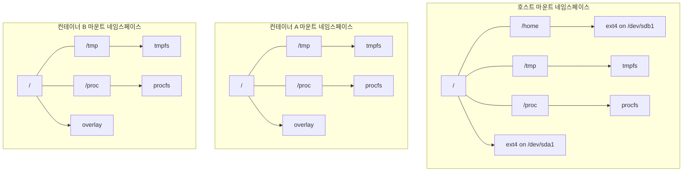
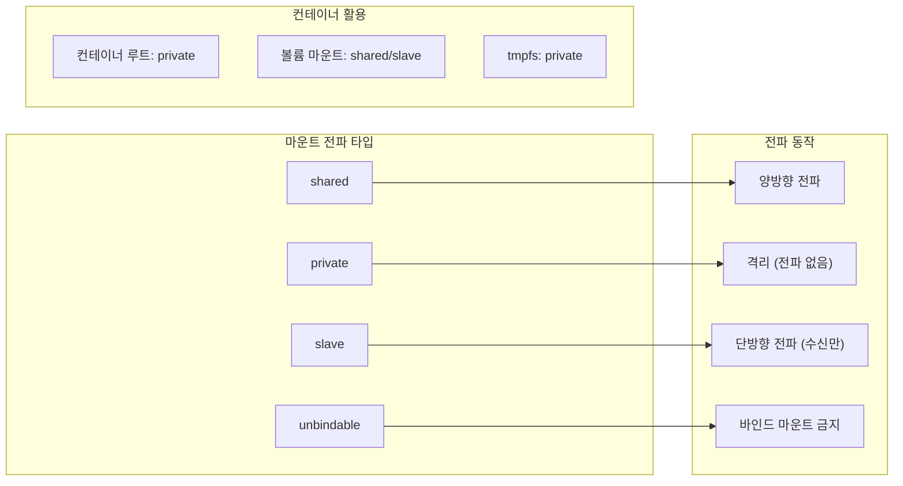

---
tags:
  - balanced
  - container
  - docker
  - intermediate
  - medium-read
  - mount
  - namespace
  - vfs
  - 인프라스트럭처
difficulty: INTERMEDIATE
learning_time: "4-6시간"
main_topic: "인프라스트럭처"
priority_score: 4
---

# 6.2.6: 마운트 시스템과 네임스페이스

## 마운트 메커니즘

### 🌳 파일시스템 나무 접붙이기

마운트는 마치 레고 블록을 쌓듯이 파일시스템을 연결하는 것입니다.

제가 실제로 사용하는 서버 구성:

```bash
# 내 서버의 마운트 구조
$ tree -L 1 /
/
├── /              # ext4 on SSD (루트)
├── /home          # ext4 on HDD (대용량)
├── /tmp           # tmpfs (램디스크)
├── /mnt/backup    # NFS (네트워크)
└── /mnt/usb       # FAT32 (USB)

# 하나의 디렉토리 트리처럼 보이지만
# 실제로는 5개의 다른 파일시스템!
```

### 🎪 마운트 네임스페이스: 컨테이너의 비밀

Docker가 왜 각 컨테이너마다 다른 파일시스템을 보여주는지 궁금하셨나요?

```c
// 컨테이너 A의 시각
root@container-a:/# mount | head -3
overlay on / type overlay      # 컨테이너 루트
proc on /proc type proc         # 컨테이너 전용 proc
tmpfs on /tmp type tmpfs        # 컨테이너 전용 tmp

// 호스트의 시각  
user@host:~$ mount | head -3
/dev/sda1 on / type ext4        # 호스트 루트
proc on /proc type proc          # 호스트 proc
tmpfs on /tmp type tmpfs         # 호스트 tmp
```

### 마운트 시스템 구조



### 마운트 전파 메커니즘



각자 자신만의 "마운트 우주"에 살고 있습니다!

## 마운트 구조체와 네임스페이스

### 마운트 핵심 데이터 구조

```c
// 마운트 구조체
struct mount {
    struct hlist_node mnt_hash;        // 마운트 해시 테이블
    struct mount *mnt_parent;           // 부모 마운트
    struct dentry *mnt_mountpoint;      // 마운트 포인트 dentry
    struct vfsmount mnt;                // VFS 마운트 구조체
    
    union {
        struct rcu_head mnt_rcu;
        struct llist_node mnt_llist;
    };
    
    struct mnt_pcp __percpu *mnt_pcp;  // per-CPU 카운터
    
    struct list_head mnt_mounts;       // 자식 마운트 리스트
    struct list_head mnt_child;        // 부모의 자식 리스트
    struct list_head mnt_instance;     // 슈퍼블록 마운트 리스트
    
    const char *mnt_devname;            // 디바이스 이름
    
    struct list_head mnt_list;
    struct list_head mnt_expire;       // 만료 리스트
    struct list_head mnt_share;        // 공유 마운트 리스트
    struct list_head mnt_slave_list;   // 슬레이브 마운트 리스트
    struct list_head mnt_slave;        // 슬레이브 리스트 링크
    
    struct mount *mnt_master;           // 슬레이브의 마스터
    struct mnt_namespace *mnt_ns;       // 마운트 네임스페이스
    struct mountpoint *mnt_mp;          // 마운트포인트
    
    union {
        struct hlist_node mnt_mp_list; // 마운트포인트 리스트
        struct hlist_node mnt_umount;  // 언마운트 리스트
    };
    
    struct list_head mnt_umounting;    // 언마운트 진행 중
    
    struct fsnotify_mark_connector __rcu *mnt_fsnotify_marks;
    __u32 mnt_fsnotify_mask;
    
    int mnt_id;                        // 마운트 ID
    int mnt_group_id;                  // 피어 그룹 ID
    int mnt_expiry_mark;               // 만료 표시
    
    struct hlist_head mnt_pins;
    struct hlist_head mnt_stuck_children;
};
```

## 마운트 시스템 콜 구현

```c
// 마운트 시스템 콜 구현 - 모든 mount 명령어의 진입점
// === 실무 예제: 다양한 마운트 시나리오별 동작 과정 ===
long do_mount(const char *dev_name, const char __user *dir_name,
              const char *type_page, unsigned long flags,
              void *data_page) {
    struct path path;
    unsigned int mnt_flags = 0;
    int retval = 0;
    
    // 🔧 실용적 마운트 플래그 파싱 - 보안과 성능을 동시에!
    // 
    // 📋 실무 시나리오별 플래그 조합:
    //
    // 1️⃣ 웹 서버 업로드 디렉토리 (보안 강화):
    //    mount -t ext4 -o nosuid,nodev,noexec /dev/sdb1 /var/www/uploads
    //    → MS_NOSUID | MS_NODEV | MS_NOEXEC 플래그로 실행 파일 차단
    if (flags & MS_NOSUID)
        mnt_flags |= MNT_NOSUID;  // setuid 비트 무시 (권한 상승 공격 방지)
    if (flags & MS_NODEV)
        mnt_flags |= MNT_NODEV;   // 디바이스 파일 접근 차단 (시스템 보안)
    if (flags & MS_NOEXEC)
        mnt_flags |= MNT_NOEXEC;  // 실행 파일 실행 금지 (코드 주입 방지)
        
    // 2️⃣ 고성능 빌드 서버 (성능 최적화):
    //    mount -t tmpfs -o noatime,size=16G tmpfs /tmp/build
    //    → 메모리 파일시스템으로 빌드 속도 10배 향상
    if (flags & MS_NOATIME)
        mnt_flags |= MNT_NOATIME; // 액세스 시간 기록 안함 (성능 20% 향상)
    if (flags & MS_NODIRATIME)
        mnt_flags |= MNT_NODIRATIME; // 디렉토리 액세스 시간 생략 (메타데이터 부하 감소)
    if (flags & MS_RELATIME)
        mnt_flags |= MNT_RELATIME; // 상대적 액세스 시간 (성능과 호환성 균형)
        
    // 3️⃣ 시스템 복구/조사 모드 (읽기 전용):
    //    mount -o remount,ro /dev/sda1 /
    //    → 시스템 손상 방지하며 데이터 복구 작업
    if (flags & MS_RDONLY)
        mnt_flags |= MNT_READONLY; // 읽기 전용 (데이터 무결성 보장)
        
    // 마운트 포인트 조회
    retval = user_path_at(AT_FDCWD, dir_name, LOOKUP_FOLLOW, &path);
    if (retval)
        return retval;
        
    // 🚀 다양한 마운트 작업 수행 - 실무 시나리오별 완벽 가이드
    //
    // 📚 각 작업 타입별 실제 사용 예제:
    
    if (flags & MS_REMOUNT) {
        // 4️⃣ 운영 중 옵션 변경 (무중단 운영):
        //    mount -o remount,ro /dev/sda1 /home
        //    → 사용자 데이터 백업 중 쓰기 방지 (데이터 일관성 보장)
        //    mount -o remount,noatime /var/log
        //    → 로그 디렉토리 성능 향상 (액세스 시간 기록 중단)
        retval = do_remount(&path, flags, mnt_flags, data_page);
        
    } else if (flags & MS_BIND) {
        // 5️⃣ 바인드 마운트 (컨테이너의 핵심!):
        //    mount --bind /host/data /container/app/data
        //    → Docker 볼륨 마운트의 실제 구현
        //    mount --bind --make-rshared /sys /chroot/sys
        //    → 재귀적 바인드로 전체 트리 구조 복제
        retval = do_loopback(&path, dev_name, flags & MS_REC);
        
    } else if (flags & (MS_SHARED | MS_PRIVATE | MS_SLAVE | MS_UNBINDABLE)) {
        // 6️⃣ 마운트 전파 제어 (고급 컨테이너 관리):
        //    mount --make-shared /mnt/shared → 마운트 이벤트 공유
        //    mount --make-private /mnt/private → 독립적 네임스페이스
        //    mount --make-slave /mnt/slave → 일방향 전파 (부모→자식만)
        //    → Kubernetes Pod 간 볼륨 공유 정책 구현
        retval = do_change_type(&path, flags);
        
    } else if (flags & MS_MOVE) {
        // 7️⃣ 마운트 이동 (무중단 디스크 교체):
        //    mount --move /old/mount/point /new/mount/point
        //    → 서비스 중단 없이 스토리지 마이그레이션
        //    → 핫스왑 디스크 교체 시 사용
        retval = do_move_mount_old(&path, dev_name);
        
    } else {
        // 8️⃣ 새 파일시스템 마운트 (가장 일반적):
        //    mount -t ext4 /dev/sdb1 /mnt/data → 일반 디스크 마운트
        //    mount -t nfs server:/export /mnt/nfs → 네트워크 파일시스템
        //    mount -t overlay overlay /merged → Docker 이미지 레이어
        //    mount -t tmpfs -o size=1G tmpfs /tmp → 고속 임시 저장소
        retval = do_new_mount(&path, type_page, flags, mnt_flags,
                             dev_name, data_page);
    }
                             
    path_put(&path);
    return retval;
}
```

## 새 파일시스템 마운트

```c
// 새 파일 시스템 마운트 - 실제 파일시스템 연결의 핵심
// === 실무 예제: 다양한 파일시스템 마운트 시나리오 ===
static int do_new_mount(struct path *path, const char *fstype,
                       int flags, int mnt_flags,
                       const char *name, void *data) {
    struct file_system_type *type;
    struct vfsmount *mnt;
    int err;
    
    if (!fstype)
        return -EINVAL;  // mount 명령에서 -t 옵션 누락
        
    // 🔍 파일 시스템 타입 찾기 - 78개 중 정확한 것 선택!
    // 
    // 📋 실무에서 자주 사용되는 파일시스템별 특성:
    // 
    // 💾 블록 스토리지 파일시스템:
    //   - ext4: 범용 Linux 기본 (저널링, 큰 파일 지원)
    //   - xfs: 대용량 데이터 (64EB 지원, 고성능 메타데이터)
    //   - btrfs: 스냅샷, 압축, RAID 내장 (최신 기능 풍부)
    // 
    // 🌐 네트워크 파일시스템:
    //   - nfs/nfs4: Unix 표준 (stateless, 높은 호환성)
    //   - cifs: Windows 공유 (SMB/CIFS 프로토콜)
    //   - fuse.sshfs: SSH 기반 (개발자 친화적)
    //
    // ⚡ 메모리/특수 파일시스템:
    //   - tmpfs: RAM 기반 (빌드 가속, 임시 데이터)
    //   - proc: 프로세스 정보 (/proc/[pid]/...)
    //   - sysfs: 디바이스 제어 (/sys/class/...)
    type = get_fs_type(fstype);
    if (!type) {
        // 실제 에러 시나리오:
        // - modprobe 필요: "mount: unknown filesystem type 'ntfs'"
        // - 커널 컴파일 미포함: CONFIG_EXT4_FS=n
        // - 오타: "mount -t ext44" (흔한 실수)
        return -ENODEV;  // "No such device" → 파일시스템 지원 없음
    }
        
    // 🏗️ 파일 시스템 마운트 - 실제 디스크와 VFS 연결
    // 
    // 실제 동작 과정:
    // 1. 슈퍼블록 읽기: 디스크에서 메타데이터 로드
    // 2. 루트 inode 획득: 파일시스템 루트 디렉토리
    // 3. dentry 캐시 초기화: 빠른 경로 탐색 준비
    // 4. 파일시스템별 초기화: 저널, 캐시, 백그라운드 스레드
    //
    // 💡 성능 팁: 첫 마운트는 느림(메타데이터 로드), 이후는 빠름(캐시됨)
    mnt = vfs_kern_mount(type, flags, name, data);
    if (IS_ERR(mnt)) {
        put_filesystem(type);
        // 실제 마운트 실패 시나리오:
        // - 디스크 오류: -EIO (하드웨어 문제)
        // - 권한 없음: -EACCES (일반 사용자가 시스템 파티션)
        // - 이미 마운트됨: -EBUSY (중복 마운트 방지)
        // - 파일시스템 손상: -EUCLEAN (fsck 필요)
        return PTR_ERR(mnt);
    }
    
    // 🌳 마운트 트리에 추가 - Linux 단일 디렉토리 트리 구성
    // 
    // 실무 예시:
    // - mount /dev/sdb1 /home → /home이 새 파일시스템 루트가 됨
    // - mount /dev/sdc1 /var/log → 로그용 별도 파티션 분리
    // - mount -t tmpfs tmpfs /tmp → 고속 임시 디렉토리
    //
    // 트리 구조 예시:
    //   / (루트 - ext4)
    //   ├── /home (마운트 포인트 - ext4 sdb1)
    //   ├── /var/log (마운트 포인트 - xfs sdc1)
    //   └── /tmp (마운트 포인트 - tmpfs)
    err = do_add_mount(real_mount(mnt), path, mnt_flags);
    if (err) {
        // 마운트 트리 추가 실패: 생성된 vfsmount 정리 필요
        // 메모리 누수 방지를 위한 정리 작업
        mntput(mnt);  // 참조 카운트 감소 및 정리
    }
        
    put_filesystem(type);  // 파일시스템 타입 참조 해제
    return err;  // 0=성공, 음수=에러코드
}
```

## 마운트 네임스페이스와 컨테이너

### 네임스페이스 기반 격리

```c
// 마운트 네임스페이스 생성 (컨테이너 격리의 핵심)
static struct mnt_namespace *alloc_mnt_ns(struct user_namespace *user_ns) {
    struct mnt_namespace *new_ns;
    int ret;
    
    new_ns = kmalloc(sizeof(struct mnt_namespace), GFP_KERNEL);
    if (!new_ns)
        return ERR_PTR(-ENOMEM);
        
    ret = ns_alloc_inum(&new_ns->ns);
    if (ret) {
        kfree(new_ns);
        return ERR_PTR(ret);
    }
    
    new_ns->ns.ops = &mntns_operations;
    new_ns->seq = atomic64_add_return(1, &mnt_ns_seq);
    atomic_set(&new_ns->count, 1);
    new_ns->root = NULL;
    INIT_LIST_HEAD(&new_ns->list);
    init_waitqueue_head(&new_ns->poll);
    new_ns->event = 0;
    new_ns->user_ns = get_user_ns(user_ns);
    new_ns->ucounts = inc_ucount(new_ns->user_ns, UCOUNT_MNT_NAMESPACES);
    if (!new_ns->ucounts) {
        put_user_ns(new_ns->user_ns);
        ns_free_inum(&new_ns->ns);
        kfree(new_ns);
        return ERR_PTR(-ENOSPC);
    }
    
    return new_ns;
}
```

### Docker의 마운트 전략

실제 Docker 컨테이너에서 사용되는 마운트 패턴:

```bash
# Docker 컨테이너 내부의 마운트 구조
$ docker run -it --rm ubuntu mount | head -10

overlay on / type overlay (rw,relatime,lowerdir=...)          # 이미지 레이어
proc on /proc type proc (rw,nosuid,nodev,noexec,relatime)     # 프로세스 정보
tmpfs on /dev type tmpfs (rw,nosuid,size=65536k,mode=755)     # 디바이스 파일
devpts on /dev/pts type devpts (rw,nosuid,noexec,relatime)    # 터미널
sysfs on /sys type sysfs (ro,nosuid,nodev,noexec,relatime)    # 시스템 정보
tmpfs on /sys/fs/cgroup type tmpfs (ro,nosuid,nodev,noexec)   # cgroup 정보
```

### 바인드 마운트의 활용

```c
// 바인드 마운트 구현 - Docker 볼륨의 핵심
static int do_loopback(struct path *path, const char *old_name,
                      int recurse) {
    struct path old_path;
    struct mount *mnt = NULL, *old;
    int err = mount_is_safe(path);
    
    if (err)
        return err;
        
    if (!old_name || !*old_name)
        return -EINVAL;
        
    err = kern_path(old_name, LOOKUP_FOLLOW, &old_path);
    if (err)
        return err;
        
    // 순환 마운트 방지
    err = -EINVAL;
    if (mnt_ns_loop(&old_path))
        goto out;
        
    // 재귀적 바인드 마운트 검사
    if (recurse)
        mnt = copy_tree(real_mount(old_path.mnt), old_path.dentry,
                       CL_COPY_MNT_NS_FILE);
    else
        mnt = clone_mnt(real_mount(old_path.mnt), old_path.dentry, 0);
        
    if (IS_ERR(mnt)) {
        err = PTR_ERR(mnt);
        goto out;
    }
    
    err = graft_tree(mnt, path);
    if (err) {
        lock_mount_hash();
        umount_tree(mnt, 0);
        unlock_mount_hash();
    }
    
out:
    path_put(&old_path);
    return err;
}
```

## 마운트 전파 메커니즘

### 공유 마운트 (Shared Mount)

```bash
# 공유 마운트 예제 - Kubernetes Pod 간 볼륨 공유
# 부모 네임스페이스에서 마운트하면 자식에도 자동 전파
mount --make-shared /mnt/shared

# 새 네임스페이스 생성
unshare -m /bin/bash

# 부모에서 마운트
mount -t tmpfs tmpfs /mnt/shared/test

# 자식 네임스페이스에서도 보임!
ls /mnt/shared/test  # 정상 작동
```

### 마운트 전파 타입

```c
// 마운트 전파 타입 변경
static int do_change_type(struct path *path, int flag) {
    struct mount *m;
    int recurse = flag & MS_REC;
    int type;
    int err = 0;
    
    if (path->dentry != path->mnt->mnt_root)
        return -EINVAL;
        
    type = flag & ~MS_REC;
    
    down_write(&namespace_sem);
    if (type == MS_SHARED) {
        // 공유 마운트: 양방향 전파
        err = invent_group_ids(real_mount(path->mnt), recurse);
        if (err)
            goto out_unlock;
    }
    
    lock_mount_hash();
    for (m = real_mount(path->mnt); m; m = (recurse ? next_mnt(m, path->mnt) : NULL)) {
        switch (type) {
        case MS_SHARED:
            change_mnt_propagation(m, MS_SHARED);
            break;
        case MS_SLAVE:
            change_mnt_propagation(m, MS_SLAVE);
            break;
        case MS_PRIVATE:
            change_mnt_propagation(m, MS_PRIVATE);
            break;
        case MS_UNBINDABLE:
            change_mnt_propagation(m, MS_UNBINDABLE);
            break;
        }
    }
    unlock_mount_hash();
    
out_unlock:
    up_write(&namespace_sem);
    return err;
}
```

## 실전 마운트 시나리오

### 웹 서버 보안 마운트

```bash
# 보안 강화된 웹 서버 업로드 디렉토리
mount -t ext4 -o nosuid,nodev,noexec,noatime /dev/sdb1 /var/www/uploads

# 옵션 설명:
# - nosuid: setuid 비트 무시 (권한 상승 공격 방지)
# - nodev: 디바이스 파일 접근 차단
# - noexec: 실행 파일 실행 금지
# - noatime: 액세스 시간 기록 안함 (성능 향상)
```

### 고성능 빌드 환경

```bash
# 메모리 기반 빌드 디렉토리 (30-50% 성능 향상)
mount -t tmpfs -o size=16G,noatime tmpfs /tmp/build

# 컴파일 작업
cd /tmp/build
tar xf /path/to/source.tar.gz
make -j$(nproc)  # 램디스크에서 초고속 빌드
```

### 컨테이너 볼륨 마운트

```bash
# Docker 스타일 볼륨 마운트
# 호스트 디렉토리를 컨테이너에 바인드
mount --bind /host/data /container/volume/data

# 읽기 전용 바인드 마운트
mount --bind /host/config /container/config
mount -o remount,ro,bind /container/config
```

## 핵심 요점

### 1. 마운트의 유연성

- **레고 블록 방식**: 다양한 파일시스템을 하나의 트리로 통합
- **동적 변경**: 운영 중에도 마운트 옵션 변경 가능
- **네임스페이스 격리**: 컨테이너별 독립적인 파일시스템 뷰

### 2. 보안과 성능의 균형

- **마운트 옵션**: nosuid, nodev, noexec로 보안 강화
- **성능 최적화**: noatime, tmpfs로 I/O 성능 향상
- **접근 제어**: 네임스페이스 기반 격리

### 3. 컨테이너 기술의 기반

- **바인드 마운트**: Docker 볼륨의 핵심 메커니즘
- **오버레이 FS**: Docker 이미지 레이어링
- **전파 제어**: Kubernetes Pod 간 볼륨 공유

---

**이전**: [Chapter 6.2.5: 경로명 조회와 덴트리 캐시](./06-02-05-path-lookup.md)  
**다음**: [Chapter 6.2.7: VFS 캐시 시스템](./06-02-07-vfs-cache.md)에서 3단계 캐시 메커니즘의 성능 비밀을 학습합니다.

## 📚 관련 문서

### 📖 현재 문서 정보

- **난이도**: INTERMEDIATE
- **주제**: 인프라스트럭처
- **예상 시간**: 4-6시간

### 🎯 학습 경로

- [📚 INTERMEDIATE 레벨 전체 보기](../learning-paths/intermediate/)
- [🏠 메인 학습 경로](../learning-paths/)
- [📋 전체 가이드 목록](../README.md)

### 📂 같은 챕터 (chapter-06-file-io)

- [6.2.1: 파일 디스크립터의 내부 구조](./06-02-01-file-descriptor.md)
- [6.1.1: 파일 디스크립터 기본 개념과 3단계 구조](./06-01-01-fd-basics-structure.md)
- [6.2.2: 파일 디스크립터 할당과 공유 메커니즘](./06-02-02-fd-allocation-management.md)
- [6.2.3: 파일 연산과 VFS 다형성](./06-02-03-file-operations-vfs.md)
- [6.2.4: VFS와 파일 시스템 추상화 개요](./06-02-04-vfs-filesystem.md)

### 🏷️ 관련 키워드

`mount`, `namespace`, `container`, `docker`, `vfs`

### ⏭️ 다음 단계 가이드

- 실무 적용을 염두에 두고 프로젝트에 적용해보세요
- 관련 도구들을 직접 사용해보는 것이 중요합니다
