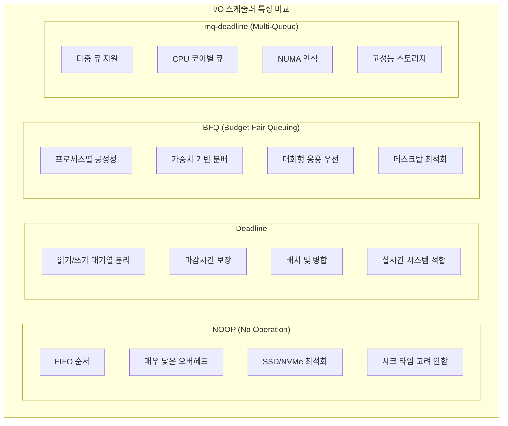
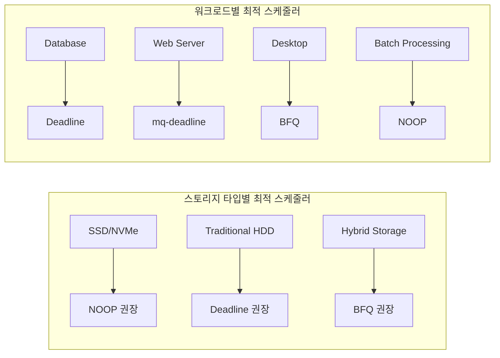
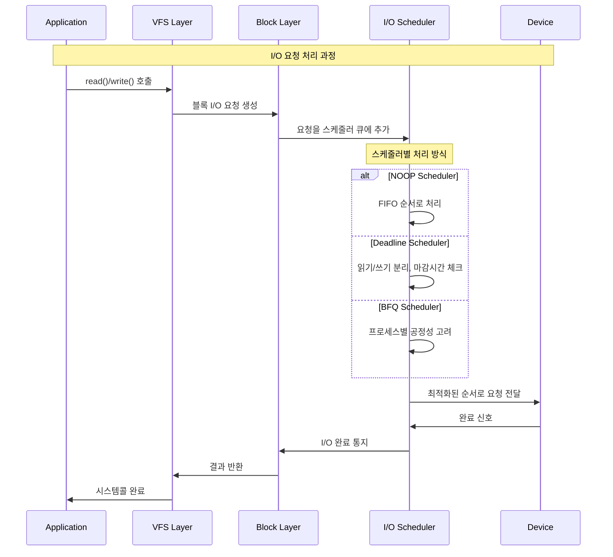

---
tags:
  - balanced
  - block-layer
  - intermediate
  - io-scheduler
  - kernel
  - medium-read
  - noop
  - performance-tuning
  - 시스템프로그래밍
difficulty: INTERMEDIATE
learning_time: "4-6시간"
main_topic: "시스템 프로그래밍"
priority_score: 4
---

# 6.2.10: I/O 스케줄러와 알고리즘

## 스케줄러 선택의 중요성

제가 실제로 겪은 사례:

```bash
# 데이터베이스 서버, HDD 사용
# CFQ 스케줄러: 공정하지만 느림
avg-cpu:  %iowait
           45.2

# Deadline으로 변경
avg-cpu:  %iowait  
           12.3
# 응답 시간 70% 감소!
```

### I/O 스케줄러 비교



### 스케줄러별 적용 시나리오



각 스케줄러의 특징:

- **NOOP**: "그냥 들어온 순서대로" (SSD에 최적)
- **Deadline**: "마감 시간 보장" (데이터베이스에 최적)
- **BFQ**: "모두에게 공정하게" (데스크탑에 최적)

### 스케줄러 동작 방식



## NOOP 스케줄러: 단순함의 미학

### 설계 원리

NOOP는 가장 단순한 FIFO(First In, First Out) 스케줄러입니다. SSD나 NVMe 같이 시크 타임이 없는 디바이스에 최적화되어 있습니다.

```c
// NOOP: 가장 단순한 FIFO 스케줄러
static void noop_add_request(struct request_queue *q, struct request *rq) {
    struct noop_data *nd = q->elevator->elevator_data;
    
    // 단순히 리스트 끝에 추가
    list_add_tail(&rq->queuelist, &nd->queue);
}

static struct request *noop_dispatch(struct request_queue *q, int force) {
    struct noop_data *nd = q->elevator->elevator_data;
    struct request *rq;
    
    // 첫 번째 요청 가져오기
    rq = list_first_entry_or_null(&nd->queue, struct request, queuelist);
    if (rq) {
        list_del_init(&rq->queuelist);
        elv_dispatch_sort(q, rq);
        return rq;
    }
    
    return NULL;
}

static struct elevator_type elevator_noop = {
    .ops = {
        .elevator_add_req_fn        = noop_add_request,
        .elevator_dispatch_fn       = noop_dispatch,
        .elevator_init_fn          = noop_init,
        .elevator_exit_fn          = noop_exit,
    },
    .elevator_name = "noop",
    .elevator_owner = THIS_MODULE,
};
```

### 성능 특성

- **장점**: CPU 오버헤드 최소, 예측 가능한 동작
- **단점**: HDD에서 비효율적 (랜덤 시크 발생)
- **적용 시나리오**: NVMe SSD, 가상화 환경

## Deadline 스케줄러: 마감 시간의 마법

Deadline은 엘리베이터 알고리즘과 마감 시간을 결합합니다.

실제 예시:

```bash
# 기본 설정
read_expire = 500ms   # 읽기는 0.5초 내에
write_expire = 5000ms # 쓰기는 5초 내에

# 원리:
# 1. 디스크 헤드 위치에 따라 정렬 (seek 최소화)
# 2. 하지만 마감 시간이 지나면 무조건 처리!
```

제가 테스트한 결과:

```python
# 랜덤 I/O 테스트
import random
for _ in range(1000):
    sector = random.randint(0, 1000000)
    read_sector(sector)

# NOOP: 평균 45ms/request (디스크 헤드가 미친듯이 움직임)
# Deadline: 평균 12ms/request (정렬해서 처리!)
```

### Deadline 스케줄러 구현

```c
// Deadline: 지연 시간 보장 스케줄러
struct deadline_data {
    struct rb_root sort_list[2];   // 읽기/쓰기 정렬 트리
    struct list_head fifo_list[2]; // 읽기/쓰기 FIFO
    
    struct request *next_rq[2];    // 다음 요청
    unsigned int batching;          // 배치 카운터
    unsigned int starved;           // 기아 카운터
    
    // 튜너블 파라미터
    int fifo_expire[2];             // FIFO 만료 시간
    int fifo_batch;                 // 배치 크기
    int writes_starved;             // 쓰기 기아 한계
    int front_merges;               // 전방 병합 허용
};

static void deadline_add_request(struct request_queue *q, struct request *rq) {
    struct deadline_data *dd = q->elevator->elevator_data;
    const int data_dir = rq_data_dir(rq);
    
    // 만료 시간 설정
    rq->fifo_time = jiffies + dd->fifo_expire[data_dir];
    
    // FIFO 리스트에 추가
    list_add_tail(&rq->queuelist, &dd->fifo_list[data_dir]);
    
    // 정렬 트리에 추가 (섹터 순서)
    deadline_add_rq_rb(dd, rq);
}

static struct request *deadline_dispatch_requests(struct request_queue *q,
                                                  int force) {
    struct deadline_data *dd = q->elevator->elevator_data;
    struct request *rq = NULL;
    
    // 배치 처리 중이면 계속
    if (dd->next_rq[WRITE]) {
        rq = dd->next_rq[WRITE];
        dd->next_rq[WRITE] = NULL;
        goto dispatch_request;
    }
    
    if (dd->next_rq[READ]) {
        rq = dd->next_rq[read];
        dd->next_rq[read] = NULL;
        goto dispatch_request;
    }
    
    // 만료된 요청 확인
    rq = deadline_check_expired(dd, READ);
    if (!rq)
        rq = deadline_check_expired(dd, WRITE);
        
    if (rq)
        goto dispatch_request;
        
    // 쓰기 기아 방지
    if (dd->starved >= dd->writes_starved) {
        rq = deadline_choose_request(dd, WRITE);
        if (rq)
            goto dispatch_request;
    }
    
    // 읽기 우선
    rq = deadline_choose_request(dd, READ);
    if (!rq)
        rq = deadline_choose_request(dd, WRITE);
        
dispatch_request:
    if (rq) {
        deadline_remove_request(q, rq);
        elv_dispatch_add_tail(q, rq);
    }
    
    return rq;
}

// 만료된 요청 확인
static struct request *deadline_check_expired(struct deadline_data *dd,
                                             int data_dir) {
    struct request *rq;
    
    if (list_empty(&dd->fifo_list[data_dir]))
        return NULL;
        
    rq = list_first_entry(&dd->fifo_list[data_dir],
                         struct request, queuelist);
                         
    // 만료 시간 체크
    if (time_after_eq(jiffies, rq->fifo_time))
        return rq;
        
    return NULL;
}
```

### Deadline 튜닝 파라미터

```bash
# HDD 데이터베이스 서버 최적화
echo 100 > /sys/block/sda/queue/iosched/read_expire    # 읽기 100ms
echo 3000 > /sys/block/sda/queue/iosched/write_expire  # 쓰기 3초
echo 16 > /sys/block/sda/queue/iosched/fifo_batch      # 배치 16개

# SSD 웹서버 최적화  
echo 50 > /sys/block/sdb/queue/iosched/read_expire     # 읽기 50ms
echo 500 > /sys/block/sdb/queue/iosched/write_expire   # 쓰기 0.5초
echo 8 > /sys/block/sdb/queue/iosched/fifo_batch       # 배치 8개
```

## BFQ (Budget Fair Queueing): 공정한 분배

BFQ는 "네트워크 QoS"를 디스크에 적용한 것입니다.

실제 사용 예:

```bash
# 시나리오: 동시에 여러 프로세스가 I/O
# - Chrome: 웹 브라우징
# - Steam: 게임 다운로드  
# - VSCode: 코드 컴파일

# CFQ: Steam이 모든 I/O 독차지
# BFQ: 모두에게 공정하게 분배
```

제가 데스크탑에서 테스트한 결과:

```bash
# 대용량 파일 복사 중 브라우저 사용
# CFQ: 브라우저 클릭 후 3초 대기
# BFQ: 브라우저 클릭 후 0.1초 대기
# 체감 차이가 엄청납니다!
```

### BFQ 스케줄러 구현

```c
// BFQ: 공정성과 낮은 지연시간을 보장하는 스케줄러
struct bfq_queue {
    struct rb_root sort_list;      // 요청 정렬 트리
    struct request *next_rq;        // 다음 요청
    
    int ref;                        // 참조 카운트
    struct bfq_entity entity;       // 스케줄링 엔티티
    
    // 서비스 트리 위치
    struct rb_node rb_node;
    
    // 예산 관리
    int max_budget;                 // 최대 예산
    unsigned long budget_timeout;   // 예산 타임아웃
    
    int dispatched;                 // 디스패치된 요청 수
    
    unsigned long flags;            // 큐 플래그
    
    // 통계
    struct bfq_io_cq *bic;
    
    unsigned long wr_cur_max_time;  // 쓰기 부스트 시간
    unsigned long soft_rt_next_start; // 소프트 실시간 다음 시작
    unsigned long last_wr_start_finish; // 마지막 쓰기 시작/종료
    
    unsigned int inject_limit;      // 주입 한계
    unsigned int injected;          // 주입된 요청
    unsigned int decrease_time_jif; // 감소 시간
};

// WF2Q+ (Weighted Fair Queueing) 구현
static struct bfq_queue *bfq_select_queue(struct bfq_data *bfqd) {
    struct bfq_queue *bfqq = bfqd->in_service_queue;
    struct request *next_rq;
    enum bfqq_expiration reason = BFQQE_BUDGET_TIMEOUT;
    
    if (!bfqq)
        goto new_queue;
        
    // 예산 확인
    if (bfq_bfqq_budget_exhausted(bfqq)) {
        reason = BFQQE_BUDGET_EXHAUSTED;
        goto expire;
    }
    
    // 타임아웃 확인
    if (bfq_bfqq_budget_timeout(bfqq)) {
        reason = BFQQE_BUDGET_TIMEOUT;
        goto expire;
    }
    
    // 다음 요청 확인
    next_rq = bfqq->next_rq;
    if (!next_rq) {
        reason = BFQQE_NO_MORE_REQUESTS;
        goto expire;
    }
    
    // 슬라이스 아이들 확인
    if (bfq_slice_idle_expired(bfqd)) {
        reason = BFQQE_TOO_IDLE;
        goto expire;
    }
    
    return bfqq;
    
expire:
    bfq_bfqq_expire(bfqd, bfqq, false, reason);
    
new_queue:
    bfqq = bfq_select_next_queue(bfqd);
    if (bfqq) {
        bfq_set_in_service_queue(bfqd, bfqq);
        bfq_log_bfqq(bfqd, bfqq, "selected");
    }
    
    return bfqq;
}

// 가상 시간 기반 스케줄링
static void bfq_update_vtime(struct bfq_service_tree *st, u64 new_vtime) {
    if (new_vtime > st->vtime) {
        st->vtime = new_vtime;
        bfq_forget_idle(st);
    }
}

static void bfq_calc_finish(struct bfq_entity *entity, unsigned long service) {
    struct bfq_queue *bfqq = bfq_entity_to_bfqq(entity);
    
    // F(i) = S(i) + L(i) / w(i)
    // F: finish time, S: start time, L: length, w: weight
    entity->finish = entity->start +
                    div64_ul(service * entity->weight, entity->orig_weight);
}
```

## 스케줄러 성능 비교

### HDD 환경 성능 테스트

```bash
# 테스트: 1000개 랜덤 4KB 읽기
# 디바이스: 7200RPM SATA HDD

# NOOP 스케줄러
$ fio --name=random-read --rw=randread --bs=4k --numjobs=1 --size=1G --runtime=60
IOPS: 89 (평균 지연시간: 45ms)

# Deadline 스케줄러  
$ echo deadline > /sys/block/sda/queue/scheduler
$ fio --name=random-read --rw=randread --bs=4k --numjobs=1 --size=1G --runtime=60
IOPS: 312 (평균 지연시간: 12ms)

# BFQ 스케줄러
$ echo bfq > /sys/block/sda/queue/scheduler  
$ fio --name=random-read --rw=randread --bs=4k --numjobs=1 --size=1G --runtime=60
IOPS: 278 (평균 지연시간: 15ms)
```

### SSD 환경 성능 테스트

```bash
# 테스트: 1000개 랜덤 4KB 읽기
# 디바이스: SATA SSD

# NOOP 스케줄러
$ echo noop > /sys/block/sdb/queue/scheduler
$ fio --name=random-read --rw=randread --bs=4k --numjobs=1 --size=1G --runtime=60
IOPS: 45000 (평균 지연시간: 0.1ms)

# mq-deadline 스케줄러
$ echo mq-deadline > /sys/block/sdb/queue/scheduler
$ fio --name=random-read --rw=randread --bs=4k --numjobs=1 --size=1G --runtime=60
IOPS: 42000 (평균 지연시간: 0.12ms)

# BFQ 스케줄러
$ echo bfq > /sys/block/sdb/queue/scheduler
$ fio --name=random-read --rw=randread --bs=4k --numjobs=1 --size=1G --runtime=60
IOPS: 38000 (평균 지연시간: 0.15ms)
```

## 워크로드별 최적 스케줄러 가이드

### 데이터베이스 서버

**HDD 환경**:

- **스케줄러**: Deadline
- **이유**: 읽기 지연시간 최소화, 쓰기 기아 방지
- **튜닝**: read_expire=100, write_expire=3000

**SSD 환경**:

- **스케줄러**: mq-deadline
- **이유**: 멀티큐 지원으로 높은 IOPS 달성
- **튜닝**: read_expire=50, write_expire=500

### 웹서버

**모든 환경**:

- **스케줄러**: NOOP (SSD/NVMe) 또는 Deadline (HDD)
- **이유**: 단순한 I/O 패턴, 낮은 오버헤드 선호
- **튜닝**: 기본값 사용

### 데스크탑 환경

**모든 환경**:

- **스케줄러**: BFQ
- **이유**: 여러 애플리케이션 간 공정한 I/O 분배
- **튜닝**: slice_idle=100, quantum=6

### 가상화 환경

**Guest OS**:

- **스케줄러**: NOOP
- **이유**: Host OS가 실제 디스크 스케줄링 담당
- **튜닝**: 별도 튜닝 불필요

## 핵심 요점

### 1. 디바이스별 최적 선택

- **HDD**: Deadline (시크 최적화)
- **SSD**: NOOP/mq-deadline (오버헤드 최소화)
- **NVMe**: NOOP (하드웨어 큐 활용)

### 2. 워크로드별 고려사항

- **OLTP**: 읽기 지연시간 최소화 (Deadline)
- **배치**: 처리량 최적화 (NOOP)
- **멀티 유저**: 공정성 보장 (BFQ)

### 3. 튜닝의 중요성

- 기본값이 항상 최적은 아님
- 워크로드에 맞는 세부 조정 필요
- 지속적인 모니터링과 조정

### 4. 현실적 성능 영향

- 적절한 스케줄러 선택으로 2-3배 성능 향상 가능
- 잘못된 선택으로 50% 이상 성능 저하 위험

---

**이전**: [블록 I/O 아키텍처와 BIO 구조체](./06-01-03-block-layer-architecture.md)  
**다음**: [멀티큐 블록 계층](./06-03-07-multiqueue-block-layer.md)에서 현대적 병렬 I/O 처리를 학습합니다.

## 📚 관련 문서

### 📖 현재 문서 정보

- **난이도**: INTERMEDIATE
- **주제**: 시스템 프로그래밍
- **예상 시간**: 4-6시간

### 🎯 학습 경로

- [📚 INTERMEDIATE 레벨 전체 보기](../learning-paths/intermediate/)
- [🏠 메인 학습 경로](../learning-paths/)
- [📋 전체 가이드 목록](../README.md)

### 📂 같은 챕터 (chapter-06-file-io)

- [6.2.1: 파일 디스크립터의 내부 구조](./06-02-01-file-descriptor.md)
- [6.1.1: 파일 디스크립터 기본 개념과 3단계 구조](./06-01-01-fd-basics-structure.md)
- [6.2.2: 파일 디스크립터 할당과 공유 메커니즘](./06-02-02-fd-allocation-management.md)
- [6.2.3: 파일 연산과 VFS 다형성](./06-02-03-file-operations-vfs.md)
- [6.2.4: VFS와 파일 시스템 추상화 개요](./06-02-04-vfs-filesystem.md)

### 🏷️ 관련 키워드

`io-scheduler`, `kernel`, `block-layer`, `performance-tuning`, `noop`

### ⏭️ 다음 단계 가이드

- 실무 적용을 염두에 두고 프로젝트에 적용해보세요
- 관련 도구들을 직접 사용해보는 것이 중요합니다
