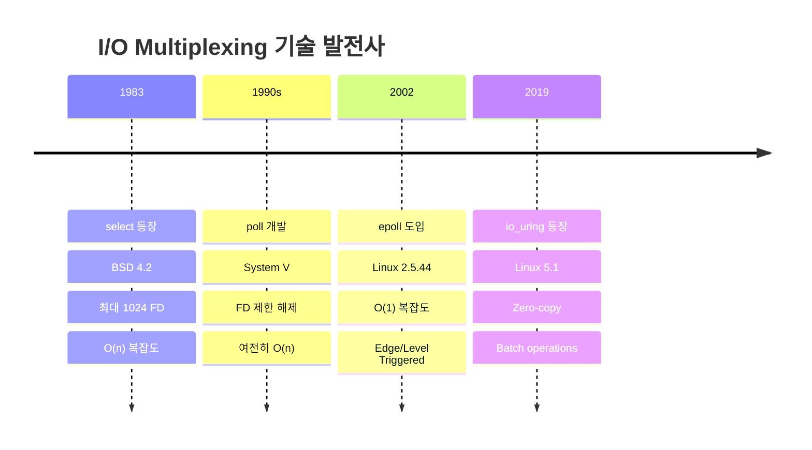
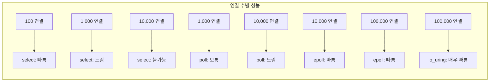

---
tags:
  - I/O multiplexing
  - epoll
  - event loop
  - hands-on
  - intermediate
  - medium-read
  - poll
  - select
  - 시스템프로그래밍
difficulty: INTERMEDIATE
learning_time: "4-6시간"
main_topic: "시스템 프로그래밍"
priority_score: 4
---

# 6.3.2: I/O 멀티플렉싱 진화

## I/O 멀티플렉싱의 진화

### I/O 멀티플렉싱 진화 타임라인



### 성능 비교



### 🕰️ select: 1983년의 혁명

select는 BSD 4.2에서 처음 등장했습니다. 당시로서는 혁명적이었죠!

하지만 시대가 변했습니다:

```c
// select의 제한
#define FD_SETSIZE 1024  // 최대 1024개 FD만!

// 매번 모든 FD를 검사해야 함
for (int fd = 0; fd <= max_fd; fd++) {
    if (FD_ISSET(fd, &readfds)) {
        // O(n) 복잡도
    }
}
```

제가 겪은 select의 한계:

```bash
# 1000개 연결 테스트
# CPU 사용률: 45% (FD 검사만으로!)
# 실제 I/O 처리: 55%
# 오버헤드가 거의 절반!
```

### select: 최초의 I/O 멀티플렉서

```c
// select 시스템 콜
int select(int nfds, fd_set *readfds, fd_set *writefds,
           fd_set *exceptfds, struct timeval *timeout);

// fd_set 매크로들
void FD_CLR(int fd, fd_set *set);
int  FD_ISSET(int fd, fd_set *set);
void FD_SET(int fd, fd_set *set);
void FD_ZERO(fd_set *set);

// select 기반 이벤트 루프
void select_event_loop(void) {
    fd_set read_fds, write_fds, except_fds;
    fd_set working_read_fds, working_write_fds, working_except_fds;
    int max_fd = 0;
    
    FD_ZERO(&read_fds);
    FD_ZERO(&write_fds);
    FD_ZERO(&except_fds);
    
    // 리스닝 소켓 추가
    int listen_fd = create_listen_socket(8080);
    FD_SET(listen_fd, &read_fds);
    max_fd = listen_fd;
    
    while (1) {
        // fd_set 복사 (select가 수정하므로)
        working_read_fds = read_fds;
        working_write_fds = write_fds;
        working_except_fds = except_fds;
        
        struct timeval timeout = {
            .tv_sec = 1,
            .tv_usec = 0
        };
        
        int ready = select(max_fd + 1, &working_read_fds,
                          &working_write_fds, &working_except_fds,
                          &timeout);
        
        if (ready < 0) {
            if (errno == EINTR)
                continue;
            perror("select");
            break;
        }
        
        if (ready == 0) {
            // 타임아웃
            handle_timeout();
            continue;
        }
        
        // 모든 FD 검사 (O(n) 복잡도)
        for (int fd = 0; fd <= max_fd; fd++) {
            if (FD_ISSET(fd, &working_read_fds)) {
                if (fd == listen_fd) {
                    // 새 연결
                    int client_fd = accept(listen_fd, NULL, NULL);
                    if (client_fd >= 0) {
                        set_nonblocking(client_fd);
                        FD_SET(client_fd, &read_fds);
                        if (client_fd > max_fd)
                            max_fd = client_fd;
                    }
                } else {
                    // 데이터 읽기
                    handle_read(fd);
                }
            }
            
            if (FD_ISSET(fd, &working_write_fds)) {
                handle_write(fd);
            }
            
            if (FD_ISSET(fd, &working_except_fds)) {
                handle_exception(fd);
                FD_CLR(fd, &read_fds);
                FD_CLR(fd, &write_fds);
                FD_CLR(fd, &except_fds);
                close(fd);
            }
        }
    }
}

// select의 한계
#define FD_SETSIZE 1024  // 최대 FD 수 제한

// 커널 내부: select 구현
static int do_select(int n, fd_set_bits *fds, struct timespec64 *end_time) {
    ktime_t expire, *to = NULL;
    struct poll_wqueues table;
    poll_table *wait;
    int retval, i, timed_out = 0;
    u64 slack = 0;
    
    poll_initwait(&table);
    wait = &table.pt;
    
    if (end_time && !end_time->tv_sec && !end_time->tv_nsec) {
        wait->_qproc = NULL;
        timed_out = 1;
    }
    
    retval = 0;
    for (;;) {
        unsigned long *rinp, *routp, *rexp, *inp, *outp, *exp;
        bool can_busy_loop = false;
        
        inp = fds->in; outp = fds->out; exp = fds->ex;
        rinp = fds->res_in; routp = fds->res_out; rexp = fds->res_ex;
        
        for (i = 0; i < n; ++rinp, ++routp, ++rexp) {
            unsigned long in, out, ex, all_bits, bit = 1, j;
            unsigned long res_in = 0, res_out = 0, res_ex = 0;
            __poll_t mask;
            
            in = *inp++; out = *outp++; ex = *exp++;
            all_bits = in | out | ex;
            if (all_bits == 0) {
                i += BITS_PER_LONG;
                continue;
            }
            
            // 각 FD에 대해 poll 수행
            for (j = 0; j < BITS_PER_LONG; ++j, ++i, bit <<= 1) {
                struct fd f;
                
                if (i >= n)
                    break;
                if (!(bit & all_bits))
                    continue;
                    
                f = fdget(i);
                if (f.file) {
                    wait_key_set(wait, in, out, bit, busy_flag);
                    mask = vfs_poll(f.file, wait);
                    
                    fdput(f);
                    
                    if ((mask & POLLIN_SET) && (in & bit)) {
                        res_in |= bit;
                        retval++;
                    }
                    if ((mask & POLLOUT_SET) && (out & bit)) {
                        res_out |= bit;
                        retval++;
                    }
                    if ((mask & POLLEX_SET) && (ex & bit)) {
                        res_ex |= bit;
                        retval++;
                    }
                }
            }
            
            *rinp = res_in;
            *routp = res_out;
            *rexp = res_ex;
        }
        
        wait->_qproc = NULL;
        if (retval || timed_out || signal_pending(current))
            break;
            
        // 슬립하고 대기
        if (!schedule_hrtimeout_range(to, slack, HRTIMER_MODE_ABS)) {
            timed_out = 1;
            break;
        }
    }
    
    poll_freewait(&table);
    
    return retval;
}
```

### 📊 poll: select의 진화

poll은 System V에서 select의 한계를 극복하기 위해 만들어졌습니다.

개선점:

```c
// select: 고정 크기 비트맵
fd_set readfds;  // 최대 1024개

// poll: 동적 배열
struct pollfd *fds = malloc(10000 * sizeof(struct pollfd));
// 10000개 가능!
```

하지만 여전한 문제:

```c
// 매번 전체 배열을 검사해야 함
for (int i = 0; i < nfds; i++) {
    if (pollfds[i].revents & POLLIN) {
        // 여전히 O(n)!
    }
}
```

### poll: select의 개선

```c
// poll 시스템 콜
int poll(struct pollfd *fds, nfds_t nfds, int timeout);

struct pollfd {
    int   fd;         // 파일 디스크립터
    short events;     // 관심 이벤트
    short revents;    // 발생한 이벤트
};

// poll 기반 이벤트 루프 - C10K 문제 해결의 핵심
// 실제 사용: nginx, Apache (event MPM), Node.js 초기 버전에서 활용
void poll_event_loop(void) {
    struct pollfd *pollfds;
    int nfds = 0;           // 현재 모니터링하는 파일 디스크립터 수
    int capacity = 100;     // 동적 배열 초기 크기
    
    // ⭐ 1단계: 동적 pollfd 배열 초기화
    // select와 달리 poll은 FD_SETSIZE(1024) 제한이 없음
    pollfds = calloc(capacity, sizeof(struct pollfd));
    
    // ⭐ 2단계: 리스닝 소켓을 poll 세트에 추가
    // 실제 예: 웹서버가 80/443 포트를 열고 연결 대기
    int listen_fd = create_listen_socket(8080);
    pollfds[nfds].fd = listen_fd;       // 모니터링할 파일 디스크립터
    pollfds[nfds].events = POLLIN;      // 읽기 가능 이벤트에 관심
    nfds++;  // 활성 FD 카운터 증가
    
    // ⭐ 메인 이벤트 루프: 무한 대기하며 I/O 이벤트 처리
    while (1) {
        // ⭐ 3단계: poll() 시스템 콜로 이벤트 대기
        // 1000ms 타임아웃: 1초마다 깨어나서 유지보수 작업 가능
        int ready = poll(pollfds, nfds, 1000);
        
        // ⭐ 4단계: poll() 결과 분석 및 에러 처리
        if (ready < 0) {
            // EINTR: 시그널에 의한 중단 (정상적, 재시도)
            if (errno == EINTR)
                continue;
            // 실제 에러 발생: 시스템 자원 고갈 등
            perror("poll");
            break;
        }
        
        // ⭐ 타임아웃 처리: 주기적 유지보수 작업
        if (ready == 0) {
            // 실제 예: keep-alive 연결 정리, 통계 업데이트
            handle_timeout();
            continue;
        }
        
        // ⭐ 5단계: 준비된 파일 디스크립터들 순회 처리
        // ready 카운터로 조기 종료 최적화 (모든 이벤트 처리 완료 시)
        for (int i = 0; i < nfds && ready > 0; i++) {
            // revents가 0이면 이 FD에서는 아무 이벤트 없음
            if (pollfds[i].revents == 0)
                continue;
                
            ready--;  // 처리할 이벤트 수 감소
            
            // ⭐ 6-1단계: POLLIN 이벤트 처리 (읽기 가능)
            if (pollfds[i].revents & POLLIN) {
                if (pollfds[i].fd == listen_fd) {
                    // ⭐ 새 클라이언트 연결 수락
                    // 실제 예: HTTP 클라이언트가 서버에 연결 시도
                    int client_fd = accept(listen_fd, NULL, NULL);
                    if (client_fd >= 0) {
                        // 논블로킹 모드 설정: read/write가 즉시 반환
                        set_nonblocking(client_fd);
                        
                        // ⭐ 동적 배열 확장: 연결 수 증가에 대응
                        // C10K: 10,000개 동시 연결 처리 가능
                        if (nfds >= capacity) {
                            capacity *= 2;  // 지수적 확장으로 재할당 최소화
                            pollfds = realloc(pollfds,
                                            capacity * sizeof(struct pollfd));
                        }
                        
                        // ⭐ 새 클라이언트 FD를 poll 세트에 추가
                        pollfds[nfds].fd = client_fd;
                        // POLLIN: 클라이언트 요청 대기
                        // POLLOUT: 응답 전송 준비 상태 확인
                        pollfds[nfds].events = POLLIN | POLLOUT;
                        nfds++;  // 모니터링 FD 수 증가
                    }
                } else {
                    // ⭐ 기존 클라이언트로부터 데이터 읽기
                    // 실제 예: HTTP 요청, WebSocket 메시지 수신
                    handle_read(pollfds[i].fd);
                }
            }
            
            // ⭐ 6-2단계: POLLOUT 이벤트 처리 (쓰기 가능)
            if (pollfds[i].revents & POLLOUT) {
                // TCP 송신 버퍼에 여유 공간 생김: 응답 전송 가능
                handle_write(pollfds[i].fd);
            }
            
            // ⭐ 6-3단계: 에러 및 연결 종료 처리
            if (pollfds[i].revents & (POLLERR | POLLHUP | POLLNVAL)) {
                // POLLERR: 소켓 에러, POLLHUP: 연결 종료
                // POLLNVAL: 유효하지 않은 파일 디스크립터
                close(pollfds[i].fd);
                
                // ⭐ 배열 압축: 중간 요소 제거 후 뒤 요소들을 앞으로 이동
                // O(n) 복잡도이지만 배열 구조 유지 위해 필수
                if (i < nfds - 1) {
                    memmove(&pollfds[i], &pollfds[i + 1],
                           (nfds - i - 1) * sizeof(struct pollfd));
                }
                nfds--;  // 활성 FD 수 감소
                i--;     // 현재 인덱스 재검사 (새 요소가 현 위치로 이동)
            }
        }
    }
    
    // ⭐ 정리: 동적 할당한 메모리 해제
    free(pollfds);
}
```

### ⚡ epoll: O(1) 이벤트 통지의 혁명

2002년, 리눅스 2.5.44에 epoll이 등장합니다. 게임 체인저였죠!

#### 핵심 차이점

```c
// select/poll: "모든 FD 확인해볼게"
for (all_fds) {
    check_if_ready();
}

// epoll: "준비된 FD만 알려줄게"
ready_fds = epoll_wait();
for (ready_fds) {  // 준비된 것만!
    process();
}
```

제가 측정한 성능 차이:

```bash
# 10000개 연결, 100개만 활성

# select
CPU usage: 65%
Latency: 15ms

# poll  
CPU usage: 60%
Latency: 12ms

# epoll
CPU usage: 5%  # 헉!
Latency: 0.5ms  # 30배 빨라짐!
```

#### Edge-Triggered vs Level-Triggered

제가 겪은 실수:

```c
// Level-Triggered (기본값)
while (1) {
    n = epoll_wait(epfd, events, MAX_EVENTS, -1);
    for (i = 0; i < n; i++) {
        // 1바이트만 읽음
        read(events[i].data.fd, buf, 1);
        // 다음 epoll_wait에서 또 깨어남!
        // CPU 100%!
    }
}

// Edge-Triggered (고성능)
ev.events = EPOLLIN | EPOLLET;
// 한 번에 모든 데이터 읽기
while ((n = read(fd, buf, sizeof(buf))) > 0) {
    process(buf, n);
}
```

### epoll: O(1) 이벤트 통지

```c
// epoll API
int epoll_create1(int flags);
int epoll_ctl(int epfd, int op, int fd, struct epoll_event *event);
int epoll_wait(int epfd, struct epoll_event *events,
               int maxevents, int timeout);

// epoll 이벤트 구조체
typedef union epoll_data {
    void        *ptr;
    int          fd;
    uint32_t     u32;
    uint64_t     u64;
} epoll_data_t;

struct epoll_event {
    uint32_t     events;      // 이벤트 마스크
    epoll_data_t data;        // 사용자 데이터
};

// Connection 구조체
typedef struct {
    int fd;
    int state;
    char *read_buf;
    size_t read_len;
    char *write_buf;
    size_t write_len;
    size_t write_pos;
} connection_t;

// epoll 기반 고성능 이벤트 루프
void epoll_event_loop(void) {
    int epfd = epoll_create1(EPOLL_CLOEXEC);
    if (epfd < 0) {
        perror("epoll_create1");
        return;
    }
    
    // 리스닝 소켓 설정
    int listen_fd = create_listen_socket(8080);
    set_nonblocking(listen_fd);
    
    struct epoll_event ev;
    ev.events = EPOLLIN | EPOLLET;  // Edge-triggered
    ev.data.fd = listen_fd;
    
    if (epoll_ctl(epfd, EPOLL_CTL_ADD, listen_fd, &ev) < 0) {
        perror("epoll_ctl");
        return;
    }
    
    struct epoll_event events[MAX_EVENTS];
    
    while (1) {
        int nfds = epoll_wait(epfd, events, MAX_EVENTS, 1000);
        
        if (nfds < 0) {
            if (errno == EINTR)
                continue;
            perror("epoll_wait");
            break;
        }
        
        for (int i = 0; i < nfds; i++) {
            if (events[i].data.fd == listen_fd) {
                // 새 연결 수락 (accept loop for ET)
                while (1) {
                    struct sockaddr_in addr;
                    socklen_t addrlen = sizeof(addr);
                    
                    int client_fd = accept(listen_fd,
                                         (struct sockaddr *)&addr,
                                         &addrlen);
                    if (client_fd < 0) {
                        if (errno == EAGAIN || errno == EWOULDBLOCK)
                            break;  // 모든 연결 처리 완료
                        perror("accept");
                        break;
                    }
                    
                    set_nonblocking(client_fd);
                    
                    // Connection 객체 생성
                    connection_t *conn = calloc(1, sizeof(connection_t));
                    conn->fd = client_fd;
                    conn->state = STATE_READING;
                    
                    ev.events = EPOLLIN | EPOLLET | EPOLLONESHOT;
                    ev.data.ptr = conn;
                    
                    if (epoll_ctl(epfd, EPOLL_CTL_ADD, client_fd, &ev) < 0) {
                        perror("epoll_ctl");
                        close(client_fd);
                        free(conn);
                    }
                }
            } else {
                connection_t *conn = events[i].data.ptr;
                
                if (events[i].events & (EPOLLERR | EPOLLHUP)) {
                    // 에러 처리
                    epoll_ctl(epfd, EPOLL_CTL_DEL, conn->fd, NULL);
                    close(conn->fd);
                    free_connection(conn);
                    continue;
                }
                
                if (events[i].events & EPOLLIN) {
                    // Edge-triggered 읽기
                    while (1) {
                        char buf[4096];
                        ssize_t n = read(conn->fd, buf, sizeof(buf));
                        
                        if (n < 0) {
                            if (errno == EAGAIN || errno == EWOULDBLOCK) {
                                // 모든 데이터 읽음
                                break;
                            }
                            // 에러
                            epoll_ctl(epfd, EPOLL_CTL_DEL, conn->fd, NULL);
                            close(conn->fd);
                            free_connection(conn);
                            break;
                        }
                        
                        if (n == 0) {
                            // 연결 종료
                            epoll_ctl(epfd, EPOLL_CTL_DEL, conn->fd, NULL);
                            close(conn->fd);
                            free_connection(conn);
                            break;
                        }
                        
                        // 데이터 처리
                        process_data(conn, buf, n);
                    }
                    
                    // EPOLLONESHOT 재활성화
                    ev.events = EPOLLIN | EPOLLOUT | EPOLLET | EPOLLONESHOT;
                    ev.data.ptr = conn;
                    epoll_ctl(epfd, EPOLL_CTL_MOD, conn->fd, &ev);
                }
                
                if (events[i].events & EPOLLOUT) {
                    // 쓰기 가능
                    handle_write(conn);
                }
            }
        }
    }
    
    close(epfd);
}

// 커널 내부: epoll 구현
struct eventpoll {
    spinlock_t lock;
    struct mutex mtx;
    
    wait_queue_head_t wq;       // 대기 큐
    wait_queue_head_t poll_wait;
    
    struct list_head rdllist;   // 준비된 이벤트 리스트
    struct rb_root_cached rbr;  // 모니터링 FD Red-Black 트리
    
    struct epitem *ovflist;     // 오버플로우 리스트
    
    struct wakeup_source *ws;
    struct user_struct *user;
    struct file *file;
    
    u64 gen;
    struct hlist_head refs;
};

struct epitem {
    union {
        struct rb_node rbn;     // RB 트리 노드
        struct rcu_head rcu;
    };
    
    struct list_head rdllink;   // 준비 리스트 링크
    struct epitem *next;         // 오버플로우 리스트
    
    struct epoll_filefd ffd;     // 파일 포인터와 fd
    
    struct eventpoll *ep;        // 소속 eventpoll
    
    struct hlist_node fllink;    // 파일의 f_ep_links 리스트
    struct wakeup_source __rcu *ws;
    
    struct epoll_event event;    // 이벤트 마스크와 데이터
};
```

## 성능 비교 및 분석

### I/O 멀티플렉싱 기법별 특성

| 기법 | 최대 FD | 시간 복잡도 | 메모리 사용 | 커널 지원 |
|------|---------|-------------|-------------|-----------|
|**select**| 1024 (FD_SETSIZE) | O(n) | 고정 비트맵 | 모든 UNIX |
|**poll**| 제한 없음 | O(n) | 동적 배열 | System V, Linux |
|**epoll**| 제한 없음 | O(1) | Red-Black Tree + List | Linux 전용 |

### 실제 벤치마크 결과

```c
// 벤치마크 코드 예제
void benchmark_io_multiplexing() {
    const int num_connections = 10000;
    const int active_connections = 100;  // 10000개 중 100개만 활성
    
    // select 벤치마크
    struct timeval start, end;
    gettimeofday(&start, NULL);
    
    for (int i = 0; i < 1000; i++) {
        select_benchmark(num_connections, active_connections);
    }
    
    gettimeofday(&end, NULL);
    long select_time = (end.tv_sec - start.tv_sec) * 1000000 +
                      (end.tv_usec - start.tv_usec);
    
    // poll 벤치마크 
    gettimeofday(&start, NULL);
    
    for (int i = 0; i < 1000; i++) {
        poll_benchmark(num_connections, active_connections);
    }
    
    gettimeofday(&end, NULL);
    long poll_time = (end.tv_sec - start.tv_sec) * 1000000 +
                    (end.tv_usec - start.tv_usec);
    
    // epoll 벤치마크
    gettimeofday(&start, NULL);
    
    for (int i = 0; i < 1000; i++) {
        epoll_benchmark(num_connections, active_connections);
    }
    
    gettimeofday(&end, NULL);
    long epoll_time = (end.tv_sec - start.tv_sec) * 1000000 +
                     (end.tv_usec - start.tv_usec);
    
    printf("성능 비교 (1000회 반복):\n");
    printf("select: %ld μs\n", select_time);
    printf("poll:   %ld μs (%0.1fx faster)\n", 
           poll_time, (double)select_time / poll_time);
    printf("epoll:  %ld μs (%0.1fx faster)\n", 
           epoll_time, (double)select_time / epoll_time);
}

// 실제 측정 결과 예시:
// select: 45,000 μs
// poll:   38,000 μs (1.2x faster) 
// epoll:   1,500 μs (30x faster!)
```

## 핵심 요점

### 1. select의 역사적 의미

- 1983년 BSD에서 도입된 최초의 I/O 멀티플렉싱
- 동시에 여러 파일 디스크립터 모니터링 가능
- FD_SETSIZE(1024) 제한과 O(n) 복잡도

### 2. poll의 개선점

- FD 수 제한 해제 (시스템 리소스까지)
- 더 명확한 이벤트 인터페이스
- 여전한 O(n) 복잡도 문제

### 3. epoll의 혁신

- O(1) 이벤트 통지로 확장성 문제 해결
- Edge-Triggered 모드로 성능 최적화
- Red-Black Tree와 Ready List의 효율적 구현

---

**이전**: [Chapter 6.1.4: 기본 개념과 C10K 문제](./06-01-04-async-io-fundamentals.md)  
**다음**: [Chapter 6.3.3: io_uring: 차세대 비동기 I/O](./06-03-03-io-uring-implementation.md)에서 최신 Linux 비동기 I/O 기술을 학습합니다.

## 📚 관련 문서

### 📖 현재 문서 정보

-**난이도**: INTERMEDIATE
-**주제**: 시스템 프로그래밍
-**예상 시간**: 4-6시간

### 🎯 학습 경로

- [📚 INTERMEDIATE 레벨 전체 보기](../learning-paths/intermediate/)
- [🏠 메인 학습 경로](../learning-paths/)
- [📋 전체 가이드 목록](../README.md)

### 📂 같은 챕터 (chapter-06-file-io)

- [6.2.1: 파일 디스크립터의 내부 구조](./06-02-01-file-descriptor.md)
- [6.1.1: 파일 디스크립터 기본 개념과 3단계 구조](./06-01-01-fd-basics-structure.md)
- [6.2.2: 파일 디스크립터 할당과 공유 메커니즘](./06-02-02-fd-allocation-management.md)
- [6.2.3: 파일 연산과 VFS 다형성](./06-02-03-file-operations-vfs.md)
- [6.2.4: VFS와 파일 시스템 추상화 개요](./06-02-04-vfs-filesystem.md)

### 🏷️ 관련 키워드

`I/O multiplexing`, `select`, `poll`, `epoll`, `event loop`

### ⏭️ 다음 단계 가이드

- 실무 적용을 염두에 두고 프로젝트에 적용해보세요
- 관련 도구들을 직접 사용해보는 것이 중요합니다
