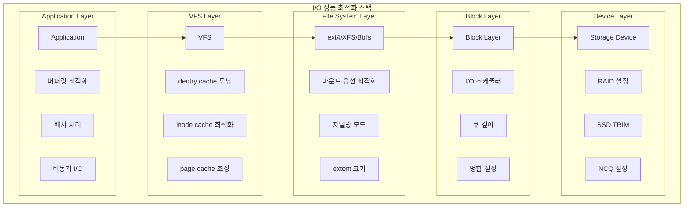

---
tags:
  - VFS
  - advanced
  - cache-optimization
  - deep-study
  - hands-on
  - kernel-parameters
  - performance-tuning
  - workload-optimization
  - 인프라스트럭처
difficulty: ADVANCED
learning_time: "8-12시간"
main_topic: "인프라스트럭처"
priority_score: 4
---

# 6.4.1: I/O 성능 튜닝 기초

## 성능 최적화와 튜닝

### I/O 스택 최적화 지점



### 🎯 VFS 튜닝: 성능의 비밀 레시피

제가 프로덕션 서버를 튜닝하며 배운 노하우:

```bash
# 1. 현재 캐시 상태 확인
$ cat /proc/meminfo | grep -E "Cached|Buffers"
Buffers:          234560 kB
Cached:         12345678 kB

# 2. 덴트리 캐시 통계
$ cat /proc/sys/fs/dentry-state
127543  115234  45  0  123456  0
# (사용중) (사용가능) (에이지) (...)

# 3. 캐시 압력 테스트
echo 3 > /proc/sys/vm/drop_caches  # 모든 캐시 비우기
echo 1 > /proc/sys/vm/drop_caches  # 페이지 캐시만
echo 2 > /proc/sys/vm/drop_caches  # 덴트리/아이노드 캐시만
```

#### 캐시 최적화 전략

1. **메모리가 충분한 경우**: 캐시를 최대한 활용
2. **메모리가 부족한 경우**: vm.swappiness 조정
3. **특정 워크로드**: vfs_cache_pressure 튜닝

```bash
# 데이터베이스 서버용 설정
echo 10 > /proc/sys/vm/swappiness        # 스왑 최소화
echo 50 > /proc/sys/vm/vfs_cache_pressure # 캐시 적극 유지
```

### VFS 캐시 튜닝

```c
// sysctl을 통한 VFS 캐시 파라미터 조정
static struct ctl_table fs_table[] = {
    {
        .procname   = "dentry-state",
        .data       = &dentry_stat,
        .maxlen     = 6*sizeof(long),
        .mode       = 0444,
        .proc_handler = proc_doulongvec_minmax,
    },
    {
        .procname   = "inode-nr",
        .data       = &inodes_stat,
        .maxlen     = 2*sizeof(long),
        .mode       = 0444,
        .proc_handler = proc_nr_inodes,
    },
    {
        .procname   = "file-nr",
        .data       = &files_stat,
        .maxlen     = sizeof(files_stat),
        .mode       = 0444,
        .proc_handler = proc_nr_files,
    },
    {
        .procname   = "file-max",
        .data       = &files_stat.max_files,
        .maxlen     = sizeof(files_stat.max_files),
        .mode       = 0644,
        .proc_handler = proc_doulongvec_minmax,
        .extra1     = &zero_ul,
        .extra2     = &long_max,
    },
};
```

### 동적 캐시 크기 조정

```c
// 동적 캐시 크기 조정
static unsigned long shrink_slab(gfp_t gfp_mask, int nid,
                                 struct mem_cgroup *memcg,
                                 int priority) {
    unsigned long ret, freed = 0;
    struct shrinker *shrinker;
    
    if (!down_read_trylock(&shrinker_rwsem))
        goto out;
        
    list_for_each_entry(shrinker, &shrinker_list, list) {
        struct shrink_control sc = {
            .gfp_mask = gfp_mask,
            .nid = nid,
            .memcg = memcg,
        };
        
        ret = do_shrink_slab(&sc, shrinker, priority);
        if (ret == SHRINK_EMPTY)
            ret = 0;
        freed += ret;
    }
    
    up_read(&shrinker_rwsem);
    
out:
    cond_resched();
    return freed;
}
```

## 실전 성능 분석 도구

### 종합 성능 분석 스크립트

```bash
#!/bin/bash
# VFS 성능 분석 종합 스크립트

echo "=== VFS 성능 분석 리포트 ==="
echo "분석 시간: $(date)"
echo

# 1. 시스템 기본 정보
echo "=== 시스템 정보 ==="
echo "커널 버전: $(uname -r)"
echo "메모리 총량: $(free -h | awk '/^Mem:/ {print $2}')"
echo "파일시스템 개수: $(cat /proc/filesystems | wc -l)"
echo

# 2. 메모리 사용 현황
echo "=== 메모리 사용 현황 ==="
free -h
echo
awk '/^MemTotal|^MemAvailable|^Buffers|^Cached|^Dirty|^Writeback/ {
    printf "%-15s: %10s kB\n", $1, $2
}' /proc/meminfo
echo

# 3. VFS 캐시 상태
echo "=== VFS 캐시 상태 ==="
echo "덴트리 캐시: $(cat /proc/sys/fs/dentry-state)"
echo "아이노드 사용: $(cat /proc/sys/fs/inode-nr)"
echo "열린 파일: $(cat /proc/sys/fs/file-nr)"
echo "최대 파일: $(cat /proc/sys/fs/file-max)"
echo

# 4. I/O 통계
echo "=== I/O 통계 ==="
awk '/^pgpgin|^pgpgout|^pswpin|^pswpout/ {
    printf "%-10s: %10s\n", $1, $2
}' /proc/vmstat
echo

# 5. 캐시 효율성 테스트
echo "=== 캐시 효율성 테스트 ==="
TEST_DIR="/usr"
echo "테스트 디렉토리: $TEST_DIR"

# 캐시 클리어
echo 3 > /proc/sys/vm/drop_caches
sync

# 첫 번째 실행 (캐시 미스)
echo -n "첫 번째 실행 (캐시 미스): "
time_cold=$(time -p find $TEST_DIR -name "*.so" 2>/dev/null | wc -l 2>&1 | awk '/real/ {print $2}')
files_found=$(find $TEST_DIR -name "*.so" 2>/dev/null | wc -l)

# 두 번째 실행 (캐시 히트)
echo -n "두 번째 실행 (캐시 히트): "
time_hot=$(time -p find $TEST_DIR -name "*.so" 2>/dev/null | wc -l 2>&1 | awk '/real/ {print $2}')

echo "찾은 파일 수: $files_found"
echo "Cold 시간: ${time_cold}초"
echo "Hot 시간: ${time_hot}초"

# 성능 향상 계산
if [ $(echo "$time_hot > 0" | bc -l) -eq 1 ]; then
    improvement=$(echo "scale=1; $time_cold / $time_hot" | bc -l)
    echo "성능 향상: ${improvement}배"
fi
echo

# 6. 파일시스템별 마운트 옵션
echo "=== 파일시스템 마운트 옵션 ==="
mount | grep -v tmpfs | grep -v proc | grep -v sys | while read line; do
    echo "$line"
done
echo

# 7. 튜닝 권장사항
echo "=== 튜닝 권장사항 ==="
current_cache_pressure=$(cat /proc/sys/vm/vfs_cache_pressure)
current_swappiness=$(cat /proc/sys/vm/swappiness)
current_dirty_ratio=$(cat /proc/sys/vm/dirty_ratio)

echo "현재 설정값:"
echo "  vfs_cache_pressure: $current_cache_pressure"
echo "  swappiness: $current_swappiness"
echo "  dirty_ratio: $current_dirty_ratio"
echo

total_mem_gb=$(free -g | awk '/^Mem:/ {print $2}')

if [ $total_mem_gb -gt 16 ]; then
    echo "메모리 여유 서버 권장 설정:"
    echo "  echo 50 > /proc/sys/vm/vfs_cache_pressure"
    echo "  echo 10 > /proc/sys/vm/swappiness"
    echo "  echo 15 > /proc/sys/vm/dirty_ratio"
elif [ $total_mem_gb -gt 8 ]; then
    echo "중급 서버 권장 설정:"
    echo "  echo 100 > /proc/sys/vm/vfs_cache_pressure"
    echo "  echo 20 > /proc/sys/vm/swappiness"
    echo "  echo 20 > /proc/sys/vm/dirty_ratio"
else
    echo "메모리 제한 서버 권장 설정:"
    echo "  echo 200 > /proc/sys/vm/vfs_cache_pressure"
    echo "  echo 60 > /proc/sys/vm/swappiness"
    echo "  echo 30 > /proc/sys/vm/dirty_ratio"
fi

echo
echo "=== 분석 완료 ==="
```

### 실시간 I/O 모니터링

```bash
#!/bin/bash
# 실시간 VFS 성능 모니터링

echo "실시간 VFS 성능 모니터링 (Ctrl+C로 중단)"
echo "시간     |PageIn  |PageOut |CacheHit|DirtyPg |Files   |Dentries"
echo "---------|--------|--------|--------|--------|--------|--------"

# 초기값 저장
prev_pgpgin=$(awk '/pgpgin/ {print $2}' /proc/vmstat)
prev_pgpgout=$(awk '/pgpgout/ {print $2}' /proc/vmstat)

while true; do
    # 현재값 읽기
    current_pgpgin=$(awk '/pgpgin/ {print $2}' /proc/vmstat)
    current_pgpgout=$(awk '/pgpgout/ {print $2}' /proc/vmstat)
    dirty_pages=$(awk '/^Dirty:/ {print $2}' /proc/meminfo)
    nr_files=$(cat /proc/sys/fs/file-nr | awk '{print $1}')
    nr_dentries=$(cat /proc/sys/fs/dentry-state | awk '{print $1}')
    
    # 차이 계산
    pgpgin_diff=$((current_pgpgin - prev_pgpgin))
    pgpgout_diff=$((current_pgpgout - prev_pgpgout))
    
    # 캐시 히트 비율 추정 (단순화)
    if [ $pgpgin_diff -gt 0 ]; then
        hit_ratio=$((100 - (pgpgin_diff * 100 / (pgpgin_diff + 100))))
    else
        hit_ratio=100
    fi
    
    # 출력
    printf "%s|%8d|%8d|%7d%%|%8s|%8d|%8d\n" \
        "$(date +%H:%M:%S)" \
        $pgpgin_diff \
        $pgpgout_diff \
        $hit_ratio \
        $dirty_pages \
        $nr_files \
        $nr_dentries
    
    # 다음 반복을 위해 저장
    prev_pgpgin=$current_pgpgin
    prev_pgpgout=$current_pgpgout
    
    sleep 1
done
```

## 워크로드별 최적화 전략

### 웹 서버 최적화

```bash
#!/bin/bash
# 웹 서버 VFS 최적화 스크립트

echo "=== 웹 서버 VFS 최적화 ==="

# 1. 정적 파일 서빙 최적화
echo "1. 웹 루트 디렉토리 최적화"
WEB_ROOT="/var/www/html"

if mountpoint -q "$WEB_ROOT"; then
    echo "✓ $WEB_ROOT 는 별도 마운트됨"
else
    echo "⚠ $WEB_ROOT 를 별도 파티션으로 분리 권장"
fi

# noatime 옵션 확인
if mount | grep "$WEB_ROOT" | grep -q noatime; then
    echo "✓ noatime 옵션 적용됨 (성능 향상)"
else
    echo "⚠ noatime 옵션 추가 권장: mount -o remount,noatime $WEB_ROOT"
fi

# 2. 캐시 설정 최적화
echo -e "\n2. 캐시 설정 최적화"
echo "# 정적 파일 서버용 권장 설정" > /tmp/web-vfs-tuning.conf
echo "vm.vfs_cache_pressure = 50" >> /tmp/web-vfs-tuning.conf
echo "vm.dirty_background_ratio = 5" >> /tmp/web-vfs-tuning.conf
echo "vm.dirty_ratio = 10" >> /tmp/web-vfs-tuning.conf
echo "vm.swappiness = 10" >> /tmp/web-vfs-tuning.conf

echo "최적화 설정이 /tmp/web-vfs-tuning.conf 에 생성됨"
echo "적용하려면: sysctl -p /tmp/web-vfs-tuning.conf"

# 3. 로그 디렉토리 최적화
echo -e "\n3. 로그 디렉토리 최적화"
LOG_DIRS="/var/log /var/log/nginx /var/log/apache2"
for dir in $LOG_DIRS; do
    if [ -d "$dir" ]; then
        # 로그 디렉토리에 noatime 적용 여부 확인
        mount_point=$(df "$dir" | tail -1 | awk '{print $6}')
        if mount | grep "on $mount_point " | grep -q noatime; then
            echo "✓ $dir: noatime 적용됨"
        else
            echo "⚠ $dir: 로그 성능을 위해 noatime 적용 권장"
        fi
    fi
done
```

### 데이터베이스 서버 최적화

```bash
#!/bin/bash
# 데이터베이스 서버 VFS 최적화 스크립트

echo "=== 데이터베이스 서버 VFS 최적화 ==="

# 1. 데이터베이스 데이터 디렉토리 분석
DB_DIRS="/var/lib/mysql /var/lib/postgresql /var/lib/mongodb"
for dir in $DB_DIRS; do
    if [ -d "$dir" ]; then
        echo "발견된 DB 디렉토리: $dir"
        
        # 파일시스템 타입 확인
        fs_type=$(df -T "$dir" | tail -1 | awk '{print $2}')
        echo "  파일시스템: $fs_type"
        
        # 마운트 옵션 확인
        mount_point=$(df "$dir" | tail -1 | awk '{print $6}')
        mount_opts=$(mount | grep "on $mount_point " | sed 's/.*(\(.*\)).*/\1/')
        echo "  마운트 옵션: $mount_opts"
        
        # 권장사항
        case $fs_type in
            ext4)
                if echo "$mount_opts" | grep -q noatime; then
                    echo "  ✓ noatime 적용됨"
                else
                    echo "  ⚠ noatime 추가 권장 (메타데이터 성능)"
                fi
                
                if echo "$mount_opts" | grep -q data=writeback; then
                    echo "  ⚠ writeback 모드: 성능 좋지만 안정성 주의"
                else
                    echo "  ✓ 기본 저널링 모드 (안정성 우선)"
                fi
                ;;
            xfs)
                echo "  ✓ XFS: 대용량 DB에 적합"
                if echo "$mount_opts" | grep -q noatime; then
                    echo "  ✓ noatime 적용됨"
                else
                    echo "  ⚠ noatime 추가 권장"
                fi
                ;;
        esac
        echo
    fi
done

# 2. 데이터베이스 서버용 커널 파라미터 생성
echo "# 데이터베이스 서버용 VFS 튜닝" > /tmp/db-vfs-tuning.conf
echo "vm.swappiness = 1" >> /tmp/db-vfs-tuning.conf
echo "vm.vfs_cache_pressure = 200" >> /tmp/db-vfs-tuning.conf
echo "vm.dirty_background_ratio = 3" >> /tmp/db-vfs-tuning.conf
echo "vm.dirty_ratio = 15" >> /tmp/db-vfs-tuning.conf
echo "vm.dirty_expire_centisecs = 500" >> /tmp/db-vfs-tuning.conf
echo "vm.dirty_writeback_centisecs = 100" >> /tmp/db-vfs-tuning.conf

echo "데이터베이스용 최적화 설정이 /tmp/db-vfs-tuning.conf 에 생성됨"
```

### 컨테이너 환경 최적화

```bash
#!/bin/bash
# 컨테이너 환경 VFS 최적화

echo "=== 컨테이너 환경 VFS 최적화 ==="

# 1. Docker 스토리지 드라이버 확인
if command -v docker >/dev/null 2>&1; then
    echo "1. Docker 스토리지 정보"
    docker info | grep -E "Storage Driver|Backing Filesystem" | sed 's/^/  /'
    
    # overlay2 최적화 권장사항
    storage_driver=$(docker info 2>/dev/null | awk '/Storage Driver:/ {print $3}')
    if [ "$storage_driver" = "overlay2" ]; then
        echo "  ✓ overlay2 사용 중 (권장)"
        
        # 백엔드 파일시스템 확인
        docker_root=$(docker info 2>/dev/null | awk '/Docker Root Dir:/ {print $4}')
        if [ -n "$docker_root" ]; then
            backend_fs=$(df -T "$docker_root" | tail -1 | awk '{print $2}')
            echo "  백엔드 파일시스템: $backend_fs"
            
            case $backend_fs in
                ext4|xfs)
                    echo "  ✓ $backend_fs 는 overlay2에 적합"
                    ;;
                btrfs)
                    echo "  ⚠ Btrfs: overlay2보다 btrfs 드라이버 고려"
                    ;;
            esac
        fi
    else
        echo "  ⚠ overlay2 사용 권장 (현재: $storage_driver)"
    fi
else
    echo "Docker가 설치되지 않음"
fi

# 2. 컨테이너용 tmpfs 설정
echo -e "\n2. 컨테이너 임시 저장소 최적화"
echo "# 대용량 빌드를 위한 tmpfs 마운트 예제"
echo "mount -t tmpfs -o size=8G,noatime tmpfs /tmp/docker-build"
echo "mount -t tmpfs -o size=4G,noatime tmpfs /var/lib/docker/tmp"

# 3. 컨테이너 호스트용 커널 파라미터
echo -e "\n3. 컨테이너 호스트 최적화 설정"
echo "# 컨테이너 호스트용 VFS 튜닝" > /tmp/container-vfs-tuning.conf
echo "vm.vfs_cache_pressure = 100" >> /tmp/container-vfs-tuning.conf
echo "vm.dirty_ratio = 10" >> /tmp/container-vfs-tuning.conf
echo "vm.dirty_background_ratio = 5" >> /tmp/container-vfs-tuning.conf
echo "fs.file-max = 1000000" >> /tmp/container-vfs-tuning.conf
echo "fs.nr_open = 1000000" >> /tmp/container-vfs-tuning.conf

echo "컨테이너용 설정이 /tmp/container-vfs-tuning.conf 에 생성됨"
```

## 성능 벤치마크

### 파일시스템 성능 비교 테스트

```bash
#!/bin/bash
# 파일시스템 성능 비교 벤치마크

echo "=== 파일시스템 성능 벤치마크 ==="

# 테스트 설정
TEST_SIZE="1G"
TEST_DIR="/tmp/fs-benchmark"
RESULT_FILE="/tmp/fs-benchmark-results.txt"

# 결과 파일 초기화
echo "파일시스템 성능 벤치마크 - $(date)" > $RESULT_FILE
echo "테스트 크기: $TEST_SIZE" >> $RESULT_FILE
echo "================================" >> $RESULT_FILE

# 테스트 함수
run_test() {
    local test_name="$1"
    local test_dir="$2"
    
    echo "테스트: $test_name ($test_dir)"
    mkdir -p "$test_dir"
    
    # 캐시 클리어
    echo 3 > /proc/sys/vm/drop_caches
    
    # 순차 쓰기 테스트
    echo -n "  순차 쓰기: "
    seq_write_time=$(time -p dd if=/dev/zero of="$test_dir/testfile" bs=1M count=1024 oflag=direct 2>&1 | awk '/real/ {print $2}')
    echo "${seq_write_time}초"
    
    # 순차 읽기 테스트  
    echo 3 > /proc/sys/vm/drop_caches
    echo -n "  순차 읽기: "
    seq_read_time=$(time -p dd if="$test_dir/testfile" of=/dev/null bs=1M iflag=direct 2>&1 | awk '/real/ {print $2}')
    echo "${seq_read_time}초"
    
    # 랜덤 I/O 테스트 (fio 필요)
    if command -v fio >/dev/null 2>&1; then
        echo -n "  랜덤 4K 읽기: "
        rand_read_iops=$(fio --name=randread --ioengine=libaio --iodepth=16 --rw=randread --bs=4k --direct=1 --size=256m --numjobs=1 --runtime=10 --group_reporting --filename="$test_dir/fio-test" --output-format=json | jq -r '.jobs[0].read.iops')
        echo "${rand_read_iops} IOPS"
    fi
    
    # 작은 파일 생성 테스트
    echo -n "  작은 파일 생성 (1000개): "
    small_files_time=$(time -p bash -c '
        for i in {1..1000}; do 
            echo "test" > "'$test_dir'/small_$i.txt"
        done
    ' 2>&1 | awk '/real/ {print $2}')
    echo "${small_files_time}초"
    
    # 결과 기록
    {
        echo "[$test_name]"
        echo "순차 쓰기: ${seq_write_time}초"
        echo "순차 읽기: ${seq_read_time}초"
        if [ -n "$rand_read_iops" ]; then
            echo "랜덤 4K 읽기: ${rand_read_iops} IOPS"
        fi
        echo "작은 파일 생성: ${small_files_time}초"
        echo
    } >> $RESULT_FILE
    
    # 정리
    rm -rf "$test_dir"
}

# ext4 테스트
if [ -d "/tmp" ]; then
    fs_type=$(df -T /tmp | tail -1 | awk '{print $2}')
    run_test "tmpfs 또는 $fs_type" "/tmp/test-fs"
fi

echo "벤치마크 완료. 결과: $RESULT_FILE"
cat $RESULT_FILE
```

## 요약

### 🎁 핵심 정리

VFS는 리눅스의 "만능 번역기"입니다:

1. **통합된 인터페이스**: 78개의 다른 파일시스템, 하나의 API
2. **계층적 캐싱**: dcache + icache + page cache = 빛의 속도
3. **유연한 마운트**: 레고 블록처럼 파일시스템 조립

### 💪 실전 팁

10년간 시스템 관리하며 배운 교훈:

1. **캐시가 왕**: 메모리가 비어보여도 캐시로 사용 중
2. **파일시스템 선택**: 안정성(ext4) vs 기능(Btrfs) vs 속도(tmpfs)
3. **마운트 옵션이 중요**: noatime 하나로 30% 성능 향상 가능
4. **proc와 친해지기**: /proc는 디버깅의 보물창고

### 🔍 디버깅 치트시트

```bash
# 캐시 상태 확인
free -h
cat /proc/meminfo | grep -i cache

# 마운트 정보
mount | column -t
findmnt --tree

# 파일시스템 통계
df -hT
df -i  # inode 사용량

# VFS 성능 분석
slabtop  # 커널 캐시 사용량
vmstat 1  # 캐시 활동 모니터링
```

### 🎯 최종 권장사항

**워크로드별 최적화 가이드:**

1. **웹 서버**: noatime + 낮은 vfs_cache_pressure
2. **데이터베이스**: 높은 swappiness + 빠른 dirty writeback
3. **컨테이너 호스트**: overlay2 + 충분한 file descriptor
4. **개발 환경**: tmpfs + Btrfs 스냅샷 활용

VFS는 "보이지 않는 곳에서 일하는 영웅"입니다. 우리가 파일을 열고 읽고 쓸 때마다, VFS가 뒤에서 복잡한 파일시스템들을 조율하고 있습니다. 🎭

---

**이전**: [파일시스템별 구현](./06-02-08-filesystem-impl.md)  
**다음**: [Chapter 6-3: 블록 I/O와 디스크 스케줄링](./06-02-09-block-io.md)에서 하위 계층의 블록 디바이스 추상화를 학습합니다.

## 📚 관련 문서

### 📖 현재 문서 정보

- **난이도**: ADVANCED
- **주제**: 인프라스트럭처
- **예상 시간**: 8-12시간

### 🎯 학습 경로

- [📚 ADVANCED 레벨 전체 보기](../learning-paths/advanced/)
- [🏠 메인 학습 경로](../learning-paths/)
- [📋 전체 가이드 목록](../README.md)

### 📂 같은 챕터 (chapter-06-file-io)

- [6.2.1: 파일 디스크립터의 내부 구조](./06-02-01-file-descriptor.md)
- [6.1.1: 파일 디스크립터 기본 개념과 3단계 구조](./06-01-01-fd-basics-structure.md)
- [6.2.2: 파일 디스크립터 할당과 공유 메커니즘](./06-02-02-fd-allocation-management.md)
- [6.2.3: 파일 연산과 VFS 다형성](./06-02-03-file-operations-vfs.md)
- [6.2.4: VFS와 파일 시스템 추상화 개요](./06-02-04-vfs-filesystem.md)

### 🏷️ 관련 키워드

`VFS`, `performance-tuning`, `cache-optimization`, `kernel-parameters`, `workload-optimization`

### ⏭️ 다음 단계 가이드

- 시스템 전체의 관점에서 이해하려 노력하세요
- 다른 고급 주제들과의 연관성을 파악해보세요
