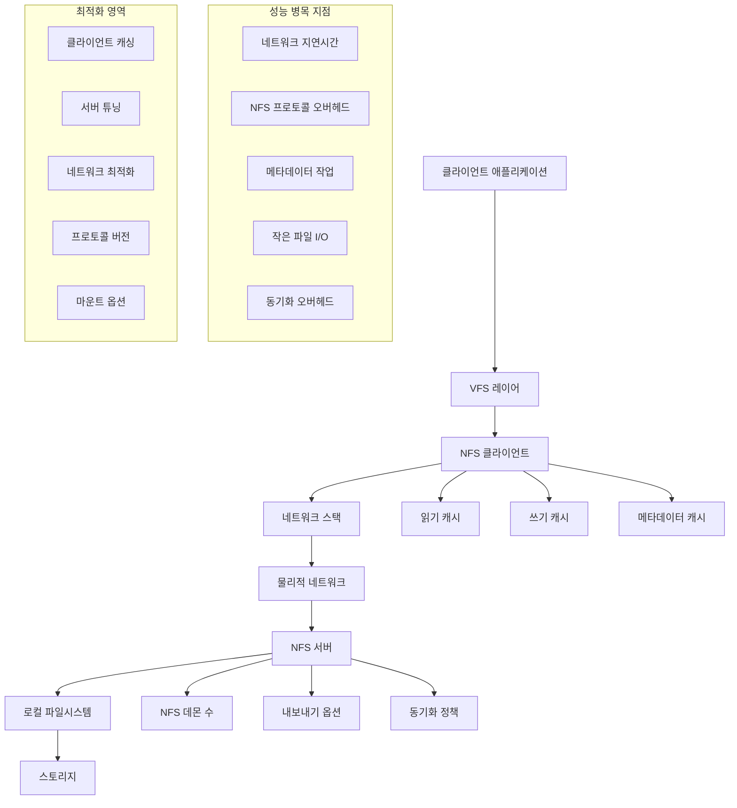

---
tags:
  - NFS
  - caching
  - distributed_storage
  - hands-on
  - intermediate
  - medium-read
  - network_filesystem
  - performance_optimization
  - 인프라스트럭처
difficulty: INTERMEDIATE
learning_time: "4-6시간"
main_topic: "인프라스트럭처"
priority_score: 4
---

# 6.4.5: 네트워크 파일시스템 최적화

## 🎯 분산 환경에서의 파일 공유 성능 최적화

"여러 서버에서 NFS로 파일을 공유하고 있는데 성능이 너무 느려서 문제가 되고 있어요. 특히 작은 파일들을 많이 읽을 때 지연시간이 심각합니다. Docker 컨테이너에서 NFS 볼륨을 사용할 때도 마찬가지구요."

네트워크 파일시스템은 분산 환경에서 필수적이지만, 올바른 설정과 최적화 없이는 심각한 성능 병목이 될 수 있습니다. 이 섹션에서는 NFS, SMB/CIFS, 그리고 최신 분산 파일시스템의 최적화 방법을 체계적으로 다룹니다.

## 📚 학습 로드맵

이 섹션은 4개의 전문화된 문서로 구성되어 있습니다:

### 1️⃣ [NFS 성능 분석 도구](./06-05-07-nfs-analysis-tools.md)

- 종합적인 NFS 성능 분석기 구현
- 네트워크 지연시간 및 I/O 성능 벤치마크
- 실시간 NFS 통계 수집 및 분석
- 성능 병목 지점 자동 감지

### 2️⃣ [자동 최적화 스크립트](./06-04-06-auto-optimization-scripts.md)

- 환경별 자동 최적화 스크립트
- 워크로드 패턴 기반 설정 생성
- Docker 환경 NFS 최적화
- 실시간 성능 테스트 및 튜닝

### 3️⃣ [서버 튜닝 가이드](./06-04-07-server-tuning-guide.md)

- NFS 서버 성능 최적화 전략
- 커널 매개변수 조정
- 내보내기 옵션 최적화
- 파일시스템별 최적화 방법

### 4️⃣ [모니터링 및 트러블슈팅](./06-05-08-monitoring-troubleshooting.md)

- 실시간 성능 모니터링 설정
- 일반적인 성능 문제 진단
- 네트워크 파일시스템 보안 고려사항
- 프로덕션 환경 베스트 프랙티스

## 🎯 핵심 성능 요소 비교표

| 성능 요소 | 주요 병목점 | 최적화 전략 | 예상 효과 |
|-----------|-------------|-------------|--------|
|**네트워크 지연시간**| 물리적 거리, 네트워크 품질 | 블록 크기 증가, 캐싱 | 2-5배 개선 |
|**메타데이터 작업**| 작은 파일 다수 처리 | 속성 캐시 시간 증가 | 3-10배 개선 |
|**동기화 오버헤드**| 일관성 보장 비용 | 비동기 옵션 활용 | 2-3배 개선 |
|**프로토콜 버전**| NFSv3 vs NFSv4 차이 | NFSv4+ 업그레이드 | 1.5-2배 개선 |

## 🚀 실전 활용 시나리오

### 고성능 컴퓨팅 환경

-**특징**: 대용량 파일, 순차 접근 패턴
-**최적화**: 큰 블록 크기, 다중 연결
-**구현 방법**: [자동 최적화 스크립트](./06-04-06-auto-optimization-scripts.md) 활용

### 웹 애플리케이션 환경

-**특징**: 많은 작은 파일, 랜덤 접근
-**최적화**: 적극적인 캐싱, 메타데이터 최적화
-**구현 방법**: [NFS 분석 도구](./06-05-07-nfs-analysis-tools.md)로 패턴 분석

### 컨테이너 환경

-**특징**: Docker/Kubernetes 볼륨 마운트
-**최적화**: 컨테이너 특화 마운트 옵션
-**구현 방법**: [서버 튜닝 가이드](./06-04-07-server-tuning-guide.md) 참조

## 네트워크 파일시스템 아키텍처

## 🔗 연관 학습

### 선행 학습

- [비동기 I/O](./06-03-01-async-io-fundamentals.md) - 기본 I/O 최적화 이해
- [VFS와 파일시스템](./06-02-04-vfs-filesystem.md) - 파일시스템 구조 이해

### 후속 학습

- [고성능 네트워킹](../chapter-07-network-programming/07-04-04-high-performance-networking.md) - 네트워크 레벨 최적화

## 핵심 요점

### 1. 성능 분석이 최적화의 시작점

네트워크 파일시스템 성능 문제는 다양한 원인을 가질 수 있으므로, 체계적인 분석이 필요합니다.

### 2. 환경별 맞춤 최적화 필요

LAN vs WAN, 작은 파일 vs 큰 파일 등 환경에 따라 최적화 전략이 달라집니다.

### 3. 일관성과 성능의 트레이드오프 고려

높은 성능을 위해서는 때로는 일관성을 조금 포기하는 선택이 필요할 수 있습니다.

---

**다음**: [NFS 성능 분석 도구](./06-05-07-nfs-analysis-tools.md)에서 체계적인 성능 분석 방법을 학습합니다.

## 📚 관련 문서

### 📖 현재 문서 정보

-**난이도**: INTERMEDIATE
-**주제**: 인프라스트럭처
-**예상 시간**: 4-6시간

### 🎯 학습 경로

- [📚 INTERMEDIATE 레벨 전체 보기](../learning-paths/intermediate/)
- [🏠 메인 학습 경로](../learning-paths/)
- [📋 전체 가이드 목록](../README.md)

### 📂 같은 챕터 (chapter-06-file-io)

- [6.2.1: 파일 디스크립터의 내부 구조](./06-02-01-file-descriptor.md)
- [6.1.1: 파일 디스크립터 기본 개념과 3단계 구조](./06-01-01-fd-basics-structure.md)
- [6.2.2: 파일 디스크립터 할당과 공유 메커니즘](./06-02-02-fd-allocation-management.md)
- [6.2.3: 파일 연산과 VFS 다형성](./06-02-03-file-operations-vfs.md)
- [6.2.4: VFS와 파일 시스템 추상화 개요](./06-02-04-vfs-filesystem.md)

### 🏷️ 관련 키워드

`NFS`, `network_filesystem`, `performance_optimization`, `distributed_storage`, `caching`

### ⏭️ 다음 단계 가이드

- 실무 적용을 염두에 두고 프로젝트에 적용해보세요
- 관련 도구들을 직접 사용해보는 것이 중요합니다
