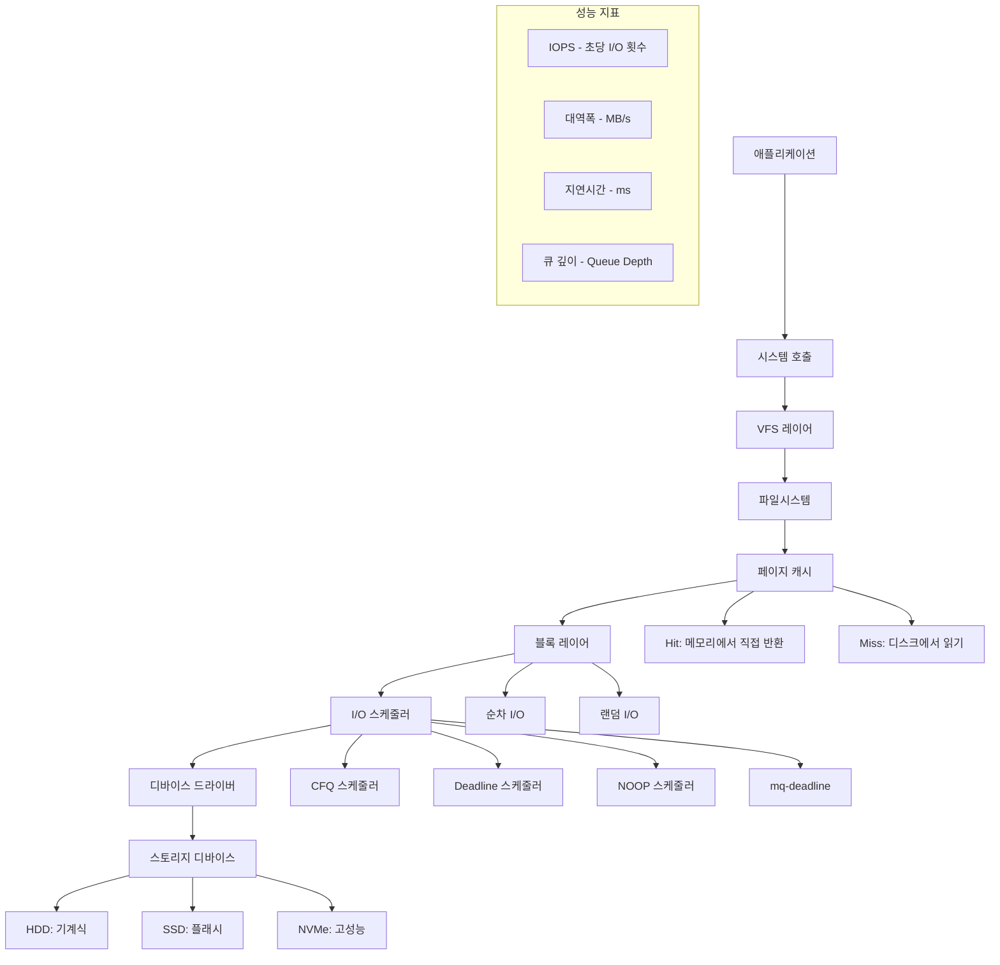

---
tags:
  - copying-collector
  - fundamentals
  - garbage-collection
  - mark-compact
  - mark-sweep
  - medium-read
  - memory-management
  - theoretical
  - 시스템프로그래밍
difficulty: FUNDAMENTALS
learning_time: "2-3시간"
main_topic: "시스템 프로그래밍"
priority_score: 5
---

# 6.5.2: I/O 성능 분석 기법

## 🎯 "디스크가 느려서 서비스가 버벅여요" - I/O 병목 해결 가이드

"안녕하세요, PostgreSQL을 운영하고 있는데 최근 들어 쿼리 응답시간이 급격히 늘어났어요. CPU나 메모리는 여유가 있는데 디스크 I/O가 병목인 것 같습니다. 어떻게 분석하고 최적화할 수 있을까요?"

이런 상황은 데이터베이스, 로그 처리, 파일 서버 등에서 흔히 발생하는 문제입니다. 이 가이드에서는 I/O 성능을 체계적으로 분석하고 최적화하는 전문적인 방법을 다룹니다.

## 📚 학습 로드맵

이 섹션은 3개의 전문화된 문서로 구성되어 있습니다:

### 1️⃣ [I/O 성능 분석 도구](./06-05-03-io-performance-monitoring.md)

- 종합 I/O 성능 분석기 구현
- /proc/diskstats 파싱 및 실시간 모니터링
- IOPS, 대역폭, 지연시간, 큐 깊이 계산
- 페이지 캐시 효율성 분석
- I/O 대기 프로세스 분석

### 2️⃣ [I/O 최적화 전략](./06-04-03-io-optimization-strategies.md)

- 디바이스별 최적화 (SSD vs HDD)
- I/O 스케줄러 선택 및 튜닝
- 커널 I/O 매개변수 조정
- 파일시스템별 최적화 옵션
- 데이터베이스 특화 최적화

### 3️⃣ [실전 I/O 성능 테스트](./06-04-04-io-performance-testing.md)

- 디스크 벤치마크 도구 구현
- 순차/랜덤 I/O 성능 측정
- I/O 모니터링 시스템 구축
- 성능 회귀 테스트 자동화
- 백업 및 복원 전략

## 🎯 핵심 개념 비교표

| 개념 | SSD 최적화 | HDD 최적화 | 설명 |
|------|-----------|-----------|------|
|**I/O 스케줄러**| mq-deadline, noop | CFQ, deadline | SSD는 탐색 시간 없어 단순한 스케줄러 선호 |
|**ReadAhead**| 8KB (낮음) | 256KB (높음) | HDD는 순차 읽기에 유리하므로 높은 값 |
|**큐 깊이**| 256 (높음) | 128 (중간) | SSD는 높은 병렬성 지원 |
|**TRIM/Discard**| 필수 | 불필요 | SSD 성능 유지를 위한 가비지 컬렉션 |

## 🚀 실전 활용 시나리오

### 데이터베이스 서버 최적화

- PostgreSQL/MySQL I/O 패턴 분석
- 버퍼 풀과 페이지 캐시 관계 최적화
- WAL/로그 파일 분리 배치

### 웹 서버 로그 처리

- 로그 파일 I/O 병목 해결
- 로그 로테이션 최적화
- 실시간 로그 분석 성능 향상

### 컨테이너 환경 I/O 최적화

- Docker 볼륨 I/O 성능 분석
- Kubernetes PV/PVC 최적화
- 멀티 컨테이너 I/O 경합 해결

## I/O 성능의 이해

## 🔗 연관 학습

### 선행 학습

- [Chapter 6.2.1: File Descriptor 시스템](./06-02-01-file-descriptor.md) - I/O 기초 개념
- [Chapter 6.2.4: VFS와 파일시스템](./06-02-04-vfs-filesystem.md) - 파일시스템 이해
- [Chapter 6.2.9: Block I/O 아키텍처](./06-02-09-block-io.md) - 블록 장치 I/O

### 후속 학습

- [파일시스템 디버깅](./06-05-04-filesystem-debugging.md) - I/O 오류 분석
- [네트워크 파일시스템 최적화](./06-04-05-network-filesystem-optimization.md) - 분산 스토리지

---

**다음**: [I/O 성능 분석 도구](./06-05-03-io-performance-monitoring.md)에서 실시간 모니터링과 성능 측정 도구를 학습합니다.

## 📚 관련 문서

### 📖 현재 문서 정보

-**난이도**: FUNDAMENTALS
-**주제**: 시스템 프로그래밍
-**예상 시간**: 2-3시간

### 🎯 학습 경로

- [📚 FUNDAMENTALS 레벨 전체 보기](../learning-paths/fundamentals/)
- [🏠 메인 학습 경로](../learning-paths/)
- [📋 전체 가이드 목록](../README.md)

### 📂 같은 챕터 (chapter-06-file-io)

- [6.2.1: 파일 디스크립터의 내부 구조](./06-02-01-file-descriptor.md)
- [6.1.1: 파일 디스크립터 기본 개념과 3단계 구조](./06-01-01-fd-basics-structure.md)
- [6.2.2: 파일 디스크립터 할당과 공유 메커니즘](./06-02-02-fd-allocation-management.md)
- [6.2.3: 파일 연산과 VFS 다형성](./06-02-03-file-operations-vfs.md)
- [6.2.4: VFS와 파일 시스템 추상화 개요](./06-02-04-vfs-filesystem.md)

### 🏷️ 관련 키워드

`garbage-collection`, `memory-management`, `mark-sweep`, `copying-collector`, `mark-compact`

### ⏭️ 다음 단계 가이드

- 기초 개념을 충분히 이해한 후 INTERMEDIATE 레벨로 진행하세요
- 실습 위주의 학습을 권장합니다
