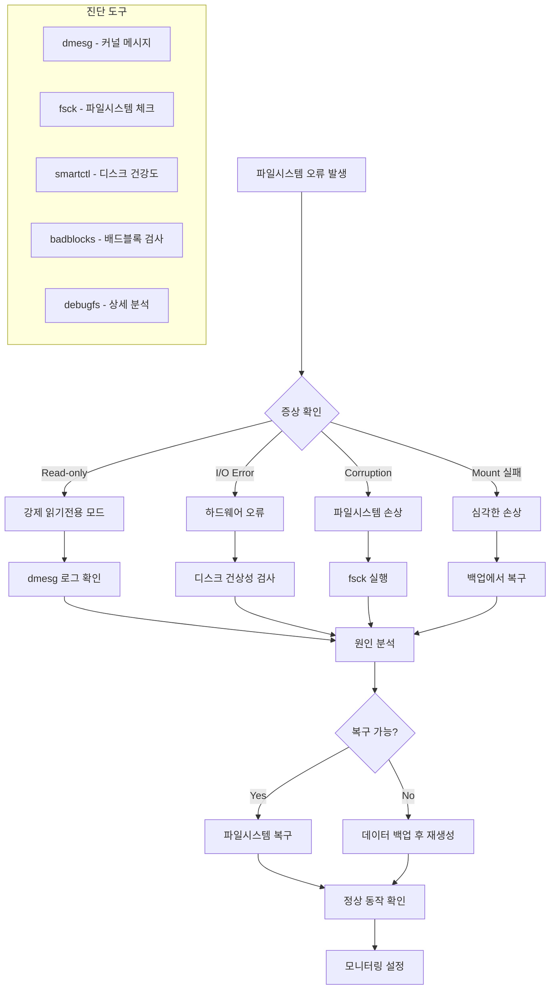
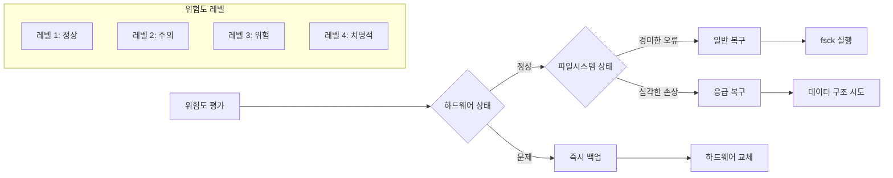
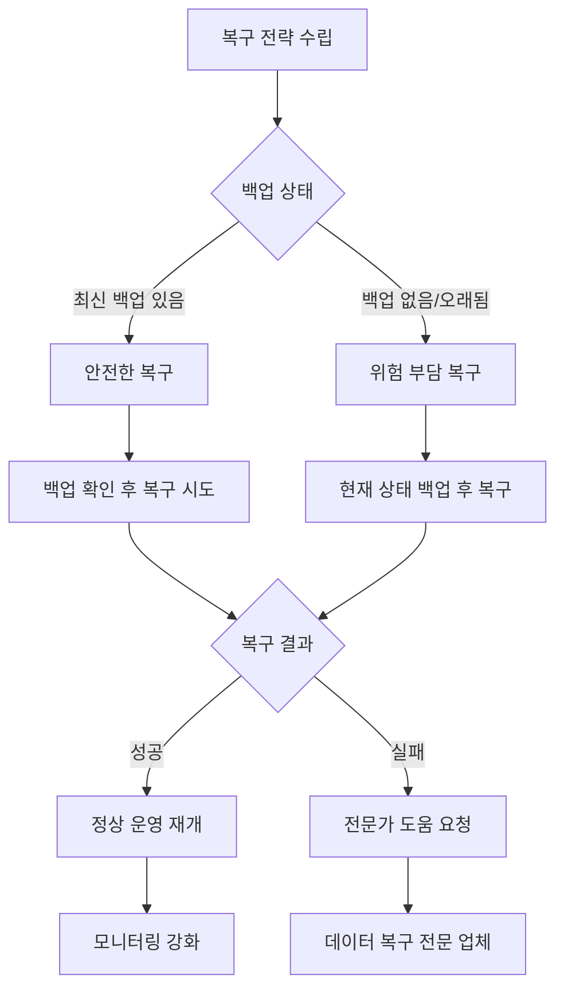

---
tags:
  - debugging
  - filesystem
  - hands-on
  - intermediate
  - medium-read
  - monitoring
  - recovery
  - troubleshooting
  - 인프라스트럭처
difficulty: INTERMEDIATE
learning_time: "4-6시간"
main_topic: "인프라스트럭처"
priority_score: 4
---

# 6.5.5: 파일시스템 진단 플로우

## 파일시스템 장애 상황에서의 체계적 접근법

파일시스템 장애는 시스템 운영 중 가장 치명적인 문제 중 하나입니다. "갑자기 파일 쓰기가 안 되고 있어요. dmesg를 보니 파일시스템이 read-only로 remount 되었다는 메시지가 있습니다"와 같은 상황은 하드웨어 문제, 파일시스템 손상, 또는 커널 버그로 인해 발생할 수 있습니다.

## 파일시스템 오류 진단 흐름



## 1단계: 초기 증상 분석

### 1.1 증상별 분류 매트릭스

| 증상 | 원인 추정 | 긴급도 | 첫 번째 액션 |
|------|-----------|--------|-------------|
|**Read-Only 마운트**| 파일시스템 오류 검출 | 높음 | dmesg 확인 |
|**I/O Error**| 하드웨어 장애 | 매우 높음 | SMART 검사 |
|**파일 손상**| 소프트웨어 버그 | 중간 | fsck 검사 |
|**마운트 실패**| 심각한 손상 | 매우 높음 | 응급 복구 모드 |

### 1.2 빠른 상태 확인 명령어

```bash
# 마운트 상태 확인
mount | grep -E "ext[234]|xfs|btrfs"

# 파일시스템 사용량 확인
df -h

# 최근 커널 메시지 (파일시스템 관련)
dmesg -T | grep -E "(EXT[234]|XFS|Btrfs|I/O error|remount.*read-only)"

# 디스크 I/O 오류 통계
cat /proc/diskstats | awk '{if($4>0||$8>0) print $3,$4,$8}'
```

## 2단계: 심층 진단 절차

### 2.1 커널 메시지 분석

파일시스템 오류의 가장 중요한 단서는 커널 로그입니다:

```bash
# 시간순으로 정렬된 파일시스템 오류 메시지
dmesg -T | grep -E "(EXT[234]|XFS|Btrfs)" | tail -20

# I/O 오류 패턴 분석
dmesg | grep -E "(end_request|Buffer I/O error)" | \
  awk '{print $1,$2,$3,$7}' | sort | uniq -c
```

### 2.2 파일시스템별 특화 진단

#### EXT2/3/4 파일시스템

```bash
# 파일시스템 상태 확인
dumpe2fs -h /dev/sda1 | grep -E "(state|errors|check)"

# 슈퍼블록 정보 확인
debugfs -R "show_super_stats" /dev/sda1
```

**주요 확인 항목:**

- `Filesystem state`: clean/not clean
- `Errors behavior`: continue/remount-ro/panic
- `Filesystem errors`: 누적 오류 횟수
- `Last checked`: 마지막 fsck 실행 시간

#### XFS 파일시스템

```bash
# XFS 파일시스템 정보
xfs_info /mount/point

# XFS 상태 확인
xfs_db -c 'sb 0' -c 'print' /dev/sda1 | grep -E "(state|errors)"
```

#### Btrfs 파일시스템

```bash
# Btrfs 파일시스템 정보
btrfs filesystem show

# Btrfs 상태 및 오류 확인
btrfs filesystem stats /mount/point
```

### 2.3 디스크 하드웨어 진단

```bash
# SMART 전체 상태
smartctl -a /dev/sda

# 중요한 SMART 속성만 확인
smartctl -A /dev/sda | \
  grep -E "(Reallocated_Sector_Ct|Current_Pending_Sector|Offline_Uncorrectable)"

# 디스크 온도 확인
hddtemp /dev/sda
```

## 3단계: 위험도 평가

### 3.1 위험도 매트릭스



### 3.2 위험도별 대응 전략

#### 레벨 1 (정상) - 예방적 점검

```bash
# 정기 파일시스템 점검
e2fsck -n /dev/sda1   # 읽기 전용 검사
```

#### 레벨 2 (주의) - 모니터링 강화

```bash
# 주기적 상태 모니터링 설정
echo "0 */6 * * * root smartctl -H /dev/sda" >> /etc/crontab
```

#### 레벨 3 (위험) - 즉시 조치

```bash
# 중요 데이터 즉시 백업
rsync -avx /important/data/ /backup/location/
```

#### 레벨 4 (치명적) - 응급 대응

```bash
# 시스템 중단 후 응급 복구
systemctl isolate rescue.target
```

## 4단계: 복구 전략 수립

### 4.1 복구 전략 결정 트리



### 4.2 파일시스템별 복구 명령어 가이드

#### EXT 파일시스템 복구

```bash
# 1단계: 읽기 전용 검사
e2fsck -n /dev/sda1

# 2단계: 자동 복구 (주의: 데이터 손실 가능)
e2fsck -f -y /dev/sda1

# 3단계: 대화형 복구 (권장)
e2fsck -f /dev/sda1

# 심각한 손상의 경우
e2fsck -f -y -c /dev/sda1  # 배드블록 검사 포함
```

#### XFS 파일시스템 복구

```bash
# 1단계: 검사 (읽기 전용)
xfs_repair -n /dev/sda1

# 2단계: 복구
xfs_repair /dev/sda1

# 강제 복구 (위험)
xfs_repair -L /dev/sda1  # 로그 초기화
```

#### Btrfs 파일시스템 복구

```bash
# 1단계: 검사
btrfs check /dev/sda1

# 2단계: 복구
btrfs check --repair /dev/sda1

# 3단계: 강제 복구
btrfs rescue super-recover /dev/sda1
```

## 5단계: 예방 및 모니터링

### 5.1 예방적 모니터링 설정

```bash
# SMART 모니터링 설정 (smartmontools)
cat > /etc/smartmontools/smartd.conf << EOF
/dev/sda -a -o on -S on -s (S/../.././02|L/../../6/03) -m root
EOF

# 파일시스템 정기 점검 스크립트
cat > /etc/cron.daily/filesystem-check << EOF
#!/bin/bash
for fs in $(mount | grep ext | awk '{print $1}'); do
    tune2fs -l $fs | grep -E "(state|errors)" | logger -t fscheck
done
EOF
```

### 5.2 조기 경보 시스템

```bash
# 디스크 공간 모니터링
cat > /usr/local/bin/disk-monitor.sh << EOF
#!/bin/bash
df -h | awk 'NR>1 {gsub(/%/,"",$5); if($5>90) print $0}' | \
while read line; do
    echo "WARN: Disk usage > 90%: $line" | logger -t disk-monitor
done
EOF
```

## 핵심 요점

### 1. 체계적 접근의 중요성

진단 흐름을 따라 단계별로 접근하면 문제의 원인을 정확히 파악할 수 있습니다.

### 2. 백업 우선의 원칙

모든 복구 작업 전에 가능한 데이터를 백업하는 것이 최우선입니다.

### 3. 읽기 전용 검사의 중요성

처음에는 항상 -n 옵션으로 읽기 전용 검사를 수행하여 상황을 파악합니다.

---

**이전**: [파일시스템 디버깅 개요](./06-05-04-filesystem-debugging.md)  
**다음**: [파일시스템 진단 도구 구현](./06-05-06-filesystem-diagnostic-tools.md)에서 실제 진단 도구의 구현과 사용법을 학습합니다.

## 📚 관련 문서

### 📖 현재 문서 정보

-**난이도**: INTERMEDIATE
-**주제**: 인프라스트럭처
-**예상 시간**: 4-6시간

### 🎯 학습 경로

- [📚 INTERMEDIATE 레벨 전체 보기](../learning-paths/intermediate/)
- [🏠 메인 학습 경로](../learning-paths/)
- [📋 전체 가이드 목록](../README.md)

### 📂 같은 챕터 (chapter-06-file-io)

- [6.2.1: 파일 디스크립터의 내부 구조](./06-02-01-file-descriptor.md)
- [6.1.1: 파일 디스크립터 기본 개념과 3단계 구조](./06-01-01-fd-basics-structure.md)
- [6.2.2: 파일 디스크립터 할당과 공유 메커니즘](./06-02-02-fd-allocation-management.md)
- [6.2.3: 파일 연산과 VFS 다형성](./06-02-03-file-operations-vfs.md)
- [6.2.4: VFS와 파일 시스템 추상화 개요](./06-02-04-vfs-filesystem.md)

### 🏷️ 관련 키워드

`filesystem`, `debugging`, `troubleshooting`, `recovery`, `monitoring`

### ⏭️ 다음 단계 가이드

- 실무 적용을 염두에 두고 프로젝트에 적용해보세요
- 관련 도구들을 직접 사용해보는 것이 중요합니다
