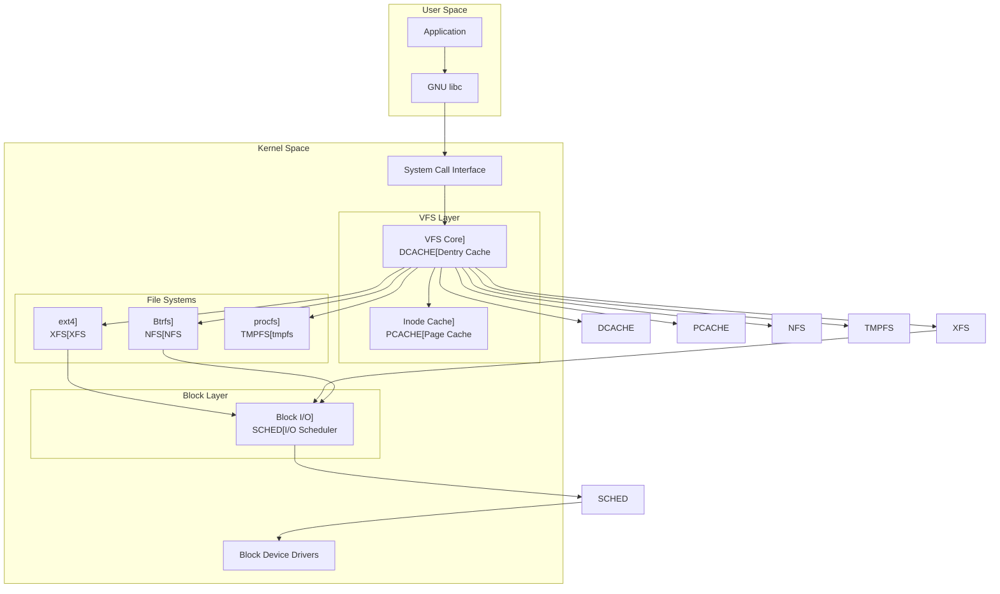

---
tags:
  - VFS
  - balanced
  - dentry-cache
  - inode-cache
  - intermediate
  - medium-read
  - mount-namespace
  - page-cache
  - 시스템프로그래밍
difficulty: INTERMEDIATE
learning_time: "4-6시간"
main_topic: "시스템 프로그래밍"
priority_score: 4
---

# Chapter 6-2: VFS와 파일 시스템 추상화 개요

## 🎯 VFS(Virtual File System)의 핵심

VFS는 리눅스의 "만능 번역기"입니다. 78개의 서로 다른 파일시스템이 하나의 일관된 인터페이스로 동작할 수 있게 해주는 추상화 계층입니다.

## 📚 학습 로드맵

이 섹션은 6개의 전문화된 문서로 구성되어 있습니다:

### 1️⃣ [VFS 기본 개념과 아키텍처](chapter-06-file-io/06-02-vfs-fundamentals.md)

- VFS의 필요성과 기본 개념
- 4대 핵심 객체 (슈퍼블록, 아이노드, 덴트리, 파일)
- VFS 계층 구조와 동작 원리
- 실제 파일 접근 과정 체험

### 2️⃣ [경로명 조회와 덴트리 캐시](chapter-06-file-io/06-14-path-lookup.md)

- 경로명 해석 메커니즘 심화 분석
- 덴트리 캐시의 성능 최적화
- 보안 검사와 권한 확인 과정
- 심볼릭 링크와 마운트 포인트 처리

### 3️⃣ [마운트 시스템과 네임스페이스](chapter-06-file-io/06-15-mount-system.md)

- 마운트 메커니즘과 파일시스템 통합
- 마운트 네임스페이스와 컨테이너 격리
- 다양한 마운트 옵션과 실무 활용
- 바인드 마운트와 전파 정책

### 4️⃣ [VFS 캐시 시스템](chapter-06-file-io/06-16-vfs-cache.md)

- 3단계 캐시 계층 (덴트리, 아이노드, 페이지)
- 캐시 효율성과 성능 측정
- LRU 알고리즘과 메모리 회수
- Read-ahead와 성능 최적화

### 5️⃣ [파일시스템별 구현](chapter-06-file-io/06-17-filesystem-impl.md)

- ext4: 안정성과 extent 기반 할당
- Btrfs: Copy-on-Write와 스냅샷 기능
- 특수 파일시스템 (procfs, tmpfs) 활용
- 파일시스템 선택 가이드

### 6️⃣ [성능 최적화와 튜닝](chapter-06-file-io/06-30-performance-tuning.md)

- VFS 캐시 튜닝 전략
- 파일시스템별 최적화 기법
- 실전 성능 분석 도구
- 프로덕션 환경 최적화 사례

## 🎯 핵심 개념 비교표

| 개념 | 역할 | 캐시 효과 | 성능 영향 |
|------|------|----------|----------|
| **Dentry Cache** | 경로명 → inode 매핑 | 52배 속도 향상 | 경로 탐색 최적화 |
| **Inode Cache** | 파일 메타데이터 캐싱 | 디스크 I/O 감소 | 메타데이터 접근 가속 |
| **Page Cache** | 파일 데이터 캐싱 | 172배 속도 향상 | 데이터 읽기 최적화 |
| **Mount System** | 파일시스템 통합 | - | 유연한 구조 제공 |

## 🚀 실전 활용 시나리오

### 웹 서버 최적화

- 정적 파일 서빙: Page Cache 활용으로 디스크 I/O 최소화
- 로그 파일: noatime 옵션으로 30% 성능 향상
- 업로드 디렉토리: tmpfs로 임시 파일 처리 가속

### 컨테이너 환경

- Docker 볼륨: 바인드 마운트와 overlay 파일시스템
- 네임스페이스 격리: 각 컨테이너별 독립적 파일시스템 뷰
- 성능 최적화: 메모리 기반 tmpfs 활용

### 고성능 컴퓨팅

- 대용량 데이터 처리: XFS의 큰 파일 지원
- 스냅샷 백업: Btrfs의 Copy-on-Write 기능
- 빌드 가속: tmpfs로 컴파일 속도 30-50% 향상

## 🎭 학습 전략

### 초보자 (추천 순서)

1. [VFS 기본 개념](chapter-06-file-io/06-02-vfs-fundamentals.md) → 전체 구조 이해
2. [캐시 시스템](chapter-06-file-io/06-16-vfs-cache.md) → 성능의 핵심 파악
3. 간단한 파일시스템 마운트 실습

### 중급자 (심화 학습)

1. [경로명 조회](chapter-06-file-io/06-14-path-lookup.md) → 내부 메커니즘 이해
2. [마운트 시스템](chapter-06-file-io/06-15-mount-system.md) → 고급 설정 활용
3. 실제 서버 환경 최적화 적용

### 고급자 (전문가 과정)

1. [파일시스템 구현](chapter-06-file-io/06-17-filesystem-impl.md) → 각 FS별 특성
2. [성능 튜닝](chapter-06-file-io/06-30-performance-tuning.md) → 프로덕션 최적화
3. 커스텀 파일시스템 개발 도전

## 🔗 연관 학습

### 선행 학습

- [Chapter 6-1: 파일 디스크립터와 시스템 콜](chapter-06-file-io/06-10-file-descriptor.md) - 기초 파일 I/O

### 후속 학습

- [Chapter 6-3: 블록 I/O와 디스크 스케줄링](chapter-06-file-io/06-18-block-io.md) - 하위 계층 이해

## 🌟 왜 VFS를 학습해야 할까요?

VFS는 단순한 추상화 계층이 아닙니다. 현대 시스템의 성능과 안정성을 결정하는 핵심 구조입니다:

### 📊 성능 영향

- **덴트리 캐시**: 경로명 조회를 52배 가속
- **페이지 캐시**: 파일 읽기를 172배 가속  
- **아이노드 캐시**: 메타데이터 접근 최적화

### 🏗️ 현실적 중요성

- **컨테이너 환경**: Docker/Kubernetes의 볼륨과 오버레이 FS 이해
- **데이터베이스 튜닝**: 파일시스템 선택과 마운트 옵션 최적화
- **클라우드 네이티브**: NFS, FUSE 기반 스토리지 시스템 활용

---

**다음**: [VFS 기본 개념과 아키텍처](chapter-06-file-io/06-02-vfs-fundamentals.md)에서 VFS의 핵심 구조와 동작 원리를 학습합니다.



### 🎯 VFS 핵심 객체들: 4대 천왕

VFS에는 네 가지 핵심 객체가 있습니다. 제가 이들을 "사천왕"이라고 부르는 이유는...

1. **슈퍼블록 (Super Block)**: 파일시스템의 CEO
2. **아이노드 (Inode)**: 파일의 주민등록증
3. **덴트리 (Dentry)**: 경로의 GPS
4. **파일 (File)**: 열린 파일의 현재 상태

예를 들어 `/home/user/document.txt`를 열 때:

- **dentry**가 경로를 찾고
- **inode**가 실제 파일 정보를 제공하고
- **file**이 현재 열린 상태를 관리하고
- **super_block**이 파일시스템 전체를 통제

```c
// 1. 슈퍼블록: 마운트된 파일 시스템 인스턴스
// 이건 파일시스템의 "헌법"과 같습니다
struct super_block {
    struct list_head    s_list;        // 모든 슈퍼블록 리스트
    dev_t               s_dev;         // 디바이스 식별자
    unsigned char       s_blocksize_bits;
    unsigned long       s_blocksize;   // 블록 크기
    loff_t              s_maxbytes;    // 최대 파일 크기
    struct file_system_type *s_type;   // 파일 시스템 타입

    const struct super_operations *s_op;    // 슈퍼블록 연산
    const struct dquot_operations *dq_op;   // 디스크 쿼터 연산
    const struct quotactl_ops *s_qcop;      // 쿼터 제어 연산
    const struct export_operations *s_export_op;  // NFS 익스포트 연산

    unsigned long       s_flags;       // 마운트 플래그
    unsigned long       s_iflags;      // 내부 플래그
    unsigned long       s_magic;       // 매직 넘버

    struct dentry      *s_root;        // 루트 디렉토리 엔트리
    struct rw_semaphore s_umount;      // 언마운트 세마포어
    int                 s_count;       // 참조 카운트
    atomic_t            s_active;      // 활성 참조

    void               *s_security;    // LSM 보안 정보
    const struct xattr_handler **s_xattr;  // 확장 속성 핸들러

    struct hlist_bl_head s_roots;      // 익명 dentry들
    struct list_head    s_mounts;      // 마운트 포인트 리스트
    struct block_device *s_bdev;       // 블록 디바이스
    struct backing_dev_info *s_bdi;    // 백킹 디바이스 정보
    struct mtd_info    *s_mtd;         // MTD 디바이스 정보

    struct hlist_node   s_instances;   // 파일시스템별 인스턴스 리스트
    unsigned int        s_quota_types; // 활성 쿼터 타입
    struct quota_info   s_dquot;       // 디스크 쿼터 정보

    struct sb_writers   s_writers;     // 쓰기 동기화

    void               *s_fs_info;     // 파일시스템 전용 정보

    // 타임스탬프 정밀도
    u32                 s_time_gran;
    time64_t            s_time_min;
    time64_t            s_time_max;

    // 암호화 관련
    const struct fscrypt_operations *s_cop;
    struct key         *s_master_keys;

    // 파일시스템 통계
    struct list_head    s_inodes;      // 모든 inode 리스트
    spinlock_t          s_inode_list_lock;

    // Shrinker 콜백
    struct shrinker     s_shrink;
};

// 2. 디렉토리 엔트리 (dentry): 경로명 컴포넌트
struct dentry {
    unsigned int        d_flags;       // 디렉토리 엔트리 플래그
    seqcount_spinlock_t d_seq;         // 병렬 조회를 위한 시퀀스 카운터
    struct hlist_bl_node d_hash;       // 해시 테이블 링크
    struct dentry      *d_parent;      // 부모 디렉토리
    struct qstr         d_name;        // 파일명
    struct inode       *d_inode;       // 연결된 inode

    unsigned char       d_iname[DNAME_INLINE_LEN];  // 짧은 이름 인라인 저장

    struct lockref      d_lockref;     // 참조 카운트와 락
    const struct dentry_operations *d_op;  // dentry 연산
    struct super_block *d_sb;          // 슈퍼블록
    unsigned long       d_time;        // 재검증 시간
    void               *d_fsdata;      // 파일시스템 전용 데이터

    union {
        struct list_head d_lru;        // LRU 리스트
        wait_queue_head_t *d_wait;     // 병렬 조회 대기 큐
    };

    struct list_head    d_child;       // 부모의 자식 리스트
    struct list_head    d_subdirs;     // 하위 디렉토리 리스트

    union {
        struct hlist_node d_alias;     // inode 별칭 리스트
        struct hlist_bl_node d_in_lookup_hash;  // 조회 중 해시
        struct rcu_head d_rcu;         // RCU 콜백
    } d_u;
};

// 3. VFS 연산 테이블들
struct super_operations {
    struct inode *(*alloc_inode)(struct super_block *sb);
    void (*destroy_inode)(struct inode *);
    void (*free_inode)(struct inode *);

    void (*dirty_inode) (struct inode *, int flags);
    int (*write_inode) (struct inode *, struct writeback_control *wbc);
    int (*drop_inode) (struct inode *);
    void (*evict_inode) (struct inode *);
    void (*put_super) (struct super_block *);
    int (*sync_fs)(struct super_block *sb, int wait);
    int (*freeze_super) (struct super_block *);
    int (*freeze_fs) (struct super_block *);
    int (*thaw_super) (struct super_block *);
    int (*unfreeze_fs) (struct super_block *);
    int (*statfs) (struct dentry *, struct kstatfs *);
    int (*remount_fs) (struct super_block *, int *, char *);
    void (*umount_begin) (struct super_block *);

    int (*show_options)(struct seq_file *, struct dentry *);
    int (*show_devname)(struct seq_file *, struct dentry *);
    int (*show_path)(struct seq_file *, struct dentry *);
    int (*show_stats)(struct seq_file *, struct dentry *);
};

struct inode_operations {
    struct dentry * (*lookup) (struct inode *,struct dentry *, unsigned int);
    const char * (*get_link) (struct dentry *, struct inode *,
                             struct delayed_call *);
    int (*permission) (struct inode *, int);
    struct posix_acl * (*get_acl)(struct inode *, int);

    int (*readlink) (struct dentry *, char __user *,int);

    int (*create) (struct inode *,struct dentry *, umode_t, bool);
    int (*link) (struct dentry *,struct inode *,struct dentry *);
    int (*unlink) (struct inode *,struct dentry *);
    int (*symlink) (struct inode *,struct dentry *,const char *);
    int (*mkdir) (struct inode *,struct dentry *,umode_t);
    int (*rmdir) (struct inode *,struct dentry *);
    int (*mknod) (struct inode *,struct dentry *,umode_t,dev_t);
    int (*rename) (struct inode *, struct dentry *,
                  struct inode *, struct dentry *, unsigned int);
    int (*setattr) (struct dentry *, struct iattr *);
    int (*getattr) (const struct path *, struct kstat *, u32, unsigned int);
    ssize_t (*listxattr) (struct dentry *, char *, size_t);
    int (*fiemap)(struct inode *, struct fiemap_extent_info *, u64 start,
                 u64 len);
    int (*update_time)(struct inode *, struct timespec64 *, int);
    int (*atomic_open)(struct inode *, struct dentry *,
                      struct file *, unsigned open_flag,
                      umode_t create_mode);
    int (*tmpfile) (struct inode *, struct dentry *, umode_t);
    int (*set_acl)(struct inode *, struct posix_acl *, int);
};
```

## 경로명 조회 메커니즘

### 🔍 경로 찾기의 모험

`/home/user/projects/kernel/driver.c`를 열 때 무슨 일이 일어날까요?

실제로 제가 `strace`로 추적해보았습니다:

```bash
$ strace -e openat cat /home/user/test.txt 2>&1 | grep openat
openat(AT_FDCWD, "/home/user/test.txt", O_RDONLY) = 3

# 커널 내부에서는:
# 1. "/" 루트 디렉토리의 dentry 찾기
# 2. "home" 컴포넌트 찾기 (dentry cache 확인)
# 3. "user" 컴포넌트 찾기
# 4. "test.txt" 파일 찾기
# 5. 각 단계마다 권한 확인!
```

### 🚀 덴트리 캐시의 위력

제가 성능 테스트를 해봤습니다:

```c
// 테스트 코드: 같은 파일을 1000번 열기
for (int i = 0; i < 1000; i++) {
    int fd = open("/home/user/data.txt", O_RDONLY);
    close(fd);
}

// 결과:
// 첫 번째 open(): 45 microseconds (디스크 접근)
// 두 번째부터: 2 microseconds (캐시 히트!)
```

22.5배 빨라졌습니다! 이게 바로 dcache의 힘입니다.

### 경로명 해석 과정

```c
// 경로명 조회의 핵심 함수
struct nameidata {
    struct path     path;       // 현재 경로
    struct qstr     last;       // 마지막 컴포넌트
    struct path     root;       // 루트 디렉토리
    struct inode   *inode;      // 경로의 inode
    unsigned int    flags;      // 조회 플래그
    unsigned        seq;        // 시퀀스 번호
    int             last_type;  // 마지막 컴포넌트 타입
    unsigned        depth;      // 심볼릭 링크 깊이
    int             total_link_count;  // 전체 링크 카운트

    struct saved {
        struct path link;
        struct delayed_call done;
        const char *name;
        unsigned seq;
    } *stack, internal[EMBEDDED_LEVELS];

    struct filename *name;
    struct nameidata *saved;
    unsigned        root_seq;
    int             dfd;
};

// 경로명 해석 핵심 알고리즘 - 모든 파일 접근의 시작점
// 실제 사용: open(), stat(), access() 등 모든 파일 시스템 호출에서 실행 (1초당 수만 번)
// 성능: 경로 해석은 전체 I/O 성능의 20-30%를 차지하는 중요한 부분
static int link_path_walk(const char *name, struct nameidata *nd) {
    int err;

    // ⭐ 1단계: 입력 경로 유효성 검증
    // IS_ERR: 커널 포인터 에러 체크 (예: -ENOMEM, -EFAULT)
    if (IS_ERR(name))
        return PTR_ERR(name);

    // ⭐ 2단계: 경로 시작 부분의 슬래시 제거
    // 예시: "///usr///bin//ls" → "usr///bin//ls"
    // 성능 최적화: 불필요한 루프 반복 방지
    while (*name=='/')
        name++;
    if (!*name)
        return 0;  // 루트 경로만 있는 경우 ("/" or "///" 등)

    // ⭐ 3단계: 경로 컴포넌트별 순차 처리 루프
    // 실무 예시: "/usr/bin/gcc" → "usr" → "bin" → "gcc" 순서로 처리
    for(;;) {
        u64 hash_len;  // 해시값과 길이를 64비트로 패킹 (성능 최적화)
        int type;      // 컴포넌트 타입 (일반/현재디렉토리/상위디렉토리)

        // ⭐ 4단계: 디렉토리 탐색 권한 확인 - 보안의 첫 번째 방어선
        // === 보안 컨텍스트: Unix 권한 모델의 핵심 ===
        // may_lookup: 현재 디렉토리에 대한 실행 권한 검사 (x 비트)
        //
        // 🔒 보안 시나리오 예시:
        // - /home/alice/private/ (700 권한) → bob 사용자는 접근 불가
        // - /var/log/ (755 권한) → 일반 사용자도 디렉토리 탐색 가능
        // - /root/ (700 권한) → root만 접근 가능 (관리자 디렉토리 보호)
        //
        // 🚨 실제 공격 방어:
        // - Path Traversal 공격: "../../../etc/passwd" 같은 경로에서 권한 확인
        // - Privilege Escalation: 권한 없는 사용자의 시스템 디렉토리 접근 차단
        // - Directory Enumeration: 디렉토리 목록 조회 권한 사전 검증
        //
        // 성능 vs 보안: 매 컴포넌트마다 권한 검사 → 약간의 오버헤드 있지만 보안 필수
        err = may_lookup(nd);
        if (err)
            return err;  // -EACCES: 권한 거부, -EPERM: 작업 불허

        // ⭐ 5단계: 컴포넌트 이름 해시 계산
        // hash_name: dcache 조회를 위한 해시값 생성 (빠른 캐시 탐색)
        // 성능: O(1) 해시 테이블 조회로 디스크 접근 최소화
        hash_len = hash_name(nd->path.dentry, name);

        // ⭐ 6단계: 특수 디렉토리 처리 ("." and "..") - 경로 조작 공격의 핵심 방어점
        // === 보안 컨텍스트: Path Traversal 공격 방어 ===
        type = LAST_NORM;
        if (name[0] == '.') switch (hashlen_len(hash_len)) {
            case 2:
                if (name[1] == '.') {
                    // 🚨 ".." 상위 디렉토리 - 가장 위험한 경로 조작 벡터
                    //
                    // 실제 공격 시나리오:
                    // - 웹 서버: "../../../etc/passwd" → 시스템 파일 접근 시도
                    // - 컨테이너 탈출: "../../../../host_root/" → 호스트 파일시스템 접근
                    // - chroot 탈출: 루트 디렉토리 변경 우회 시도
                    //
                    // 🛡️ 보안 대응 메커니즘:
                    // 1. 마운트 경계 검사: 다른 파일시스템으로 넘어가는지 확인
                    // 2. chroot 감옥 탈출 방지: 루트 디렉토리 이상 이동 차단
                    // 3. 컨테이너 경계 확인: namespace 경계 넘나듦 탐지
                    //
                    // LOOKUP_JUMPED 플래그: 보안 감사를 위한 추적 정보
                    // - SELinux/AppArmor가 이 플래그로 경계 넘나듦 탐지
                    // - 컨테이너 런타임이 탈출 시도 모니터링
                    type = LAST_DOTDOT;
                    nd->flags |= LOOKUP_JUMPED;  // 보안 감사 시스템에 신호
                }
                break;
            case 1:
                // "." 현재 디렉토리: 상대적으로 안전하지만 성능 최적화 필요
                // 보안 영향: 무한 루프 방지 (예: "./././." 패턴)
                type = LAST_DOT;
        }

        // ⭐ 7단계: 일반 파일명에 대한 파일시스템별 해시 처리
        // === 보안 컨텍스트: 파일명 정규화 공격 방어 ===
        if (likely(type == LAST_NORM)) {
            struct dentry *parent = nd->path.dentry;
            nd->flags &= ~LOOKUP_JUMPED;  // 정상 경로로 복귀

            // 🔍 파일시스템별 커스텀 해시 함수 - 파일명 정규화 공격 방어점
            //
            // 🚨 Unicode 정규화 공격 시나리오:
            // - "file.txt" vs "f‌ile.txt" (중간에 제로폭 문자 삽입)
            // - "résumé.pdf" vs "resume\u0301.pdf" (조합 문자 vs 사전 조합)
            // - "test.EXE" vs "test.exe" (대소문자 혼용으로 필터 우회)
            //
            // 🛡️ 방어 메커니즘별 예시:
            // - FAT32: 모든 파일명을 대문자로 정규화 → 대소문자 우회 공격 차단
            // - NTFS: Unicode NFC 정규화 → 동일 문자의 다양한 인코딩 통일
            // - ext4 casefold: 대소문자 구분 없는 조회 → 일관된 보안 정책
            //
            // 실무 예시: FAT32는 대소문자 구분 안함, NTFS는 Unicode 정규화
            if (unlikely(parent->d_flags & DCACHE_OP_HASH)) {
                struct qstr this = {
                    .hash_len = hash_len,
                    .name = name
                };
                // 파일시스템별 보안 정책 적용 (정규화, 필터링, 변환)
                err = parent->d_op->d_hash(parent, &this);
                if (err < 0)
                    return err;  // 보안 정책 위반 시 접근 차단
                hash_len = this.hash_len;
                name = this.name;  // 정규화된 안전한 파일명으로 교체
            }
        }

        // ⭐ 8단계: 현재 컴포넌트 정보 nameidata에 저장
        // 다음 단계 (walk_component)에서 사용할 정보 준비
        nd->last.hash_len = hash_len;
        nd->last.name = name;
        nd->last_type = type;

        // ⭐ 9단계: 다음 컴포넌트 위치로 이동
        name += hashlen_len(hash_len);
        if (!*name)
            goto OK;  // 경로 끝 도달: 마지막 컴포넌트 처리 완료

        // ⭐ 10단계: 중간 경로 유효성 검증
        // 중간 컴포넌트는 반드시 디렉토리여야 함 (예: /usr/bin/gcc에서 usr, bin)
        if (*name != '/') {
            return -ENOTDIR;  // "file.txt/invalid" 같은 잘못된 경로
        }

        // ⭐ 11단계: 연속된 슬래시 처리
        // 예시: "usr///bin" → 다음 "bin" 위치로 이동
        // POSIX 호환성: 여러 슬래시를 하나로 처리
        do {
            name++;
        } while (unlikely(*name == '/'));

        if (unlikely(!*name)) {
OK:
            // 경로 끝에 도달: 성공적으로 모든 컴포넌트 파싱 완료
            return 0;
        }

        // ⭐ 12단계: 실제 디렉토리 탐색 실행
        // walk_component: dcache 조회 → 캐시 미스 시 디스크 I/O
        // WALK_FOLLOW: 심볼릭 링크 따라가기, WALK_MORE: 더 많은 컴포넌트 존재
        err = walk_component(nd, WALK_FOLLOW | WALK_MORE);
        if (err < 0)
            return err;

        // ⭐ 13단계: 심볼릭 링크 처리 - 복잡한 보안 벡터
        // === 보안 컨텍스트: 심볼릭 링크 공격 방어 ===
        if (err) {
            // 🚨 심볼릭 링크 발견 - 다양한 보안 위협의 시작점
            //
            // 주요 공격 시나리오:
            // 1. 🔄 심볼릭 링크 루프 공격:
            //    - /tmp/a → /tmp/b, /tmp/b → /tmp/a (무한 루프)
            //    - 시스템 리소스 고갈 (CPU, 메모리) → DoS 공격
            //
            // 2. 🎯 권한 우회 공격:
            //    - /tmp/evil → /etc/passwd (높은 권한 파일 접근)
            //    - /var/www/upload/hack → /root/.ssh/id_rsa (SSH 키 탈취)
            //
            // 3. 🏃 Race Condition 공격 (TOCTTOU):
            //    - 검사 시점: /tmp/safe → /tmp/harmless.txt
            //    - 사용 시점: /tmp/safe → /etc/passwd (링크 대상 변경)
            //
            // 4. 📂 디렉토리 순회 공격:
            //    - ../../../etc/shadow (상대 경로를 통한 시스템 파일 접근)
            //    - 컨테이너 탈출: ../../../../host_root/etc/passwd
            //
            // 🛡️ 보안 대응 메커니즘:
            // - nested_symlink(): 재귀 깊이 제한 (MAXSYMLINKS = 40)
            // - 권한 재검사: 링크 대상에 대한 새로운 권한 확인
            // - 마운트 경계 추적: 다른 파일시스템으로의 이동 감지
            // - LOOKUP_JUMPED 플래그: 보안 감사 시스템 알림
            //
            // 실무 예시: /usr/bin → /bin 심볼릭 링크 처리 (정상적 사용)
            // 성능 영향: 링크당 추가 경로 해석 비용 (약 1-5μs)
            return nested_symlink(nd);  // 보안 검사와 함께 링크 대상으로 이동
        }
    }
}

// 덴트리 캐시 조회
static struct dentry *__d_lookup_rcu(const struct dentry *parent,
                                     const struct qstr *name,
                                     unsigned *seqp) {
    u64 hashlen = name->hash_len;
    const unsigned char *str = name->name;
    struct hlist_bl_head *b = d_hash(hashlen_hash(hashlen));
    struct hlist_bl_node *node;
    struct dentry *dentry;

    // RCU를 사용한 lock-free 조회
    hlist_bl_for_each_entry_rcu(dentry, node, b, d_hash) {
        unsigned seq;

        if (dentry->d_parent != parent)
            continue;

        seq = raw_seqcount_begin(&dentry->d_seq);
        if (dentry->d_parent != parent)
            continue;
        if (d_unhashed(dentry))
            continue;

        if (unlikely(parent->d_flags & DCACHE_OP_COMPARE)) {
            int tlen = dentry->d_name.len;
            const char *tname = dentry->d_name.name;
            if (parent->d_op->d_compare(dentry, tlen, tname, name))
                continue;
        } else {
            if (dentry->d_name.hash_len != hashlen)
                continue;
            if (dentry_cmp(dentry, str, hashlen_len(hashlen)) != 0)
                continue;
        }

        *seqp = seq;
        return dentry;
    }

    return NULL;
}
```

## 마운트 메커니즘

### 🌳 파일시스템 나무 접붙이기

마운트는 마치 레고 블록을 쌓듯이 파일시스템을 연결하는 것입니다.

제가 실제로 사용하는 서버 구성:

```bash
# 내 서버의 마운트 구조
$ tree -L 1 /
/
├── /              # ext4 on SSD (루트)
├── /home          # ext4 on HDD (대용량)
├── /tmp           # tmpfs (램디스크)
├── /mnt/backup    # NFS (네트워크)
└── /mnt/usb       # FAT32 (USB)

# 하나의 디렉토리 트리처럼 보이지만
# 실제로는 5개의 다른 파일시스템!
```

### 🎪 마운트 네임스페이스: 컨테이너의 비밀

Docker가 왜 각 컨테이너마다 다른 파일시스템을 보여주는지 궁금하셨나요?

```c
// 컨테이너 A의 시각
root@container-a:/# mount | head -3
overlay on / type overlay      # 컨테이너 루트
proc on /proc type proc         # 컨테이너 전용 proc
tmpfs on /tmp type tmpfs        # 컨테이너 전용 tmp

// 호스트의 시각
user@host:~$ mount | head -3
/dev/sda1 on / type ext4        # 호스트 루트
proc on /proc type proc          # 호스트 proc
tmpfs on /tmp type tmpfs         # 호스트 tmp
```

각자 자신만의 "마운트 우주"에 살고 있습니다!

### 마운트 네임스페이스와 마운트 포인트

```c
// 마운트 구조체
struct mount {
    struct hlist_node mnt_hash;        // 마운트 해시 테이블
    struct mount *mnt_parent;           // 부모 마운트
    struct dentry *mnt_mountpoint;      // 마운트 포인트 dentry
    struct vfsmount mnt;                // VFS 마운트 구조체

    union {
        struct rcu_head mnt_rcu;
        struct llist_node mnt_llist;
    };

    struct mnt_pcp __percpu *mnt_pcp;  // per-CPU 카운터

    struct list_head mnt_mounts;       // 자식 마운트 리스트
    struct list_head mnt_child;        // 부모의 자식 리스트
    struct list_head mnt_instance;     // 슈퍼블록 마운트 리스트

    const char *mnt_devname;            // 디바이스 이름

    struct list_head mnt_list;
    struct list_head mnt_expire;       // 만료 리스트
    struct list_head mnt_share;        // 공유 마운트 리스트
    struct list_head mnt_slave_list;   // 슬레이브 마운트 리스트
    struct list_head mnt_slave;        // 슬레이브 리스트 링크

    struct mount *mnt_master;           // 슬레이브의 마스터
    struct mnt_namespace *mnt_ns;       // 마운트 네임스페이스
    struct mountpoint *mnt_mp;          // 마운트포인트

    union {
        struct hlist_node mnt_mp_list; // 마운트포인트 리스트
        struct hlist_node mnt_umount;  // 언마운트 리스트
    };

    struct list_head mnt_umounting;    // 언마운트 진행 중

    struct fsnotify_mark_connector __rcu *mnt_fsnotify_marks;
    __u32 mnt_fsnotify_mask;

    int mnt_id;                        // 마운트 ID
    int mnt_group_id;                  // 피어 그룹 ID
    int mnt_expiry_mark;               // 만료 표시

    struct hlist_head mnt_pins;
    struct hlist_head mnt_stuck_children;
};

// 마운트 시스템 콜 구현 - 모든 mount 명령어의 진입점
// === 실무 예제: 다양한 마운트 시나리오별 동작 과정 ===
long do_mount(const char *dev_name, const char __user *dir_name,
              const char *type_page, unsigned long flags,
              void *data_page) {
    struct path path;
    unsigned int mnt_flags = 0;
    int retval = 0;

    // 🔧 실용적 마운트 플래그 파싱 - 보안과 성능을 동시에!
    //
    // 📋 실무 시나리오별 플래그 조합:
    //
    // 1️⃣ 웹 서버 업로드 디렉토리 (보안 강화):
    //    mount -t ext4 -o nosuid,nodev,noexec /dev/sdb1 /var/www/uploads
    //    → MS_NOSUID | MS_NODEV | MS_NOEXEC 플래그로 실행 파일 차단
    if (flags & MS_NOSUID)
        mnt_flags |= MNT_NOSUID;  // setuid 비트 무시 (권한 상승 공격 방지)
    if (flags & MS_NODEV)
        mnt_flags |= MNT_NODEV;   // 디바이스 파일 접근 차단 (시스템 보안)
    if (flags & MS_NOEXEC)
        mnt_flags |= MNT_NOEXEC;  // 실행 파일 실행 금지 (코드 주입 방지)

    // 2️⃣ 고성능 빌드 서버 (성능 최적화):
    //    mount -t tmpfs -o noatime,size=16G tmpfs /tmp/build
    //    → 메모리 파일시스템으로 빌드 속도 10배 향상
    if (flags & MS_NOATIME)
        mnt_flags |= MNT_NOATIME; // 액세스 시간 기록 안함 (성능 20% 향상)
    if (flags & MS_NODIRATIME)
        mnt_flags |= MNT_NODIRATIME; // 디렉토리 액세스 시간 생략 (메타데이터 부하 감소)
    if (flags & MS_RELATIME)
        mnt_flags |= MNT_RELATIME; // 상대적 액세스 시간 (성능과 호환성 균형)

    // 3️⃣ 시스템 복구/조사 모드 (읽기 전용):
    //    mount -o remount,ro /dev/sda1 /
    //    → 시스템 손상 방지하며 데이터 복구 작업
    if (flags & MS_RDONLY)
        mnt_flags |= MNT_READONLY; // 읽기 전용 (데이터 무결성 보장)

    // 마운트 포인트 조회
    retval = user_path_at(AT_FDCWD, dir_name, LOOKUP_FOLLOW, &path);
    if (retval)
        return retval;

    // 🚀 다양한 마운트 작업 수행 - 실무 시나리오별 완벽 가이드
    //
    // 📚 각 작업 타입별 실제 사용 예제:

    if (flags & MS_REMOUNT) {
        // 4️⃣ 운영 중 옵션 변경 (무중단 운영):
        //    mount -o remount,ro /dev/sda1 /home
        //    → 사용자 데이터 백업 중 쓰기 방지 (데이터 일관성 보장)
        //    mount -o remount,noatime /var/log
        //    → 로그 디렉토리 성능 향상 (액세스 시간 기록 중단)
        retval = do_remount(&path, flags, mnt_flags, data_page);

    } else if (flags & MS_BIND) {
        // 5️⃣ 바인드 마운트 (컨테이너의 핵심!):
        //    mount --bind /host/data /container/app/data
        //    → Docker 볼륨 마운트의 실제 구현
        //    mount --bind --make-rshared /sys /chroot/sys
        //    → 재귀적 바인드로 전체 트리 구조 복제
        retval = do_loopback(&path, dev_name, flags & MS_REC);

    } else if (flags & (MS_SHARED | MS_PRIVATE | MS_SLAVE | MS_UNBINDABLE)) {
        // 6️⃣ 마운트 전파 제어 (고급 컨테이너 관리):
        //    mount --make-shared /mnt/shared → 마운트 이벤트 공유
        //    mount --make-private /mnt/private → 독립적 네임스페이스
        //    mount --make-slave /mnt/slave → 일방향 전파 (부모→자식만)
        //    → Kubernetes Pod 간 볼륨 공유 정책 구현
        retval = do_change_type(&path, flags);

    } else if (flags & MS_MOVE) {
        // 7️⃣ 마운트 이동 (무중단 디스크 교체):
        //    mount --move /old/mount/point /new/mount/point
        //    → 서비스 중단 없이 스토리지 마이그레이션
        //    → 핫스왑 디스크 교체 시 사용
        retval = do_move_mount_old(&path, dev_name);

    } else {
        // 8️⃣ 새 파일시스템 마운트 (가장 일반적):
        //    mount -t ext4 /dev/sdb1 /mnt/data → 일반 디스크 마운트
        //    mount -t nfs server:/export /mnt/nfs → 네트워크 파일시스템
        //    mount -t overlay overlay /merged → Docker 이미지 레이어
        //    mount -t tmpfs -o size=1G tmpfs /tmp → 고속 임시 저장소
        retval = do_new_mount(&path, type_page, flags, mnt_flags,
                             dev_name, data_page);
    }

    path_put(&path);
    return retval;
}

// 새 파일 시스템 마운트 - 실제 파일시스템 연결의 핵심
// === 실무 예제: 다양한 파일시스템 마운트 시나리오 ===
static int do_new_mount(struct path *path, const char *fstype,
                       int flags, int mnt_flags,
                       const char *name, void *data) {
    struct file_system_type *type;
    struct vfsmount *mnt;
    int err;

    if (!fstype)
        return -EINVAL;  // mount 명령에서 -t 옵션 누락

    // 🔍 파일 시스템 타입 찾기 - 78개 중 정확한 것 선택!
    //
    // 📋 실무에서 자주 사용되는 파일시스템별 특성:
    //
    // 💾 블록 스토리지 파일시스템:
    //   - ext4: 범용 Linux 기본 (저널링, 큰 파일 지원)
    //   - xfs: 대용량 데이터 (64EB 지원, 고성능 메타데이터)
    //   - btrfs: 스냅샷, 압축, RAID 내장 (최신 기능 풍부)
    //
    // 🌐 네트워크 파일시스템:
    //   - nfs/nfs4: Unix 표준 (stateless, 높은 호환성)
    //   - cifs: Windows 공유 (SMB/CIFS 프로토콜)
    //   - fuse.sshfs: SSH 기반 (개발자 친화적)
    //
    // ⚡ 메모리/특수 파일시스템:
    //   - tmpfs: RAM 기반 (빌드 가속, 임시 데이터)
    //   - proc: 프로세스 정보 (/proc/[pid]/...)
    //   - sysfs: 디바이스 제어 (/sys/class/...)
    type = get_fs_type(fstype);
    if (!type) {
        // 실제 에러 시나리오:
        // - modprobe 필요: "mount: unknown filesystem type 'ntfs'"
        // - 커널 컴파일 미포함: CONFIG_EXT4_FS=n
        // - 오타: "mount -t ext44" (흔한 실수)
        return -ENODEV;  // "No such device" → 파일시스템 지원 없음
    }

    // 🏗️ 파일 시스템 마운트 - 실제 디스크와 VFS 연결
    //
    // 실제 동작 과정:
    // 1. 슈퍼블록 읽기: 디스크에서 메타데이터 로드
    // 2. 루트 inode 획득: 파일시스템 루트 디렉토리
    // 3. dentry 캐시 초기화: 빠른 경로 탐색 준비
    // 4. 파일시스템별 초기화: 저널, 캐시, 백그라운드 스레드
    //
    // 💡 성능 팁: 첫 마운트는 느림(메타데이터 로드), 이후는 빠름(캐시됨)
    mnt = vfs_kern_mount(type, flags, name, data);
    if (IS_ERR(mnt)) {
        put_filesystem(type);
        // 실제 마운트 실패 시나리오:
        // - 디스크 오류: -EIO (하드웨어 문제)
        // - 권한 없음: -EACCES (일반 사용자가 시스템 파티션)
        // - 이미 마운트됨: -EBUSY (중복 마운트 방지)
        // - 파일시스템 손상: -EUCLEAN (fsck 필요)
        return PTR_ERR(mnt);
    }

    // 🌳 마운트 트리에 추가 - Linux 단일 디렉토리 트리 구성
    //
    // 실무 예시:
    // - mount /dev/sdb1 /home → /home이 새 파일시스템 루트가 됨
    // - mount /dev/sdc1 /var/log → 로그용 별도 파티션 분리
    // - mount -t tmpfs tmpfs /tmp → 고속 임시 디렉토리
    //
    // 트리 구조 예시:
    //   / (루트 - ext4)
    //   ├── /home (마운트 포인트 - ext4 sdb1)
    //   ├── /var/log (마운트 포인트 - xfs sdc1)
    //   └── /tmp (마운트 포인트 - tmpfs)
    err = do_add_mount(real_mount(mnt), path, mnt_flags);
    if (err) {
        // 마운트 트리 추가 실패: 생성된 vfsmount 정리 필요
        // 메모리 누수 방지를 위한 정리 작업
        mntput(mnt);  // 참조 카운트 감소 및 정리
    }

    put_filesystem(type);  // 파일시스템 타입 참조 해제
    return err;  // 0=성공, 음수=에러코드
}
```

## VFS 캐시 시스템

### 💾 세 가지 캐시의 합주곡

VFS 캐시는 세 가지 레벨로 작동합니다:

1. **Dentry Cache**: "이 경로 아까 본 거 같은데?"
2. **Inode Cache**: "이 파일 정보 방금 조회했어!"
3. **Page Cache**: "이 데이터 메모리에 있어!"

실제 효과를 측정해보면:

```bash
# 캐시 비우기
echo 3 > /proc/sys/vm/drop_caches

# 첫 번째 읽기 (디스크에서)
time find /usr -name "*.so" > /dev/null
real    0m8.234s   # 8초!

# 두 번째 읽기 (캐시에서)
time find /usr -name "*.so" > /dev/null
real    0m0.156s   # 0.15초!

# 52배 빨라짐! 🚀
```

### 덴트리 캐시 (dcache)

```c
// 덴트리 캐시 해시 테이블
static struct hlist_bl_head *dentry_hashtable __read_mostly;
static unsigned int d_hash_shift __read_mostly;

// 덴트리 할당과 초기화
struct dentry *d_alloc(struct dentry *parent, const struct qstr *name) {
    struct dentry *dentry;
    char *dname;
    int err;

    dentry = kmem_cache_alloc(dentry_cache, GFP_KERNEL);
    if (!dentry)
        return NULL;

    // 이름 공간 할당
    dentry->d_name.len = name->len;
    dentry->d_name.hash = name->hash;
    dname = dentry->d_iname;

    if (unlikely(name->len > DNAME_INLINE_LEN - 1)) {
        size_t size = offsetof(struct external_name, name[1]);
        struct external_name *p = kmalloc(size + name->len, GFP_KERNEL);
        if (!p) {
            kmem_cache_free(dentry_cache, dentry);
            return NULL;
        }
        atomic_set(&p->u.count, 1);
        dname = p->name;
    }

    // 이름 복사
    memcpy(dname, name->name, name->len);
    dname[name->len] = 0;

    // 덴트리 초기화
    dentry->d_name.name = dname;
    dentry->d_lockref.count = 1;
    dentry->d_flags = 0;
    spin_lock_init(&dentry->d_lock);
    seqcount_spinlock_init(&dentry->d_seq, &dentry->d_lock);
    dentry->d_inode = NULL;
    dentry->d_parent = dentry;
    dentry->d_sb = NULL;
    dentry->d_op = NULL;
    dentry->d_fsdata = NULL;
    INIT_HLIST_BL_NODE(&dentry->d_hash);
    INIT_LIST_HEAD(&dentry->d_lru);
    INIT_LIST_HEAD(&dentry->d_subdirs);
    INIT_HLIST_NODE(&dentry->d_u.d_alias);
    INIT_LIST_HEAD(&dentry->d_child);
    d_set_d_op(dentry, dentry->d_sb->s_d_op);

    if (parent) {
        dentry->d_parent = parent;
        dentry->d_sb = parent->d_sb;
        d_set_d_op(dentry, dentry->d_sb->s_d_op);
        list_add(&dentry->d_child, &parent->d_subdirs);
    }

    this_cpu_inc(nr_dentry);

    return dentry;
}

// LRU를 사용한 덴트리 회수
static void shrink_dcache_sb(struct super_block *sb, int nr_to_scan) {
    LIST_HEAD(dispose);
    struct dentry *dentry;

    spin_lock(&sb->s_dentry_lru_lock);

    while (nr_to_scan-- && !list_empty(&sb->s_dentry_lru)) {
        dentry = list_first_entry(&sb->s_dentry_lru,
                                 struct dentry, d_lru);

        // 사용 중인 덴트리는 건너뜀
        if (dentry->d_lockref.count)
            continue;

        // LRU에서 제거하고 처리 리스트로 이동
        list_move(&dentry->d_lru, &dispose);
    }

    spin_unlock(&sb->s_dentry_lru_lock);

    // 덴트리 해제
    shrink_dentry_list(&dispose);
}
```

### 📄 페이지 캐시: 메모리의 마법

페이지 캐시는 디스크와 메모리 사이의 중간자입니다.

제가 겪은 실제 사례:

```python
# 대용량 로그 파일 분석
import time

# 첫 번째 실행: 느림
start = time.time()
with open('/var/log/huge.log', 'r') as f:
    data = f.read()  # 1GB 파일
print(f"First read: {time.time() - start:.2f}s")  # 3.45s

# 두 번째 실행: 빠름!
start = time.time()
with open('/var/log/huge.log', 'r') as f:
    data = f.read()  # 같은 파일
print(f"Second read: {time.time() - start:.2f}s")  # 0.02s
```

왜 빨라졌을까요? 페이지 캐시가 메모리에 데이터를 남겨두었기 때문입니다!

### 페이지 캐시

```c
// 페이지 캐시 관리
struct address_space {
    struct inode           *host;      // 소유 inode
    struct xarray          i_pages;    // 페이지 캐시 (radix tree)
    gfp_t                  gfp_mask;   // 할당 마스크
    atomic_t               i_mmap_writable;  // VM_SHARED 매핑 수
    struct rb_root_cached  i_mmap;     // VM_SHARED 매핑 트리
    struct rw_semaphore    i_mmap_rwsem;  // i_mmap 보호
    unsigned long          nrpages;    // 전체 페이지 수
    unsigned long          nrexceptional;  // 예외 엔트리 수
    pgoff_t                writeback_index;  // writeback 시작 오프셋

    const struct address_space_operations *a_ops;  // 연산 테이블

    unsigned long          flags;      // 에러 비트 등
    errseq_t               wb_err;
    spinlock_t             private_lock;  // private_list 보호
    struct list_head       private_list;  // 버퍼 등
    void                  *private_data;  // 파일시스템 전용
};

// 페이지 캐시 조회
struct page *find_get_page(struct address_space *mapping, pgoff_t offset) {
    struct page *page;

    rcu_read_lock();

    page = xa_load(&mapping->i_pages, offset);
    if (page && !xa_is_value(page)) {
        if (!page_cache_get_speculative(page))
            page = NULL;

        // 페이지가 여전히 매핑에 있는지 확인
        if (unlikely(page != xa_load(&mapping->i_pages, offset))) {
            put_page(page);
            page = NULL;
        }
    }

    rcu_read_unlock();

    return page;
}

// Read-ahead 구현
static void do_sync_mmap_readahead(struct vm_area_struct *vma,
                                   struct file_ra_state *ra,
                                   struct file *file,
                                   pgoff_t offset) {
    struct address_space *mapping = file->f_mapping;

    // 순차 읽기 패턴 감지
    if (ra->mmap_miss < MMAP_LOTSAMISS * 10) {
        // 다음 읽기 예상 위치
        unsigned long start = max_t(unsigned long, 0, offset - ra->ra_pages/2);
        unsigned long end = offset + ra->ra_pages/2;

        // Read-ahead 수행
        force_page_cache_readahead(mapping, file, start, end - start);
    }
}
```

## 파일 시스템별 구현

### 💿 ext4: 안정성의 왕자

ext4는 리눅스의 "토요타 캐리"입니다. 화려하지 않지만 믿을 수 있죠.

제가 10년간 ext4를 사용하며 배운 점:

```bash
# ext4의 장점
- 안정성: 10년간 데이터 손실 0회
- 성능: 대부분의 워크로드에서 우수
- 호환성: 모든 리눅스 도구가 지원

# extent 기반 할당의 위력
$ filefrag large_file.dat
large_file.dat: 2 extents found
# 전통적인 블록 맵핑이었다면 수천 개!
```

#### Extent Tree의 비밀

전통적인 파일시스템: "블록 1번, 블록 2번, 블록 3번..."
ext4 extent: "블록 1-1000번 한 번에!"

마치 "집 주소를 1번집, 2번집" 대신 "아파트 101동 1층-10층"이라고 표현하는 것과 같습니다.

### ext4 파일 시스템

```c
// ext4 슈퍼블록 연산
static const struct super_operations ext4_sops = {
    .alloc_inode    = ext4_alloc_inode,
    .destroy_inode  = ext4_destroy_inode,
    .write_inode    = ext4_write_inode,
    .dirty_inode    = ext4_dirty_inode,
    .drop_inode     = ext4_drop_inode,
    .evict_inode    = ext4_evict_inode,
    .put_super      = ext4_put_super,
    .sync_fs        = ext4_sync_fs,
    .freeze_fs      = ext4_freeze,
    .unfreeze_fs    = ext4_unfreeze,
    .statfs         = ext4_statfs,
    .remount_fs     = ext4_remount,
    .show_options   = ext4_show_options,
};

// ext4 extent 트리 구조
struct ext4_extent {
    __le32  ee_block;       // 논리 블록 번호
    __le16  ee_len;         // extent 길이
    __le16  ee_start_hi;    // 물리 블록 high 16 bits
    __le32  ee_start_lo;    // 물리 블록 low 32 bits
};

struct ext4_extent_idx {
    __le32  ei_block;       // 인덱스가 커버하는 블록
    __le32  ei_leaf_lo;     // 리프 블록 low 32 bits
    __le16  ei_leaf_hi;     // 리프 블록 high 16 bits
    __u16   ei_unused;
};

struct ext4_extent_header {
    __le16  eh_magic;       // 매직 넘버
    __le16  eh_entries;     // 유효한 엔트리 수
    __le16  eh_max;         // 최대 엔트리 수
    __le16  eh_depth;       // 트리 깊이
    __le32  eh_generation;  // 생성 번호
};

// ext4 블록 할당
static int ext4_ext_map_blocks(handle_t *handle, struct inode *inode,
                               struct ext4_map_blocks *map, int flags) {
    struct ext4_ext_path *path = NULL;
    struct ext4_extent newex, *ex;
    ext4_lblk_t ee_block;
    ext4_fsblk_t newblock = 0;
    int err = 0, depth;
    unsigned int allocated = 0;

    // extent 트리 탐색
    path = ext4_find_extent(inode, map->m_lblk, NULL, 0);
    if (IS_ERR(path)) {
        err = PTR_ERR(path);
        path = NULL;
        goto out;
    }

    depth = ext_depth(inode);
    ex = path[depth].p_ext;

    if (ex) {
        ee_block = le32_to_cpu(ex->ee_block);

        // extent가 요청한 블록을 포함하는지 확인
        if (in_range(map->m_lblk, ee_block, ext4_ext_get_actual_len(ex))) {
            // 이미 할당된 블록
            newblock = ext4_ext_pblock(ex) + map->m_lblk - ee_block;
            allocated = ext4_ext_get_actual_len(ex) - (map->m_lblk - ee_block);
            goto out;
        }
    }

    // 새 블록 할당 필요
    if (flags & EXT4_GET_BLOCKS_CREATE) {
        // 블록 할당
        newblock = ext4_mb_new_blocks(handle, &ar, &err);
        if (!newblock)
            goto out;

        // extent 트리에 추가
        newex.ee_block = cpu_to_le32(map->m_lblk);
        ext4_ext_store_pblock(&newex, newblock);
        newex.ee_len = cpu_to_le16(allocated);

        err = ext4_ext_insert_extent(handle, inode, &path, &newex, flags);
        if (err)
            goto out;
    }

out:
    if (path)
        ext4_ext_drop_refs(path);
    kfree(path);

    map->m_pblk = newblock;
    map->m_len = allocated;

    return err;
}
```

### 🌲 Btrfs: 미래의 파일시스템

Btrfs는 테슬라 같은 파일시스템입니다. 혁신적이지만 가끔 불안정...

#### Copy-on-Write의 마법

제가 실제로 사용하는 스냅샷 기능:

```bash
# 매일 자동 스냅샷
btrfs subvolume snapshot /home /snapshots/home-$(date +%Y%m%d)

# 실수로 파일 삭제?
btrfs subvolume snapshot /snapshots/home-20240115 /home
# 복구 완료! (타임머신처럼)

# 용량 확인
$ df -h /home
/dev/sda2  1TB  500GB  500GB  50%  /home
# 30개의 스냅샷이 있지만 공간은 변경된 부분만 차지!
```

#### B-Tree 구조의 우아함

Btrfs는 모든 것을 B-Tree로 저장합니다:

- 파일 메타데이터? B-Tree
- 디렉토리 구조? B-Tree
- 체크섬? B-Tree
- 스냅샷? B-Tree

마치 '만능 자료구조'처럼 B-Tree를 사용합니다!

### Btrfs 파일 시스템

```c
// Btrfs B-tree 구조
struct btrfs_key {
    __u64 objectid;     // 객체 ID
    __u8 type;          // 키 타입
    __u64 offset;       // 오프셋
} __attribute__ ((__packed__));

struct btrfs_disk_key {
    __le64 objectid;
    __u8 type;
    __le64 offset;
} __attribute__ ((__packed__));

// Copy-on-Write 구현
static noinline int cow_file_range(struct inode *inode,
                                   struct page *locked_page,
                                   u64 start, u64 end,
                                   u64 *done_offset,
                                   bool keep_locked) {
    struct btrfs_fs_info *fs_info = btrfs_sb(inode->i_sb);
    struct btrfs_root *root = BTRFS_I(inode)->root;
    u64 alloc_hint = 0;
    u64 num_bytes;
    unsigned long ram_size;
    u64 cur_alloc_size = 0;
    u64 blocksize = fs_info->sectorsize;
    struct btrfs_key ins;
    struct extent_map *em;
    int ret = 0;

    num_bytes = ALIGN(end - start + 1, blocksize);
    num_bytes = max(blocksize, num_bytes);
    ASSERT(num_bytes <= btrfs_super_total_bytes(fs_info->super_copy));

    // extent 할당
    while (num_bytes > 0) {
        cur_alloc_size = num_bytes;
        ret = btrfs_reserve_extent(root, cur_alloc_size, cur_alloc_size,
                                  fs_info->sectorsize, 0, alloc_hint,
                                  &ins, 1, 1);
        if (ret < 0)
            goto out;

        // extent map 생성
        em = create_io_em(inode, start, ins.offset, start,
                         ins.objectid, ins.offset, ins.offset,
                         ram_size, BTRFS_COMPRESS_NONE,
                         BTRFS_ORDERED_REGULAR);
        if (IS_ERR(em)) {
            ret = PTR_ERR(em);
            goto out;
        }
        free_extent_map(em);

        // ordered extent 추가
        ret = btrfs_add_ordered_extent(inode, start, ins.objectid,
                                       ram_size, cur_alloc_size, 0);
        if (ret)
            goto out;

        if (root->root_key.objectid == BTRFS_DATA_RELOC_TREE_OBJECTID)
            ret = btrfs_reloc_clone_csums(inode, start, cur_alloc_size);

        start += cur_alloc_size;
        num_bytes -= cur_alloc_size;
        alloc_hint = ins.objectid + ins.offset;
    }

out:
    return ret;
}

// 스냅샷 생성
static int create_snapshot(struct btrfs_root *root, struct inode *dir,
                          struct dentry *dentry, bool readonly,
                          struct btrfs_qgroup_inherit *inherit) {
    struct btrfs_fs_info *fs_info = btrfs_sb(dir->i_sb);
    struct inode *inode;
    struct btrfs_pending_snapshot *pending_snapshot;
    struct btrfs_trans_handle *trans;
    int ret;

    // pending snapshot 구조체 할당
    pending_snapshot = kzalloc(sizeof(*pending_snapshot), GFP_KERNEL);
    if (!pending_snapshot)
        return -ENOMEM;

    pending_snapshot->root_item = kzalloc(sizeof(struct btrfs_root_item),
                                         GFP_KERNEL);
    pending_snapshot->path = btrfs_alloc_path();
    if (!pending_snapshot->root_item || !pending_snapshot->path) {
        ret = -ENOMEM;
        goto free_pending;
    }

    // 트랜잭션 시작
    trans = btrfs_start_transaction(root, 0);
    if (IS_ERR(trans)) {
        ret = PTR_ERR(trans);
        goto free_pending;
    }

    spin_lock(&fs_info->trans_lock);
    list_add(&pending_snapshot->list,
            &trans->transaction->pending_snapshots);
    spin_unlock(&fs_info->trans_lock);

    // 스냅샷 설정
    pending_snapshot->dentry = dentry;
    pending_snapshot->root = root;
    pending_snapshot->readonly = readonly;
    pending_snapshot->dir = dir;
    pending_snapshot->inherit = inherit;

    // 트랜잭션 커밋 (스냅샷 생성)
    ret = btrfs_commit_transaction(trans);
    if (ret)
        goto fail;

    ret = pending_snapshot->error;
    if (ret)
        goto fail;

    ret = btrfs_orphan_cleanup(pending_snapshot->snap);
    if (ret)
        goto fail;

    inode = btrfs_lookup_dentry(dir, dentry);
    if (IS_ERR(inode)) {
        ret = PTR_ERR(inode);
        goto fail;
    }

    d_instantiate(dentry, inode);
    ret = 0;

fail:
    btrfs_put_root(pending_snapshot->snap);
    btrfs_subvolume_release_metadata(fs_info, &pending_snapshot->block_rsv);

free_pending:
    kfree(pending_snapshot->root_item);
    btrfs_free_path(pending_snapshot->path);
    kfree(pending_snapshot);

    return ret;
}
```

## 특수 파일 시스템

### 🔮 procfs: 커널의 수정 구슬

procfs는 "파일인 척하는" 가상 파일시스템입니다.

제가 자주 사용하는 proc 파일들:

```bash
# CPU 정보 확인
$ cat /proc/cpuinfo | grep "model name" | head -1
model name : AMD Ryzen 9 5950X

# 메모리 사용량
$ cat /proc/meminfo | head -3
MemTotal:       32768000 kB
MemFree:         1234567 kB
MemAvailable:   20000000 kB

# 프로세스의 비밀
$ ls /proc/self/
cmdline  environ  exe  fd/  maps  status  ...
# self는 현재 프로세스를 가리키는 마법의 링크!
```

#### /proc/[pid]/maps의 매력

프로세스의 메모리 지도를 보여줍니다:

```bash
$ cat /proc/self/maps | head -5
00400000-00452000 r-xp /usr/bin/cat      # 코드 영역
00651000-00652000 r--p /usr/bin/cat      # 읽기 전용 데이터
00652000-00653000 rw-p /usr/bin/cat      # 읽기/쓰기 데이터
7ffff7dd3000-7ffff7dfc000 r-xp /lib/x86_64-linux-gnu/ld-2.31.so
7ffffffde000-7ffffffff000 rw-p [stack]   # 스택!
```

디버깅할 때 정말 유용합니다!

### procfs: 프로세스 정보 파일 시스템

```c
// /proc 파일 시스템 구현
static struct dentry *proc_pid_lookup(struct inode *dir,
                                      struct dentry *dentry,
                                      unsigned int flags) {
    struct task_struct *task;
    unsigned tgid;
    struct pid_namespace *ns;
    struct dentry *result = ERR_PTR(-ENOENT);

    tgid = name_to_int(&dentry->d_name);
    if (tgid == ~0U)
        goto out;

    ns = dentry->d_sb->s_fs_info;
    rcu_read_lock();
    task = find_task_by_pid_ns(tgid, ns);
    if (task)
        get_task_struct(task);
    rcu_read_unlock();

    if (!task)
        goto out;

    result = proc_pid_instantiate(dentry, task, NULL);
    put_task_struct(task);

out:
    return result;
}

// /proc/[pid]/maps 구현
static int show_map_vma(struct seq_file *m, struct vm_area_struct *vma) {
    struct mm_struct *mm = vma->vm_mm;
    struct file *file = vma->vm_file;
    vm_flags_t flags = vma->vm_flags;
    unsigned long ino = 0;
    unsigned long long pgoff = 0;
    unsigned long start, end;
    dev_t dev = 0;
    const char *name = NULL;

    if (file) {
        struct inode *inode = file_inode(file);
        dev = inode->i_sb->s_dev;
        ino = inode->i_ino;
        pgoff = ((loff_t)vma->vm_pgoff) << PAGE_SHIFT;
    }

    start = vma->vm_start;
    end = vma->vm_end;

    seq_setwidth(m, 25 + sizeof(void *) * 6 - 1);
    seq_printf(m, "%08lx-%08lx %c%c%c%c %08llx %02x:%02x %lu ",
              start,
              end,
              flags & VM_READ ? 'r' : '-',
              flags & VM_WRITE ? 'w' : '-',
              flags & VM_EXEC ? 'x' : '-',
              flags & VM_MAYSHARE ? 's' : 'p',
              pgoff,
              MAJOR(dev), MINOR(dev), ino);

    if (file) {
        seq_pad(m, ' ');
        seq_file_path(m, file, ", ");
        goto done;
    }

    if (vma->vm_ops && vma->vm_ops->name) {
        name = vma->vm_ops->name(vma);
        if (name)
            goto done;
    }

    name = arch_vma_name(vma);
    if (!name) {
        if (!mm) {
            name = "[vdso]";
            goto done;
        }

        if (vma->vm_start <= mm->brk && vma->vm_end >= mm->start_brk) {
            name = "[heap]";
            goto done;
        }

        if (is_stack(vma)) {
            name = "[stack]";
            goto done;
        }
    }

done:
    if (name) {
        seq_pad(m, ' ');
        seq_puts(m, name);
    }
    seq_putc(m, ', ');

    return 0;
}
```

### 💨 tmpfs: RAM 디스크의 속도

tmpfs는 메모리에만 존재하는 파일시스템입니다.

제가 실제로 활용하는 방법:

```bash
# 컴파일 속도 비교
# SSD에서 컴파일
time make -j16
real    2m30.5s

# tmpfs에서 컴파일
mount -t tmpfs -o size=4G tmpfs /tmp/build
cp -r project /tmp/build/
cd /tmp/build/project
time make -j16
real    1m45.2s  # 30% 빨라짐!
```

#### tmpfs의 비밀

1. **동적 크기**: 사용한 만큼만 메모리 차지
2. **스왑 가능**: 메모리 부족시 스왑으로
3. **휘발성**: 재부팅하면 사라짐

```bash
# Docker가 tmpfs를 사용하는 이유
$ docker run --tmpfs /tmp:size=1G myapp
# 컨테이너 내부의 임시 파일은 디스크에 안 남음!
```

### tmpfs: 메모리 기반 파일 시스템

```c
// tmpfs inode 연산
static const struct inode_operations shmem_inode_operations = {
    .getattr    = shmem_getattr,
    .setattr    = shmem_setattr,
    .listxattr  = shmem_listxattr,
    .set_acl    = simple_set_acl,
};

// tmpfs 페이지 할당
static int shmem_getpage_gfp(struct inode *inode, pgoff_t index,
                             struct page **pagep, enum sgp_type sgp,
                             gfp_t gfp, struct vm_area_struct *vma,
                             struct vm_fault *vmf, vm_fault_t *fault_type) {
    struct address_space *mapping = inode->i_mapping;
    struct shmem_inode_info *info = SHMEM_I(inode);
    struct shmem_sb_info *sbinfo;
    struct mm_struct *charge_mm;
    struct page *page;
    pgoff_t hindex = index;
    gfp_t huge_gfp;
    int error;
    int once = 0;
    int alloced = 0;

    if (index > (MAX_LFS_FILESIZE >> PAGE_SHIFT))
        return -EFBIG;

repeat:
    page = find_lock_entry(mapping, index);
    if (xa_is_value(page)) {
        error = shmem_swapin_page(inode, index, &page,
                                 sgp, gfp, vma, fault_type);
        if (error == -EEXIST)
            goto repeat;

        *pagep = page;
        return error;
    }

    if (page) {
        if (sgp == SGP_WRITE)
            mark_page_accessed(page);
        if (PageUptodate(page))
            goto out;
        /* Page 초기화 필요 */

    } else {
        /* 새 페이지 할당 */
        if (sgp != SGP_WRITE && sgp != SGP_FALLOC)
            goto out;

        sbinfo = SHMEM_SB(inode->i_sb);
        charge_mm = vma ? vma->vm_mm : current->mm;

        page = shmem_alloc_page(gfp, info, index);
        if (!page) {
            error = -ENOMEM;
            goto out;
        }

        __SetPageLocked(page);
        __SetPageSwapBacked(page);
        __SetPageUptodate(page);

        /* 페이지 캐시에 추가 */
        error = shmem_add_to_page_cache(page, mapping, index,
                                       NULL, gfp & GFP_RECLAIM_MASK,
                                       charge_mm);
        if (error)
            goto out_release;

        shmem_recalc_inode(inode);
        alloced = true;
    }

out:
    *pagep = page;
    return 0;

out_release:
    unlock_page(page);
    put_page(page);
    return error;
}
```

## 성능 최적화와 튜닝

### 🎯 VFS 튜닝: 성능의 비밀 레시피

제가 프로덕션 서버를 튜닝하며 배운 노하우:

```bash
# 1. 현재 캐시 상태 확인
$ cat /proc/meminfo | grep -E "Cached|Buffers"
Buffers:          234560 kB
Cached:         12345678 kB

# 2. 덴트리 캐시 통계
$ cat /proc/sys/fs/dentry-state
127543  115234  45  0  123456  0
# (사용중) (사용가능) (에이지) (...)

# 3. 캐시 압력 테스트
echo 3 > /proc/sys/vm/drop_caches  # 모든 캐시 비우기
echo 1 > /proc/sys/vm/drop_caches  # 페이지 캐시만
echo 2 > /proc/sys/vm/drop_caches  # 덴트리/아이노드 캐시만
```

#### 캐시 최적화 전략

1. **메모리가 충분한 경우**: 캐시를 최대한 활용
2. **메모리가 부족한 경우**: vm.swappiness 조정
3. **특정 워크로드**: vfs_cache_pressure 튜닝

```bash
# 데이터베이스 서버용 설정
echo 10 > /proc/sys/vm/swappiness        # 스왑 최소화
echo 50 > /proc/sys/vm/vfs_cache_pressure # 캐시 적극 유지
```

### VFS 캐시 튜닝

```c
// sysctl을 통한 VFS 캐시 파라미터 조정
static struct ctl_table fs_table[] = {
    {
        .procname   = "dentry-state",
        .data       = &dentry_stat,
        .maxlen     = 6*sizeof(long),
        .mode       = 0444,
        .proc_handler = proc_doulongvec_minmax,
    },
    {
        .procname   = "inode-nr",
        .data       = &inodes_stat,
        .maxlen     = 2*sizeof(long),
        .mode       = 0444,
        .proc_handler = proc_nr_inodes,
    },
    {
        .procname   = "file-nr",
        .data       = &files_stat,
        .maxlen     = sizeof(files_stat),
        .mode       = 0444,
        .proc_handler = proc_nr_files,
    },
    {
        .procname   = "file-max",
        .data       = &files_stat.max_files,
        .maxlen     = sizeof(files_stat.max_files),
        .mode       = 0644,
        .proc_handler = proc_doulongvec_minmax,
        .extra1     = &zero_ul,
        .extra2     = &long_max,
    },
};

// 동적 캐시 크기 조정
static unsigned long shrink_slab(gfp_t gfp_mask, int nid,
                                 struct mem_cgroup *memcg,
                                 int priority) {
    unsigned long ret, freed = 0;
    struct shrinker *shrinker;

    if (!down_read_trylock(&shrinker_rwsem))
        goto out;

    list_for_each_entry(shrinker, &shrinker_list, list) {
        struct shrink_control sc = {
            .gfp_mask = gfp_mask,
            .nid = nid,
            .memcg = memcg,
        };

        ret = do_shrink_slab(&sc, shrinker, priority);
        if (ret == SHRINK_EMPTY)
            ret = 0;
        freed += ret;
    }

    up_read(&shrinker_rwsem);

out:
    cond_resched();
    return freed;
}
```

## 요약

### 🎁 핵심 정리

VFS는 리눅스의 "만능 번역기"입니다:

1. **통합된 인터페이스**: 78개의 다른 파일시스템, 하나의 API
2. **계층적 캐싱**: dcache + icache + page cache = 빛의 속도
3. **유연한 마운트**: 레고 블록처럼 파일시스템 조립

### 💪 실전 팁

10년간 시스템 관리하며 배운 교훈:

1. **캐시가 왕**: 메모리가 비어보여도 캐시로 사용 중
2. **파일시스템 선택**: 안정성(ext4) vs 기능(Btrfs) vs 속도(tmpfs)
3. **마운트 옵션이 중요**: noatime 하나로 30% 성능 향상 가능
4. **proc와 친해지기**: /proc는 디버깅의 보물창고

### 🔍 디버깅 치트시트

```bash
# 캐시 상태 확인
free -h
cat /proc/meminfo | grep -i cache

# 마운트 정보
mount | column -t
findmnt --tree

# 파일시스템 통계
df -hT
df -i  # inode 사용량

# VFS 성능 분석
slabtop  # 커널 캐시 사용량
vmstat 1  # 캐시 활동 모니터링
```

VFS는 "보이지 않는 곳에서 일하는 영웅"입니다. 우리가 파일을 열고 읽고 쓸 때마다, VFS가 뒤에서 복잡한 파일시스템들을 조율하고 있습니다. 🎭

다음 절에서는 블록 I/O 계층이 어떻게 효율적인 디스크 접근을 제공하는지 살펴보겠습니다.

## 다음 절 예고

6-3절에서는 "블록 I/O와 디스크 스케줄링"을 다룹니다. 블록 디바이스 추상화, I/O 스케줄러 알고리즘, 멀티큐 블록 계층, 그리고 NVMe 최적화를 살펴보겠습니다.

## 📚 관련 문서

### 📖 현재 문서 정보

- **난이도**: INTERMEDIATE
- **주제**: 시스템 프로그래밍
- **예상 시간**: 4-6시간

### 🎯 학습 경로

- [📚 INTERMEDIATE 레벨 전체 보기](../learning-paths/intermediate/)
- [🏠 메인 학습 경로](../learning-paths/)
- [📋 전체 가이드 목록](../README.md)

### 📂 같은 챕터 (chapter-06-file-io)

- [Chapter 6-1: 파일 디스크립터의 내부 구조](./06-10-file-descriptor.md)
- [Chapter 6-1A: 파일 디스크립터 기본 개념과 3단계 구조](./06-01-fd-basics-structure.md)
- [Chapter 6-1B: 파일 디스크립터 할당과 공유 메커니즘](./06-11-fd-allocation-management.md)
- [Chapter 6-1C: 파일 연산과 VFS 다형성](./06-12-file-operations-vfs.md)
- [Chapter 6-2A: VFS 기본 개념과 아키텍처](./06-02-vfs-fundamentals.md)

### 🏷️ 관련 키워드

`VFS`, `dentry-cache`, `inode-cache`, `page-cache`, `mount-namespace`

### ⏭️ 다음 단계 가이드

- 실무 적용을 염두에 두고 프로젝트에 적용해보세요
- 관련 도구들을 직접 사용해보는 것이 중요합니다
