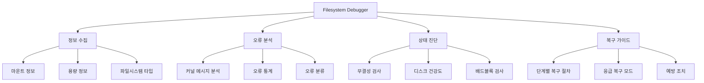

---
tags:
  - C-programming
  - Linux
  - debugging
  - deep-study
  - filesystem
  - hands-on
  - intermediate
  - storage
  - 시스템프로그래밍
difficulty: INTERMEDIATE
learning_time: "6-8시간"
main_topic: "시스템 프로그래밍"
priority_score: 0
---

# 06B. 종합 파일시스템 진단 도구 구현

## 실전에서 사용할 수 있는 C 언어 진단 도구

이 섹션에서는 파일시스템 장애 상황에서 체계적인 진단을 수행할 수 있는 종합적인 C 언어 도구를 구현합니다. 이 도구는 실제 운영 환경에서 파일시스템 문제를 신속하게 진단하고 해결 방향을 제시하는 데 최적화되어 있습니다.

## 종합 진단 도구의 핵심 기능



## 전체 진단 도구 구현

```c
// filesystem_debugger.c
#define _GNU_SOURCE
#include <stdio.h>
#include <stdlib.h>
#include <string.h>
#include <unistd.h>
#include <fcntl.h>
#include <sys/stat.h>
#include <sys/statvfs.h>
#include <sys/mount.h>
#include <errno.h>
#include <time.h>
#include <dirent.h>
#include <mntent.h>
#include <ext2fs/ext2fs.h>

typedef struct {
    char device[256];
    char mount_point[256];
    char fs_type[64];
    char mount_options[512];
    int is_read_only;
    int has_errors;
    unsigned long long total_size;
    unsigned long long free_size;
    unsigned long long available_size;
} filesystem_info_t;

typedef struct {
    int error_count;
    time_t last_error_time;
    char last_error_msg[1024];
    int fs_errors;
    int io_errors;
    int mount_errors;
} error_summary_t;

// 마운트된 파일시스템 정보 수집
int get_mounted_filesystems(filesystem_info_t* filesystems, int max_count) {
    FILE* mtab = setmntent("/proc/mounts", "r");
    if (!mtab) {
        perror("setmntent");
        return -1;
    }

    struct mntent* entry;
    int count = 0;

    while ((entry = getmntent(mtab)) && count < max_count) {
        // 실제 디스크 기반 파일시스템만 포함
        if (strncmp(entry->mnt_fsname, "/dev/", 5) == 0 ||
            strcmp(entry->mnt_type, "ext2") == 0 ||
            strcmp(entry->mnt_type, "ext3") == 0 ||
            strcmp(entry->mnt_type, "ext4") == 0 ||
            strcmp(entry->mnt_type, "xfs") == 0 ||
            strcmp(entry->mnt_type, "btrfs") == 0) {

            strncpy(filesystems[count].device, entry->mnt_fsname, sizeof(filesystems[count].device) - 1);
            strncpy(filesystems[count].mount_point, entry->mnt_dir, sizeof(filesystems[count].mount_point) - 1);
            strncpy(filesystems[count].fs_type, entry->mnt_type, sizeof(filesystems[count].fs_type) - 1);
            strncpy(filesystems[count].mount_options, entry->mnt_opts, sizeof(filesystems[count].mount_options) - 1);

            // 읽기 전용 여부 확인
            filesystems[count].is_read_only = strstr(entry->mnt_opts, "ro") != NULL;

            // 파일시스템 용량 정보
            struct statvfs vfs;
            if (statvfs(entry->mnt_dir, &vfs) == 0) {
                filesystems[count].total_size = vfs.f_blocks * vfs.f_frsize;
                filesystems[count].free_size = vfs.f_bfree * vfs.f_frsize;
                filesystems[count].available_size = vfs.f_bavail * vfs.f_frsize;
            }

            count++;
        }
    }

    endmntent(mtab);
    return count;
}

// 커널 메시지에서 파일시스템 오류 분석
void analyze_kernel_messages(error_summary_t* summary) {
    FILE* dmesg = popen("dmesg -T | grep -E '(EXT[234]|XFS|Btrfs|I/O error|remount.*read-only)'", "r");
    if (!dmesg) {
        perror("dmesg");
        return;
    }

    char line[1024];
    summary->error_count = 0;
    summary->fs_errors = 0;
    summary->io_errors = 0;
    summary->mount_errors = 0;

    printf("=== 파일시스템 관련 커널 메시지 ===\n");

    while (fgets(line, sizeof(line), dmesg)) {
        printf("%s", line);
        summary->error_count++;

        // 최근 오류 메시지 저장
        strncpy(summary->last_error_msg, line, sizeof(summary->last_error_msg) - 1);
        summary->last_error_time = time(NULL);

        // 오류 타입 분류
        if (strstr(line, "EXT") || strstr(line, "XFS") || strstr(line, "Btrfs")) {
            summary->fs_errors++;
        }
        if (strstr(line, "I/O error")) {
            summary->io_errors++;
        }
        if (strstr(line, "remount") && strstr(line, "read-only")) {
            summary->mount_errors++;
        }
    }

    pclose(dmesg);

    if (summary->error_count == 0) {
        printf("파일시스템 관련 오류 메시지가 없습니다.\n");
    } else {
        printf("\n=== 오류 요약 ===\n");
        printf("총 오류 메시지: %d개\n", summary->error_count);
        printf("파일시스템 오류: %d개\n", summary->fs_errors);
        printf("I/O 오류: %d개\n", summary->io_errors);
        printf("마운트 오류: %d개\n", summary->mount_errors);
    }
}

// ext 파일시스템 상세 분석
void analyze_ext_filesystem(const char* device) {
    printf("\n=== EXT 파일시스템 상세 분석: %s ===\n", device);

    // dumpe2fs를 사용한 상세 정보
    char cmd[512];
    snprintf(cmd, sizeof(cmd), "dumpe2fs -h %s 2>/dev/null", device);

    FILE* dumpe2fs = popen(cmd, "r");
    if (!dumpe2fs) {
        printf("dumpe2fs 실행 실패\n");
        return;
    }

    char line[1024];
    int error_count = 0;
    time_t last_check = 0;
    int mount_count = 0;
    int max_mount_count = 0;

    while (fgets(line, sizeof(line), dumpe2fs)) {
        if (strstr(line, "Filesystem state:")) {
            printf("파일시스템 상태: %s", strchr(line, ':') + 2);
        } else if (strstr(line, "Errors behavior:")) {
            printf("오류 동작: %s", strchr(line, ':') + 2);
        } else if (strstr(line, "Filesystem errors:")) {
            sscanf(line, "Filesystem errors: %d", &error_count);
            printf("파일시스템 오류 횟수: %d\n", error_count);
        } else if (strstr(line, "Last checked:")) {
            printf("마지막 검사: %s", strchr(line, ':') + 2);
        } else if (strstr(line, "Mount count:")) {
            sscanf(line, "Mount count: %d", &mount_count);
        } else if (strstr(line, "Maximum mount count:")) {
            sscanf(line, "Maximum mount count: %d", &max_mount_count);
        }
    }

    pclose(dumpe2fs);

    if (max_mount_count > 0) {
        printf("마운트 횟수: %d/%d\n", mount_count, max_mount_count);
        if (mount_count >= max_mount_count * 0.9) {
            printf("⚠️  곧 강제 fsck가 실행될 예정입니다.\n");
        }
    }

    if (error_count > 0) {
        printf("🔴 파일시스템에 %d개의 오류가 기록되어 있습니다.\n", error_count);
    }
}

// XFS 파일시스템 분석
void analyze_xfs_filesystem(const char* device, const char* mount_point) {
    printf("\n=== XFS 파일시스템 분석: %s ===\n", device);

    // xfs_info 실행
    char cmd[512];
    snprintf(cmd, sizeof(cmd), "xfs_info %s 2>/dev/null", mount_point);

    FILE* xfs_info = popen(cmd, "r");
    if (xfs_info) {
        char line[1024];
        while (fgets(line, sizeof(line), xfs_info)) {
            if (strstr(line, "meta-data=") ||
                strstr(line, "data=") ||
                strstr(line, "naming=") ||
                strstr(line, "log=")) {
                printf("%s", line);
            }
        }
        pclose(xfs_info);
    }

    // xfs_db를 사용한 상태 확인
    snprintf(cmd, sizeof(cmd), "xfs_db -c 'sb 0' -c 'print' %s 2>/dev/null | grep -E '(state|errors)'", device);
    system(cmd);
}

// 파일시스템 무결성 검사
int check_filesystem_integrity(const char* device, const char* fs_type, int read_only) {
    printf("\n=== 파일시스템 무결성 검사: %s (%s) ===\n", device, fs_type);

    if (!read_only) {
        printf("⚠️  파일시스템이 마운트되어 있습니다. 읽기 전용 검사만 수행합니다.\n");
    }

    char cmd[512];
    int result = 0;

    if (strncmp(fs_type, "ext", 3) == 0) {
        if (read_only) {
            snprintf(cmd, sizeof(cmd), "e2fsck -n %s", device);
        } else {
            snprintf(cmd, sizeof(cmd), "e2fsck -f -n %s", device);
        }

        printf("실행 중: %s\n", cmd);
        result = system(cmd);

        if (result == 0) {
            printf("✅ 파일시스템이 정상입니다.\n");
        } else {
            printf("🔴 파일시스템에 오류가 있습니다. (종료 코드: %d)\n", WEXITSTATUS(result));
            printf("복구를 위해 다음 명령어를 실행하세요 (언마운트 후):\n");
            printf("  e2fsck -f -y %s\n", device);
        }

    } else if (strcmp(fs_type, "xfs") == 0) {
        if (read_only) {
            snprintf(cmd, sizeof(cmd), "xfs_repair -n %s", device);
        } else {
            printf("XFS는 마운트된 상태에서 검사할 수 없습니다.\n");
            printf("언마운트 후 다음 명령어를 실행하세요:\n");
            printf("  xfs_repair -n %s  # 검사만\n", device);
            printf("  xfs_repair %s     # 복구\n", device);
            return -1;
        }

        printf("실행 중: %s\n", cmd);
        result = system(cmd);

    } else if (strcmp(fs_type, "btrfs") == 0) {
        snprintf(cmd, sizeof(cmd), "btrfs check --readonly %s", device);
        printf("실행 중: %s\n", cmd);
        result = system(cmd);
    }

    return result;
}

// 디스크 건강 상태 확인
void check_disk_health(const char* device) {
    printf("\n=== 디스크 건강 상태 확인 ===\n");

    // SMART 정보 확인
    char cmd[512];
    snprintf(cmd, sizeof(cmd), "smartctl -H %s 2>/dev/null", device);

    FILE* smart = popen(cmd, "r");
    if (smart) {
        char line[1024];
        while (fgets(line, sizeof(line), smart)) {
            if (strstr(line, "SMART overall-health")) {
                printf("SMART 상태: %s", line);
                break;
            }
        }
        pclose(smart);
    } else {
        printf("SMART 정보를 확인할 수 없습니다.\n");
    }

    // 상세 SMART 속성
    snprintf(cmd, sizeof(cmd), "smartctl -A %s 2>/dev/null | grep -E '(Reallocated_Sector_Ct|Current_Pending_Sector|Offline_Uncorrectable|UDMA_CRC_Error_Count)'", device);

    printf("\n주요 SMART 속성:\n");
    system(cmd);

    // I/O 오류 통계
    printf("\n디스크 I/O 오류:\n");
    snprintf(cmd, sizeof(cmd), "cat /proc/diskstats | grep %s", strrchr(device, '/') + 1);
    system(cmd);
}

// 배드블록 검사
void scan_bad_blocks(const char* device, int destructive) {
    printf("\n=== 배드블록 검사: %s ===\n", device);

    if (destructive) {
        printf("⚠️  파괴적 테스트는 데이터를 손실시킬 수 있습니다!\n");
        printf("계속하려면 'YES'를 입력하세요: ");

        char response[10];
        if (fgets(response, sizeof(response), stdin) == NULL || strcmp(response, "YES\n") != 0) {
            printf("테스트가 취소되었습니다.\n");
            return;
        }
    }

    char cmd[512];
    if (destructive) {
        snprintf(cmd, sizeof(cmd), "badblocks -wsv %s", device);
    } else {
        snprintf(cmd, sizeof(cmd), "badblocks -nsv %s", device);
    }

    printf("실행 중: %s\n", cmd);
    printf("이 작업은 시간이 오래 걸릴 수 있습니다...\n");

    int result = system(cmd);
    if (result == 0) {
        printf("✅ 배드블록이 발견되지 않았습니다.\n");
    } else {
        printf("🔴 배드블록이 발견되었습니다!\n");
    }
}

// 파일시스템 복구 가이드
void show_recovery_guide(const char* device, const char* fs_type, int error_level) {
    printf("\n=== 복구 가이드: %s (%s) ===\n", device, fs_type);

    if (error_level == 0) {
        printf("✅ 파일시스템이 정상 상태입니다.\n");
        return;
    }

    printf("복구 단계별 가이드:\n\n");

    printf("1️⃣ 데이터 백업 (가능한 경우)\n");
    printf("   # 중요 데이터를 먼저 백업하세요\n");
    printf("   cp -a /mount/point/important_data /backup/location/\n\n");

    printf("2️⃣ 파일시스템 언마운트\n");
    printf("   umount %s\n", device);
    printf("   # 언마운트가 안 되면: fuser -km /mount/point\n\n");

    printf("3️⃣ 파일시스템 검사 및 복구\n");

    if (strncmp(fs_type, "ext", 3) == 0) {
        printf("   # 검사만 (안전)\n");
        printf("   e2fsck -n %s\n\n", device);
        printf("   # 자동 복구 (주의: 데이터 손실 가능)\n");
        printf("   e2fsck -f -y %s\n\n", device);
        printf("   # 대화형 복구 (권장)\n");
        printf("   e2fsck -f %s\n\n", device);

        if (error_level > 2) {
            printf("   # 심각한 손상의 경우\n");
            printf("   e2fsck -f -y -c %s  # 배드블록 검사 포함\n", device);
            printf("   mke2fs -S %s        # 슈퍼블록만 복구 (최후의 수단)\n\n", device);
        }

    } else if (strcmp(fs_type, "xfs") == 0) {
        printf("   # 검사만\n");
        printf("   xfs_repair -n %s\n\n", device);
        printf("   # 복구\n");
        printf("   xfs_repair %s\n\n", device);

        if (error_level > 2) {
            printf("   # 강제 복구 (위험)\n");
            printf("   xfs_repair -L %s  # 로그 초기화\n\n", device);
        }

    } else if (strcmp(fs_type, "btrfs") == 0) {
        printf("   # 검사\n");
        printf("   btrfs check %s\n\n", device);
        printf("   # 복구\n");
        printf("   btrfs check --repair %s\n\n", device);
        printf("   # 강제 복구\n");
        printf("   btrfs rescue super-recover %s\n\n", device);
    }

    printf("4️⃣ 복구 후 재마운트\n");
    printf("   mount %s /mount/point\n\n", device);

    printf("5️⃣ 데이터 무결성 확인\n");
    printf("   # 중요 파일들이 정상인지 확인\n");
    printf("   # 로그 파일에서 추가 오류 확인\n\n");

    printf("6️⃣ 예방 조치\n");
    printf("   # 정기적인 파일시스템 검사 설정\n");
    printf("   # 하드웨어 모니터링 강화\n");
    printf("   # 백업 정책 재검토\n");
}

// 응급 복구 모드
void emergency_recovery_mode(const char* device) {
    printf("\n=== 🚨 응급 복구 모드 ===\n");
    printf("파일시스템에 심각한 손상이 있습니다.\n\n");

    printf("즉시 수행해야 할 작업:\n");
    printf("1. 추가 손상 방지를 위해 시스템 사용 중단\n");
    printf("2. 가능한 데이터 즉시 백업\n");
    printf("3. 하드웨어 상태 확인\n\n");

    printf("데이터 복구 시도:\n");
    printf("# 읽기 전용으로 마운트하여 데이터 구조\n");
    printf("mkdir -p /mnt/recovery\n");
    printf("mount -o ro %s /mnt/recovery\n\n", device);

    printf("# 가능한 파일들 복사\n");
    printf("find /mnt/recovery -type f -exec cp {} /backup/ \\; 2>/dev/null\n\n");

    printf("# ddrescue를 사용한 이미지 생성 (가능한 경우)\n");
    printf("ddrescue %s /backup/disk_image.img /backup/recovery.log\n\n", device);

    printf("⚠️  전문가의 도움이 필요할 수 있습니다.\n");
}

int main(int argc, char* argv[]) {
    if (argc < 2) {
        printf("사용법: %s <command> [options]\n", argv[0]);
        printf("Commands:\n");
        printf("  scan                    - 모든 파일시스템 스캔\n");
        printf("  analyze <device>        - 특정 디바이스 분석\n");
        printf("  check <device> <fstype> - 파일시스템 검사\n");
        printf("  health <device>         - 디스크 건강도 확인\n");
        printf("  badblocks <device>      - 배드블록 검사\n");
        printf("  recovery <device> <fstype> - 복구 가이드\n");
        printf("  emergency <device>      - 응급 복구 모드\n");
        return 1;
    }

    const char* command = argv[1];

    if (strcmp(command, "scan") == 0) {
        printf("=== 파일시스템 종합 분석 ===\n");

        filesystem_info_t filesystems[32];
        int count = get_mounted_filesystems(filesystems, 32);

        if (count <= 0) {
            printf("마운트된 파일시스템을 찾을 수 없습니다.\n");
            return 1;
        }

        printf("\n=== 마운트된 파일시스템 ===\n");
        printf("%-15s %-20s %-8s %-8s %-10s %-10s\n",
               "디바이스", "마운트포인트", "타입", "상태", "사용량", "여유공간");
        printf("%-15s %-20s %-8s %-8s %-10s %-10s\n",
               "-------", "----------", "----", "----", "------", "--------");

        for (int i = 0; i < count; i++) {
            double usage_gb = (filesystems[i].total_size - filesystems[i].available_size) / (1024.0 * 1024.0 * 1024.0);
            double free_gb = filesystems[i].available_size / (1024.0 * 1024.0 * 1024.0);

            printf("%-15s %-20s %-8s %-8s %-10.1fG %-10.1fG\n",
                   filesystems[i].device,
                   filesystems[i].mount_point,
                   filesystems[i].fs_type,
                   filesystems[i].is_read_only ? "RO" : "RW",
                   usage_gb, free_gb);
        }

        // 커널 메시지 분석
        error_summary_t summary;
        analyze_kernel_messages(&summary);

        // 각 파일시스템별 상세 분석
        for (int i = 0; i < count; i++) {
            if (strncmp(filesystems[i].fs_type, "ext", 3) == 0) {
                analyze_ext_filesystem(filesystems[i].device);
            } else if (strcmp(filesystems[i].fs_type, "xfs") == 0) {
                analyze_xfs_filesystem(filesystems[i].device, filesystems[i].mount_point);
            }
        }

    } else if (strcmp(command, "analyze") == 0 && argc >= 3) {
        const char* device = argv[2];

        // 디바이스 정보 확인
        struct stat st;
        if (stat(device, &st) != 0) {
            perror("디바이스 확인 실패");
            return 1;
        }

        check_disk_health(device);

        // 파일시스템 타입 감지
        char cmd[512];
        snprintf(cmd, sizeof(cmd), "blkid -o value -s TYPE %s", device);
        FILE* blkid = popen(cmd, "r");
        if (blkid) {
            char fs_type[64];
            if (fgets(fs_type, sizeof(fs_type), blkid)) {
                fs_type[strcspn(fs_type, "\n")] = 0;  // 개행 제거

                if (strncmp(fs_type, "ext", 3) == 0) {
                    analyze_ext_filesystem(device);
                }
            }
            pclose(blkid);
        }

    } else if (strcmp(command, "check") == 0 && argc >= 4) {
        const char* device = argv[2];
        const char* fs_type = argv[3];

        check_filesystem_integrity(device, fs_type, 1);

    } else if (strcmp(command, "health") == 0 && argc >= 3) {
        const char* device = argv[2];
        check_disk_health(device);

    } else if (strcmp(command, "badblocks") == 0 && argc >= 3) {
        const char* device = argv[2];
        int destructive = (argc >= 4 && strcmp(argv[3], "--destructive") == 0);
        scan_bad_blocks(device, destructive);

    } else if (strcmp(command, "recovery") == 0 && argc >= 4) {
        const char* device = argv[2];
        const char* fs_type = argv[3];
        int error_level = (argc >= 5) ? atoi(argv[4]) : 1;

        show_recovery_guide(device, fs_type, error_level);

    } else if (strcmp(command, "emergency") == 0 && argc >= 3) {
        const char* device = argv[2];
        emergency_recovery_mode(device);

    } else {
        printf("알 수 없는 명령어입니다.\n");
        return 1;
    }

    return 0;
}
```

## 컴파일 및 사용법

### 컴파일 방법

```bash
# 필요한 개발 패키지 설치 (Ubuntu/Debian)
sudo apt-get install build-essential e2fslibs-dev

# 컴파일
gcc -o filesystem_debugger filesystem_debugger.c -le2p

# 실행 권한 부여
chmod +x filesystem_debugger
```

### 기본 사용 예시

```bash
# 모든 파일시스템 종합 스캔
./filesystem_debugger scan

# 특정 디바이스 분석
./filesystem_debugger analyze /dev/sda1

# 파일시스템 무결성 검사
./filesystem_debugger check /dev/sda1 ext4

# 디스크 건강도 확인
./filesystem_debugger health /dev/sda

# 배드블록 검사 (비파괴적)
./filesystem_debugger badblocks /dev/sda1

# 복구 가이드 출력
./filesystem_debugger recovery /dev/sda1 ext4 2

# 응급 복구 모드
./filesystem_debugger emergency /dev/sda1
```

## 출력 결과 해석

### 정상 상태 예시

```text
=== 파일시스템 종합 분석 ===

=== 마운트된 파일시스템 ===
디바이스          마운트포인트           타입     상태     사용량     여유공간
-------         ----------          ----     ----     ------     --------
/dev/sda1       /                   ext4     RW       45.2G      12.8G

=== 파일시스템 관련 커널 메시지 ===
파일시스템 관련 오류 메시지가 없습니다.

=== EXT 파일시스템 상세 분석: /dev/sda1 ===
파일시스템 상태: clean
오류 동작: Continue
파일시스템 오류 횟수: 0
마지막 검사: Wed Oct 25 10:30:45 2023
마운트 횟수: 15/30
```

### 문제 상황 예시

```text
=== 파일시스템 관련 커널 메시지 ===
[Wed Oct 25 14:23:45 2023] EXT4-fs error (device sda1): ext4_journal_check_start:83: Detected aborted journal
[Wed Oct 25 14:23:45 2023] EXT4-fs (sda1): Remounting filesystem read-only

=== 오류 요약 ===
총 오류 메시지: 2개
파일시스템 오류: 2개
I/O 오류: 0개
마운트 오류: 1개

🔴 파일시스템에 1개의 오류가 기록되어 있습니다.
```

## 핵심 요점

### 1. 종합적인 정보 수집

이 도구는 마운트 정보, 용량 상태, 커널 메시지, SMART 정보를 모두 수집하여 전체적인 상황을 파악할 수 있게 해줍니다.

### 2. 파일시스템별 전문화된 분석

EXT, XFS, Btrfs 각각의 특성에 맞는 분석 방법을 제공하여 정확한 진단이 가능합니다.

### 3. 단계별 복구 가이드

문제 상황에 따라 적절한 복구 절차를 안내하여 데이터 손실을 최소화합니다.

---

**이전**: [파일시스템 진단 방법론](./06-44-filesystem-diagnostic-flow.md)  
**다음**: [자동 복구 시스템 구축](./06c-filesystem-auto-recovery.md)에서 무인 운영을 위한 자동 복구 시스템을 구축합니다.

## 📚 관련 문서

### 📖 현재 문서 정보

- **난이도**: INTERMEDIATE
- **주제**: 시스템 프로그래밍
- **예상 시간**: 6-8시간

### 🎯 학습 경로

- [📚 INTERMEDIATE 레벨 전체 보기](../learning-paths/intermediate/)
- [🏠 메인 학습 경로](../learning-paths/)
- [📋 전체 가이드 목록](../README.md)

### 📂 같은 챕터 (chapter-06-file-io)

- [Chapter 6-1: 파일 디스크립터의 내부 구조](./06-10-file-descriptor.md)
- [Chapter 6-1A: 파일 디스크립터 기본 개념과 3단계 구조](./06-01-fd-basics-structure.md)
- [Chapter 6-1B: 파일 디스크립터 할당과 공유 메커니즘](./06-11-fd-allocation-management.md)
- [Chapter 6-1C: 파일 연산과 VFS 다형성](./06-12-file-operations-vfs.md)
- [Chapter 6-2: VFS와 파일 시스템 추상화 개요](./06-13-vfs-filesystem.md)

### 🏷️ 관련 키워드

`filesystem`, `debugging`, `C-programming`, `Linux`, `storage`

### ⏭️ 다음 단계 가이드

- 실무 적용을 염두에 두고 프로젝트에 적용해보세요
- 관련 도구들을 직접 사용해보는 것이 중요합니다
