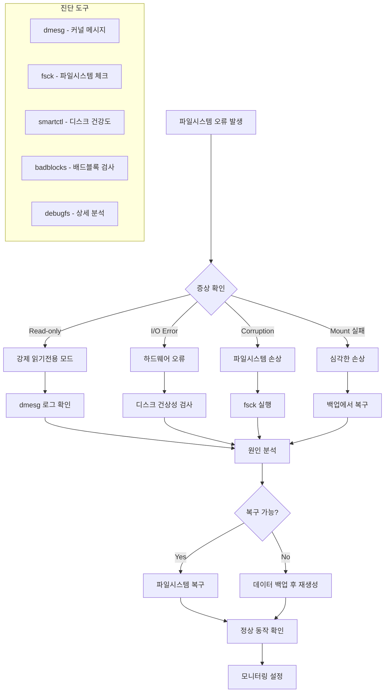

---
tags:
  - Filesystem
  - Debugging
  - Linux
  - Storage
  - Troubleshooting
---

# 파일시스템 디버깅: "파일시스템이 read-only로 변했어요"

## 상황: 갑작스러운 파일시스템 오류

"안녕하세요, 운영 중인 서버에서 갑자기 파일 쓰기가 안 되고 있어요. dmesg를 보니 파일시스템이 read-only로 remount 되었다는 메시지가 있습니다. 디스크 오류인지 파일시스템 손상인지 어떻게 확인하고 복구할 수 있을까요?"

이런 상황은 하드웨어 문제, 파일시스템 손상, 또는 커널 버그로 인해 발생할 수 있습니다. 체계적인 진단과 복구 방법을 알아보겠습니다.

## 파일시스템 오류 진단 흐름



## 1. 파일시스템 진단 도구

종합적인 파일시스템 문제 진단 도구입니다.

```c
// filesystem_debugger.c
#define _GNU_SOURCE
#include <stdio.h>
#include <stdlib.h>
#include <string.h>
#include <unistd.h>
#include <fcntl.h>
#include <sys/stat.h>
#include <sys/statvfs.h>
#include <sys/mount.h>
#include <errno.h>
#include <time.h>
#include <dirent.h>
#include <mntent.h>
#include <ext2fs/ext2fs.h>

typedef struct {
    char device[256];
    char mount_point[256];
    char fs_type[64];
    char mount_options[512];
    int is_read_only;
    int has_errors;
    unsigned long long total_size;
    unsigned long long free_size;
    unsigned long long available_size;
} filesystem_info_t;

typedef struct {
    int error_count;
    time_t last_error_time;
    char last_error_msg[1024];
    int fs_errors;
    int io_errors;
    int mount_errors;
} error_summary_t;

// 마운트된 파일시스템 정보 수집
int get_mounted_filesystems(filesystem_info_t* filesystems, int max_count) {
    FILE* mtab = setmntent("/proc/mounts", "r");
    if (!mtab) {
        perror("setmntent");
        return -1;
    }
    
    struct mntent* entry;
    int count = 0;
    
    while ((entry = getmntent(mtab)) && count < max_count) {
        // 실제 디스크 기반 파일시스템만 포함
        if (strncmp(entry->mnt_fsname, "/dev/", 5) == 0 || 
            strcmp(entry->mnt_type, "ext2") == 0 ||
            strcmp(entry->mnt_type, "ext3") == 0 ||
            strcmp(entry->mnt_type, "ext4") == 0 ||
            strcmp(entry->mnt_type, "xfs") == 0 ||
            strcmp(entry->mnt_type, "btrfs") == 0) {
            
            strncpy(filesystems[count].device, entry->mnt_fsname, sizeof(filesystems[count].device) - 1);
            strncpy(filesystems[count].mount_point, entry->mnt_dir, sizeof(filesystems[count].mount_point) - 1);
            strncpy(filesystems[count].fs_type, entry->mnt_type, sizeof(filesystems[count].fs_type) - 1);
            strncpy(filesystems[count].mount_options, entry->mnt_opts, sizeof(filesystems[count].mount_options) - 1);
            
            // 읽기 전용 여부 확인
            filesystems[count].is_read_only = strstr(entry->mnt_opts, "ro") != NULL;
            
            // 파일시스템 용량 정보
            struct statvfs vfs;
            if (statvfs(entry->mnt_dir, &vfs) == 0) {
                filesystems[count].total_size = vfs.f_blocks * vfs.f_frsize;
                filesystems[count].free_size = vfs.f_bfree * vfs.f_frsize;
                filesystems[count].available_size = vfs.f_bavail * vfs.f_frsize;
            }
            
            count++;
        }
    }
    
    endmntent(mtab);
    return count;
}

// 커널 메시지에서 파일시스템 오류 분석
void analyze_kernel_messages(error_summary_t* summary) {
    FILE* dmesg = popen("dmesg -T | grep -E '(EXT[234]|XFS|Btrfs|I/O error|remount.*read-only)'", "r");
    if (!dmesg) {
        perror("dmesg");
        return;
    }
    
    char line[1024];
    summary->error_count = 0;
    summary->fs_errors = 0;
    summary->io_errors = 0;
    summary->mount_errors = 0;
    
    printf("=== 파일시스템 관련 커널 메시지 ===\n");
    
    while (fgets(line, sizeof(line), dmesg)) {
        printf("%s", line);
        summary->error_count++;
        
        // 최근 오류 메시지 저장
        strncpy(summary->last_error_msg, line, sizeof(summary->last_error_msg) - 1);
        summary->last_error_time = time(NULL);
        
        // 오류 타입 분류
        if (strstr(line, "EXT") || strstr(line, "XFS") || strstr(line, "Btrfs")) {
            summary->fs_errors++;
        }
        if (strstr(line, "I/O error")) {
            summary->io_errors++;
        }
        if (strstr(line, "remount") && strstr(line, "read-only")) {
            summary->mount_errors++;
        }
    }
    
    pclose(dmesg);
    
    if (summary->error_count == 0) {
        printf("파일시스템 관련 오류 메시지가 없습니다.\n");
    } else {
        printf("\n=== 오류 요약 ===\n");
        printf("총 오류 메시지: %d개\n", summary->error_count);
        printf("파일시스템 오류: %d개\n", summary->fs_errors);
        printf("I/O 오류: %d개\n", summary->io_errors);
        printf("마운트 오류: %d개\n", summary->mount_errors);
    }
}

// ext 파일시스템 상세 분석
void analyze_ext_filesystem(const char* device) {
    printf("\n=== EXT 파일시스템 상세 분석: %s ===\n", device);
    
    // dumpe2fs를 사용한 상세 정보
    char cmd[512];
    snprintf(cmd, sizeof(cmd), "dumpe2fs -h %s 2>/dev/null", device);
    
    FILE* dumpe2fs = popen(cmd, "r");
    if (!dumpe2fs) {
        printf("dumpe2fs 실행 실패\n");
        return;
    }
    
    char line[1024];
    int error_count = 0;
    time_t last_check = 0;
    int mount_count = 0;
    int max_mount_count = 0;
    
    while (fgets(line, sizeof(line), dumpe2fs)) {
        if (strstr(line, "Filesystem state:")) {
            printf("파일시스템 상태: %s", strchr(line, ':') + 2);
        } else if (strstr(line, "Errors behavior:")) {
            printf("오류 동작: %s", strchr(line, ':') + 2);
        } else if (strstr(line, "Filesystem errors:")) {
            sscanf(line, "Filesystem errors: %d", &error_count);
            printf("파일시스템 오류 횟수: %d\n", error_count);
        } else if (strstr(line, "Last checked:")) {
            printf("마지막 검사: %s", strchr(line, ':') + 2);
        } else if (strstr(line, "Mount count:")) {
            sscanf(line, "Mount count: %d", &mount_count);
        } else if (strstr(line, "Maximum mount count:")) {
            sscanf(line, "Maximum mount count: %d", &max_mount_count);
        }
    }
    
    pclose(dumpe2fs);
    
    if (max_mount_count > 0) {
        printf("마운트 횟수: %d/%d\n", mount_count, max_mount_count);
        if (mount_count >= max_mount_count * 0.9) {
            printf("⚠️  곧 강제 fsck가 실행될 예정입니다.\n");
        }
    }
    
    if (error_count > 0) {
        printf("🔴 파일시스템에 %d개의 오류가 기록되어 있습니다.\n", error_count);
    }
}

// XFS 파일시스템 분석
void analyze_xfs_filesystem(const char* device, const char* mount_point) {
    printf("\n=== XFS 파일시스템 분석: %s ===\n", device);
    
    // xfs_info 실행
    char cmd[512];
    snprintf(cmd, sizeof(cmd), "xfs_info %s 2>/dev/null", mount_point);
    
    FILE* xfs_info = popen(cmd, "r");
    if (xfs_info) {
        char line[1024];
        while (fgets(line, sizeof(line), xfs_info)) {
            if (strstr(line, "meta-data=") || 
                strstr(line, "data=") ||
                strstr(line, "naming=") ||
                strstr(line, "log=")) {
                printf("%s", line);
            }
        }
        pclose(xfs_info);
    }
    
    // xfs_db를 사용한 상태 확인
    snprintf(cmd, sizeof(cmd), "xfs_db -c 'sb 0' -c 'print' %s 2>/dev/null | grep -E '(state|errors)'", device);
    system(cmd);
}

// 파일시스템 무결성 검사
int check_filesystem_integrity(const char* device, const char* fs_type, int read_only) {
    printf("\n=== 파일시스템 무결성 검사: %s (%s) ===\n", device, fs_type);
    
    if (!read_only) {
        printf("⚠️  파일시스템이 마운트되어 있습니다. 읽기 전용 검사만 수행합니다.\n");
    }
    
    char cmd[512];
    int result = 0;
    
    if (strncmp(fs_type, "ext", 3) == 0) {
        if (read_only) {
            snprintf(cmd, sizeof(cmd), "e2fsck -n %s", device);
        } else {
            snprintf(cmd, sizeof(cmd), "e2fsck -f -n %s", device);
        }
        
        printf("실행 중: %s\n", cmd);
        result = system(cmd);
        
        if (result == 0) {
            printf("✅ 파일시스템이 정상입니다.\n");
        } else {
            printf("🔴 파일시스템에 오류가 있습니다. (종료 코드: %d)\n", WEXITSTATUS(result));
            printf("복구를 위해 다음 명령어를 실행하세요 (언마운트 후):\n");
            printf("  e2fsck -f -y %s\n", device);
        }
        
    } else if (strcmp(fs_type, "xfs") == 0) {
        if (read_only) {
            snprintf(cmd, sizeof(cmd), "xfs_repair -n %s", device);
        } else {
            printf("XFS는 마운트된 상태에서 검사할 수 없습니다.\n");
            printf("언마운트 후 다음 명령어를 실행하세요:\n");
            printf("  xfs_repair -n %s  # 검사만\n", device);
            printf("  xfs_repair %s     # 복구\n", device);
            return -1;
        }
        
        printf("실행 중: %s\n", cmd);
        result = system(cmd);
        
    } else if (strcmp(fs_type, "btrfs") == 0) {
        snprintf(cmd, sizeof(cmd), "btrfs check --readonly %s", device);
        printf("실행 중: %s\n", cmd);
        result = system(cmd);
    }
    
    return result;
}

// 디스크 건강 상태 확인
void check_disk_health(const char* device) {
    printf("\n=== 디스크 건강 상태 확인 ===\n");
    
    // SMART 정보 확인
    char cmd[512];
    snprintf(cmd, sizeof(cmd), "smartctl -H %s 2>/dev/null", device);
    
    FILE* smart = popen(cmd, "r");
    if (smart) {
        char line[1024];
        while (fgets(line, sizeof(line), smart)) {
            if (strstr(line, "SMART overall-health")) {
                printf("SMART 상태: %s", line);
                break;
            }
        }
        pclose(smart);
    } else {
        printf("SMART 정보를 확인할 수 없습니다.\n");
    }
    
    // 상세 SMART 속성
    snprintf(cmd, sizeof(cmd), "smartctl -A %s 2>/dev/null | grep -E '(Reallocated_Sector_Ct|Current_Pending_Sector|Offline_Uncorrectable|UDMA_CRC_Error_Count)'", device);
    
    printf("\n주요 SMART 속성:\n");
    system(cmd);
    
    // I/O 오류 통계
    printf("\n디스크 I/O 오류:\n");
    snprintf(cmd, sizeof(cmd), "cat /proc/diskstats | grep %s", strrchr(device, '/') + 1);
    system(cmd);
}

// 배드블록 검사
void scan_bad_blocks(const char* device, int destructive) {
    printf("\n=== 배드블록 검사: %s ===\n", device);
    
    if (destructive) {
        printf("⚠️  파괴적 테스트는 데이터를 손실시킬 수 있습니다!\n");
        printf("계속하려면 'YES'를 입력하세요: ");
        
        char response[10];
        if (fgets(response, sizeof(response), stdin) == NULL || strcmp(response, "YES\n") != 0) {
            printf("테스트가 취소되었습니다.\n");
            return;
        }
    }
    
    char cmd[512];
    if (destructive) {
        snprintf(cmd, sizeof(cmd), "badblocks -wsv %s", device);
    } else {
        snprintf(cmd, sizeof(cmd), "badblocks -nsv %s", device);
    }
    
    printf("실행 중: %s\n", cmd);
    printf("이 작업은 시간이 오래 걸릴 수 있습니다...\n");
    
    int result = system(cmd);
    if (result == 0) {
        printf("✅ 배드블록이 발견되지 않았습니다.\n");
    } else {
        printf("🔴 배드블록이 발견되었습니다!\n");
    }
}

// 파일시스템 복구 가이드
void show_recovery_guide(const char* device, const char* fs_type, int error_level) {
    printf("\n=== 복구 가이드: %s (%s) ===\n", device, fs_type);
    
    if (error_level == 0) {
        printf("✅ 파일시스템이 정상 상태입니다.\n");
        return;
    }
    
    printf("복구 단계별 가이드:\n\n");
    
    printf("1️⃣ 데이터 백업 (가능한 경우)\n");
    printf("   # 중요 데이터를 먼저 백업하세요\n");
    printf("   cp -a /mount/point/important_data /backup/location/\n\n");
    
    printf("2️⃣ 파일시스템 언마운트\n");
    printf("   umount %s\n", device);
    printf("   # 언마운트가 안 되면: fuser -km /mount/point\n\n");
    
    printf("3️⃣ 파일시스템 검사 및 복구\n");
    
    if (strncmp(fs_type, "ext", 3) == 0) {
        printf("   # 검사만 (안전)\n");
        printf("   e2fsck -n %s\n\n", device);
        printf("   # 자동 복구 (주의: 데이터 손실 가능)\n");
        printf("   e2fsck -f -y %s\n\n", device);
        printf("   # 대화형 복구 (권장)\n");
        printf("   e2fsck -f %s\n\n", device);
        
        if (error_level > 2) {
            printf("   # 심각한 손상의 경우\n");
            printf("   e2fsck -f -y -c %s  # 배드블록 검사 포함\n", device);
            printf("   mke2fs -S %s        # 슈퍼블록만 복구 (최후의 수단)\n\n", device);
        }
        
    } else if (strcmp(fs_type, "xfs") == 0) {
        printf("   # 검사만\n");
        printf("   xfs_repair -n %s\n\n", device);
        printf("   # 복구\n");
        printf("   xfs_repair %s\n\n", device);
        
        if (error_level > 2) {
            printf("   # 강제 복구 (위험)\n");
            printf("   xfs_repair -L %s  # 로그 초기화\n\n", device);
        }
        
    } else if (strcmp(fs_type, "btrfs") == 0) {
        printf("   # 검사\n");
        printf("   btrfs check %s\n\n", device);
        printf("   # 복구\n");
        printf("   btrfs check --repair %s\n\n", device);
        printf("   # 강제 복구\n");
        printf("   btrfs rescue super-recover %s\n\n", device);
    }
    
    printf("4️⃣ 복구 후 재마운트\n");
    printf("   mount %s /mount/point\n\n", device);
    
    printf("5️⃣ 데이터 무결성 확인\n");
    printf("   # 중요 파일들이 정상인지 확인\n");
    printf("   # 로그 파일에서 추가 오류 확인\n\n");
    
    printf("6️⃣ 예방 조치\n");
    printf("   # 정기적인 파일시스템 검사 설정\n");
    printf("   # 하드웨어 모니터링 강화\n");
    printf("   # 백업 정책 재검토\n");
}

// 응급 복구 모드
void emergency_recovery_mode(const char* device) {
    printf("\n=== 🚨 응급 복구 모드 ===\n");
    printf("파일시스템에 심각한 손상이 있습니다.\n\n");
    
    printf("즉시 수행해야 할 작업:\n");
    printf("1. 추가 손상 방지를 위해 시스템 사용 중단\n");
    printf("2. 가능한 데이터 즉시 백업\n");
    printf("3. 하드웨어 상태 확인\n\n");
    
    printf("데이터 복구 시도:\n");
    printf("# 읽기 전용으로 마운트하여 데이터 구조\n");
    printf("mkdir -p /mnt/recovery\n");
    printf("mount -o ro %s /mnt/recovery\n\n", device);
    
    printf("# 가능한 파일들 복사\n");
    printf("find /mnt/recovery -type f -exec cp {} /backup/ \\; 2>/dev/null\n\n");
    
    printf("# ddrescue를 사용한 이미지 생성 (가능한 경우)\n");
    printf("ddrescue %s /backup/disk_image.img /backup/recovery.log\n\n", device);
    
    printf("⚠️  전문가의 도움이 필요할 수 있습니다.\n");
}

int main(int argc, char* argv[]) {
    if (argc < 2) {
        printf("사용법: %s <command> [options]\n", argv[0]);
        printf("Commands:\n");
        printf("  scan                    - 모든 파일시스템 스캔\n");
        printf("  analyze <device>        - 특정 디바이스 분석\n");
        printf("  check <device> <fstype> - 파일시스템 검사\n");
        printf("  health <device>         - 디스크 건강도 확인\n");
        printf("  badblocks <device>      - 배드블록 검사\n");
        printf("  recovery <device> <fstype> - 복구 가이드\n");
        printf("  emergency <device>      - 응급 복구 모드\n");
        return 1;
    }
    
    const char* command = argv[1];
    
    if (strcmp(command, "scan") == 0) {
        printf("=== 파일시스템 종합 분석 ===\n");
        
        filesystem_info_t filesystems[32];
        int count = get_mounted_filesystems(filesystems, 32);
        
        if (count <= 0) {
            printf("마운트된 파일시스템을 찾을 수 없습니다.\n");
            return 1;
        }
        
        printf("\n=== 마운트된 파일시스템 ===\n");
        printf("%-15s %-20s %-8s %-8s %-10s %-10s\n", 
               "디바이스", "마운트포인트", "타입", "상태", "사용량", "여유공간");
        printf("%-15s %-20s %-8s %-8s %-10s %-10s\n", 
               "-------", "----------", "----", "----", "------", "--------");
        
        for (int i = 0; i < count; i++) {
            double usage_gb = (filesystems[i].total_size - filesystems[i].available_size) / (1024.0 * 1024.0 * 1024.0);
            double free_gb = filesystems[i].available_size / (1024.0 * 1024.0 * 1024.0);
            
            printf("%-15s %-20s %-8s %-8s %-10.1fG %-10.1fG\n",
                   filesystems[i].device,
                   filesystems[i].mount_point,
                   filesystems[i].fs_type,
                   filesystems[i].is_read_only ? "RO" : "RW",
                   usage_gb, free_gb);
        }
        
        // 커널 메시지 분석
        error_summary_t summary;
        analyze_kernel_messages(&summary);
        
        // 각 파일시스템별 상세 분석
        for (int i = 0; i < count; i++) {
            if (strncmp(filesystems[i].fs_type, "ext", 3) == 0) {
                analyze_ext_filesystem(filesystems[i].device);
            } else if (strcmp(filesystems[i].fs_type, "xfs") == 0) {
                analyze_xfs_filesystem(filesystems[i].device, filesystems[i].mount_point);
            }
        }
        
    } else if (strcmp(command, "analyze") == 0 && argc >= 3) {
        const char* device = argv[2];
        
        // 디바이스 정보 확인
        struct stat st;
        if (stat(device, &st) != 0) {
            perror("디바이스 확인 실패");
            return 1;
        }
        
        check_disk_health(device);
        
        // 파일시스템 타입 감지
        char cmd[512];
        snprintf(cmd, sizeof(cmd), "blkid -o value -s TYPE %s", device);
        FILE* blkid = popen(cmd, "r");
        if (blkid) {
            char fs_type[64];
            if (fgets(fs_type, sizeof(fs_type), blkid)) {
                fs_type[strcspn(fs_type, "\n")] = 0;  // 개행 제거
                
                if (strncmp(fs_type, "ext", 3) == 0) {
                    analyze_ext_filesystem(device);
                }
            }
            pclose(blkid);
        }
        
    } else if (strcmp(command, "check") == 0 && argc >= 4) {
        const char* device = argv[2];
        const char* fs_type = argv[3];
        
        check_filesystem_integrity(device, fs_type, 1);
        
    } else if (strcmp(command, "health") == 0 && argc >= 3) {
        const char* device = argv[2];
        check_disk_health(device);
        
    } else if (strcmp(command, "badblocks") == 0 && argc >= 3) {
        const char* device = argv[2];
        int destructive = (argc >= 4 && strcmp(argv[3], "--destructive") == 0);
        scan_bad_blocks(device, destructive);
        
    } else if (strcmp(command, "recovery") == 0 && argc >= 4) {
        const char* device = argv[2];
        const char* fs_type = argv[3];
        int error_level = (argc >= 5) ? atoi(argv[4]) : 1;
        
        show_recovery_guide(device, fs_type, error_level);
        
    } else if (strcmp(command, "emergency") == 0 && argc >= 3) {
        const char* device = argv[2];
        emergency_recovery_mode(device);
        
    } else {
        printf("알 수 없는 명령어입니다.\n");
        return 1;
    }
    
    return 0;
}
```

## 2. 자동 파일시스템 복구 스크립트

파일시스템 오류를 자동으로 감지하고 복구하는 스크립트입니다.

```bash
#!/bin/bash
# auto_filesystem_recovery.sh

set -euo pipefail

# 설정
LOG_FILE="/var/log/fs_recovery.log"
BACKUP_DIR="/var/backups/fs_recovery"
NOTIFICATION_EMAIL=""
TELEGRAM_BOT_TOKEN=""
TELEGRAM_CHAT_ID=""

# 색상 정의
RED='\033[0;31m'
GREEN='\033[0;32m'
YELLOW='\033[1;33m'
BLUE='\033[0;34m'
NC='\033[0m'

# 로깅 함수
log_message() {
    local level=$1
    local message=$2
    local timestamp=$(date '+%Y-%m-%d %H:%M:%S')
    
    echo -e "[$timestamp] [$level] $message" | tee -a "$LOG_FILE"
    
    case $level in
        "ERROR")
            echo -e "${RED}[$level]${NC} $message" >&2
            ;;
        "WARN")
            echo -e "${YELLOW}[$level]${NC} $message"
            ;;
        "INFO")
            echo -e "${GREEN}[$level]${NC} $message"
            ;;
        "DEBUG")
            echo -e "${BLUE}[$level]${NC} $message"
            ;;
    esac
}

# 알림 전송
send_notification() {
    local subject=$1
    local message=$2
    
    # 이메일 알림
    if [[ -n "$NOTIFICATION_EMAIL" ]] && command -v mail >/dev/null 2>&1; then
        echo "$message" | mail -s "$subject" "$NOTIFICATION_EMAIL"
        log_message "INFO" "이메일 알림 전송: $NOTIFICATION_EMAIL"
    fi
    
    # 텔레그램 알림
    if [[ -n "$TELEGRAM_BOT_TOKEN" && -n "$TELEGRAM_CHAT_ID" ]]; then
        local telegram_message="🚨 $subject\n\n$message"
        curl -s -X POST "https://api.telegram.org/bot$TELEGRAM_BOT_TOKEN/sendMessage" \
             -d chat_id="$TELEGRAM_CHAT_ID" \
             -d text="$telegram_message" \
             -d parse_mode="HTML" >/dev/null || true
        log_message "INFO" "텔레그램 알림 전송"
    fi
}

# 파일시스템 상태 확인
check_filesystem_status() {
    local device=$1
    local mount_point=$2
    local fs_type=$3
    
    log_message "INFO" "파일시스템 상태 확인: $device ($fs_type)"
    
    local status="OK"
    local issues=()
    
    # 마운트 상태 확인
    if ! mountpoint -q "$mount_point"; then
        status="ERROR"
        issues+=("파일시스템이 마운트되지 않음")
    fi
    
    # 읽기 전용 상태 확인
    if mount | grep "$device" | grep -q "ro,"; then
        status="ERROR"
        issues+=("읽기 전용 모드로 마운트됨")
    fi
    
    # 쓰기 테스트
    local test_file="$mount_point/.fs_health_test_$$"
    if ! echo "test" > "$test_file" 2>/dev/null; then
        status="ERROR"
        issues+=("쓰기 테스트 실패")
    else
        rm -f "$test_file" 2>/dev/null || true
    fi
    
    # 디스크 공간 확인
    local usage=$(df "$mount_point" | awk 'NR==2 {print $(NF-1)}' | sed 's/%//')
    if [[ "$usage" -gt 95 ]]; then
        status="WARN"
        issues+=("디스크 사용률 높음: ${usage}%")
    fi
    
    # I/O 오류 확인
    if dmesg -T | tail -100 | grep -q "$device.*error"; then
        status="ERROR"
        issues+=("최근 I/O 오류 감지")
    fi
    
    echo "$status:${issues[*]}"
}

# ext 파일시스템 복구
repair_ext_filesystem() {
    local device=$1
    local mount_point=$2
    
    log_message "INFO" "EXT 파일시스템 복구 시작: $device"
    
    # 1단계: 언마운트
    log_message "INFO" "파일시스템 언마운트 중..."
    if ! umount "$mount_point" 2>/dev/null; then
        log_message "WARN" "일반 언마운트 실패, 강제 언마운트 시도"
        
        # 사용 중인 프로세스 종료
        fuser -km "$mount_point" 2>/dev/null || true
        sleep 2
        
        if ! umount "$mount_point" 2>/dev/null; then
            log_message "ERROR" "언마운트 실패"
            return 1
        fi
    fi
    
    # 2단계: 읽기 전용 검사
    log_message "INFO" "파일시스템 검사 중 (읽기 전용)..."
    local fsck_output=$(e2fsck -n "$device" 2>&1)
    local fsck_result=$?
    
    log_message "DEBUG" "fsck 출력: $fsck_output"
    
    if [[ $fsck_result -eq 0 ]]; then
        log_message "INFO" "파일시스템이 정상입니다"
    else
        log_message "WARN" "파일시스템 오류 감지, 복구 필요"
        
        # 3단계: 백업 생성 (가능한 경우)
        if [[ -d "$BACKUP_DIR" ]]; then
            local backup_file="$BACKUP_DIR/$(basename $device)_$(date +%Y%m%d_%H%M%S).img"
            log_message "INFO" "파일시스템 이미지 백업 생성: $backup_file"
            
            if dd if="$device" of="$backup_file" bs=1M count=100 2>/dev/null; then
                log_message "INFO" "백업 완료 (처음 100MB)"
            else
                log_message "WARN" "백업 실패"
            fi
        fi
        
        # 4단계: 자동 복구
        log_message "INFO" "자동 복구 실행 중..."
        if e2fsck -f -y "$device" 2>&1 | tee -a "$LOG_FILE"; then
            log_message "INFO" "파일시스템 복구 완료"
        else
            log_message "ERROR" "파일시스템 복구 실패"
            return 1
        fi
    fi
    
    # 5단계: 재마운트
    log_message "INFO" "파일시스템 재마운트 중..."
    if mount "$device" "$mount_point"; then
        log_message "INFO" "재마운트 완료"
        return 0
    else
        log_message "ERROR" "재마운트 실패"
        return 1
    fi
}

# XFS 파일시스템 복구
repair_xfs_filesystem() {
    local device=$1
    local mount_point=$2
    
    log_message "INFO" "XFS 파일시스템 복구 시작: $device"
    
    # 언마운트
    if ! umount "$mount_point" 2>/dev/null; then
        fuser -km "$mount_point" 2>/dev/null || true
        sleep 2
        umount "$mount_point" || {
            log_message "ERROR" "XFS 언마운트 실패"
            return 1
        }
    fi
    
    # XFS 검사
    log_message "INFO" "XFS 파일시스템 검사 중..."
    if xfs_repair -n "$device" 2>&1 | tee -a "$LOG_FILE"; then
        log_message "INFO" "XFS 파일시스템이 정상입니다"
    else
        log_message "WARN" "XFS 파일시스템 오류 감지, 복구 시도"
        
        if xfs_repair "$device" 2>&1 | tee -a "$LOG_FILE"; then
            log_message "INFO" "XFS 복구 완료"
        else
            log_message "ERROR" "XFS 복구 실패"
            return 1
        fi
    fi
    
    # 재마운트
    if mount "$device" "$mount_point"; then
        log_message "INFO" "XFS 재마운트 완료"
        return 0
    else
        log_message "ERROR" "XFS 재마운트 실패"
        return 1
    fi
}

# 디스크 건강도 확인
check_disk_health() {
    local device=$1
    
    log_message "INFO" "디스크 건강도 확인: $device"
    
    if ! command -v smartctl >/dev/null 2>&1; then
        log_message "WARN" "smartctl이 설치되지 않음"
        return 0
    fi
    
    local smart_output=$(smartctl -H "$device" 2>/dev/null)
    if echo "$smart_output" | grep -q "PASSED"; then
        log_message "INFO" "SMART 상태: 정상"
    else
        log_message "ERROR" "SMART 상태: 이상"
        
        # 상세 SMART 정보 수집
        smartctl -A "$device" | grep -E "(Reallocated|Current_Pending|Offline_Uncorrectable)" | \
        while read -r line; do
            log_message "WARN" "SMART: $line"
        done
        
        return 1
    fi
    
    return 0
}

# 메인 복구 함수
perform_recovery() {
    local device=$1
    local mount_point=$2
    local fs_type=$3
    
    log_message "INFO" "복구 프로세스 시작: $device -> $mount_point ($fs_type)"
    
    # 디스크 건강도 확인
    if ! check_disk_health "$device"; then
        send_notification "디스크 건강도 경고" "디스크 $device에 하드웨어 문제가 감지되었습니다."
    fi
    
    # 파일시스템별 복구
    case "$fs_type" in
        ext2|ext3|ext4)
            if repair_ext_filesystem "$device" "$mount_point"; then
                log_message "INFO" "EXT 파일시스템 복구 성공"
                send_notification "파일시스템 복구 완료" "$device ($fs_type) 복구가 완료되었습니다."
            else
                log_message "ERROR" "EXT 파일시스템 복구 실패"
                send_notification "파일시스템 복구 실패" "$device ($fs_type) 복구에 실패했습니다. 수동 개입이 필요합니다."
                return 1
            fi
            ;;
        xfs)
            if repair_xfs_filesystem "$device" "$mount_point"; then
                log_message "INFO" "XFS 파일시스템 복구 성공"
                send_notification "파일시스템 복구 완료" "$device (XFS) 복구가 완료되었습니다."
            else
                log_message "ERROR" "XFS 파일시스템 복구 실패"
                send_notification "파일시스템 복구 실패" "$device (XFS) 복구에 실패했습니다."
                return 1
            fi
            ;;
        *)
            log_message "WARN" "지원하지 않는 파일시스템: $fs_type"
            return 1
            ;;
    esac
    
    return 0
}

# 모니터링 모드
monitoring_mode() {
    local interval=${1:-300}  # 5분 간격
    
    log_message "INFO" "파일시스템 모니터링 시작 (간격: ${interval}초)"
    
    while true; do
        # 마운트된 파일시스템 목록 확인
        while read -r line; do
            if [[ "$line" =~ ^/dev/ ]]; then
                local device=$(echo "$line" | awk '{print $1}')
                local mount_point=$(echo "$line" | awk '{print $2}')
                local fs_type=$(echo "$line" | awk '{print $3}')
                
                # 시스템 파일시스템만 확인
                if [[ "$mount_point" =~ ^/(|boot|home|var|opt|usr)$ ]]; then
                    local status_info=$(check_filesystem_status "$device" "$mount_point" "$fs_type")
                    local status=$(echo "$status_info" | cut -d: -f1)
                    local issues=$(echo "$status_info" | cut -d: -f2-)
                    
                    if [[ "$status" == "ERROR" ]]; then
                        log_message "ERROR" "파일시스템 오류 감지: $device ($issues)"
                        
                        # 자동 복구 시도
                        if perform_recovery "$device" "$mount_point" "$fs_type"; then
                            log_message "INFO" "자동 복구 완료: $device"
                        else
                            log_message "ERROR" "자동 복구 실패: $device"
                        fi
                        
                    elif [[ "$status" == "WARN" ]]; then
                        log_message "WARN" "파일시스템 경고: $device ($issues)"
                    fi
                fi
            fi
        done < <(mount | grep -E "ext[234]|xfs|btrfs")
        
        sleep "$interval"
    done
}

# 복구 스크립트 생성
generate_recovery_script() {
    local device=$1
    local fs_type=$2
    local script_file="/tmp/recovery_${device##*/}_$(date +%Y%m%d_%H%M%S).sh"
    
    cat > "$script_file" << EOF
#!/bin/bash
# 자동 생성된 파일시스템 복구 스크립트
# 디바이스: $device
# 파일시스템: $fs_type
# 생성일시: $(date)

set -e

echo "파일시스템 복구 스크립트 실행: $device ($fs_type)"

# 백업 디렉토리 생성
mkdir -p /var/backups/emergency_recovery

# 현재 상태 로깅
echo "=== 복구 시작 시간: \$(date) ===" >> /var/log/recovery.log
dmesg | tail -50 >> /var/log/recovery.log

EOF

    case "$fs_type" in
        ext*)
            cat >> "$script_file" << EOF
# EXT 파일시스템 복구
echo "EXT 파일시스템 복구 중..."

# 언마운트
umount $device 2>/dev/null || {
    echo "강제 언마운트 중..."
    fuser -km \$(findmnt -n -o TARGET $device) 2>/dev/null || true
    sleep 2
    umount $device
}

# 파일시스템 검사 및 복구
echo "파일시스템 검사 중..."
e2fsck -f -y $device

# 재마운트
echo "재마운트 중..."
mount $device

echo "복구 완료!"
EOF
            ;;
        xfs)
            cat >> "$script_file" << EOF
# XFS 파일시스템 복구
echo "XFS 파일시스템 복구 중..."

# 언마운트
umount $device 2>/dev/null || {
    echo "강제 언마운트 중..."
    fuser -km \$(findmnt -n -o TARGET $device) 2>/dev/null || true
    sleep 2
    umount $device
}

# XFS 복구
echo "XFS 검사 및 복구 중..."
xfs_repair $device

# 재마운트
echo "재마운트 중..."
mount $device

echo "복구 완료!"
EOF
            ;;
    esac
    
    cat >> "$script_file" << EOF

# 복구 후 상태 확인
echo "=== 복구 완료 시간: \$(date) ===" >> /var/log/recovery.log
df -h | grep $device >> /var/log/recovery.log

echo "복구 스크립트 실행 완료"
EOF
    
    chmod +x "$script_file"
    echo "$script_file"
}

# 사용법
usage() {
    echo "자동 파일시스템 복구 도구"
    echo ""
    echo "사용법:"
    echo "  $0 check <device> <mount_point> <fs_type>    # 상태 확인"
    echo "  $0 recover <device> <mount_point> <fs_type>  # 복구 실행"
    echo "  $0 monitor [interval]                        # 모니터링 모드"
    echo "  $0 script <device> <fs_type>                 # 복구 스크립트 생성"
    echo ""
    echo "예시:"
    echo "  $0 check /dev/sda1 / ext4"
    echo "  $0 recover /dev/sda1 / ext4"
    echo "  $0 monitor 60"
    echo "  $0 script /dev/sda1 ext4"
}

# 메인 함수
main() {
    # 로그 디렉토리 생성
    mkdir -p "$(dirname "$LOG_FILE")"
    mkdir -p "$BACKUP_DIR"
    
    local command=${1:-"help"}
    
    case "$command" in
        "check")
            if [[ $# -lt 4 ]]; then
                echo "사용법: $0 check <device> <mount_point> <fs_type>"
                exit 1
            fi
            
            local result=$(check_filesystem_status "$2" "$3" "$4")
            echo "결과: $result"
            ;;
            
        "recover")
            if [[ $# -lt 4 ]]; then
                echo "사용법: $0 recover <device> <mount_point> <fs_type>"
                exit 1
            fi
            
            perform_recovery "$2" "$3" "$4"
            ;;
            
        "monitor")
            local interval=${2:-300}
            monitoring_mode "$interval"
            ;;
            
        "script")
            if [[ $# -lt 3 ]]; then
                echo "사용법: $0 script <device> <fs_type>"
                exit 1
            fi
            
            local script_file=$(generate_recovery_script "$2" "$3")
            echo "복구 스크립트 생성: $script_file"
            ;;
            
        "help"|*)
            usage
            ;;
    esac
}

# 스크립트 실행
main "$@"
```

계속해서 다음 문서를 작성하겠습니다.
