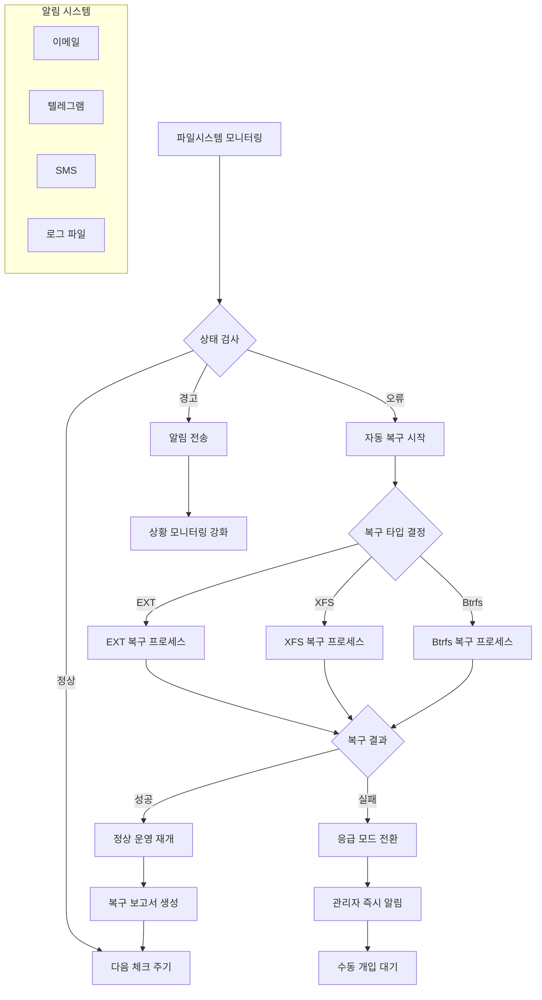

---
tags:
  - automation
  - bash-scripting
  - filesystem-recovery
  - hands-on
  - intermediate
  - medium-read
  - monitoring
  - systemd
  - 인프라스트럭처
difficulty: INTERMEDIATE
learning_time: "4-6시간"
main_topic: "인프라스트럭처"
priority_score: 4
---

# 06C. 자동 파일시스템 복구 시스템 구축

## 무인 운영을 위한 지능형 복구 시스템

대규모 시스템 운영에서 파일시스템 장애는 언제든지 발생할 수 있으며, 24시간 모니터링이 불가능한 환경에서는 자동화된 복구 시스템이 필수적입니다. 이 섹션에서는 파일시스템 오류를 자동으로 감지하고 복구하는 포괄적인 Bash 스크립트를 구현합니다.

## 자동 복구 시스템 아키텍처



## 전체 자동 복구 스크립트

```bash
#!/bin/bash
# auto_filesystem_recovery.sh

set -euo pipefail

# 설정
LOG_FILE="/var/log/fs_recovery.log"
BACKUP_DIR="/var/backups/fs_recovery"
NOTIFICATION_EMAIL=""
TELEGRAM_BOT_TOKEN=""
TELEGRAM_CHAT_ID=""

# 색상 정의
RED='\033[0;31m'
GREEN='\033[0;32m'
YELLOW='\033[1;33m'
BLUE='\033[0;34m'
NC='\033[0m'

# 로깅 함수
log_message() {
    local level=$1
    local message=$2
    local timestamp=$(date '+%Y-%m-%d %H:%M:%S')

    echo -e "[$timestamp] [$level] $message" | tee -a "$LOG_FILE"

    case $level in
        "ERROR")
            echo -e "${RED}[$level]${NC} $message" >&2
            ;;
        "WARN")
            echo -e "${YELLOW}[$level]${NC} $message"
            ;;
        "INFO")
            echo -e "${GREEN}[$level]${NC} $message"
            ;;
        "DEBUG")
            echo -e "${BLUE}[$level]${NC} $message"
            ;;
    esac
}

# 알림 전송
send_notification() {
    local subject=$1
    local message=$2

    # 이메일 알림
    if [[ -n "$NOTIFICATION_EMAIL" ]] && command -v mail >/dev/null 2>&1; then
        echo "$message" | mail -s "$subject" "$NOTIFICATION_EMAIL"
        log_message "INFO" "이메일 알림 전송: $NOTIFICATION_EMAIL"
    fi

    # 텔레그램 알림
    if [[ -n "$TELEGRAM_BOT_TOKEN" && -n "$TELEGRAM_CHAT_ID" ]]; then
        local telegram_message="🚨 $subject\n\n$message"
        curl -s -X POST "https://api.telegram.org/bot$TELEGRAM_BOT_TOKEN/sendMessage" \
             -d chat_id="$TELEGRAM_CHAT_ID" \
             -d text="$telegram_message" \
             -d parse_mode="HTML" >/dev/null || true
        log_message "INFO" "텔레그램 알림 전송"
    fi
}

# 파일시스템 상태 확인
check_filesystem_status() {
    local device=$1
    local mount_point=$2
    local fs_type=$3

    log_message "INFO" "파일시스템 상태 확인: $device ($fs_type)"

    local status="OK"
    local issues=()

    # 마운트 상태 확인
    if ! mountpoint -q "$mount_point"; then
        status="ERROR"
        issues+=("파일시스템이 마운트되지 않음")
    fi

    # 읽기 전용 상태 확인
    if mount | grep "$device" | grep -q "ro,"; then
        status="ERROR"
        issues+=("읽기 전용 모드로 마운트됨")
    fi

    # 쓰기 테스트
    local test_file="$mount_point/.fs_health_test_$$"
    if ! echo "test" > "$test_file" 2>/dev/null; then
        status="ERROR"
        issues+=("쓰기 테스트 실패")
    else
        rm -f "$test_file" 2>/dev/null || true
    fi

    # 디스크 공간 확인
    local usage=$(df "$mount_point" | awk 'NR==2 {print $(NF-1)}' | sed 's/%//')
    if [[ "$usage" -gt 95 ]]; then
        status="WARN"
        issues+=("디스크 사용률 높음: ${usage}%")
    fi

    # I/O 오류 확인
    if dmesg -T | tail -100 | grep -q "$device.*error"; then
        status="ERROR"
        issues+=("최근 I/O 오류 감지")
    fi

    echo "$status:${issues[*]}"
}

# ext 파일시스템 복구
repair_ext_filesystem() {
    local device=$1
    local mount_point=$2

    log_message "INFO" "EXT 파일시스템 복구 시작: $device"

    # 1단계: 언마운트
    log_message "INFO" "파일시스템 언마운트 중..."
    if ! umount "$mount_point" 2>/dev/null; then
        log_message "WARN" "일반 언마운트 실패, 강제 언마운트 시도"

        # 사용 중인 프로세스 종료
        fuser -km "$mount_point" 2>/dev/null || true
        sleep 2

        if ! umount "$mount_point" 2>/dev/null; then
            log_message "ERROR" "언마운트 실패"
            return 1
        fi
    fi

    # 2단계: 읽기 전용 검사
    log_message "INFO" "파일시스템 검사 중 (읽기 전용)..."
    local fsck_output=$(e2fsck -n "$device" 2>&1)
    local fsck_result=$?

    log_message "DEBUG" "fsck 출력: $fsck_output"

    if [[ $fsck_result -eq 0 ]]; then
        log_message "INFO" "파일시스템이 정상입니다"
    else
        log_message "WARN" "파일시스템 오류 감지, 복구 필요"

        # 3단계: 백업 생성 (가능한 경우)
        if [[ -d "$BACKUP_DIR" ]]; then
            local backup_file="$BACKUP_DIR/$(basename $device)_$(date +%Y%m%d_%H%M%S).img"
            log_message "INFO" "파일시스템 이미지 백업 생성: $backup_file"

            if dd if="$device" of="$backup_file" bs=1M count=100 2>/dev/null; then
                log_message "INFO" "백업 완료 (처음 100MB)"
            else
                log_message "WARN" "백업 실패"
            fi
        fi

        # 4단계: 자동 복구
        log_message "INFO" "자동 복구 실행 중..."
        if e2fsck -f -y "$device" 2>&1 | tee -a "$LOG_FILE"; then
            log_message "INFO" "파일시스템 복구 완료"
        else
            log_message "ERROR" "파일시스템 복구 실패"
            return 1
        fi
    fi

    # 5단계: 재마운트
    log_message "INFO" "파일시스템 재마운트 중..."
    if mount "$device" "$mount_point"; then
        log_message "INFO" "재마운트 완료"
        return 0
    else
        log_message "ERROR" "재마운트 실패"
        return 1
    fi
}

# XFS 파일시스템 복구
repair_xfs_filesystem() {
    local device=$1
    local mount_point=$2

    log_message "INFO" "XFS 파일시스템 복구 시작: $device"

    # 언마운트
    if ! umount "$mount_point" 2>/dev/null; then
        fuser -km "$mount_point" 2>/dev/null || true
        sleep 2
        umount "$mount_point" || {
            log_message "ERROR" "XFS 언마운트 실패"
            return 1
        }
    fi

    # XFS 검사
    log_message "INFO" "XFS 파일시스템 검사 중..."
    if xfs_repair -n "$device" 2>&1 | tee -a "$LOG_FILE"; then
        log_message "INFO" "XFS 파일시스템이 정상입니다"
    else
        log_message "WARN" "XFS 파일시스템 오류 감지, 복구 시도"

        if xfs_repair "$device" 2>&1 | tee -a "$LOG_FILE"; then
            log_message "INFO" "XFS 복구 완료"
        else
            log_message "ERROR" "XFS 복구 실패"
            return 1
        fi
    fi

    # 재마운트
    if mount "$device" "$mount_point"; then
        log_message "INFO" "XFS 재마운트 완료"
        return 0
    else
        log_message "ERROR" "XFS 재마운트 실패"
        return 1
    fi
}

# 디스크 건강도 확인
check_disk_health() {
    local device=$1

    log_message "INFO" "디스크 건강도 확인: $device"

    if ! command -v smartctl >/dev/null 2>&1; then
        log_message "WARN" "smartctl이 설치되지 않음"
        return 0
    fi

    local smart_output=$(smartctl -H "$device" 2>/dev/null)
    if echo "$smart_output" | grep -q "PASSED"; then
        log_message "INFO" "SMART 상태: 정상"
    else
        log_message "ERROR" "SMART 상태: 이상"

        # 상세 SMART 정보 수집
        smartctl -A "$device" | grep -E "(Reallocated|Current_Pending|Offline_Uncorrectable)" | \
        while read -r line; do
            log_message "WARN" "SMART: $line"
        done

        return 1
    fi

    return 0
}

# 메인 복구 함수
perform_recovery() {
    local device=$1
    local mount_point=$2
    local fs_type=$3

    log_message "INFO" "복구 프로세스 시작: $device -> $mount_point ($fs_type)"

    # 디스크 건강도 확인
    if ! check_disk_health "$device"; then
        send_notification "디스크 건강도 경고" "디스크 $device에 하드웨어 문제가 감지되었습니다."
    fi

    # 파일시스템별 복구
    case "$fs_type" in
        ext2|ext3|ext4)
            if repair_ext_filesystem "$device" "$mount_point"; then
                log_message "INFO" "EXT 파일시스템 복구 성공"
                send_notification "파일시스템 복구 완료" "$device ($fs_type) 복구가 완료되었습니다."
            else
                log_message "ERROR" "EXT 파일시스템 복구 실패"
                send_notification "파일시스템 복구 실패" "$device ($fs_type) 복구에 실패했습니다. 수동 개입이 필요합니다."
                return 1
            fi
            ;;
        xfs)
            if repair_xfs_filesystem "$device" "$mount_point"; then
                log_message "INFO" "XFS 파일시스템 복구 성공"
                send_notification "파일시스템 복구 완료" "$device (XFS) 복구가 완료되었습니다."
            else
                log_message "ERROR" "XFS 파일시스템 복구 실패"
                send_notification "파일시스템 복구 실패" "$device (XFS) 복구에 실패했습니다."
                return 1
            fi
            ;;
        *)
            log_message "WARN" "지원하지 않는 파일시스템: $fs_type"
            return 1
            ;;
    esac

    return 0
}

# 모니터링 모드
monitoring_mode() {
    local interval=${1:-300}  # 5분 간격

    log_message "INFO" "파일시스템 모니터링 시작 (간격: ${interval}초)"

    while true; do
        # 마운트된 파일시스템 목록 확인
        while read -r line; do
            if [[ "$line" =~ ^/dev/ ]]; then
                local device=$(echo "$line" | awk '{print $1}')
                local mount_point=$(echo "$line" | awk '{print $2}')
                local fs_type=$(echo "$line" | awk '{print $3}')

                # 시스템 파일시스템만 확인
                if [[ "$mount_point" =~ ^/(|boot|home|var|opt|usr)$ ]]; then
                    local status_info=$(check_filesystem_status "$device" "$mount_point" "$fs_type")
                    local status=$(echo "$status_info" | cut -d: -f1)
                    local issues=$(echo "$status_info" | cut -d: -f2-)

                    if [[ "$status" == "ERROR" ]]; then
                        log_message "ERROR" "파일시스템 오류 감지: $device ($issues)"

                        # 자동 복구 시도
                        if perform_recovery "$device" "$mount_point" "$fs_type"; then
                            log_message "INFO" "자동 복구 완료: $device"
                        else
                            log_message "ERROR" "자동 복구 실패: $device"
                        fi

                    elif [[ "$status" == "WARN" ]]; then
                        log_message "WARN" "파일시스템 경고: $device ($issues)"
                    fi
                fi
            fi
        done < <(mount | grep -E "ext[234]|xfs|btrfs")

        sleep "$interval"
    done
}

# 복구 스크립트 생성
generate_recovery_script() {
    local device=$1
    local fs_type=$2
    local script_file="/tmp/recovery_${device##*/}_$(date +%Y%m%d_%H%M%S).sh"

    cat > "$script_file" << EOF
#!/bin/bash
# 자동 생성된 파일시스템 복구 스크립트
# 디바이스: $device
# 파일시스템: $fs_type
# 생성일시: $(date)

set -e

echo "파일시스템 복구 스크립트 실행: $device ($fs_type)"

# 백업 디렉토리 생성
mkdir -p /var/backups/emergency_recovery

# 현재 상태 로깅
echo "=== 복구 시작 시간: \$(date) ===" >> /var/log/recovery.log
dmesg | tail -50 >> /var/log/recovery.log

EOF

    case "$fs_type" in
        ext*)
            cat >> "$script_file" << EOF
# EXT 파일시스템 복구
echo "EXT 파일시스템 복구 중..."

# 언마운트
umount $device 2>/dev/null || {
    echo "강제 언마운트 중..."
    fuser -km \$(findmnt -n -o TARGET $device) 2>/dev/null || true
    sleep 2
    umount $device
}

# 파일시스템 검사 및 복구
echo "파일시스템 검사 중..."
e2fsck -f -y $device

# 재마운트
echo "재마운트 중..."
mount $device

echo "복구 완료!"
EOF
            ;;
        xfs)
            cat >> "$script_file" << EOF
# XFS 파일시스템 복구
echo "XFS 파일시스템 복구 중..."

# 언마운트
umount $device 2>/dev/null || {
    echo "강제 언마운트 중..."
    fuser -km \$(findmnt -n -o TARGET $device) 2>/dev/null || true
    sleep 2
    umount $device
}

# XFS 복구
echo "XFS 검사 및 복구 중..."
xfs_repair $device

# 재마운트
echo "재마운트 중..."
mount $device

echo "복구 완료!"
EOF
            ;;
    esac

    cat >> "$script_file" << EOF

# 복구 후 상태 확인
echo "=== 복구 완료 시간: \$(date) ===" >> /var/log/recovery.log
df -h | grep $device >> /var/log/recovery.log

echo "복구 스크립트 실행 완료"
EOF

    chmod +x "$script_file"
    echo "$script_file"
}

# 사용법
usage() {
    echo "자동 파일시스템 복구 도구"
    echo ""
    echo "사용법:"
    echo "  $0 check <device> <mount_point> <fs_type>    # 상태 확인"
    echo "  $0 recover <device> <mount_point> <fs_type>  # 복구 실행"
    echo "  $0 monitor [interval]                        # 모니터링 모드"
    echo "  $0 script <device> <fs_type>                 # 복구 스크립트 생성"
    echo ""
    echo "예시:"
    echo "  $0 check /dev/sda1 / ext4"
    echo "  $0 recover /dev/sda1 / ext4"
    echo "  $0 monitor 60"
    echo "  $0 script /dev/sda1 ext4"
}

# 메인 함수
main() {
    # 로그 디렉토리 생성
    mkdir -p "$(dirname "$LOG_FILE")"
    mkdir -p "$BACKUP_DIR"

    local command=${1:-"help"}

    case "$command" in
        "check")
            if [[ $# -lt 4 ]]; then
                echo "사용법: $0 check <device> <mount_point> <fs_type>"
                exit 1
            fi

            local result=$(check_filesystem_status "$2" "$3" "$4")
            echo "결과: $result"
            ;;

        "recover")
            if [[ $# -lt 4 ]]; then
                echo "사용법: $0 recover <device> <mount_point> <fs_type>"
                exit 1
            fi

            perform_recovery "$2" "$3" "$4"
            ;;

        "monitor")
            local interval=${2:-300}
            monitoring_mode "$interval"
            ;;

        "script")
            if [[ $# -lt 3 ]]; then
                echo "사용법: $0 script <device> <fs_type>"
                exit 1
            fi

            local script_file=$(generate_recovery_script "$2" "$3")
            echo "복구 스크립트 생성: $script_file"
            ;;

        "help"|*)
            usage
            ;;
    esac
}

# 스크립트 실행
main "$@"
```

## 시스템 통합 및 자동화 설정

### 1. systemd 서비스 등록

```bash
# systemd 서비스 파일 생성
sudo tee /etc/systemd/system/filesystem-monitor.service << EOF
[Unit]
Description=Filesystem Health Monitoring Service
After=multi-user.target
Requires=multi-user.target

[Service]
Type=simple
ExecStart=/usr/local/bin/auto_filesystem_recovery.sh monitor 300
Restart=always
RestartSec=30
User=root
StandardOutput=journal
StandardError=journal

[Install]
WantedBy=multi-user.target
EOF

# 서비스 활성화 및 시작
sudo systemctl daemon-reload
sudo systemctl enable filesystem-monitor.service
sudo systemctl start filesystem-monitor.service
```

### 2. 로그 로테이션 설정

```bash
# logrotate 설정 파일
sudo tee /etc/logrotate.d/filesystem-recovery << EOF
/var/log/fs_recovery.log {
    daily
    rotate 30
    compress
    delaycompress
    missingok
    notifempty
    create 644 root root
    postrotate
        systemctl reload-or-restart filesystem-monitor || true
    endscript
}
EOF
```

### 3. 알림 시스템 설정

#### 텔레그램 봇 설정

```bash
# 텔레그램 봇 토큰과 채팅 ID 설정
export TELEGRAM_BOT_TOKEN="your_bot_token_here"
export TELEGRAM_CHAT_ID="your_chat_id_here"

# 환경 변수를 서비스 파일에 추가
sudo systemctl edit filesystem-monitor.service

# 다음 내용을 추가:
# [Service]
# Environment="TELEGRAM_BOT_TOKEN=your_bot_token_here"
# Environment="TELEGRAM_CHAT_ID=your_chat_id_here"
```

#### 이메일 알림 설정

```bash
# postfix 또는 다른 MTA 설치 및 설정
sudo apt-get install postfix mailutils

# 알림 이메일 주소 설정
export NOTIFICATION_EMAIL="admin@yourdomain.com"
```

## 실제 사용 예시

### 1. 기본 상태 확인

```bash
# 특정 파일시스템 상태 확인
./auto_filesystem_recovery.sh check /dev/sda1 / ext4

# 출력 예시:
# [2023-10-25 14:30:45] [INFO] 파일시스템 상태 확인: /dev/sda1 (ext4)
# 결과: OK:
```

### 2. 수동 복구 실행

```bash
# 파일시스템 복구 실행
./auto_filesystem_recovery.sh recover /dev/sda1 / ext4

# 출력 예시:
# [2023-10-25 14:32:10] [INFO] 복구 프로세스 시작: /dev/sda1 -> / (ext4)
# [2023-10-25 14:32:11] [INFO] 디스크 건강도 확인: /dev/sda1
# [2023-10-25 14:32:12] [INFO] SMART 상태: 정상
# [2023-10-25 14:32:13] [INFO] EXT 파일시스템 복구 시작: /dev/sda1
```

### 3. 모니터링 모드 실행

```bash
# 60초 간격으로 모니터링
./auto_filesystem_recovery.sh monitor 60

# 백그라운드 실행
nohup ./auto_filesystem_recovery.sh monitor 300 > /dev/null 2>&1 &
```

### 4. 응급 복구 스크립트 생성

```bash
# 응급 상황용 복구 스크립트 생성
./auto_filesystem_recovery.sh script /dev/sda1 ext4

# 출력 예시:
# 복구 스크립트 생성: /tmp/recovery_sda1_20231025_143045.sh
```

## 고급 모니터링 기능

### 1. 성능 메트릭 수집 스크립트

```bash
#!/bin/bash
# filesystem_metrics_collector.sh

collect_filesystem_metrics() {
    local device=$1
    local mount_point=$2
    
    # I/O 통계 수집
    iostat -x 1 1 | grep "$device" | \
    awk '{printf "io_util=%.2f read_iops=%.2f write_iops=%.2f\n", $12, $4, $5}'
    
    # 디스크 사용량
    df -h "$mount_point" | awk 'NR==2 {print "usage="$5" free="$4}'
    
    # inode 사용량
    df -i "$mount_point" | awk 'NR==2 {print "inode_usage="$5" inode_free="$4}'
    
    # 최근 I/O 오류 수
    dmesg | grep "$device" | grep -c "error" || echo "errors=0"
}

# 메트릭을 Prometheus 형식으로 출력
export_prometheus_metrics() {
    local device=$1
    local mount_point=$2
    local metrics=$(collect_filesystem_metrics "$device" "$mount_point")
    
    echo "# HELP filesystem_health Filesystem health status"
    echo "# TYPE filesystem_health gauge"
    echo "filesystem_health{device=\"$device\",mount_point=\"$mount_point\"} 1"
    
    echo "$metrics" | while IFS='=' read -r key value; do
        echo "# HELP filesystem_$key Filesystem $key"
        echo "# TYPE filesystem_$key gauge"
        echo "filesystem_$key{device=\"$device\",mount_point=\"$mount_point\"} $value"
    done
}
```

### 2. 예측적 장애 감지

```bash
# 예측적 분석 함수
predict_filesystem_issues() {
    local device=$1
    local mount_point=$2
    
    local predictions=()
    
    # 디스크 사용률 증가 추세 분석
    local usage_trend=$(df "$mount_point" | awk 'NR==2 {print $5}' | sed 's/%//')
    if [[ $usage_trend -gt 85 ]]; then
        predictions+=("디스크 공간 부족 예상 (현재: ${usage_trend}%)")
    fi
    
    # SMART 속성 변화 추적
    if command -v smartctl >/dev/null 2>&1; then
        local reallocated=$(smartctl -A "$device" | awk '/Reallocated_Sector_Ct/ {print $10}')
        if [[ -n "$reallocated" && $reallocated -gt 0 ]]; then
            predictions+=("재할당된 섹터 증가: $reallocated")
        fi
    fi
    
    # 예측 결과 반환
    if [[ ${#predictions[@]} -gt 0 ]]; then
        printf "예측된 문제점:\n"
        printf "- %s\n" "${predictions[@]}"
        return 1
    else
        echo "현재 추세로는 문제없음"
        return 0
    fi
}
```

## 문제 해결 가이드

### 1. 일반적인 문제와 해결책

#### 언마운트 실패

```bash
# 원인 분석
lsof +D /mount/point
fuser -v /mount/point

# 해결책
fuser -km /mount/point
umount -l /mount/point  # lazy unmount
```

#### 복구 중 데이터 손실 우려

```bash
# 안전한 복구 절차
e2fsck -n /dev/sda1      # 읽기 전용 검사
dd if=/dev/sda1 of=/backup/sda1.img bs=1M count=100  # 부분 백업
e2fsck -f -y /dev/sda1   # 실제 복구
```

### 2. 로그 분석 도구

```bash
# 복구 로그 분석 스크립트
analyze_recovery_logs() {
    local log_file="$1"
    
    echo "=== 복구 통계 ==="
    grep -c "복구 시작" "$log_file" && echo "총 복구 시도 횟수"
    grep -c "복구 완료" "$log_file" && echo "성공한 복구 횟수"
    grep -c "복구 실패" "$log_file" && echo "실패한 복구 횟수"
    
    echo -e "\n=== 최근 오류 ==="
    tail -20 "$log_file" | grep "ERROR"
    
    echo -e "\n=== 복구 시간 분석 ==="
    grep "복구 시작\|복구 완료" "$log_file" | tail -10
}
```

## 핵심 요점

### 1. 자동화의 이점

24시간 무인 모니터링을 통해 파일시스템 문제를 조기에 발견하고 자동으로 복구할 수 있습니다.

### 2. 알림 시스템의 중요성

복구 성공/실패에 관계없이 관리자에게 상황을 즉시 알려주는 것이 중요합니다.

### 3. 백업 우선의 원칙

자동 복구라도 가능한 한 백업을 생성한 후 복구 작업을 수행합니다.

---

**이전**: [파일시스템 진단 도구 구현](chapter-06-file-io/06-45-filesystem-diagnostic-tools.md)  
**다음**: [I/O 성능 분석](chapter-06-file-io/06-41-io-performance.md)에서 파일시스템 성능 최적화 방법을 학습합니다.

## 📚 관련 문서

### 📖 현재 문서 정보

- **난이도**: INTERMEDIATE
- **주제**: 인프라스트럭처
- **예상 시간**: 4-6시간

### 🎯 학습 경로

- [📚 INTERMEDIATE 레벨 전체 보기](../learning-paths/intermediate/)
- [🏠 메인 학습 경로](../learning-paths/)
- [📋 전체 가이드 목록](../README.md)

### 📂 같은 챕터 (chapter-06-file-io)

- [Chapter 6-1: 파일 디스크립터의 내부 구조](./06-10-file-descriptor.md)
- [Chapter 6-1A: 파일 디스크립터 기본 개념과 3단계 구조](./06-01-fd-basics-structure.md)
- [Chapter 6-1B: 파일 디스크립터 할당과 공유 메커니즘](./06-11-fd-allocation-management.md)
- [Chapter 6-1C: 파일 연산과 VFS 다형성](./06-12-file-operations-vfs.md)
- [Chapter 6-2: VFS와 파일 시스템 추상화 개요](./06-13-vfs-filesystem.md)

### 🏷️ 관련 키워드

`filesystem-recovery`, `automation`, `monitoring`, `bash-scripting`, `systemd`

### ⏭️ 다음 단계 가이드

- 실무 적용을 염두에 두고 프로젝트에 적용해보세요
- 관련 도구들을 직접 사용해보는 것이 중요합니다
