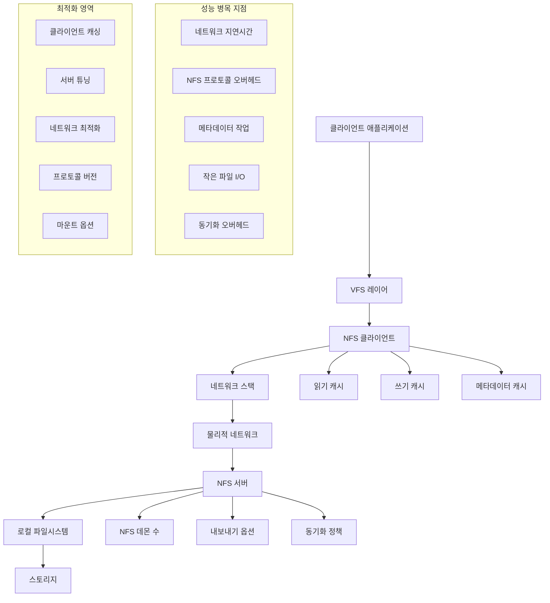

---
tags:
  - NFS
  - Network
  - Filesystem
  - Performance
  - Distributed Storage
---

# 네트워크 파일시스템 최적화: "NFS가 너무 느려요"

## 상황: 분산 환경의 파일 공유 성능 문제

"안녕하세요, 여러 서버에서 NFS로 파일을 공유하고 있는데 성능이 너무 느려서 문제가 되고 있어요. 특히 작은 파일들을 많이 읽을 때 지연시간이 심각합니다. Docker 컨테이너에서 NFS 볼륨을 사용할 때도 마찬가지구요. 어떻게 최적화할 수 있을까요?"

네트워크 파일시스템은 분산 환경에서 필수적이지만, 올바른 설정과 최적화 없이는 심각한 성능 병목이 될 수 있습니다. NFS, SMB/CIFS, 그리고 최신 분산 파일시스템의 최적화 방법을 알아보겠습니다.

## 네트워크 파일시스템 성능 요소



## 1. NFS 성능 분석기

NFS 성능을 종합적으로 분석하는 도구입니다.

```c
// nfs_performance_analyzer.c
#define _GNU_SOURCE
#include <stdio.h>
#include <stdlib.h>
#include <string.h>
#include <unistd.h>
#include <fcntl.h>
#include <sys/stat.h>
#include <sys/time.h>
#include <sys/mount.h>
#include <errno.h>
#include <time.h>
#include <dirent.h>
#include <pthread.h>
#include <sys/socket.h>
#include <netinet/in.h>
#include <arpa/inet.h>

typedef struct {
    char server[256];
    char export_path[512];
    char mount_point[512];
    char version[16];
    char protocol[16];
    char options[1024];
    double rtt_min, rtt_avg, rtt_max;
    int is_mounted;
} nfs_mount_info_t;

typedef struct {
    double read_latency;
    double write_latency;
    double metadata_latency;
    double read_throughput;
    double write_throughput;
    int small_file_ops_per_sec;
    int large_file_ops_per_sec;
} nfs_performance_t;

typedef struct {
    unsigned long long ops;
    unsigned long long bytes;
    unsigned long long errors;
    double avg_rtt;
    double avg_exe;
} nfs_stats_t;

// NFS 마운트 정보 파싱
int parse_nfs_mounts(nfs_mount_info_t* mounts, int max_count) {
    FILE* fp = fopen("/proc/mounts", "r");
    if (!fp) return -1;
    
    char line[2048];
    int count = 0;
    
    while (fgets(line, sizeof(line), fp) && count < max_count) {
        char device[512], mount_point[512], fs_type[64], options[1024];
        
        if (sscanf(line, "%s %s %s %s", device, mount_point, fs_type, options) == 4) {
            if (strncmp(fs_type, "nfs", 3) == 0) {
                // NFS 마운트 정보 파싱
                char* colon = strchr(device, ':');
                if (colon) {
                    *colon = '\0';
                    strcpy(mounts[count].server, device);
                    strcpy(mounts[count].export_path, colon + 1);
                    strcpy(mounts[count].mount_point, mount_point);
                    strcpy(mounts[count].options, options);
                    strcpy(mounts[count].version, fs_type);
                    
                    // 프로토콜 확인 (TCP/UDP)
                    if (strstr(options, "proto=udp")) {
                        strcpy(mounts[count].protocol, "UDP");
                    } else {
                        strcpy(mounts[count].protocol, "TCP");
                    }
                    
                    mounts[count].is_mounted = 1;
                    count++;
                }
            }
        }
    }
    
    fclose(fp);
    return count;
}

// NFS 서버 네트워크 지연시간 측정
void measure_network_latency(const char* server, nfs_mount_info_t* mount_info) {
    printf("=== 네트워크 지연시간 측정: %s ===\n", server);
    
    char cmd[512];
    snprintf(cmd, sizeof(cmd), "ping -c 10 -q %s 2>/dev/null", server);
    
    FILE* ping = popen(cmd, "r");
    if (!ping) {
        printf("ping 실행 실패\n");
        return;
    }
    
    char line[256];
    while (fgets(line, sizeof(line), ping)) {
        if (strstr(line, "min/avg/max")) {
            float min, avg, max;
            if (sscanf(line, "%*s = %f/%f/%f", &min, &avg, &max) == 3) {
                mount_info->rtt_min = min;
                mount_info->rtt_avg = avg;
                mount_info->rtt_max = max;
                
                printf("RTT: %.1f/%.1f/%.1f ms (min/avg/max)\n", min, avg, max);
                
                if (avg > 10) {
                    printf("⚠️  높은 네트워크 지연시간이 감지되었습니다.\n");
                } else if (avg > 5) {
                    printf("⚠️  중간 수준의 네트워크 지연시간입니다.\n");
                } else {
                    printf("✅ 네트워크 지연시간이 양호합니다.\n");
                }
            }
            break;
        }
    }
    
    pclose(ping);
}

// NFS 통계 정보 수집
void collect_nfs_stats(const char* mount_point, nfs_stats_t* read_stats, nfs_stats_t* write_stats) {
    FILE* fp = fopen("/proc/self/mountstats", "r");
    if (!fp) return;
    
    char line[1024];
    int found_mount = 0;
    
    while (fgets(line, sizeof(line), fp)) {
        if (strstr(line, mount_point)) {
            found_mount = 1;
            continue;
        }
        
        if (found_mount) {
            if (strncmp(line, "bytes:", 6) == 0) {
                // 바이트 통계
                unsigned long long read_bytes, write_bytes;
                sscanf(line, "bytes: %llu %llu", &read_bytes, &write_bytes);
                read_stats->bytes = read_bytes;
                write_stats->bytes = write_bytes;
                
            } else if (strstr(line, "READ")) {
                // READ 작업 통계
                sscanf(line, "%*s %llu %llu %*s %*s %*s %lf %lf",
                       &read_stats->ops, &read_stats->errors,
                       &read_stats->avg_rtt, &read_stats->avg_exe);
                
            } else if (strstr(line, "WRITE")) {
                // WRITE 작업 통계
                sscanf(line, "%*s %llu %llu %*s %*s %*s %lf %lf",
                       &write_stats->ops, &write_stats->errors,
                       &write_stats->avg_rtt, &write_stats->avg_exe);
                
            } else if (strncmp(line, "device", 6) == 0) {
                // 다음 마운트 포인트 시작
                break;
            }
        }
    }
    
    fclose(fp);
}

// I/O 성능 벤치마크
void benchmark_nfs_performance(const char* mount_point, nfs_performance_t* perf) {
    printf("\n=== NFS 성능 벤치마크: %s ===\n", mount_point);
    
    char test_dir[1024];
    snprintf(test_dir, sizeof(test_dir), "%s/.nfs_benchmark_%d", mount_point, getpid());
    
    if (mkdir(test_dir, 0755) != 0) {
        perror("테스트 디렉토리 생성 실패");
        return;
    }
    
    struct timeval start, end;
    double elapsed;
    
    // 1. 메타데이터 성능 테스트 (1000개 작은 파일 생성/삭제)
    printf("메타데이터 성능 테스트 (1000개 파일)...\n");
    gettimeofday(&start, NULL);
    
    for (int i = 0; i < 1000; i++) {
        char filename[1024];
        snprintf(filename, sizeof(filename), "%s/small_file_%d", test_dir, i);
        
        int fd = open(filename, O_CREAT | O_WRONLY, 0644);
        if (fd >= 0) {
            write(fd, "test", 4);
            close(fd);
        }
    }
    
    gettimeofday(&end, NULL);
    elapsed = (end.tv_sec - start.tv_sec) + (end.tv_usec - start.tv_usec) / 1000000.0;
    perf->small_file_ops_per_sec = 1000 / elapsed;
    perf->metadata_latency = elapsed * 1000 / 1000;  // ms per operation
    
    printf("메타데이터 성능: %.0f ops/sec, 평균 지연시간: %.2f ms\n",
           perf->small_file_ops_per_sec, perf->metadata_latency);
    
    // 2. 순차 쓰기 성능 테스트 (10MB 파일)
    printf("순차 쓰기 성능 테스트 (10MB)...\n");
    char large_file[1024];
    snprintf(large_file, sizeof(large_file), "%s/large_write_test", test_dir);
    
    char* buffer = malloc(1024 * 1024);  // 1MB 버퍼
    memset(buffer, 0xAA, 1024 * 1024);
    
    gettimeofday(&start, NULL);
    
    int fd = open(large_file, O_CREAT | O_WRONLY | O_SYNC, 0644);
    if (fd >= 0) {
        for (int i = 0; i < 10; i++) {
            write(fd, buffer, 1024 * 1024);
        }
        close(fd);
    }
    
    gettimeofday(&end, NULL);
    elapsed = (end.tv_sec - start.tv_sec) + (end.tv_usec - start.tv_usec) / 1000000.0;
    perf->write_throughput = 10.0 / elapsed;  // MB/s
    perf->write_latency = elapsed * 1000;     // ms
    
    printf("쓰기 성능: %.2f MB/s, 지연시간: %.0f ms\n",
           perf->write_throughput, perf->write_latency);
    
    // 3. 순차 읽기 성능 테스트
    printf("순차 읽기 성능 테스트 (10MB)...\n");
    gettimeofday(&start, NULL);
    
    fd = open(large_file, O_RDONLY);
    if (fd >= 0) {
        for (int i = 0; i < 10; i++) {
            read(fd, buffer, 1024 * 1024);
        }
        close(fd);
    }
    
    gettimeofday(&end, NULL);
    elapsed = (end.tv_sec - start.tv_sec) + (end.tv_usec - start.tv_usec) / 1000000.0;
    perf->read_throughput = 10.0 / elapsed;   // MB/s
    perf->read_latency = elapsed * 1000;      // ms
    
    printf("읽기 성능: %.2f MB/s, 지연시간: %.0f ms\n",
           perf->read_throughput, perf->read_latency);
    
    // 4. 랜덤 I/O 성능 테스트
    printf("랜덤 I/O 성능 테스트...\n");
    gettimeofday(&start, NULL);
    
    fd = open(large_file, O_RDWR);
    if (fd >= 0) {
        srand(time(NULL));
        for (int i = 0; i < 100; i++) {
            off_t offset = (rand() % 10) * 1024 * 1024;
            lseek(fd, offset, SEEK_SET);
            if (i % 2 == 0) {
                read(fd, buffer, 64 * 1024);
            } else {
                write(fd, buffer, 64 * 1024);
            }
        }
        close(fd);
    }
    
    gettimeofday(&end, NULL);
    elapsed = (end.tv_sec - start.tv_sec) + (end.tv_usec - start.tv_usec) / 1000000.0;
    perf->large_file_ops_per_sec = 100 / elapsed;
    
    printf("랜덤 I/O 성능: %.0f ops/sec\n", perf->large_file_ops_per_sec);
    
    // 정리
    char cleanup_cmd[1024];
    snprintf(cleanup_cmd, sizeof(cleanup_cmd), "rm -rf %s", test_dir);
    system(cleanup_cmd);
    
    free(buffer);
}

// NFS 최적화 권장사항
void suggest_nfs_optimizations(nfs_mount_info_t* mount_info, nfs_performance_t* perf) {
    printf("\n=== NFS 최적화 권장사항 ===\n");
    
    // 네트워크 지연시간 기반 권장사항
    if (mount_info->rtt_avg > 10) {
        printf("🔧 높은 네트워크 지연시간 최적화:\n");
        printf("   - rsize/wsize 증가: rsize=1048576,wsize=1048576\n");
        printf("   - 읽기 ahead 증가: racache\n");
        printf("   - 비동기 I/O 활성화: async\n");
    }
    
    // 메타데이터 성능 기반 권장사항
    if (perf->small_file_ops_per_sec < 50) {
        printf("🔧 메타데이터 성능 최적화:\n");
        printf("   - 속성 캐시 시간 증가: ac=60\n");
        printf("   - 디렉토리 캐시 시간 증가: acdirmin=30,acdirmax=60\n");
        printf("   - 파일 캐시 시간 증가: acregmin=30,acregmax=60\n");
    }
    
    // 처리량 기반 권장사항
    if (perf->read_throughput < 50 || perf->write_throughput < 50) {
        printf("🔧 처리량 최적화:\n");
        printf("   - 대용량 I/O 블록: rsize=1048576,wsize=1048576\n");
        printf("   - TCP 사용: proto=tcp\n");
        printf("   - 다중 연결: nconnect=4\n");
    }
    
    // 일관성 vs 성능 트레이드오프
    printf("🔧 일관성 vs 성능 옵션:\n");
    printf("   - 엄격한 일관성: sync,cto\n");
    printf("   - 느슨한 일관성 (성능 향상): async,nocto\n");
    printf("   - 읽기 전용: ro,noatime\n");
    
    // 마운트 옵션 예제
    printf("\n📋 권장 마운트 옵션 예제:\n");
    
    if (mount_info->rtt_avg < 5 && perf->small_file_ops_per_sec > 100) {
        printf("고성능 LAN 환경:\n");
        printf("   mount -t nfs4 -o rsize=1048576,wsize=1048576,hard,intr,proto=tcp %s:%s %s\n",
               mount_info->server, mount_info->export_path, mount_info->mount_point);
    } else {
        printf("일반적인 환경:\n");
        printf("   mount -t nfs4 -o rsize=262144,wsize=262144,hard,intr,proto=tcp,ac=60 %s:%s %s\n",
               mount_info->server, mount_info->export_path, mount_info->mount_point);
    }
    
    printf("\nWAN/고지연 환경:\n");
    printf("   mount -t nfs4 -o rsize=1048576,wsize=1048576,hard,intr,proto=tcp,ac=300,async %s:%s %s\n",
           mount_info->server, mount_info->export_path, mount_info->mount_point);
}

// NFS 서버 튜닝 가이드
void show_server_tuning_guide() {
    printf("\n=== NFS 서버 튜닝 가이드 ===\n");
    
    printf("📈 서버 성능 향상:\n");
    printf("1. NFS 데몬 수 증가:\n");
    printf("   # /etc/nfs.conf에서 threads 수 조정\n");
    printf("   echo 'nfsd --nfs-version 4 --nfs-version 3 --threads 64' > /etc/default/nfs-kernel-server\n\n");
    
    printf("2. 커널 매개변수 조정:\n");
    printf("   echo 'net.core.rmem_default = 262144' >> /etc/sysctl.conf\n");
    printf("   echo 'net.core.rmem_max = 16777216' >> /etc/sysctl.conf\n");
    printf("   echo 'net.core.wmem_default = 262144' >> /etc/sysctl.conf\n");
    printf("   echo 'net.core.wmem_max = 16777216' >> /etc/sysctl.conf\n\n");
    
    printf("3. 내보내기 옵션 최적화:\n");
    printf("   # /etc/exports\n");
    printf("   /export *(rw,sync,no_subtree_check,no_root_squash)\n");
    printf("   # 성능 우선시: async,no_wdelay\n");
    printf("   # 안정성 우선시: sync,wdelay\n\n");
    
    printf("4. 파일시스템 최적화:\n");
    printf("   # ext4: noatime,data=writeback\n");
    printf("   # XFS: noatime,largeio,swalloc\n");
    printf("   # ZFS: recordsize=1M,compression=lz4\n\n");
    
    printf("5. SSD 최적화:\n");
    printf("   # NVMe SSD의 경우\n");
    printf("   echo mq-deadline > /sys/block/nvme0n1/queue/scheduler\n");
    printf("   echo 256 > /sys/block/nvme0n1/queue/nr_requests\n");
}

// Docker 컨테이너 NFS 최적화
void show_docker_nfs_optimization() {
    printf("\n=== Docker NFS 최적화 ===\n");
    
    printf("🐳 Docker Compose NFS 볼륨:\n");
    printf("```yaml\n");
    printf("version: '3.8'\n");
    printf("services:\n");
    printf("  app:\n");
    printf("    image: myapp\n");
    printf("    volumes:\n");
    printf("      - type: volume\n");
    printf("        source: nfs-data\n");
    printf("        target: /data\n");
    printf("        volume:\n");
    printf("          nocopy: true\n");
    printf("\n");
    printf("volumes:\n");
    printf("  nfs-data:\n");
    printf("    driver: local\n");
    printf("    driver_opts:\n");
    printf("      type: nfs4\n");
    printf("      o: addr=nfs-server,rsize=1048576,wsize=1048576,hard,intr,proto=tcp\n");
    printf("      device: ':/export/data'\n");
    printf("```\n\n");
    
    printf("🚀 고성능 옵션:\n");
    printf("   o: addr=nfs-server,rsize=1048576,wsize=1048576,hard,intr,proto=tcp,ac=60,async\n\n");
    
    printf("📁 컨테이너 내 캐시 최적화:\n");
    printf("   # 컨테이너에 tmpfs 마운트\n");
    printf("   docker run --tmpfs /tmp:rw,noexec,nosuid,size=1g myapp\n");
}

int main(int argc, char* argv[]) {
    if (argc < 2) {
        printf("사용법: %s <command> [options]\n", argv[0]);
        printf("Commands:\n");
        printf("  scan                    - NFS 마운트 스캔 및 분석\n");
        printf("  benchmark <mount_point> - 성능 벤치마크\n");
        printf("  analyze <mount_point>   - 상세 분석\n");
        printf("  server-guide            - 서버 튜닝 가이드\n");
        printf("  docker-guide            - Docker NFS 가이드\n");
        return 1;
    }
    
    const char* command = argv[1];
    
    if (strcmp(command, "scan") == 0) {
        nfs_mount_info_t mounts[32];
        int count = parse_nfs_mounts(mounts, 32);
        
        if (count <= 0) {
            printf("NFS 마운트를 찾을 수 없습니다.\n");
            return 1;
        }
        
        printf("=== NFS 마운트 정보 ===\n");
        printf("%-20s %-30s %-20s %-10s %-10s\n", 
               "서버", "내보내기", "마운트포인트", "버전", "프로토콜");
        printf("%-20s %-30s %-20s %-10s %-10s\n", 
               "----", "------", "----------", "----", "------");
        
        for (int i = 0; i < count; i++) {
            printf("%-20s %-30s %-20s %-10s %-10s\n",
                   mounts[i].server, mounts[i].export_path, mounts[i].mount_point,
                   mounts[i].version, mounts[i].protocol);
            
            // 네트워크 지연시간 측정
            measure_network_latency(mounts[i].server, &mounts[i]);
            
            // NFS 통계 수집
            nfs_stats_t read_stats = {0}, write_stats = {0};
            collect_nfs_stats(mounts[i].mount_point, &read_stats, &write_stats);
            
            printf("  읽기: %llu 작업, %llu 바이트, %.1f ms 평균 RTT\n",
                   read_stats.ops, read_stats.bytes, read_stats.avg_rtt);
            printf("  쓰기: %llu 작업, %llu 바이트, %.1f ms 평균 RTT\n",
                   write_stats.ops, write_stats.bytes, write_stats.avg_rtt);
            
            if (read_stats.errors > 0 || write_stats.errors > 0) {
                printf("  ⚠️ 오류: 읽기 %llu, 쓰기 %llu\n", 
                       read_stats.errors, write_stats.errors);
            }
            printf("\n");
        }
        
    } else if (strcmp(command, "benchmark") == 0 && argc >= 3) {
        const char* mount_point = argv[2];
        
        nfs_performance_t perf = {0};
        benchmark_nfs_performance(mount_point, &perf);
        
        // 마운트 정보 찾기
        nfs_mount_info_t mounts[32];
        int count = parse_nfs_mounts(mounts, 32);
        
        for (int i = 0; i < count; i++) {
            if (strcmp(mounts[i].mount_point, mount_point) == 0) {
                measure_network_latency(mounts[i].server, &mounts[i]);
                suggest_nfs_optimizations(&mounts[i], &perf);
                break;
            }
        }
        
    } else if (strcmp(command, "analyze") == 0 && argc >= 3) {
        const char* mount_point = argv[2];
        
        printf("=== NFS 상세 분석: %s ===\n", mount_point);
        
        // 현재 마운트 옵션 표시
        char cmd[512];
        snprintf(cmd, sizeof(cmd), "mount | grep ' %s '", mount_point);
        printf("현재 마운트 옵션:\n");
        system(cmd);
        
        // 성능 벤치마크
        nfs_performance_t perf = {0};
        benchmark_nfs_performance(mount_point, &perf);
        
        // 최적화 권장사항
        nfs_mount_info_t mounts[32];
        int count = parse_nfs_mounts(mounts, 32);
        
        for (int i = 0; i < count; i++) {
            if (strcmp(mounts[i].mount_point, mount_point) == 0) {
                measure_network_latency(mounts[i].server, &mounts[i]);
                suggest_nfs_optimizations(&mounts[i], &perf);
                break;
            }
        }
        
    } else if (strcmp(command, "server-guide") == 0) {
        show_server_tuning_guide();
        
    } else if (strcmp(command, "docker-guide") == 0) {
        show_docker_nfs_optimization();
        
    } else {
        printf("알 수 없는 명령어입니다.\n");
        return 1;
    }
    
    return 0;
}
```

## 2. 네트워크 파일시스템 자동 최적화 스크립트

다양한 시나리오에 맞는 NFS 설정을 자동으로 적용하는 스크립트입니다.

```bash
#!/bin/bash
# nfs_auto_optimizer.sh

set -euo pipefail

# 색상 정의
RED='\033[0;31m'
GREEN='\033[0;32m'
YELLOW='\033[1;33m'
BLUE='\033[0;34m'
NC='\033[0m'

# 설정
CONFIG_FILE="/etc/nfs_optimizer.conf"
LOG_FILE="/var/log/nfs_optimizer.log"

log_info() {
    echo -e "${GREEN}[INFO]${NC} $1" | tee -a "$LOG_FILE"
}

log_warn() {
    echo -e "${YELLOW}[WARN]${NC} $1" | tee -a "$LOG_FILE"
}

log_error() {
    echo -e "${RED}[ERROR]${NC} $1" | tee -a "$LOG_FILE"
}

# 네트워크 지연시간 측정
measure_latency() {
    local server=$1
    local avg_rtt
    
    avg_rtt=$(ping -c 5 -q "$server" 2>/dev/null | awk -F'/' '/^round-trip/ {print $5}' || echo "999")
    echo "$avg_rtt"
}

# 네트워크 대역폭 측정 (iperf3 사용)
measure_bandwidth() {
    local server=$1
    
    if command -v iperf3 >/dev/null 2>&1; then
        # iperf3 서버가 실행 중인지 확인 (포트 5201)
        if nc -z "$server" 5201 2>/dev/null; then
            local bandwidth
            bandwidth=$(iperf3 -c "$server" -t 5 -f M 2>/dev/null | awk '/receiver/ {print $7}' || echo "0")
            echo "$bandwidth"
        else
            echo "0"
        fi
    else
        echo "0"
    fi
}

# 시스템 리소스 확인
check_system_resources() {
    local memory_gb
    local cpu_cores
    
    memory_gb=$(free -g | awk '/^Mem:/ {print $2}')
    cpu_cores=$(nproc)
    
    echo "메모리: ${memory_gb}GB, CPU 코어: $cpu_cores"
    
    # 리소스 기반 권장사항
    if [[ $memory_gb -lt 4 ]]; then
        log_warn "메모리가 부족합니다 (${memory_gb}GB). 캐시 설정을 보수적으로 조정합니다."
        echo "low_memory"
    elif [[ $memory_gb -gt 16 ]]; then
        log_info "충분한 메모리가 있습니다 (${memory_gb}GB). 적극적인 캐싱을 활성화합니다."
        echo "high_memory"
    else
        echo "normal_memory"
    fi
}

# 워크로드 타입 감지
detect_workload_type() {
    local mount_point=$1
    
    log_info "워크로드 패턴 분석: $mount_point"
    
    # 파일 크기 분포 확인
    local small_files
    local large_files
    local total_files
    
    if [[ ! -d "$mount_point" ]]; then
        echo "unknown"
        return
    fi
    
    # 샘플링: 상위 디렉토리의 파일들만 확인
    small_files=$(find "$mount_point" -maxdepth 2 -type f -size -1M 2>/dev/null | wc -l)
    large_files=$(find "$mount_point" -maxdepth 2 -type f -size +10M 2>/dev/null | wc -l)
    total_files=$(find "$mount_point" -maxdepth 2 -type f 2>/dev/null | wc -l)
    
    if [[ $total_files -eq 0 ]]; then
        echo "empty"
        return
    fi
    
    local small_ratio=$((small_files * 100 / total_files))
    local large_ratio=$((large_files * 100 / total_files))
    
    log_info "파일 분포: 작은 파일 ${small_ratio}%, 큰 파일 ${large_ratio}%"
    
    if [[ $small_ratio -gt 70 ]]; then
        echo "small_files"  # 메타데이터 집약적
    elif [[ $large_ratio -gt 30 ]]; then
        echo "large_files"  # 처리량 집약적
    else
        echo "mixed"
    fi
}

# 최적 마운트 옵션 생성
generate_mount_options() {
    local server=$1
    local export_path=$2
    local mount_point=$3
    local workload_type=$4
    local latency=$5
    local memory_profile=$6
    local nfs_version=${7:-"4"}
    
    local options=()
    
    # 기본 옵션
    options+=("rw")
    options+=("hard")
    options+=("intr")
    options+=("proto=tcp")
    
    # 지연시간 기반 최적화
    if (( $(echo "$latency < 2" | bc -l) )); then
        # 매우 낮은 지연시간 (LAN)
        options+=("rsize=1048576")
        options+=("wsize=1048576")
        options+=("timeo=14")
        options+=("retrans=2")
        log_info "낮은 지연시간 환경 최적화 적용"
        
    elif (( $(echo "$latency < 10" | bc -l) )); then
        # 중간 지연시간
        options+=("rsize=262144")
        options+=("wsize=262144")
        options+=("timeo=30")
        options+=("retrans=3")
        log_info "중간 지연시간 환경 최적화 적용"
        
    else
        # 높은 지연시간 (WAN)
        options+=("rsize=1048576")
        options+=("wsize=1048576")
        options+=("timeo=600")
        options+=("retrans=2")
        options+=("async")
        log_info "높은 지연시간 환경 최적화 적용"
    fi
    
    # 워크로드 타입별 최적화
    case "$workload_type" in
        "small_files")
            # 메타데이터 집약적 워크로드
            options+=("ac=300")  # 긴 속성 캐시
            options+=("acdirmin=60")
            options+=("acdirmax=300")
            options+=("acregmin=60")
            options+=("acregmax=300")
            log_info "작은 파일 워크로드 최적화 적용"
            ;;
            
        "large_files")
            # 처리량 집약적 워크로드
            options+=("ac=30")   # 짧은 속성 캐시
            if [[ "$nfs_version" == "4" ]]; then
                options+=("nconnect=4")  # 다중 연결
            fi
            log_info "큰 파일 워크로드 최적화 적용"
            ;;
            
        "mixed")
            # 혼합 워크로드
            options+=("ac=60")
            options+=("acdirmin=30")
            options+=("acdirmax=60")
            log_info "혼합 워크로드 최적화 적용"
            ;;
    esac
    
    # 메모리 프로필별 최적화
    case "$memory_profile" in
        "low_memory")
            options+=("ac=30")
            options+=("rsize=65536")
            options+=("wsize=65536")
            ;;
        "high_memory")
            options+=("ac=600")
            options+=("racache")
            ;;
    esac
    
    # NFSv4 특화 옵션
    if [[ "$nfs_version" == "4" ]]; then
        options+=("minorversion=2")
        options+=("fsc")  # 로컬 캐싱 활성화 (cachefilesd 필요)
    fi
    
    # 옵션 문자열 생성
    local option_string
    option_string=$(IFS=','; echo "${options[*]}")
    
    echo "$option_string"
}

# NFS 서버 튜닝
tune_nfs_server() {
    log_info "NFS 서버 튜닝 적용"
    
    # NFS 데몬 수 최적화
    local cpu_cores
    cpu_cores=$(nproc)
    local nfsd_threads=$((cpu_cores * 8))
    
    if [[ $nfsd_threads -gt 256 ]]; then
        nfsd_threads=256
    elif [[ $nfsd_threads -lt 8 ]]; then
        nfsd_threads=8
    fi
    
    log_info "NFS 데몬 스레드 수를 $nfsd_threads로 설정"
    
    # systemd 환경에서 설정
    if systemctl is-active nfs-server >/dev/null 2>&1; then
        if [[ -f /etc/nfs.conf ]]; then
            sed -i "s/^# threads=.*/threads=$nfsd_threads/" /etc/nfs.conf
            sed -i "s/^threads=.*/threads=$nfsd_threads/" /etc/nfs.conf
            
            if ! grep -q "^threads=" /etc/nfs.conf; then
                echo "threads=$nfsd_threads" >> /etc/nfs.conf
            fi
        fi
        
        systemctl restart nfs-server
        log_info "NFS 서버 재시작 완료"
    fi
    
    # 커널 네트워크 버퍼 최적화
    local memory_gb
    memory_gb=$(free -g | awk '/^Mem:/ {print $2}')
    
    local rmem_max=$((memory_gb * 1024 * 1024))
    local wmem_max=$((memory_gb * 1024 * 1024))
    
    # 최대값 제한
    if [[ $rmem_max -gt 134217728 ]]; then rmem_max=134217728; fi
    if [[ $wmem_max -gt 134217728 ]]; then wmem_max=134217728; fi
    
    sysctl -w net.core.rmem_max="$rmem_max"
    sysctl -w net.core.wmem_max="$wmem_max"
    sysctl -w net.core.rmem_default=262144
    sysctl -w net.core.wmem_default=262144
    
    log_info "네트워크 버퍼 크기 최적화 완료"
    
    # /etc/exports 최적화 권장사항 표시
    log_info "=/etc/exports 최적화 권장사항:"
    echo "# 고성능 설정 (일관성 희생)"
    echo "/export *(rw,async,no_subtree_check,no_wdelay,no_root_squash)"
    echo ""
    echo "# 안정성 우선 설정"
    echo "/export *(rw,sync,subtree_check,root_squash)"
}

# 클라이언트 최적화
optimize_nfs_client() {
    local server=$1
    local export_path=$2
    local mount_point=$3
    local options=$4
    local nfs_version=${5:-"4"}
    
    log_info "NFS 클라이언트 최적화: $server:$export_path -> $mount_point"
    
    # 기존 마운트 해제
    if mountpoint -q "$mount_point" 2>/dev/null; then
        log_info "기존 마운트 해제 중..."
        umount "$mount_point" || {
            log_warn "일반 언마운트 실패, 강제 언마운트 시도"
            umount -l "$mount_point"
        }
    fi
    
    # 마운트 포인트 생성
    mkdir -p "$mount_point"
    
    # 최적화된 옵션으로 마운트
    local mount_cmd="mount -t nfs${nfs_version} -o ${options} ${server}:${export_path} ${mount_point}"
    
    log_info "마운트 명령어: $mount_cmd"
    
    if eval "$mount_cmd"; then
        log_info "마운트 성공"
        
        # /etc/fstab 업데이트 (선택사항)
        local fstab_entry="${server}:${export_path} ${mount_point} nfs${nfs_version} ${options} 0 0"
        
        if ! grep -q "${server}:${export_path}" /etc/fstab; then
            echo "# NFS 자동 최적화에 의해 추가됨 - $(date)" >> /etc/fstab
            echo "$fstab_entry" >> /etc/fstab
            log_info "/etc/fstab에 항목 추가됨"
        else
            log_info "/etc/fstab 항목이 이미 존재함"
        fi
        
        # 마운트 확인
        if mountpoint -q "$mount_point"; then
            log_info "마운트 확인 완료"
            df -h "$mount_point"
        fi
        
    else
        log_error "마운트 실패"
        return 1
    fi
}

# 성능 테스트
run_performance_test() {
    local mount_point=$1
    local test_duration=${2:-30}
    
    log_info "성능 테스트 실행: $mount_point (${test_duration}초)"
    
    local test_dir="$mount_point/.perf_test_$$"
    mkdir -p "$test_dir"
    
    # 메타데이터 성능 테스트
    local start_time
    local end_time
    local ops_per_sec
    
    start_time=$(date +%s.%N)
    for i in {1..100}; do
        touch "$test_dir/file_$i"
        rm "$test_dir/file_$i"
    done
    end_time=$(date +%s.%N)
    
    ops_per_sec=$(echo "scale=2; 200 / ($end_time - $start_time)" | bc)
    log_info "메타데이터 성능: $ops_per_sec ops/sec"
    
    # 순차 I/O 성능 테스트
    start_time=$(date +%s.%N)
    dd if=/dev/zero of="$test_dir/seq_test" bs=1M count=10 2>/dev/null
    sync
    end_time=$(date +%s.%N)
    
    local write_speed
    write_speed=$(echo "scale=2; 10 / ($end_time - $start_time)" | bc)
    log_info "순차 쓰기 성능: $write_speed MB/s"
    
    start_time=$(date +%s.%N)
    dd if="$test_dir/seq_test" of=/dev/null bs=1M 2>/dev/null
    end_time=$(date +%s.%N)
    
    local read_speed
    read_speed=$(echo "scale=2; 10 / ($end_time - $start_time)" | bc)
    log_info "순차 읽기 성능: $read_speed MB/s"
    
    # 정리
    rm -rf "$test_dir"
    
    # 성능 평가
    if (( $(echo "$ops_per_sec < 10" | bc -l) )); then
        log_warn "메타데이터 성능이 낮습니다. 캐시 설정을 조정하세요."
    fi
    
    if (( $(echo "$write_speed < 10" | bc -l) )); then
        log_warn "쓰기 성능이 낮습니다. 블록 크기와 비동기 옵션을 확인하세요."
    fi
}

# Docker 환경 최적화
optimize_docker_nfs() {
    local server=$1
    local export_path=$2
    local volume_name=$3
    local options=$4
    
    log_info "Docker NFS 볼륨 최적화"
    
    # Docker 볼륨 생성
    docker volume create \
        --driver local \
        --opt type=nfs4 \
        --opt o="addr=$server,$options" \
        --opt device="$export_path" \
        "$volume_name"
    
    log_info "Docker 볼륨 '$volume_name' 생성 완료"
    
    # 사용 예제 출력
    echo "Docker Compose에서 사용:"
    cat << EOF
volumes:
  $volume_name:
    external: true

services:
  app:
    volumes:
      - $volume_name:/data
EOF
}

# 모니터링 설정
setup_monitoring() {
    log_info "NFS 모니터링 설정"
    
    # nfsstat 명령어 확인
    if ! command -v nfsstat >/dev/null 2>&1; then
        log_warn "nfsstat 명령어가 없습니다. nfs-utils 패키지를 설치하세요."
    fi
    
    # 모니터링 스크립트 생성
    cat > /usr/local/bin/nfs_monitor.sh << 'EOF'
#!/bin/bash
# NFS 성능 모니터링 스크립트

LOG_FILE="/var/log/nfs_performance.log"

while true; do
    echo "=== $(date) ===" >> "$LOG_FILE"
    
    # NFS 통계
    nfsstat -c >> "$LOG_FILE" 2>/dev/null
    
    # 마운트 상태
    echo "=== 마운트 상태 ===" >> "$LOG_FILE"
    mount | grep nfs >> "$LOG_FILE"
    
    echo "" >> "$LOG_FILE"
    sleep 300  # 5분 간격
done
EOF
    
    chmod +x /usr/local/bin/nfs_monitor.sh
    log_info "모니터링 스크립트 생성: /usr/local/bin/nfs_monitor.sh"
    
    # systemd 서비스 생성
    cat > /etc/systemd/system/nfs-monitor.service << EOF
[Unit]
Description=NFS Performance Monitor
After=network.target

[Service]
ExecStart=/usr/local/bin/nfs_monitor.sh
Restart=always
RestartSec=10

[Install]
WantedBy=multi-user.target
EOF
    
    systemctl daemon-reload
    systemctl enable nfs-monitor.service
    log_info "NFS 모니터링 서비스 활성화됨"
}

# 사용법
usage() {
    echo "NFS 자동 최적화 도구"
    echo ""
    echo "사용법:"
    echo "  $0 analyze <server> <export_path> <mount_point>     # 환경 분석 및 권장사항"
    echo "  $0 optimize <server> <export_path> <mount_point>    # 자동 최적화 적용"
    echo "  $0 server-tune                                      # 서버 튜닝"
    echo "  $0 docker <server> <export_path> <volume_name>      # Docker 볼륨 최적화"
    echo "  $0 test <mount_point>                               # 성능 테스트"
    echo "  $0 monitor                                          # 모니터링 설정"
    echo ""
    echo "예시:"
    echo "  $0 analyze 192.168.1.100 /export/data /mnt/nfs"
    echo "  $0 optimize 192.168.1.100 /export/data /mnt/nfs"
    echo "  $0 docker 192.168.1.100 /export/data nfs-data"
}

# 메인 함수
main() {
    local command=${1:-"help"}
    
    case "$command" in
        "analyze")
            if [[ $# -lt 4 ]]; then
                echo "사용법: $0 analyze <server> <export_path> <mount_point>"
                exit 1
            fi
            
            local server=$2
            local export_path=$3
            local mount_point=$4
            
            log_info "NFS 환경 분석 시작"
            
            # 네트워크 지연시간 측정
            local latency
            latency=$(measure_latency "$server")
            log_info "네트워크 지연시간: $latency ms"
            
            # 시스템 리소스 확인
            local memory_profile
            memory_profile=$(check_system_resources)
            
            # 워크로드 타입 감지 (기존 마운트가 있는 경우)
            local workload_type="mixed"
            if [[ -d "$mount_point" ]]; then
                workload_type=$(detect_workload_type "$mount_point")
            fi
            log_info "감지된 워크로드 타입: $workload_type"
            
            # 최적 마운트 옵션 생성
            local options
            options=$(generate_mount_options "$server" "$export_path" "$mount_point" "$workload_type" "$latency" "$memory_profile")
            
            echo ""
            echo "=== 권장 설정 ==="
            echo "마운트 명령어:"
            echo "mount -t nfs4 -o $options $server:$export_path $mount_point"
            echo ""
            echo "fstab 항목:"
            echo "$server:$export_path $mount_point nfs4 $options 0 0"
            ;;
            
        "optimize")
            if [[ $# -lt 4 ]]; then
                echo "사용법: $0 optimize <server> <export_path> <mount_point>"
                exit 1
            fi
            
            local server=$2
            local export_path=$3
            local mount_point=$4
            
            # 분석 단계와 동일
            local latency
            latency=$(measure_latency "$server")
            
            local memory_profile
            memory_profile=$(check_system_resources)
            
            local workload_type="mixed"
            if [[ -d "$mount_point" ]]; then
                workload_type=$(detect_workload_type "$mount_point")
            fi
            
            local options
            options=$(generate_mount_options "$server" "$export_path" "$mount_point" "$workload_type" "$latency" "$memory_profile")
            
            # 실제 최적화 적용
            optimize_nfs_client "$server" "$export_path" "$mount_point" "$options"
            
            # 성능 테스트
            sleep 2
            run_performance_test "$mount_point"
            ;;
            
        "server-tune")
            tune_nfs_server
            ;;
            
        "docker")
            if [[ $# -lt 4 ]]; then
                echo "사용법: $0 docker <server> <export_path> <volume_name>"
                exit 1
            fi
            
            local server=$2
            local export_path=$3
            local volume_name=$4
            
            local latency
            latency=$(measure_latency "$server")
            
            local memory_profile
            memory_profile=$(check_system_resources)
            
            local options
            options=$(generate_mount_options "$server" "$export_path" "/tmp" "mixed" "$latency" "$memory_profile")
            
            optimize_docker_nfs "$server" "$export_path" "$volume_name" "$options"
            ;;
            
        "test")
            if [[ $# -lt 2 ]]; then
                echo "사용법: $0 test <mount_point>"
                exit 1
            fi
            
            run_performance_test "$2"
            ;;
            
        "monitor")
            setup_monitoring
            ;;
            
        "help"|*)
            usage
            ;;
    esac
}

# 의존성 확인
check_dependencies() {
    local missing_deps=()
    
    if ! command -v bc >/dev/null 2>&1; then
        missing_deps+=("bc")
    fi
    
    if ! command -v nfsstat >/dev/null 2>&1; then
        log_warn "nfsstat가 설치되지 않음. 상세 통계를 볼 수 없습니다."
    fi
    
    if [[ ${#missing_deps[@]} -gt 0 ]]; then
        log_error "필수 의존성이 누락됨: ${missing_deps[*]}"
        echo "설치 방법: apt install ${missing_deps[*]} 또는 yum install ${missing_deps[*]}"
        exit 1
    fi
}

# 스크립트 실행
check_dependencies
main "$@"
```

이제 Chapter 5의 마지막 문서를 작성하겠습니다.
