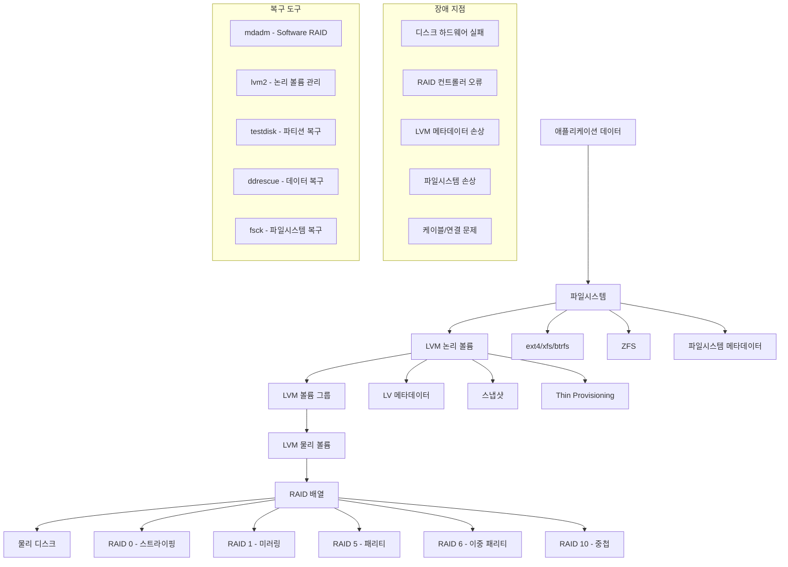

---
tags:
  - Storage
  - Troubleshooting
  - Advanced
  - LVM
  - RAID
  - ZFS
---

# 고급 스토리지 트러블슈팅: "RAID 배열이 깨졌어요"

## 상황: 복잡한 스토리지 환경의 장애

"안녕하세요, 운영 중인 서버에서 RAID 5 배열 중 하나의 디스크가 실패했는데, 교체 과정에서 또 다른 디스크에 오류가 발생했어요. 지금 데이터 손실 위험이 있는 상황인데, LVM over RAID 구성이라 더 복잡합니다. 어떻게 안전하게 복구할 수 있을까요?"

이런 상황은 엔터프라이즈 환경에서 드물지 않게 발생합니다. 복잡한 스토리지 스택(RAID + LVM + 파일시스템)에서의 장애 대응과 고급 복구 기법을 알아보겠습니다.

## 고급 스토리지 스택의 이해



## 1. 종합 스토리지 진단 시스템

복잡한 스토리지 환경의 상태를 종합적으로 진단하는 도구입니다.

```c
// storage_diagnostics.c
#define _GNU_SOURCE
#include <stdio.h>
#include <stdlib.h>
#include <string.h>
#include <unistd.h>
#include <fcntl.h>
#include <sys/stat.h>
#include <sys/ioctl.h>
#include <dirent.h>
#include <errno.h>
#include <linux/raid/md_u.h>
#include <linux/fs.h>

typedef struct {
    char device[64];
    char raid_level[16];
    char state[32];
    int total_devices;
    int active_devices;
    int failed_devices;
    int spare_devices;
    char uuid[64];
    unsigned long long array_size;
    unsigned long long used_size;
} raid_info_t;

typedef struct {
    char vg_name[64];
    char pv_devices[512];
    unsigned long long vg_size;
    unsigned long long vg_free;
    int lv_count;
    int pv_count;
    char vg_attr[16];
} lvm_vg_info_t;

typedef struct {
    char lv_name[64];
    char vg_name[64];
    char lv_path[256];
    unsigned long long lv_size;
    char lv_attr[16];
    char lv_kernel_major[8];
    char lv_kernel_minor[8];
} lvm_lv_info_t;

// RAID 배열 정보 수집
int scan_raid_arrays(raid_info_t* raids, int max_count) {
    FILE* fp = fopen("/proc/mdstat", "r");
    if (!fp) {
        perror("mdstat 열기 실패");
        return -1;
    }

    char line[1024];
    int count = 0;

    printf("=== Software RAID 배열 ===\n");

    while (fgets(line, sizeof(line), fp) && count < max_count) {
        if (strncmp(line, "md", 2) == 0) {
            char md_device[16];
            char status[32];
            char level[16];

            // md0 : active raid5 sdb1[0] sdc1[1] sdd1[2] sde1[3]
            if (sscanf(line, "%s : %s %s", md_device, status, level) >= 3) {
                snprintf(raids[count].device, sizeof(raids[count].device), "/dev/%s", md_device);
                strcpy(raids[count].state, status);
                strcpy(raids[count].raid_level, level);

                // 디바이스 개수 파싱
                char* ptr = strchr(line, '[');
                raids[count].total_devices = 0;
                raids[count].active_devices = 0;
                raids[count].failed_devices = 0;

                while (ptr && *ptr) {
                    if (*ptr == '[') raids[count].total_devices++;
                    if (strstr(ptr, "(F)")) raids[count].failed_devices++;
                    ptr++;
                }
                raids[count].active_devices = raids[count].total_devices - raids[count].failed_devices;

                printf("%-10s %-8s %-8s 디바이스: %d/%d (실패: %d)\n",
                       raids[count].device, raids[count].state, raids[count].raid_level,
                       raids[count].active_devices, raids[count].total_devices,
                       raids[count].failed_devices);

                count++;
            }
        }
    }

    fclose(fp);

    if (count == 0) {
        printf("Software RAID 배열이 없습니다.\n");
    }

    return count;
}

// RAID 배열 상세 정보
void analyze_raid_detail(const char* device) {
    printf("\n=== RAID 상세 분석: %s ===\n", device);

    char cmd[512];
    snprintf(cmd, sizeof(cmd), "mdadm --detail %s 2>/dev/null", device);

    FILE* mdadm = popen(cmd, "r");
    if (!mdadm) {
        printf("mdadm 명령어 실행 실패\n");
        return;
    }

    char line[256];
    int is_healthy = 1;

    while (fgets(line, sizeof(line), mdadm)) {
        printf("%s", line);

        // 상태 분석
        if (strstr(line, "State :") && !strstr(line, "clean")) {
            is_healthy = 0;
        }
        if (strstr(line, "Failed Devices :") && !strstr(line, ": 0")) {
            is_healthy = 0;
        }
    }

    pclose(mdadm);

    if (!is_healthy) {
        printf("\n🔴 RAID 배열에 문제가 있습니다!\n");
        printf("복구 권장사항:\n");
        printf("1. 실패한 디스크 교체: mdadm %s --remove /dev/sdX\n", device);
        printf("2. 새 디스크 추가: mdadm %s --add /dev/sdY\n", device);
        printf("3. 재구축 모니터링: watch cat /proc/mdstat\n");
    } else {
        printf("\n✅ RAID 배열이 정상 상태입니다.\n");
    }
}

// LVM 볼륨 그룹 정보 수집
int scan_lvm_volume_groups(lvm_vg_info_t* vgs, int max_count) {
    printf("\n=== LVM 볼륨 그룹 ===\n");

    FILE* vgs_cmd = popen("vgs --noheadings --separator='|' -o vg_name,pv_name,vg_size,vg_free,lv_count,pv_count,vg_attr 2>/dev/null", "r");
    if (!vgs_cmd) {
        printf("vgs 명령어 실행 실패\n");
        return 0;
    }

    char line[512];
    int count = 0;

    printf("%-15s %-20s %-10s %-10s %-5s %-5s %-8s\n",
           "VG이름", "PV디바이스", "크기", "여유공간", "LV수", "PV수", "속성");
    printf("%-15s %-20s %-10s %-10s %-5s %-5s %-8s\n",
           "------", "--------", "----", "--------", "---", "---", "----");

    while (fgets(line, sizeof(line), vgs_cmd) && count < max_count) {
        char vg_name[64], pv_name[128], vg_size[32], vg_free[32];
        char lv_count_str[8], pv_count_str[8], vg_attr[16];

        if (sscanf(line, " %[^|]|%[^|]|%[^|]|%[^|]|%[^|]|%[^|]|%s",
                   vg_name, pv_name, vg_size, vg_free, lv_count_str, pv_count_str, vg_attr) >= 7) {

            strcpy(vgs[count].vg_name, vg_name);
            strcpy(vgs[count].pv_devices, pv_name);
            strcpy(vgs[count].vg_attr, vg_attr);
            vgs[count].lv_count = atoi(lv_count_str);
            vgs[count].pv_count = atoi(pv_count_str);

            printf("%-15s %-20s %-10s %-10s %-5d %-5d %-8s\n",
                   vg_name, pv_name, vg_size, vg_free,
                   vgs[count].lv_count, vgs[count].pv_count, vg_attr);

            // 문제 감지
            if (strchr(vg_attr, 'p')) {  // partial VG
                printf("  ⚠️ 부분적 볼륨 그룹 (일부 PV 누락)\n");
            }
            if (strchr(vg_attr, 'c')) {  // clustered
                printf("  📊 클러스터 볼륨 그룹\n");
            }

            count++;
        }
    }

    pclose(vgs_cmd);
    return count;
}

// LVM 논리 볼륨 정보 수집
int scan_lvm_logical_volumes(lvm_lv_info_t* lvs, int max_count) {
    printf("\n=== LVM 논리 볼륨 ===\n");

    FILE* lvs_cmd = popen("lvs --noheadings --separator='|' -o lv_name,vg_name,lv_path,lv_size,lv_attr,lv_kernel_major,lv_kernel_minor 2>/dev/null", "r");
    if (!lvs_cmd) {
        printf("lvs 명령어 실행 실패\n");
        return 0;
    }

    char line[512];
    int count = 0;

    printf("%-20s %-15s %-30s %-10s %-8s %-6s\n",
           "LV이름", "VG이름", "경로", "크기", "속성", "Major:Minor");
    printf("%-20s %-15s %-30s %-10s %-8s %-6s\n",
           "------", "------", "----", "----", "----", "-----");

    while (fgets(line, sizeof(line), lvs_cmd) && count < max_count) {
        char lv_name[64], vg_name[64], lv_path[256], lv_size[32];
        char lv_attr[16], major[8], minor[8];

        if (sscanf(line, " %[^|]|%[^|]|%[^|]|%[^|]|%[^|]|%[^|]|%s",
                   lv_name, vg_name, lv_path, lv_size, lv_attr, major, minor) >= 7) {

            strcpy(lvs[count].lv_name, lv_name);
            strcpy(lvs[count].vg_name, vg_name);
            strcpy(lvs[count].lv_path, lv_path);
            strcpy(lvs[count].lv_attr, lv_attr);
            strcpy(lvs[count].lv_kernel_major, major);
            strcpy(lvs[count].lv_kernel_minor, minor);

            printf("%-20s %-15s %-30s %-10s %-8s %s:%s\n",
                   lv_name, vg_name, lv_path, lv_size, lv_attr, major, minor);

            // 상태 분석
            if (lv_attr[4] == 'X') {  // invalid snapshot
                printf("  🔴 무효한 스냅샷\n");
            }
            if (lv_attr[0] == 's') {  // snapshot
                printf("  📸 스냅샷 볼륨\n");
            }
            if (lv_attr[0] == 'C') {  // cache
                printf("  🚀 캐시 볼륨\n");
            }

            count++;
        }
    }

    pclose(lvs_cmd);
    return count;
}

// 디스크 건강도 통합 검사
void comprehensive_disk_health_check() {
    printf("\n=== 디스크 건강도 종합 검사 ===\n");

    // 모든 블록 디바이스 스캔
    DIR* block_dir = opendir("/sys/block");
    if (!block_dir) return;

    struct dirent* entry;
    while ((entry = readdir(block_dir)) != NULL) {
        if (entry->d_name[0] == '.') continue;

        // 실제 디스크만 (파티션 제외)
        if (strstr(entry->d_name, "loop") ||
            strstr(entry->d_name, "ram") ||
            strchr(entry->d_name, '1') ||  // 파티션 번호
            strchr(entry->d_name, '2')) continue;

        char device_path[256];
        snprintf(device_path, sizeof(device_path), "/dev/%s", entry->d_name);

        printf("\n--- %s ---\n", device_path);

        // SMART 상태 확인
        char smart_cmd[512];
        snprintf(smart_cmd, sizeof(smart_cmd), "smartctl -H %s 2>/dev/null | grep -E '(overall-health|PASSED|FAILED)'", device_path);
        system(smart_cmd);

        // 중요한 SMART 속성
        snprintf(smart_cmd, sizeof(smart_cmd), "smartctl -A %s 2>/dev/null | grep -E '(Reallocated_Sector_Ct|Current_Pending_Sector|Offline_Uncorrectable|Temperature_Celsius)' | head -4", device_path);
        system(smart_cmd);

        // 디스크 오류 통계
        char stats_path[256];
        snprintf(stats_path, sizeof(stats_path), "/sys/block/%s/stat", entry->d_name);

        FILE* stats = fopen(stats_path, "r");
        if (stats) {
            unsigned long long stats_values[11];
            if (fscanf(stats, "%llu %llu %llu %llu %llu %llu %llu %llu %llu %llu %llu",
                      &stats_values[0], &stats_values[1], &stats_values[2], &stats_values[3],
                      &stats_values[4], &stats_values[5], &stats_values[6], &stats_values[7],
                      &stats_values[8], &stats_values[9], &stats_values[10]) == 11) {

                if (stats_values[2] > 0 || stats_values[6] > 0) {  // sectors read/written
                    printf("I/O 통계: 읽기 %llu 섹터, 쓰기 %llu 섹터\n",
                           stats_values[2], stats_values[6]);
                }
            }
            fclose(stats);
        }
    }

    closedir(block_dir);
}

// 파일시스템 무결성 검사
void check_filesystem_integrity() {
    printf("\n=== 파일시스템 무결성 검사 ===\n");

    FILE* mounts = fopen("/proc/mounts", "r");
    if (!mounts) return;

    char line[1024];
    while (fgets(line, sizeof(line), mounts)) {
        char device[256], mount_point[256], fs_type[64];

        if (sscanf(line, "%s %s %s", device, mount_point, fs_type) >= 3) {
            // 실제 디스크 기반 파일시스템만
            if (strncmp(device, "/dev/", 5) == 0 &&
                (strncmp(fs_type, "ext", 3) == 0 ||
                 strcmp(fs_type, "xfs") == 0 ||
                 strcmp(fs_type, "btrfs") == 0)) {

                printf("\n--- %s (%s) ---\n", device, fs_type);

                // 파일시스템별 검사
                if (strncmp(fs_type, "ext", 3) == 0) {
                    char cmd[512];
                    snprintf(cmd, sizeof(cmd), "tune2fs -l %s 2>/dev/null | grep -E '(Filesystem state|Last checked|Mount count|Maximum mount count)'", device);
                    system(cmd);
                } else if (strcmp(fs_type, "xfs") == 0) {
                    printf("XFS 파일시스템 - 언마운트 후 xfs_repair -n 으로 검사 가능\n");
                } else if (strcmp(fs_type, "btrfs") == 0) {
                    char cmd[512];
                    snprintf(cmd, sizeof(cmd), "btrfs device stats %s 2>/dev/null", mount_point);
                    system(cmd);
                }

                // 디스크 사용량
                char df_cmd[512];
                snprintf(df_cmd, sizeof(df_cmd), "df -h %s | tail -1", mount_point);
                system(df_cmd);
            }
        }
    }

    fclose(mounts);
}

// 긴급 복구 가이드
void emergency_recovery_guide() {
    printf("\n=== 🚨 긴급 복구 가이드 ===\n");

    printf("1단계: 즉시 중단 및 상황 파악\n");
    printf("  - 추가 손상 방지를 위해 시스템 사용 중단\n");
    printf("  - 현재 상태 기록: 스크린샷, 로그 수집\n");
    printf("  - 백업 상태 확인\n\n");

    printf("2단계: 읽기 전용 모드로 마운트\n");
    printf("  mount -o remount,ro /mount/point\n");
    printf("  # 추가 손상 방지\n\n");

    printf("3단계: 중요 데이터 즉시 백업\n");
    printf("  # 가능한 파일들 복사\n");
    printf("  rsync -av /mount/point/ /backup/emergency/\n");
    printf("  # 또는 이미지 생성\n");
    printf("  ddrescue /dev/sdX /backup/disk_image.img /backup/rescue.log\n\n");

    printf("4단계: RAID 복구 (해당되는 경우)\n");
    printf("  # RAID 상태 확인\n");
    printf("  cat /proc/mdstat\n");
    printf("  mdadm --detail /dev/mdX\n");
    printf("  # 실패한 디스크 제거 및 교체\n");
    printf("  mdadm /dev/mdX --fail /dev/sdY --remove /dev/sdY\n");
    printf("  mdadm /dev/mdX --add /dev/sdZ\n\n");

    printf("5단계: LVM 복구 (해당되는 경우)\n");
    printf("  # PV 스캔\n");
    printf("  pvscan\n");
    printf("  # VG 활성화\n");
    printf("  vgchange -ay\n");
    printf("  # 메타데이터 백업에서 복구\n");
    printf("  vgcfgrestore vg_name\n\n");

    printf("6단계: 파일시스템 복구\n");
    printf("  # ext 계열\n");
    printf("  e2fsck -f -y /dev/mapper/vg-lv\n");
    printf("  # XFS\n");
    printf("  xfs_repair /dev/mapper/vg-lv\n");
    printf("  # Btrfs\n");
    printf("  btrfs check --repair /dev/mapper/vg-lv\n\n");

    printf("⚠️ 복구 과정에서 데이터 손실 가능성이 있습니다.\n");
    printf("⚠️ 중요한 데이터는 반드시 백업 후 작업하세요.\n");
}

// 예방 조치 가이드
void preventive_measures_guide() {
    printf("\n=== 예방 조치 가이드 ===\n");

    printf("📈 모니터링 설정:\n");
    printf("1. RAID 상태 모니터링\n");
    printf("   # /etc/cron.daily/raid-check\n");
    printf("   #!/bin/bash\n");
    printf("   if grep -q '_' /proc/mdstat; then\n");
    printf("     echo 'RAID degraded!' | mail -s 'RAID Alert' admin@company.com\n");
    printf("   fi\n\n");

    printf("2. SMART 모니터링\n");
    printf("   # smartd 설정 (/etc/smartd.conf)\n");
    printf("   /dev/sda -a -o on -S on -s (S/../.././02|L/../../6/03) -m admin@company.com\n\n");

    printf("3. 디스크 공간 모니터링\n");
    printf("   # /etc/cron.hourly/disk-space\n");
    printf("   df -h | awk '$5 > 85 {print $0}' | mail -s 'Disk Space Alert' admin@company.com\n\n");

    printf("🔄 백업 전략:\n");
    printf("1. LVM 스냅샷 활용\n");
    printf("   lvcreate -L1G -s -n backup_snap /dev/vg/lv\n");
    printf("   # 백업 수행 후\n");
    printf("   lvremove /dev/vg/backup_snap\n\n");

    printf("2. 정기적인 메타데이터 백업\n");
    printf("   # RAID 메타데이터\n");
    printf("   mdadm --detail --scan > /etc/mdadm/mdadm.conf.backup\n");
    printf("   # LVM 메타데이터\n");
    printf("   vgcfgbackup\n\n");

    printf("🛡️ 보안 조치:\n");
    printf("1. 읽기 전용 스냅샷\n");
    printf("2. 오프사이트 백업\n");
    printf("3. 복구 테스트 정기 실행\n");
    printf("4. 문서화 및 절차 업데이트\n");
}

int main(int argc, char* argv[]) {
    if (argc < 2) {
        printf("사용법: %s <command>\n", argv[0]);
        printf("Commands:\n");
        printf("  scan           - 전체 스토리지 스택 스캔\n");
        printf("  raid           - RAID 배열 분석\n");
        printf("  lvm            - LVM 구성 분석\n");
        printf("  health         - 디스크 건강도 검사\n");
        printf("  filesystem     - 파일시스템 무결성 검사\n");
        printf("  emergency      - 긴급 복구 가이드\n");
        printf("  prevention     - 예방 조치 가이드\n");
        return 1;
    }

    const char* command = argv[1];

    if (strcmp(command, "scan") == 0) {
        printf("=== 스토리지 시스템 종합 진단 ===\n");

        // RAID 스캔
        raid_info_t raids[16];
        int raid_count = scan_raid_arrays(raids, 16);

        // LVM 스캔
        lvm_vg_info_t vgs[32];
        lvm_lv_info_t lvs[64];
        int vg_count = scan_lvm_volume_groups(vgs, 32);
        int lv_count = scan_lvm_logical_volumes(lvs, 64);

        // 디스크 건강도
        comprehensive_disk_health_check();

        // 파일시스템 검사
        check_filesystem_integrity();

        // 요약
        printf("\n=== 진단 요약 ===\n");
        printf("RAID 배열: %d개\n", raid_count);
        printf("LVM VG: %d개\n", vg_count);
        printf("LVM LV: %d개\n", lv_count);

    } else if (strcmp(command, "raid") == 0) {
        raid_info_t raids[16];
        int count = scan_raid_arrays(raids, 16);

        for (int i = 0; i < count; i++) {
            analyze_raid_detail(raids[i].device);
        }

    } else if (strcmp(command, "lvm") == 0) {
        lvm_vg_info_t vgs[32];
        lvm_lv_info_t lvs[64];
        scan_lvm_volume_groups(vgs, 32);
        scan_lvm_logical_volumes(lvs, 64);

    } else if (strcmp(command, "health") == 0) {
        comprehensive_disk_health_check();

    } else if (strcmp(command, "filesystem") == 0) {
        check_filesystem_integrity();

    } else if (strcmp(command, "emergency") == 0) {
        emergency_recovery_guide();

    } else if (strcmp(command, "prevention") == 0) {
        preventive_measures_guide();

    } else {
        printf("알 수 없는 명령어입니다.\n");
        return 1;
    }

    return 0;
}
```

## 2. 자동화된 스토리지 복구 시스템

복잡한 스토리지 장애를 자동으로 감지하고 복구하는 시스템입니다.

```bash
#!/bin/bash
# automated_storage_recovery.sh

set -euo pipefail

# 설정
ALERT_EMAIL="admin@company.com"
BACKUP_DIR="/var/backups/storage_recovery"
LOG_FILE="/var/log/storage_recovery.log"
TELEGRAM_BOT_TOKEN=""
TELEGRAM_CHAT_ID=""

# 색상 정의
RED='\033[0;31m'
GREEN='\033[0;32m'
YELLOW='\033[1;33m'
BLUE='\033[0;34m'
NC='\033[0m'

# 로깅 함수
log_message() {
    local level=$1
    local message=$2
    local timestamp=$(date '+%Y-%m-%d %H:%M:%S')

    echo -e "[$timestamp] [$level] $message" | tee -a "$LOG_FILE"

    case $level in
        "CRITICAL")
            echo -e "${RED}[CRITICAL]${NC} $message" >&2
            send_alert "CRITICAL: Storage Alert" "$message"
            ;;
        "ERROR")
            echo -e "${RED}[ERROR]${NC} $message" >&2
            ;;
        "WARN")
            echo -e "${YELLOW}[WARN]${NC} $message"
            ;;
        "INFO")
            echo -e "${GREEN}[INFO]${NC} $message"
            ;;
    esac
}

# 알림 전송
send_alert() {
    local subject=$1
    local message=$2

    # 이메일 알림
    if [[ -n "$ALERT_EMAIL" ]] && command -v mail >/dev/null 2>&1; then
        echo "$message" | mail -s "$subject" "$ALERT_EMAIL"
    fi

    # 텔레그램 알림
    if [[ -n "$TELEGRAM_BOT_TOKEN" && -n "$TELEGRAM_CHAT_ID" ]]; then
        curl -s -X POST "https://api.telegram.org/bot$TELEGRAM_BOT_TOKEN/sendMessage" \
             -d chat_id="$TELEGRAM_CHAT_ID" \
             -d text="🚨 $subject\n\n$message" >/dev/null || true
    fi

    # 시스템 로그
    logger -p local0.crit "$subject: $message"
}

# RAID 상태 모니터링
monitor_raid_status() {
    log_message "INFO" "RAID 상태 모니터링 시작"

    if [[ ! -f /proc/mdstat ]]; then
        log_message "INFO" "Software RAID가 구성되지 않음"
        return 0
    fi

    local raid_issues=()

    # degraded 상태 확인
    if grep -q "_" /proc/mdstat; then
        raid_issues+=("RAID 배열이 degraded 상태입니다")
        log_message "CRITICAL" "RAID degraded 상태 감지"

        # 상세 정보 수집
        local degraded_arrays
        degraded_arrays=$(grep "_" /proc/mdstat | awk '{print $1}' | sed 's/:$//')

        for array in $degraded_arrays; do
            log_message "ERROR" "Degraded RAID: /dev/$array"

            # 자동 핫스페어 추가 시도
            if attempt_hotspare_addition "/dev/$array"; then
                log_message "INFO" "핫스페어 추가 성공: /dev/$array"
            else
                log_message "WARN" "핫스페어 추가 실패: /dev/$array"
            fi
        done
    fi

    # 재구축 중인지 확인
    if grep -q "recovery\|resync" /proc/mdstat; then
        local recovery_info
        recovery_info=$(grep -A1 "recovery\|resync" /proc/mdstat | grep -o "[0-9]*\.[0-9]*%")
        log_message "INFO" "RAID 재구축 진행 중: $recovery_info"
    fi

    # 실패한 디바이스 확인
    if grep -q "(F)" /proc/mdstat; then
        local failed_devices
        failed_devices=$(grep "(F)" /proc/mdstat)
        log_message "CRITICAL" "실패한 RAID 디바이스: $failed_devices"
        raid_issues+=("실패한 디바이스가 감지됨")
    fi

    # 문제가 있으면 상세 분석
    if [[ ${#raid_issues[@]} -gt 0 ]]; then
        generate_raid_recovery_plan
        return 1
    fi

    return 0
}

# 핫스페어 자동 추가
attempt_hotspare_addition() {
    local raid_device=$1

    log_message "INFO" "핫스페어 자동 추가 시도: $raid_device"

    # 사용 가능한 스페어 디스크 찾기
    local spare_disks=()

    # /proc/partitions에서 사용되지 않는 디스크 찾기
    while IFS= read -r line; do
        if [[ "$line" =~ ^[[:space:]]*[0-9]+[[:space:]]+[0-9]+[[:space:]]+[0-9]+[[:space:]]+sd[a-z]+$ ]]; then
            local disk=$(echo "$line" | awk '{print $4}')
            local device="/dev/$disk"

            # 디스크가 사용 중인지 확인
            if ! lsblk "$device" | grep -q "part\|raid\|lvm"; then
                # SMART 상태 확인
                if smartctl -H "$device" 2>/dev/null | grep -q "PASSED"; then
                    spare_disks+=("$device")
                fi
            fi
        fi
    done < /proc/partitions

    # 첫 번째 사용 가능한 디스크를 핫스페어로 추가
    if [[ ${#spare_disks[@]} -gt 0 ]]; then
        local spare_disk="${spare_disks[0]}"

        log_message "INFO" "핫스페어로 추가 시도: $spare_disk -> $raid_device"

        if mdadm "$raid_device" --add "$spare_disk" 2>/dev/null; then
            log_message "INFO" "핫스페어 추가 성공: $spare_disk"
            return 0
        else
            log_message "ERROR" "핫스페어 추가 실패: $spare_disk"
            return 1
        fi
    else
        log_message "WARN" "사용 가능한 핫스페어 디스크가 없음"
        return 1
    fi
}

# LVM 상태 모니터링
monitor_lvm_status() {
    log_message "INFO" "LVM 상태 모니터링 시작"

    # VG 상태 확인
    local vg_issues=()

    if command -v vgs >/dev/null 2>&1; then
        local vg_status
        vg_status=$(vgs --noheadings -o vg_name,vg_attr 2>/dev/null)

        while IFS= read -r line; do
            if [[ -n "$line" ]]; then
                local vg_name=$(echo "$line" | awk '{print $1}')
                local vg_attr=$(echo "$line" | awk '{print $2}')

                # partial VG 확인
                if [[ "$vg_attr" == *"p"* ]]; then
                    vg_issues+=("부분적 볼륨 그룹: $vg_name")
                    log_message "CRITICAL" "부분적 VG 감지: $vg_name"

                    # 자동 복구 시도
                    if attempt_vg_recovery "$vg_name"; then
                        log_message "INFO" "VG 복구 성공: $vg_name"
                    fi
                fi

                # exported VG 확인
                if [[ "$vg_attr" == *"x"* ]]; then
                    log_message "WARN" "내보내진 VG: $vg_name"
                fi
            fi
        done <<< "$vg_status"
    fi

    # LV 상태 확인
    if command -v lvs >/dev/null 2>&1; then
        local lv_status
        lv_status=$(lvs --noheadings -o lv_name,vg_name,lv_attr 2>/dev/null)

        while IFS= read -r line; do
            if [[ -n "$line" ]]; then
                local lv_name=$(echo "$line" | awk '{print $1}')
                local vg_name=$(echo "$line" | awk '{print $2}')
                local lv_attr=$(echo "$line" | awk '{print $3}')

                # 비활성 LV 확인
                if [[ "$lv_attr" == *"-"* ]]; then
                    log_message "WARN" "비활성 LV: $vg_name/$lv_name"
                fi

                # 스냅샷 문제 확인
                if [[ "$lv_attr" == *"X"* ]]; then
                    log_message "ERROR" "무효한 스냅샷: $vg_name/$lv_name"
                    vg_issues+=("무효한 스냅샷: $vg_name/$lv_name")
                fi
            fi
        done <<< "$lv_status"
    fi

    if [[ ${#vg_issues[@]} -gt 0 ]]; then
        generate_lvm_recovery_plan
        return 1
    fi

    return 0
}

# VG 복구 시도
attempt_vg_recovery() {
    local vg_name=$1

    log_message "INFO" "VG 복구 시도: $vg_name"

    # PV 스캔
    if pvscan 2>/dev/null; then
        log_message "INFO" "PV 스캔 완료"
    fi

    # VG 활성화 시도
    if vgchange -ay "$vg_name" 2>/dev/null; then
        log_message "INFO" "VG 활성화 성공: $vg_name"
        return 0
    fi

    # 메타데이터 백업에서 복구 시도
    local backup_file="/etc/lvm/backup/$vg_name"
    if [[ -f "$backup_file" ]]; then
        log_message "INFO" "메타데이터 백업에서 복구 시도: $vg_name"

        if vgcfgrestore "$vg_name" 2>/dev/null; then
            log_message "INFO" "VG 메타데이터 복구 성공: $vg_name"

            if vgchange -ay "$vg_name" 2>/dev/null; then
                log_message "INFO" "VG 활성화 성공: $vg_name"
                return 0
            fi
        fi
    fi

    log_message "ERROR" "VG 복구 실패: $vg_name"
    return 1
}

# 디스크 건강도 모니터링
monitor_disk_health() {
    log_message "INFO" "디스크 건강도 모니터링 시작"

    local health_issues=()

    # 모든 디스크에 대해 SMART 상태 확인
    for device in /dev/sd[a-z] /dev/nvme[0-9]n[0-9]; do
        if [[ -b "$device" ]]; then
            local smart_status
            smart_status=$(smartctl -H "$device" 2>/dev/null | grep "overall-health" || echo "UNKNOWN")

            if echo "$smart_status" | grep -q "FAILED"; then
                health_issues+=("SMART 실패: $device")
                log_message "CRITICAL" "SMART 상태 실패: $device"

                # 상세 SMART 정보 수집
                smartctl -A "$device" | grep -E "(Reallocated|Current_Pending|Offline_Uncorrectable)" | \
                while read -r line; do
                    log_message "ERROR" "SMART 속성: $device - $line"
                done

            elif echo "$smart_status" | grep -q "PASSED"; then
                # 중요 속성 임계값 확인
                local reallocated
                reallocated=$(smartctl -A "$device" 2>/dev/null | awk '/Reallocated_Sector_Ct/ {print $10}' || echo "0")

                if [[ "$reallocated" -gt 0 ]]; then
                    log_message "WARN" "재할당 섹터 감지: $device ($reallocated)"
                fi
            fi
        fi
    done

    if [[ ${#health_issues[@]} -gt 0 ]]; then
        generate_disk_replacement_plan
        return 1
    fi

    return 0
}

# 파일시스템 공간 모니터링
monitor_filesystem_space() {
    log_message "INFO" "파일시스템 공간 모니터링 시작"

    local space_issues=()

    # 사용률 90% 이상인 파일시스템 확인
    df -h | awk 'NR>1 && $5+0 > 90 {print $0}' | while read -r line; do
        space_issues+=("높은 디스크 사용률: $line")
        log_message "WARN" "높은 디스크 사용률: $line"
    done

    # inode 사용률 확인
    df -i | awk 'NR>1 && $5+0 > 90 {print $0}' | while read -r line; do
        space_issues+=("높은 inode 사용률: $line")
        log_message "WARN" "높은 inode 사용률: $line"
    done

    # 읽기 전용 파일시스템 확인
    mount | grep " ro," | while read -r line; do
        space_issues+=("읽기 전용 파일시스템: $line")
        log_message "ERROR" "읽기 전용 파일시스템: $line"
    done

    if [[ ${#space_issues[@]} -gt 0 ]]; then
        return 1
    fi

    return 0
}

# RAID 복구 계획 생성
generate_raid_recovery_plan() {
    local plan_file="$BACKUP_DIR/raid_recovery_plan_$(date +%Y%m%d_%H%M%S).txt"

    mkdir -p "$BACKUP_DIR"

    cat > "$plan_file" << 'EOF'
RAID 복구 계획
생성일시: $(date)

1. 현재 상태 백업
   - /proc/mdstat 백업
   - mdadm --detail 출력 저장
   - 중요 데이터 백업

2. 실패한 디스크 제거
   mdadm /dev/mdX --fail /dev/sdY --remove /dev/sdY

3. 새 디스크 추가
   # 동일한 크기 이상의 디스크 준비
   mdadm /dev/mdX --add /dev/sdZ

4. 재구축 모니터링
   watch cat /proc/mdstat

5. 완료 후 검증
   mdadm --detail /dev/mdX
   fsck /dev/mdX (언마운트 후)

주의사항:
- RAID 5에서 2개 이상 디스크 실패 시 데이터 손실 위험
- 재구축 중 시스템 부하 증가 예상
- 완료까지 수 시간 소요 가능
EOF

    log_message "INFO" "RAID 복구 계획 생성: $plan_file"
}

# LVM 복구 계획 생성
generate_lvm_recovery_plan() {
    local plan_file="$BACKUP_DIR/lvm_recovery_plan_$(date +%Y%m%d_%H%M%S).txt"

    mkdir -p "$BACKUP_DIR"

    cat > "$plan_file" << 'EOF'
LVM 복구 계획
생성일시: $(date)

1. 현재 상태 백업
   vgdisplay > lvm_state_backup.txt
   pvdisplay >> lvm_state_backup.txt
   lvdisplay >> lvm_state_backup.txt

2. PV 스캔 및 확인
   pvscan
   pvdisplay

3. VG 활성화 시도
   vgchange -ay

4. 메타데이터 복구 (필요시)
   vgcfgrestore vg_name

5. LV 활성화
   lvchange -ay /dev/vg_name/lv_name

6. 파일시스템 검사
   fsck /dev/vg_name/lv_name

복구 우선순위:
1. 시스템 볼륨 (/, /boot)
2. 데이터베이스 볼륨
3. 사용자 데이터 볼륨
4. 임시/캐시 볼륨
EOF

    log_message "INFO" "LVM 복구 계획 생성: $plan_file"
}

# 디스크 교체 계획 생성
generate_disk_replacement_plan() {
    local plan_file="$BACKUP_DIR/disk_replacement_plan_$(date +%Y%m%d_%H%M%S).txt"

    mkdir -p "$BACKUP_DIR"

    # 실패한 디스크 목록 수집
    local failed_disks=()

    for device in /dev/sd[a-z] /dev/nvme[0-9]n[0-9]; do
        if [[ -b "$device" ]]; then
            if smartctl -H "$device" 2>/dev/null | grep -q "FAILED"; then
                failed_disks+=("$device")
            fi
        fi
    done

    cat > "$plan_file" << EOF
디스크 교체 계획
생성일시: $(date)

실패한 디스크: ${failed_disks[*]}

교체 절차:
1. 데이터 백업 (가능한 경우)
   ddrescue /dev/sdX /backup/disk_image.img /backup/rescue.log

2. 서비스 중단 및 언마운트
   systemctl stop application_services
   umount /mount/points

3. RAID에서 디스크 제거 (해당시)
   mdadm /dev/mdX --fail /dev/sdX --remove /dev/sdX

4. 물리적 디스크 교체
   # 서버 셧다운 후 디스크 교체

5. 새 디스크 추가
   mdadm /dev/mdX --add /dev/sdY

6. 재구축 대기 및 검증
   watch cat /proc/mdstat

교체 후 검증:
- SMART 상태 확인
- 성능 테스트
- 파일시스템 무결성 검사
EOF

    log_message "INFO" "디스크 교체 계획 생성: $plan_file"
}

# 메타데이터 백업
backup_metadata() {
    log_message "INFO" "스토리지 메타데이터 백업 시작"

    mkdir -p "$BACKUP_DIR/metadata"
    local backup_date=$(date +%Y%m%d_%H%M%S)

    # RAID 메타데이터
    if [[ -f /proc/mdstat ]]; then
        cp /proc/mdstat "$BACKUP_DIR/metadata/mdstat_$backup_date"
        mdadm --detail --scan > "$BACKUP_DIR/metadata/mdadm_scan_$backup_date" 2>/dev/null || true

        # 각 RAID 배열의 상세 정보
        for md_device in /dev/md[0-9]*; do
            if [[ -b "$md_device" ]]; then
                local md_name=$(basename "$md_device")
                mdadm --detail "$md_device" > "$BACKUP_DIR/metadata/mdadm_detail_${md_name}_$backup_date" 2>/dev/null || true
            fi
        done
    fi

    # LVM 메타데이터
    if command -v vgcfgbackup >/dev/null 2>&1; then
        vgcfgbackup --file "$BACKUP_DIR/metadata/lvm_backup_$backup_date"

        # 현재 상태 저장
        vgdisplay > "$BACKUP_DIR/metadata/vgdisplay_$backup_date" 2>/dev/null || true
        pvdisplay > "$BACKUP_DIR/metadata/pvdisplay_$backup_date" 2>/dev/null || true
        lvdisplay > "$BACKUP_DIR/metadata/lvdisplay_$backup_date" 2>/dev/null || true
    fi

    # 파티션 테이블
    for device in /dev/sd[a-z] /dev/nvme[0-9]n[0-9]; do
        if [[ -b "$device" ]]; then
            local device_name=$(basename "$device")
            sfdisk -d "$device" > "$BACKUP_DIR/metadata/partition_table_${device_name}_$backup_date" 2>/dev/null || true
        fi
    done

    log_message "INFO" "메타데이터 백업 완료: $BACKUP_DIR/metadata/"
}

# 메인 모니터링 루프
main_monitoring_loop() {
    local interval=${1:-300}  # 5분 간격

    log_message "INFO" "스토리지 모니터링 시작 (간격: ${interval}초)"

    while true; do
        local issues_detected=0

        # 메타데이터 백업 (일일)
        local current_hour=$(date +%H)
        if [[ "$current_hour" == "02" ]]; then  # 새벽 2시
            backup_metadata
        fi

        # 각종 모니터링 수행
        if ! monitor_raid_status; then
            ((issues_detected++))
        fi

        if ! monitor_lvm_status; then
            ((issues_detected++))
        fi

        if ! monitor_disk_health; then
            ((issues_detected++))
        fi

        if ! monitor_filesystem_space; then
            ((issues_detected++))
        fi

        # 문제 발생 시 알림
        if [[ $issues_detected -gt 0 ]]; then
            log_message "CRITICAL" "$issues_detected 개의 스토리지 문제가 감지되었습니다"
        else
            log_message "INFO" "모든 스토리지 구성 요소가 정상입니다"
        fi

        sleep "$interval"
    done
}

# 사용법
usage() {
    echo "자동화된 스토리지 복구 시스템"
    echo ""
    echo "사용법:"
    echo "  $0 monitor [interval]    # 연속 모니터링 (기본: 300초)"
    echo "  $0 check                 # 일회성 전체 검사"
    echo "  $0 backup                # 메타데이터 백업"
    echo "  $0 raid                  # RAID 상태만 확인"
    echo "  $0 lvm                   # LVM 상태만 확인"
    echo "  $0 health                # 디스크 건강도만 확인"
    echo ""
    echo "설정:"
    echo "  ALERT_EMAIL: $ALERT_EMAIL"
    echo "  BACKUP_DIR: $BACKUP_DIR"
    echo "  LOG_FILE: $LOG_FILE"
}

# 메인 함수
main() {
    # 백업 디렉토리 생성
    mkdir -p "$BACKUP_DIR"

    local command=${1:-"help"}

    case "$command" in
        "monitor")
            local interval=${2:-300}
            main_monitoring_loop "$interval"
            ;;
        "check")
            log_message "INFO" "일회성 스토리지 검사 수행"
            monitor_raid_status
            monitor_lvm_status
            monitor_disk_health
            monitor_filesystem_space
            ;;
        "backup")
            backup_metadata
            ;;
        "raid")
            monitor_raid_status
            ;;
        "lvm")
            monitor_lvm_status
            ;;
        "health")
            monitor_disk_health
            ;;
        "help"|*)
            usage
            ;;
    esac
}
```
