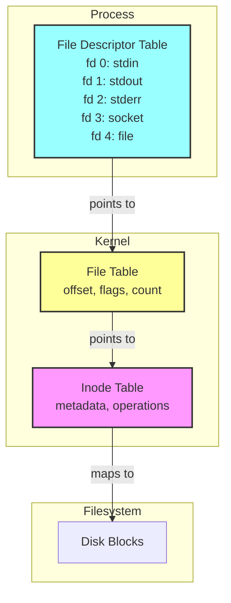
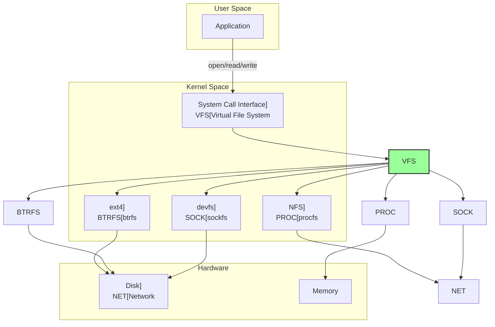

---
tags:
  - FileDescriptor
  - IO
  - VFS
  - Guide
  - SystemProgramming
---

# Chapter 6: File Descriptor와 I/O 모델

## 이 장을 읽으면 답할 수 있는 질문들

- "Everything is a file"의 진짜 의미는?
- File Descriptor 고갈은 어떻게 방지할까?
- O_DIRECT와 Page Cache의 관계는?
- Non-blocking I/O의 내부 동작은?
- io_uring은 epoll보다 왜 빠를까?

---

## 들어가며: 모든 것은 파일이다

Unix의 천재적인 통찰: "Everything is a file"

키보드도 파일이고, 네트워크 소켓도 파일이고, 프로세스 정보도 파일입니다. 심지어 하드웨어 장치도 파일입니다. 이 단순한 추상화가 어떻게 복잡한 시스템을 우아하게 만들었을까요?

`cat /dev/urandom | head`를 실행하면 난수 생성기를 파일처럼 읽습니다. `echo "Hello" > /dev/tcp/google.com/80`을 실행하면 네트워크 연결을 파일처럼 씁니다. 이 마법의 비밀을 파헤쳐봅시다.

## Section 1: File Descriptor 내부 구조 - 숫자 뒤의 비밀

### 1.1 File Descriptor의 3단계 구조



### 1.2 커널 자료구조

```cpp
// 1. 프로세스별 File Descriptor Table
struct files_struct {
    atomic_t count;              // 참조 카운트
    struct fdtable *fdt;         // FD 테이블
    struct fdtable fdtab;        // 기본 테이블
    spinlock_t file_lock;        // 동기화
    int next_fd;                 // 다음 할당할 FD
    unsigned long close_on_exec; // exec 시 닫을 FD
    unsigned long open_fds;      // 열린 FD 비트맵
    struct file *fd_array[NR_OPEN_DEFAULT]; // FD 배열
};

// 2. 시스템 전역 File Table Entry
struct file {
    struct path f_path;          // 파일 경로
    struct inode *f_inode;       // inode 포인터
    const struct file_operations *f_op; // 파일 연산
    
    atomic_long_t f_count;       // 참조 카운트
    unsigned int f_flags;        // 열기 플래그 (O_RDONLY 등)
    fmode_t f_mode;             // 접근 모드
    loff_t f_pos;               // 현재 오프셋
    
    struct fown_struct f_owner;  // 소유자 정보
    void *private_data;          // 드라이버 전용 데이터
    
    struct address_space *f_mapping; // 페이지 캐시
};

// 3. Inode 구조체
struct inode {
    umode_t i_mode;             // 파일 타입과 권한
    uid_t i_uid;                // 소유자 UID
    gid_t i_gid;                // 그룹 GID
    
    const struct inode_operations *i_op;    // inode 연산
    const struct file_operations *i_fop;    // 파일 연산
    
    unsigned long i_ino;        // inode 번호
    dev_t i_rdev;              // 장치 번호 (장치 파일)
    loff_t i_size;             // 파일 크기
    
    struct timespec i_atime;    // 접근 시간
    struct timespec i_mtime;    // 수정 시간
    struct timespec i_ctime;    // 변경 시간
    
    unsigned long i_blocks;     // 할당된 블록 수
    struct address_space i_data; // 페이지 캐시
};
```

### 1.3 File Descriptor 할당과 해제

```cpp
#include <fcntl.h>
#include <unistd.h>
#include <stdio.h>

// FD 할당 과정
int allocate_fd_example() {
    // 1. 가장 낮은 번호의 사용 가능한 FD 찾기
    int fd = open("/tmp/test.txt", O_CREAT | O_RDWR, 0644);
    printf("Allocated FD: %d\n", fd);  // 보통 3 (0,1,2는 표준 입출력)
    
    // 2. dup()으로 FD 복제
    int fd2 = dup(fd);  // 같은 File Table Entry 공유
    printf("Duplicated FD: %d\n", fd2);  // 4
    
    // 3. dup2()로 특정 FD 번호 지정
    int fd3 = dup2(fd, 100);  // FD 100으로 복제
    printf("dup2 FD: %d\n", fd3);  // 100
    
    // FD 정보 확인
    char path[256];
    sprintf(path, "/proc/self/fd/%d", fd);
    char link[256];
    readlink(path, link, sizeof(link));
    printf("FD %d points to: %s\n", fd, link);
    
    // 정리
    close(fd);
    close(fd2);
    close(fd3);
    
    return 0;
}

// FD 제한 확인 및 변경
void check_fd_limits() {
    struct rlimit rlim;
    
    // 현재 제한 확인
    getrlimit(RLIMIT_NOFILE, &rlim);
    printf("Soft limit: %ld\n", rlim.rlim_cur);  // 보통 1024
    printf("Hard limit: %ld\n", rlim.rlim_max);  // 보통 4096 또는 1048576
    
    // 제한 늘리기
    rlim.rlim_cur = 65536;
    if (setrlimit(RLIMIT_NOFILE, &rlim) == 0) {
        printf("Increased soft limit to 65536\n");
    }
    
    // 시스템 전체 제한
    FILE* f = fopen("/proc/sys/fs/file-max", "r");
    long system_max;
    fscanf(f, "%ld", &system_max);
    printf("System-wide max: %ld\n", system_max);
    fclose(f);
}
```

### 1.4 File Descriptor 공유

```cpp
// fork()와 FD 상속
void fd_inheritance() {
    int fd = open("shared.txt", O_RDWR | O_CREAT, 0644);
    write(fd, "Parent", 6);
    
    pid_t pid = fork();
    
    if (pid == 0) {
        // 자식: 같은 FD, 같은 File Table Entry
        write(fd, " Child", 6);  // 오프셋 공유!
        close(fd);
        _exit(0);
    } else {
        // 부모
        wait(NULL);
        
        // 파일 내용 확인
        lseek(fd, 0, SEEK_SET);
        char buffer[20];
        read(fd, buffer, sizeof(buffer));
        printf("File content: %s\n", buffer);  // "Parent Child"
        
        close(fd);
    }
}

// 스레드와 FD 공유
void* thread_func(void* arg) {
    int fd = *(int*)arg;
    
    // 모든 스레드가 같은 FD 테이블 공유
    write(fd, "Thread", 6);
    
    return NULL;
}
```

## Section 2: VFS 레이어 - 추상화의 마법

### 2.1 Virtual File System 구조



### 2.2 File Operations 구조체

```cpp
// VFS의 핵심: 함수 포인터 테이블
struct file_operations {
    struct module *owner;
    loff_t (*llseek)(struct file*, loff_t, int);
    ssize_t (*read)(struct file*, char __user*, size_t, loff_t*);
    ssize_t (*write)(struct file*, const char __user*, size_t, loff_t*);
    ssize_t (*read_iter)(struct kiocb*, struct iov_iter*);
    ssize_t (*write_iter)(struct kiocb*, struct iov_iter*);
    
    int (*ioctl)(struct file*, unsigned int, unsigned long);
    int (*mmap)(struct file*, struct vm_area_struct*);
    int (*open)(struct inode*, struct file*);
    int (*flush)(struct file*, fl_owner_t);
    int (*release)(struct inode*, struct file*);
    int (*fsync)(struct file*, loff_t, loff_t, int);
    
    unsigned int (*poll)(struct file*, struct poll_table_struct*);
    // ... 더 많은 연산들
};

// 예: /dev/null 구현
ssize_t null_read(struct file* file, char __user* buf, 
                 size_t count, loff_t* ppos) {
    return 0;  // EOF
}

ssize_t null_write(struct file* file, const char __user* buf,
                  size_t count, loff_t* ppos) {
    return count;  // 모든 데이터 "소비"
}

static const struct file_operations null_fops = {
    .read = null_read,
    .write = null_write,
    .llseek = noop_llseek,
};

// 예: /proc/meminfo 구현
static int meminfo_proc_show(struct seq_file* m, void* v) {
    struct sysinfo i;
    si_meminfo(&i);
    
    seq_printf(m, "MemTotal:     %8lu kB\n", i.totalram << (PAGE_SHIFT - 10));
    seq_printf(m, "MemFree:      %8lu kB\n", i.freeram << (PAGE_SHIFT - 10));
    seq_printf(m, "MemAvailable: %8lu kB\n", si_mem_available() << (PAGE_SHIFT - 10));
    // ...
    
    return 0;
}
```

### 2.3 특수 파일 시스템들

```cpp
// 1. procfs - 프로세스 정보
void explore_procfs() {
    // 프로세스 정보 읽기
    FILE* f = fopen("/proc/self/status", "r");
    char line[256];
    while (fgets(line, sizeof(line), f)) {
        if (strncmp(line, "VmRSS:", 6) == 0) {
            printf("Resident memory: %s", line);
        }
    }
    fclose(f);
    
    // CPU 정보
    system("cat /proc/cpuinfo | grep 'model name' | head -1");
}

// 2. sysfs - 시스템/장치 정보
void explore_sysfs() {
    // CPU 주파수 읽기
    FILE* f = fopen("/sys/devices/system/cpu/cpu0/cpufreq/scaling_cur_freq", "r");
    long freq;
    fscanf(f, "%ld", &freq);
    printf("CPU0 frequency: %ld MHz\n", freq / 1000);
    fclose(f);
    
    // 네트워크 통계
    f = fopen("/sys/class/net/eth0/statistics/rx_bytes", "r");
    long rx_bytes;
    fscanf(f, "%ld", &rx_bytes);
    printf("eth0 RX bytes: %ld\n", rx_bytes);
    fclose(f);
}

// 3. devfs - 장치 파일
void device_files() {
    // 랜덤 데이터 읽기
    int fd = open("/dev/urandom", O_RDONLY);
    unsigned char random_bytes[16];
    read(fd, random_bytes, sizeof(random_bytes));
    close(fd);
    
    // null 장치에 쓰기
    fd = open("/dev/null", O_WRONLY);
    write(fd, "disappears", 10);
    close(fd);
    
    // zero 장치에서 읽기
    fd = open("/dev/zero", O_RDONLY);
    char zeros[1024];
    read(fd, zeros, sizeof(zeros));  // 모두 0
    close(fd);
}
```

## Section 3: I/O 모델 진화 - Blocking에서 Async까지

### 3.1 Blocking I/O

```cpp
// 전통적인 Blocking I/O
void blocking_io() {
    int fd = open("large_file.dat", O_RDONLY);
    char buffer[4096];
    
    // read()는 데이터가 준비될 때까지 블록
    ssize_t bytes = read(fd, buffer, sizeof(buffer));
    // 커널에서:
    // 1. 디스크 I/O 요청
    // 2. 프로세스를 sleep 상태로
    // 3. I/O 완료 인터럽트
    // 4. 프로세스 깨우기
    // 5. 데이터 복사 후 리턴
    
    printf("Read %zd bytes\n", bytes);
    close(fd);
}

// Blocking I/O의 문제점
void blocking_problem() {
    int server_fd = socket(AF_INET, SOCK_STREAM, 0);
    // ... bind, listen ...
    
    while (1) {
        // accept()에서 블록 - 다른 클라이언트 처리 불가
        int client_fd = accept(server_fd, NULL, NULL);
        
        char buffer[1024];
        // read()에서 블록 - 다른 클라이언트 처리 불가
        read(client_fd, buffer, sizeof(buffer));
        
        // 한 번에 한 클라이언트만 처리 가능!
        process_request(buffer);
        close(client_fd);
    }
}
```

### 3.2 Non-blocking I/O

```cpp
#include <fcntl.h>
#include <errno.h>

// Non-blocking 모드 설정
void set_nonblocking(int fd) {
    int flags = fcntl(fd, F_GETFL, 0);
    fcntl(fd, F_SETFL, flags | O_NONBLOCK);
}

// Non-blocking I/O 사용
void nonblocking_io() {
    int fd = socket(AF_INET, SOCK_STREAM, 0);
    set_nonblocking(fd);
    
    // connect()가 즉시 리턴
    if (connect(fd, (struct sockaddr*)&addr, sizeof(addr)) < 0) {
        if (errno == EINPROGRESS) {
            printf("Connection in progress...\n");
            
            // 연결 완료 대기
            fd_set write_fds;
            FD_ZERO(&write_fds);
            FD_SET(fd, &write_fds);
            
            select(fd + 1, NULL, &write_fds, NULL, NULL);
            
            // 연결 성공 여부 확인
            int error;
            socklen_t len = sizeof(error);
            getsockopt(fd, SOL_SOCKET, SO_ERROR, &error, &len);
            
            if (error == 0) {
                printf("Connected!\n");
            }
        }
    }
    
    // Non-blocking read
    char buffer[1024];
    ssize_t bytes;
    
    while ((bytes = read(fd, buffer, sizeof(buffer))) == -1) {
        if (errno == EAGAIN || errno == EWOULDBLOCK) {
            // 데이터 아직 없음
            printf("No data available, doing other work...\n");
            do_other_work();
            usleep(1000);
        } else {
            perror("read");
            break;
        }
    }
}
```

### 3.3 I/O Multiplexing

```cpp
// select() - 전통적 방법
void select_example() {
    fd_set read_fds, write_fds;
    int max_fd = 0;
    
    FD_ZERO(&read_fds);
    FD_ZERO(&write_fds);
    
    // 관심 있는 FD 추가
    for (int i = 0; i < num_clients; i++) {
        FD_SET(client_fds[i], &read_fds);
        max_fd = MAX(max_fd, client_fds[i]);
    }
    
    struct timeval timeout = {.tv_sec = 5, .tv_usec = 0};
    
    // 여러 FD 동시 감시
    int ready = select(max_fd + 1, &read_fds, &write_fds, NULL, &timeout);
    
    if (ready > 0) {
        for (int i = 0; i < num_clients; i++) {
            if (FD_ISSET(client_fds[i], &read_fds)) {
                handle_client_data(client_fds[i]);
            }
        }
    }
}

// poll() - select()의 개선
void poll_example() {
    struct pollfd fds[MAX_CLIENTS];
    
    for (int i = 0; i < num_clients; i++) {
        fds[i].fd = client_fds[i];
        fds[i].events = POLLIN | POLLOUT;
    }
    
    int ready = poll(fds, num_clients, 5000);  // 5초 타임아웃
    
    for (int i = 0; i < num_clients && ready > 0; i++) {
        if (fds[i].revents & POLLIN) {
            handle_read(fds[i].fd);
            ready--;
        }
        if (fds[i].revents & POLLOUT) {
            handle_write(fds[i].fd);
            ready--;
        }
    }
}
```

### 3.4 Asynchronous I/O (AIO)

```cpp
#include <aio.h>

// POSIX AIO
void posix_aio_example() {
    struct aiocb cb;
    char buffer[4096];
    
    memset(&cb, 0, sizeof(cb));
    cb.aio_fildes = open("large_file.dat", O_RDONLY);
    cb.aio_buf = buffer;
    cb.aio_nbytes = sizeof(buffer);
    cb.aio_offset = 0;
    
    // 비동기 읽기 시작
    if (aio_read(&cb) == -1) {
        perror("aio_read");
        return;
    }
    
    // 다른 작업 수행
    do_other_work();
    
    // 완료 대기
    while (aio_error(&cb) == EINPROGRESS) {
        printf("Still in progress...\n");
        usleep(1000);
    }
    
    // 결과 확인
    ssize_t bytes = aio_return(&cb);
    printf("Read %zd bytes asynchronously\n", bytes);
    
    close(cb.aio_fildes);
}

// Linux Native AIO (libaio)
#include <libaio.h>

void linux_aio_example() {
    io_context_t ctx = 0;
    struct iocb cb;
    struct iocb* cbs[1];
    struct io_event events[1];
    char buffer[4096];
    
    // AIO 컨텍스트 초기화
    io_setup(128, &ctx);
    
    int fd = open("file.dat", O_RDONLY | O_DIRECT);
    
    // I/O 요청 준비
    io_prep_pread(&cb, fd, buffer, sizeof(buffer), 0);
    cbs[0] = &cb;
    
    // 비동기 I/O 제출
    int ret = io_submit(ctx, 1, cbs);
    
    // 완료 이벤트 대기
    ret = io_getevents(ctx, 1, 1, events, NULL);
    
    printf("AIO completed: %ld bytes\n", events[0].res);
    
    close(fd);
    io_destroy(ctx);
}
```

## Section 4: 버퍼링과 캐싱 - 성능의 비밀

### 4.1 Kernel Buffer와 Page Cache

```cpp
// Page Cache의 동작
void page_cache_demo() {
    const char* filename = "test.dat";
    const size_t size = 100 * 1024 * 1024;  // 100MB
    
    // 1. 파일 생성 및 쓰기
    int fd = open(filename, O_CREAT | O_WRONLY, 0644);
    char* data = malloc(size);
    memset(data, 'A', size);
    
    clock_t start = clock();
    write(fd, data, size);  // Page Cache에 쓰기
    fsync(fd);              // 디스크에 플러시
    clock_t write_time = clock() - start;
    close(fd);
    
    // 2. 첫 번째 읽기 (디스크에서)
    fd = open(filename, O_RDONLY);
    start = clock();
    read(fd, data, size);
    clock_t first_read = clock() - start;
    close(fd);
    
    // 3. 두 번째 읽기 (Page Cache에서)
    fd = open(filename, O_RDONLY);
    start = clock();
    read(fd, data, size);
    clock_t cached_read = clock() - start;
    close(fd);
    
    printf("Write time: %ld ms\n", write_time * 1000 / CLOCKS_PER_SEC);
    printf("First read: %ld ms\n", first_read * 1000 / CLOCKS_PER_SEC);
    printf("Cached read: %ld ms\n", cached_read * 1000 / CLOCKS_PER_SEC);
    
    // 결과 예시:
    // Write time: 500 ms
    // First read: 300 ms
    // Cached read: 50 ms (6배 빠름!)
    
    free(data);
    unlink(filename);
}

// Page Cache 통계 확인
void check_page_cache() {
    FILE* f = fopen("/proc/meminfo", "r");
    char line[256];
    
    while (fgets(line, sizeof(line), f)) {
        if (strstr(line, "Cached:") || 
            strstr(line, "Buffers:") ||
            strstr(line, "Dirty:") ||
            strstr(line, "Writeback:")) {
            printf("%s", line);
        }
    }
    fclose(f);
    
    // 캐시 비우기 (root 권한 필요)
    // echo 3 > /proc/sys/vm/drop_caches
}
```

### 4.2 O_DIRECT - Page Cache 우회

```cpp
#define _GNU_SOURCE
#include <fcntl.h>
#include <stdlib.h>

// O_DIRECT 사용 시 주의사항
void direct_io_example() {
    const size_t block_size = 4096;
    const size_t buffer_size = 1024 * 1024;  // 1MB
    
    // 정렬된 메모리 할당 (O_DIRECT 요구사항)
    void* buffer;
    if (posix_memalign(&buffer, block_size, buffer_size) != 0) {
        perror("posix_memalign");
        return;
    }
    
    // O_DIRECT로 열기
    int fd = open("direct.dat", O_RDWR | O_CREAT | O_DIRECT, 0644);
    if (fd < 0) {
        perror("open O_DIRECT");
        free(buffer);
        return;
    }
    
    // 블록 크기 단위로 쓰기
    memset(buffer, 'D', buffer_size);
    ssize_t written = write(fd, buffer, buffer_size);
    
    if (written < 0) {
        perror("write");
    } else {
        printf("Direct I/O: wrote %zd bytes\n", written);
    }
    
    // 읽기도 정렬 필요
    lseek(fd, 0, SEEK_SET);
    ssize_t bytes_read = read(fd, buffer, buffer_size);
    printf("Direct I/O: read %zd bytes\n", bytes_read);
    
    close(fd);
    free(buffer);
}

// O_DIRECT vs Buffered I/O 성능 비교
void compare_direct_vs_buffered() {
    const size_t size = 100 * 1024 * 1024;  // 100MB
    void* aligned_buffer;
    posix_memalign(&aligned_buffer, 4096, size);
    
    // Buffered I/O
    int fd = open("buffered.dat", O_RDWR | O_CREAT | O_TRUNC, 0644);
    clock_t start = clock();
    write(fd, aligned_buffer, size);
    fsync(fd);  // 공정한 비교를 위해
    printf("Buffered I/O: %ld ms\n", 
           (clock() - start) * 1000 / CLOCKS_PER_SEC);
    close(fd);
    
    // Direct I/O
    fd = open("direct.dat", O_RDWR | O_CREAT | O_TRUNC | O_DIRECT, 0644);
    start = clock();
    write(fd, aligned_buffer, size);
    printf("Direct I/O: %ld ms\n",
           (clock() - start) * 1000 / CLOCKS_PER_SEC);
    close(fd);
    
    free(aligned_buffer);
    
    // 결과 예시:
    // Buffered I/O: 200 ms (Page Cache 활용)
    // Direct I/O: 500 ms (직접 디스크 접근)
    // 하지만 Direct I/O는 메모리를 절약하고 예측 가능한 성능 제공
}
```

### 4.3 madvise와 fadvise

```cpp
#include <sys/mman.h>

// 메모리 매핑 파일 최적화
void mmap_optimization() {
    int fd = open("large_file.dat", O_RDONLY);
    struct stat st;
    fstat(fd, &st);
    
    // 파일을 메모리에 매핑
    void* map = mmap(NULL, st.st_size, PROT_READ, MAP_PRIVATE, fd, 0);
    
    // 커널에 접근 패턴 힌트 제공
    madvise(map, st.st_size, MADV_SEQUENTIAL);  // 순차 접근
    // MADV_RANDOM - 랜덤 접근
    // MADV_WILLNEED - 곧 필요함 (prefetch)
    // MADV_DONTNEED - 더 이상 불필요
    
    // 파일 처리
    process_file(map, st.st_size);
    
    // 메모리 해제 힌트
    madvise(map, st.st_size, MADV_DONTNEED);
    
    munmap(map, st.st_size);
    close(fd);
}

// 파일 I/O 최적화
void file_advice() {
    int fd = open("video.mp4", O_RDONLY);
    struct stat st;
    fstat(fd, &st);
    
    // 커널에 파일 접근 패턴 알림
    posix_fadvise(fd, 0, st.st_size, POSIX_FADV_SEQUENTIAL);
    // POSIX_FADV_RANDOM - 랜덤 접근
    // POSIX_FADV_NOREUSE - 재사용 안함
    // POSIX_FADV_WILLNEED - prefetch
    // POSIX_FADV_DONTNEED - 캐시에서 제거
    
    // 스트리밍 읽기
    char buffer[4096];
    off_t offset = 0;
    
    while (offset < st.st_size) {
        ssize_t bytes = pread(fd, buffer, sizeof(buffer), offset);
        if (bytes <= 0) break;
        
        process_video_chunk(buffer, bytes);
        offset += bytes;
        
        // 처리한 부분은 캐시에서 제거
        posix_fadvise(fd, offset - bytes, bytes, POSIX_FADV_DONTNEED);
    }
    
    close(fd);
}
```

## Section 5: 고급 I/O 인터페이스 - 극한의 성능

### 5.1 sendfile - Zero Copy

```cpp
#include <sys/sendfile.h>

// 파일 서빙 - 전통적 방법
void traditional_file_serving(int client_fd, const char* filename) {
    int file_fd = open(filename, O_RDONLY);
    char buffer[8192];
    
    ssize_t bytes;
    while ((bytes = read(file_fd, buffer, sizeof(buffer))) > 0) {
        // 커널 → 사용자 공간 → 커널 (2번 복사!)
        send(client_fd, buffer, bytes, 0);
    }
    
    close(file_fd);
}

// sendfile - Zero Copy
void zero_copy_file_serving(int client_fd, const char* filename) {
    int file_fd = open(filename, O_RDONLY);
    struct stat st;
    fstat(file_fd, &st);
    
    // 커널 내에서 직접 전송 (Zero Copy!)
    off_t offset = 0;
    ssize_t sent = sendfile(client_fd, file_fd, &offset, st.st_size);
    
    printf("Sent %zd bytes with zero copy\n", sent);
    close(file_fd);
}

// splice - 파이프를 통한 Zero Copy
void splice_example() {
    int pipe_fd[2];
    pipe(pipe_fd);
    
    int in_fd = open("input.dat", O_RDONLY);
    int out_fd = open("output.dat", O_WRONLY | O_CREAT, 0644);
    
    // 파일 → 파이프 (Zero Copy)
    loff_t off_in = 0;
    ssize_t spliced = splice(in_fd, &off_in, pipe_fd[1], NULL,
                            65536, SPLICE_F_MOVE);
    
    // 파이프 → 파일 (Zero Copy)
    loff_t off_out = 0;
    splice(pipe_fd[0], NULL, out_fd, &off_out,
           spliced, SPLICE_F_MOVE);
    
    close(in_fd);
    close(out_fd);
    close(pipe_fd[0]);
    close(pipe_fd[1]);
}
```

### 5.2 io_uring - 차세대 비동기 I/O

```cpp
#include <liburing.h>

// io_uring 기본 사용
void io_uring_example() {
    struct io_uring ring;
    struct io_uring_sqe *sqe;
    struct io_uring_cqe *cqe;
    
    // io_uring 초기화
    io_uring_queue_init(32, &ring, 0);
    
    // 파일 열기
    int fd = open("test.dat", O_RDONLY);
    char buffer[4096];
    
    // SQE (Submission Queue Entry) 획득
    sqe = io_uring_get_sqe(&ring);
    
    // 읽기 요청 준비
    io_uring_prep_read(sqe, fd, buffer, sizeof(buffer), 0);
    sqe->user_data = 1;  // 요청 식별자
    
    // 요청 제출
    io_uring_submit(&ring);
    
    // 완료 대기
    io_uring_wait_cqe(&ring, &cqe);
    
    if (cqe->res < 0) {
        printf("Error: %s\n", strerror(-cqe->res));
    } else {
        printf("Read %d bytes\n", cqe->res);
    }
    
    // CQE 처리 완료 표시
    io_uring_cqe_seen(&ring, cqe);
    
    close(fd);
    io_uring_queue_exit(&ring);
}

// io_uring 배치 처리
void io_uring_batch() {
    struct io_uring ring;
    io_uring_queue_init(256, &ring, 0);
    
    int files[10];
    char buffers[10][4096];
    
    // 10개 파일 동시 읽기
    for (int i = 0; i < 10; i++) {
        char filename[32];
        sprintf(filename, "file%d.dat", i);
        files[i] = open(filename, O_RDONLY);
        
        struct io_uring_sqe* sqe = io_uring_get_sqe(&ring);
        io_uring_prep_read(sqe, files[i], buffers[i], 4096, 0);
        sqe->user_data = i;
    }
    
    // 모든 요청 한 번에 제출
    io_uring_submit(&ring);
    
    // 완료된 요청 처리
    struct io_uring_cqe* cqe;
    for (int i = 0; i < 10; i++) {
        io_uring_wait_cqe(&ring, &cqe);
        
        int idx = cqe->user_data;
        printf("File %d: read %d bytes\n", idx, cqe->res);
        
        io_uring_cqe_seen(&ring, cqe);
        close(files[idx]);
    }
    
    io_uring_queue_exit(&ring);
}

// io_uring vs epoll 성능 비교
void benchmark_io_uring_vs_epoll() {
    const int num_files = 100;
    const int iterations = 10000;
    
    // epoll 벤치마크
    clock_t start = clock();
    benchmark_with_epoll(num_files, iterations);
    printf("epoll: %ld ms\n", (clock() - start) * 1000 / CLOCKS_PER_SEC);
    
    // io_uring 벤치마크
    start = clock();
    benchmark_with_io_uring(num_files, iterations);
    printf("io_uring: %ld ms\n", (clock() - start) * 1000 / CLOCKS_PER_SEC);
    
    // 결과 예시:
    // epoll: 500 ms
    // io_uring: 200 ms (2.5배 빠름!)
    // - 시스템 콜 감소
    // - 배치 처리
    // - 커널/사용자 공간 전환 최소화
}
```

## Section 6: 파일 잠금 - 동시성 제어

### 6.1 Advisory vs Mandatory Locking

```cpp
#include <fcntl.h>

// Advisory Locking (협조적)
void advisory_locking() {
    int fd = open("shared.dat", O_RDWR);
    
    // 전체 파일 잠금
    struct flock lock = {
        .l_type = F_WRLCK,    // 쓰기 잠금
        .l_whence = SEEK_SET,
        .l_start = 0,
        .l_len = 0,           // 0 = 전체 파일
    };
    
    // 잠금 시도
    if (fcntl(fd, F_SETLK, &lock) == -1) {
        if (errno == EACCES || errno == EAGAIN) {
            printf("File is locked by another process\n");
            
            // 잠금 정보 확인
            struct flock info;
            fcntl(fd, F_GETLK, &info);
            printf("Locked by PID %d\n", info.l_pid);
        }
    } else {
        printf("Lock acquired\n");
        
        // 크리티컬 섹션
        do_critical_work(fd);
        
        // 잠금 해제
        lock.l_type = F_UNLCK;
        fcntl(fd, F_SETLK, &lock);
    }
    
    close(fd);
}

// 파일 영역 잠금
void range_locking() {
    int fd = open("database.dat", O_RDWR);
    
    // 레코드별 잠금 (100바이트씩)
    int record_id = 5;
    struct flock lock = {
        .l_type = F_WRLCK,
        .l_whence = SEEK_SET,
        .l_start = record_id * 100,
        .l_len = 100,
    };
    
    // 블로킹 잠금 (대기)
    fcntl(fd, F_SETLKW, &lock);
    
    // 레코드 수정
    lseek(fd, record_id * 100, SEEK_SET);
    write(fd, "updated", 7);
    
    // 잠금 해제
    lock.l_type = F_UNLCK;
    fcntl(fd, F_SETLK, &lock);
    
    close(fd);
}

// flock() - 간단한 파일 잠금
void flock_example() {
    int fd = open("simple.lock", O_CREAT | O_RDWR, 0644);
    
    // 배타적 잠금
    if (flock(fd, LOCK_EX | LOCK_NB) == -1) {
        if (errno == EWOULDBLOCK) {
            printf("Cannot acquire lock\n");
        }
    } else {
        printf("Lock acquired with flock\n");
        
        // 작업 수행
        sleep(5);
        
        // 자동 해제 (close 시)
    }
    
    close(fd);  // 잠금 자동 해제
}
```

## 실전: 고성능 I/O 시스템 구축

### Case Study 1: 고성능 웹 서버

```cpp
// Nginx 스타일 이벤트 기반 파일 서빙
struct file_serving_context {
    int client_fd;
    int file_fd;
    off_t offset;
    size_t remaining;
};

void high_performance_file_server() {
    struct io_uring ring;
    io_uring_queue_init(1024, &ring, IORING_SETUP_SQPOLL);
    
    // SQPOLL: 커널 스레드가 SQ 폴링 (시스템 콜 없음!)
    
    while (1) {
        // Accept 요청
        struct io_uring_sqe* sqe = io_uring_get_sqe(&ring);
        io_uring_prep_accept(sqe, listen_fd, NULL, NULL, 0);
        sqe->user_data = TYPE_ACCEPT;
        
        io_uring_submit(&ring);
        
        struct io_uring_cqe* cqe;
        io_uring_wait_cqe(&ring, &cqe);
        
        if (cqe->user_data == TYPE_ACCEPT) {
            int client_fd = cqe->res;
            
            // HTTP 요청 읽기
            sqe = io_uring_get_sqe(&ring);
            io_uring_prep_recv(sqe, client_fd, request_buffer, 
                              sizeof(request_buffer), 0);
            sqe->user_data = TYPE_HTTP_REQUEST | (client_fd << 8);
        }
        // ... 파일 전송은 sendfile/splice 사용
    }
}
```

### Case Study 2: 데이터베이스 WAL (Write-Ahead Logging)

```cpp
// PostgreSQL 스타일 WAL 구현
struct wal_writer {
    int wal_fd;
    char* wal_buffer;
    size_t buffer_size;
    size_t buffer_pos;
};

void wal_write(struct wal_writer* wal, const void* data, size_t len) {
    // 버퍼링
    if (wal->buffer_pos + len <= wal->buffer_size) {
        memcpy(wal->wal_buffer + wal->buffer_pos, data, len);
        wal->buffer_pos += len;
        return;
    }
    
    // 버퍼 플러시
    wal_flush(wal);
    
    // 큰 데이터는 직접 쓰기
    if (len > wal->buffer_size / 2) {
        // O_DIRECT로 우회
        write(wal->wal_fd, data, len);
        fdatasync(wal->wal_fd);  // 메타데이터는 동기화 안함
    } else {
        memcpy(wal->wal_buffer, data, len);
        wal->buffer_pos = len;
    }
}

void wal_flush(struct wal_writer* wal) {
    if (wal->buffer_pos == 0) return;
    
    // Group Commit: 여러 트랜잭션 한 번에 플러시
    write(wal->wal_fd, wal->wal_buffer, wal->buffer_pos);
    
    // 선택적 동기화
    #ifdef LINUX
        // Linux: 데이터만 동기화
        fdatasync(wal->wal_fd);
    #else
        // 다른 OS: 전체 동기화
        fsync(wal->wal_fd);
    #endif
    
    wal->buffer_pos = 0;
}
```

### Case Study 3: 비디오 스트리밍 서버

```cpp
// 적응형 비트레이트 스트리밍
void adaptive_video_streaming(int client_fd, const char* video_file) {
    int video_fd = open(video_file, O_RDONLY);
    struct stat st;
    fstat(video_fd, &st);
    
    // 클라이언트 대역폭 측정
    int bandwidth = measure_client_bandwidth(client_fd);
    
    // mmap으로 비디오 파일 매핑
    void* video_data = mmap(NULL, st.st_size, PROT_READ, 
                           MAP_PRIVATE, video_fd, 0);
    
    // Read-ahead 힌트
    madvise(video_data, st.st_size, MADV_SEQUENTIAL);
    
    size_t chunk_size = calculate_chunk_size(bandwidth);
    off_t offset = 0;
    
    while (offset < st.st_size) {
        // 청크 전송
        size_t to_send = MIN(chunk_size, st.st_size - offset);
        
        // Zero-copy 전송
        sendfile(client_fd, video_fd, &offset, to_send);
        
        // 대역폭 재측정 및 조정
        if (offset % (10 * chunk_size) == 0) {
            bandwidth = measure_client_bandwidth(client_fd);
            chunk_size = calculate_chunk_size(bandwidth);
        }
        
        // 전송한 부분 메모리 해제 힌트
        madvise(video_data + offset - to_send, to_send, MADV_DONTNEED);
    }
    
    munmap(video_data, st.st_size);
    close(video_fd);
}
```

## 정리: 핵심 포인트

### 🎯 꼭 기억해야 할 것들

1. **File Descriptor 구조**
   - FD → File Table → Inode
   - fork()는 FD 공유, exec()는 상속
   - 제한 확인 및 조정 중요

2. **VFS 추상화**
   - Everything is a file
   - 일관된 인터페이스
   - 다양한 파일시스템 지원

3. **I/O 모델 선택**
   - Blocking: 간단하지만 확장성 낮음
   - Non-blocking + epoll: 높은 동시성
   - io_uring: 최고 성능

4. **버퍼링과 캐싱**
   - Page Cache 활용
   - O_DIRECT는 신중히
   - madvise/fadvise로 힌트

5. **Zero Copy 기법**
   - sendfile: 파일 → 소켓
   - splice: 파이프 활용
   - mmap: 메모리 매핑

### 📚 더 깊이 알고 싶다면

**관련 문서:**

### 선행 지식
- [Process & Thread](chapter-04-process-thread/index.md) - 프로세스와 파일 디스크립터
- [System Calls](chapter-05-2-interrupt-and-exception.md) - 시스템 호출 메커니즘

### 관련 주제
- [Async I/O Programming](chapter-06-4-async-io-and-event-programming.md) - 비동기 I/O
- [VFS Implementation](chapter-06-2-vfs-and-filesystem-abstraction.md) - 가상 파일 시스템
- [Network Programming](chapter-07-network-programming.md) - 네트워크 소켓

**추가로 필요한 문서 (TODO):**
- VFS 내부 구현
- io_uring 심화
- 파일시스템별 특성
- inotify와 파일 모니터링
- FUSE 사용자 공간 파일시스템

### 💡 실전 팁

```bash
# FD 사용량 확인
ls /proc/$(pidof myapp)/fd | wc -l

# 시스템 FD 제한
cat /proc/sys/fs/file-max

# 프로세스 FD 제한
ulimit -n

# Page Cache 통계
vmstat 1

# I/O 통계
iostat -x 1

# io_uring 지원 확인
grep io_uring /proc/kallsyms
```

다음 장에서는 네트워크 프로그래밍의 진화를 다룹니다. C10K 문제에서 C10M으로, select에서 io_uring까지, 그리고 DPDK같은 커널 우회 기술까지 살펴보겠습니다.