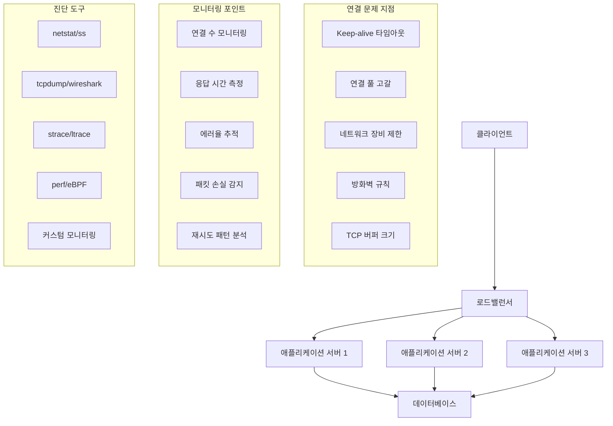

---
tags:
  - Network Debugging
  - TCP Connection
  - Socket Programming
  - Connection Pool
---

# TCP 연결 문제 해결: "연결이 자꾸 끊어져요"

## 상황: 불안정한 TCP 연결

"안녕하세요, 마이크로서비스 간 통신에서 TCP 연결이 간헐적으로 끊어지는 문제가 있습니다. 로드밸런서를 통해 API를 호출하는데, 가끔씩 '연결이 재설정되었습니다' 오류가 발생해요. 특히 트래픽이 많을 때 더 자주 발생하는 것 같습니다. 어떻게 원인을 찾고 해결할 수 있을까요?"

이런 TCP 연결 문제는 분산 시스템에서 가장 흔하면서도 까다로운 문제 중 하나입니다. 체계적인 네트워크 디버깅이 필요합니다.

## TCP 연결 상태 분석



## 1. TCP 연결 진단 도구

종합적인 TCP 연결 문제 분석을 위한 C 기반 도구입니다.

```c
// tcp_connection_analyzer.c
#include <stdio.h>
#include <stdlib.h>
#include <string.h>
#include <unistd.h>
#include <sys/socket.h>
#include <netinet/in.h>
#include <netinet/tcp.h>
#include <arpa/inet.h>
#include <errno.h>
#include <fcntl.h>
#include <sys/epoll.h>
#include <time.h>
#include <signal.h>
#include <pthread.h>
#include <sys/types.h>
#include <ifaddrs.h>
#include <linux/sockios.h>
#include <sys/ioctl.h>

#define MAX_CONNECTIONS 1000
#define MAX_EVENTS 64
#define BUFFER_SIZE 4096
#define DEFAULT_PORT 8080

typedef struct {
    int fd;
    struct sockaddr_in addr;
    time_t connect_time;
    time_t last_activity;
    int state;
    uint64_t bytes_sent;
    uint64_t bytes_received;
    int error_count;
} connection_info_t;

typedef struct {
    connection_info_t connections[MAX_CONNECTIONS];
    int connection_count;
    pthread_mutex_t mutex;
    int running;
    
    // 통계
    uint64_t total_connections;
    uint64_t failed_connections;
    uint64_t bytes_total_sent;
    uint64_t bytes_total_received;
    uint64_t connection_errors;
    
    // 설정
    int target_port;
    char target_host[256];
    int connection_timeout;
    int keep_alive_timeout;
    int max_concurrent;
} tcp_analyzer_t;

static tcp_analyzer_t analyzer;

void print_usage(const char *prog_name) {
    printf("TCP 연결 분석기\n");
    printf("사용법: %s [옵션]\n", prog_name);
    printf("옵션:\n");
    printf("  -h HOST        대상 호스트 (기본값: localhost)\n");
    printf("  -p PORT        대상 포트 (기본값: 8080)\n");
    printf("  -c COUNT       최대 동시 연결 수 (기본값: 100)\n");
    printf("  -t TIMEOUT     연결 타임아웃 (초, 기본값: 30)\n");
    printf("  -k KEEPALIVE   Keep-alive 타임아웃 (초, 기본값: 60)\n");
    printf("  -m MODE        모드: client|server|monitor (기본값: monitor)\n");
    printf("  --help         이 도움말 출력\n");
}

int set_socket_nonblocking(int fd) {
    int flags = fcntl(fd, F_GETFL, 0);
    if (flags == -1) {
        perror("fcntl F_GETFL");
        return -1;
    }
    
    if (fcntl(fd, F_SETFL, flags | O_NONBLOCK) == -1) {
        perror("fcntl F_SETFL");
        return -1;
    }
    
    return 0;
}

int configure_socket_options(int fd) {
    int opt = 1;
    
    // SO_REUSEADDR 설정
    if (setsockopt(fd, SOL_SOCKET, SO_REUSEADDR, &opt, sizeof(opt)) < 0) {
        perror("setsockopt SO_REUSEADDR");
        return -1;
    }
    
    // TCP_NODELAY 설정 (Nagle 알고리즘 비활성화)
    if (setsockopt(fd, IPPROTO_TCP, TCP_NODELAY, &opt, sizeof(opt)) < 0) {
        perror("setsockopt TCP_NODELAY");
        return -1;
    }
    
    // Keep-alive 설정
    if (setsockopt(fd, SOL_SOCKET, SO_KEEPALIVE, &opt, sizeof(opt)) < 0) {
        perror("setsockopt SO_KEEPALIVE");
        return -1;
    }
    
    // Keep-alive 상세 설정
    int keepidle = 30;    // 30초 후 keep-alive 시작
    int keepintvl = 5;    // 5초 간격으로 probe
    int keepcnt = 3;      // 3번 실패 시 연결 종료
    
    if (setsockopt(fd, IPPROTO_TCP, TCP_KEEPIDLE, &keepidle, sizeof(keepidle)) < 0) {
        perror("setsockopt TCP_KEEPIDLE");
    }
    
    if (setsockopt(fd, IPPROTO_TCP, TCP_KEEPINTVL, &keepintvl, sizeof(keepintvl)) < 0) {
        perror("setsockopt TCP_KEEPINTVL");
    }
    
    if (setsockopt(fd, IPPROTO_TCP, TCP_KEEPCNT, &keepcnt, sizeof(keepcnt)) < 0) {
        perror("setsockopt TCP_KEEPCNT");
    }
    
    return 0;
}

void get_socket_info(int fd, char *buffer, size_t buffer_size) {
    struct tcp_info tcp_info;
    socklen_t tcp_info_len = sizeof(tcp_info);
    
    if (getsockopt(fd, IPPROTO_TCP, TCP_INFO, &tcp_info, &tcp_info_len) == 0) {
        snprintf(buffer, buffer_size,
            "상태: %d, RTT: %u us, 재전송: %u, 송신윈도우: %u, 수신윈도우: %u",
            tcp_info.tcpi_state,
            tcp_info.tcpi_rtt,
            tcp_info.tcpi_retrans,
            tcp_info.tcpi_snd_cwnd,
            tcp_info.tcpi_rcv_space
        );
    } else {
        snprintf(buffer, buffer_size, "TCP 정보 조회 실패");
    }
}

void print_connection_stats() {
    pthread_mutex_lock(&analyzer.mutex);
    
    printf("\n=== TCP 연결 분석 결과 ===\n");
    printf("총 연결 시도: %lu\n", analyzer.total_connections);
    printf("실패한 연결: %lu (%.2f%%)\n", 
           analyzer.failed_connections,
           analyzer.total_connections > 0 ? 
           (double)analyzer.failed_connections / analyzer.total_connections * 100 : 0);
    printf("현재 활성 연결: %d\n", analyzer.connection_count);
    printf("총 송신 바이트: %lu\n", analyzer.bytes_total_sent);
    printf("총 수신 바이트: %lu\n", analyzer.bytes_total_received);
    printf("연결 오류: %lu\n", analyzer.connection_errors);
    
    printf("\n=== 활성 연결 상세 ===\n");
    time_t now = time(NULL);
    
    for (int i = 0; i < analyzer.connection_count; i++) {
        connection_info_t *conn = &analyzer.connections[i];
        char addr_str[INET_ADDRSTRLEN];
        char socket_info[512];
        
        inet_ntop(AF_INET, &conn->addr.sin_addr, addr_str, INET_ADDRSTRLEN);
        get_socket_info(conn->fd, socket_info, sizeof(socket_info));
        
        printf("연결 %d: %s:%d\n", i + 1, addr_str, ntohs(conn->addr.sin_port));
        printf("  연결 시간: %ld초 전\n", now - conn->connect_time);
        printf("  마지막 활동: %ld초 전\n", now - conn->last_activity);
        printf("  송신: %lu bytes, 수신: %lu bytes\n", 
               conn->bytes_sent, conn->bytes_received);
        printf("  오류 수: %d\n", conn->error_count);
        printf("  TCP 정보: %s\n", socket_info);
        printf("\n");
    }
    
    pthread_mutex_unlock(&analyzer.mutex);
}

int create_test_connection(const char *host, int port) {
    int fd = socket(AF_INET, SOCK_STREAM, 0);
    if (fd < 0) {
        perror("socket");
        return -1;
    }
    
    if (configure_socket_options(fd) < 0) {
        close(fd);
        return -1;
    }
    
    if (set_socket_nonblocking(fd) < 0) {
        close(fd);
        return -1;
    }
    
    struct sockaddr_in addr;
    memset(&addr, 0, sizeof(addr));
    addr.sin_family = AF_INET;
    addr.sin_port = htons(port);
    
    if (inet_pton(AF_INET, host, &addr.sin_addr) <= 0) {
        perror("inet_pton");
        close(fd);
        return -1;
    }
    
    int result = connect(fd, (struct sockaddr*)&addr, sizeof(addr));
    if (result < 0 && errno != EINPROGRESS) {
        perror("connect");
        close(fd);
        return -1;
    }
    
    return fd;
}

void* connection_monitor_thread(void* arg) {
    while (analyzer.running) {
        print_connection_stats();
        sleep(10);  // 10초마다 통계 출력
    }
    return NULL;
}

void* stress_test_thread(void* arg) {
    int connections_per_thread = *(int*)arg;
    
    for (int i = 0; i < connections_per_thread && analyzer.running; i++) {
        int fd = create_test_connection(analyzer.target_host, analyzer.target_port);
        
        pthread_mutex_lock(&analyzer.mutex);
        analyzer.total_connections++;
        
        if (fd >= 0) {
            if (analyzer.connection_count < MAX_CONNECTIONS) {
                connection_info_t *conn = &analyzer.connections[analyzer.connection_count];
                conn->fd = fd;
                conn->connect_time = time(NULL);
                conn->last_activity = conn->connect_time;
                conn->state = 1;  // 연결됨
                conn->bytes_sent = 0;
                conn->bytes_received = 0;
                conn->error_count = 0;
                analyzer.connection_count++;
            } else {
                close(fd);
            }
        } else {
            analyzer.failed_connections++;
        }
        pthread_mutex_unlock(&analyzer.mutex);
        
        usleep(100000);  // 100ms 대기
    }
    
    return NULL;
}

void run_stress_test(int num_connections, int num_threads) {
    printf("스트레스 테스트 시작: %d개 연결, %d개 스레드\n", 
           num_connections, num_threads);
    
    pthread_t threads[num_threads];
    pthread_t monitor_thread;
    int connections_per_thread = num_connections / num_threads;
    
    analyzer.running = 1;
    
    // 모니터링 스레드 시작
    if (pthread_create(&monitor_thread, NULL, connection_monitor_thread, NULL) != 0) {
        perror("pthread_create monitor");
        return;
    }
    
    // 스트레스 테스트 스레드들 시작
    for (int i = 0; i < num_threads; i++) {
        if (pthread_create(&threads[i], NULL, stress_test_thread, 
                          &connections_per_thread) != 0) {
            perror("pthread_create stress");
            break;
        }
    }
    
    // 스레드들 종료 대기
    for (int i = 0; i < num_threads; i++) {
        pthread_join(threads[i], NULL);
    }
    
    // 30초 더 모니터링
    sleep(30);
    
    analyzer.running = 0;
    pthread_join(monitor_thread, NULL);
    
    // 연결들 정리
    pthread_mutex_lock(&analyzer.mutex);
    for (int i = 0; i < analyzer.connection_count; i++) {
        close(analyzer.connections[i].fd);
    }
    analyzer.connection_count = 0;
    pthread_mutex_unlock(&analyzer.mutex);
    
    print_connection_stats();
}

void analyze_network_stack() {
    printf("\n=== 네트워크 스택 분석 ===\n");
    
    // TCP 연결 상태 분석
    system("echo '=== 현재 TCP 연결 상태 ==='");
    system("ss -tuln | head -20");
    
    printf("\n");
    system("echo '=== TCP 연결 통계 ==='");
    system("ss -s");
    
    printf("\n");
    system("echo '=== 네트워크 인터페이스 통계 ==='");
    system("cat /proc/net/dev | head -10");
    
    printf("\n");
    system("echo '=== TCP 설정 확인 ==='");
    system("sysctl net.ipv4.tcp_keepalive_time");
    system("sysctl net.ipv4.tcp_keepalive_probes");
    system("sysctl net.ipv4.tcp_keepalive_intvl");
    system("sysctl net.core.somaxconn");
    system("sysctl net.ipv4.tcp_max_syn_backlog");
    
    printf("\n");
    system("echo '=== 소켓 통계 ==='");
    system("cat /proc/net/sockstat");
}

void signal_handler(int sig) {
    printf("\n신호 %d 수신, 정리 중...\n", sig);
    analyzer.running = 0;
}

int main(int argc, char *argv[]) {
    // 기본값 설정
    strcpy(analyzer.target_host, "127.0.0.1");
    analyzer.target_port = DEFAULT_PORT;
    analyzer.connection_timeout = 30;
    analyzer.keep_alive_timeout = 60;
    analyzer.max_concurrent = 100;
    
    char mode[20] = "monitor";
    
    // 명령행 인자 처리
    for (int i = 1; i < argc; i++) {
        if (strcmp(argv[i], "-h") == 0 && i + 1 < argc) {
            strcpy(analyzer.target_host, argv[++i]);
        } else if (strcmp(argv[i], "-p") == 0 && i + 1 < argc) {
            analyzer.target_port = atoi(argv[++i]);
        } else if (strcmp(argv[i], "-c") == 0 && i + 1 < argc) {
            analyzer.max_concurrent = atoi(argv[++i]);
        } else if (strcmp(argv[i], "-t") == 0 && i + 1 < argc) {
            analyzer.connection_timeout = atoi(argv[++i]);
        } else if (strcmp(argv[i], "-k") == 0 && i + 1 < argc) {
            analyzer.keep_alive_timeout = atoi(argv[++i]);
        } else if (strcmp(argv[i], "-m") == 0 && i + 1 < argc) {
            strcpy(mode, argv[++i]);
        } else if (strcmp(argv[i], "--help") == 0) {
            print_usage(argv[0]);
            return 0;
        }
    }
    
    // 시그널 핸들러 설정
    signal(SIGINT, signal_handler);
    signal(SIGTERM, signal_handler);
    
    // 뮤텍스 초기화
    if (pthread_mutex_init(&analyzer.mutex, NULL) != 0) {
        perror("pthread_mutex_init");
        return 1;
    }
    
    printf("TCP 연결 분석기 시작\n");
    printf("대상: %s:%d\n", analyzer.target_host, analyzer.target_port);
    printf("모드: %s\n", mode);
    
    if (strcmp(mode, "monitor") == 0) {
        analyze_network_stack();
    } else if (strcmp(mode, "stress") == 0) {
        run_stress_test(analyzer.max_concurrent, 4);
    } else if (strcmp(mode, "client") == 0) {
        // 단일 클라이언트 연결 테스트
        int fd = create_test_connection(analyzer.target_host, analyzer.target_port);
        if (fd >= 0) {
            printf("연결 성공: %d\n", fd);
            
            char socket_info[512];
            get_socket_info(fd, socket_info, sizeof(socket_info));
            printf("TCP 정보: %s\n", socket_info);
            
            sleep(5);
            close(fd);
        } else {
            printf("연결 실패\n");
        }
    }
    
    pthread_mutex_destroy(&analyzer.mutex);
    return 0;
}
```

## 2. 연결 풀 최적화 스크립트

연결 풀과 로드밸런서 설정을 최적화하는 자동화 스크립트입니다.

```bash
#!/bin/bash
# optimize_tcp_connections.sh

set -euo pipefail

# 색상 정의
RED='\033[0;31m'
GREEN='\033[0;32m'
YELLOW='\033[1;33m'
BLUE='\033[0;34m'
NC='\033[0m' # No Color

# 로깅 함수
log_info() {
    echo -e "${BLUE}[INFO]${NC} $1"
}

log_success() {
    echo -e "${GREEN}[SUCCESS]${NC} $1"
}

log_warning() {
    echo -e "${YELLOW}[WARNING]${NC} $1"
}

log_error() {
    echo -e "${RED}[ERROR]${NC} $1"
}

# 기본 설정
DEFAULT_TARGET_HOST="localhost"
DEFAULT_TARGET_PORT="8080"
DEFAULT_MAX_CONNECTIONS="1000"
DEFAULT_KEEPALIVE_TIME="7200"
DEFAULT_TCP_FIN_TIMEOUT="60"

# 설정 파일에서 값 읽기
CONFIG_FILE="tcp_optimization.conf"

load_config() {
    if [[ -f "$CONFIG_FILE" ]]; then
        source "$CONFIG_FILE"
        log_info "설정 파일 로드: $CONFIG_FILE"
    else
        log_warning "설정 파일이 없습니다. 기본값 사용: $CONFIG_FILE"
    fi
    
    # 기본값 설정
    TARGET_HOST=${TARGET_HOST:-$DEFAULT_TARGET_HOST}
    TARGET_PORT=${TARGET_PORT:-$DEFAULT_TARGET_PORT}
    MAX_CONNECTIONS=${MAX_CONNECTIONS:-$DEFAULT_MAX_CONNECTIONS}
    KEEPALIVE_TIME=${KEEPALIVE_TIME:-$DEFAULT_KEEPALIVE_TIME}
    TCP_FIN_TIMEOUT=${TCP_FIN_TIMEOUT:-$DEFAULT_TCP_FIN_TIMEOUT}
}

# 시스템 TCP 설정 최적화
optimize_tcp_settings() {
    log_info "TCP 커널 파라미터 최적화 중..."
    
    # 백업 생성
    if [[ ! -f /etc/sysctl.conf.backup ]]; then
        sudo cp /etc/sysctl.conf /etc/sysctl.conf.backup
        log_info "기존 sysctl.conf 백업 생성"
    fi
    
    # TCP 최적화 설정
    cat << EOF | sudo tee -a /etc/sysctl.conf > /dev/null

# TCP 연결 최적화 설정 ($(date))
# Keep-alive 설정
net.ipv4.tcp_keepalive_time = $KEEPALIVE_TIME
net.ipv4.tcp_keepalive_probes = 9
net.ipv4.tcp_keepalive_intvl = 75

# 연결 재사용 설정
net.ipv4.tcp_tw_reuse = 1
net.ipv4.tcp_fin_timeout = $TCP_FIN_TIMEOUT

# 소켓 버퍼 크기
net.core.rmem_default = 262144
net.core.rmem_max = 16777216
net.core.wmem_default = 262144
net.core.wmem_max = 16777216
net.ipv4.tcp_rmem = 4096 87380 16777216
net.ipv4.tcp_wmem = 4096 65536 16777216

# 연결 큐 크기
net.core.somaxconn = 65535
net.ipv4.tcp_max_syn_backlog = 65535

# 기타 최적화
net.ipv4.tcp_no_metrics_save = 1
net.ipv4.tcp_moderate_rcvbuf = 1
net.ipv4.tcp_congestion_control = bbr
EOF
    
    # 설정 적용
    sudo sysctl -p
    log_success "TCP 설정 최적화 완료"
}

# 연결 상태 분석
analyze_connections() {
    log_info "TCP 연결 상태 분석 중..."
    
    echo "=== TCP 연결 상태 통계 ==="
    ss -s
    
    echo -e "\n=== 연결 상태별 카운트 ==="
    ss -tan | awk 'NR>1 {count[$1]++} END {for (state in count) print state, count[state]}' | sort -k2 -nr
    
    echo -e "\n=== 포트별 연결 수 (상위 10개) ==="
    ss -tan | awk 'NR>1 {split($4,a,":"); count[a[length(a)]]++} END {for (port in count) print port, count[port]}' | sort -k2 -nr | head -10
    
    echo -e "\n=== TIME_WAIT 상태 연결 분석 ==="
    local time_wait_count=$(ss -tan | grep TIME-WAIT | wc -l)
    echo "TIME_WAIT 연결 수: $time_wait_count"
    
    if [[ $time_wait_count -gt 10000 ]]; then
        log_warning "TIME_WAIT 연결이 너무 많습니다 ($time_wait_count). 최적화가 필요합니다."
    fi
    
    echo -e "\n=== 로컬 포트 사용량 ==="
    local local_port_range=$(sysctl net.ipv4.ip_local_port_range | cut -d= -f2)
    echo "로컬 포트 범위: $local_port_range"
    
    local used_ports=$(ss -tan | grep ESTAB | wc -l)
    echo "사용 중인 포트: $used_ports"
}

# 애플리케이션 연결 풀 설정 검증
validate_connection_pools() {
    log_info "애플리케이션 연결 풀 설정 검증 중..."
    
    # Java 애플리케이션의 경우
    if command -v jps >/dev/null 2>&1; then
        echo "=== Java 프로세스 연결 상태 ==="
        for pid in $(jps -q); do
            if [[ -n $pid ]]; then
                local java_app=$(jps | grep $pid | cut -d' ' -f2-)
                echo "Java 애플리케이션: $java_app (PID: $pid)"
                
                # 해당 프로세스의 소켓 연결 수
                local socket_count=$(lsof -p $pid 2>/dev/null | grep 'IPv4.*TCP' | wc -l)
                echo "  TCP 소켓 수: $socket_count"
                
                # TCP 연결 상태
                lsof -p $pid 2>/dev/null | grep 'IPv4.*TCP' | awk '{print $8}' | sort | uniq -c
                echo ""
            fi
        done
    fi
    
    # Node.js 애플리케이션의 경우
    if pgrep node >/dev/null; then
        echo "=== Node.js 프로세스 연결 상태 ==="
        for pid in $(pgrep node); do
            local cmd=$(ps -p $pid -o cmd --no-headers | head -1)
            echo "Node.js 애플리케이션: $cmd (PID: $pid)"
            
            local socket_count=$(lsof -p $pid 2>/dev/null | grep 'IPv4.*TCP' | wc -l)
            echo "  TCP 소켓 수: $socket_count"
            echo ""
        done
    fi
}

# 네트워크 지연 시간 테스트
test_network_latency() {
    local target_host=$1
    local target_port=$2
    
    log_info "네트워크 지연시간 테스트: $target_host:$target_port"
    
    # TCP 연결 시간 측정
    for i in {1..5}; do
        local start_time=$(date +%s%N)
        if timeout 5s bash -c "echo >/dev/tcp/$target_host/$target_port" 2>/dev/null; then
            local end_time=$(date +%s%N)
            local duration=$((($end_time - $start_time) / 1000000)) # 밀리초로 변환
            echo "연결 시도 $i: ${duration}ms"
        else
            echo "연결 시도 $i: 실패"
        fi
        sleep 1
    done
}

# 연결 풀 부하 테스트
stress_test_connections() {
    local target_host=$1
    local target_port=$2
    local max_connections=$3
    
    log_info "연결 풀 부하 테스트 시작: $max_connections개 동시 연결"
    
    # 임시 파일 생성
    local temp_dir=$(mktemp -d)
    local success_count=0
    local failure_count=0
    
    # 동시 연결 생성
    for ((i=1; i<=max_connections; i++)); do
        {
            if timeout 10s bash -c "echo 'test' >/dev/tcp/$target_host/$target_port" 2>/dev/null; then
                echo "success" > "$temp_dir/conn_$i"
            else
                echo "failure" > "$temp_dir/conn_$i"
            fi
        } &
        
        # 동시 실행 프로세스 수 제한
        if (( i % 100 == 0 )); then
            wait
        fi
    done
    
    # 모든 백그라운드 프로세스 완료 대기
    wait
    
    # 결과 집계
    success_count=$(grep -l "success" "$temp_dir"/conn_* 2>/dev/null | wc -l)
    failure_count=$(grep -l "failure" "$temp_dir"/conn_* 2>/dev/null | wc -l)
    
    echo "=== 부하 테스트 결과 ==="
    echo "성공한 연결: $success_count"
    echo "실패한 연결: $failure_count"
    echo "성공률: $(( success_count * 100 / max_connections ))%"
    
    # 정리
    rm -rf "$temp_dir"
    
    if (( failure_count > max_connections / 10 )); then
        log_warning "실패율이 10%를 초과합니다. 연결 풀 설정을 검토하세요."
    fi
}

# 연결 풀 모니터링
monitor_connections() {
    local duration=${1:-60}
    
    log_info "연결 상태 모니터링 시작 (${duration}초)"
    
    local end_time=$(($(date +%s) + duration))
    
    while [[ $(date +%s) -lt $end_time ]]; do
        clear
        echo "=== TCP 연결 모니터링 ($(date)) ==="
        
        # 연결 상태 요약
        echo "현재 연결 상태:"
        ss -s | grep TCP
        
        echo -e "\n포트별 연결 수 (상위 5개):"
        ss -tan | awk 'NR>1 {split($4,a,":"); count[a[length(a)]]++} END {for (port in count) print port, count[port]}' | sort -k2 -nr | head -5
        
        echo -e "\n연결 상태별 분포:"
        ss -tan | awk 'NR>1 {count[$1]++} END {for (state in count) print state, count[state]}' | sort -k2 -nr
        
        echo -e "\n시스템 부하:"
        uptime
        
        sleep 10
    done
}

# 로드밸런서 설정 생성
generate_haproxy_config() {
    local backend_servers=$1
    
    log_info "HAProxy 설정 파일 생성 중..."
    
    cat << EOF > haproxy_optimized.cfg
global
    daemon
    maxconn 4096
    log stdout local0
    
defaults
    mode http
    timeout connect 5000ms
    timeout client 50000ms
    timeout server 50000ms
    option httplog
    option dontlognull
    retries 3
    option redispatch
    
frontend web_frontend
    bind *:80
    option httpclose
    option forwardfor
    default_backend web_servers
    
backend web_servers
    balance roundrobin
    option httpchk GET /health
    timeout check 3000ms
    
EOF

    # 백엔드 서버 추가
    IFS=',' read -ra SERVERS <<< "$backend_servers"
    for i in "${!SERVERS[@]}"; do
        echo "    server web$((i+1)) ${SERVERS[i]} check" >> haproxy_optimized.cfg
    done
    
    log_success "HAProxy 설정 파일 생성 완료: haproxy_optimized.cfg"
}

# Nginx 설정 생성
generate_nginx_config() {
    local backend_servers=$1
    
    log_info "Nginx 설정 파일 생성 중..."
    
    cat << EOF > nginx_optimized.conf
upstream backend_servers {
    # 연결 풀 최적화
    keepalive 100;
    keepalive_requests 1000;
    keepalive_timeout 60s;
    
EOF

    # 백엔드 서버 추가
    IFS=',' read -ra SERVERS <<< "$backend_servers"
    for server in "${SERVERS[@]}"; do
        echo "    server $server max_fails=3 fail_timeout=30s;" >> nginx_optimized.conf
    done
    
    cat << EOF >> nginx_optimized.conf
}

server {
    listen 80;
    
    # 연결 최적화
    keepalive_timeout 65;
    keepalive_requests 100;
    
    location / {
        proxy_pass http://backend_servers;
        proxy_http_version 1.1;
        proxy_set_header Connection "";
        proxy_set_header Host \$host;
        proxy_set_header X-Real-IP \$remote_addr;
        proxy_set_header X-Forwarded-For \$proxy_add_x_forwarded_for;
        
        # 타임아웃 설정
        proxy_connect_timeout 5s;
        proxy_send_timeout 60s;
        proxy_read_timeout 60s;
        
        # 연결 재사용
        proxy_buffering on;
        proxy_buffer_size 4k;
        proxy_buffers 8 4k;
    }
    
    location /health {
        access_log off;
        return 200 "healthy\n";
        add_header Content-Type text/plain;
    }
}
EOF
    
    log_success "Nginx 설정 파일 생성 완료: nginx_optimized.conf"
}

# 메인 함수
main() {
    echo "=== TCP 연결 최적화 도구 ==="
    echo ""
    
    # 설정 로드
    load_config
    
    case "${1:-analyze}" in
        "optimize")
            optimize_tcp_settings
            ;;
        "analyze")
            analyze_connections
            validate_connection_pools
            ;;
        "test")
            test_network_latency "$TARGET_HOST" "$TARGET_PORT"
            stress_test_connections "$TARGET_HOST" "$TARGET_PORT" "$MAX_CONNECTIONS"
            ;;
        "monitor")
            monitor_connections "${2:-60}"
            ;;
        "haproxy")
            generate_haproxy_config "${2:-127.0.0.1:8080}"
            ;;
        "nginx")
            generate_nginx_config "${2:-127.0.0.1:8080}"
            ;;
        *)
            echo "사용법: $0 [optimize|analyze|test|monitor|haproxy|nginx]"
            echo ""
            echo "optimize - 시스템 TCP 설정 최적화"
            echo "analyze  - 현재 연결 상태 분석"
            echo "test     - 연결 테스트 및 부하 테스트"
            echo "monitor  - 실시간 연결 모니터링"
            echo "haproxy  - HAProxy 설정 파일 생성"
            echo "nginx    - Nginx 설정 파일 생성"
            exit 1
            ;;
    esac
}

# 스크립트 실행
main "$@"
```

## 3. Python 기반 실시간 연결 모니터링

```python
#!/usr/bin/env python3
# tcp_connection_monitor.py

import os
import sys
import time
import json
import psutil
import socket
import subprocess
import threading
import queue
import argparse
from datetime import datetime, timedelta
from collections import defaultdict, deque
import matplotlib.pyplot as plt
import pandas as pd

class TCPConnectionMonitor:
    def __init__(self, config=None):
        self.config = config or {}
        self.connections_history = deque(maxlen=1000)
        self.alerts = []
        self.running = False
        self.data_queue = queue.Queue()
        
        # 임계값 설정
        self.thresholds = {
            'max_connections': self.config.get('max_connections', 1000),
            'time_wait_threshold': self.config.get('time_wait_threshold', 5000),
            'connection_rate_threshold': self.config.get('connection_rate_threshold', 100),
            'error_rate_threshold': self.config.get('error_rate_threshold', 0.05)
        }
        
        # 통계 데이터
        self.stats = {
            'total_connections': 0,
            'connection_errors': 0,
            'time_wait_connections': 0,
            'established_connections': 0,
            'listening_ports': set(),
            'top_processes': {},
            'connection_rates': deque(maxlen=60)  # 1분간 데이터
        }
    
    def get_tcp_connections(self):
        """현재 TCP 연결 정보 수집"""
        try:
            connections = psutil.net_connections(kind='tcp')
            connection_data = {
                'timestamp': datetime.now(),
                'total': len(connections),
                'states': defaultdict(int),
                'local_ports': defaultdict(int),
                'remote_addresses': defaultdict(int),
                'processes': defaultdict(int)
            }
            
            for conn in connections:
                # 연결 상태 통계
                connection_data['states'][conn.status] += 1
                
                # 로컬 포트 통계
                if conn.laddr:
                    connection_data['local_ports'][conn.laddr.port] += 1
                
                # 원격 주소 통계
                if conn.raddr:
                    connection_data['remote_addresses'][conn.raddr.ip] += 1
                
                # 프로세스 통계
                if conn.pid:
                    try:
                        proc = psutil.Process(conn.pid)
                        connection_data['processes'][proc.name()] += 1
                    except (psutil.NoSuchProcess, psutil.AccessDenied):
                        pass
            
            return connection_data
            
        except Exception as e:
            print(f"연결 정보 수집 오류: {e}")
            return None
    
    def get_socket_statistics(self):
        """소켓 통계 정보 수집"""
        try:
            # /proc/net/sockstat 파싱
            stats = {}
            with open('/proc/net/sockstat', 'r') as f:
                for line in f:
                    if 'TCP:' in line:
                        parts = line.split()
                        stats['tcp_inuse'] = int(parts[2])
                        if len(parts) > 4:
                            stats['tcp_orphan'] = int(parts[4])
                        if len(parts) > 6:
                            stats['tcp_timewait'] = int(parts[6])
                        if len(parts) > 8:
                            stats['tcp_alloc'] = int(parts[8])
            
            return stats
            
        except Exception as e:
            print(f"소켓 통계 수집 오류: {e}")
            return {}
    
    def check_port_exhaustion(self):
        """포트 고갈 상태 확인"""
        try:
            # 로컬 포트 범위 확인
            with open('/proc/sys/net/ipv4/ip_local_port_range', 'r') as f:
                port_range = f.read().strip().split()
                min_port, max_port = int(port_range[0]), int(port_range[1])
            
            available_ports = max_port - min_port + 1
            
            # 현재 사용 중인 포트 수
            connections = psutil.net_connections(kind='tcp')
            used_ports = set()
            
            for conn in connections:
                if conn.laddr and min_port <= conn.laddr.port <= max_port:
                    used_ports.add(conn.laddr.port)
            
            used_count = len(used_ports)
            usage_ratio = used_count / available_ports
            
            return {
                'available_ports': available_ports,
                'used_ports': used_count,
                'usage_ratio': usage_ratio,
                'warning': usage_ratio > 0.8
            }
            
        except Exception as e:
            print(f"포트 고갈 확인 오류: {e}")
            return None
    
    def analyze_connection_patterns(self):
        """연결 패턴 분석"""
        if len(self.connections_history) < 10:
            return {}
        
        recent_data = list(self.connections_history)[-10:]
        
        # 연결 수 변화율 계산
        connection_counts = [data['total'] for data in recent_data]
        if len(connection_counts) >= 2:
            rate_of_change = (connection_counts[-1] - connection_counts[0]) / len(connection_counts)
        else:
            rate_of_change = 0
        
        # TIME_WAIT 상태 연결 추세
        time_wait_counts = [data['states'].get('TIME_WAIT', 0) for data in recent_data]
        avg_time_wait = sum(time_wait_counts) / len(time_wait_counts)
        
        # 가장 활성화된 포트들
        port_activity = defaultdict(int)
        for data in recent_data:
            for port, count in data['local_ports'].items():
                port_activity[port] += count
        
        top_ports = sorted(port_activity.items(), key=lambda x: x[1], reverse=True)[:10]
        
        return {
            'connection_rate_of_change': rate_of_change,
            'avg_time_wait_connections': avg_time_wait,
            'top_active_ports': top_ports,
            'pattern_detected': self._detect_patterns(connection_counts)
        }
    
    def _detect_patterns(self, data):
        """연결 패턴 감지"""
        if len(data) < 5:
            return "insufficient_data"
        
        # 급격한 증가 패턴
        if all(data[i] < data[i+1] for i in range(len(data)-1)):
            return "rapid_increase"
        
        # 급격한 감소 패턴
        if all(data[i] > data[i+1] for i in range(len(data)-1)):
            return "rapid_decrease"
        
        # 주기적 패턴 (간단한 체크)
        if len(set(data)) <= 2:
            return "periodic"
        
        return "normal"
    
    def generate_alerts(self, connection_data, socket_stats, port_info):
        """알림 생성"""
        alerts = []
        
        # 연결 수 임계값 초과
        if connection_data['total'] > self.thresholds['max_connections']:
            alerts.append({
                'level': 'critical',
                'message': f"연결 수 임계값 초과: {connection_data['total']} > {self.thresholds['max_connections']}"
            })
        
        # TIME_WAIT 연결 과다
        time_wait_count = connection_data['states'].get('TIME_WAIT', 0)
        if time_wait_count > self.thresholds['time_wait_threshold']:
            alerts.append({
                'level': 'warning',
                'message': f"TIME_WAIT 연결 과다: {time_wait_count}"
            })
        
        # 포트 고갈 경고
        if port_info and port_info['warning']:
            alerts.append({
                'level': 'warning',
                'message': f"포트 사용률 높음: {port_info['usage_ratio']:.1%}"
            })
        
        # 연결 오류율 높음
        if self.stats['total_connections'] > 0:
            error_rate = self.stats['connection_errors'] / self.stats['total_connections']
            if error_rate > self.thresholds['error_rate_threshold']:
                alerts.append({
                    'level': 'warning',
                    'message': f"연결 오류율 높음: {error_rate:.1%}"
                })
        
        return alerts
    
    def collect_data(self):
        """데이터 수집 루프"""
        while self.running:
            try:
                # 데이터 수집
                connection_data = self.get_tcp_connections()
                socket_stats = self.get_socket_statistics()
                port_info = self.check_port_exhaustion()
                
                if connection_data:
                    self.connections_history.append(connection_data)
                    
                    # 통계 업데이트
                    self.stats['total_connections'] = connection_data['total']
                    self.stats['established_connections'] = connection_data['states'].get('ESTABLISHED', 0)
                    self.stats['time_wait_connections'] = connection_data['states'].get('TIME_WAIT', 0)
                    
                    # 연결율 계산
                    current_time = datetime.now()
                    self.stats['connection_rates'].append({
                        'timestamp': current_time,
                        'count': connection_data['total']
                    })
                    
                    # 알림 생성
                    alerts = self.generate_alerts(connection_data, socket_stats, port_info)
                    self.alerts.extend(alerts)
                    
                    # 큐에 데이터 추가
                    self.data_queue.put({
                        'connection_data': connection_data,
                        'socket_stats': socket_stats,
                        'port_info': port_info,
                        'alerts': alerts
                    })
                
                time.sleep(5)  # 5초마다 수집
                
            except Exception as e:
                print(f"데이터 수집 오류: {e}")
                time.sleep(1)
    
    def print_dashboard(self):
        """실시간 대시보드 출력"""
        while self.running:
            try:
                # 화면 지우기
                os.system('clear' if os.name == 'posix' else 'cls')
                
                print("=" * 80)
                print(f"TCP 연결 모니터링 대시보드 - {datetime.now().strftime('%Y-%m-%d %H:%M:%S')}")
                print("=" * 80)
                
                if self.connections_history:
                    latest_data = self.connections_history[-1]
                    
                    print(f"\n📊 현재 연결 상태:")
                    print(f"  총 연결 수: {latest_data['total']}")
                    print(f"  ESTABLISHED: {latest_data['states'].get('ESTABLISHED', 0)}")
                    print(f"  TIME_WAIT: {latest_data['states'].get('TIME_WAIT', 0)}")
                    print(f"  LISTEN: {latest_data['states'].get('LISTEN', 0)}")
                    
                    # 상위 포트
                    print(f"\n🔌 활성 포트 (상위 5개):")
                    top_ports = sorted(latest_data['local_ports'].items(), 
                                     key=lambda x: x[1], reverse=True)[:5]
                    for port, count in top_ports:
                        print(f"  포트 {port}: {count}개 연결")
                    
                    # 상위 프로세스
                    print(f"\n🔧 상위 프로세스 (상위 5개):")
                    top_processes = sorted(latest_data['processes'].items(), 
                                         key=lambda x: x[1], reverse=True)[:5]
                    for process, count in top_processes:
                        print(f"  {process}: {count}개 연결")
                
                # 포트 사용량
                port_info = self.check_port_exhaustion()
                if port_info:
                    print(f"\n🚪 포트 사용량:")
                    print(f"  사용 중: {port_info['used_ports']}/{port_info['available_ports']} "
                          f"({port_info['usage_ratio']:.1%})")
                
                # 패턴 분석
                patterns = self.analyze_connection_patterns()
                if patterns:
                    print(f"\n📈 연결 패턴:")
                    print(f"  변화율: {patterns['connection_rate_of_change']:.1f}/초")
                    print(f"  평균 TIME_WAIT: {patterns['avg_time_wait_connections']:.0f}")
                    print(f"  패턴: {patterns['pattern_detected']}")
                
                # 최근 알림
                print(f"\n🚨 최근 알림:")
                recent_alerts = self.alerts[-5:] if self.alerts else []
                if recent_alerts:
                    for alert in recent_alerts:
                        level_icon = "🔴" if alert['level'] == 'critical' else "🟡"
                        print(f"  {level_icon} {alert['message']}")
                else:
                    print("  알림 없음")
                
                print(f"\n📋 시스템 정보:")
                print(f"  모니터링 시간: {len(self.connections_history) * 5}초")
                print(f"  데이터 포인트: {len(self.connections_history)}")
                
                time.sleep(5)
                
            except KeyboardInterrupt:
                break
            except Exception as e:
                print(f"대시보드 출력 오류: {e}")
                time.sleep(1)
    
    def save_report(self, filename=None):
        """분석 리포트 저장"""
        if not filename:
            filename = f"tcp_report_{datetime.now().strftime('%Y%m%d_%H%M%S')}.json"
        
        report = {
            'timestamp': datetime.now().isoformat(),
            'monitoring_duration': len(self.connections_history) * 5,
            'total_data_points': len(self.connections_history),
            'stats': self.stats,
            'alerts': self.alerts,
            'patterns': self.analyze_connection_patterns(),
            'port_info': self.check_port_exhaustion()
        }
        
        # 연결 히스토리 요약
        if self.connections_history:
            history_summary = {
                'max_connections': max(data['total'] for data in self.connections_history),
                'min_connections': min(data['total'] for data in self.connections_history),
                'avg_connections': sum(data['total'] for data in self.connections_history) / len(self.connections_history)
            }
            report['history_summary'] = history_summary
        
        with open(filename, 'w', encoding='utf-8') as f:
            json.dump(report, f, indent=2, ensure_ascii=False, default=str)
        
        print(f"리포트 저장 완료: {filename}")
    
    def start_monitoring(self):
        """모니터링 시작"""
        print("TCP 연결 모니터링 시작...")
        self.running = True
        
        # 데이터 수집 스레드
        collector_thread = threading.Thread(target=self.collect_data)
        collector_thread.daemon = True
        collector_thread.start()
        
        try:
            # 대시보드 출력
            self.print_dashboard()
        except KeyboardInterrupt:
            print("\n모니터링 중단...")
        finally:
            self.running = False

def main():
    parser = argparse.ArgumentParser(description='TCP 연결 모니터링 도구')
    parser.add_argument('--config', type=str, help='설정 파일 경로')
    parser.add_argument('--report', action='store_true', help='리포트만 생성')
    parser.add_argument('--duration', type=int, default=0, help='모니터링 지속 시간 (초, 0=무제한)')
    
    args = parser.parse_args()
    
    # 설정 로드
    config = {}
    if args.config and os.path.exists(args.config):
        with open(args.config, 'r') as f:
            config = json.load(f)
    
    monitor = TCPConnectionMonitor(config)
    
    if args.report:
        # 리포트만 생성
        monitor.collect_data_once()
        monitor.save_report()
    else:
        # 대화형 모니터링
        if args.duration > 0:
            # 지정된 시간만큼 모니터링
            monitor.running = True
            collector_thread = threading.Thread(target=monitor.collect_data)
            collector_thread.daemon = True
            collector_thread.start()
            
            time.sleep(args.duration)
            monitor.running = False
            monitor.save_report()
        else:
            # 무제한 모니터링
            monitor.start_monitoring()

if __name__ == '__main__':
    main()
```

이 문서는 TCP 연결 문제를 체계적으로 진단하고 해결하는 방법을 제공합니다. C 기반 분석 도구, Bash 최적화 스크립트, Python 모니터링 시스템을 통해 네트워크 연결 문제를 실시간으로 추적하고 해결할 수 있습니다.
