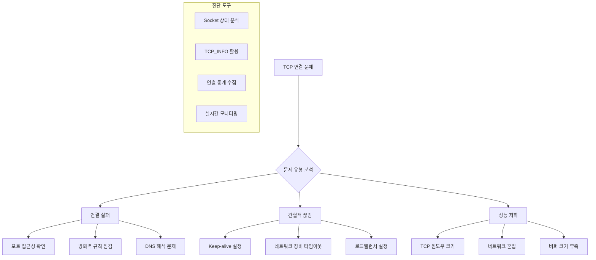

---
tags:
  - Network Debugging
  - TCP Connection
  - Socket Programming
  - C Programming
  - System Analysis
---

# Chapter.07-05A TCP 연결 분석 도구: C 기반 종합 진단

"연결이 자꾸 끊어져요"라는 문제를 정확히 진단하려면 저수준에서 TCP 연결 상태를 분석할 수 있어야 합니다. C 언어로 구현된 종합 TCP 분석 도구를 통해 연결 문제의 근본 원인을 찾아보겠습니다.

## TCP 연결 문제 진단 전략



## 1. TCP 연결 진단 도구 구현

종합적인 TCP 연결 문제 분석을 위한 C 기반 도구입니다.

```c
// tcp_connection_analyzer.c
#include <stdio.h>
#include <stdlib.h>
#include <string.h>
#include <unistd.h>
#include <sys/socket.h>
#include <netinet/in.h>
#include <netinet/tcp.h>
#include <arpa/inet.h>
#include <errno.h>
#include <fcntl.h>
#include <sys/epoll.h>
#include <time.h>
#include <signal.h>
#include <pthread.h>
#include <sys/types.h>
#include <ifaddrs.h>
#include <linux/sockios.h>
#include <sys/ioctl.h>

#define MAX_CONNECTIONS 1000
#define MAX_EVENTS 64
#define BUFFER_SIZE 4096
#define DEFAULT_PORT 8080

// 연결 정보를 저장하는 구조체
// 각 TCP 연결의 상태와 메트릭을 추적합니다
typedef struct {
    int fd;                      // 소켓 파일 디스크립터
    struct sockaddr_in addr;     // 원격 주소 정보
    time_t connect_time;         // 연결 생성 시간
    time_t last_activity;        // 마지막 활동 시간
    int state;                   // 연결 상태 (사용자 정의)
    uint64_t bytes_sent;         // 전송된 바이트 수
    uint64_t bytes_received;     // 수신된 바이트 수
    int error_count;             // 오류 발생 횟수
} connection_info_t;

// 전역 분석기 상태를 관리하는 구조체
// 스레드 안전성과 전체 통계를 보장합니다
typedef struct {
    connection_info_t connections[MAX_CONNECTIONS];  // 연결 배열
    int connection_count;        // 현재 활성 연결 수
    pthread_mutex_t mutex;       // 스레드 안전성을 위한 뮤텍스
    int running;                 // 실행 상태 플래그

    // 누적 통계 데이터
    uint64_t total_connections;      // 총 연결 시도 수
    uint64_t failed_connections;     // 실패한 연결 수
    uint64_t bytes_total_sent;       // 총 전송 바이트
    uint64_t bytes_total_received;   // 총 수신 바이트
    uint64_t connection_errors;      // 연결 오류 총 수

    // 사용자 설정 매개변수
    int target_port;             // 대상 포트
    char target_host[256];       // 대상 호스트
    int connection_timeout;      // 연결 타임아웃
    int keep_alive_timeout;      // Keep-alive 타임아웃
    int max_concurrent;          // 최대 동시 연결 수
} tcp_analyzer_t;

static tcp_analyzer_t analyzer;

// 사용법을 출력하는 함수
void print_usage(const char *prog_name) {
    printf("TCP 연결 분석기\n");
    printf("사용법: %s [옵션]\n", prog_name);
    printf("옵션:\n");
    printf("  -h HOST        대상 호스트 (기본값: localhost)\n");
    printf("  -p PORT        대상 포트 (기본값: 8080)\n");
    printf("  -c COUNT       최대 동시 연결 수 (기본값: 100)\n");
    printf("  -t TIMEOUT     연결 타임아웃 (초, 기본값: 30)\n");
    printf("  -k KEEPALIVE   Keep-alive 타임아웃 (초, 기본값: 60)\n");
    printf("  -m MODE        모드: client|server|monitor (기본값: monitor)\n");
    printf("  --help         이 도움말 출력\n");
}

// 소켓을 논블로킹 모드로 설정
// 대량의 연결을 효율적으로 처리하기 위해 필요합니다
int set_socket_nonblocking(int fd) {
    int flags = fcntl(fd, F_GETFL, 0);
    if (flags == -1) {
        perror("fcntl F_GETFL");
        return -1;
    }

    if (fcntl(fd, F_SETFL, flags | O_NONBLOCK) == -1) {
        perror("fcntl F_SETFL");
        return -1;
    }

    return 0;
}

// TCP 소켓의 다양한 옵션을 최적화하여 설정
int configure_socket_options(int fd) {
    int opt = 1;

    // SO_REUSEADDR: 같은 주소 재사용 허용
    // TIME_WAIT 상태의 소켓 주소를 즉시 재사용할 수 있게 합니다
    if (setsockopt(fd, SOL_SOCKET, SO_REUSEADDR, &opt, sizeof(opt)) < 0) {
        perror("setsockopt SO_REUSEADDR");
        return -1;
    }

    // TCP_NODELAY: Nagle 알고리즘 비활성화
    // 작은 패킷도 즉시 전송하여 지연시간을 줄입니다
    if (setsockopt(fd, IPPROTO_TCP, TCP_NODELAY, &opt, sizeof(opt)) < 0) {
        perror("setsockopt TCP_NODELAY");
        return -1;
    }

    // SO_KEEPALIVE: Keep-alive 기능 활성화
    // 비활성 연결을 자동으로 감지하고 정리합니다
    if (setsockopt(fd, SOL_SOCKET, SO_KEEPALIVE, &opt, sizeof(opt)) < 0) {
        perror("setsockopt SO_KEEPALIVE");
        return -1;
    }

    // Keep-alive 세부 설정
    int keepidle = 30;    // 30초 후 keep-alive 프로브 시작
    int keepintvl = 5;    // 5초 간격으로 프로브 전송
    int keepcnt = 3;      // 3번 연속 실패 시 연결 종료

    // TCP_KEEPIDLE: Keep-alive 프로브 시작 시간
    if (setsockopt(fd, IPPROTO_TCP, TCP_KEEPIDLE, &keepidle, sizeof(keepidle)) < 0) {
        perror("setsockopt TCP_KEEPIDLE");
    }

    // TCP_KEEPINTVL: Keep-alive 프로브 간격
    if (setsockopt(fd, IPPROTO_TCP, TCP_KEEPINTVL, &keepintvl, sizeof(keepintvl)) < 0) {
        perror("setsockopt TCP_KEEPINTVL");
    }

    // TCP_KEEPCNT: Keep-alive 프로브 최대 시도 횟수
    if (setsockopt(fd, IPPROTO_TCP, TCP_KEEPCNT, &keepcnt, sizeof(keepcnt)) < 0) {
        perror("setsockopt TCP_KEEPCNT");
    }

    return 0;
}

// Linux의 TCP_INFO를 활용한 상세 소켓 정보 수집
// RTT, 재전송, 윈도우 크기 등 TCP 성능 메트릭을 확인할 수 있습니다
void get_socket_info(int fd, char *buffer, size_t buffer_size) {
    struct tcp_info tcp_info;
    socklen_t tcp_info_len = sizeof(tcp_info);

    if (getsockopt(fd, IPPROTO_TCP, TCP_INFO, &tcp_info, &tcp_info_len) == 0) {
        snprintf(buffer, buffer_size,
            "상태: %d, RTT: %u us, 재전송: %u, 송신윈도우: %u, 수신윈도우: %u",
            tcp_info.tcpi_state,     // TCP 상태
            tcp_info.tcpi_rtt,       // 왕복 시간 (microseconds)
            tcp_info.tcpi_retrans,   // 재전송 횟수
            tcp_info.tcpi_snd_cwnd,  // 송신 혼잡 윈도우
            tcp_info.tcpi_rcv_space  // 수신 윈도우 크기
        );
    } else {
        snprintf(buffer, buffer_size, "TCP 정보 조회 실패");
    }
}

// 연결 통계를 종합적으로 출력하는 함수
void print_connection_stats() {
    pthread_mutex_lock(&analyzer.mutex);

    printf("\n=== TCP 연결 분석 결과 ===\n");
    printf("총 연결 시도: %lu\n", analyzer.total_connections);
    printf("실패한 연결: %lu (%.2f%%)\n",
           analyzer.failed_connections,
           analyzer.total_connections > 0 ?
           (double)analyzer.failed_connections / analyzer.total_connections * 100 : 0);
    printf("현재 활성 연결: %d\n", analyzer.connection_count);
    printf("총 송신 바이트: %lu\n", analyzer.bytes_total_sent);
    printf("총 수신 바이트: %lu\n", analyzer.bytes_total_received);
    printf("연결 오류: %lu\n", analyzer.connection_errors);

    printf("\n=== 활성 연결 상세 ===\n");
    time_t now = time(NULL);

    for (int i = 0; i < analyzer.connection_count; i++) {
        connection_info_t *conn = &analyzer.connections[i];
        char addr_str[INET_ADDRSTRLEN];
        char socket_info[512];

        inet_ntop(AF_INET, &conn->addr.sin_addr, addr_str, INET_ADDRSTRLEN);
        get_socket_info(conn->fd, socket_info, sizeof(socket_info));

        printf("연결 %d: %s:%d\n", i + 1, addr_str, ntohs(conn->addr.sin_port));
        printf("  연결 시간: %ld초 전\n", now - conn->connect_time);
        printf("  마지막 활동: %ld초 전\n", now - conn->last_activity);
        printf("  송신: %lu bytes, 수신: %lu bytes\n",
               conn->bytes_sent, conn->bytes_received);
        printf("  오류 수: %d\n", conn->error_count);
        printf("  TCP 정보: %s\n", socket_info);
        printf("\n");
    }

    pthread_mutex_unlock(&analyzer.mutex);
}

// 테스트 연결을 생성하는 함수
// 논블로킹 소켓으로 연결을 시도하고 EINPROGRESS를 적절히 처리합니다
int create_test_connection(const char *host, int port) {
    int fd = socket(AF_INET, SOCK_STREAM, 0);
    if (fd < 0) {
        perror("socket");
        return -1;
    }

    if (configure_socket_options(fd) < 0) {
        close(fd);
        return -1;
    }

    if (set_socket_nonblocking(fd) < 0) {
        close(fd);
        return -1;
    }

    struct sockaddr_in addr;
    memset(&addr, 0, sizeof(addr));
    addr.sin_family = AF_INET;
    addr.sin_port = htons(port);

    if (inet_pton(AF_INET, host, &addr.sin_addr) <= 0) {
        perror("inet_pton");
        close(fd);
        return -1;
    }

    // 논블로킹 연결 시도
    // EINPROGRESS는 정상적인 상황입니다
    int result = connect(fd, (struct sockaddr*)&addr, sizeof(addr));
    if (result < 0 && errno != EINPROGRESS) {
        perror("connect");
        close(fd);
        return -1;
    }

    return fd;
}

// 주기적으로 연결 통계를 모니터링하는 스레드
void* connection_monitor_thread(void* arg) {
    while (analyzer.running) {
        print_connection_stats();
        sleep(10);  // 10초마다 통계 출력
    }
    return NULL;
}

// 스트레스 테스트를 수행하는 워커 스레드
void* stress_test_thread(void* arg) {
    int connections_per_thread = *(int*)arg;

    for (int i = 0; i < connections_per_thread && analyzer.running; i++) {
        int fd = create_test_connection(analyzer.target_host, analyzer.target_port);

        pthread_mutex_lock(&analyzer.mutex);
        analyzer.total_connections++;

        if (fd >= 0) {
            // 연결 성공 시 연결 배열에 추가
            if (analyzer.connection_count < MAX_CONNECTIONS) {
                connection_info_t *conn = &analyzer.connections[analyzer.connection_count];
                conn->fd = fd;
                conn->connect_time = time(NULL);
                conn->last_activity = conn->connect_time;
                conn->state = 1;  // 연결됨
                conn->bytes_sent = 0;
                conn->bytes_received = 0;
                conn->error_count = 0;
                analyzer.connection_count++;
            } else {
                close(fd);  // 최대 연결 수 초과 시 소켓 닫기
            }
        } else {
            analyzer.failed_connections++;
        }
        pthread_mutex_unlock(&analyzer.mutex);

        usleep(100000);  // 100ms 대기하여 부하 조절
    }

    return NULL;
}

// 다중 스레드를 이용한 연결 스트레스 테스트
void run_stress_test(int num_connections, int num_threads) {
    printf("스트레스 테스트 시작: %d개 연결, %d개 스레드\n",
           num_connections, num_threads);

    pthread_t threads[num_threads];
    pthread_t monitor_thread;
    int connections_per_thread = num_connections / num_threads;

    analyzer.running = 1;

    // 모니터링 스레드 시작
    if (pthread_create(&monitor_thread, NULL, connection_monitor_thread, NULL) != 0) {
        perror("pthread_create monitor");
        return;
    }

    // 스트레스 테스트 스레드들 시작
    for (int i = 0; i < num_threads; i++) {
        if (pthread_create(&threads[i], NULL, stress_test_thread,
                          &connections_per_thread) != 0) {
            perror("pthread_create stress");
            break;
        }
    }

    // 모든 워커 스레드 완료 대기
    for (int i = 0; i < num_threads; i++) {
        pthread_join(threads[i], NULL);
    }

    // 30초 더 모니터링하여 연결 상태 관찰
    sleep(30);

    analyzer.running = 0;
    pthread_join(monitor_thread, NULL);

    // 리소스 정리
    pthread_mutex_lock(&analyzer.mutex);
    for (int i = 0; i < analyzer.connection_count; i++) {
        close(analyzer.connections[i].fd);
    }
    analyzer.connection_count = 0;
    pthread_mutex_unlock(&analyzer.mutex);

    print_connection_stats();
}

// 시스템 네트워크 스택 상태를 종합 분석
void analyze_network_stack() {
    printf("\n=== 네트워크 스택 분석 ===\n");

    // 현재 TCP 연결 상태 확인
    system("echo '=== 현재 TCP 연결 상태 ==='");
    system("ss -tuln | head -20");

    printf("\n");
    system("echo '=== TCP 연결 통계 ==='");
    system("ss -s");

    printf("\n");
    system("echo '=== 네트워크 인터페이스 통계 ==='");
    system("cat /proc/net/dev | head -10");

    printf("\n");
    system("echo '=== TCP 설정 확인 ==='");
    system("sysctl net.ipv4.tcp_keepalive_time");
    system("sysctl net.ipv4.tcp_keepalive_probes");
    system("sysctl net.ipv4.tcp_keepalive_intvl");
    system("sysctl net.core.somaxconn");
    system("sysctl net.ipv4.tcp_max_syn_backlog");

    printf("\n");
    system("echo '=== 소켓 통계 ==='");
    system("cat /proc/net/sockstat");
}

// 시그널 핸들러 - 프로그램 정리를 위해
void signal_handler(int sig) {
    printf("\n신호 %d 수신, 정리 중...\n", sig);
    analyzer.running = 0;
}

int main(int argc, char *argv[]) {
    // 기본값 설정
    strcpy(analyzer.target_host, "127.0.0.1");
    analyzer.target_port = DEFAULT_PORT;
    analyzer.connection_timeout = 30;
    analyzer.keep_alive_timeout = 60;
    analyzer.max_concurrent = 100;

    char mode[20] = "monitor";

    // 명령행 인자 처리
    for (int i = 1; i < argc; i++) {
        if (strcmp(argv[i], "-h") == 0 && i + 1 < argc) {
            strcpy(analyzer.target_host, argv[++i]);
        } else if (strcmp(argv[i], "-p") == 0 && i + 1 < argc) {
            analyzer.target_port = atoi(argv[++i]);
        } else if (strcmp(argv[i], "-c") == 0 && i + 1 < argc) {
            analyzer.max_concurrent = atoi(argv[++i]);
        } else if (strcmp(argv[i], "-t") == 0 && i + 1 < argc) {
            analyzer.connection_timeout = atoi(argv[++i]);
        } else if (strcmp(argv[i], "-k") == 0 && i + 1 < argc) {
            analyzer.keep_alive_timeout = atoi(argv[++i]);
        } else if (strcmp(argv[i], "-m") == 0 && i + 1 < argc) {
            strcpy(mode, argv[++i]);
        } else if (strcmp(argv[i], "--help") == 0) {
            print_usage(argv[0]);
            return 0;
        }
    }

    // 시그널 핸들러 설정
    signal(SIGINT, signal_handler);
    signal(SIGTERM, signal_handler);

    // 뮤텍스 초기화
    if (pthread_mutex_init(&analyzer.mutex, NULL) != 0) {
        perror("pthread_mutex_init");
        return 1;
    }

    printf("TCP 연결 분석기 시작\n");
    printf("대상: %s:%d\n", analyzer.target_host, analyzer.target_port);
    printf("모드: %s\n", mode);

    if (strcmp(mode, "monitor") == 0) {
        // 네트워크 스택 모니터링 모드
        analyze_network_stack();
    } else if (strcmp(mode, "stress") == 0) {
        // 연결 스트레스 테스트 모드
        run_stress_test(analyzer.max_concurrent, 4);
    } else if (strcmp(mode, "client") == 0) {
        // 단일 클라이언트 연결 테스트
        int fd = create_test_connection(analyzer.target_host, analyzer.target_port);
        if (fd >= 0) {
            printf("연결 성공: %d\n", fd);

            char socket_info[512];
            get_socket_info(fd, socket_info, sizeof(socket_info));
            printf("TCP 정보: %s\n", socket_info);

            sleep(5);
            close(fd);
        } else {
            printf("연결 실패\n");
        }
    }

    pthread_mutex_destroy(&analyzer.mutex);
    return 0;
}
```

## 컴파일 및 사용 방법

```bash
# 컴파일 (pthread 라이브러리 링크 필요)
gcc -o tcp_analyzer tcp_connection_analyzer.c -lpthread

# 기본 모니터링 실행
./tcp_analyzer

# 특정 서버 연결 테스트
./tcp_analyzer -h 192.168.1.100 -p 80 -m client

# 스트레스 테스트 (100개 동시 연결)
./tcp_analyzer -h localhost -p 8080 -c 100 -m stress

# 네트워크 스택 전체 분석
./tcp_analyzer -m monitor
```

## 핵심 요점

### 1. TCP_INFO 활용

Linux의 TCP_INFO를 통해 RTT, 재전송 횟수, 윈도우 크기 등 TCP 성능 지표를 실시간으로 모니터링할 수 있습니다.

### 2. Keep-alive 최적화

TCP_KEEPIDLE, TCP_KEEPINTVL, TCP_KEEPCNT 옵션을 통해 연결 생명주기를 세밀하게 제어합니다.

### 3. 다중 스레드 테스트

여러 스레드를 활용한 동시 연결 테스트로 서버의 연결 처리 능력을 검증할 수 있습니다.

---

**다음**: [05b-connection-pool-optimization.md](05b-connection-pool-optimization.md)에서 연결 풀과 로드밸런서 최적화를 학습합니다.
